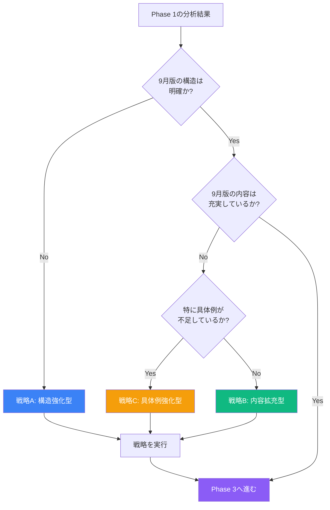

# Phase 2: 統合戦略の立案

**目的**: 優先順位・加筆基準・構造設計を決定

---

## 統合の優先順位（november_2025_update_prompt.md準拠）

### 優先順位の全体像

```yaml
integration_priority:
  priority_1_highest:
    what: "9月版の新規加筆内容"
    action: "100%保持"
    importance: "⭐⭐⭐⭐⭐"
    examples:
      - "9月版にしかない新しいビジネス事例"
      - "9月版にしかない新しい図解"
      - "9月版にしかない新しい概念説明"
    rule: "一文字も削らず、100%そのまま保持"

  priority_2_high:
    what: "7月版の充実した内容"
    action: "取り込む"
    importance: "⭐⭐⭐⭐"
    conditions:
      - "9月版より充実している説明"
      - "9月版で削られた重要な具体例"
      - "9月版で削られた有用な図解"
      - "重要な概念の詳細説明"
      - "実践的なTips"
    rule: "判断して取り込む（あえて薄くした部分は無理に詳しくしない）"

  priority_3_medium:
    what: "7月版の詳細な技術解説"
    action: "判断して取り込む"
    importance: "⭐⭐⭐"
    note: "あえて薄くした部分は無理に詳しくしない"
    criteria:
      - "講義で扱うか"
      - "非エンジニアに必要か"
      - "実践的か"

  priority_4_low:
    what: "重複する内容"
    action: "削除"
    importance: "-"
    note: "9月版と7月版で重複する内容は、9月版を採用"

  priority_5_avoid:
    what: "古い情報（2024年以前）"
    action: "削除"
    importance: "-"
    condition: "現在relevantでないもの"
```

---

## 加筆基準（november_2025_update_prompt.md準拠）

### 追加する要素

```yaml
add_if_exists_in_july:
  concrete_examples:
    what:
      - "ビジネス事例"
      - "コード例"
      - "スクリーンショット（言及）"
    criteria:
      - "9月版にない、または9月版より充実している"
      - "理解を助ける"
      - "実践的"
    action: "取り込む"

  diagrams:
    what:
      - "Mermaid フローチャート"
      - "比較図"
      - "マインドマップ"
    criteria:
      - "9月版にない、または9月版より優れている"
      - "視覚的にわかりやすい"
      - "情報量が適切"
    action: "取り込む"

  comparison_tables:
    what:
      - "Before/After"
      - "従来 vs Vibe Coder"
      - "ツール比較"
    criteria:
      - "9月版にない、または9月版より充実している"
      - "比較が明確"
      - "意思決定を助ける"
    action: "取り込む"

  detailed_explanations:
    what:
      - "「なぜそうするのか」の戦略的解説"
      - "背景にある思想"
      - "陥りやすい誤解の解説"
    criteria:
      - "9月版より充実している"
      - "深い理解を促す"
      - "実践に役立つ"
    action: "取り込む"

  practical_tips:
    what:
      - "よくあるエラーと対処法"
      - "ベストプラクティス"
      - "時短テクニック"
    criteria:
      - "9月版にない"
      - "実践的"
      - "すぐに使える"
    action: "取り込む"
```

### 追加しない要素

```yaml
do_not_add:
  duplicate_content:
    what: "❌ 重複する内容"
    reason: "9月版と7月版で同じ内容"
    action: "9月版を採用"

  skipped_technical_details:
    what: "❌ 講義でスキップする想定の詳細技術解説"
    reason: "あえて薄くした部分"
    action: "そのまま（無理に詳しくしない）"

  outdated_information:
    what: "❌ 古い情報（2024年以前で現在relevantでないもの）"
    reason: "現在の状況と合わない"
    action: "削除"
```

---

## 構造設計の原則

### ベース構造

```yaml
structure_design:
  base: "9月版の章構成を基本とする"
  reason: "9月版が最新の意図を反映"

  adjustments:
    if_marp_format:
      condition: "9月版がMarp形式の場合"
      action: "Markdown形式に変換"
      method: "--- 区切りを章・セクションに整理"

    if_messy_structure:
      condition: "構造がぐちゃぐちゃになっている場合"
      action: "論理的な流れに整理"
      principle: "1セクション1メッセージ"

    section_separators:
      use: "---"
      purpose: "セクション間の区切りを明確に"
      placement: "章と章の間、セクションとセクションの間"
```

### 必須要素

```yaml
mandatory_elements:
  yaml_frontmatter:
    what: "YAMLフロントマター（7項目完備）"
    items:
      - "title: 章のタイトル"
      - "track: VibeCoder育成プログラム - ライト版"
      - "author: TEKION Group VibeCoder育成プログラム運営チーム"
      - "last_updated: 2025年11月8日"
      - "category: AI駆動開発"
      - "duration: 90分"
      - "target_audience: 非エンジニア"

  lecture_level_sections:
    what: "講義レベル必須セクション"
    sections:
      - "## 🎯 この講義で学ぶこと"
      - "## 📌 この講義の位置づけ"
    placement: "講義の冒頭"

  chapter_opening:
    what: "章の冒頭に必須"
    sections:
      - "## 🎯 この章で学ぶこと"
      - "## 📌 この章の位置づけ"
    placement: "各章の冒頭"

  chapter_closing:
    what: "章の末尾に必須"
    sections:
      - "## 💡 この章のまとめ"
      - "## 🚀 次の章への橋渡し"
    placement: "各章の末尾"
```

### スタイル参照

```yaml
style_reference:
  use: "1-1をお手本にする"

  what:
    structure:
      - "YAMLフロントマター（7項目完備）"
      - "必須セクション（🎯📌💡🚀）の配置"
      - "章区切り（---）の使い方"
      - "セクション間の論理的つながり"

    tone:
      - "セミフォーマル"
      - "ポジティブ・エンパワーメント"
      - "非エンジニア向けの平易な表現"

    visual_style:
      - "Mermaid図のカラースキーム（#3b82f6, #10b981, #f59e0b, #ef4444）"
      - "表の見せ方（見出し太字、重要セル強調）"
      - "絵文字の使い方（🎯📌💡🚀✅）"
      - "強調技法（**太字**、`コード`、> 引用）"

  what_not:
    - "❌ 内容（9月版+7月版から取る）"
    - "❌ 文字数（1-1は特殊に長い）"
```

---

## 戦略の選択

### 戦略A: 構造強化型

```yaml
strategy_a:
  name: "構造強化型"
  when_to_use:
    - "9月版の構造がぐちゃぐちゃ"
    - "論理的な流れが不明瞭"
    - "セクション間のつながりが弱い"

  focus:
    - "構造の明確化"
    - "論理的な流れの整理"
    - "セクション間のつながり強化"

  actions:
    - "章・セクションを論理的に再構成"
    - "必須セクション（🎯📌💡🚀）を追加"
    - "章区切り（---）を適切に配置"
    - "1セクション1メッセージの原則を適用"

  expected_outcome:
    - "読みやすい流れ"
    - "明確な学習目標"
    - "自然なつながり"
```

### 戦略B: 内容拡充型

```yaml
strategy_b:
  name: "内容拡充型"
  when_to_use:
    - "9月版の構造は良好"
    - "内容が薄い"
    - "具体例・図解が不足"

  focus:
    - "7月版の充実した内容を大量に取り込む"
    - "具体例・図解を追加"
    - "詳細説明を充実"

  actions:
    - "7月版の充実した説明を統合"
    - "7月版の有用な図解を統合"
    - "7月版の実践的なTipsを統合"
    - "具体例を3-5倍に増やす"

  expected_outcome:
    - "充実した内容"
    - "豊富な具体例"
    - "わかりやすい図解"
```

### 戦略C: 具体例強化型

```yaml
strategy_c:
  name: "具体例強化型"
  when_to_use:
    - "9月版の構造は良好"
    - "理論説明は十分"
    - "具体例が不足"

  focus:
    - "具体例・ビジネス事例を大幅に増やす"
    - "理論:実例 = 1:3のバランス"

  actions:
    - "7月版の具体例をすべて統合"
    - "ビジネス事例を10個以上追加"
    - "各理論に3つ以上の例を配置"
    - "比較表を充実"

  expected_outcome:
    - "実践的な内容"
    - "イメージしやすい"
    - "すぐに使える"
```

---

## 戦略決定のフローチャート



---

## 統合計画書テンプレート

```markdown
# 統合計画書

## 選択した戦略

**戦略**: [A/B/C]
**理由**: [選択理由]

---

## 優先順位の確認

| 優先度 | 内容 | アクション | チェック |
|--------|------|-----------|---------|
| 1 | 9月版の新規加筆 | 100%保持 | [ ] |
| 2 | 7月版の充実した内容 | 取り込む | [ ] |
| 3 | 1-1の構造・トーン・スタイル | 適用 | [ ] |

---

## 加筆基準の適用

### 追加する要素

- [ ] 具体例・ビジネス事例
- [ ] Mermaid図
- [ ] 比較表
- [ ] 詳細説明（「なぜ」の解説）
- [ ] 実践的なTips

### 追加しない要素

- [ ] 重複する内容
- [ ] 講義でスキップする詳細技術解説
- [ ] 古い情報（2024年以前で現在relevantでないもの）

---

## 構造設計

### ベース

- **章構成**: 9月版の章構成を基本とする
- **章数**: [X]章
- **各章のタイトル**: [章1、章2、...]

### 変更点

- [ ] Marp形式 → Markdown形式に変換
- [ ] 構造の論理的整理
- [ ] 必須セクション（🎯📌💡🚀）の追加
- [ ] 章区切り（---）の適切な配置

### スタイル適用

- [ ] YAMLフロントマター（7項目完備）
- [ ] トーン（セミフォーマル、ポジティブ）
- [ ] 視覚スタイル（Mermaid色、表、絵文字、強調）

---

## 定量的目標

- **総行数**: 最低500行/章
- **Mermaid図**: 1-3個/章
- **表**: 2-4個/章
- **品質スコア**: 45/50以上

---

## 実行チェックリスト

### Phase 1の確認

- [ ] 9月版の新規加筆を特定済み
- [ ] 7月版の充実した内容を特定済み
- [ ] 1-1の構造・トーン・スタイルを理解済み

### Phase 2の完了

- [ ] 戦略を選択
- [ ] 優先順位を確認
- [ ] 加筆基準を適用
- [ ] 構造設計を決定
- [ ] 統合計画書を作成

### Phase 3への準備

- [ ] Phase 1の分析結果を参照可能
- [ ] Phase 2の統合計画書を参照可能
- [ ] 必要なファイル（9月版、7月版、1-1）を確認
```

---

## チェックリスト

### 優先順位の確認

- [ ] 9月版の新規加筆を100%保持することを確認
- [ ] 7月版の充実した内容を取り込むことを確認
- [ ] 1-1の構造・トーン・スタイルを適用することを確認
- [ ] 重複する内容を削除することを確認
- [ ] 古い情報を削除することを確認

### 加筆基準の適用

- [ ] 追加する要素（具体例、図解、表、詳細説明、Tips）を確認
- [ ] 追加しない要素（重複、スキップする技術解説、古い情報）を確認

### 構造設計の決定

- [ ] ベース構造（9月版の章構成）を確認
- [ ] 必須要素（YAMLフロントマター、必須セクション）を確認
- [ ] スタイル参照（1-1）を確認

### 戦略の選択

- [ ] Phase 1の分析結果に基づき戦略を選択
- [ ] 戦略A/B/Cのいずれかを明確に選択
- [ ] 選択理由を記録

### 統合計画書の作成

- [ ] テンプレートを使用して統合計画書を作成
- [ ] すべての項目を記入
- [ ] チェックリストを確認

---

**次のフェーズ**: [Phase 3: コンテンツ生成](phase-3-generation.md)
