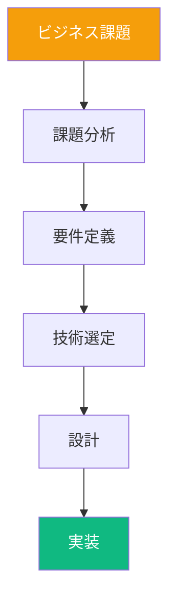
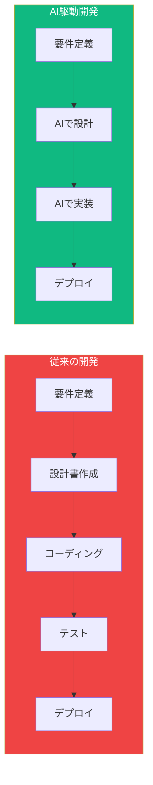
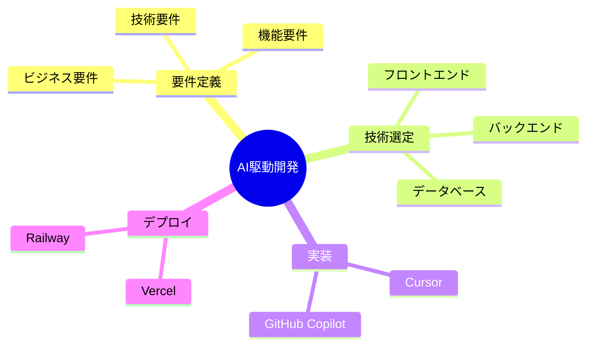

# Phase 3: コンテンツ生成

**目的**: YAMLフロントマター、必須セクション、章ごとの内容を生成

---

## ステップ3-1: YAMLフロントマター作成

### 目的

すべての講義資料に統一されたYAMLフロントマターを作成する。

### テンプレート

```yaml
---
title: "第X回講義 X-X_タイトル"
track: "VibeCoder育成プログラム - ライト版"
author: "TEKION Group VibeCoder育成プログラム運営チーム"
last_updated: "2025年11月8日"
category: "AI駆動開発"
duration: "90分"
target_audience: "非エンジニア"
---
```

### 項目説明

```yaml
yaml_frontmatter:
  title:
    format: "第X回講義 X-X_タイトル"
    example: "第2回講義 2-2_技術スタックとAI要件定義演習"

  track:
    fixed: "VibeCoder育成プログラム - ライト版"

  author:
    fixed: "TEKION Group VibeCoder育成プログラム運営チーム"

  last_updated:
    format: "YYYY年MM月DD日"
    example: "2025年11月8日"
    note: "生成日を記入"

  category:
    fixed: "AI駆動開発"
    alternatives:
      - "要件定義"
      - "技術選定"
      - "データベース"
      - "認証"
      - "デプロイ"

  duration:
    typical: "90分"
    note: "講義の想定時間"

  target_audience:
    fixed: "非エンジニア"
```

### 実装例

```markdown
---
title: "第2回講義 2-2_技術スタックとAI要件定義演習"
track: "VibeCoder育成プログラム - ライト版"
author: "TEKION Group VibeCoder育成プログラム運営チーム"
last_updated: "2025年11月8日"
category: "AI駆動開発"
duration: "90分"
target_audience: "非エンジニア"
---
```

---

## ステップ3-2: 講義レベル必須セクション作成

### 目的

講義全体の学習目標と位置づけを明確にする。

### 必須セクション

```markdown
# 第X回講義 X-X_タイトル

## 🎯 この講義で学ぶこと

- **[重要概念1]**を理解し、[成果物1]を習得
- **[重要概念2]**の実践方法を学び、[成果物2]を実装
- **[重要概念3]**を通じて、[スキル]を獲得
- [3-6項目]

## 📌 この講義の位置づけ

[前回の振り返り]を学びました。
この講義では、[今回のテーマ]を扱います。
[次回への接続]の土台となります。

---
```

### 作成ガイドライン

```yaml
learning_objectives:
  format: "## 🎯 この講義で学ぶこと"
  bullet_count: 3-6
  pattern: "- **[キーワード]**を[動詞]し、[成果]を[動詞]"
  verbs:
    - "理解する"
    - "習得する"
    - "実践する"
    - "学ぶ"
    - "身につける"
    - "獲得する"

positioning:
  format: "## 📌 この講義の位置づけ"
  structure:
    - "前回の振り返り（1-2文）"
    - "今回のテーマ（1-2文）"
    - "次回への接続（1文）"
  pattern: "[前回] → [今回] → [次回]"
```

### 実装例

```markdown
# 第2回講義 2-2_技術スタックとAI要件定義演習

## 🎯 この講義で学ぶこと

- **技術スタック**の構成要素を理解し、適切な技術選定ができるようになる
- **AI要件定義**の実践方法を学び、Claudeを活用した要件定義プロセスを習得
- **フロントエンド、バックエンド、データベース**の基礎知識を身につける
- **Next.js、Supabase、Clerk**などの具体的なツールを理解し、実装イメージを持つ
- **要件定義演習**を通じて、実際のビジネス課題をAIで解決する力を獲得

## 📌 この講義の位置づけ

第1回では、AI駆動開発の全体像と要件定義の基礎を学びました。
この講義では、具体的な技術選定とAI要件定義の実践方法を扱います。
第3回で学ぶデータベース・認証実装の基盤となる重要な内容です。

---
```

---

## ステップ3-3: 章ごとの生成ループ

### 目的

各章を統一されたフォーマットで生成する。

### 章生成のテンプレート

```markdown
# 第X章：[章タイトル]

## 🎯 この章で学ぶこと

- **[キーワード1]**を[動詞]
- **[キーワード2]**を[動詞]
- **[キーワード3]**を[動詞]
- [3-6項目]

## 📌 この章の位置づけ

[前章の振り返り]
この章では、[本章の内容]を学びます。
[次章への接続]

---

## [サブセクション1のタイトル]

### [小見出し1]

[段落1: 3-7行]

[段落2: 3-7行]

**[重要な概念の強調]**

```mermaid
[Mermaid図]
```

| 項目 | 内容1 | 内容2 |
|------|------|------|
| **項目1** | 説明 | 説明 |
| **項目2** | 説明 | 説明 |

---

## [サブセクション2のタイトル]

### [小見出し2]

[内容]

---

## 💡 この章のまとめ

- ✅ [学んだこと1]
- ✅ [学んだこと2]
- ✅ [学んだこと3]
- [3-7項目]

## 🚀 次の章への橋渡し

[この章の振り返り1-2文]
次章では、[次章の予告]を学びます。

---
```

### 章生成のフロー

```yaml
chapter_generation_loop:
  for_each_chapter:
    step_1_header:
      format: "# 第X章：[章タイトル]"
      source: "9月版のタイトルを基本とする"

    step_2_learning_objectives:
      section: "## 🎯 この章で学ぶこと"
      bullet_count: 3-6
      format: "- **[キーワード]**を...[動詞]"
      source:
        - "9月版の内容を分析"
        - "7月版の内容を参考"
        - "この章で何を学ぶか明確に"

    step_3_positioning:
      section: "## 📌 この章の位置づけ"
      content: "[前章] → [本章] → [次章]"
      structure:
        - "前章の振り返り（1文）"
        - "本章の内容（1-2文）"
        - "次章への接続（1文）"

    step_4_main_content:
      subsections: 3-5
      each_subsection:
        heading: "## [サブセクション]"
        small_headings: "### [小見出し]"
        paragraphs: "段落3-7行"
        visual_element: "Mermaid図 or 表（適宜）"
        emphasis: "**太字**、`コード`、> 引用"

      content_source:
        priority_1: "9月版の新規加筆（100%保持）"
        priority_2: "7月版の充実した内容（取り込む）"
        priority_3: "1-1のトーン・スタイル（適用）"

    step_5_summary:
      section: "## 💡 この章のまとめ"
      checklist_count: 3-7
      format: "- ✅ [学んだこと]"
      content: "この章の重要ポイントを箇条書き"

    step_6_transition:
      section: "## 🚀 次の章への橋渡し"
      content: "[振り返り] → [次章予告]"
      structure:
        - "この章の振り返り（1-2文）"
        - "次章の予告（1文）"

    step_7_separator:
      marker: "---"
      placement: "章と章の間"
```

### 段落の書き方

```yaml
paragraph_guidelines:
  length: "3-7行"
  sentence_length: "30-60文字"

  structure:
    - "導入文（1-2文）"
    - "詳細説明（2-4文）"
    - "まとめ・次への接続（1文）"

  tone:
    - "セミフォーマル"
    - "ポジティブ"
    - "非エンジニア向けの平易な表現"

  emphasis:
    bold: "**重要な概念・キーワード**"
    code: "`ツール名・技術用語`"
    quote: "> 重要な注意事項"

  examples:
    good: |
      Vibe Coderの本質は、**コンテクストコントロール**にあります。
      これは、AIに適切な情報を与え、望む結果を引き出す技術です。
      従来のプログラマーがコードでシステムを制御するように、
      Vibe Coderはコンテクストでシステムを制御します。
      この違いを理解することが、AI駆動開発の第一歩です。
```

---

## ステップ3-4: Mermaid図の挿入

### 目的

視覚的な理解を助けるMermaid図を適切に配置する。

### 図の挿入ガイドライン

```yaml
mermaid_guidelines:
  frequency: "1-3図/章"

  placement:
    - "概念説明の後"
    - "フローの説明時"
    - "比較・対比の説明時"

  types:
    graph_tb:
      use_case: "階層関係、フロー"
      example: |
        ```mermaid
        graph TB
            A[Vibe Coder] --> B[コンテクスト設計]
            A --> C[プロンプト作成]
            A --> D[AI活用]

            B --> E[成果物]
            C --> E
            D --> E

            style A fill:#3b82f6,color:#fff
            style E fill:#10b981,color:#fff
        ```

    flowchart:
      use_case: "プロセス、意思決定"
      example: |
        ```mermaid
        flowchart LR
            Start[要件定義] --> Design[設計]
            Design --> Implement[実装]
            Implement --> Test[テスト]
            Test --> Deploy[デプロイ]

            style Start fill:#10b981,color:#fff
            style Deploy fill:#3b82f6,color:#fff
        ```

    mindmap:
      use_case: "概念マップ、カテゴリ整理"
      example: |
        ```mermaid
        mindmap
          root((技術スタック))
            フロントエンド
              Next.js
              React
              Tailwind CSS
            バックエンド
              Supabase
              Prisma
            認証
              Clerk
            デプロイ
              Vercel
        ```

  color_scheme:
    primary: "#3b82f6"
    success: "#10b981"
    warning: "#f59e0b"
    error: "#ef4444"
    other: "#8b5cf6, #fbbf24"

  best_practices:
    - "ノード名は簡潔に（3-5語）"
    - "矢印の向きを統一"
    - "カラースキームを統一（1-1準拠）"
    - "複雑すぎないように（ノード10個以内）"
```

### 図のタイプ別実装例

#### 1. フローチャート（プロセス説明）



#### 2. 比較図（Before/After）



#### 3. マインドマップ（概念整理）



---

## ステップ3-5: 表の挿入

### 目的

比較・整理された情報を表形式で提示する。

### 表の挿入ガイドライン

```yaml
table_guidelines:
  frequency: "2-4表/章"

  placement:
    - "比較説明時"
    - "スキルマトリックス"
    - "ワークフロー説明時"
    - "ツール比較時"

  types:
    comparison:
      columns: 3-5
      use_case: "従来 vs AI駆動、Before vs After"
      example: |
        | 項目 | 従来の方法 | AI駆動開発 |
        |------|-----------|-----------|
        | **開発速度** | 数週間 | **数日** |
        | **品質** | 中程度 | **高品質** |
        | **学習コスト** | 高い | **低い** |

    skills_matrix:
      columns: 4-6
      use_case: "スキルレベル、学習ステップ"
      example: |
        | スキル | 初級 | 中級 | 上級 |
        |--------|------|------|------|
        | **プロンプト作成** | ✅ | ✅ | ✅ |
        | **要件定義** | ✅ | ✅ | - |
        | **デバッグ** | ✅ | - | - |

    workflow:
      columns: 3-4
      use_case: "ステップバイステップ"
      example: |
        | ステップ | 作業内容 | ツール |
        |---------|---------|--------|
        | **1** | 要件定義 | `Claude` |
        | **2** | UI設計 | `v0` |
        | **3** | 実装 | `Cursor` |

  formatting:
    header: "**太字**"
    important_cells: "**太字** または `コード`"
    alignment: "左揃え（デフォルト）"
    width: "3-5列が最適"
```

### 表のタイプ別実装例

#### 1. 比較表（Before/After）

```markdown
| 項目 | 従来の開発 | AI駆動開発 | 改善率 |
|------|-----------|-----------|--------|
| **開発期間** | 3ヶ月 | **1週間** | **92%短縮** |
| **コード量** | 10,000行 | **2,000行** | **80%削減** |
| **学習期間** | 6ヶ月 | **1週間** | **96%短縮** |
| **品質** | 中程度 | **高品質** | - |
| **保守性** | 低い | **高い** | - |
```

#### 2. ツール比較表

```markdown
| ツール | 用途 | 難易度 | 推奨度 |
|--------|------|--------|--------|
| **Next.js** | フロントエンド | ⭐⭐⭐ | ⭐⭐⭐⭐⭐ |
| **Supabase** | バックエンド | ⭐⭐ | ⭐⭐⭐⭐⭐ |
| **Clerk** | 認証 | ⭐ | ⭐⭐⭐⭐⭐ |
| **Vercel** | デプロイ | ⭐ | ⭐⭐⭐⭐⭐ |
```

#### 3. ワークフロー表

```markdown
| フェーズ | タスク | ツール | 所要時間 |
|---------|--------|--------|---------|
| **要件定義** | ビジネス要件整理 | `Claude` | 30分 |
| **要件定義** | 機能要件作成 | `Claude` | 1時間 |
| **設計** | UI設計 | `v0` | 1時間 |
| **実装** | コーディング | `Cursor` | 3時間 |
| **デプロイ** | 本番環境構築 | `Vercel` | 15分 |
```

---

## 統合のベストプラクティス

### 9月版の新規加筆を100%保持

```yaml
preserve_september_additions:
  rule: "一文字も削らず、そのまま保持"

  how_to_identify:
    - "Phase 1のステップ1-1で特定済み"
    - "9月版の新規加筆リストを参照"

  how_to_preserve:
    - "該当箇所をそのままコピー"
    - "前後の文脈を調整"
    - "9月版の表現・トーンを保持"

  verification:
    - "9月版と11月版を比較"
    - "新規加筆が100%存在することを確認"
```

### 7月版の充実した内容を統合

```yaml
integrate_july_content:
  rule: "判断して取り込む"

  what_to_integrate:
    - "より充実している説明"
    - "より豊富な具体例"
    - "有用な図解"
    - "実践的なTips"

  how_to_integrate:
    method_1_replace:
      condition: "7月版が明らかに充実"
      action: "7月版の説明を採用"

    method_2_merge:
      condition: "9月版と7月版の両方に価値"
      action: "9月版+7月版を統合"

    method_3_add:
      condition: "9月版にない有用な内容"
      action: "7月版から追加"

  verification:
    - "Phase 1のステップ1-2で特定した内容をすべて確認"
    - "取り込み漏れがないことを確認"
```

### 1-1の構造・トーン・スタイルを適用

```yaml
apply_1_1_style:
  structure:
    - "YAMLフロントマター（7項目完備）"
    - "必須セクション（🎯📌💡🚀）"
    - "章区切り（---）"

  tone:
    - "セミフォーマル"
    - "ポジティブ・エンパワーメント"
    - "非エンジニア向けの平易な表現"

  visual_style:
    - "Mermaid図のカラースキーム"
    - "表の見せ方"
    - "絵文字の使い方"
    - "強調技法"

  how_to_apply:
    - "1-1を常に参照"
    - "同じトーンで書く"
    - "同じ視覚スタイルで作成"
```

---

## チェックリスト

### YAMLフロントマター

- [ ] 7項目すべて記入
- [ ] title、track、author、last_updated、category、duration、target_audience

### 講義レベル必須セクション

- [ ] 🎯 この講義で学ぶこと（3-6項目）
- [ ] 📌 この講義の位置づけ

### 章ごとの生成

- [ ] 各章に🎯 この章で学ぶこと
- [ ] 各章に📌 この章の位置づけ
- [ ] 各章に💡 この章のまとめ
- [ ] 各章に🚀 次の章への橋渡し
- [ ] 章区切りに --- を使用

### Mermaid図

- [ ] 1-3図/章
- [ ] カラースキーム統一（1-1準拠）
- [ ] 適切な配置

### 表

- [ ] 2-4表/章
- [ ] 見出し太字
- [ ] 重要セル強調
- [ ] 適切な配置

### 統合の確認

- [ ] 9月版の新規加筆を100%保持
- [ ] 7月版の充実した内容を統合
- [ ] 1-1の構造・トーン・スタイルを適用

---

**次のフェーズ**: [Phase 4: 品質検証](phase-4-verification.md)
