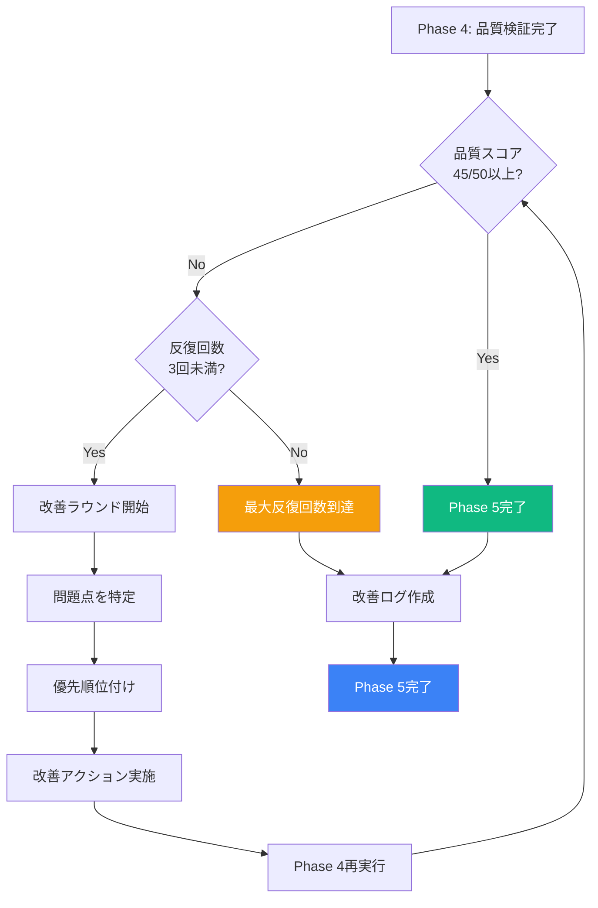

# Phase 5: 反復改善

**目的**: 品質スコア45/50以上まで改善

---

## ステップ5-1: prompt-optimization Skillによる改善

### 目的

品質検証で問題が見つかった場合、prompt-optimization Skillを使用して自動改善。

### トリガー条件

```yaml
optimization_workflow:
  trigger_conditions:
    score_based:
      condition: "品質スコア < 45/50"
      action: "prompt-optimization Skillを使用"

    quantitative_based:
      condition: "定量的指標が範囲外"
      examples:
        - "総行数 < 500行"
        - "Mermaid図 < 1個/章"
        - "表 < 2個/章"
      action: "Phase 3に戻り、不足分を追加"

    integration_based:
      condition: "9月版・7月版との比較で不足"
      examples:
        - "9月版の新規加筆が100%保持されていない"
        - "7月版の充実した内容が統合されていない"
      action: "Phase 1の分析結果を再確認し、Phase 3で追加"
```

### 改善手法

```yaml
optimization_method:
  use_skill: "prompt-optimization"

  technique: "OPRO + Self-Refine"

  opro:
    what: "Optimization by PROmpting"
    how: "プロンプトを反復的に改善"
    steps:
      - "現在のプロンプトで生成"
      - "品質を評価"
      - "プロンプトを改善"
      - "再生成"

  self_refine:
    what: "Self-Refine"
    how: "生成物を自己評価して改善"
    steps:
      - "コンテンツ生成"
      - "自己評価"
      - "改善点を特定"
      - "改善を実施"

  max_iterations: 3
  stop_condition: "品質スコア >= 45/50"
```

### 改善プロセス

```yaml
improvement_process:
  iteration_1:
    step_1_identify_issues:
      - "Phase 4の品質スコアシートを確認"
      - "得点が低いカテゴリを特定"
      - "具体的な問題点をリストアップ"

    step_2_prioritize:
      priority_1: "9月版の新規加筆不足（最優先）"
      priority_2: "7月版の充実した内容不足（高優先）"
      priority_3: "構造・視覚要素の問題（中優先）"
      priority_4: "文章品質の問題（低優先）"

    step_3_apply_fixes:
      method: "優先順位に従って改善"
      tools:
        - "Phase 1の分析結果を参照"
        - "Phase 2の統合計画を参照"
        - "Phase 3のガイドラインを参照"

    step_4_re_verify:
      - "Phase 4の品質検証を再実行"
      - "スコアが向上したか確認"

  iteration_2:
    condition: "スコア < 45/50"
    action: "iteration_1と同じプロセスを繰り返し"

  iteration_3:
    condition: "スコア < 45/50"
    action: "iteration_1と同じプロセスを繰り返し"

  max_iterations: 3
  stop_condition: "スコア >= 45/50 または 3回反復"
```

---

## ステップ5-2: 改善の記録

### 目的

改善プロセスを記録し、次回の生成に活かす。

### 改善ログテンプレート

```markdown
# 改善ログ

## ファイル: X-X_タイトル.md

---

## ラウンド1

### 初期スコア
**総合スコア**: XX/50
**ランク**: ⭐⭐⭐⭐ / ⭐⭐⭐ / ⭐⭐ / ⭐

### 検出された問題
1. **[カテゴリ]**: [問題点の詳細]
2. **[カテゴリ]**: [問題点の詳細]
3. **[カテゴリ]**: [問題点の詳細]

### 適用した改善策
1. **[カテゴリ]**: [改善内容]
   - 実施したアクション: [詳細]
   - 参照した資料: [Phase X のステップ Y]

2. **[カテゴリ]**: [改善内容]
   - 実施したアクション: [詳細]
   - 参照した資料: [Phase X のステップ Y]

3. **[カテゴリ]**: [改善内容]
   - 実施したアクション: [詳細]
   - 参照した資料: [Phase X のステップ Y]

### 結果
**総合スコア**: XX/50 → YY/50 (向上: +Z点)
**ランク**: ⭐⭐⭐⭐ → ⭐⭐⭐⭐⭐

### カテゴリ別スコア変化
| カテゴリ | 改善前 | 改善後 | 変化 |
|---------|--------|--------|------|
| 構造 | X点 | Y点 | +Z点 |
| 視覚要素 | X点 | Y点 | +Z点 |
| 教育効果 | X点 | Y点 | +Z点 |
| 文章品質 | X点 | Y点 | +Z点 |
| 一貫性 | X点 | Y点 | +Z点 |

---

## ラウンド2

### 残存する問題
1. **[カテゴリ]**: [問題点の詳細]
2. **[カテゴリ]**: [問題点の詳細]

### 適用した改善策
1. **[カテゴリ]**: [改善内容]
   - 実施したアクション: [詳細]
   - 参照した資料: [Phase X のステップ Y]

2. **[カテゴリ]**: [改善内容]
   - 実施したアクション: [詳細]
   - 参照した資料: [Phase X のステップ Y]

### 結果
**総合スコア**: YY/50 → ZZ/50 (向上: +W点)
**ランク**: ⭐⭐⭐⭐ → ⭐⭐⭐⭐⭐

---

## ラウンド3

（必要な場合のみ）

---

## 最終結果

### 総合スコア
**初期**: XX/50
**最終**: ZZ/50
**向上**: +W点

### 評価ランク
**ランク**: ⭐⭐⭐⭐⭐（優秀）
**判定**: そのまま使用可

### 主要な改善点
1. [改善点1]
2. [改善点2]
3. [改善点3]

### 次回への教訓
1. [教訓1]
2. [教訓2]
3. [教訓3]
```

---

## 問題別の改善アクション

### 問題1: 9月版の新規加筆が不足

```yaml
issue: "9月版の新規加筆が100%保持されていない"
priority: "最優先"

diagnosis:
  - "Phase 4のステップ4-1で検出"
  - "Phase 1のステップ1-1で特定した新規加筆リストと照合"

action:
  step_1: "Phase 1の新規加筆リストを確認"
  step_2: "不足している新規加筆を特定"
  step_3: "9月版から該当箇所をコピー"
  step_4: "11月版の適切な位置に挿入"
  step_5: "前後の文脈を調整"

verification:
  - "Phase 4のステップ4-1を再実行"
  - "新規加筆が100%存在することを確認"

expected_result: "スコア +5-10点"
```

### 問題2: 7月版の充実した内容が不足

```yaml
issue: "7月版の充実した内容が統合されていない"
priority: "高"

diagnosis:
  - "Phase 4のステップ4-1で検出"
  - "Phase 1のステップ1-2で特定した充実した内容リストと照合"

action:
  step_1: "Phase 1の充実した内容リストを確認"
  step_2: "不足している内容を特定"
  step_3: "7月版から該当箇所を抽出"
  step_4: "11月版に統合（置換 or 追加 or 統合）"
  step_5: "論理的な流れを調整"

verification:
  - "Phase 4のステップ4-1を再実行"
  - "充実した内容が統合されていることを確認"

expected_result: "スコア +3-7点"
```

### 問題3: 構造が不完全

```yaml
issue: "必須セクション（🎯📌💡🚀）が不足"
priority: "中"

diagnosis:
  - "Phase 4のステップ4-2で検出"
  - "どのセクションが不足しているか特定"

action:
  step_1: "不足しているセクションをリストアップ"
  step_2: "Phase 3のステップ3-3のテンプレートを参照"
  step_3: "不足しているセクションを生成"
  step_4: "適切な位置に挿入"

verification:
  - "Phase 4のステップ4-2を再実行"
  - "すべての必須セクションが存在することを確認"

expected_result: "スコア +2-4点"
```

### 問題4: 視覚要素が不足

```yaml
issue: "Mermaid図や表が不足"
priority: "中"

diagnosis:
  - "Phase 4のステップ4-3で検出"
  - "Mermaid図 < 1個/章 または 表 < 2個/章"

action:
  step_1: "Phase 1のステップ1-2で特定した7月版の有用な図解を確認"
  step_2: "不足分を7月版から取り込む"
  step_3: "Phase 3のステップ3-4, 3-5のガイドラインに従って配置"
  step_4: "カラースキーム・フォーマットを1-1準拠に調整"

verification:
  - "Phase 4のステップ4-3を再実行"
  - "Mermaid図 1-3個/章、表 2-4個/章を確認"

expected_result: "スコア +2-4点"
```

### 問題5: 文章品質が低い

```yaml
issue: "トーン、読みやすさ、強調技法の問題"
priority: "低"

diagnosis:
  - "Phase 4のステップ4-4で検出"
  - "具体的な問題点を特定"

action:
  tone_issue:
    - "1-1のトーンを参照"
    - "セミフォーマル、ポジティブ・エンパワーメントに調整"
    - "非エンジニア向けの平易な表現に変更"

  readability_issue:
    - "段落長を3-7行に調整"
    - "文長を30-60文字に調整"
    - "長すぎる段落を分割"

  emphasis_issue:
    - "重要な概念を**太字**に"
    - "ツール名・技術用語を`コード`に"
    - "重要な注意事項を> 引用に"

verification:
  - "Phase 4のステップ4-4を再実行"
  - "文章品質が向上していることを確認"

expected_result: "スコア +1-3点"
```

---

## 反復改善のフローチャート



---

## 成功基準

### 最終目標

```yaml
final_goals:
  quality_score:
    target: "45/50以上"
    ranking: "⭐⭐⭐⭐⭐（優秀）"

  integration:
    - "9月版の新規加筆100%保持"
    - "7月版の充実した内容統合"
    - "1-1の構造・トーン・スタイル適用"

  structure:
    - "YAMLフロントマター（7項目完備）"
    - "必須セクション（🎯📌💡🚀）完備"
    - "章区切り（---）適切に配置"

  quantitative:
    - "総行数 >= 500行/章"
    - "Mermaid図 1-3個/章"
    - "表 2-4個/章"

  quality:
    - "視覚要素統一"
    - "教育効果高い"
    - "文章品質高い"
    - "一貫性保つ"
```

### 完了条件

```yaml
completion_criteria:
  mandatory:
    - "品質スコア >= 45/50"
    - "9月版の新規加筆100%保持"
    - "必須セクション（🎯📌💡🚀）完備"

  optional:
    - "品質スコア = 50/50（理想）"
    - "すべての定量的指標が範囲内"
    - "改善ログ作成完了"

  termination_conditions:
    - "品質スコア >= 45/50達成"
    - "最大反復回数（3回）到達"
```

---

## チェックリスト

### ステップ5-1: prompt-optimization Skill

- [ ] トリガー条件を確認（スコア < 45/50）
- [ ] 改善手法を選択（OPRO + Self-Refine）
- [ ] 反復改善プロセスを実行（最大3回）

### ステップ5-2: 改善の記録

- [ ] 改善ログテンプレートを使用
- [ ] 各ラウンドの改善内容を記録
- [ ] 最終結果を記録
- [ ] 次回への教訓を記録

### 問題別の改善アクション

- [ ] 9月版の新規加筆不足 → Phase 1の新規加筆リストを確認し追加
- [ ] 7月版の充実した内容不足 → Phase 1の充実した内容リストを確認し統合
- [ ] 構造が不完全 → 必須セクションを追加
- [ ] 視覚要素が不足 → Mermaid図・表を追加
- [ ] 文章品質が低い → トーン・読みやすさ・強調技法を改善

### 成功基準

- [ ] 品質スコア >= 45/50
- [ ] 9月版の新規加筆100%保持
- [ ] 必須セクション（🎯📌💡🚀）完備

---

**完了**: 全5フェーズ完了、高品質な講義資料が生成されました
