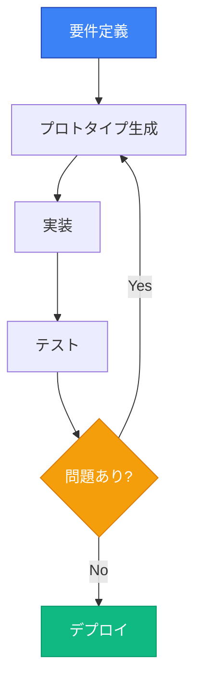
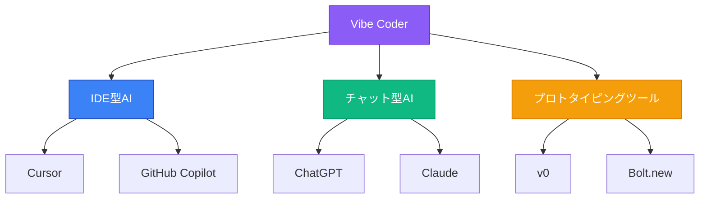
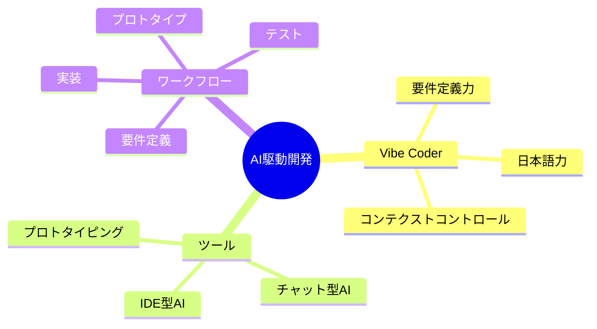
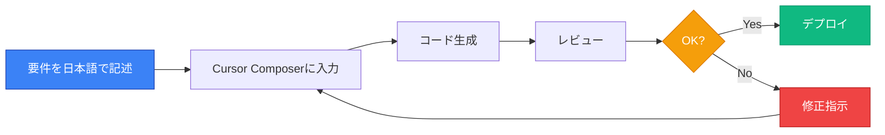
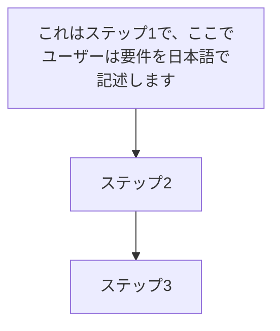

# 視覚要素基準詳細

VibeCoder育成プログラム講義資料の視覚要素に関する詳細な品質基準

---

## 絵文字使用ガイドライン

### 標準絵文字マッピング

| セクションタイプ | 絵文字 | 使用場所 |
|----------------|-------|---------|
| **学習目標** | 🎯 | "この章/講義で学ぶこと" |
| **位置づけ** | 📌 | "この章/講義の位置づけ" |
| **まとめ** | 💡 | "この章のまとめ" |
| **橋渡し** | 🚀 | "次の章への橋渡し" |
| **チェックリスト** | ✅ | タスクリスト |
| **警告** | ⚠️ | 注意事項 |
| **重要アラート** | 🚨 | 非常に重要な注意 |
| **強調** | 💥/🔥/⚡ | インパクトのある事実 |

### 使用頻度

- **全体**: 80-150回/講義
- **章あたり**: 10-20回
- **過度な使用は避ける**: 連続3回以上は禁止

### 良い例 vs 悪い例

#### ❌ 悪い例（過度な使用）

```markdown
## 🎯💡🚀 この章で学ぶこと

- 🔥🔥🔥 超重要！！！
- ⚡⚡⚡ 必見！！！
```

#### ✅ 良い例（適切な使用）

```markdown
## 🎯 この章で学ぶこと

- **Cursor**の基本操作とComposerモード
- **コンテクストコントロール**の実践技法
- ⚠️ 注意：APIキーの管理について
```

---

## Mermaid図作成ルール

### 頻度

- **章あたり**: 1-3個
- **講義全体**: 12-20個
- **配置**: 概念説明の直後、ワークフロー説明時

### 図のタイプ

#### 1. フローチャート（flowchart TB/LR）

**用途**: プロセス、ワークフロー、ステップ



#### 2. グラフ（graph TB/LR）

**用途**: 関係図、階層構造



#### 3. マインドマップ（mindmap）

**用途**: 概念の整理、要素の列挙



### スタイリング規則

#### カラーパレット（統一）

| 用途 | カラーコード | 説明 |
|------|------------|------|
| **Primary（青）** | `#3b82f6` | 主要な要素、開始ノード |
| **Success（緑）** | `#10b981` | 成功、完了、推奨 |
| **Warning（オレンジ）** | `#f59e0b` | 注意、選択肢 |
| **Error（赤）** | `#ef4444` | エラー、禁止 |
| **Purple** | `#8b5cf6` | ルート、重要概念 |
| **Yellow** | `#fbbf24` | 補足、サブ要素 |

#### スタイル構文

```
style NodeName fill:#color,stroke:#darker_color,color:#fff
```

**例**:
```
style A fill:#3b82f6,stroke:#1e40af,color:#fff
style B fill:#10b981,stroke:#059669,color:#fff
style C fill:#f59e0b,stroke:#d97706,color:#fff
style D fill:#ef4444,stroke:#b91c1c,color:#fff
```

### Mermaid図のベストプラクティス

#### ✅ 良い例



**良い点**:
- ノード名が簡潔
- フローが明確
- スタイリングが統一
- 色で意味を伝達

#### ❌ 悪い例



**問題点**:
- ノード名が長すぎる
- スタイリングがない
- 矢印の意味が不明瞭

---

## 表フォーマット仕様

### 頻度

- **章あたり**: 2-4個
- **講義全体**: 15-25個

### カラム数

- **推奨**: 3-7カラム
- **最小**: 2カラム
- **最大**: 7カラム（8カラム以上は避ける）

### 表のタイプ

#### 1. 比較表

**用途**: ツール比較、手法比較

```markdown
| 項目 | 従来の開発 | AI駆動開発 |
|------|----------|----------|
| **開発速度** | 遅い | **10倍以上** |
| **必要スキル** | プログラミング | 日本語力 + 要件定義力 |
| **学習コスト** | 高い（数年） | 低い（数ヶ月） |
| **適用範囲** | 限定的 | 広範囲 |
```

#### 2. データ表

**用途**: 数値データ、統計情報

```markdown
| ツール | 利用者数 | 成長率 | 主な用途 |
|--------|---------|-------|---------|
| **ChatGPT** | 1.8億人 | **300%** | 汎用チャット |
| **Claude** | 数百万人 | **200%** | 技術文書、コード |
| **Cursor** | 数十万人 | **500%** | AI統合IDE |
```

#### 3. スキル・要件表

**用途**: 必要スキル、要件定義

```markdown
| スキル | 重要度 | 習得時間 | 説明 |
|--------|-------|---------|------|
| **日本語力** | ⭐⭐⭐⭐⭐ | - | 要件を明確に記述 |
| **要件定義力** | ⭐⭐⭐⭐⭐ | 3ヶ月 | 何を作るかを明確化 |
| **コンテクストコントロール** | ⭐⭐⭐⭐ | 1ヶ月 | AIに適切な情報を提供 |
```

#### 4. ワークフロー表

**用途**: ステップバイステップの手順

```markdown
| ステップ | 作業内容 | ツール | 所要時間 |
|---------|---------|-------|---------|
| **1. 要件定義** | 機能要件をMarkdownで記述 | Claude | 30分 |
| **2. プロトタイプ** | UIをv0で生成 | v0 | 15分 |
| **3. 実装** | Cursorで実装 | Cursor | 2時間 |
| **4. テスト** | 動作確認 | ブラウザ | 30分 |
```

### フォーマット規則

#### ヘッダー

- **必ず太字（\*\*...\*\*）**
- 簡潔（1-3単語）

#### セル内の強調

- **重要なキーワード**: 太字（\*\*...\*\*）
- **ツール名・コマンド**: コード（\`...\`）
- **数値データ**: 太字推奨

#### 幅のバランス

- 極端に長いセルは避ける
- 必要に応じて改行（`<br>`）使用
- 均等な幅を維持

### 表の良い例 vs 悪い例

#### ❌ 悪い例

```markdown
| A | B | C | D | E | F | G | H | I |
|---|---|---|---|---|---|---|---|---|
| あああ | いいい | ... | ... | ... | ... | ... | ... | ... |
```

**問題点**:
- カラム数が多すぎる（9カラム）
- ヘッダーが太字でない
- セルの幅が不均等

#### ✅ 良い例

```markdown
| ツール | 用途 | 難易度 | コスト |
|--------|------|-------|-------|
| **Cursor** | コード生成・編集 | ⭐⭐ | $20/月 |
| **Claude** | 要件定義・レビュー | ⭐ | $20/月 |
| **v0** | UIプロトタイプ | ⭐ | 無料 |
```

**良い点**:
- カラム数が適切（4カラム）
- ヘッダーが太字
- 重要な要素が強調
- 幅が均等

---

## 視覚要素チェックリスト

### ✅ 絵文字

- [ ] 標準絵文字マッピングに従っている
- [ ] 使用頻度が適切（80-150回/講義）
- [ ] 連続使用を避けている（3回以上連続なし）
- [ ] 意味のある使用（装飾的使用を避ける）

### ✅ Mermaid図

- [ ] 章あたり1-3個
- [ ] 適切な図タイプ（flowchart/graph/mindmap）
- [ ] スタイリングが統一（#3b82f6, #10b981等）
- [ ] ノード名が簡潔（10文字以内推奨）
- [ ] フローが明確

### ✅ 表

- [ ] 章あたり2-4個
- [ ] カラム数が適切（3-7カラム）
- [ ] ヘッダーが太字
- [ ] 重要なセルが強調（太字/コード）
- [ ] 幅が均等

---

**関連資料**:
- [構造基準](structure-standards.md)
- [教育効果基準](educational-standards.md)
- [メインSKILL.md](../SKILL.md)
