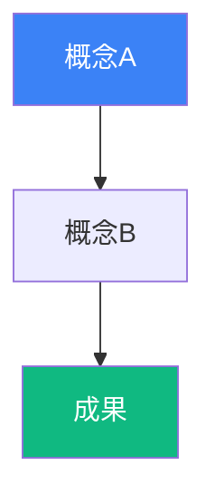

# 第X章：[章タイトル]

## 🎯 この章で学ぶこと

- **[重要概念1]**を理解し、[成果物1]を習得
- **[重要概念2]**の実践方法を学び、[成果物2]を実装
- **[重要概念3]**を通じて、[スキル]を獲得
- [必要に応じて4-6項目まで]

## 📌 この章の位置づけ

[前の章で学んだこと]を理解しました。
この章では、[この章の役割]を学びます。
[次の章への接続]の土台となる重要な概念です。

---

## [セクション1タイトル]

### [サブセクション1-1]

[概念説明]

**重要ポイント**:
- [ポイント1]
- [ポイント2]
- [ポイント3]

[Mermaid図（必要に応じて）]



### [サブセクション1-2]

[具体例]

| 項目 | 従来の方法 | 新しい方法 |
|------|-----------|-----------|
| **特徴1** | [説明] | [説明] |
| **特徴2** | [説明] | [説明] |
| **特徴3** | [説明] | [説明] |

**実例**:
> [引用または実際の事例]

---

## [セクション2タイトル]

[実践ワークフロー]

**ステップ1**: [説明]
**ステップ2**: [説明]
**ステップ3**: [説明]

**コード例**:
```typescript
// [説明]
const example = () => {
  // [実装]
};
```

---

## 💡 この章のまとめ

- ✅ [学んだこと1]
- ✅ [学んだこと2]
- ✅ [学んだこと3]
- ✅ [学んだこと4]
- ✅ [学んだこと5]

## 🚀 次の章への橋渡し

[この章の振り返り]を理解しました。
次の第X+1章では、[次の章のテーマ]を学びます。
[次の章で学ぶことの意義]が見えてきます。

---
