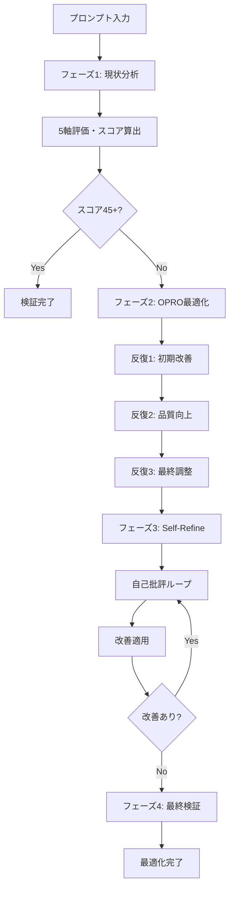

# プロンプト最適化 Skill

**作成日**: 2025年11月8日
**バージョン**: 2.0.0
**目的**: Sub-agentのシステムプロンプトをOPROとSelf-Refine手法で自動最適化し、高品質な出力を保証する

---

## 📋 このSkillについて

### 何をするか（What）

このSkillは、以下の手法を使ってSub-agentのプロンプトを自動的に改善します：

1. **OPRO（LLM as Optimizer）**: LLM自身が最適化エンジンとして機能し、プロンプトを反復改善
2. **Self-Refine**: 自己批評ループによる反復的な品質向上
3. **品質基準との整合性チェック**: lecture-quality-standardsとの統合検証

**具体的な成果物**:
- 明確性、完全性、構造性、例示性、実行可能性の5軸で評価されたプロンプト
- 品質スコア45/50（90%）以上のプロンプト
- 自動生成された改善履歴レポート

### いつ使うか（When）

以下の状況で、このSkillを使用してください：

✅ **新規Sub-agentプロンプト作成時**
- 初期ドラフトから高品質なプロンプトへ
- 品質基準を満たすプロンプトが必要な時

✅ **既存プロンプトの改善時**
- Sub-agentの出力品質が低い
- 指示が曖昧で一貫性がない
- 例やガイドラインが不足している

✅ **プロンプト品質の検証時**
- 現在のプロンプトがベストプラクティスに準拠しているか確認
- 改善余地の自動診断が必要

✅ **チームでのプロンプト標準化時**
- 複数のSub-agentプロンプトを統一基準で最適化
- 品質保証プロセスの一環として

### 使用対象

- **prompt-optimizer** Sub-agent（推奨）
- メインClaude（手動実行時）
- プロンプトレビューワークフロー

---

## 🎯 使用方法

### ステップ1: 現状分析

既存プロンプトを5つの評価軸で分析します：

```yaml
evaluation_criteria:
  - clarity:      曖昧さがなく、具体的か？
  - completeness: すべての要素をカバーしているか？
  - structure:    段階的で読みやすい構造か？
  - examples:     良い例・悪い例が豊富か？
  - actionability: 実行可能な指示か？
```

**評価方法**: [評価テンプレート](templates/evaluation-template.md) を使用

### ステップ2: OPRO最適化（3回反復）

OPRO手法でプロンプトを改善します：

```markdown
反復1: 初期プロンプトを分析し、改善案を生成
反復2: 改善案を品質基準と照合し、さらに最適化
反復3: 最終調整とポリッシング
```

**詳細**: [OPRO手法詳細](techniques/opro-method.md)

### ステップ3: Self-Refine（自己批評ループ）

自己批評により、さらに洗練します：

```markdown
1. 自己批評: 改善されたプロンプトの問題点を特定
2. 改善適用: 批評に基づいて修正
3. 再評価: スコアが向上したか確認
```

**詳細**: [Self-Refine手法詳細](techniques/self-refine-method.md)

### ステップ4: 最終検証

最終チェックリストで品質を確認します：

```yaml
✅ YAMLフロントマター指示
✅ 章立て構造の指示
✅ 絵文字使用ルール
✅ 具体例（良い例・悪い例）
✅ 段階的設計の指示
```

---

## 📊 品質スコアリング

### スコア計算方式

各評価軸を0-10点で採点し、合計50点満点で評価：

| 評価軸 | 配点 | 評価内容 |
|--------|------|---------|
| **明確性** | 10点 | 曖昧な表現がなく、具体的か |
| **完全性** | 10点 | 必要な要素がすべて含まれているか |
| **構造性** | 10点 | 段階的で読みやすい構造か |
| **例示性** | 10点 | 良い例・悪い例が豊富か |
| **実行可能性** | 10点 | 具体的なアクション指向か |

### 品質基準

| スコア | 評価 | 判定 | アクション |
|--------|------|------|-----------|
| 45-50 | ⭐⭐⭐⭐⭐ | 優秀 | そのまま使用可 |
| 40-44 | ⭐⭐⭐⭐ | 良好 | 微調整推奨 |
| 35-39 | ⭐⭐⭐ | 普通 | 改善必要 |
| 30-34 | ⭐⭐ | 不十分 | 大幅改善必要 |
| 0-29 | ⭐ | 不可 | 再作成推奨 |

**目標**: 45点以上（90%）

---

## 🔧 実行例

### 例1: 新規プロンプト作成

```markdown
prompt-optimization Skillを使って、lecture-generator Sub-agentのプロンプトを作成してください。

【要件】
- VibeCoder育成プログラムの講義資料生成
- Markdown形式での出力
- 構造化された章立て（🎯📌💡🚀）

【品質目標】
- 全評価軸で8/10以上
- 総合スコア45/50以上
```

### 例2: 既存プロンプト改善

```markdown
prompt-optimization Skillを使って、以下のプロンプトを最適化してください。

【現在のプロンプト】
[既存プロンプトを貼り付け]

【問題点】
- 指示が曖昧（明確性: 5/10）
- 例が不足（例示性: 4/10）

【目標】
- OPRO 3回反復
- Self-Refine 2回反復
- 総合スコア45/50以上
```

### 例3: プロンプト検証

```markdown
prompt-optimization Skillを使って、以下のプロンプトを評価してください。

【プロンプト】
[プロンプトを貼り付け]

【実行内容】
1. フェーズ1（現状分析）のみ実行
2. 5軸評価とスコア算出
3. 改善提案のレポート作成
```

---

## 📚 詳細資料

### 技法詳細
- [OPRO手法の詳細](techniques/opro-method.md) - 反復最適化プロセス
- [Self-Refine手法の詳細](techniques/self-refine-method.md) - 自己批評ループ

### テンプレート
- [評価テンプレート](templates/evaluation-template.md) - 5軸評価の詳細基準
- [批評テンプレート](templates/critique-template.md) - Self-Refine用批評フォーマット
- [OPROプロンプトテンプレート](templates/opro-template.md) - OPRO実行用テンプレート

### 実装例
- [lecture-generatorプロンプトの最適化](examples/lecture-generator-optimization.md)
- [スコア改善の実例](examples/score-improvement-example.md)

---

## ⚙️ Sub-agentとの統合

### prompt-optimizer Sub-agentでの使用

```yaml
---
name: prompt-optimizer
description: Sub-agentプロンプトをOPROとSelf-Refineで最適化する専門エージェント
tools: Read, Write
model: opus
---

## 利用可能なSkills

1. **prompt-optimization** (`.claude/skills/prompt-optimization/`)
   - Sub-agentプロンプトの自動最適化
   - 5軸評価と品質スコアリング
   - OPRO + Self-Refine手法

**IMPORTANT**: 作業開始前に、prompt-optimization Skillの内容を読み込んでください。

## 役割

prompt-optimization Skillに基づいて、Sub-agentのプロンプトを最適化します。
```

### 実行フロー



---

## 🔍 トラブルシューティング

### スコアが目標に達しない

**症状**: 3回反復してもスコアが45点未満

**原因**:
- 元のプロンプトの品質が極端に低い
- 品質基準が明確でない
- モデルの性能不足

**解決策**:
1. 反復回数を5回に増やす
2. lecture-quality-standards Skillを明示的に参照
3. Opusモデルを使用（Sonnetではなく）

### 改善が停滞する

**症状**: Self-Refineループで改善が見られない

**原因**:
- ローカル最適解に陥っている
- 批評の観点が固定化

**解決策**:
1. 異なる批評観点を追加（[批評テンプレート](templates/critique-template.md)参照）
2. OPROから再実行
3. 人間によるレビューを追加

---

## 📖 学術的背景

### OPRO（LLM as Optimizer）

**出典**: ICLR 2024
**論文**: [Large Language Models as Optimizers](https://proceedings.iclr.cc/paper_files/paper/2024/hash/3339f19c5fcee3ad74502947a32be9e6-Abstract-Conference.html)

**主要な発見**:
- LLM自身が最適化エンジンとして機能
- 人間の直感を超えたプロンプト生成が可能
- 大規模モデルほど高効果

### Self-Refine

**出典**: NeurIPS 2023
**論文**: [Self-Refine: Iterative Refinement with Self-Feedback](https://proceedings.neurips.cc/paper_files/paper/2023/hash/91edff07232fb1b55a505a9e9f6c0ff3-Abstract-Conference.html)

**主要な発見**:
- 自己批評による反復改善が有効
- 追加の学習データ不要
- シンプルで実装が容易

---

## 🔄 更新履歴

| 日付 | バージョン | 変更内容 |
|------|-----------|---------|
| 2025-11-08 | 2.0.0 | ベストプラクティスに準拠した構造化、詳細を別ファイルに分離 |
| 2025-11-08 | 1.0.0 | 初版作成 |

---

**関連Skills**:
- [lecture-quality-standards](../lecture-quality-standards/SKILL.md) - 品質基準参照用
- [lecture-generator](../lecture-generator/SKILL.md) - 最適化されたプロンプトの使用例

---

**allowed-tools**: Read, Write, Grep
