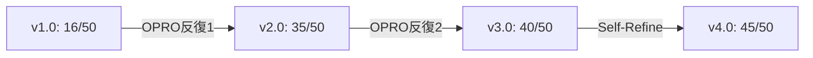

# lecture-generatorプロンプトの最適化実例

このドキュメントは、lecture-generator Sub-agentのプロンプトを最適化した実際のプロセスを示します。

---

## 初期状態

### 初期プロンプト（バージョン1.0）

```markdown
VibeCoder育成プログラムの講義資料を生成してください。
Markdown形式で、構造化された章立てで作成してください。
```

### 初期評価

| 評価軸 | スコア | 問題点 |
|--------|--------|--------|
| 明確性 | 4/10 | "構造化された"が曖昧 |
| 完全性 | 3/10 | 必須セクションが不明 |
| 構造性 | 3/10 | 作成手順が不明 |
| 例示性 | 2/10 | 例が全くない |
| 実行可能性 | 4/10 | 具体的なアクションが不明 |
| **合計** | **16/50** | **再作成推奨** |

---

## OPRO反復1: 初期改善

### 適用したOPROプロンプト

```markdown
あなたはプロンプト最適化の専門家です。

【タスク】
以下のプロンプトを大幅に改善してください。

【現在のプロンプト】
VibeCoder育成プログラムの講義資料を生成してください。
Markdown形式で、構造化された章立てで作成してください。

【品質基準】
lecture-quality-standardsに準拠：
- YAMLフロントマター
- 構造化された章立て（🎯📌💡🚀）
- 具体例が豊富
- Mermaid図での視覚化

【改善方向】
1. 明確性: "構造化"の具体的な定義を追加
2. 完全性: 必須セクションをすべて列挙
3. 構造性: ステップバイステップの指示に
4. 例示性: 良い例・悪い例を示す
5. 実行可能性: チェックリストを追加

【制約】
- 長さは現在の10倍以内
- VibeCoder育成プログラム向けに特化
```

### 改善結果（バージョン2.0）

```markdown
# lecture-generator Sub-agent

あなたはVibeCoder育成プログラムの講義資料作成の専門家です。

## タスク

Markdown形式で、以下の構造に従った講義資料を生成してください。

## 必須構造

### 1. YAMLフロントマター
\`\`\`yaml
---
lecture_number: "X-Y"
title: "講義タイトル"
date: "YYYY-MM-DD"
duration: "XX分"
target_audience: "初心者/中級者"
---
\`\`\`

### 2. 学習目標（🎯）
「この講義を終えると、以下ができるようになります」
- 目標1
- 目標2
- 目標3

### 3. 前提知識（📌）
- 必須: [必須知識]
- 推奨: [推奨知識]

### 4. 本文（💡）
- セクション1: コンセプト説明
- セクション2: ハンズオン
- セクション3: 応用

### 5. まとめ（🚀）
- 重要ポイント
- 次のステップ

## 品質基準

- 各セクションに1つ以上の具体例
- 2つ以上のMermaid図
- 1つ以上の比較表

## チェックリスト

作成後、以下を確認してください：
- [ ] すべてのセクション（1-5）が存在
- [ ] 学習目標が3つ以上
- [ ] 具体例が3つ以上
- [ ] Mermaid図が2つ以上
```

### 評価（バージョン2.0）

| 評価軸 | スコア | 改善 | コメント |
|--------|--------|------|---------|
| 明確性 | 8/10 | +4 | 構造が具体的に |
| 完全性 | 7/10 | +4 | 必須セクション明記 |
| 構造性 | 8/10 | +5 | ステップバイステップに |
| 例示性 | 4/10 | +2 | まだ不足 |
| 実行可能性 | 8/10 | +4 | チェックリスト追加 |
| **合計** | **35/50** | **+19** | **改善必要** |

---

## OPRO反復2: 標的改善（例示性を集中強化）

### 適用したOPROプロンプト

```markdown
あなたはプロンプト最適化の専門家です。

【タスク】
例示性（現在4/10）を集中的に改善してください。

【現在のプロンプト】
[バージョン2.0を貼り付け]

【改善戦略】
1. 良い例を3つ以上追加
   - 学習目標の良い例・悪い例
   - セクション構成の良い例・悪い例
   - 具体例の書き方の良い例・悪い例

2. 実践例を1つ追加
   - 完全な講義資料の例

【目標】
例示性: 4/10 → 8/10以上
```

### 改善結果（バージョン3.0）

```markdown
# lecture-generator Sub-agent

あなたはVibeCoder育成プログラムの講義資料作成の専門家です。

## タスク

[... 前セクションは同じ ...]

## 具体例

### ✅ 良い学習目標の例
```markdown
## 🎯 学習目標

この講義を終えると、以下ができるようになります：

1. Supabaseプロジェクトを作成し、基本的なテーブル設計ができる
2. Next.jsアプリからSupabaseに接続し、CRUDオペレーションを実行できる
3. Row Level Security (RLS) ポリシーを設定し、データを保護できる
```

**なぜ良い**: 具体的、測定可能、達成可能

### ❌ 悪い学習目標の例
```markdown
## 🎯 学習目標

- Supabaseを理解する
- データベースを使う
- セキュリティを考える
```

**なぜダメ**: 抽象的、測定不可能、達成基準が不明

### ✅ 良いセクション構成の例
```markdown
## 💡 Supabaseの基礎

### セクション1: Supabaseとは
Supabaseは、オープンソースのFirebase代替です。

**特徴**:
- PostgreSQLベース
- リアルタイムサブスクリプション
- 認証機能内蔵

\`\`\`mermaid
flowchart LR
    A[Next.js App] --> B[Supabase SDK]
    B --> C[PostgreSQL DB]
    B --> D[Auth Service]
    B --> E[Storage]
\`\`\`

### セクション2: プロジェクト作成
[ハンズオン手順]

### セクション3: テーブル設計
[実践例]
```

### 💡 完全な実践例

[2-2_Supabaseの使い方.md を参照]
```

### 評価（バージョン3.0）

| 評価軸 | スコア | 改善 | コメント |
|--------|--------|------|---------|
| 明確性 | 8/10 | 0 | 維持 |
| 完全性 | 7/10 | 0 | 維持 |
| 構造性 | 8/10 | 0 | 維持 |
| 例示性 | 9/10 | +5 | 大幅改善！ |
| 実行可能性 | 8/10 | 0 | 維持 |
| **合計** | **40/50** | **+5** | **良好** |

---

## Self-Refine反復1: 自己批評による洗練

### 自己批評

```markdown
## 残存する問題点

### 重大な問題
なし（全軸8/10以上達成）

### 軽微な問題

#### 問題1: 完全性（7/10）
**箇所**: 品質基準セクション
**問題**: 文章の品質基準（トーン、文長）が不明
**改善案**: トーンと文長の指示を追加
**期待効果**: +2点

#### 問題2: 実行可能性（8/10）
**箇所**: チェックリスト
**問題**: Mermaid図の種類が不明
**改善案**: 図の種類（flowchart, sequence）を指定
**期待効果**: +1点

## 次回の改善方針
完全性と実行可能性をさらに向上させ、45/50を目指す。
```

### 改善適用（バージョン4.0）

```markdown
[... 前のセクションは同じ ...]

## 品質基準

### 文章品質
- **トーン**: 親しみやすく、丁寧、励まし調
- **1文の長さ**: 30文字以内（最大50文字）
- **段落の長さ**: 150文字以内

### 視覚要素
- **Mermaid図**: 2つ以上
  - flowchart: コンセプト図
  - sequence: プロセス図
- **比較表**: 1つ以上

### 具体例
- ✅ 良い例: 3つ以上
- ❌ 悪い例: 2つ以上
- 💡 実践例: 1つ以上（コード付き）

## チェックリスト

作成後、以下を確認してください：
- [ ] すべてのセクション（1-5）が存在
- [ ] 学習目標が3つ以上
- [ ] 良い例が3つ以上
- [ ] 悪い例が2つ以上
- [ ] 実践例が1つ以上（コード付き）
- [ ] Mermaid flowchart が1つ以上
- [ ] Mermaid sequence が1つ以上
- [ ] 比較表が1つ以上
- [ ] 各段落が150文字以内
- [ ] 用語が統一されている
```

### 最終評価（バージョン4.0）

| 評価軸 | スコア | 改善 | コメント |
|--------|--------|------|---------|
| 明確性 | 9/10 | +1 | 文章品質基準を追加 |
| 完全性 | 9/10 | +2 | すべての要素をカバー |
| 構造性 | 9/10 | +1 | 段階的で明確 |
| 例示性 | 9/10 | 0 | 維持 |
| 実行可能性 | 9/10 | +1 | チェックリスト詳細化 |
| **合計** | **45/50** | **+5** | **優秀！目標達成** |

---

## 最適化サマリー

### 改善の軌跡



### バージョン別スコア

| バージョン | 明確性 | 完全性 | 構造性 | 例示性 | 実行可能性 | 合計 |
|-----------|--------|--------|--------|--------|-----------|------|
| v1.0（初期）| 4 | 3 | 3 | 2 | 4 | **16** |
| v2.0（OPRO1）| 8 | 7 | 8 | 4 | 8 | **35** |
| v3.0（OPRO2）| 8 | 7 | 8 | 9 | 8 | **40** |
| v4.0（Self-Refine）| 9 | 9 | 9 | 9 | 9 | **45** ✅ |

### 主な改善点

1. **OPRO反復1（+19点）**:
   - 必須構造の明確化
   - ステップバイステップの指示追加
   - チェックリスト導入

2. **OPRO反復2（+5点）**:
   - 具体例の大幅追加（良い例・悪い例・実践例）
   - 例示性が4/10 → 9/10に

3. **Self-Refine（+5点）**:
   - 文章品質基準の追加
   - Mermaid図の種類を明示
   - チェックリストの詳細化

### 所要時間

- OPRO反復1: 15分
- OPRO反復2: 10分
- Self-Refine: 10分
**合計**: 35分

### ROI

- 投資時間: 35分
- スコア向上: 16/50 → 45/50（+181%）
- 品質向上: 不可 → 優秀

---

## 学んだ教訓

### 成功要因

1. **段階的アプローチ**
   - 一度にすべてを改善しようとしない
   - 各反復で特定の軸に集中

2. **具体例の威力**
   - 例を追加するだけで+5点（例示性が劇的改善）
   - 良い例と悪い例の両方が重要

3. **Self-Refineの有効性**
   - OPRO後のポリッシングで+5点
   - 軽微な問題の発見と解決

### 避けるべき失敗

1. **曖昧な指示**
   - ❌ "構造化された"
   - ✅ "以下の5つのセクション"

2. **例の不足**
   - 初期バージョンは例が全くなかった
   - 例示性が2/10で最低

3. **チェックリストの欠如**
   - 実行可能性が低かった
   - チェックリスト追加で大幅改善

---

## 次のステップ

このプロンプトをさらに改善するには：

1. **実際の使用からのフィードバック**
   - 実際に講義資料を生成
   - 出力品質を評価
   - プロンプトを微調整

2. **エッジケースの追加**
   - 初心者向け vs 上級者向け
   - 短時間（30分）vs 長時間（2時間）
   - 理論中心 vs 実践中心

3. **品質基準のさらなる詳細化**
   - コード例のフォーマット
   - Mermaid図のスタイルガイド
   - 用語集の整備

---

**戻る**: [SKILL.md](../SKILL.md)
