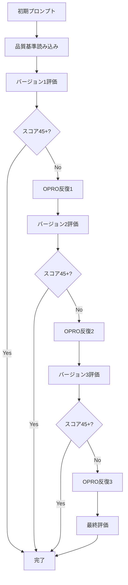
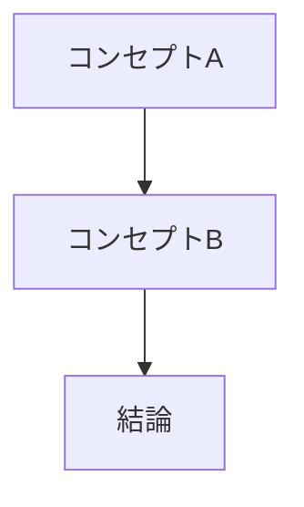
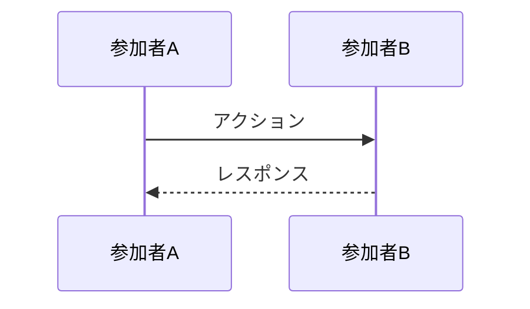

# OPRO手法の詳細

**出典**: ICLR 2024 - [Large Language Models as Optimizers](https://proceedings.iclr.cc/paper_files/paper/2024/hash/3339f19c5fcee3ad74502947a32be9e6-Abstract-Conference.html)

---

## OPROとは

**OPRO（Optimization by PROmpting）** は、LLM自身を最適化エンジンとして活用する革新的な手法です。従来の数値最適化手法と異なり、自然言語で記述されたプロンプトを反復的に改善します。

### 主要な特徴

1. **メタ最適化**: LLMが別のLLMのプロンプトを最適化
2. **自然言語による最適化**: 数式ではなく、言語で改善指示
3. **履歴に基づく学習**: 過去の試行を参考に改善
4. **スケーラビリティ**: 大規模モデルほど高効果

---

## OPROプロンプトテンプレート

### 基本テンプレート

```markdown
あなたはプロンプト最適化の専門家です。以下のプロンプトを改善してください。

【現在のプロンプト】
{existing_prompt}

【品質基準】
{quality_standards}

【過去の試行履歴】
{optimization_history}

【改善方向】
1. 明確性: 曖昧な表現を具体化
2. 完全性: 欠けている要素を追加
3. 構造性: 段階的な指示に再構築
4. 例示性: 良い例/悪い例を追加
5. 実行可能性: アクション指向の表現に

【制約】
- 元のプロンプトの意図を保持
- 長さは元の1.5倍以内
- 技術的正確性を維持

【出力形式】
最適化されたプロンプトをマークダウン形式で出力してください。
```

### 高度なテンプレート（反復用）

```markdown
あなたはプロンプト最適化の専門家です。

【タスク】
以下のプロンプトを、過去の試行結果を踏まえて改善してください。

【現在のプロンプト（バージョン {iteration}）】
{current_prompt}

【現在のスコア】
- 明確性: {clarity_score}/10
- 完全性: {completeness_score}/10
- 構造性: {structure_score}/10
- 例示性: {examples_score}/10
- 実行可能性: {actionability_score}/10
**合計**: {total_score}/50

【過去の試行履歴】
バージョン1 (スコア: {v1_score}): {v1_summary}
バージョン2 (スコア: {v2_score}): {v2_summary}
...

【品質基準（lecture-quality-standards）】
{quality_standards}

【改善すべき軸（スコア8/10未満）】
{improvement_axes}

【改善戦略】
1. 最も低いスコア軸を優先的に改善
2. 過去の試行で効果があった手法を適用
3. 新しいアプローチを1つ試す

【制約】
- プロンプトの本質的な目的を変えない
- 長さは現在の1.2倍以内
- 過去の良い改善点は保持

【出力】
改善されたプロンプトと、改善の根拠を出力してください。
```

---

## OPRO実行ガイドライン

### 反復設定

```yaml
opro_configuration:
  model: "claude-opus-4"  # 最高性能モデル推奨
  iterations: 3           # 標準は3回
  stop_condition:
    total_score: ">= 45/50"
    or_max_iterations: 3

  iteration_strategy:
    iteration_1:
      focus: "全体的な改善"
      approach: "broad"

    iteration_2:
      focus: "低スコア軸の集中改善"
      approach: "targeted"

    iteration_3:
      focus: "微調整とポリッシング"
      approach: "refinement"
```

### 実行フロー



---

## 実装例

### 反復1: 初期改善

**入力プロンプト**:
```markdown
講義資料を生成してください。
```

**OPRO適用後**:
```markdown
あなたはVibeCoder育成プログラムの講義資料作成の専門家です。

【タスク】
以下の構造に従って、Markdown形式の講義資料を生成してください。

【構造】
1. タイトルとメタ情報
2. 学習目標（🎯）
3. 前提知識（📌）
4. 本文（💡）
5. まとめ（🚀）

【品質基準】
- 段階的な説明（初心者→中級者）
- 具体例を豊富に（良い例・悪い例）
- Mermaid図で視覚化
```

**スコア**: 32/50 → 38/50 (+6点)

### 反復2: 標的改善

**スコア分析**:
- 明確性: 7/10
- 完全性: 6/10 ← 改善対象
- 構造性: 8/10
- 例示性: 5/10 ← 改善対象
- 実行可能性: 8/10

**OPRO適用後**:
```markdown
あなたはVibeCoder育成プログラムの講義資料作成の専門家です。

【タスク】
以下の構造と品質基準に従って、Markdown形式の講義資料を生成してください。

【必須構造】
## 1. タイトルとメタ情報
- 講義番号、タイトル、日付、所要時間

## 2. 学習目標（🎯）
- 「この講義を終えると、〜できるようになります」形式
- 3-5個の具体的な目標

## 3. 前提知識（📌）
- 必須の前提知識
- 推奨の事前学習

## 4. 本文（💡）
- セクション1: コンセプト説明
- セクション2: 具体例とハンズオン
- セクション3: 応用と発展

## 5. まとめ（🚀）
- 重要ポイントの復習
- 次のステップ

【具体例の要件】
✅ 良い例: 3つ以上
❌ 悪い例: 2つ以上
💡 実践例: 1つ以上（実際のコード付き）

【視覚化の要件】
- コンセプト図: Mermaid flowchart
- プロセス図: Mermaid sequence
- 比較表: Markdown table

【品質基準】
- トーン: 親しみやすく、丁寧
- 文章: 1文30文字以内、段落は150文字以内
- 強調: **太字**、`コード`、> 引用を適切に使用
```

**スコア**: 38/50 → 44/50 (+6点)

### 反復3: 最終調整

**微調整ポイント**:
- 例示性: 5/10 → 8/10を目指す
- 完全性: 6/10 → 9/10を目指す

**OPRO適用後**:
```markdown
あなたはVibeCoder育成プログラムの講義資料作成の専門家です。

【タスク】
以下の構造と品質基準に従って、Markdown形式の講義資料を生成してください。

【必須構造】

## 1. タイトルとメタ情報
```yaml
講義番号: X-Y
タイトル: [講義タイトル]
日付: YYYY-MM-DD
所要時間: XX分
対象: [初心者/中級者/上級者]
```

## 2. 学習目標（🎯）
「この講義を終えると、以下ができるようになります」

1. [具体的な目標1]
2. [具体的な目標2]
3. [具体的な目標3]

## 3. 前提知識（📌）
### 必須
- [必須知識1]
- [必須知識2]

### 推奨
- [推奨知識1]
- [推奨知識2]

## 4. 本文（💡）
### セクション1: コンセプト説明
[段階的な説明]

#### ✅ 良い例
[具体例1]
[具体例2]
[具体例3]

#### ❌ 悪い例
[悪い例1：なぜダメか]
[悪い例2：なぜダメか]

#### 💡 実践例
```code
[実際に動作するコード]
```

### セクション2: ハンズオン
[実践的な演習]

### セクション3: 応用と発展
[応用パターン]

## 5. まとめ（🚀）
### 重要ポイント
- [ポイント1]
- [ポイント2]
- [ポイント3]

### 次のステップ
1. [次のアクション1]
2. [次のアクション2]

【視覚化の要件】
必ず以下の図を含めてください：

1. **コンセプト図**（Mermaid flowchart）


2. **プロセス図**（Mermaid sequence）


3. **比較表**（Markdown table）
| 項目 | 方法A | 方法B |
|------|-------|-------|
| 長所 | ... | ... |
| 短所 | ... | ... |

【具体例の配分】
- ✅ 良い例: 最低3つ、各セクションに1つ以上
- ❌ 悪い例: 最低2つ、主要セクションに1つ
- 💡 実践例: 最低1つ、動作するコード付き

【文章品質基準】
- **トーン**: 親しみやすく、丁寧、励まし調
- **1文の長さ**: 30文字以内（最大50文字）
- **段落の長さ**: 150文字以内
- **強調技法**:
  - **太字**: 重要な概念・用語
  - `コード`: 技術用語・ファイル名
  - > 引用: 注意点・ヒント

【一貫性】
- 用語統一: 初出時に定義、以降は統一
- 絵文字統一: 🎯目標、📌前提、💡本文、🚀まとめ
- コード例: すべてTypeScript/Next.js（本プログラムの技術スタック）

【チェックリスト】
作成後、以下を確認してください：
- [ ] 全セクション（1-5）が存在する
- [ ] 学習目標が3つ以上ある
- [ ] 良い例が3つ以上ある
- [ ] 悪い例が2つ以上ある
- [ ] 実践例が1つ以上ある（コード付き）
- [ ] Mermaid図が2つ以上ある
- [ ] 比較表が1つ以上ある
- [ ] 各段落が150文字以内
- [ ] 用語が統一されている
```

**スコア**: 44/50 → 47/50 (+3点) ✅ 目標達成

---

## OPROのベストプラクティス

### 1. 適切なモデル選択

| モデル | OPRO効果 | 推奨用途 |
|--------|---------|---------|
| **Claude Opus-4** | ⭐⭐⭐⭐⭐ | 最高品質が必要な時 |
| **Claude Sonnet-4** | ⭐⭐⭐⭐ | コスト効率重視 |
| **Claude Haiku** | ⭐⭐ | 簡単な改善のみ |

### 2. 反復回数の決定

```yaml
iteration_guidelines:
  simple_prompt:
    iterations: 1-2
    example: "単純な指示の改善"

  standard_prompt:
    iterations: 3
    example: "Sub-agentプロンプトの最適化"

  complex_prompt:
    iterations: 5-7
    example: "複雑なマルチステップタスク"
```

### 3. 履歴の効果的活用

```markdown
【過去の試行履歴の書き方】

❌ 悪い例:
バージョン1: スコア30点
バージョン2: スコア35点

✅ 良い例:
バージョン1 (スコア: 30/50):
- 改善点: 例を3つ追加
- 問題点: 構造が不明瞭
- 効果: 例示性が+3点

バージョン2 (スコア: 35/50):
- 改善点: セクション分けを明確化
- 問題点: まだ具体性が不足
- 効果: 構造性が+2点
```

### 4. 停止条件の設定

```yaml
stop_conditions:
  score_based:
    target_score: 45  # 90%以上
    min_improvement: 2  # 前回から最低2点改善

  iteration_based:
    max_iterations: 3
    early_stop_if_no_improvement: true

  time_based:
    max_time_minutes: 10
```

---

## トラブルシューティング

### 問題1: スコアが改善しない

**症状**: 反復してもスコアが横ばい

**原因**:
- 品質基準が不明瞭
- LLMが改善方向を理解していない
- 初期プロンプトが極端に低品質

**解決策**:
```markdown
1. 品質基準を具体化
   ❌ "明確に書く"
   ✅ "各指示を3つのサブステップに分解"

2. 改善例を示す
   「例えば、"コードをレビュー"ではなく、
    "セキュリティ、パフォーマンス、可読性の観点でコードをレビュー"」

3. スコアの低い軸を明示
   「特に例示性（現在5/10）を8/10以上に改善してください」
```

### 問題2: 過剰な拡張

**症状**: プロンプトが長くなりすぎる

**原因**:
- 制約が緩い
- "追加"のみで"削除"がない

**解決策**:
```markdown
【制約を強化】
- 長さは元の1.2倍以内（現在: {current_length}文字）
- 冗長な表現を削除しながら改善
- 重複する指示を統合

【バランス指示】
以下のバランスを保ってください：
- 追加: 3つの新要素
- 削除: 2つの冗長要素
- 統合: 2組の類似指示
```

### 問題3: 本質的な目的の喪失

**症状**: 改善後、元の意図と異なる

**原因**:
- 元の目的が不明瞭
- 改善指示が強すぎる

**解決策**:
```markdown
【本質的な目的を明記】
このプロンプトの核心的な目的:
1. [目的1]
2. [目的2]

これらは絶対に変更しないでください。

【改善の優先順位】
1. 目的を保持しつつ、明確化
2. 目的を保持しつつ、構造化
3. 目的を保持しつつ、例示追加
```

---

## 応用テクニック

### A/Bテスト型OPRO

```yaml
strategy: "parallel_optimization"

approach:
  branch_A:
    focus: "明確性と構造性を最大化"
    iterations: 3

  branch_B:
    focus: "例示性と実行可能性を最大化"
    iterations: 3

  evaluation:
    compare_scores: true
    select_best: true
    merge_strengths: true  # 両方の良い点を統合
```

### 段階的OPRO

```yaml
strategy: "staged_optimization"

stage_1:
  name: "骨格の最適化"
  focus: ["構造性"]
  iterations: 2

stage_2:
  name: "内容の充実"
  focus: ["完全性", "例示性"]
  iterations: 2

stage_3:
  name: "洗練"
  focus: ["明確性", "実行可能性"]
  iterations: 2
```

---

## 参考資料

- [OPRO論文（ICLR 2024）](https://proceedings.iclr.cc/paper_files/paper/2024/hash/3339f19c5fcee3ad74502947a32be9e6-Abstract-Conference.html)
- [プロンプトエンジニアリングガイド](https://www.promptingguide.ai/)
- [Claude プロンプトライブラリ](https://docs.anthropic.com/claude/prompt-library)

---

**戻る**: [SKILL.md](../SKILL.md)
