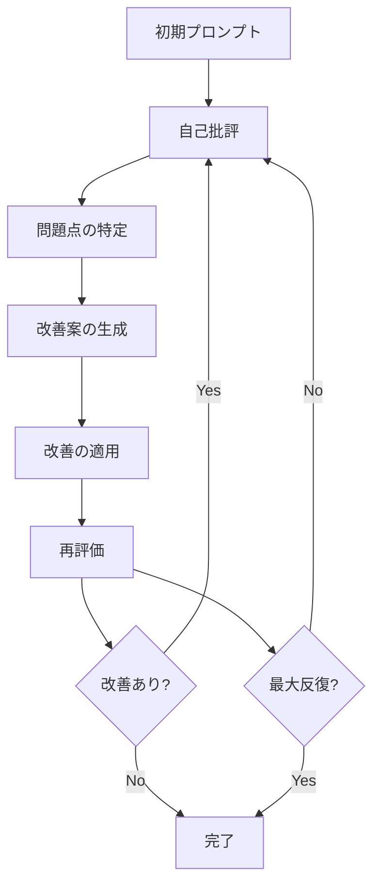
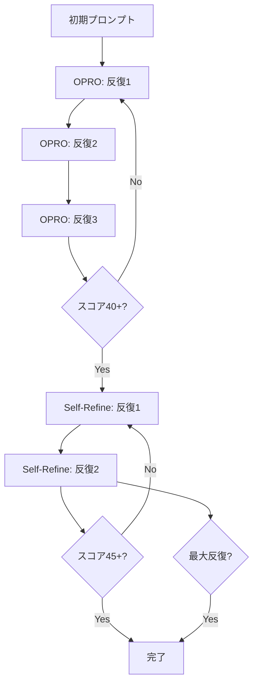

# Self-Refine手法の詳細

**出典**: NeurIPS 2023 - [Self-Refine: Iterative Refinement with Self-Feedback](https://proceedings.neurips.cc/paper_files/paper/2023/hash/91edff07232fb1b55a505a9e9f6c0ff3-Abstract-Conference.html)

---

## Self-Refineとは

**Self-Refine** は、LLM自身が生成した出力を自己批評し、反復的に改善する手法です。外部のフィードバックや追加データを必要とせず、モデル自身の能力だけで品質を向上させます。

### 主要な特徴

1. **自己批評**: モデル自身が出力を評価
2. **反復改善**: 批評に基づいて修正を繰り返す
3. **追加データ不要**: 既存のモデル能力のみで実行
4. **シンプル**: 実装が容易で効果的

---

## Self-Refineループの構造



---

## 自己批評プロンプトテンプレート

### 基本テンプレート

```markdown
あなたはプロンプト品質の批評家です。以下のプロンプトを厳しく評価してください。

【評価対象プロンプト】
{prompt_to_critique}

【品質基準】
{quality_standards}

【批評観点】
以下の5つの軸で問題点を指摘してください：

1. **明確性**: 曖昧な表現、誤解を招く表現
2. **完全性**: 欠けている要素、考慮漏れ
3. **構造性**: 分かりにくい構造、論理の飛躍
4. **例示性**: 不足している例、不適切な例
5. **実行可能性**: 実行困難な指示、抽象的すぎる表現

【出力形式】
## 問題点（各軸ごと）

### 明確性（現在スコア: X/10）
- [問題点1]
- [問題点2]

### 完全性（現在スコア: X/10）
- [問題点1]
- [問題点2]

...（他の軸も同様）

## 改善優先度
1. [最優先の改善点]
2. [次に重要な改善点]
3. [その次の改善点]

## 改善案
- [具体的な改善案1]
- [具体的な改善案2]
- [具体的な改善案3]
```

### 高度なテンプレート（反復用）

```markdown
あなたはプロンプト品質の批評家です。以下のプロンプトを、過去の改善履歴を踏まえて評価してください。

【評価対象プロンプト（バージョン {version}）】
{current_prompt}

【現在のスコア】
- 明確性: {clarity_score}/10
- 完全性: {completeness_score}/10
- 構造性: {structure_score}/10
- 例示性: {examples_score}/10
- 実行可能性: {actionability_score}/10
**合計**: {total_score}/50

【過去の改善履歴】
{improvement_history}

【品質基準】
{quality_standards}

【批評観点】
以下の観点で、**まだ改善の余地がある点**を指摘してください：

1. **残存する曖昧性**: 過去の改善でも解消されていない曖昧な表現
2. **新たな問題**: 改善によって生じた新しい問題（冗長性、複雑性など）
3. **一貫性の欠如**: 用語、スタイル、フォーマットの不統一
4. **バランスの問題**: 過剰な部分と不足している部分
5. **実用性の問題**: 実際に使いにくい、理解しにくい部分

【出力形式】
## 残存する問題点

### 重大な問題（スコアへの影響: 大）
- [問題1]: なぜ問題か、どう改善するか
- [問題2]: なぜ問題か、どう改善するか

### 軽微な問題（スコアへの影響: 小）
- [問題1]: なぜ問題か、どう改善するか
- [問題2]: なぜ問題か、どう改善するか

## 改善による副作用
- [改善によって生じた新たな問題]

## 次回の改善方針
1. [最優先の改善点]（期待スコア向上: +X点）
2. [次に重要な改善点]（期待スコア向上: +X点）
```

---

## Self-Refineループの実装

### 設定

```yaml
self_refine_configuration:
  max_iterations: 3
  min_improvement_threshold: 1  # 最低1点の改善が必要
  stop_if_no_improvement: true

  critique_settings:
    model: "claude-opus-4"  # 批評は高性能モデル推奨
    temperature: 0.3        # 低温度で客観的評価

  improvement_settings:
    model: "claude-opus-4"
    temperature: 0.7        # 適度な温度で創造的改善

  evaluation_settings:
    model: "claude-sonnet-4"  # 評価は中性能モデルでも可
    temperature: 0.0          # 最低温度で一貫性確保
```

### ループ実行フロー

```python
def self_refine_loop(initial_prompt, quality_standards, max_iterations=3):
    """
    Self-Refineループを実行

    Args:
        initial_prompt: 初期プロンプト
        quality_standards: 品質基準
        max_iterations: 最大反復回数

    Returns:
        refined_prompt: 改善されたプロンプト
        history: 改善履歴
    """
    current_prompt = initial_prompt
    history = []

    for iteration in range(1, max_iterations + 1):
        # ステップ1: 自己批評
        critique = critique_prompt(
            prompt=current_prompt,
            quality_standards=quality_standards,
            history=history
        )

        # ステップ2: 改善の適用
        improved_prompt = apply_improvements(
            prompt=current_prompt,
            critique=critique
        )

        # ステップ3: 評価
        new_score = evaluate_prompt(improved_prompt, quality_standards)
        old_score = evaluate_prompt(current_prompt, quality_standards)

        # ステップ4: 改善の判定
        improvement = new_score - old_score

        history.append({
            "iteration": iteration,
            "critique": critique,
            "improvement": improvement,
            "score": new_score
        })

        # 改善がない場合は停止
        if improvement < 1:
            print(f"反復{iteration}: 改善なし（{improvement}点）、停止")
            break

        # 改善があれば継続
        print(f"反復{iteration}: +{improvement}点改善（{old_score} → {new_score}）")
        current_prompt = improved_prompt

        # 目標達成で停止
        if new_score >= 45:
            print(f"目標達成（{new_score}/50）、停止")
            break

    return current_prompt, history
```

---

## 実装例

### 反復1: 初回批評

**入力プロンプト**（OPRO後、スコア44/50）:
```markdown
あなたはVibeCoder育成プログラムの講義資料作成の専門家です。
以下の構造に従って講義資料を生成してください。
[...詳細な指示...]
```

**自己批評**:
```markdown
## 問題点

### 明確性（現在スコア: 9/10）
問題なし

### 完全性（現在スコア: 9/10）
問題なし

### 構造性（現在スコア: 8/10）
- 問題点1: セクション間の移行が唐突
  → 各セクションの目的を明記すべき

### 例示性（現在スコア: 8/10）
- 問題点1: 「良い例」の基準が不明確
  → 何が「良い」のか具体的な基準を示すべき
- 問題点2: 「実践例」の詳細度が不明
  → コメントの密度、説明の詳しさを指定すべき

### 実行可能性（現在スコア: 10/10）
問題なし

## 改善優先度
1. 例示性の向上（期待: +1点）
2. 構造性の向上（期待: +1点）

## 改善案
1. 各セクションの先頭に「このセクションの目的」を追加
2. 「良い例」の基準を具体化（「なぜ良いのか」を明記）
3. 「実践例」のフォーマットを指定（コメント比率30%以上など）
```

**改善適用後**（スコア46/50、+2点）:
```markdown
あなたはVibeCoder育成プログラムの講義資料作成の専門家です。
以下の構造に従って講義資料を生成してください。

【各セクションの目的】
1. タイトルとメタ情報: 講義の概要を把握
2. 学習目標: 達成すべきことを明確化
3. 前提知識: 必要な準備を確認
4. 本文: 段階的に知識を習得
5. まとめ: 学習内容を定着

【具体例の基準】
✅ 良い例の条件:
- 実際に動作するコード
- コメント比率30%以上
- ベストプラクティスに準拠
- 「なぜ良いのか」の説明付き

❌ 悪い例の条件:
- よくある間違いパターン
- 「なぜダメなのか」の説明付き
- 改善方法の提示

💡 実践例の条件:
- 完全に動作する実装
- 段階的な実装手順の説明
- コメント比率40%以上
- 「つまずきポイント」の事前警告

[...他の指示...]
```

### 反復2: 再批評

**自己批評**:
```markdown
## 残存する問題点

### 重大な問題
問題なし（全軸8/10以上）

### 軽微な問題
- 用語「ベストプラクティス」が未定義
  → 初出時に説明を追加すべき

## 改善による副作用
- 指示が詳細になりすぎて、読みにくい可能性
  → セクション区切りを明確化

## 次回の改善方針
1. 用語定義の追加（期待: +0.5点）
2. セクション区切りの視覚化（期待: +0.5点）
```

**改善適用後**（スコア47/50、+1点）:
```markdown
【用語定義】
- **ベストプラクティス**: 業界で広く認められた、最も効果的で効率的な方法

---

## セクション1: 各セクションの目的
[...]

---

## セクション2: 具体例の基準
[...]

---

[... 以降のセクションも区切り線で明確化 ...]
```

### 反復3: 最終確認

**自己批評**:
```markdown
## 残存する問題点

### 重大な問題
問題なし

### 軽微な問題
問題なし

## 評価
すべての軸で8/10以上を達成。
さらなる改善の余地は限定的。

## 推奨
このバージョンで確定。
```

**最終スコア**: 47/50 ✅ 完了

---

## Self-Refineのベストプラクティス

### 1. 批評の質を高める

```yaml
critique_quality_guidelines:
  specificity:
    ❌ 悪い: "曖昧な表現がある"
    ✅ 良い: "「適切に」という表現が曖昧。具体的な基準を示すべき"

  actionability:
    ❌ 悪い: "構造が悪い"
    ✅ 良い: "セクション3と4の順序を入れ替え、論理的な流れにすべき"

  prioritization:
    ❌ 悪い: "すべてを改善すべき"
    ✅ 良い: "最優先: 例の追加（+2点）、次: 構造の改善（+1点）"
```

### 2. 反復回数の最適化

```yaml
iteration_guidelines:
  high_quality_start:
    initial_score: ">= 40/50"
    recommended_iterations: 1-2
    reason: "既に品質が高い"

  medium_quality_start:
    initial_score: "30-39/50"
    recommended_iterations: 2-3
    reason: "標準的な改善プロセス"

  low_quality_start:
    initial_score: "< 30/50"
    recommended_iterations: 3-5
    reason: "大幅な改善が必要"
```

### 3. 改善の停止判断

```yaml
stop_conditions:
  no_improvement:
    threshold: "< 1 point"
    action: "stop immediately"

  diminishing_returns:
    threshold: "< 0.5 points for 2 consecutive iterations"
    action: "stop after next iteration"

  target_achieved:
    threshold: ">= 45/50"
    action: "stop immediately"

  max_iterations:
    threshold: "3 iterations"
    action: "stop and review manually"
```

---

## 応用テクニック

### Multi-Aspect Self-Refine

各軸を個別に最適化：

```yaml
strategy: "aspect_focused_refinement"

iteration_1:
  focus: ["明確性", "実行可能性"]
  reason: "基礎的な品質確保"

iteration_2:
  focus: ["完全性", "例示性"]
  reason: "内容の充実"

iteration_3:
  focus: ["構造性"]
  reason: "全体の洗練"
```

### Collaborative Self-Refine

複数の批評観点を並列実行：

```yaml
strategy: "parallel_critique"

critic_1:
  role: "教育者の視点"
  focus: ["学習効果", "段階的設計"]

critic_2:
  role: "技術専門家の視点"
  focus: ["技術的正確性", "ベストプラクティス"]

critic_3:
  role: "初心者の視点"
  focus: ["分かりやすさ", "例の豊富さ"]

synthesis:
  merge_critiques: true
  prioritize_by_impact: true
```

---

## トラブルシューティング

### 問題1: 批評が抽象的すぎる

**症状**: 「もっと良くすべき」など、具体性に欠ける批評

**解決策**:
```markdown
【批評テンプレートを強化】

各批評には以下を含めてください：
1. 問題箇所の引用（具体的な文章）
2. なぜ問題なのか（理由）
3. どう改善するか（具体的な提案）
4. 期待される効果（スコア向上）

例:
❌ 悪い批評: "例が不足"
✅ 良い批評:
  - 箇所: セクション3「データベース設計」
  - 問題: 良い例が1つのみ（基準では3つ必要）
  - 改善案: RDBとNoSQLの例を追加
  - 効果: 例示性が+2点向上
```

### 問題2: 改善が一方向に偏る

**症状**: 例えば「明確性」ばかり改善され、他の軸が放置される

**解決策**:
```markdown
【バランス型批評を指示】

批評時、以下のバランスを保ってください：
- 最低スコア軸: 60%の注力
- 他の軸: 40%の注力

現在の軸バランス:
- 明確性: 9/10 ← 改善余地小
- 完全性: 6/10 ← 最優先
- 構造性: 7/10 ← 次優先
- 例示性: 6/10 ← 最優先
- 実行可能性: 8/10 ← 改善余地小

今回の批評は「完全性」と「例示性」に集中してください。
```

### 問題3: 無限ループ

**症状**: 改善しても同じ問題を指摘し続ける

**解決策**:
```markdown
【批評履歴を参照させる】

【過去の批評と改善】
反復1: 「例が不足」→ 例を3つ追加 → スコア+2
反復2: 「例の質が低い」→ コード例を充実 → スコア+1

【今回の批評】
過去に指摘した問題が解決されているか確認してください。
解決済みの問題は再度指摘しないでください。
新しい問題点のみを指摘してください。
```

---

## OPROとSelf-Refineの組み合わせ

### 推奨ワークフロー



### 役割分担

| フェーズ | 手法 | 目的 | 目標スコア |
|---------|------|------|-----------|
| **フェーズ1** | OPRO | 大幅な改善 | 30 → 40 |
| **フェーズ2** | Self-Refine | 洗練と微調整 | 40 → 45+ |

---

## 参考資料

- [Self-Refine論文（NeurIPS 2023）](https://proceedings.neurips.cc/paper_files/paper/2023/hash/91edff07232fb1b55a505a9e9f6c0ff3-Abstract-Conference.html)
- [Self-Refine GitHub](https://github.com/madaan/self-refine)
- [プロンプトエンジニアリングガイド](https://www.promptingguide.ai/techniques/self-refine)

---

**戻る**: [SKILL.md](../SKILL.md)
