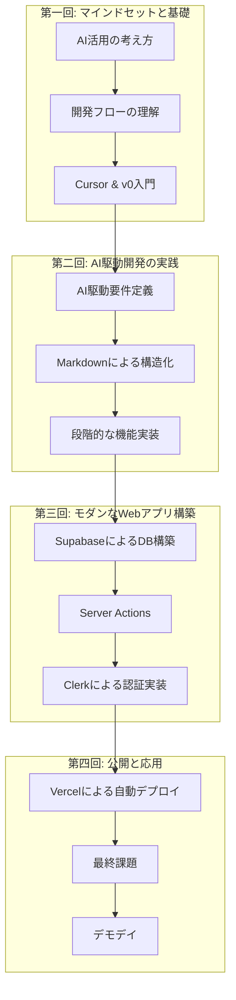

# Vibe Coder Bootcamp 研修成果報告会 - 提案資料

## 1. はじめに：Vibe Coderの誕生

### 1.1. 本研修の目的
- **脱・検討待ち人材:** AIを使いこなし、自ら課題を発見し、解決策を形にできる「Vibe Coder」を育成する。
- **マインドセットの変革:** 「AIは魔法の杖ではないが、最高の協業パートナーである」という意識を醸成し、AIを業務の前提とする文化を構築する。

### 1.2. Vibe Coderとは？
- **定義:** 最新のAI技術、特に生成AIを駆使して、アイデアの着想から設計、実装、デプロイまでを高速に実行できる、次世代の価値創造人材。
- **特徴:**
    - **Speed:** 圧倒的な開発スピード
    - **Agility:** 変化への迅速な対応力
    - **Ownership:** プロダクトへの当事者意識

## 2. 研修カリキュラムの全貌：Vibe Coderへの道

### 2.1. 全体像：アイデアから公開までの高速道路

### 2.2. 各回のキーポイント
- **第一回:** AIをパートナーと捉え、Cursorで「コードを書かない」開発の第一歩を踏み出す。
- **第二回:** AIとの対話を通じて曖昧なアイデアを構造化された「要件」に変換し、段階的に実装するプロセスを学ぶ。
- **第三回:** SupabaseとClerkを使い、AIへの指示だけでセキュアなバックエンドと認証機能を構築する。
- **第四回:** `git push`だけで世界にアプリケーションを公開するCI/CDを体験し、学びの集大成としてオリジナルアプリを開発する。

## 3. 受講生の変革：習得したマインドセットとスキル

### 3.1. マインドセットの変化
- **AIファースト思考:** あらゆる業務を「まずAIに任せられないか？」と考えるように。
- **プロトタイピング思考:** 完璧を目指さず、まず動くものを作って高速に改善する文化へ。
- **オーナーシップ:** アイデアを自らの手でプロダクトとして実現する当事者意識の醸成。

### 3.2. 習得スキル一覧
- **中核スキル:**
    - **自然言語プログラミング:** 日本語の指示でアプリを構築する力。
    - **プロンプトエンジニアリング:** AIから意図した成果を引き出す力。
    - **AIデバッグ:** エラーをAIに解決させる力。
- **技術要素:**
    - **フロントエンド:** Next.js, TypeScript
    - **バックエンド:** Supabase, Server Actions
    - **データベース:** PostgreSQL
    - **認証:** Clerk (OAuth)
    - **インフラ:** Vercel (CI/CD)

## 4. 今後の展望：Vibe Coderが組織にもたらす価値

- **開発の内製化:** 外注に頼っていた小規模なツールやプロトタイプを内製化し、コスト削減とスピード向上を実現。
- **DXの推進力:** 現場の課題を最もよく知る従業員が、自ら解決策を実装するボトムアップ型のDXを推進。
- **イノベーションの創出:** 全社員が「アイデアを形にできる」スキルを持つことで、新たなサービスや業務改善のアイデアが生まれやすい組織文化を醸成。

## 5. Appendix：受講生作品紹介（デモデイで追記）
- ここにデモデイで発表された各受講生の作品概要、URL、スクリーンショットなどを記載。