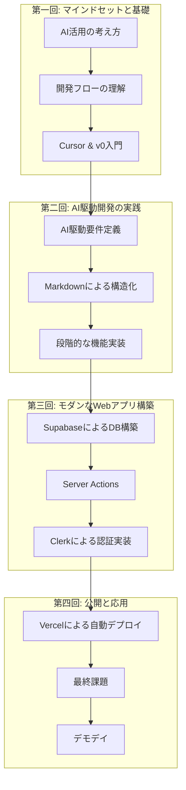

# Vibe Coder Bootcamp 研修成果報告会 - 提案資料

## 1. はじめに：なぜ今、Vibe Coderなのか？

### 1.1. 本研修の設計思想：「教えない」ことで「応用力」を育む
- **アンチパターンへの挑戦:** 「ボタンを1つずつ押させる」従来型の研修では、UIの変更や予期せぬエラーに対応できない人材しか育たない。
- **本質への集中:** 本研修では、あえて詳細な手順を省略し、「APIとは何か」「なぜ環境変数が必要か」といった**基本概念の理解**に重点を置いた。
- **狙い:** 変化の激しいAI時代において、未知のツールや状況にも自ら対応できる**真の応用力**を養うこと。

### 1.2. ライト版という選択の意図
- **背景:** 今回はリテラシーの高い方々が選抜されていることを踏まえ、8時間という短期間で成果を最大化するカリキュラムを設計。
- **講師としての反省と感謝:** 受講生の皆様の高い学習意欲に支えられた部分も大きい。負荷が高かった点はお詫びしたい。しかし、この挑戦があったからこそ、短期間での目覚ましい成長があったと確信している。

## 2. 研修の成果：データと実績が語る成功

### 2.1. 定量評価：驚異の満足度 4.55/5.0
- **アンケート結果サマリー:**
    - 全体満足度: **4.55** / 5.0
    - 面白さ評価: **4.50** / 5.0
    - 難易度評価: **3.90** / 5.0 （挑戦的だが達成可能なレベル）
- **特筆すべき点:** 満足度・面白さ評価で「3点以下」がゼロ。これは、研修の質の高さとエンゲージメントを明確に示している。

### 2.2. 定性評価：「ビジネスの可能性を感じた」という声
- **受講生の声（抜粋）:**
    - 「AIを使ってやる、むしろそうすべきだと感じた」（Aさん）
    - 「ビズ側の人材が出来るようになった時のインパクトが凄過ぎる」（Cさん）
    - 「他人の詰まりポイントから学べた」（Eさん）
- **考察:** スキル習得に留まらず、AI活用の本質的な価値と組織への波及効果を実感いただけたことが最大の成果。

## 3. カリキュラムの全貌：Vibe Coderへの道筋

### 3.1. 全体像：アイデアから公開までの高速道路

### 3.2. 受講生が習得したマインドセットとスキル
- **マインドセット:** AIファースト思考、プロトタイピング思考、オーナーシップ
- **スキル:** 自然言語プログラミング、プロンプトエンジニアリング、AIデバッグ、フルスタック開発技術（Next.js, Supabase, Clerk, Vercel）

## 4. 今後のご提案：この火を絶やさないために

### 4.1. 今回の学びと次回への改善案
- **継続すべき点:** 基本概念を重視し、応用力を鍛える現在のスタイル。
- **改善提案:**
    1. **基礎用語集の提供:** GUI/CLIなど、非エンジニアが躓きやすい用語の解説資料を用意。
    2. **復習用ドキュメントの充実:** 各ツールの操作手順をまとめた資料を提供。
    3. **セキュリティ教育の強化:** AI開発におけるリスク管理のセッションを追加。
    4. **フォローアップ体制の構築:** オフィスアワーやSlackサポートを設け、個人差に対応。

### 4.2. 組織への価値最大化に向けたご提案
- **提案1: 継続的なフォローアップ研修**
    - **目的:** 研修で灯した火を絶やさず、AI活用文化を組織に根付かせる。
    - **内容:** 月1回の勉強会、個別プロジェクトのメンタリングなど。
- **提案2: Vibe Coder Bootcampの正式導入**
    - **目的:** 今回の成功モデルを全社的に展開し、組織全体のAIケイパビリティを向上させる。
    - **内容:** 時間と費用を拡充し、より丁寧なサポートを含んだ正式版プログラムの提供（推奨人数: 7〜8名）。
- **提案3: 広報連携（プレスリリース等）**
    - **目的:** 「非エンジニアへのAI教育に先進的に取り組む企業」としてのブランディングを確立する。
    - **内容:** 本研修の成功事例を、共同でプレスリリースとして発信するご相談。

## 5. 結論：Vibe Coderは組織の未来を創造する
本研修は、単なるスキル研修ではありません。**AI時代のOSとも言えるIDE（統合開発環境）を使いこなし、自ら価値を創造する人材を育成する**、組織の未来への投資です。
この火をさらに大きくし、組織全体の変革に繋げていくため、ぜひ継続的なお付き合いをさせていただけますと幸いです。

## Appendix：受講生作品紹介（デモデイで追記）
- ここにデモデイで発表された各受講生の作品概要、URL、スクリーンショットなどを記載。