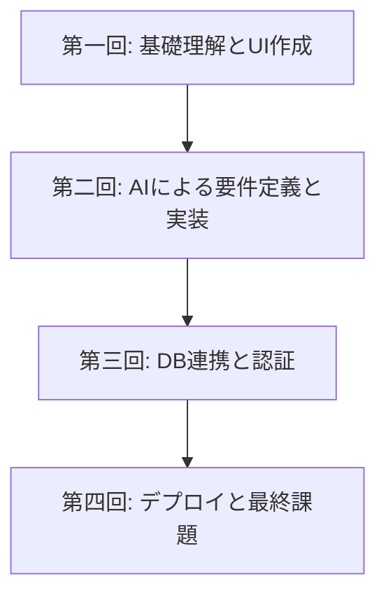

# Vibe Coder Bootcamp 成果報告会 資料

---

## 【パート1：研修概要説明】
*(受講生発表前に、審査員向けに手短に説明)*

### 1. 本研修でお伝えしたこと
- **目的:** AIを使いこなし、自らアイデアを形にできる「Vibe Coder」の育成。
- **設計思想:** 詳細な手順よりも「なぜそうするのか」という**基本概念の理解**を重視し、**応用力**を養うことを目指しました。

### 2. カリキュラムの全体像
- 4週間（合計8時間）で、Webアプリ開発の全工程をAIと共に体験するプログラムです。

### 3. 習得スキルセット
- 受講生は、AI（Cursor）への自然言語指示を通じて、以下のモダンな技術を操作するスキルを習得しました。
    - **フロントエンド:** Next.js, TypeScript
    - **バックエンド/DB:** Supabase
    - **認証:** Clerk
    - **デプロイ:** Vercel

### 4. 審査員の皆様へのお願い
- 本日は、技術の巧拙よりも、各発表者の**アイデア、熱意、そして学びの応用力**という観点で評価いただけますと幸いです。
- 審査にあたり、こちらの採点用アプリケーションをご利用ください。
- **URL:** `https://demodaybasic.vercel.app/`
- お名前をフルネームで入力後、「採点を開始する」ボタンを押してください。

---
---

## 【パート2：研修の振り返り】
*(結果発表後、総括として説明)*

### 5. 研修成果の定量的分析（アンケート結果）
- **全体満足度:** **4.55** / 5.0
- **面白さ:** **4.50** / 5.0
- **所感:** 非常に高い満足度を記録しました。難易度は中程度（3.90/5.0）であり、挑戦的かつ達成感のある内容であったことが伺えます。満足度・面白さ評価で「3点以下」が0件であったことは、特筆すべき点です。

### 6. 研修成果の定性的分析（受講生の声）
- 「AIを使ってやる、むしろそうすべきだと感じた」
- 「ビズ側の人材が出来るようになった時のインパクトが凄過ぎる」
- 「他人の詰まりポイントから学べた」
- **所感:** スキル習得に留まらず、AI活用の本質的な価値や、組織にもたらすインパクトを実感いただけた点が大きな成果です。

### 7. 今回の学びと今後の課題（講師所感）
- **手応え:**
    - 「基本概念」を重視するアプローチにより、受講生の**応用力**が着実に向上したと確信しています。
    - 短期間で高い成果を出せたのは、ひとえに受講生の皆様の学習意欲の賜物です。
- **反省点と課題:**
    - 一方で、一部の受講生には負荷が高かった点も事実です（難易度評価5が25%）。
    - 今後は、IT基礎用語の解説資料の充実や、より丁寧なフォローアップ体制の構築が課題であると認識しております。

### 8. 最後に：Vibe Coderのこれから
- 本研修は、AI時代を生き抜くための第一歩です。ここで得た「AIをパートナーとして、自ら価値を創造する」経験を、ぜひ今後の業務に活かしていただきたいと願っております。
- この火を絶やさぬよう、組織として継続的な学びの機会を設けていくことが、今後の更なる成長に繋がると信じております。本日は誠にありがとうございました。
