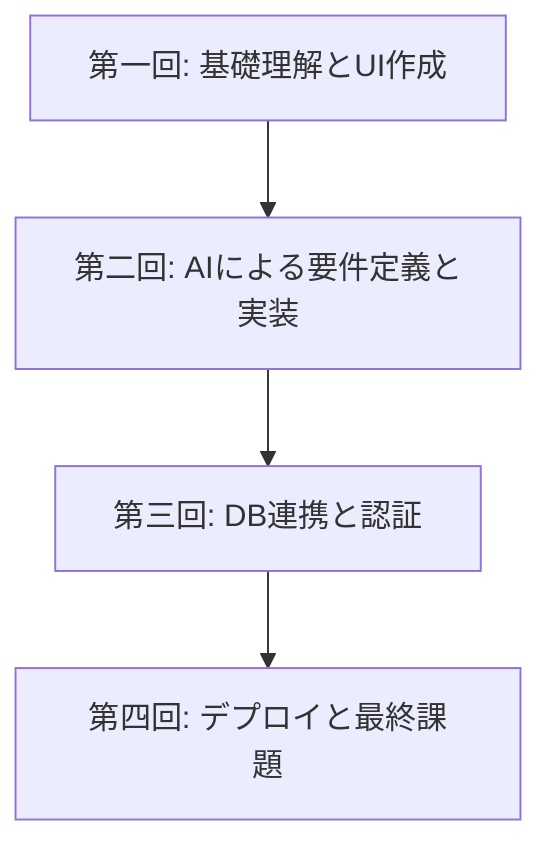

# Vibe Coder Bootcamp 成果報告会 資料

---

## 1. 本日の流れ（式次第）
1.  開会の挨拶
2.  研修概要説明（本資料）
3.  受講生による成果発表（各15分）
4.  Vibe Coder認定式 ＆ 結果発表
5.  研修の振り返り（本資料）
6.  総括・閉会

---

## 【パート1：研修概要説明】
*(受講生発表前に、審査員向けに手短に説明)*

### 2. 本研修でお伝えしたこと

**目的:**
本研修のゴールは、単に特定のツールを使えるようになることではありません。AIを日常業務で当たり前に使いこなし、自らの手でアイデアを形にできる、次世代の価値創造人材 **「Vibe Coder」** を育成することにありました。

**設計思想:**
そのために、あえて詳細な操作手順の解説を減らし、「なぜAPIキーが必要なのか」「なぜこのアーキテクチャを選ぶのか」といった **基本概念の理解** に重点を置きました。変化の激しいAI時代において、ツールのUI変更などに左右されない、真の **応用力** を養うことを目指した設計です。

### 3. カリキュラムの全体像

4週間（合計8時間）という短期間で、Webアプリケーション開発の全工程（アイデア創出 → 実装 → 公開）を、AIをパートナーとして一気通貫で体験するプログラムです。

### 3. 習得スキルセット

受講生の皆様は、AIエディタ「Cursor」への自然言語（日本語）での指示を通じて、以下のモダンな技術スタックを自在に操るスキルを習得しました。

- **フロントエンド:** Next.js, TypeScript
- **バックエンド/DB:** PostgreSQL (Supabase)
- **認証:** Clerk
- **デプロイ:** Vercel

### 4. 審査員の皆様へのお願い

本日の成果発表では、技術的な完成度よりも、各発表者が**「なぜそれを作ったのか」という熱意**、**「誰のどんな課題を解決するのか」というアイデア**、そして**「研修での学びをどう活かしたか」という応用力**の3点にご注目いただけますと幸いです。

審査にあたり、こちらの採点用アプリケーションをご利用ください。
お手数ですが、下記URLにアクセスいただき、お名前をフルネームで入力後、「採点を開始する」ボタンを押して評価をお願いいたします。

- **審査用URL:** `https://demodaybasic.vercel.app/`

---
---

## 【パート2：研修の振り返り】
*(結果発表後、総括として説明)*

### 5. 研修成果の定量的分析（アンケート結果）

研修後のアンケートでは、以下の通り非常に高い評価をいただきました。

- **全体満足度:** **4.55** / 5.0
- **面白さ:** **4.50** / 5.0

- **所感:** 非常に高い満足度を記録しました。挑戦的かつ達成感のある内容であったことが伺えます。
- **詳細分析:** より詳しいアンケートの分析結果については、下記URLをご覧ください。
    - [アンケート分析レポート](https://claude.ai/public/artifacts/d5e468fc-9d08-4fb4-ba8a-cb8fbeb8dab0)

### 6. 最後に：Vibe Coderのこれから

本研修は、AI時代を生き抜くための第一歩です。ここで得た「AIをパートナーとして、自ら価値を創造する」経験を、ぜひ今後の業務に活かしていただきたいと願っております。

この火を絶やさぬよう、組織として継続的な学びの機会を設けていくことが、今後の更なる成長に繋がると信じております。

最後にお願いとなりますが、今回の取り組みについて、貴社と弊社の共同でのプレスリリースをご検討いただけますと幸いです。非エンジニア人材への先進的なAI教育事例として、広く発信していくお手伝いができればと考えております。

本日は誠にありがとうございました。
