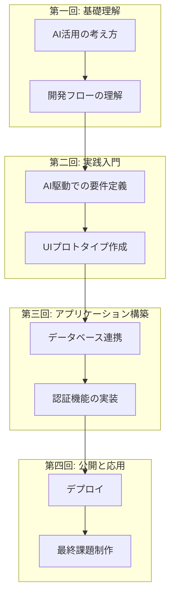

# Vibe Coder Bootcamp 研修実施報告書

## 1. 本日のデモデイについて

### 1.1. 開催趣旨
本日はご多忙の折、Vibe Coder Bootcampの成果報告会にご参加いただき、誠にありがとうございます。
本会は、4週間にわたる研修を受講したメンバーが、AIを活用して「アイデアを形にする力」をどのように習得したか、その成果を皆様にご覧いただく場です。

### 1.2. デモデイ式次第
1.  開会の挨拶
2.  Vibe Coder Bootcamp 研修概要説明（本資料）
3.  受講生による成果発表（各15分）
4.  質疑応答・審査
5.  総評
6.  閉会の挨拶

---

## 2. 研修概要：何を学んだのか

### 2.1. 研修の目的と設計思想
- **目的:** AIを日常業務で当たり前に使いこなし、自ら課題解決や価値創造ができる「Vibe Coder」のマインドセットと基本スキルを習得すること。
- **設計思想:** あえて詳細な手順の解説を減らし、「なぜそうするのか」という**基本概念の理解**に重点を置きました。これにより、ツールのUI変更などに左右されない、応用力の高い人材の育成を目指しました。

### 2.2. カリキュラムの全体像
- 4週間（合計8時間）+自学習で、Webアプリケーション開発の全工程（要件定義、設計、実装、デプロイ）をAIと共に体験するプログラムです。

### 2.3. 習得したスキルセット
- 受講生は、以下のモダンな技術スタックをAI（Cursor）への自然言語指示を通じて操作するスキルを習得しました。
    - **フロントエンド:** Next.js, TypeScript
    - **バックエンド/DB:** Supabase
    - **認証:** Clerk
    - **デプロイ:** Vercel

---

## 3. 研修の成果と考察

### 3.1. 定量的な成果（アンケート結果より）
- **全体満足度:** **4.55** / 5.0
- **面白さ:** **4.50** / 5.0
- **所感:** 非常に高い満足度を記録しました。難易度は中程度（3.90/5.0）であり、挑戦的かつ達成感のある内容であったことが伺えます。

### 3.2. 定性的な成果（受講生の声より）
- 「AIを使ってやる、むしろそうすべきだと感じた」
- 「ビズ側の人材が出来るようになった時のインパクトが凄過ぎる」
- 「他人の詰まりポイントから学べた」
- **所感:** スキル習得に留まらず、AI活用の本質的な価値や、組織にもたらすインパクトを実感いただけた点が大きな成果です。

### 3.3. 講師所感と今後の課題
- **手応え:** 「基本概念」を重視したことで、受講生の応用力は着実に向上したと確信しています。短期間で高い成果を出せたのは、ひとえに受講生の皆様の学習意欲の賜物です。
- **反省点と課題:** 一方で、一部の受講生には負荷が高かった点も事実です（難易度評価5が25%）。今後は、IT基礎用語の解説資料の充実や、より丁寧なフォローアップ体制の構築が課題であると認識しております。

---

## 4. 受講生による成果発表
- これより、各受講生が本研修で得た学びを基に制作した、オリジナルアプリケーションの発表に移ります。
- 評価のポイントは、技術の巧拙よりも「なぜそれを作ったのか」という**熱意**、「誰のどんな課題を解決するのか」という**アイデア**、そして「研修での学びをどう活かしたか」という**応用力**です。

（ここに各発表者の紹介を挿入）
