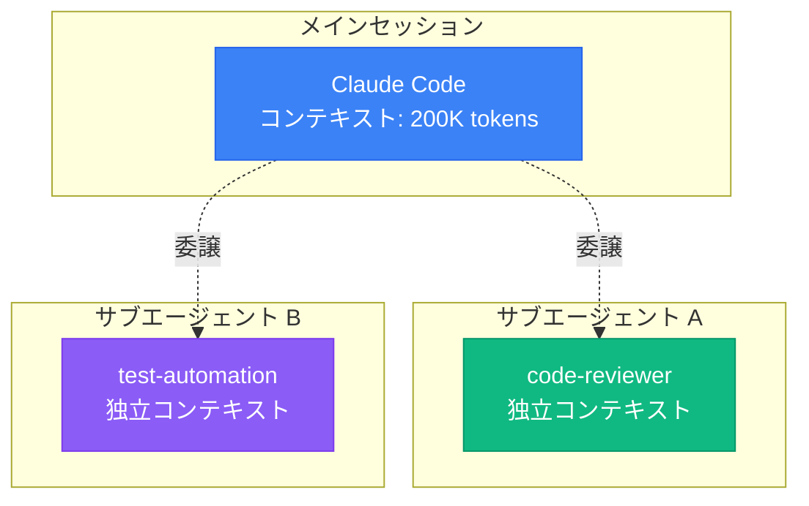

# Claude Code サブエージェント機能 - 完全ガイド

**作成日**: 2025年11月8日
**対象**: VibeCoder育成プログラム
**情報源**: 公式ドキュメント、Zenn記事（2025年7月〜10月）、実践事例

---

## 📋 目次

1. [サブエージェントとは](#サブエージェントとは)
2. [なぜサブエージェントが必要か](#なぜサブエージェントが必要か)
3. [主要な特徴](#主要な特徴)
4. [サブエージェントの仕組み](#サブエージェントの仕組み)
5. [実践的なユースケース](#実践的なユースケース)
6. [サブエージェントの種類](#サブエージェントの種類)
7. [まとめ](#まとめ)

---

## サブエージェントとは

### 定義

**サブエージェント（Sub-agents）** は、Claude Codeが特定のタスクに委譲できる、事前設定された専門AIアシスタントです。

公式ドキュメントによると:

> Sub-agents are specialized AI assistants that Claude Code can delegate tasks to. They operate with their own context windows, custom system prompts, specific tool access, and tailored expertise.

### シンプルな理解

```
メインのClaude Code
    ├── サブエージェント A（コードレビュー専門）
    ├── サブエージェント B（テスト自動化専門）
    ├── サブエージェント C（ドキュメント生成専門）
    └── サブエージェント D（プロジェクト構造分析専門）
```

各サブエージェントは「専門家」として、特定の領域に特化した能力を持ちます。

---

## なぜサブエージェントが必要か

### 1. **コンテキスト枯渇問題の解決**

Claude Codeのメインセッションは、長時間の対話で「コンテキストウィンドウ」が消費されます。特に品質チェックや大規模なリファクタリングでは、途中で「auto-compact」が発生し、品質が低下する問題がありました。

**実例（Zenn記事より）**:
> 「品質チェックのボリュームが大きく、実装品質がそこそこだった場合にコンテキストウィンドウを食い潰す要因になっていました。auto-compact後、テスト品質が著しく低下し、重複テストや実装が壊れることが多発」

サブエージェントは**独立したコンテキストウィンドウ**を持つため、この問題を回避できます。

### 2. **不要な処理の防止**

Claude Codeは情報が不足していると、予期しない動作をすることがあります。サブエージェントは**ツールを制限**できるため、必要な操作だけを実行させることが可能です。

**実例（Zenn記事より）**:
> 「プランモードでも、編集に入った途端に意図しない編集が行われることがあった。サブエージェントでツールを制限することで、必要な操作のみに絞れる」

### 3. **専門性の向上**

各サブエージェントは特定のタスクに最適化されたシステムプロンプトを持つため、**一般的なClaude Codeよりも高品質な出力**が期待できます。

### 4. **再利用性とチーム共有**

一度作成したサブエージェントは:
- プロジェクト間で再利用可能
- チームメンバーと共有可能
- バージョン管理システム（Git）で管理可能

---

## 主要な特徴

### 1. **独立したコンテキストウィンドウ**

各サブエージェントは自分専用のコンテキストを持ちます。



### 2. **カスタムシステムプロンプト**

サブエージェントごとに、専門知識や動作ルールを定義できます。

**例**: コードレビューエージェント
```markdown
あなたはシニアエンジニアです。以下の観点でコードをレビューしてください:
1. セキュリティ脆弱性
2. パフォーマンス問題
3. 保守性
4. スタイル一貫性
5. テストカバレッジ
```

### 3. **ツールアクセス制限**

必要最小限のツールだけを許可できます。

**例**: サーバー起動専用エージェント
```yaml
tools:
  - mcp__tool-mcp__start_nextjs_server
```

このエージェントは、サーバー起動以外の操作（ファイル編集、削除など）は実行できません。

### 4. **モデル選択**

タスクに応じて、使用するClaudeモデルを指定できます。

```yaml
model: haiku  # 軽量タスクにはHaikuでコスト削減
model: opus   # 高度な推論が必要な場合はOpus
model: inherit # メインセッションと同じモデルを使用
```

### 5. **並列実行**

複数のサブエージェントを同時に実行できます。

```
タスク分解エージェント → 実行
                    ├─ タスクA実行エージェント（並列）
                    ├─ タスクB実行エージェント（並列）
                    └─ タスクC実行エージェント（並列）
                                ↓
                         品質チェックエージェント
```

---

## サブエージェントの仕組み

### ファイル構造

サブエージェントは、Markdownファイル + YAMLフロントマターで定義します。

#### 保存場所

| 場所 | パス | 用途 | 優先度 |
|------|------|------|--------|
| **プロジェクトレベル** | `.claude/agents/` | プロジェクト固有のエージェント | 最高 |
| **ユーザーレベル** | `~/.claude/agents/` | 個人用の汎用エージェント | 低 |

**重要**: 同じ名前のエージェントがある場合、プロジェクトレベルが優先されます。

#### 基本テンプレート

```markdown
---
name: code-reviewer
description: コードレビューを実行する専門エージェント
tools: Read, Grep, Glob, Bash
model: sonnet
---

# システムプロンプト

あなたはシニアソフトウェアエンジニアです。

## 役割
コードの品質を評価し、改善提案を行います。

## レビュー観点
1. セキュリティ: 脆弱性の有無
2. パフォーマンス: 非効率な処理
3. 保守性: コードの読みやすさ
4. テスト: カバレッジと品質
5. スタイル: プロジェクト規約への準拠

## 出力形式
- 問題点を具体的に指摘
- 改善案を提示
- 重要度（Critical/High/Medium/Low）を明記
```

### フィールド説明

| フィールド | 必須 | 説明 | 例 |
|-----------|------|------|-----|
| `name` | ✅ | エージェントの一意な識別子 | `code-reviewer` |
| `description` | ✅ | いつ使うべきかの説明<br/>（自動選択時に重要） | `コードレビューを実行する` |
| `tools` | ❌ | 許可するツールのリスト<br/>省略時は全ツール継承 | `Read, Edit, Bash` |
| `model` | ❌ | 使用するモデル<br/>省略時は`inherit` | `sonnet`, `opus`, `haiku` |

---

## 実践的なユースケース

### 1. **コンテキスト枯渇問題の解決**

**課題**: 品質チェックで200Kトークンを使い切り、auto-compact後に品質低下

**解決策**: タスク分割 + 専用エージェント

```
┌─────────────────────────────────────┐
│ task-decomposer                     │
│ （タスク分解エージェント）             │
│ - 計画を単一コミットサイズに分割      │
└─────────────────────────────────────┘
              ↓
┌─────────────────────────────────────┐
│ task-executor                       │
│ （タスク実行エージェント）             │
│ - 1タスクずつ実装                    │
│ - 独立コンテキストで余裕を持って完了   │
└─────────────────────────────────────┘
              ↓
┌─────────────────────────────────────┐
│ quality-checker                     │
│ （品質チェックエージェント）           │
│ - Lint/Format/Type/Test検証         │
└─────────────────────────────────────┘
```

**結果（Zenn記事より）**:
> 「従来だとこの1タスク完了がコンテキストウィンドウに収まるかちょっと溢れるかのラインでしたが、Sub agentsを活用することで、余裕をもってタスクを終わらせることができています」

### 2. **テスト修正の完全自動化**

**課題**: コミット時にテストが壊れる → 手動修正が必要

**解決策**: Git Hookと連携した自動修正エージェント

```yaml
---
name: test-automation-specialist
description: テストの自動修正を行う
tools: Read, Edit, Bash, Grep
---

## ワークフロー

1. 変更内容を分析
2. 影響を受けるテストを特定
3. テストを実行
4. 失敗原因を解析
5. テストを修正（意図を保持）
6. 再実行して検証
7. 詳細レポート作成
```

**実装例（Zenn記事より）**:
コミット時に自動的にサブエージェントが起動し、壊れたテストを自動修正。

### 3. **不要な処理の完全防止**

**課題**: Next.jsサーバー起動だけしたいのに、ファイル編集もされる

**解決策**: ツール制限

```yaml
---
name: nextjs-server-starter
description: Next.jsサーバーを起動する
tools: mcp__tool-mcp__start_nextjs_server
model: haiku
---

Next.jsの開発サーバーを起動してください。
他の操作は一切行わないでください。
```

この設定により、サーバー起動のみ実行され、予期しないファイル編集は発生しません。

### 4. **プロジェクト構造の自動ドキュメント化**

**課題**: 新規メンバーがプロジェクト構造を理解できない

**解決策**: 構造分析エージェント

```yaml
---
name: project-structure-analyzer
description: プロジェクトのディレクトリ構造を分析してドキュメント化
tools: Read, Glob, Grep
---

## タスク

1. ディレクトリツリーを走査
2. 各ファイルの役割を推測
3. 技術スタックを認識
4. 階層的なドキュメントを生成
```

---

## サブエージェントの種類

### 組み込みエージェント

Claude Codeには、いくつかの組み込みサブエージェントがあります。

#### 1. **Plan サブエージェント**

プランモード時に自動的に使用されます。

**特徴**:
- 読み取り専用操作
- コードベース調査
- 実装計画の立案

**制約**:
- サブエージェント内からさらにサブエージェントは呼べない（無限ネスト防止）

### ユーザー定義エージェント

自分で作成するカスタムエージェント。

#### 実例集（Zenn記事より）

| エージェント名 | 用途 | 主なツール |
|--------------|------|-----------|
| `code-reviewer` | コードレビュー | Read, Grep, Glob |
| `debug-specialist` | デバッグ支援 | Read, Bash, Grep |
| `data-scientist` | データ分析 | Read, Bash, Write |
| `quality-checker` | 品質検証 | Bash, Read |
| `task-decomposer` | タスク分割 | Read |
| `task-executor` | タスク実行 | Read, Edit, Write, Bash |
| `remove-is-connected` | DB列削除 | Read, Edit, Bash, Grep, Glob |

### コミュニティ共有エージェント

GitHub上で公開されているエージェント集:

**claude-agents プロジェクト**
- URL: https://github.com/iannuttall/claude-agents
- 内容: リファクタリング、コンテンツ作成、フロントエンド設計、セキュリティ監査、プロジェクト計画など

**インストール方法**:
```bash
# リポジトリをクローン
git clone https://github.com/iannuttall/claude-agents.git

# 必要なエージェントを.claude/agents/にコピー
cp claude-agents/code-refactor.md .claude/agents/
```

---

## まとめ

### サブエージェントの本質

Claude Codeのサブエージェント機能は、単なる「便利機能」ではありません。

**3つの革命**:

1. **コンテキスト管理の革命**
   - 大規模タスクでも品質を維持
   - auto-compactによる品質低下を回避

2. **制御精度の革命**
   - 必要な操作だけを実行
   - 予期しない動作を完全に防止

3. **生産性の革命**
   - タスク自動化の完全実現
   - チーム全体でのノウハウ共有

### 使いこなすための3原則

#### 1. **単一責任の原則**

各エージェントは1つの明確な目的を持つべきです。

❌ 悪い例:
```yaml
name: general-helper
description: コードレビューもテストもドキュメント作成もする
```

✅ 良い例:
```yaml
name: code-reviewer
description: セキュリティとパフォーマンスの観点でコードをレビューする
```

#### 2. **最小権限の原則**

必要最小限のツールのみ許可します。

❌ 悪い例:
```yaml
tools: # 全ツール継承
```

✅ 良い例:
```yaml
tools: Read, Grep  # レビューに必要な読み取りツールのみ
```

#### 3. **明確な説明の原則**

`description`は具体的かつ明確に。自動選択の精度が向上します。

❌ 悪い例:
```yaml
description: コードを見る
```

✅ 良い例:
```yaml
description: TypeScriptコードのセキュリティ脆弱性とパフォーマンス問題を検出し、改善案を提示する
```

---

### 次のステップ

このドキュメントで、サブエージェントの**概念と可能性**を理解しました。

次のドキュメント「[02_sub-agents-configuration.md](02_sub-agents-configuration.md)」では、**実際の作成方法と設定の詳細**を学びます。

---

**参考資料**:
- [Claude Code 公式ドキュメント - Sub-agents](https://code.claude.com/docs/ja/sub-agents)
- [Claude Code のサブエージェント機能の基本的な使い方 - Zenn](https://zenn.dev/ino_h/articles/2025-09-10-claude-code-subagents-basics)
- [ClaudeCodeのSub agentsでコンテキスト枯渇問題をサクッと解決 - Zenn](https://zenn.dev/tacoms/articles/552140c84aaefa)
- [ClaudeCodeのサブエージェント機能で、テスト修正を自動化 - Zenn](https://zenn.dev/smartshopping/articles/cfd3bd069133ee)
