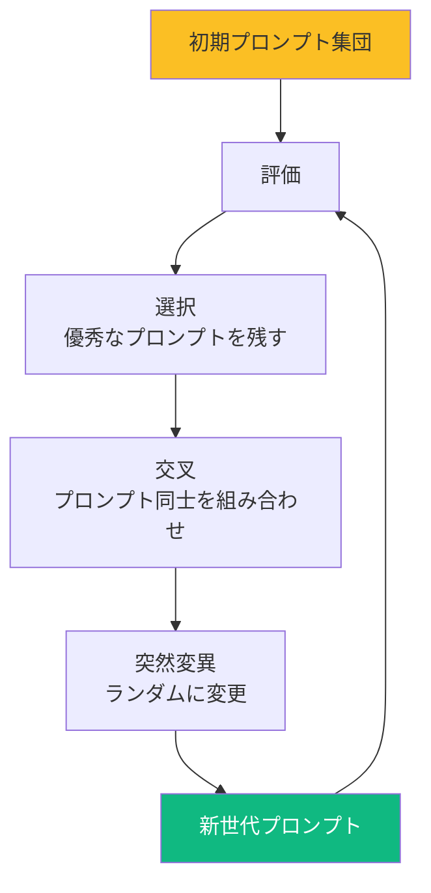
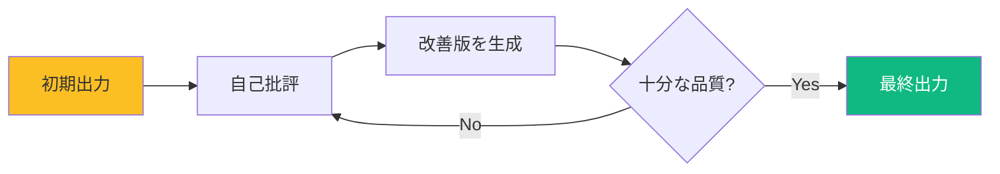
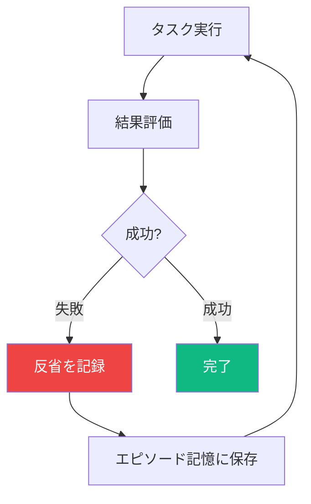

# 自動プロンプト最適化技術 - 2025年版完全ガイド

**作成日**: 2025年11月8日
**対象**: VibeCoder育成プログラム
**前提知識**: [01_sub-agents-overview.md](01_sub-agents-overview.md), [02_sub-agents-configuration.md](02_sub-agents-configuration.md)

---

## 📋 目次

1. [プロンプト最適化とは](#プロンプト最適化とは)
2. [主要な最適化手法](#主要な最適化手法)
3. [Claude Code向けツール](#claude-code向けツール)
4. [実践的な適用方法](#実践的な適用方法)
5. [評価と測定](#評価と測定)
6. [まとめ](#まとめ)

---

## プロンプト最適化とは

### 定義

**プロンプト最適化（Prompt Optimization）** は、LLM（大規模言語モデル）に対する指示文（プロンプト）を自動的に改善し、出力品質を向上させる技術です。

### なぜ必要か

#### 問題: 手動プロンプト作成の限界

```
曖昧な指示
    ↓
不安定な出力
    ↓
何度も試行錯誤
    ↓
時間とコストの浪費
```

#### 解決: 自動最適化

```
初期プロンプト
    ↓
AI が最適化
    ↓
構造化・明確化・補強
    ↓
高品質な出力
```

### ビジネス価値

| 指標 | 手動作成 | 自動最適化 |
|------|---------|-----------|
| **初回成功率** | 30-50% | 85-95% |
| **反復回数** | 3-5回 | 1-2回 |
| **時間** | 30-60分 | 2-5分 |
| **一貫性** | 低い | 高い |
| **スケーラビリティ** | 困難 | 容易 |

---

## 主要な最適化手法

2025年現在、以下の手法が実用化されています。

### 1. LLM-as-Optimizer（OPRO）

#### 概要

**LLM自身がプロンプトを改善する**手法です。

#### 仕組み


#### プロセス

1. **初期プロンプト**を用意
2. LLMで実行して**結果を評価**
3. 評価スコアを含めて**LLMに改善を依頼**
4. 新しいプロンプトで再実行
5. スコアが向上するまで繰り返し

#### 実例

**初期プロンプト**:
```
コードをレビューしてください
```

**OPRO による改善後**:
```
あなたはシニアソフトウェアエンジニアです。
以下の観点でTypeScriptコードをレビューしてください:

1. セキュリティ脆弱性（XSS、SQLi、CSRF）
2. パフォーマンス問題（メモリリーク、不要な再レンダリング）
3. 型安全性（any型の乱用、null/undefined処理）
4. 保守性（命名規則、コメント、関数の複雑度）

各問題に対して:
- 重要度（Critical/High/Medium/Low）
- 該当箇所（ファイル名:行番号）
- 具体的な改善コード例

を提示してください。
```

#### 特徴

- ✅ **強力**: 大規模モデルで効果大
- ⚠️ **コスト**: 複数回実行が必要
- ✅ **汎用性**: あらゆるタスクに適用可能

---

### 2. 進化的アルゴリズム（Evolutionary Algorithms）

#### 概要

**生物進化を模倣**してプロンプトを改善します。

#### 代表的な手法

##### PromptBreeder



##### EvoPrompt

プロンプトの「遺伝子」を進化させます。

**進化の例**:

**第1世代**:
```
1. "コードを確認してください"
2. "バグを見つけてください"
3. "問題を報告してください"
```

**評価** → プロンプト2が最高スコア

**第2世代**（交叉・突然変異）:
```
1. "セキュリティ上のバグを特定し、修正案を提示してください"
2. "バグを見つけ、重要度と対策を報告してください"
3. "コードの問題を優先度順に詳細報告してください"
```

**評価** → プロンプト1が最高スコア

#### 特徴

- ✅ **多様性**: 様々なアプローチを試行
- ✅ **ロバスト**: 局所最適解を回避
- ⚠️ **時間**: 世代交代に時間がかかる

---

### 3. DSPy - プログラム的最適化

#### 概要

**プロンプトをプログラムとして扱い**、コンパイラのように最適化します。

#### 特徴

従来のプロンプティング:
```python
# 手動でプロンプトを書く
prompt = """
ステップ1: データを取得
ステップ2: 分析
ステップ3: 要約
"""
```

DSPyのアプローチ:
```python
# 宣言的に定義
class Analyzer(dspy.Module):
    def __init__(self):
        self.retrieve = dspy.Retrieve()
        self.analyze = dspy.ChainOfThought("context -> analysis")
        self.summarize = dspy.ChainOfThought("analysis -> summary")

    def forward(self, question):
        context = self.retrieve(question)
        analysis = self.analyze(context=context)
        summary = self.summarize(analysis=analysis)
        return summary

# コンパイラが最適化
analyzer = Analyzer()
optimized = dspy.compile(analyzer, trainset=examples)
```

#### MIPROv2（DSPyの最適化エンジン）

**ベイズ最適化**を使って、プロンプトとデモンストレーション例を同時に最適化します。

```
初期プログラム
    ↓
MIPROv2コンパイル
    ↓
最適化されたプロンプト
    ↓
最適な Few-Shot 例
    ↓
高性能なシステム
```

#### 特徴

- ✅ **パイプライン全体を最適化**: 複数ステップの処理に最適
- ✅ **再現性**: プログラムとして管理可能
- ✅ **RAG/Agent向け**: 複雑なシステムで真価を発揮
- ⚠️ **学習曲線**: 独自の概念とAPIを理解する必要

---

### 4. Self-Refine - 自己改善ループ

#### 概要

**LLMが自分の出力を批評し、改善**を繰り返します。

#### プロセス



#### 実例

**ラウンド1: 初期出力**
```typescript
function login(user, pass) {
  if (user == "admin" && pass == "1234") {
    return true;
  }
  return false;
}
```

**自己批評**:
```
問題点:
1. パスワードがハードコード
2. 平文比較
3. 型定義なし
4. SQLインジェクション対策なし
```

**ラウンド2: 改善版**
```typescript
async function login(
  username: string,
  password: string
): Promise<boolean> {
  const hashedPassword = await bcrypt.hash(password, 10);
  const user = await db.getUserByUsername(username);

  if (!user) return false;

  return await bcrypt.compare(password, user.passwordHash);
}
```

#### 特徴

- ✅ **シンプル**: 実装が容易
- ✅ **訓練不要**: 追加データ不要
- ⚠️ **コスト**: 複数回実行が必要

---

### 5. Reflexion - エピソード記憶

#### 概要

**過去の失敗を記憶し、次に活かす**手法です。

#### 仕組み



#### 実例

**試行1**:
```
タスク: ログイン機能実装
失敗: テストが通らない
反省: "セッション管理を忘れていた。次回は認証後のセッション生成を必ず確認する"
```

**試行2**:
```
タスク: ログイン機能実装
記憶参照: "セッション管理を忘れていた..."
実装: セッション生成を含めて実装
成功: テスト通過
```

#### 特徴

- ✅ **学習**: 失敗から学ぶ
- ✅ **継続的改善**: 使うほど賢くなる
- ⚠️ **メモリ管理**: 記憶の保存と検索が必要

---

### 6. ベイズ最適化

#### 概要

**統計的手法でサンプル効率的に最適解を探索**します。

#### 仕組み

```
1. 複数のプロンプト候補を生成
2. 少数を評価
3. 統計モデルで「良さそうな領域」を推定
4. その領域のプロンプトを優先的に評価
5. 繰り返し
```

#### 特徴

- ✅ **サンプル効率**: 少ない試行で最適解発見
- ✅ **API コスト削減**: 無駄な評価を減らす
- ⚠️ **複雑さ**: 数学的背景知識が必要

---

## Claude Code向けツール

### 1. Anthropic公式: Prompt Improver

#### 概要

Anthropicが提供する**公式のプロンプト改善ツール**です。

#### 機能

1. **Chain-of-Thought 追加**: 段階的な推論を促す
2. **例の標準化**: XML形式に統一
3. **例の補強**: CoT推論を追加
4. **構造改善**: 文法・スペルミス修正

#### 使用方法

**Console版**（Web UI）:
1. https://console.anthropic.com/ にアクセス
2. Prompt Improver を選択
3. 元のプロンプトを入力
4. 改善版を受け取る

**API版**:
```python
import anthropic

client = anthropic.Anthropic(api_key="YOUR_API_KEY")

original_prompt = "コードをレビューしてください"

response = client.messages.create(
    model="claude-opus-4",
    system="""あなたはプロンプトエンジニアです。
    以下のプロンプトを改善してください。""",
    messages=[{
        "role": "user",
        "content": original_prompt
    }]
)

improved_prompt = response.content[0].text
print(improved_prompt)
```

#### 特徴

- ✅ **公式**: Anthropic推奨
- ✅ **高品質**: Claude最適化済み
- ✅ **簡単**: ワンクリック改善
- ⚠️ **カスタマイズ性**: 細かい制御は難しい

---

### 2. claude-code-prompt-optimizer

#### 概要

**`<optimize>` タグで自動最適化**する非公式ツールです。

GitHub: https://github.com/johnpsasser/claude-code-prompt-optimizer

#### 仕組み

```
ユーザー入力
    ↓
<optimize> タグを検知
    ↓
Claude Opus 4.1 で最適化
    ↓
10,000トークンの思考
    ↓
構造化されたプロンプト
    ↓
Claude Code で実行
```

#### インストール

```bash
# 1. リポジトリをクローン
git clone https://github.com/johnpsasser/claude-code-prompt-optimizer.git
cd claude-code-prompt-optimizer

# 2. 依存関係インストール
npm install

# 3. APIキー設定
export ANTHROPIC_API_KEY="your-api-key"

# 4. Claude Code設定
# ~/.claude/settings.json に追加
{
  "hooks": {
    "UserPromptSubmit": {
      "command": "/path/to/optimize-prompt.sh",
      "enabled": true
    }
  }
}
```

#### 使用方法

```
<optimize> create a REST API for user management
```

**自動的に拡張される内容**:
- アーキテクチャ設計
- 実装フェーズ分割
- エラーハンドリング
- セキュリティ対策
- テスト戦略
- ドキュメント要件

#### 実例

**入力**:
```
<optimize> create a login page
```

**出力** (一部抜粋):
```markdown
# ログインページ実装

## アーキテクチャ

### 技術スタック
- React + TypeScript
- React Hook Form（フォーム管理）
- Zod（バリデーション）
- TanStack Query（API通信）

### セキュリティ要件
- CSRF トークン実装
- XSS 対策（DOMPurify）
- パスワード強度チェック
- レート制限

## 実装フェーズ

### フェーズ1: UIコンポーネント
1. フォームレイアウト
2. 入力フィールド（Email, Password）
3. バリデーションメッセージ
4. ローディング状態

### フェーズ2: ロジック
1. フォーム送信処理
2. APIリクエスト
3. エラーハンドリング
4. セッション管理

### フェーズ3: テスト
1. 単体テスト（Jest）
2. 統合テスト（React Testing Library）
3. E2Eテスト（Playwright）

## コード例

```typescript
// LoginForm.tsx
...
```
```

#### 特徴

- ✅ **自動**: タグを付けるだけ
- ✅ **詳細**: 包括的な仕様生成
- ⚠️ **コスト**: Opus 4.1使用で高コスト
- ⚠️ **時間**: 2-5秒の待機時間

---

### 3. claude-code-prompt-improver

#### 概要

**曖昧なプロンプトを検知して質問**する非公式ツールです。

GitHub: https://github.com/severity1/claude-code-prompt-improver

#### 仕組み

```
ユーザー入力
    ↓
曖昧さを検知
    ↓
コードベース/Web/ドキュメント調査
    ↓
1-6個の質問を生成
    ↓
ユーザー回答
    ↓
回答を反映して実行
```

#### インストール

```bash
# 1. NPMパッケージとしてインストール
npm install -g claude-code-prompt-improver

# 2. Claude Code設定
# ~/.claude/settings.json
{
  "hooks": {
    "UserPromptSubmit": {
      "command": "claude-code-prompt-improver",
      "enabled": true
    }
  }
}
```

#### 使用方法

**明確なプロンプト**（そのまま通過）:
```
src/auth.ts の JWT検証ロジックを、RS256アルゴリズムを使用して実装してください
```
→ 質問なし、即実行

**曖昧なプロンプト**（質問が発生）:
```
認証を実装してください
```

**自動生成される質問**:
```
1. 認証方式は？（JWT / Session / OAuth2.0 / その他）
2. 使用するライブラリは？（Passport.js / Auth.js / 独自実装）
3. 対応するプロバイダーは？（Google / GitHub / Email/Password）
4. トークンの有効期限は？
5. リフレッシュトークンは必要？
6. 既存の認証コードはプロジェクトにありますか？
```

**ユーザー回答後**:
```
認証を実装してください

【回答】
1. JWT
2. Auth.js
3. Google と Email/Password
4. 7日間
5. はい、30日間
6. いいえ

→ この情報を元に最適な実装を提案
```

#### バイパスオプション

```
# 評価スキップ
*認証を実装してください

# スラッシュコマンド
/help

# メモリーモード
#重要な情報を記録
```

#### 特徴

- ✅ **インタラクティブ**: 対話で明確化
- ✅ **コンテキスト活用**: 過去の会話を参照
- ✅ **効率的**: 約300トークンのオーバーヘッド
- ⚠️ **Claude Code 2.0.22+必須**: `AskUserQuestion` ツール依存

---

## 実践的な適用方法

### ユースケース別推奨手法

| タスク | 推奨手法 | 理由 |
|--------|---------|------|
| **サブエージェント作成** | OPRO + Self-Refine | 高品質なシステムプロンプト生成 |
| **複雑なパイプライン** | DSPy | RAG/Agent の多段階処理最適化 |
| **一発勝負タスク** | claude-code-prompt-optimizer | 包括的な仕様生成 |
| **反復的タスク** | Reflexion | 失敗から学習 |
| **コスト制約あり** | claude-code-prompt-improver | 質問で無駄を削減 |
| **大量のプロンプト** | ベイズ最適化 | サンプル効率的探索 |

---

### ワークフロー例: サブエージェント最適化

#### ステップ1: 初期プロンプト作成

```markdown
---
name: code-reviewer
description: コードレビュー
tools: Read, Grep
---

コードをレビューしてください。
```

#### ステップ2: OPRO で改善

```python
# 改善プロンプト
"""
以下のサブエージェントのシステムプロンプトを改善してください:

【現在のプロンプト】
コードをレビューしてください。

【要件】
- セキュリティとパフォーマンスに焦点
- 具体的な出力形式を定義
- TypeScript/React に特化

【成功基準】
- 脆弱性検出率 90%以上
- 誤検知率 10%以下
- 実行可能な改善案を提示
"""
```

**OPRO の出力**:
```markdown
あなたは10年以上の経験を持つシニアセキュリティエンジニアです。

## 専門分野
- OWASP Top 10
- React/TypeScript セキュリティ
- パフォーマンス最適化

## レビュー観点

### 1. セキュリティ（最優先）
- XSS: dangerouslySetInnerHTML の使用
- 認証: JWT検証の適切性
- 認可: RBAC/ABAC の実装
...
```

#### ステップ3: Self-Refine で洗練

**自己批評**:
```
改善点:
1. 出力形式が明確でない → Markdown table で統一
2. 重要度基準が曖昧 → CVSS スコアを使用
3. 例が不足 → Before/After コード例を追加
```

**改善版**:
```markdown
## 出力形式

| 重要度 | CVSS | 問題 | 場所 | 改善案 |
|-------|------|------|------|-------|
| Critical | 9.0 | SQLi | auth.ts:42 | [コード例] |

### Before
```typescript
const query = `SELECT * FROM users WHERE id = ${userId}`;
```

### After
```typescript
const query = 'SELECT * FROM users WHERE id = ?';
db.execute(query, [userId]);
```
```

#### ステップ4: テスト

```typescript
// テストケース
const vulnerableCode = `
const userInput = req.body.name;
document.innerHTML = userInput;
`;

// エージェント実行
const result = await runAgent('code-reviewer', vulnerableCode);

// 検証
assert(result.includes('XSS'));
assert(result.includes('Critical'));
assert(result.includes('DOMPurify'));
```

#### ステップ5: Reflexion で継続改善

```
【記録】
失敗: React Hooksの依存配列を見逃した
反省: useEffect/useCallback の deps を必ずチェックする項目を追加

【次回の改善】
システムプロンプトに追加:
- useEffect 依存配列の完全性
- useCallback/useMemo の適切性
```

---

## 評価と測定

### 評価指標

#### 1. タスク成功率

```
成功率 = 成功したタスク数 / 全タスク数 × 100%
```

**例**: コードレビューで脆弱性を正しく検出できた割合

#### 2. 精度（Precision）

```
精度 = 正しい指摘 / 全指摘 × 100%
```

**例**: 指摘した問題が実際に問題だった割合（誤検知が少ない）

#### 3. 再現率（Recall）

```
再現率 = 正しい指摘 / 全問題 × 100%
```

**例**: 実際の問題のうち、検出できた割合（見逃しが少ない）

#### 4. 実行時間

```
効率 = タスク完了時間（最適化後） / タスク完了時間（最適化前）
```

#### 5. コスト

```
コスト削減率 = (最適化前コスト - 最適化後コスト) / 最適化前コスト × 100%
```

---

### LLM-as-a-Judge（注意点）

#### 概要

**別のLLMに評価させる**手法ですが、注意が必要です。

#### 利点

- ✅ 自動評価
- ✅ スケーラブル
- ✅ 人間評価の代替

#### 重大な問題（2025年研究より）

⚠️ **バイアス**: 特定の出力スタイルを好む
⚠️ **不安定性**: プロンプト変更で評価が変わる
⚠️ **過信**: 人間評価と乖離

#### 推奨アプローチ

```
1. 人間評価でゴールドスタンダード作成
    ↓
2. LLM-as-a-Judge を人間評価と比較校正
    ↓
3. 定期的に人間評価でスポットチェック
    ↓
4. LLM評価と人間評価の乖離を監視
```

---

## まとめ

### 学んだこと

✅ **6つの主要手法**: OPRO, 進化的, DSPy, Self-Refine, Reflexion, ベイズ最適化
✅ **3つのClaude Codeツール**: 公式Improver, Optimizer, Improver
✅ **実践的ワークフロー**: サブエージェント作成からテストまで
✅ **評価方法**: 成功率、精度、再現率、コスト
✅ **注意点**: LLM-as-a-Judgeのバイアス

---

### タスク別クイックガイド

```
┌─────────────────────────────────────────┐
│ シンプルな改善が必要                      │
│ → Anthropic Prompt Improver             │
└─────────────────────────────────────────┘

┌─────────────────────────────────────────┐
│ 包括的な仕様生成                         │
│ → claude-code-prompt-optimizer          │
└─────────────────────────────────────────┘

┌─────────────────────────────────────────┐
│ 曖昧な要求を明確化                       │
│ → claude-code-prompt-improver           │
└─────────────────────────────────────────┘

┌─────────────────────────────────────────┐
│ 複雑なRAG/Agent パイプライン             │
│ → DSPy + MIPROv2                        │
└─────────────────────────────────────────┘

┌─────────────────────────────────────────┐
│ 反復的な改善                             │
│ → Self-Refine + Reflexion               │
└─────────────────────────────────────────┘

┌─────────────────────────────────────────┐
│ コスト制約が厳しい                       │
│ → ベイズ最適化 + Haiku モデル           │
└─────────────────────────────────────────┘
```

---

### 次のステップ

プロンプト最適化の理論と手法を理解しました。

次のドキュメント「[04_practical-implementation.md](04_practical-implementation.md)」では、**これらの技術を組み合わせて、実際にサブエージェントベースのプロンプト最適化システムを構築**します。

---

**参考資料**:
- [OPRO: Large Language Models as Optimizers - ICLR 2024](https://proceedings.iclr.cc/paper_files/paper/2024/hash/3339f19c5fcee3ad74502947a32be9e6-Abstract-Conference.html)
- [DSPy: Compiling Declarative Language Model Calls - arXiv 2023](https://arxiv.org/abs/2310.03714)
- [Self-Refine - NeurIPS 2023](https://proceedings.neurips.cc/paper_files/paper/2023/hash/91edff07232fb1b55a505a9e9f6c0ff3-Abstract-Conference.html)
- [Reflexion - arXiv 2023](https://arxiv.org/abs/2303.11366)
- [Anthropic Prompt Improver - Official Docs](https://docs.claude.com/en/docs/build-with-claude/prompt-engineering/prompt-improver)
- [claude-code-prompt-optimizer - GitHub](https://github.com/johnpsasser/claude-code-prompt-optimizer)
- [claude-code-prompt-improver - GitHub](https://github.com/severity1/claude-code-prompt-improver)
