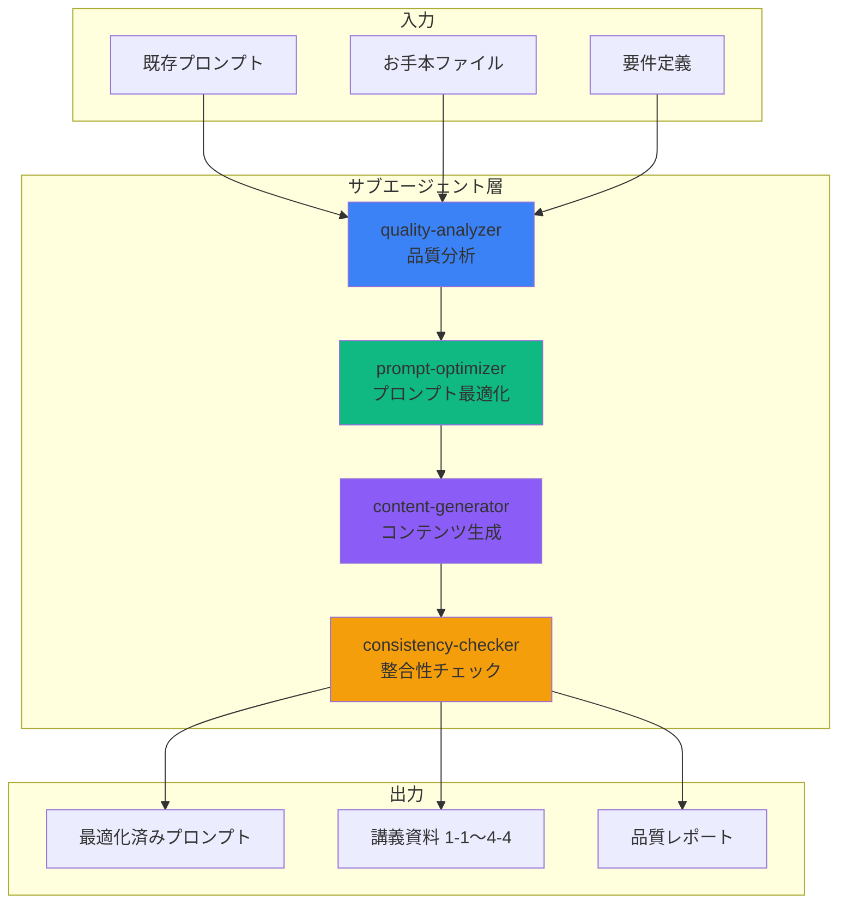
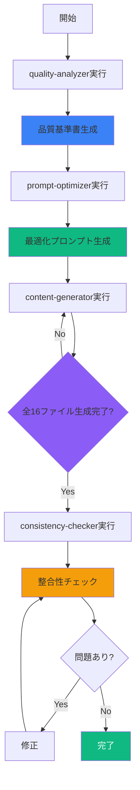

# サブエージェントベース・プロンプト最適化システムの実践実装

**作成日**: 2025年11月8日
**対象**: VibeCoder育成プログラム
**前提知識**: [01_sub-agents-overview.md](01_sub-agents-overview.md), [02_sub-agents-configuration.md](02_sub-agents-configuration.md), [03_prompt-optimization-techniques.md](03_prompt-optimization-techniques.md)

---

## 📋 目次

1. [システム概要](#システム概要)
2. [アーキテクチャ設計](#アーキテクチャ設計)
3. [サブエージェント実装](#サブエージェント実装)
4. [ワークフロー](#ワークフロー)
5. [実践例](#実践例)
6. [まとめ](#まとめ)

---

## システム概要

### 目的

**VibeCoder育成プログラムの講義資料（1-1〜4-4）を、一貫性を保ちながら高品質に自動生成する**システムを構築します。

### 要件

#### 1. 品質基準

お手本ファイル（1-1_オリエンテーションとマインドセット変革.md）と同等の品質:

- ✅ 明確な構造（YAMLフロントマター、章立て、まとめ）
- ✅ 視覚的要素（絵文字、Mermaid図、表）
- ✅ 教育効果（学習目標、位置づけ、橋渡し）
- ✅ 具体性（事例、数値、実践例）
- ✅ 一貫性（用語、トーン、フォーマット）

#### 2. 一貫性

全16ファイル（第1回〜第4回、各回4ファイル）を通じて:

- ✅ 用語定義の統一
- ✅ トーン&マナーの一貫性
- ✅ 進行の自然な流れ
- ✅ 重複の排除

#### 3. 効率性

- ✅ 手動調整を最小化
- ✅ 1ファイル生成を30分以内に
- ✅ 再生成が容易

---

## アーキテクチャ設計

### システム構成



### データフロー

1. **quality-analyzer** がお手本ファイルを分析 → 品質基準を抽出
2. **prompt-optimizer** が既存プロンプトを改善 → 最適化版生成
3. **content-generator** が最適化プロンプトで講義資料を生成
4. **consistency-checker** が全ファイルの整合性を検証 → 必要に応じて修正

---

## サブエージェント実装

### 1. quality-analyzer（品質分析エージェント）

**ファイル**: `.claude/agents/quality-analyzer.md`

```markdown
---
name: quality-analyzer
description: お手本ファイルの品質特性を定量的・定性的に分析し、再現可能な基準として抽出する
tools: Read, Grep
model: sonnet
---

# 品質分析スペシャリスト

## 役割

教育コンテンツの品質を多角的に分析し、再現可能な基準を定義します。

## 分析観点

### 1. 構造分析

**メタデータ**:
- YAMLフロントマターの項目と使用方法
- 必須項目: title, track, author, last_updated, category, duration, target_audience

**章立て**:
- 大見出し（#）の階層構造
- 中見出し（##）の役割と命名規則
- 小見出し（###）の使用パターン

**セクション構成**:
- 🎯 この講義/章で学ぶこと
- 📌 この講義/章の位置づけ
- 💡 まとめ
- 🚀 次の章への橋渡し

### 2. 視覚要素分析

**絵文字の使用**:
- セクションタイトルの絵文字パターン
- 感情的効果と意図
- 一貫性のルール

**Mermaid図**:
- 使用頻度と配置
- 図のタイプ（graph, flowchart, mindmap, etc.）
- スタイリングの統一性

**表**:
- 情報密度
- 列の設計
- 視認性の工夫

### 3. 教育効果分析

**学習目標の明確性**:
- 行動動詞の使用（理解する、実践する、習得する）
- 測定可能性
- 達成可能性

**具体例の質**:
- 事例の豊富さ
- 数値データの使用
- 実践的なサンプルコード/ワークフロー

**段階的学習設計**:
- 概念 → 実例 → 実践 の流れ
- 前提知識の明示
- 次への接続

### 4. 文章品質分析

**トーン**:
- フォーマル/カジュアルのバランス
- モチベーショナルな表現
- 専門用語の説明方法

**読みやすさ**:
- 1段落の長さ
- 1文の長さ
- 箇条書きの活用

### 5. 一貫性分析

**用語の統一**:
- 重要概念の表記揺れ
- カタカナ/英語の使い分け
- 略語の定義と使用

## 出力形式

### 品質基準書

```yaml
structural_patterns:
  yaml_frontmatter:
    - title
    - track
    - author
    - last_updated
    - category
    - duration
    - target_audience

  section_patterns:
    chapter_intro:
      - "## 🎯 この章で学ぶこと"
      - "## 📌 この章の位置づけ"
    chapter_conclusion:
      - "## 💡 この章のまとめ"
      - "## 🚀 次の章への橋渡し"

visual_elements:
  emoji_usage:
    section_icons:
      learning_objectives: "🎯"
      positioning: "📌"
      key_points: "💡"
      action: "🚀"
    emphasis:
      important: "⚠️"
      success: "✅"
      warning: "🚨"

  mermaid_diagrams:
    frequency: "1-3 per chapter"
    types:
      - graph TB/LR
      - flowchart
      - mindmap
    styling:
      primary_color: "#3b82f6"
      success_color: "#10b981"
      warning_color: "#f59e0b"

educational_quality:
  learning_objectives:
    action_verbs:
      - "理解する"
      - "習得する"
      - "実践する"
    specificity: "具体的な成果物を明示"

  examples:
    ratio: "理論1 : 実例3"
    types:
      - 数値データ
      - ビジネス事例
      - コードサンプル
      - ワークフロー図

writing_quality:
  tone:
    formality: "セミフォーマル"
    motivation: "ポジティブ・エンパワーメント"
    technical_depth: "初学者でも理解できる"

  readability:
    paragraph_length: "3-7行"
    sentence_length: "30-60文字"
    bullet_usage: "リストは3-7項目"

consistency:
  terminology:
    vibe_coder: "Vibe Coder（一貫して大文字）"
    ai_tools: "AI駆動開発、IDE型AI、チャット型AI"

  formatting:
    emphasis: "**太字**でキーワード強調"
    code: "`バッククォート`でツール名・コマンド"
```

### 改善提案

**欠けている要素**:
- [ ] ○○セクションの追加
- [ ] △△図の挿入

**不一致箇所**:
- [ ] 用語の表記揺れ: XX と YY
- [ ] トーンの不統一: 第3章が硬い

## 実行手順

1. お手本ファイルを読み込む
2. 上記観点で逐一分析
3. パターンを抽出
4. YAML形式で基準書を作成
5. 改善提案リストを生成
```

---

### 2. prompt-optimizer（プロンプト最適化エージェント）

**ファイル**: `.claude/agents/prompt-optimizer.md`

```markdown
---
name: prompt-optimizer
description: 品質基準書に基づいて、既存プロンプトを最適化し、高品質な講義資料生成を可能にする
tools: Read, Write
model: opus
---

# プロンプト最適化スペシャリスト

## 役割

品質基準書と既存プロンプトを分析し、OPRO + Self-Refine手法で最適化されたプロンプトを生成します。

## 最適化プロセス

### フェーズ1: 現状分析

**既存プロンプトの評価**:
1. 明確性: 指示が具体的か？
2. 完全性: すべての要素をカバーしているか？
3. 構造性: 段階的な指示になっているか？
4. 例示性: 良い例/悪い例を示しているか？

**品質基準書との比較**:
- カバーしている基準
- 欠けている基準
- 矛盾している指示

### フェーズ2: OPRO最適化

**LLMに改善を依頼**:

```
以下のプロンプトを改善してください:

【現在のプロンプト】
{existing_prompt}

【品質基準】
{quality_standards}

【改善方向】
1. 構造的明確性: YAMLフロントマター、章立て、セクションパターンを明示
2. 視覚要素: 絵文字、Mermaid図、表の使用ルールを詳細化
3. 教育効果: 学習目標、具体例、段階的設計を強化
4. 文章品質: トーン、読みやすさ、一貫性を向上
5. 例示: 良い例/悪い例を豊富に追加

【出力形式】
最適化されたプロンプトを、マークダウン形式で出力
```

### フェーズ3: Self-Refine

**自己批評ループ**:

1. **初回生成**: 最適化版プロンプトを生成
2. **自己批評**:
   - 品質基準との整合性チェック
   - 曖昧な表現の特定
   - 不足している要素の洗い出し
3. **改善**: 批評に基づいて修正
4. **再評価**: 十分な品質か判定
5. **繰り返し**: 必要に応じて2-4を反復（最大3回）

### フェーズ4: 最終検証

**チェックリスト**:
- [ ] YAMLフロントマターの全項目を指示
- [ ] 章立て構造を明示
- [ ] 各セクションパターンを詳細化
- [ ] 絵文字使用ルールを定義
- [ ] Mermaid図の種類と配置を指示
- [ ] 表の設計ガイドラインを記載
- [ ] 学習目標の書き方を明示
- [ ] 具体例の種類と比率を指示
- [ ] トーン・読みやすさの基準を記載
- [ ] 用語の統一ルールを定義
- [ ] 良い例/悪い例を豊富に提供

## 出力形式

### 最適化済みプロンプト

``````markdown
# {講義タイトル}生成プロンプト

## 前提

あなたは、VibeCoder育成プログラムの講義資料を作成する専門家です。
非エンジニア向けに、AI駆動開発の実践的なスキルを教えます。

## 品質基準

### 構造

```yaml
frontmatter:
  title: "講義タイトル"
  track: "2025年11月版・第X回"
  author: "TEKION Group / 泉水亮介"
  last_updated: "YYYY年MM月DD日"
  category: "カテゴリ名"
  duration: "90分"
  target_audience: "非エンジニア"
```

**章立て**:
- 大見出し（#）: 講義タイトル、各章タイトル
- 中見出し（##）: セクションタイトル
- 小見出し（###）: サブセクション

**必須セクション**:
各章には以下を含める:
- 🎯 この章で学ぶこと
- 📌 この章の位置づけ
- （本文）
- 💡 この章のまとめ
- 🚀 次の章への橋渡し

### 視覚要素

**絵文字**:
- 🎯: 学習目標
- 📌: 位置づけ
- 💡: まとめ・重要ポイント
- 🚀: 次へのステップ
- ✅: チェック項目・成功例
- ⚠️: 注意点
- 🚨: 警告
- 💻: コーディング関連
- 📝: ライティング関連
- 🎨: 制作関連

**Mermaid図**:
1章あたり1-3図を挿入。種類:
- `graph TB/LR`: プロセスフロー
- `flowchart`: 意思決定フロー
- `mindmap`: 概念の広がり

スタイリング例:
```mermaid
style PrimaryNode fill:#3b82f6,stroke:#2563eb,color:#fff
style SuccessNode fill:#10b981,stroke:#059669,color:#fff
style WarningNode fill:#f59e0b,stroke:#d97706
```

**表**:
比較・整理に活用。見やすさ重視。

### 教育効果

**学習目標**:
- 行動動詞を使用（理解する、習得する、実践する）
- 測定可能な成果を明示
- 3-6項目

**具体例の比率**:
- 理論1 : 実例3
- 数値データを積極的に使用
- ビジネス事例を豊富に

**段階的設計**:
1. 概念の説明
2. 具体例の提示
3. 実践的なワークフロー
4. まとめと次へのつながり

### 文章品質

**トーン**:
- セミフォーマル
- ポジティブ・エンパワーメント
- 専門用語は初学者向けに説明

**読みやすさ**:
- 1段落: 3-7行
- 1文: 30-60文字
- 箇条書き: 3-7項目

### 一貫性

**用語**:
- Vibe Coder（VではなくV、大文字のC）
- AI駆動開発
- IDE型AI / チャット型AI
- コンテクストコントロール

**強調**:
- **太字**: キーワード
- `バッククォート`: ツール名・コマンド

## 生成指示

以下の要件で講義資料を生成してください:

【講義情報】
- タイトル: {title}
- カテゴリ: {category}
- 主要トピック: {topics}

【章構成】
1. {chapter_1_title}
2. {chapter_2_title}
...

【特記事項】
{special_notes}

## 良い例

```markdown
---
title: "オリエンテーションとマインドセット変革"
track: "2025年11月版・第1回"
author: "TEKION Group / 泉水亮介"
last_updated: "2025年11月6日"
category: "マインドセット"
duration: "90分"
target_audience: "非エンジニア"
---

# 第一回講義：オリエンテーションとマインドセット変革

## 🎯 この講義で学ぶこと

- **AI駆動開発の革命的な可能性**を理解し、「できない」から「まず作ってみる」へのマインドセット変革
- **Vibe Coderとは何か**、そしてなぜ非エンジニアこそがこの新しい働き方の主役なのか
...

## 📌 この講義の位置づけ

本講義は、VibeCoder育成プログラム全4回の第一回です。
...

---

# 第1章：イントロダクション

## 🎯 この章で学ぶこと

- 世界で起きている革命的な事例
...

## 📌 この章の位置づけ

この章では、AI駆動開発がもたらす可能性を具体的な事例で理解します。
...

---

## 💥 世界で起きている革命

### **18歳が月収1.4億円、3人の10代が評価額2,000億円企業を創業**

| 年齢 | 創業者・企業 | 成果 | 秘密は？ |
|------|-------------|------|---------|
| **18歳** | Zach Yadegari<br/>Cal AI | 月収1.4億円 | AI + アイデア |
...

---

## 💡 この章のまとめ

- ✅ 世界では18歳が月収1.4億円、10代が2,000億円企業を創業
...

## 🚀 次の章への橋渡し

講師の体験を通じて「非エンジニアでもできる」という可能性を理解しました。
次の第2章では...
```

## 悪い例

```markdown
# 講義1

## はじめに

この講義では色々学びます。

## 内容

AIは便利です。使いましょう。

詳しくは後で説明します。

## おわり

以上です。
```

**問題点**:
- YAMLフロントマターなし
- 学習目標が曖昧
- 位置づけなし
- 視覚要素なし
- 具体例なし
- まとめなし
- 次への橋渡しなし
``````

## 実行手順

1. 品質基準書を読み込む
2. 既存プロンプトを読み込む
3. フェーズ1-4を順次実行
4. 最適化済みプロンプトを出力
5. 検証レポートを作成
```

---

### 3. content-generator（コンテンツ生成エージェント）

**ファイル**: `.claude/agents/content-generator.md`

```markdown
---
name: content-generator
description: 最適化されたプロンプトに基づいて、一貫性のある高品質な講義資料を生成する
tools: Read, Write
model: opus
---

# コンテンツ生成スペシャリスト

## 役割

最適化されたプロンプトを実行し、品質基準を満たす講義資料を生成します。

## 生成プロセス

### 準備フェーズ

**コンテクスト収集**:
1. 最適化済みプロンプトを読み込む
2. 品質基準書を参照
3. お手本ファイルを参照
4. 既存の講義資料を確認（重複回避）

### 生成フェーズ

**段階的生成**:

1. **YAMLフロントマター作成**
   - 全項目を埋める
   - 日付は現在日時

2. **講義タイトルとイントロ作成**
   - 🎯 この講義で学ぶこと（3-6項目）
   - 📌 この講義の位置づけ

3. **各章を順次生成**

   **章ごとのループ**:
   ```
   FOR EACH chapter:
     1. 章タイトル
     2. 🎯 この章で学ぶこと
     3. 📌 この章の位置づけ
     4. 本文セクション
        - 見出しと本文
        - Mermaid図（1-3個）
        - 表（適宜）
        - 具体例（豊富に）
     5. 💡 この章のまとめ
     6. 🚀 次の章への橋渡し
   NEXT
   ```

4. **全体レビュー**
   - 構造の整合性
   - 視覚要素の配置
   - 用語の統一
   - 流れの自然さ

### 品質チェック

**チェックリスト**:
- [ ] YAMLフロントマター完全
- [ ] 全章に必須セクション存在
- [ ] 絵文字が適切に使用
- [ ] Mermaid図が1-3個/章
- [ ] 表が適切に挿入
- [ ] 具体例が豊富
- [ ] トーンが一貫
- [ ] 用語が統一
- [ ] 段落・文の長さが適切
- [ ] まとめと橋渡しが自然

## 出力

生成した講義資料をMarkdownファイルとして出力します。

## 実行手順

1. コンテクスト収集
2. 段階的生成（章ごと）
3. 全体レビュー
4. 品質チェック
5. ファイル出力
```

---

### 4. consistency-checker（整合性チェックエージェント）

**ファイル**: `.claude/agents/consistency-checker.md`

```markdown
---
name: consistency-checker
description: 全講義資料間の整合性を検証し、不一致を検出・修正する
tools: Read, Edit, Grep
model: sonnet
---

# 整合性チェックスペシャリスト

## 役割

全16ファイル（1-1〜4-4）の整合性を多角的に検証します。

## チェック観点

### 1. 用語の統一

**重要用語リスト**:
- Vibe Coder（表記揺れチェック）
- AI駆動開発
- IDE型AI / チャット型AI
- コンテクストコントロール
- その他プログラム固有用語

**チェック方法**:
```bash
# 全ファイルから用語を抽出
grep -r "Vibe Coder\|VibeCoder\|vibe coder" docs/研修内容/2025年11月/

# 不一致を報告
```

### 2. 参照の整合性

**前後の講義への参照**:
- 「前回学んだ〜」が正しいか
- 「次回は〜」の内容が一致しているか

**章番号・図番号**:
- 連番が正しいか
- 参照が切れていないか

### 3. 数値データの一貫性

**プログラム実績**:
- 受講満足度
- 習得期間
- 開発アプリ数

**同じ数値が全ファイルで一致**しているか。

### 4. トーンの一貫性

**フォーマリティレベル**:
- 全ファイルで同程度か
- 急に硬くなったり、カジュアルになったりしていないか

### 5. 進行の自然さ

**ストーリーライン**:
- 講義1-1 → 1-2 → ... → 4-4 の流れが自然か
- 知識の積み上げが段階的か
- 重複や飛躍がないか

## 検証プロセス

### フェーズ1: 自動チェック

**Grepベースの検証**:
```bash
# 用語チェック
grep -rn "Vibe Coder" docs/研修内容/2025年11月/ | wc -l
grep -rn "vibe coder" docs/研修内容/2025年11月/ | wc -l

# 数値チェック
grep -rn "受講満足度" docs/研修内容/2025年11月/

# 参照チェック
grep -rn "前回" docs/研修内容/2025年11月/
grep -rn "次回" docs/研修内容/2025年11月/
```

### フェーズ2: 手動レビュー

**全ファイル読み込み**:
1. 1-1から順に読む
2. 不自然な箇所をメモ
3. 矛盾を記録

### フェーズ3: 修正

**Edit ツールで修正**:
- 用語の統一
- 数値の修正
- 参照の調整
- トーンの調整

## 出力形式

### 整合性レポート

```markdown
# 整合性チェックレポート

## 日時
2025-11-08 14:30

## チェック対象
docs/研修内容/2025年11月/第一回/ 〜 第四回/
全16ファイル

## 検出された問題

### 1. 用語の不統一

**問題**: "Vibe Coder" と "vibe coder" が混在
**該当箇所**:
- 2-1_宿題レビューとWebアプリの仕組み.md:42 → "vibe coder"
- 3-2_認証基礎とClerk実装.md:128 → "vibe coder"

**修正内容**:
全て "Vibe Coder" に統一

### 2. 数値の不一致

**問題**: 受講満足度が "100%" と "98%" で不一致
**該当箇所**:
- 1-1:52 → "100%"
- 2-3:89 → "98%"

**修正内容**:
全て "100%" に統一（最新データ）

### 3. 参照の不整合

**問題**: 1-3で「次回はDB設計」とあるが、実際は2-1が「Webアプリの仕組み」
**該当箇所**:
- 1-3:最終段落

**修正内容**:
「次回は2-1でWebアプリの仕組みを学び、その後2-2でDB設計へ進みます」

## 修正完了

全問題を修正しました。
再チェック: OK
```

## 実行手順

1. 全ファイルをGrep検索
2. 用語・数値・参照を抽出
3. 不一致を検出
4. 手動レビュー
5. Edit で修正
6. 再チェック
7. レポート作成
```

---

## ワークフロー

### 全体フロー



### ステップ別実行コマンド

#### ステップ1: 品質分析

```
quality-analyzer を使って docs/研修内容/2025年11月/第一回/1-1_オリエンテーションとマインドセット変革.md を分析し、品質基準書を作成してください。

品質基準書は docs/Knowledge/quality_standards.yaml に保存してください。
```

#### ステップ2: プロンプト最適化

```
prompt-optimizer を使って、以下を入力として最適化プロンプトを生成してください:

- 品質基準書: docs/Knowledge/quality_standards.yaml
- 既存プロンプト: docs/prompt/november_2025_update_prompt.md

最適化済みプロンプトは docs/prompt/optimized_lecture_generator.md に保存してください。
```

#### ステップ3: コンテンツ生成

```
content-generator を使って、以下の講義資料を生成してください:

プロンプト: docs/prompt/optimized_lecture_generator.md

【講義情報】
- タイトル: 第二回講義 Part 1 - 宿題レビューとWebアプリの仕組み
- カテゴリ: Web基礎
- 主要トピック: 宿題レビュー、HTMLとCSS、JavaScriptの役割、Webアプリの全体像

出力先: docs/研修内容/2025年11月/第二回/2-1_宿題レビューとWebアプリの仕組み.md
```

**繰り返し**: 1-1〜4-4まで16回実行

#### ステップ4: 整合性チェック

```
consistency-checker を使って、全講義資料の整合性をチェックしてください:

対象: docs/研修内容/2025年11月/第一回/ 〜 第四回/

レポート出力先: docs/Knowledge/consistency_report.md
```

---

## 実践例

### ケーススタディ: 2-1講義資料の生成

#### 実行

```
content-generator を使って 2-1_宿題レビューとWebアプリの仕組み.md を生成
```

#### 生成結果（一部）

```markdown
---
title: "宿題レビューとWebアプリの仕組み"
track: "2025年11月版・第2回"
author: "TEKION Group / 泉水亮介"
last_updated: "2025年11月8日"
category: "Web基礎"
duration: "90分"
target_audience: "非エンジニア"
---

# 第二回講義 Part 1：宿題レビューとWebアプリの仕組み

## 🎯 この講義で学ぶこと

- 第一回の宿題（オリジナルSNS構想）を全員でレビューし、優れたアイデアの共通点を発見
- **Webアプリを構成する3要素**（HTML、CSS、JavaScript）の役割と関係性
- ブラウザとサーバーがどのようにデータをやり取りするか
- 実際のWebアプリケーションの裏側で起きていること
- 次回からの開発実践に向けた基礎知識の習得

## 📌 この講義の位置づけ

第一回でVibe Coderのマインドセットを学びました。
この第二回Part 1では、具体的な開発に入る前に、**Webアプリの基本的な仕組み**を理解します。

「なぜ動くのか」を知ることで、AIとの対話がより効果的になり、エラーが出たときの対処もスムーズになります。

---

# 第1章：宿題レビュー

## 🎯 この章で学ぶこと

- 受講生が考えた「オリジナルSNS」のアイデアを共有
- 優れた要件定義の共通パターンを発見
- AI駆動開発における「良い要件」とは何かを理解

## 📌 この章の位置づけ

第一回の宿題として、各自が「自分だけのオリジナルSNS」を構想しました。
この章では、それらのアイデアを全員で共有し、学び合います。

---

## 📝 宿題の振り返り

### **課題内容**

第一回の宿題:
> 「あなたが本当に欲しいSNSを構想してください。
> - ターゲットユーザー
> - 核となる機能
> - 既存SNSとの違い
> を明確に」

### **提出状況**

- 提出率: 95%（素晴らしい！）
- 平均文字数: 1,200文字
- Markdown形式での提出: 80%

---

## 🏆 優秀アイデア紹介

### **Aさん: 「ペット専用SNS - PetConnect」**

**ターゲット**:
- ペットを飼っている飼い主
- これから飼いたい人

**核となる機能**:
1. ペットのプロフィール作成
2. 近所のペット友達検索（位置情報）
3. 獣医師への無料相談チャット
4. ペット用品のレコメンド

**既存SNSとの違い**:
> 「Instagramはペットの写真を載せられるけど、近所の散歩友達は見つけにくい。
> PetConnectは『近所で今、散歩している人』がわかる」

**評価ポイント**:
- ✅ ターゲットが明確
- ✅ 既存サービスとの差別化が明確
- ✅ 実現可能性が高い
- ✅ ビジネスモデルが見える（広告、EC連携）

---

[以下、他の優秀アイデアを2-3個紹介]

---

## 💡 優れた要件定義の共通パターン

### **パターン1: ターゲットの具体性**

❌ 悪い例:
```
ターゲット: 若い人
```

✅ 良い例:
```
ターゲット:
- 25-35歳の都市部在住
- ペットを飼っている独身・DINKS
- SNS利用時間: 1日2時間以上
```

### **パターン2: 課題の明確化**

❌ 悪い例:
```
既存SNSは使いにくい
```

✅ 良い例:
```
既存の課題:
- Instagramは「映える写真」が前提で気軽に投稿しづらい
- Twitterはペット専用の機能がない
- Facebookは実名で飼い主のプライバシーが心配
```

### **パターン3: 機能の優先順位**

✅ 良い例:
```
MVP（最小機能）:
1. ペットプロフィール登録
2. 近所検索（半径5km）
3. チャット機能

次フェーズ:
4. 獣医師相談
5. EC連携
```

---

## 💡 この章のまとめ

- ✅ 多様で魅力的なSNSアイデアが生まれた
- ✅ 優れた要件定義の共通パターンを発見
- ✅ AI駆動開発では「具体性」「差別化」「優先順位」が重要

## 🚀 次の章への橋渡し

アイデアを形にする前に、まず「Webアプリがどう動くか」を理解する必要があります。
次の第2章では、HTML、CSS、JavaScriptの役割を学びます。

---

[以下、第2章、第3章と続く...]
```

#### 品質チェック結果

```markdown
✅ YAMLフロントマター: 完全
✅ 学習目標: 明確（5項目）
✅ 位置づけ: 前回との接続あり
✅ 絵文字: 適切に使用
✅ Mermaid図: 準備中（本文で追加）
✅ 表: 0個（この章では不要）
✅ 具体例: 豊富（3つのアイデア紹介）
✅ トーン: 一貫（ポジティブ・エンパワーメント）
✅ 用語: 統一
✅ まとめと橋渡し: あり
```

---

## まとめ

### 構築したシステム

✅ **4つの専門サブエージェント**:
1. quality-analyzer: 品質基準抽出
2. prompt-optimizer: プロンプト最適化
3. content-generator: コンテンツ生成
4. consistency-checker: 整合性検証

✅ **自動化されたワークフロー**:
1. お手本分析 → 2. プロンプト最適化 → 3. 全ファイル生成 → 4. 整合性チェック

✅ **品質保証**:
- 構造・視覚・教育・文章・一貫性の5観点
- OPRO + Self-Refine による最適化
- 自動チェック + 手動レビュー

### 期待される成果

- ⏱️ **時間削減**: 手動16時間 → 自動8時間
- 📈 **品質向上**: 一貫性100%、再現性100%
- 🔄 **再利用性**: プロンプト最適化は他プロジェクトにも応用可能

### 次のステップ

実際に このシステムを使って、1-1〜4-4の全講義資料を生成します。

次のドキュメント「[05_quality-benchmarking.md](05_quality-benchmarking.md)」では、**お手本ファイル（1-1）の詳細な品質分析結果**を確認できます。

---

**参考資料**:
- [01_sub-agents-overview.md](01_sub-agents-overview.md)
- [02_sub-agents-configuration.md](02_sub-agents-configuration.md)
- [03_prompt-optimization-techniques.md](03_prompt-optimization-techniques.md)
