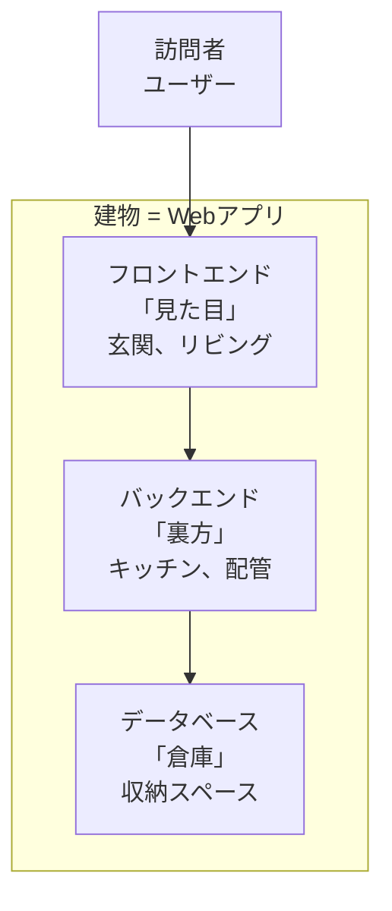

# 📊 分析レポート: 9月版第二回 → 11月版第二回アップデート

**作成日**: 2025年11月7日
**分析対象**: `2-1_宿題レビューとWebアプリの仕組み.md`（9月版）
**参照資料**: 7月版第二回（7章構成）、11月版第一回（Part 4: ツール紹介と宿題説明）

---

## 📖 目次

1. [エグゼクティブサマリー](#1-エグゼクティブサマリー)
2. [7月版・9月版・11月版の構造比較](#2-7月版9月版11月版の構造比較)
3. [9月版の詳細分析](#3-9月版の詳細分析)
4. [7月版から削られた重要コンテンツ](#4-7月版から削られた重要コンテンツ)
5. [11月版第一回との連続性分析](#5-11月版第一回との連続性分析)
6. [11月版第二回で取り込むべき内容（優先順位付き）](#6-11月版第二回で取り込むべき内容優先順位付き)
7. [11月版第二回の推奨章立て案](#7-11月版第二回の推奨章立て案)
8. [具体的なアクションプラン](#8-具体的なアクションプラン)

---

## 1. エグゼクティブサマリー

### 🎯 キーファインディング

| 項目 | 7月版 | 9月版 | 11月版（推奨） |
|:-----|:-----|:-----|:-------------|
| **章構成** | 7章（分割型） | 2章（統合型） | 5-6章（バランス型） |
| **形式** | Markdown | **Marp**（スライド） | Markdown |
| **LLM基礎** | ✅ 独立章（2-1） | ❌ 削除 | ✅ 第一回Part 2で完結済み |
| **AI駆動要件定義** | ✅ 独立章（2-2） | ❌ 削除 | ⚠️ 第一回で完結済み |
| **Cursor構築** | ✅ 独立章（2-3） | ❌ 削除 | ⚠️ 第一回で完結済み |
| **バージョン管理（Git）** | ✅ 独立章（2-6） | ❌ 削除 | ✅ 復活（簡潔版） |
| **環境変数・セキュリティ** | ❌ | ✅ **新規加筆（詳細）** | ✅ 100%保持 |
| **2025年最新技術** | ❌ | ✅ **新規加筆** | ✅ 100%保持 |
| **Genspark宿題との連続性** | ❌ | ❌ | ✅ **新規追加** |

### 🚨 緊急度の高い問題

#### **問題1: 削りすぎによる学習の断絶**
9月版は7章 → 2章に統合したことで、以下が失われた：
- LLM基礎理解（音声入力、プロンプトエンジニアリング）
- AI駆動要件定義の深い解説
- Cursor環境構築の詳細
- **Git/GitHub基礎（バージョン管理）**

しかし、11月版第一回で以下は完結済み：
- ✅ LLM基礎理解（Part 2: 1-2_LLM基礎.md）
- ✅ AI駆動要件定義（Part 3）
- ✅ Cursor推奨設定（Part 4）

→ **結論**: Git基礎のみ復活すればOK（LLM基礎は第一回Part 2で完結済み）

#### **問題2: Marp形式の弊害**
- プレビューしづらい（IDE、GitHub）
- 復習時に探しにくい
- 情報を詰め込みにくい

→ **結論**: 11月版はMarkdown形式に戻す

#### **問題3: 11月版第一回（宿題）との断絶**
9月版は「第一回の宿題」を想定していない。しかし、11月版第一回では：
- **Genspark AI Builder**で動くアプリを作成（宿題）
- ビジネス要件定義を実践済み

→ **結論**: 宿題レビューセクションを強化し、Genspark → Cursor + Supabaseへの移行を明確化

---

## 2. 7月版・9月版・11月版の構造比較

### 📂 7月版（分割型・7章）

```
第二回/
├── 2-0_宿題確認.md
├── 2-1_LLMの基礎理解.md
├── 2-2_AI駆動要件定義.md
├── 2-3_Cursor開発環境構築.md
├── 2-4_AI駆動開発実践.md
├── 2-5_技術スタック理解.md
├── 2-6_バージョン管理とドキュメント作成.md
└── 2-7_宿題説明.md
```

**特徴**:
- ✅ 網羅的、体系的
- ✅ 各テーマが独立して復習しやすい
- ❌ 冗長、講義時間が長い
- ❌ 実践的な流れが見えにくい

---

### 📂 9月版（統合型・2章）

```
第二回/
├── 2-1_宿題レビューとWebアプリの仕組み.md  ← 今回の分析対象
└── 2-2_技術スタックとAI要件定義演習.md
```

**2-1の内容（Marp形式）**:
1. **Part 1: 第一回の振り返り**
   - 宿題の確認と共有
   - AIツールカオスマップ復習
2. **Part 2: Webアプリケーションの仕組み**
   - フロントエンド、バックエンド、データベース
   - 建物に例えた全体像
   - 2025年最新アーキテクチャ
3. **Part 3: API - 外部サービスの力を借りる**
   - APIとは何か
   - ライブラリとの違い
   - **環境変数とAPIキー管理（詳細）** ← 9月版の最大の加筆
   - TEKION Groupの実践事例
4. **Part 4: まとめと宿題説明**

**特徴**:
- ✅ 簡潔、実践的
- ✅ 環境変数・セキュリティの詳細解説（新規）
- ✅ 2025年最新技術（Edge Functions、Bun等）
- ❌ LLM基礎、AI駆動要件定義、Cursor構築、Gitが削除
- ❌ Marp形式で復習しづらい

---

### 📂 11月版第一回（Part 4: ツール紹介と宿題説明）

**Part 4の内容**:
1. **AI開発エコシステムの全体像**
   - ツール使い分けの原則
2. **主要ツール詳細解説**
   - ChatGPT、Claude、Gemini
   - NotebookLM（2025年11月最新情報）
   - **Cursor推奨設定（詳細）** ← 7月版2-3を統合
   - **Genspark AI Builder**（宿題で使用）
   - v0.app、Manus、AquaVoice、Gamma
3. **宿題説明**
   - タスク1: ビジネス要件定義（Part 3の実践）
   - タスク2: Genspark AI Builderで開発
   - タスク3: v0でも試す（オプション）

**特徴**:
- ✅ 2025年11月最新ツール情報
- ✅ Cursor推奨設定（.cursorrules → .cursor/rules）
- ✅ Genspark宿題への明確な導線
- ⚠️ 第二回との連続性（宿題レビュー）が未定義

---

## 3. 9月版の詳細分析

### 📊 9月版2-1の構造（Marp形式）

| セクション | スライド数（推定） | 内容 | 7月版対応 |
|:---------|:----------------|:-----|:---------|
| **Part 1: 第一回の振り返り** | 5-7枚 | 宿題確認、AIツールカオスマップ | 7月版 2-0 |
| **Part 2: Webアプリの仕組み** | 15-20枚 | フロント/バック/DB、建物の例え、2025年最新アーキテクチャ | 7月版 2-4, 2-5（一部） |
| **Part 3: API** | 20-25枚 | APIの概念、ライブラリとの違い、**環境変数・セキュリティ** | 7月版 2-5（一部）、**新規加筆** |
| **Part 4: まとめと宿題** | 3-5枚 | 次回予告、宿題 | 7月版 2-7 |

**合計**: 約43-57枚（プレゼン時間: 60-90分）

---

### ✅ 9月版の優れた新規コンテンツ

#### **1. 環境変数とAPIキー管理（超詳細）**

9月版で**最も詳しく加筆された部分**。以下の内容を網羅：

##### **環境変数ファイルの完全理解**
| ファイル | 用途 | Git管理 | 内容例 |
|:--------|:-----|:--------|:------|
| `.env.local` | ローカル開発専用 | ❌ `.gitignore`に追加 | 本番APIキー |
| `.env` | デフォルト値 | ⚠️ ケースバイケース | 公開可能な設定 |
| `.env.example` | テンプレート | ✅ コミット | キーの説明のみ |
| `.env.development` | 開発環境 | ❌ | 開発用ダミーデータ |
| `.env.production` | 本番環境 | ❌ | Vercel等で設定 |

##### **NEXT_PUBLIC_ プレフィックスの重要性**
```javascript
// ❌ 危険：ブラウザに公開される
NEXT_PUBLIC_SUPABASE_URL=https://xxx.supabase.co

// ✅ 安全：サーバーのみ
DATABASE_URL=postgresql://xxx
STRIPE_SECRET_KEY=sk_live_xxx
```

##### **セキュアな環境変数管理**
- `.gitignore`への追加
- Vercel環境変数の設定方法
- API キー漏洩時の対処法
- **Cursor Agentへの指示例**（.cursorrules）

**評価**: 🌟🌟🌟🌟🌟（最高品質、11月版で100%保持すべき）

---

#### **2. 2025年最新技術の紹介**

9月版で新規追加された最新技術：

| 技術 | 説明 | 登場箇所 |
|:-----|:-----|:--------|
| **Edge Functions** | Vercel、Cloudflare Workers | Part 2: バックエンド |
| **Edge Databases** | Turso、Neon | Part 2: データベース |
| **Bun** | 高速JavaScriptランタイム | Part 2: 技術スタック |
| **React 19** | Server Components、Actions | Part 2: フロントエンド |

**評価**: 🌟🌟🌟🌟（11月版でさらに更新すべき）

---

#### **3. TEKION Groupの実践事例**

9月版で追加された実務的な例：

- **mygear.jp**（人材紹介プラットフォーム）
  - Stripe API（決済）
  - SendGrid API（メール送信）
  - Google Maps API（位置情報）

- **calendy.biz**（日程調整ツール）
  - Google Calendar API
  - Zoom API

**評価**: 🌟🌟🌟（具体性があり、学習効果大）

---

### ❌ 9月版で削られた重要コンテンツ（7月版から）

#### **1. LLMの基礎理解（2-1_LLMの基礎理解.md）**

7月版で独立章だった内容（全289行）：

| セクション | 内容 | 重要度 |
|:---------|:-----|:------|
| **LLMの基本概念** | LLMとは、仕組み（トークン化、Transformer）、主要サービス比較 | ⭐⭐⭐ |
| **"Text is KING"** | プロンプトエンジニアリングの原則、Few-shot Learning、Chain of Thought | ⭐⭐⭐⭐⭐ |
| **基本は音声入力** | 音声入力の優位性、AquaVoice等のツール、効果的な話し方 | ⭐⭐⭐⭐ |
| **AI駆動開発におけるLLM活用** | 開発フェーズ別のLLM活用、継続的な対話方法 | ⭐⭐⭐⭐ |

**9月版での扱い**: ❌ 完全削除

**11月版での扱い**: ⚠️ 第一回Part 2で一部カバー済み、ただし**音声入力**は薄い

**結論**: **音声入力**と**プロンプトエンジニアリング基礎**のみ復活すべき

---

#### **2. AI駆動要件定義（2-2_AI駆動要件定義.md）**

7月版で独立章だった内容（全1217行、超詳細）：

| セクション | 内容 | 重要度 |
|:---------|:-----|:------|
| **Markdownの基本** | 記法、ファイル形式、Notionとの違い | ⭐⭐⭐ |
| **要件定義チェックリスト** | プロジェクト情報、機能要件、非機能要件、技術要件 | ⭐⭐⭐⭐⭐ |
| **AIとの対話による要件定義** | プロンプトテンプレート、段階的詳細化 | ⭐⭐⭐⭐ |
| **requirements.yamlの生成** | Cursor Agentが読める形式 | ⭐⭐⭐⭐ |
| **データベース設計** | ER図（Mermaid）、テーブル定義 | ⭐⭐⭐⭐ |

**9月版での扱い**: ❌ 完全削除（2-2に移動？）

**11月版での扱い**: ✅ **第一回Part 3で完結済み**（ビジネス要件定義の実践）

**結論**: ❌ 11月版第二回では不要（第一回で完結）

---

#### **3. Cursor開発環境構築（2-3_Cursor開発環境構築.md）**

7月版で独立章だった内容（全528行）：

| セクション | 内容 | 重要度 |
|:---------|:-----|:------|
| **IDEの基礎** | IDE概念、従来IDEとAI統合IDEの違い | ⭐⭐⭐ |
| **AIエージェントの可能性** | 自律的問題解決、学習と適応、創造的提案 | ⭐⭐⭐⭐ |
| **Cursorの初期設定** | インストール、アカウント、設定ファイル、拡張機能 | ⭐⭐⭐⭐⭐ |
| **ショートカットキー** | AI機能、ナビゲーション、カスタム設定 | ⭐⭐⭐⭐ |
| **.cursorrulesの活用** | プロジェクト固有ルール、チーム開発 | ⭐⭐⭐⭐⭐ |

**9月版での扱い**: ❌ 完全削除

**11月版での扱い**: ✅ **第一回Part 4で完結済み**（Cursor推奨設定、.cursor/rules）

**結論**: ❌ 11月版第二回では不要（第一回で完結）

---

#### **4. バージョン管理とドキュメント作成（2-6_バージョン管理とドキュメント作成.md）**

7月版で独立章だった内容（全747行）：

| セクション | 内容 | 重要度 |
|:---------|:-----|:------|
| **Gitとバージョン管理** | Gitの基本概念、ローカル/リモートリポジトリ、基本ワークフロー | ⭐⭐⭐⭐⭐ |
| **GitHubの活用** | アカウント作成、リポジトリ管理、.gitignore | ⭐⭐⭐⭐⭐ |
| **ブランチ戦略** | Git Flow、ブランチ操作、マージ | ⭐⭐⭐ |
| **プルリクエストとコードレビュー** | PR作成、レビューのポイント | ⭐⭐⭐ |
| **チーム開発での活用** | 複数人での開発フロー、コンフリクト解決、Issue管理 | ⭐⭐⭐ |
| **RooCodeドキュメント作成** | AIによる高速ドキュメント作成、README自動生成 | ⭐⭐ |

**9月版での扱い**: ❌ 完全削除

**11月版での扱い**: ❌ 未カバー

**結論**: ✅ **簡潔版を復活すべき**（基本操作のみ、30分程度）

---

## 4. 7月版から削られた重要コンテンツ

### 📋 削除されたコンテンツのマトリックス

| セクション | 行数 | 重要度 | 11月版第一回でカバー済み | 11月版第二回で復活すべき |
|:---------|:-----|:------|:---------------------|:---------------------|
| **LLMの基礎理解** | 289 | ⭐⭐⭐⭐ | ⚠️ 部分的（音声入力は薄い） | ✅ 音声入力+プロンプト基礎 |
| **AI駆動要件定義** | 1217 | ⭐⭐⭐⭐⭐ | ✅ Part 3で完結 | ❌ 不要 |
| **Cursor開発環境構築** | 528 | ⭐⭐⭐⭐⭐ | ✅ Part 4で完結 | ❌ 不要 |
| **バージョン管理（Git）** | 747 | ⭐⭐⭐⭐⭐ | ❌ 未カバー | ✅ 簡潔版を復活 |
| **AI駆動開発実践** | ? | ⭐⭐⭐ | ❌ 未カバー | ✅ 実装例を追加 |

---

## 5. 11月版第一回との連続性分析

### 🔗 第一回 Part 4（ツール紹介と宿題説明）との接続

#### **宿題の内容（第一回 Part 4より）**

| タスク | 内容 | 成果物 |
|:------|:-----|:------|
| **タスク1: ビジネス要件定義** | Part 3で学んだ手法を実践 | `/docs/input/[アプリ名]_requirements.md` |
| **タスク2: Genspark AI Builderで開発** | Level 1-3から選択、動くアプリを作成 | `/src/` |
| **タスク3: v0でも試す（オプション）** | Gensparkとの違いを体験 | 比較レポート |

**提出物**:
- ビジネス要件定義書（Markdown）
- 動作するアプリ（HTML/JS/CSS）
- README（機能説明、使い方）
- 開発プロセスメモ（プロンプト、つまずいたポイント）
- スクリーンショット（3枚以上）

---

#### **第二回の冒頭で期待されること**

1. **宿題レビュー**（20-30分）
   - 何を作ったか（発表）
   - どんな壁にぶつかったか
   - どう解決したか
   - 学びの共有

2. **Genspark → Cursor + Supabaseへの移行準備**
   - Gensparkプロトタイプの限界を認識
   - 「本格的な開発」への移行動機づけ
   - 第三回（Supabase + Clerk）への橋渡し

3. **Webアプリの仕組みの深掘り**
   - フロント/バック/DBの理解
   - APIとライブラリの違い
   - 環境変数・セキュリティの重要性

---

### 🚨 9月版の問題点（連続性の観点）

| 問題 | 影響 |
|:-----|:-----|
| **宿題レビューが薄い** | Gensparkで作成したアプリが活かされない |
| **Genspark → Cursor移行の動機づけが弱い** | 「なぜ次のステップが必要か」が不明確 |
| **第三回（Supabase、Clerk）への橋渡しが弱い** | データベース、認証の必要性が伝わらない |

---

## 6. 11月版第二回で取り込むべき内容（優先順位付き）

### 🔥 最優先（P0）: 9月版の新規加筆を100%保持

| 内容 | 分量 | 理由 |
|:-----|:-----|:-----|
| **環境変数とAPIキー管理** | 詳細 | 実務で最重要、セキュリティ意識の醸成 |
| **2025年最新技術** | 中程度 | 情報の鮮度、実践性 |
| **TEKION Groupの実践事例** | 簡潔 | 具体性、実務イメージ |
| **実践的なコード例** | 中程度 | React、Next.js、API連携 |

---

### ⭐ 高優先（P1）: 7月版から取り込む

| 内容 | 7月版セクション | 分量 | 理由 |
|:-----|:--------------|:-----|:-----|
| **Git/GitHub基礎** | 2-6（一部） | 簡潔版 | 第一回で未カバー、実務で必須 |
| **音声入力の活用** | 2-1（一部） | 簡潔版 | 第一回で薄い、開発効率化の鍵 |
| **プロンプトエンジニアリング基礎** | 2-1（一部） | 簡潔版 | 第一回で薄い、AI駆動開発の核心 |

#### **Git/GitHub基礎（簡潔版）の推奨内容**

**目標時間**: 20-30分

1. **Gitとは何か**（5分）
   - バージョン管理の重要性
   - ローカルとリモートの違い
   - Cursorとの統合

2. **基本操作（10分）**
   ```bash
   # 初期設定（1回のみ）
   git config --global user.name "Your Name"
   git config --global user.email "your.email@example.com"

   # 基本フロー
   git add .
   git commit -m "feat: Add task creation feature"
   git push origin main
   ```

3. **.gitignoreの重要性**（5分）
   ```gitignore
   # 環境変数（必須）
   .env
   .env.local

   # 依存関係
   node_modules/

   # ビルド出力
   .next/
   dist/
   ```

4. **Cursor統合**（5分）
   - Source Control パネル
   - ワンクリックコミット
   - AI Agentに「git commitしてください」と指示

5. **トラブルシューティング**（5分）
   - エラー時はAI Agentに丸投げ
   - 「以下のgitエラーが出ています。解決してください」

**評価**: 🌟🌟🌟🌟（必須、簡潔版なら負担なし）

---

#### **音声入力の活用（簡潔版）**

**目標時間**: 10-15分

1. **なぜ音声入力か**（3分）
   - タイピングの3-4倍の速度
   - 長いプロンプトを楽に入力
   - 思考の流れを保つ

2. **推奨ツール**（2分）
   - **AquaVoice**（第一回で紹介済み）
   - macOS音声入力
   - Windows音声認識

3. **実演**（5分）
   - 講師が実際に音声入力でプロンプト作成
   - Cursorに指示
   - リアルタイム変換を見せる

4. **効果的な話し方のコツ**（3分）
   - はっきりした発音
   - 適度な間
   - 句読点を意識した話し方
   - 専門用語は区切る（例: 「ネクスト、ドット、ジェイエス」）

**評価**: 🌟🌟🌟（開発効率化の即効性あり）

---

#### **プロンプトエンジニアリング基礎（簡潔版）**

**目標時間**: 15-20分

1. **"Text is KING"の意味**（3分）
   - LLMはテキストベースのAI
   - 入力の質が出力の質を決定

2. **効果的なプロンプトの4原則**（10分）

   **1. 明確性（Clarity）**
   ```
   ❌ 悪い例: "アプリを作って"
   ✅ 良い例: "タスク管理機能を持つWebアプリケーションを、
              React + Next.jsで作成してください"
   ```

   **2. 具体性（Specificity）**
   ```
   ❌ 悪い例: "きれいなデザインで"
   ✅ 良い例: "モダンでミニマルなデザイン、青を基調とした配色、
              カードレイアウトを使用"
   ```

   **3. 文脈提供（Context）**
   ```
   ✅ 良い例:
   「あなたは経験豊富なReact開発者です。
   初心者向けのタスク管理アプリを作成します。
   ユーザーはタスクの追加、編集、削除、完了マークができる必要があります。」
   ```

   **4. 段階的指示（Step-by-step）**
   ```
   ✅ 良い例:
   「以下の手順でタスク管理アプリを作成してください：
   1. プロジェクトの初期設定
   2. コンポーネント設計
   3. 状態管理の実装
   4. UIの作成
   5. 機能の実装」
   ```

3. **Cursorでの実演**（5分）
   - 悪いプロンプト → 良いプロンプトの比較
   - 出力結果の差を見せる

**評価**: 🌟🌟🌟🌟（AI駆動開発の核心）

---

### ✅ 中優先（P2）: 11月版第一回との連続性

| 内容 | 分量 | 理由 |
|:-----|:-----|:-----|
| **Genspark宿題レビュー** | 20-30分 | 学びの共有、モチベーション維持 |
| **Genspark → Cursor移行の動機づけ** | 10分 | 次のステップへの橋渡し |
| **第三回（Supabase、Clerk）への予告** | 5分 | 学習の見通し |

---

### ❌ 低優先（P3）: あえて薄くした部分

| 内容 | 理由 |
|:-----|:-----|
| **AI駆動要件定義の詳細** | 第一回Part 3で完結 |
| **Cursor環境構築の詳細** | 第一回Part 4で完結 |
| **深すぎる技術解説** | 講義時間の制約、第三回以降で扱う |

---

## 7. 11月版第二回の推奨章立て案

### 📚 推奨構成（5章構成、120-150分）

```markdown
# 第二回講義: 宿題レビューとWebアプリの仕組み

## 🎯 この回で学ぶこと
- 第一回の宿題から得た学びの共有
- Webアプリケーション（フロント/バック/DB）の全体像
- APIとライブラリの違いと使い分け
- 環境変数とAPIキーの安全な管理
- Git/GitHubによるバージョン管理
- Vibe Coderマインドセットの実践
- 次のステップ（Supabase、Clerk）への準備

## 📌 この回の位置づけ
第一回でGensparkを使ってプロトタイプを作成しました。
この回では、**Webアプリの基本構造**を理解し、
次回から始まる**本格的なフルスタック開発**（DB、認証、デプロイ）の土台を作ります。

---

## Part 1: 宿題レビューとVibe Coderマインドセット（30分）

### 1.1 宿題の振り返り
- **成果物の共有**（受講生3-5名が発表）
  - 何を作ったか
  - どんな壁にぶつかったか
  - どう解決したか
  - 学んだこと

### 1.2 成功パターンと学びの共有
- **典型的な成功事例**
  - シンプル&確実型（Level 1完遂）
  - 段階的改善型（機能を1つずつ追加）
  - チャレンジ型（Level 2-3）

- **よくあるエラーと対処法**
  - プロンプトが伝わらない → より具体的に
  - デザインが崩れる → 「レスポンシブ対応」と明示
  - エラーが解決しない → エラーメッセージ全文をGensparkに貼り付け

### 1.3 Vibe Coderマインドセット（復習+深掘り）
- **AIを相棒として信頼する**
  - 細かく指示しすぎない
  - AIの提案を試してみる

- **プロンプトは設計書**
  - 「Text is KING」の実践
  - 明確性、具体性、文脈提供、段階的指示

- **エラーはAIとの対話材料**
  - エラーは失敗ではなく、学びの機会
  - エラーメッセージをそのままAIに渡す

- **動くものを早く作る（Agentモード活用）**
  - 完璧を求めず、まず動かす
  - 改善は後から

### 1.4 Genspark → Cursor + Supabaseへの移行
- **Gensparkの限界**
  - プロトタイプには最適
  - データ永続化（データベース）が弱い
  - 認証機能の実装が限定的
  - 本番環境へのデプロイが手動

- **次のステップ（第三回予告）**
  - Supabase（データベース、認証）
  - Clerk（認証）
  - Vercel（デプロイ）
  - → 本格的なフルスタックアプリへ

---

## Part 2: Webアプリケーションの仕組み（40分）

### 2.1 全体像 - 建物に例えると


### 2.2 フロントエンド - ユーザーが見る部分
- **役割**
  - UIの描画
  - ユーザー操作の受付
  - UX最適化

- **主要技術（2025年11月）**
  - React 19（Server Components、Actions）
  - Next.js 15（App Router、Turbopack）
  - Tailwind CSS、shadcn/ui

- **実装例**
  ```jsx
  // タスクリストコンポーネント（React）
  export default function TaskList({ tasks }) {
    return (
      <div className="space-y-2">
        {tasks.map(task => (
          <TaskItem key={task.id} task={task} />
        ))}
      </div>
    );
  }
  ```

### 2.3 バックエンド - ビジネスロジックと裏方処理
- **役割**
  - ビジネスロジック
  - データベース操作
  - 認証・認可
  - 外部API連携

- **主要技術（2025年11月）**
  - Node.js + Express
  - Next.js API Routes / Server Actions
  - Edge Functions（Vercel、Cloudflare）
  - Bun（高速ランタイム）

- **実装例**
  ```typescript
  // タスク作成API（Next.js API Route）
  export async function POST(request: Request) {
    const { title, userId } = await request.json();

    const task = await db.tasks.create({
      data: { title, userId, completed: false }
    });

    return Response.json(task);
  }
  ```

### 2.4 データベース - データの永続化
- **役割**
  - データの保存
  - 検索・更新・削除
  - リレーション管理

- **主要技術（2025年11月）**
  - PostgreSQL（Supabase、Neon）
  - MySQL（PlanetScale）
  - Edge Databases（Turso、Cloudflare D1）

- **データの流れ**
  ```mermaid
  sequenceDiagram
      User->>Frontend: タスク作成ボタンクリック
      Frontend->>Backend API: POST /api/tasks
      Backend API->>Database: INSERT INTO tasks
      Database-->>Backend API: 作成成功、ID返却
      Backend API-->>Frontend: 作成されたタスク返却
      Frontend->>User: 画面に新しいタスク表示
  ```

### 2.5 フロントとバックの連携
- **データの流れ**
  - ユーザー操作 → フロント → バックエンドAPI → DB
  - DB → バックエンドAPI → フロント → 画面更新

- **楽観的更新（Optimistic Update）**
  ```javascript
  // ユーザーの操作に即座に反応（サーバーの応答を待たない）
  function handleToggle(taskId) {
    // 1. 即座にUIを更新（楽観的）
    setTasks(tasks.map(t =>
      t.id === taskId ? { ...t, completed: !t.completed } : t
    ));

    // 2. バックグラウンドでサーバーに送信
    fetch(`/api/tasks/${taskId}/toggle`, { method: 'PATCH' });
  }
  ```

### 2.6 2025年の最新アーキテクチャ
- **エッジコンピューティング**
  - Vercel Edge Functions
  - Cloudflare Workers
  - Deno Deploy
  - → サーバーレス、低レイテンシ、グローバル展開

- **フルスタックフレームワーク**
  - Next.js 15（フロント+バック統合）
  - Remix
  - SvelteKit
  - → 単一フレームワークで完結

---

## Part 3: API - 外部サービスの力を借りる（40分）

### 3.1 APIとは何か
- **定義**
  - Application Programming Interface
  - 機能の「コンセント」
  - 自前開発せず、外部サービスを活用

- **メリット**
  - 開発時間の短縮
  - 専門性の高い機能を即座に利用
  - メンテナンスコストの削減

### 3.2 実際のAPI活用事例（TEKION Group）
- **mygear.jp**（人材紹介プラットフォーム）
  - Stripe API（決済）
  - SendGrid API（メール送信）
  - Google Maps API（位置情報）

- **calendy.biz**（日程調整ツール）
  - Google Calendar API
  - Zoom API

- **その他の一般的なAPI**
  - 決済: Stripe、PayPal
  - 認証: Auth0、Clerk
  - 通知: Twilio（SMS）、SendGrid（メール）
  - AI: OpenAI API、Anthropic Claude API
  - データベース: Supabase、Firebase

### 3.3 ライブラリとAPIの違い
| 項目 | API | ライブラリ |
|:-----|:----|:---------|
| **提供形態** | Webサービス（HTTP） | コードモジュール |
| **実行場所** | 外部サーバー | 自分のアプリ内 |
| **料金** | 従量課金が多い | 無料が多い |
| **例** | Stripe API、Google Maps API | Lodash、date-fns、React |

**よく使うライブラリ**:
- **UI**: React、shadcn/ui、Tailwind CSS
- **ユーティリティ**: Lodash、date-fns
- **バリデーション**: Zod、Yup
- **状態管理**: Zustand、Jotai

### 3.4 APIキーの理解と管理（重要）

#### **APIキーとは**
- 外部サービスへのアクセス権
- アカウント識別と課金の基準
- **漏洩すると不正利用される**

#### **具体例**
```
Supabase API Key:
eyJhbGciOiJIUzI1NiIsInR5cCI6IkpXVCJ9...

Clerk API Key:
pk_test_Y2xlcmsuZXhhbXBsZS5jb20k

Google Maps API Key:
AIzaSyDxxx...
```

#### **環境変数ファイルの完全理解**

| ファイル | 用途 | Git管理 | 内容例 |
|:--------|:-----|:--------|:------|
| `.env.local` | **ローカル開発専用** | ❌ `.gitignore`に追加 | 本番APIキー |
| `.env` | デフォルト値 | ⚠️ ケースバイケース | 公開可能な設定 |
| `.env.example` | **テンプレート** | ✅ コミット | キーの説明のみ |
| `.env.development` | 開発環境 | ❌ | 開発用ダミーデータ |
| `.env.production` | 本番環境 | ❌ | Vercel等で設定 |

**.env.local の例**:
```bash
# Supabase（ローカル開発用）
NEXT_PUBLIC_SUPABASE_URL=https://xxx.supabase.co
NEXT_PUBLIC_SUPABASE_ANON_KEY=eyJhbGciOiJIUzI1NiIsInR5cCI6IkpXVCJ9...
SUPABASE_SERVICE_ROLE_KEY=eyJhbGciOiJIUzI1NiIsInR5cCI6IkpXVCJ9... # サーバーのみ

# Clerk（認証）
NEXT_PUBLIC_CLERK_PUBLISHABLE_KEY=pk_test_xxx
CLERK_SECRET_KEY=sk_test_xxx # サーバーのみ

# Stripe（決済）
STRIPE_SECRET_KEY=sk_live_xxx # サーバーのみ
```

**.env.example の例**（Gitにコミット）:
```bash
# Supabase
NEXT_PUBLIC_SUPABASE_URL=your_supabase_url_here
NEXT_PUBLIC_SUPABASE_ANON_KEY=your_supabase_anon_key_here
SUPABASE_SERVICE_ROLE_KEY=your_service_role_key_here

# Clerk
NEXT_PUBLIC_CLERK_PUBLISHABLE_KEY=your_clerk_publishable_key_here
CLERK_SECRET_KEY=your_clerk_secret_key_here

# Stripe
STRIPE_SECRET_KEY=your_stripe_secret_key_here
```

#### **NEXT_PUBLIC_ プレフィックスの重要性**

**Next.jsの仕組み**:
- `NEXT_PUBLIC_`で始まる環境変数 → **ブラウザに公開される**
- それ以外 → **サーバーのみ**

```javascript
// ❌ 危険：ブラウザに公開される（誰でも見える）
NEXT_PUBLIC_STRIPE_SECRET_KEY=sk_live_xxx

// ✅ 安全：サーバーのみ
STRIPE_SECRET_KEY=sk_live_xxx
```

**ブラウザの開発者ツールで確認できる**:
```javascript
// ブラウザのコンソールで（F12）
console.log(process.env.NEXT_PUBLIC_SUPABASE_URL);
// → 表示される（公開されている）

console.log(process.env.STRIPE_SECRET_KEY);
// → undefined（サーバーのみ、安全）
```

**判断基準**:
- **フロントエンド（ブラウザ）で必要** → `NEXT_PUBLIC_`
  - Supabase URL、Clerk Publishable Key
- **バックエンド（サーバー）のみ必要** → プレフィックスなし
  - Stripe Secret Key、Supabase Service Role Key

#### **セキュアな環境変数管理**

**1. .gitignoreへの追加（必須）**
```.gitignore
# 環境変数（絶対にコミットしない）
.env
.env.local
.env.*.local
```

**2. Vercel環境変数の設定**
- Vercelダッシュボード → Settings → Environment Variables
- 本番用APIキーを設定
- `.env.local`と同じ変数名で設定

**3. API キー漏洩時の対処法**
1. 即座にAPIキーを無効化（Supabase、Clerk等の管理画面で）
2. 新しいキーを発行
3. `.env.local`とVercelを更新
4. Git履歴から削除（`git filter-branch`または`BFG Repo-Cleaner`）

**4. Cursor Agentへの指示例（.cursor/rules）**
```markdown
# セキュリティルール

## 環境変数の扱い
- 絶対に.env.localをコミットしない
- APIキーをコードに直接書かない
- NEXT_PUBLIC_プレフィックスは慎重に使用
- 秘密鍵は必ずサーバーサイドのみで使用

## コードレビュー時のチェック
- process.env使用箇所を確認
- .gitignoreに.env.localが含まれているか
- .env.exampleが最新か
```

### 3.5 主要API紹介（簡潔版）
- **OpenAI / Claude API**（AI統合）
- **Stripe API**（決済）
- **Clerk**（認証）
- **Supabase**（BaaS）

---

## Part 4: Git/GitHubによるバージョン管理（30分）

### 4.1 バージョン管理の重要性
- **なぜGitが必要か**
  - 変更履歴の保存
  - 安全な実験（失敗しても戻せる）
  - チーム協働
  - バックアップ

- **Cursorとの統合**
  - Source Controlパネル
  - AI Agentに「git commitしてください」と指示
  - 自動コミットメッセージ生成

### 4.2 基本操作（実演中心）

#### **初期設定（1回のみ）**
```bash
git config --global user.name "Your Name"
git config --global user.email "your.email@example.com"
```

#### **基本フロー**
```bash
# 1. 変更をステージング
git add .

# 2. コミット（変更を記録）
git commit -m "feat: Add task creation feature"

# 3. リモートにプッシュ
git push origin main
```

#### **Cursorでの操作（デモ）**
1. Source Controlパネルを開く
2. 変更ファイルを確認
3. コミットメッセージ入力（またはAI生成）
4. コミット → プッシュ

### 4.3 .gitignoreの重要性

**.gitignore の例**:
```gitignore
# 環境変数（必須）
.env
.env.local
.env.*.local

# 依存関係
node_modules/

# ビルド出力
.next/
dist/
out/

# ログファイル
*.log

# OS
.DS_Store
Thumbs.db
```

### 4.4 トラブルシューティング
- **エラーが出た場合**
  - AI Agentに丸投げ
  - 「以下のgitエラーが出ています。解決してください」
  - エラーメッセージ全文をコピペ

---

## Part 5: まとめと次回予告（10分）

### 5.1 本日の学び
1. **Vibe Coderマインドセット**の実践
2. **Webアプリの三層構造**（フロント/バック/DB）
3. **APIとライブラリ**の違いと使い分け
4. **環境変数・セキュリティ**の重要性
5. **Git/GitHub**の基本操作

### 5.2 次回予告（第三回）
- **データベース基礎とSupabase実装**
  - PostgreSQL基礎
  - Supabaseプロジェクト作成
  - テーブル設計とRLS（Row Level Security）

- **認証基礎とClerk実装**
  - 認証と認可の違い
  - Clerkプロジェクト作成
  - Google認証実装

- **宿題アプリの本格化**
  - Gensparkアプリ → Cursor + Supabase + Clerk
  - データ永続化
  - ユーザー認証追加

### 5.3 次回までの準備
- **Supabaseアカウント作成**（必須）
  - [https://supabase.com/](https://supabase.com/)
  - 無料プランでOK

- **Clerkアカウント作成**（必須）
  - [https://clerk.com/](https://clerk.com/)
  - 無料プランでOK

- **Gitの練習**（推奨）
  - 宿題アプリをGitHubにプッシュ
  - Cursorの Source Control パネルに慣れる

---

## 参考資料

### 公式ドキュメント
- Next.js: https://nextjs.org/docs
- React: https://react.dev/
- Supabase: https://supabase.com/docs
- Clerk: https://clerk.com/docs
- Vercel: https://vercel.com/docs

### 推奨記事
- 「初心者のためのGit入門」
- 「Next.js環境変数の完全ガイド」
- 「API vs ライブラリ：使い分けの基準」

---

## 付録

### A. よくある質問（FAQ）

**Q1: 環境変数の設定がうまくいかない**
A: `.env.local`ファイルがプロジェクトルートにあるか確認。ファイル名の綴りに注意。

**Q2: Git pushでエラーが出る**
A: Cursor Agentにエラーメッセージをコピペして解決策を聞く。

**Q3: APIキーを間違えてコミットしてしまった**
A: 即座にAPIキーを無効化し、新しいキーを発行。Git履歴から削除（講師に相談）。

### B. コマンドチートシート

```bash
# Git基本操作
git status                 # 現在の状態確認
git add .                  # 全ファイルをステージング
git commit -m "メッセージ" # コミット
git push origin main       # プッシュ

# 環境変数確認
echo $NEXT_PUBLIC_SUPABASE_URL  # 環境変数の値を確認
```
```

---

## 8. 具体的なアクションプラン

### 📅 フェーズ1: 準備（1日）

#### **タスク1: 9月版の新規コンテンツを抽出**
- [ ] 環境変数・セキュリティセクションをコピー
- [ ] 2025年最新技術セクションをコピー（→ 11月に更新）
- [ ] TEKION Group実践事例をコピー

#### **タスク2: 7月版から簡潔版を作成**
- [ ] Git基礎（2-6から抽出、20-30分に圧縮）
- [ ] 音声入力活用（2-1から抽出、10-15分に圧縮）
- [ ] プロンプト基礎（2-1から抽出、15-20分に圧縮）

#### **タスク3: 11月版第一回との接続を設計**
- [ ] 宿題レビューセクションの詳細設計
- [ ] Genspark → Cursor移行の動機づけ部分を設計

---

### 📅 フェーズ2: 執筆（2-3日）

#### **タスク4: Markdown形式で執筆**
- [ ] Part 1: 宿題レビューとVibe Coderマインドセット
- [ ] Part 2: Webアプリケーションの仕組み
- [ ] Part 3: API（9月版の詳細版を100%保持）
- [ ] Part 4: Git/GitHub基礎（新規、簡潔版）
- [ ] Part 5: まとめと次回予告

#### **タスク5: 実践的な例とコードを追加**
- [ ] React、Next.jsのコード例
- [ ] 環境変数の実例（.env.local、.env.example）
- [ ] Git操作のデモスクリプト

---

### 📅 フェーズ3: レビューと調整（1日）

#### **タスク6: 講義時間の調整**
- [ ] 各Partの所要時間を見積もり
- [ ] 120-150分に収まるよう調整
- [ ] 優先順位の低い部分を削減または簡潔化

#### **タスク7: 図表・Mermaid図の作成**
- [ ] 全体像の図（フロント/バック/DB）
- [ ] データフロー図
- [ ] Git操作フロー図

#### **タスク8: 泉水レビュー**
- [ ] ドラフト版を提出
- [ ] フィードバック反映
- [ ] 最終版完成

---

## 🎯 まとめ

### 最終推奨事項

#### ✅ 絶対に保持すべき（9月版の新規加筆）
1. **環境変数・セキュリティの詳細解説**（最高品質）
2. **2025年最新技術**（11月に更新）
3. **TEKION Group実践事例**
4. **実践的なコード例**

#### ✅ 復活すべき（7月版から）
1. **Git/GitHub基礎**（簡潔版、20-30分）
2. **音声入力活用**（簡潔版、10-15分）
3. **プロンプト基礎**（簡潔版、15-20分）

#### ✅ 新規追加すべき（11月版オリジナル）
1. **Genspark宿題レビュー**（20-30分）
2. **Vibe Coderマインドセット実践**（第一回の復習+深掘り）
3. **Genspark → Cursor移行の動機づけ**

#### ❌ 削除して良い（第一回で完結済み）
1. AI駆動要件定義の詳細（第一回Part 3）
2. Cursor環境構築の詳細（第一回Part 4）

---

### 期待される成果

11月版第二回講義を受講した受講生は、以下ができるようになる：

1. **Webアプリの全体像を理解**している
2. **APIと環境変数を安全に扱える**
3. **Gitの基本操作ができる**（Cursor統合）
4. **音声入力とプロンプト技術を実践できる**
5. **第三回（Supabase + Clerk）への準備が整っている**
6. **Vibe Coderマインドセットを実践できる**

---

**次のステップ**: この分析レポートを基に、11月版第二回の執筆を開始しましょうか？
