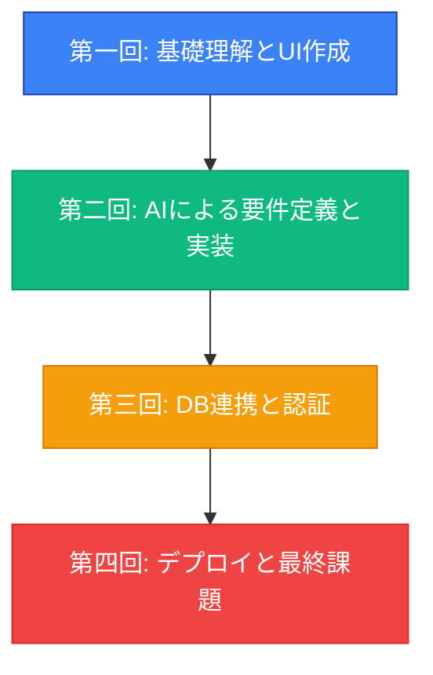

# VibeCoder育成プログラム デモデイ発表資料生成プロンプト

このプロンプトは、VibeCoder育成プログラムのデモデイで使用する発表資料を生成するためのものです。

---

## 【入力情報】

以下の情報を入力してください：

### 基本情報
- **提供先企業名**: [企業名]
- **受講生人数**: [人数]名
- **開催期間**: [YYYY/MM/DD] 〜 [YYYY/MM/DD]
- **デモデイ日時**: [YYYY年MM月DD日(曜日) HH:MM-HH:MM]

### 満足度データ（アンケート結果の平均値）
- **全体満足度**: [数値] / 5.0
- **面白さ**: [数値] / 5.0
- **難易度**: [数値] / 5.0
- **回答者数**: [回答数]名 / [総受講生数]名

※ 未回答者を除いた平均値を算出してください
※ 小数点第2位まで表示（例: 4.55）

### 受講生の声（代表的なコメント3-5件）
1. "[コメント1]"
2. "[コメント2]"
3. "[コメント3]"
4. "[コメント4]"（オプション）
5. "[コメント5]"（オプション）

※ 3件は必須、最大5件まで

### 代表的な成果物（3件程度）
1. **[アプリ名1]**: [簡単な説明（1-2文）]
2. **[アプリ名2]**: [簡単な説明（1-2文）]
3. **[アプリ名3]**: [簡単な説明（1-2文）]

### 講師所感（オプション）

**【手応え】**
[講師が感じた成果や受講生の成長について記述]

**【反省点と課題】**
[今後の改善点や課題について記述]

※ この項目は任意です。入力しない場合は、デフォルトテンプレートが使用されます。

---

## 【固定情報】

以下の情報は固定で使用します：

- **提供元**: 株式会社TEKIONGroup
- **講師**: 代表取締役 泉水亮介
- **採点用アプリケーション**: https://demodaybasic.vercel.app/
- **カリキュラム期間**: 6週間
- **技術スタック**: Next.js 15, TypeScript, Supabase, Clerk, Vercel

### 設計思想
- 「基本概念の理解」を重視
- 詳細な手順より「なぜそうするのか」を重視
- 応用力を養うことを目指す
- マインドセット変革の徹底（第一回の60%を投資）
- 実践的なハンズオン（理論20%：実践80%）
- AI活用の徹底（全工程でAI駆動開発）
- 段階的な成功体験（各回で明確な成果物）

### スキルマトリクス（Before → After）
| スキル領域 | Before | After | 成長度 |
|---|---|---|---|
| プログラミング | 全くできない | 基本的な実装が可能 | ★★★★☆ |
| AI活用 | ChatGPT少し | 高度なプロンプティング | ★★★★★ |
| 要件定義 | 曖昧な要望 | 構造化された仕様書 | ★★★★☆ |
| データベース | 概念も不明 | 設計・実装可能 | ★★★★☆ |
| デプロイ | 経験なし | Vercelで公開可能 | ★★★★★ |

---

## 【出力指示】

上記の「入力情報」と「固定情報」を使用して、以下の構造でMarkdownファイルを生成してください。

### ファイル名
`demoday_presentation_[企業名].md`

### 構成

以下の構成でMarkdown形式の発表資料を生成してください。reveal.jsやMarpで変換可能な形式にしてください。

---

# Vibe Coder Bootcamp 成果報告会 資料

---

## 【パート1：研修概要説明】
*(受講生発表前に、審査員向けに手短に説明)*

### 1. 本研修でお伝えしたこと
- **目的**: AIを使いこなし、自らアイデアを形にできる「Vibe Coder」の育成
- **設計思想**:
  - 「基本概念の理解」を重視し、詳細な手順よりも「なぜそうするのか」という応用力を養うことを目指しました
  - マインドセット変革の徹底（第一回の60%を投資）
  - 実践的なハンズオン（理論20%：実践80%）

### 2. カリキュラムの全体像
- **期間**: [入力情報の開催期間を記載]
- **構成**: 4週間（合計8時間または10時間）で、Webアプリ開発の全工程をAIと共に体験

### 3. 習得スキルセット
受講生は、AI（Cursor）への自然言語指示を通じて、以下のモダンな技術を操作するスキルを習得しました。

- **フロントエンド**: Next.js 15, TypeScript
- **バックエンド/DB**: Supabase
- **認証**: Clerk
- **デプロイ**: Vercel

**スキル成長マトリクス**:

[固定情報のスキルマトリクス表を挿入]

### 4. 審査員の皆様へのお願い
- 本日は、技術の巧拙よりも、各発表者の**アイデア、熱意、そして学びの応用力**という観点で評価いただけますと幸いです。
- 審査にあたり、こちらの採点用アプリケーションをご利用ください。
- **URL**: `https://demodaybasic.vercel.app/`
- お名前をフルネームで入力後、「採点を開始する」ボタンを押してください。

---
---

## 【パート2：研修の振り返り】
*(結果発表後、総括として説明)*

### 5. 研修成果の定量的分析（アンケート結果）
- **全体満足度**: **[入力情報の数値]** / 5.0
- **面白さ**: **[入力情報の数値]** / 5.0
- **難易度**: **[入力情報の数値]** / 5.0
- **回答率**: [回答数]名 / [総受講生数]名

**所感**: [満足度と面白さの評価に基づいて、適切なコメントを生成]
  - 満足度4.5以上の場合: 「非常に高い満足度を記録しました」
  - 満足度4.0-4.5の場合: 「高い満足度を記録しました」
  - 難易度3.5-4.0の場合: 「中程度であり、挑戦的かつ達成感のある内容であったことが伺えます」

### 6. 研修成果の定性的分析（受講生の声）

[入力情報の受講生の声を箇条書きで列挙]

**所感**: スキル習得に留まらず、AI活用の本質的な価値や、組織にもたらすインパクトを実感いただけた点が大きな成果です。

### 7. 代表的な成果物

本研修で受講生が作成したアプリケーションの一部をご紹介します：

[入力情報の成果物を列挙]

### 8. 今回の学びと今後の課題（講師所感）

**【講師所感の条件分岐ロジック】**

IF 入力情報に「講師所感」が記載されている THEN
  入力された所感を使用
ELSE
  以下のデフォルトテンプレートを使用：

- **手応え**:
  - 「基本概念」を重視するアプローチにより、受講生の**応用力**が着実に向上したと確信しています。
  - 短期間で高い成果を出せたのは、ひとえに受講生の皆様の学習意欲の賜物です。

- **反省点と課題**:
  - 一方で、一部の受講生には負荷が高かった点も事実です。
  - 今後は、IT基礎用語の解説資料の充実や、より丁寧なフォローアップ体制の構築が課題であると認識しております。
END IF

### 9. 最後に：Vibe Coderのこれから
- 本研修は、AI時代を生き抜くための第一歩です。
- ここで得た「AIをパートナーとして、自ら価値を創造する」経験を、ぜひ今後の業務に活かしていただきたいと願っております。
- この火を絶やさぬよう、組織として継続的な学びの機会を設けていくことが、今後の更なる成長に繋がると信じております。
- 本日は誠にありがとうございました。

---

**提供**: 株式会社TEKIONGroup
**講師**: 代表取締役 泉水亮介

---

## 【生成時の注意事項】

1. **可変部分の適切な挿入**
   - [企業名]、[人数]、[日時]などの可変部分は、入力情報から正確に取得して挿入してください
   - 満足度データは小数点第2位まで表示（例: 4.55）

2. **講師所感の条件分岐**
   - 入力情報に講師所感が記載されている場合は、その内容をそのまま使用
   - 記載がない場合は、デフォルトテンプレートを使用

3. **Markdown形式の遵守**
   - 見出しレベル（#, ##, ###）を適切に使用
   - Mermaid図を正しく記述
   - 表形式を正しく記述

4. **reveal.js/Marp互換性**
   - `---` でスライドを区切る
   - 各セクションが1スライドになるように構成

5. **視覚的な訴求力**
   - Mermaid図でカリキュラムを視覚化
   - スキルマトリクス表でBefore/Afterを明示
   - 箇条書きを活用して読みやすく
