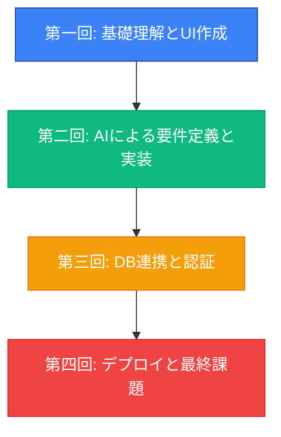

# Vibe Coder Bootcamp 成果報告会 資料

---

## 【パート1：研修概要説明】
*(受講生発表前に、審査員向けに手短に説明)*

### 1. 本研修でお伝えしたこと
- **目的**: AIを使いこなし、自らアイデアを形にできる「Vibe Coder」の育成
- **設計思想**:
  - 「基本概念の理解」を重視し、詳細な手順よりも「なぜそうするのか」という応用力を養うことを目指しました
  - マインドセット変革の徹底（第一回の60%を投資）
  - 実践的なハンズオン（理論20%：実践80%）

### 2. カリキュラムの全体像
- **期間**: 2025/11/17 〜 2025/12/22
- **構成**: 4週間（合計8時間または10時間）で、Webアプリ開発の全工程をAIと共に体験

### 3. 習得スキルセット
受講生は、AI（Cursor）への自然言語指示を通じて、以下のモダンな技術を操作するスキルを習得しました。

- **フロントエンド**: Next.js 15, TypeScript
- **バックエンド/DB**: Supabase
- **認証**: Clerk
- **デプロイ**: Vercel

**スキル成長マトリクス**:

| スキル領域 | Before | After | 成長度 |
|---|---|---|---|
| プログラミング | 全くできない | 基本的な実装が可能 | ★★★★☆ |
| AI活用 | ChatGPT少し | 高度なプロンプティング | ★★★★★ |
| 要件定義 | 曖昧な要望 | 構造化された仕様書 | ★★★★☆ |
| データベース | 概念も不明 | 設計・実装可能 | ★★★★☆ |
| デプロイ | 経験なし | Vercelで公開可能 | ★★★★★ |

### 4. 審査員の皆様へのお願い
- 本日は、技術の巧拙よりも、各発表者の**アイデア、熱意、そして学びの応用力**という観点で評価いただけますと幸いです。
- 審査にあたり、こちらの採点用アプリケーションをご利用ください。
- **URL**: `https://demodaybasic.vercel.app/`
- お名前をフルネームで入力後、「採点を開始する」ボタンを押してください。

---

## 【受講生発表】
*(ここで受講生の皆様に発表いただきます)*

---

## 【パート2：研修の振り返り】
*(結果発表後、総括として説明)*

### 5. 研修成果の定量的分析（アンケート結果）
- **全体満足度**: **4.75** / 5.0
- **面白さ**: **4.75** / 5.0
- **難易度**: **2.75** / 5.0
- **回答率**: 4名 / 4名（第一回・第二回合算）

**所感**: 非常に高い満足度を記録しました。難易度については中程度以下であり、受講生の皆様のリテラシーの高さと学習意欲により、スムーズに講義を進めることができました。

### 6. 研修成果の定性的分析（受講生の声）

- **熊井あすか様（第一回）**: 「プライベートでいろいろと専門的な情報を必要としていて、AIへの相談はかなり使っていたのですが、なんとなくうまく伝わっていないような気がしていたり、余分な情報を与えられたりして、いまいち使いこなせていないと感じた部分がかなりクリアになりました。そして、普段の相談も少し環境整備するだけで、得られる効果を何倍かにできる気がしています。」

- **熊井あすか様（第二回）**: 「投稿画面をブラッシュアップしようと思って、Cursorで適当に投稿作ってもらったら、それっぽい投稿がいっぱいできてて、、もうサイトのサクラっていらないですね。」

**所感**: スキル習得に留まらず、AI活用の本質的な価値や、日常業務にもたらすインパクトを実感いただけた点が大きな成果です。

### 7. 今回の学びと今後の課題（講師所感）

- **手応え**:
  - 今回、もともとお二人ともリテラシーが高い方々でしたので、非常にスムーズに講義を進めることができました。この点、心より感謝申し上げます。
  - 改めて実感したのは、「アイデアがある人は強い」ということです。技術は後からでも学べますが、明確なビジョンとアイデアを持っている方は、AIというツールを得て、一気に実現力を加速させることができます。
  - 短期間で高い成果を出せたのは、ひとえに受講生の皆様の学習意欲と優れた発想力の賜物です。

- **今後の展望**:
  - 今回の研修を通じて習得されたスキルは、まさにスタート地点です。
  - ここから先は、実際のプロダクト開発、事業課題の解決、そして新たな価値創造へと繋げていただけることを期待しております。

### 8. 最後に：Vibe Coderのこれから
- 本研修は、AI時代を生き抜くための第一歩です。
- ここで得た「AIをパートナーとして、自ら価値を創造する」経験を、ぜひ今後の業務に活かしていただきたいと願っております。
- この火を絶やさぬよう、組織として継続的な学びの機会を設けていくことが、今後の更なる成長に繋がると信じております。
- 本日は誠にありがとうございました。

---

**提供**: 株式会社TEKIONGroup
**講師**: 代表取締役 泉水亮介
**開催日**: 2025年12月22日（日）13:00〜
