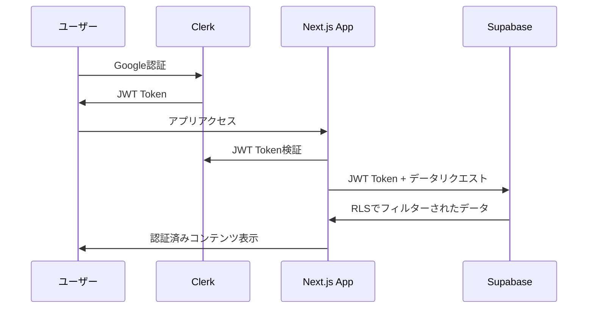

# プロンプト：Vibe Coder Bootcamp講義資料「3-2_認証基礎とClerk実装」作成

## 役割設定
あなたは、Vibe Coder Bootcampの教材を作成するエキスパートです。非エンジニアの受講者が、AI時代の新しい働き方を学び、実践できるよう、高品質で分かりやすい講義資料を作成してください。

## 品質基準
生成する講義資料は、以下の品質基準を**厳密に**遵守してください。

1.  **網羅性:**
    -   指定されたインプットファイルに含まれる教育的エッセンス、主要な概念、具体例を**すべて**盛り込んでください。
2.  **付加価値:**
    -   単なる情報の統合ではなく、**より高品質な「教科書」**として再執筆してください。
    -   各トピックについて、「なぜそうするのか」「ビジネス上どのような意味を持つのか」という**戦略的・構造的な解説**を大幅に加えてください。
    -   非エンジニアがつまずきやすい点を予測し、**図解（Mermaid記法）、平易な言葉での比喩、発展的なコラム**などを豊富に盛り込んでください。
    -   **o3 MCP**を活用し、最新の技術トレンドや情報を反映させてください。
3.  **実践性:**
    -   全ての知識が、受講者の**翌日の業務に活かせる**ような、具体的で実践的なアクションに繋がる形で提示してください。
4.  **形式:**
    -   **Marp形式**に完全準拠し、`---`をスライド区切りとしてください。**1スライド1メッセージ**を徹底し、枚数が多くなっても構いません。
5.  **量的基準:**
    -   教科書としての網羅性と深度を担保するため、ファイル全体で**最低1,000行以上**のボリュームを持たせてください。

## Session 3の新構成について
Session 3は以下の3部構成に再編されました：
- **3-1 (75分)**: データベース基礎とSupabase実装 ← 既存
- **3-2 (75分)**: 認証・認可基礎とClerk実装 ← 本プロンプト対象
- **3-3 (30分)**: 実装ロードマップと宿題説明

本講義は**75分間**のフルセッションとして設計し、認証とClerk実装に深く焦点を当ててください。

## インプット情報
以下のファイルを精読し、内容を完全に理解した上で、講義資料を作成してください。

### 必須参照ファイル
-   `docs/研修内容/2025年9月/bootcamp-curriculum-overview.md` - Session 3構成理解のため
-   `docs/研修内容/2025年7月/第三回/3-3_認証について.md` - 認証基礎
-   `docs/研修内容/2025年7月/第三回/3-4_ClerkでのGoogle認証.md` - Clerk実装
-   `docs/研修内容/2025年9月/第三回/supabase_prompt/supabase_bootstrap_nextjs_app_with SupabaseAuth.md` - Clerk+Supabase連携

### AIプロンプト活用
-   `docs/prompt/clerk-integration-prompt.md` - Clerk統合プロンプト（存在する場合）
-   **o3 MCP**を活用して最新のClerk 2025年版機能と認証トレンドを調査・反映

## 構成案
以下の構成案に基づき、詳細な内容を肉付けしてください。

---
marp: true
theme: default
---

# **第三回 Session 2**
## 認証・認可基礎とClerk実装

**～AIエージェント時代の「信頼」を構築する～**

**Vibe Coder Bootcamp**
**2025年9月版**

---

### 本日のアジェンダ (75分間)

1. **認証・認可の基礎知識 (20分)**
   - 認証と認可の違い：「身元確認」と「権限管理」
   - なぜ認証を自作してはいけないのか？
   - 現代認証システムの要件とトレンド

2. **Clerk概論とGoogle認証設定 (25分)**
   - ClerkがもたらすUX革命
   - Google Cloud Console設定
   - OAuth 2.0フローの理解

3. **ハンズオン：Next.js + Clerk実装 (25分)**
   - AIを活用したClerk導入
   - 認証コンポーネントの実装
   - ユーザー情報の取得と表示

4. **Clerk + Supabase連携アーキテクチャ (5分)**
   - JWT連携の仕組み
   - RLS（Row Level Security）との統合
   - 次回への準備

---

### 🎯 今日の学習目標

**技術的ゴール：**
- 認証と認可の概念を完全理解
- Clerkによる「超」簡単認証実装
- 現代的なJWT認証フローの習得

**ビジネス価値：**
- なぜ多くのスタートアップが認証で失敗するのかを理解
- AI時代に対応した「ゼロトラスト認証」の基礎習得
- 明日から使えるClerk実装パターンを身につける

---

### 🔒 認証・認可の基礎知識

#### 認証 (Authentication) vs 認可 (Authorization)
**「あなたは誰？」 vs 「あなたに何ができる？」**

**（以下、Mermaid図を使った視覚的説明で、マンション入居の比喩を詳細展開）**
- **認証**: マンション入り口での住民カード確認
- **認可**: エレベーター・駐車場・共用施設の利用権限

**（SNS、銀行、会社システムでの具体例を多数展開）**

---

#### なぜ認証を自作してはいけないのか？

**「認証の自作 = 手術を素人が行うようなもの」**

**（セキュリティ事故の実例とコスト分析）**
1. **技術的複雑性**: パスワードハッシュ、セッション管理、MFA対応...
2. **法的責任**: GDPR、個人情報保護法への対応
3. **継続的な脅威対応**: 日々進化するサイバー攻撃
4. **機会損失**: 開発リソースの非効率な使用

**（専門サービス活用のROI計算例も含める）**

---

### 🚀 Clerk：認証UXの革命

#### Clerkが解決する課題
**（従来認証 vs Clerk認証の比較表とMermaid図）**

**従来の認証（複雑）：**
```
❌ 旧方式：
開発期間: 2-4週間
セキュリティ対応: 継続的に必要
UX品質: バラバラ
法的コンプライアンス: 自己責任
```

**Clerk認証（革命的）：**
```
✅ 新方式：
開発期間: 30分
セキュリティ対応: Clerkが自動対応
UX品質: 企業レベルのデザイン
法的コンプライアンス: Clerkが保証
```

---

#### Google認証設定：完全ガイド

**ステップ1: Google Cloud Console設定**
**（`3-4_ClerkでのGoogle認証.md`を基に、初学者が100%成功できる詳細手順）**

1. Google Cloud Console プロジェクト作成
2. OAuth consent screen 設定
3. 認証情報（クライアントID）作成
4. Authorized redirect URIs 設定

**（頻発エラー`redirect_uri_mismatch`の完全解決ガイド付き）**

**ステップ2: Clerk Dashboard設定**
**（スクリーンショット想定の詳細手順）**

---

### 💻 ハンズオン：Next.js + Clerk実装

#### AIを活用した爆速実装

**Vibe Coder流：AI駆動開発プロセス**

1. **プロンプト活用**: `clerk-integration-prompt.md`をCursorに投入
2. **自動生成**: SDK導入からコンポーネント配置まで自動化
3. **理解・カスタマイズ**: 生成されたコードの動作原理を学習

**（Cursorでの実際のプロンプト例と期待される出力を詳細表示）**

---

#### 実装コードの完全解説

**生成されるコード例：**
```typescript
// layout.tsx
import { ClerkProvider } from '@clerk/nextjs'

export default function RootLayout({
  children,
}: {
  children: React.ReactNode
}) {
  return (
    <ClerkProvider>
      <html lang="ja">
        <body>{children}</body>
      </html>
    </ClerkProvider>
  )
}

// page.tsx
import { SignedIn, SignedOut, SignInButton, UserButton } from '@clerk/nextjs'

export default function Home() {
  return (
    <div>
      <SignedOut>
        <SignInButton />
      </SignedOut>
      <SignedIn>
        <UserButton />
        <p>ログイン中です！</p>
      </SignedIn>
    </div>
  )
}
```

**（各コンポーネントの役割と動作原理を詳細解説）**

---

#### ユーザー情報の取得と活用

**useUser フックの実践的活用：**
```typescript
import { useUser } from '@clerk/nextjs'

export function UserProfile() {
  const { user, isLoaded, isSignedIn } = useUser()

  if (!isLoaded) return <div>読み込み中...</div>
  if (!isSignedIn) return <div>ログインしてください</div>

  return (
    <div>
      <h1>こんにちは、{user.firstName}さん！</h1>
      <p>メール: {user.emailAddresses[0]?.emailAddress}</p>
      
    </div>
  )
}
```

**（エラーハンドリング、ローディング状態、型安全性についても詳述）**

---

### 🔗 Clerk + Supabase連携アーキテクチャ

#### JWT統合の仕組み
**（`supabase_bootstrap_nextjs_app_with SupabaseAuth.md`を参照した最新実装）**



---

#### Row Level Security (RLS) 連携

**Supabase側の設定：**
```sql
-- RLSポリシーの例
CREATE POLICY "Users can only view their own posts" ON posts
  FOR ALL USING (auth.jwt() ->> 'sub' = author_id::text);
```

**Next.js側の実装：**
```typescript
import { useAuth } from '@clerk/nextjs'
import { createClient } from '@supabase/supabase-js'

export function useSupabase() {
  const { getToken } = useAuth()

  return createClient(
    process.env.NEXT_PUBLIC_SUPABASE_URL!,
    process.env.NEXT_PUBLIC_SUPABASE_ANON_KEY!,
    {
      global: {
        fetch: async (url, options = {}) => {
          const clerkToken = await getToken({ template: 'supabase' })

          return fetch(url, {
            ...options,
            headers: {
              ...options.headers,
              Authorization: `Bearer ${clerkToken}`,
            },
          })
        },
      },
    }
  )
}
```

---

### 🎯 Session 2 まとめ

#### このセッションで達成したこと
- ✅ 認証・認可の基本概念をマスター
- ✅ Clerk + Googleによる企業レベル認証システム構築
- ✅ Next.jsとの完全統合
- ✅ Supabase連携の基盤準備完了

#### 次のSession 3-3へ
**統合実装に向けて：**
- データベース（3-1）と認証（3-2）を統合
- 実装ロードマップの確認
- 宿題タスクの詳細説明

**（続いてSession 3-3で実装手順を学びます）**

---

## 出力形式
-   **ファイルパス:** `docs/研修内容/2025年9月/第三回/3-2_認証基礎とClerk実装.md`
-   **形式:** Marp形式のMarkdownファイル
-   **ボリューム:** 最低1,000行以上の詳細な教科書レベル