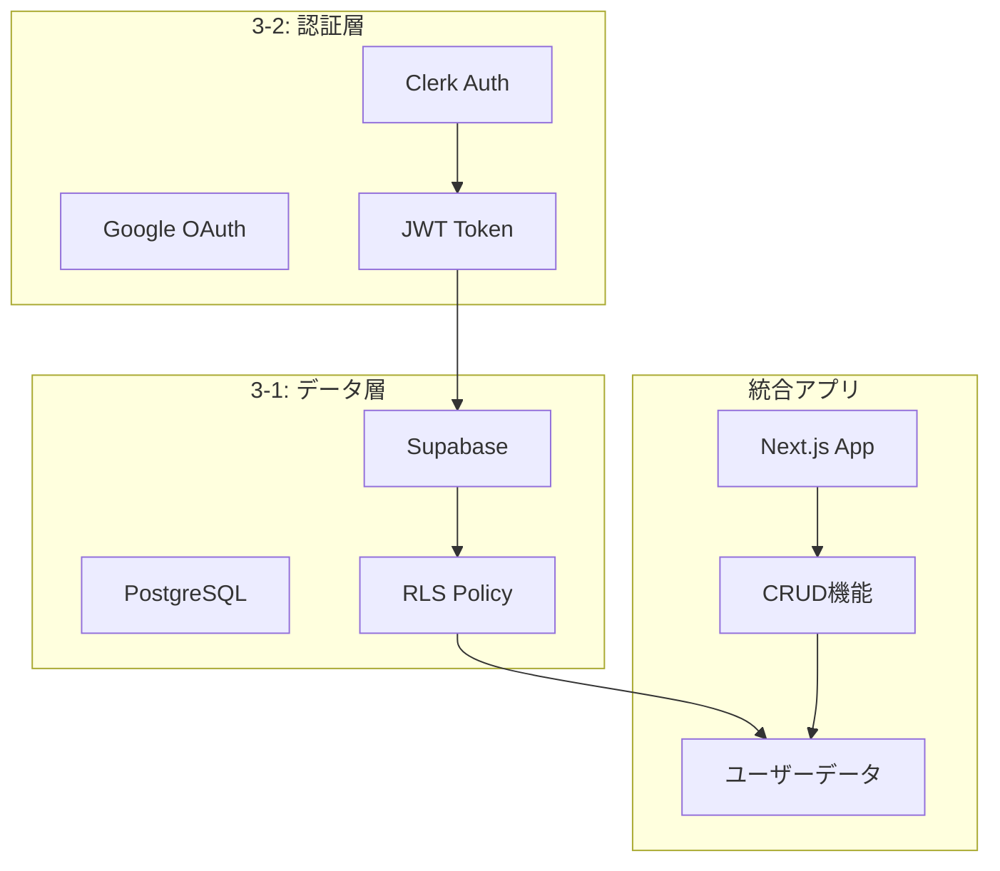

# プロンプト：Vibe Coder Bootcamp講義資料「3-3_実装ロードマップと宿題」作成

## 役割設定
あなたは、Vibe Coder Bootcampの教材を作成するエキスパートです。非エンジニアの受講者が、AI時代の新しい働き方を学び、実践できるよう、高品質で分かりやすい講義資料を作成してください。

## 品質基準
生成する講義資料は、以下の品質基準を**厳密に**遵守してください。

1.  **実践性:**
    -   全ての内容が、受講者が**即座に実装に取り掛かれる**具体的なガイダンスとして提示してください。
2.  **明確性:**
    -   ステップバイステップの実装手順を、**迷うことなく進められる**レベルで詳細に記述してください。
3.  **統合性:**
    -   3-1（DB/Supabase）と3-2（認証/Clerk）の学習内容を完全に統合し、**一つの動作するアプリケーション**として実装する道筋を示してください。
4.  **形式:**
    -   **Marp形式**に完全準拠し、`---`をスライド区切りとしてください。
5.  **簡潔性:**
    -   30分のセッションに適した、要点を絞った構成にしてください。

## Session 3の新構成について
Session 3は以下の3部構成に再編されました：
- **3-1 (75分)**: データベース基礎とSupabase実装 ← 完了
- **3-2 (75分)**: 認証・認可基礎とClerk実装 ← 完了
- **3-3 (30分)**: 実装ロードマップと宿題説明 ← 本プロンプト対象

本講義は**30分間**の実装ガイドセッションとして、学んだ内容を統合し、宿題として取り組むべき実装タスクを明確に提示してください。

## インプット情報
以下の内容を統合した実装ガイドを作成してください。

### 必須参照内容
-   **3-1の成果**: Supabaseプロジェクト作成、テーブル設計、基本クエリ
-   **3-2の成果**: Clerk認証設定、Google OAuth、JWT連携
-   **統合目標**: 認証付きCRUDアプリケーションの完成

### 実装で使用するMarkdownガイド
以下のようなMarkdownファイル群を参照する前提で、順序立てた実装手順を提示：
- `supabase-setup-guide.md` - Supabaseプロジェクト初期設定
- `clerk-integration-guide.md` - Clerk認証の統合手順
- `database-schema-guide.md` - テーブル作成SQLとRLS設定
- `crud-implementation-guide.md` - CRUD機能の実装手順

## 構成案
以下の構成案に基づき、詳細な内容を肉付けしてください。

---
marp: true
theme: default
---

# **第三回 Session 3**
## 実装ロードマップと宿題

**～学んだパーツを組み合わせて動くアプリを作る～**

**Vibe Coder Bootcamp**
**2025年9月版**

---

### 本日のアジェンダ (30分間)

1. **統合アーキテクチャ確認 (5分)**
   - 3-1と3-2で構築した要素の関係
   - 最終的なアプリケーション構成

2. **実装ロードマップ (10分)**
   - Step by Step実装手順
   - 各Markdownガイドの使い方

3. **宿題詳細説明 (10分)**
   - 必須タスク vs 発展タスク
   - 期待される成果物

4. **トラブルシューティング (5分)**
   - よくあるエラーと解決方法
   - 質問の仕方

---

### 🏗️ 統合アーキテクチャ

#### 今日作った2つの柱を繋げる



**これらを組み合わせることで：**
- ✅ ユーザーごとのデータ管理
- ✅ セキュアなアクセス制御
- ✅ リアルタイムデータ更新

---

### 📋 実装ロードマップ

#### Phase 1: 環境構築（30分）

**使用ガイド:** `initial-setup-guide.md`

```bash
# 1. プロジェクト初期化
npx create-next-app@latest my-app --typescript --tailwind

# 2. 必要パッケージインストール
npm install @clerk/nextjs @supabase/supabase-js

# 3. 環境変数設定
# .env.localファイルを作成
```

**チェックポイント:**
- [ ] `npm run dev`でアプリが起動する
- [ ] 環境変数が正しく設定されている

---

#### Phase 2: Clerk認証実装（45分）

**使用ガイド:** `clerk-integration-guide.md`

**実装順序：**
1. ClerkProviderの設定（layout.tsx）
2. middleware.tsの作成
3. サインインページの実装
4. ユーザープロフィール表示

**AI活用ポイント：**
```
Cursorに以下をコピペ：
「@clerk-integration-guide.md を参考に、
Next.js 14 App RouterでClerk認証を実装してください」
```

---

#### Phase 3: Supabase接続（45分）

**使用ガイド:** `database-schema-guide.md`

**実装順序：**
1. Supabaseクライアント作成
2. テーブル作成（SQL実行）
3. RLSポリシー設定
4. Clerk JWT連携

**重要SQL：**
```sql
-- profiles テーブル作成
CREATE TABLE profiles (
  id TEXT PRIMARY KEY,
  email TEXT NOT NULL,
  username TEXT UNIQUE,
  created_at TIMESTAMP DEFAULT NOW()
);

-- RLS有効化
ALTER TABLE profiles ENABLE ROW LEVEL SECURITY;
```

---

#### Phase 4: CRUD機能実装（60分）

**使用ガイド:** `crud-implementation-guide.md`

**実装する機能：**
1. **Create**: 新規投稿作成
2. **Read**: タイムライン表示
3. **Update**: 投稿編集
4. **Delete**: 投稿削除

**Server Actions実装例：**
```typescript
'use server'

export async function createPost(content: string) {
  const { userId } = auth()
  const supabase = createClient()

  const { data, error } = await supabase
    .from('posts')
    .insert({
      content,
      author_id: userId
    })

  if (error) throw error
  return data
}
```

---

### 📝 宿題：SNSアプリの完成

#### 必須タスク（最低限の動作）

**期限：次回セッションまで**

1. **認証機能**
   - [ ] Google認証でログイン/ログアウト
   - [ ] ユーザー情報の表示

2. **投稿機能**
   - [ ] 新規投稿の作成
   - [ ] 投稿一覧の表示
   - [ ] 自分の投稿のみ編集・削除可能

3. **データ永続化**
   - [ ] Supabaseにデータ保存
   - [ ] ページリロードしてもデータが残る

---

#### 発展タスク（チャレンジ）

**余力があれば挑戦：**

1. **いいね機能**
   - [ ] 投稿にいいねをつける
   - [ ] いいね数の表示
   - [ ] useOptimisticでの楽観的更新

2. **プロフィール機能**
   - [ ] プロフィール編集
   - [ ] アバター画像アップロード

3. **リアルタイム機能**
   - [ ] 新規投稿の自動表示
   - [ ] Supabase Realtime活用

---

### 🔧 トラブルシューティング

#### よくあるエラーTop 3

**1. 環境変数エラー**
```
Error: Missing NEXT_PUBLIC_CLERK_PUBLISHABLE_KEY
```
**解決:** `.env.local`ファイルを確認

**2. CORS/認証エラー**
```
Error: Invalid authentication credentials
```
**解決:** Clerk DashboardでJWT template設定確認

**3. RLSエラー**
```
Error: new row violates row-level security policy
```
**解決:** SupabaseダッシュボードでRLSポリシー確認

---

### 💡 実装のコツ

#### AI活用の極意

**効果的なプロンプト例：**
```
以下のエラーを解決してください：
[エラーメッセージ貼り付け]

環境：
- Next.js 14 App Router
- Clerk認証
- Supabase

試したこと：
[実施した対処法]
```

**段階的実装：**
1. まず動くものを作る（MVP）
2. エラーハンドリング追加
3. UI/UXの改善
4. パフォーマンス最適化

---

### 📚 参考資料

#### 公式ドキュメント
- [Clerk Docs](https://clerk.com/docs)
- [Supabase Docs](https://supabase.com/docs)
- [Next.js Docs](https://nextjs.org/docs)

#### 実装ガイド（Markdownファイル）
- `initial-setup-guide.md`
- `clerk-integration-guide.md`
- `database-schema-guide.md`
- `crud-implementation-guide.md`
- `troubleshooting-guide.md`

#### サポート
- Slackチャンネル: #vibecoder-support
- 質問テンプレート使用推奨

---

### ✅ Session 3 完了チェックリスト

#### 理解度確認
- [ ] データベース基礎（3-1）を理解した
- [ ] 認証の仕組み（3-2）を理解した
- [ ] 3-1と3-2の内容がどう繋がるか理解した
- [ ] 実装の順序が明確になった

#### 準備完了確認
- [ ] 開発環境が整っている
- [ ] 必要なアカウントを作成済み
- [ ] 実装ガイドにアクセスできる

#### 宿題準備確認
- [ ] 実装手順を把握した
- [ ] 必須タスクと発展タスクの違いを理解した
- [ ] 分からないことは質問する準備OK

**第三回セッション完了！実装開始！🎉**

---

### 🚀 次回（第四回）予告

#### Session 4: デプロイと公開

**学習予定：**
- Vercelへのデプロイ
- 環境変数の本番設定
- カスタムドメイン設定
- パフォーマンス最適化

**宿題の活用：**
- 今回作ったアプリを世界に公開！
- ポートフォリオとして活用可能

---

## 出力形式
-   **ファイルパス:** `docs/研修内容/2025年9月/第三回/3-3_実装ロードマップと宿題.md`
-   **形式:** Marp形式のMarkdownファイル
-   **ボリューム:** 30分のセッションに適した簡潔な構成