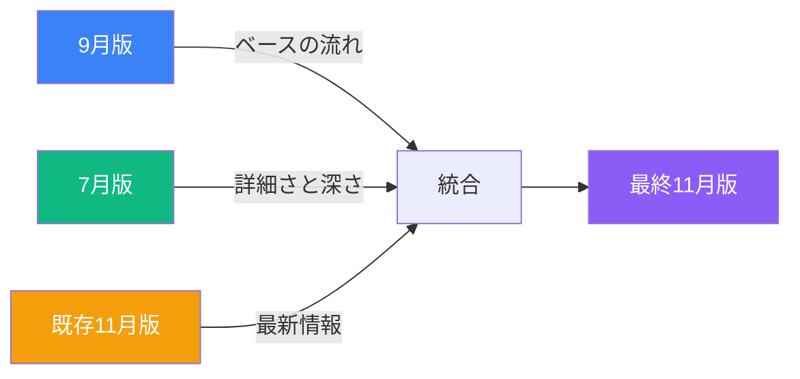

# VibeCoder育成プログラム 11月版アップデート プロンプト v2.0

## 📋 ミッション概要

9月版の講義資料をベースに、7月版の充実した内容を**選択的に**取り込みながら、
構造を明確化した11月版を作成する。

**重要**: この教材は**概念理解とAI駆動開発のマインドセット**を伝えることが目的。
詳細な実装コードは最小限とし、「なぜ」「どう使うか」に焦点を当てる。

---

## 🎯 目的と背景

### **これまでの経緯**
- **7月版**: 章ごとにファイルが分割されており、内容が充実していた
- **9月版**: ファイル数を減らして統合、内容を簡略化、Marp形式に変更
- **問題点**:
  - 内容が薄くなりすぎて伝わりづらい部分がある
  - ファイル統合時に構造がぐちゃぐちゃになった
  - Marp形式はプレビューしづらく、情報を詰め込みにくい
  - **コード例が過多になり、概念理解が疎かになった**

### **11月版で実現すること**
1. ✅ Markdown形式に戻す（Marpではなく）
2. ✅ 各章に明確な目次・学習目標を追加
3. ✅ 7月版の**概念説明**と**比喩**を取り込む
4. ✅ 9月版の**戦略的解説**と**トラブルシューティング**を保持
5. ✅ **コード例は最小限**（概念理解に必要な10-20行程度まで）
6. ✅ 流れを整理して読みやすく

---

## 📖 作業プロセス

### **Step 1: ファイルの読み込みと比較**

#### **重要：7月版は章ごとに分割されている**

7月版第二回の構成例：
- 2-0_宿題確認.md → 簡潔な復習
- 2-1_LLMの基礎理解.md → **概念中心（参考にする）**
- 2-2_AI駆動要件定義.md → 概念＋手法
- 2-3_Cursor開発環境構築.md → 設定手順
- 2-4_AI駆動開発実践.md → **コード例中心（取り込まない）**
- 2-5_技術スタック理解.md → 技術概要
- 2-6_バージョン管理とドキュメント作成.md → 実践手順
- 2-7_宿題説明.md → 次回課題

**分析時の注意：**
- 「2-4_AI駆動開発実践.md」のような**コード中心ファイル**は参照のみ
- コード例を含むファイルから取り込むのは**概念的な説明のみ**
- 7月版で「LLMの基礎理解」「AI駆動要件定義」などの概念ファイルを優先

#### **9月版の読み込み**

1. **9月版の対象章を読む**
   - 現在の構成と内容を把握
   - 新たに加筆された部分を特定（特にトラブルシューティング）

2. **比較分析**
   - 9月版で**新たに追加された良い内容**（戦略的解説、トラブルシューティング）
   - 9月版で**削られたが重要な内容**
   - 7月版で**より詳しく説明されていた部分**（概念、比喩）
   - 構造的に**ぐちゃぐちゃになった部分**

---

### **Step 2: 11月版の設計**

#### **構造設計の原則**

```markdown
# 第X章：タイトル

## 🎯 この章で学ぶこと
- 学習目標1
- 学習目標2
- 学習目標3

## 📌 この章の位置づけ
この章では〜について学びます。前章の〜を受けて、〜を理解することで、次章の〜につながります。

---

## セクション1のタイトル

### 内容...

---

## セクション2のタイトル

### 内容...

---

## 💡 この章のまとめ
- ポイント1
- ポイント2
- ポイント3

## 🚀 次の章への橋渡し
次章では〜について学びます。
```

#### **各章の冒頭に必須要素**
1. **章番号と章タイトル**
2. **🎯 この章で学ぶこと**（箇条書き）
3. **📌 この章の位置づけ**（前後の章とのつながり）

#### **各章の末尾に必須要素**
1. **💡 この章のまとめ**（箇条書き）
2. **🚀 次の章への橋渡し**

---

### **Step 3: 内容の統合と加筆**

#### **ブレンド統合アプローチ（v2.0改訂版）**

**基本方針：9月版の内容をふんわりと引き継ぎつつ、各章から7月みたいな詳細さ（コードは除く）も採用**



**統合の3つの柱：**

| 要素 | 役割 | 取り込み方 |
|------|------|----------|
| **9月版** | ベースの流れ・章構成 | **ふんわりと継承**（硬直的な構造ではなく、自然な流れを活かす） |
| **7月版** | 詳細さ・概念の深さ | **各章から積極的に採用**（コードを除く概念説明、比喩、図解） |
| **既存11月版** | 最新情報 | **100%保持**（Cursor 2.0、Gemini 2.5、Sora 2） |

**具体的な統合ステップ：**

1. **ベース作成（9月版から）**
   - 9月版の章構成と流れを「骨格」として使用
   - ただし、硬直的に9月版に縛られず、自然な流れを優先

2. **詳細さの追加（7月版から）**
   - 各セクションで7月版の詳細な概念説明を探す
   - 効果的な比喩、図解、比較表を積極的に取り込む
   - **コード例は除外**（概念的な説明のみ）

3. **最新情報の統合（既存11月版から）**
   - Cursor 2.0、Gemini 2.5、Sora 2の情報を必ず含める
   - 講義順序の変更を反映

**NG例（硬直的なアプローチ）：**
❌ 「まず9月版を100%コピーし、次に7月版から追加し、最後に11月版から上書き」

**OK例（ブレンド統合アプローチ）：**
✅ 「9月版の流れを読みながら、7月版の詳細説明で補強し、11月版の最新情報を自然に統合」

#### **🔴 重要：コード例の扱い方**

**原則：コード例は教育的な最小限のみ**

**✅ 許容されるコード例（10-20行程度）:**
```typescript
// ✅ 良い例：環境変数の使い方を示す最小限のコード
// .env.local
DATABASE_URL=postgresql://...
NEXT_PUBLIC_API_KEY=xxx

// コンポーネント内
const apiKey = process.env.NEXT_PUBLIC_API_KEY
```

**❌ 避けるべきコード例（50行以上）:**
```typescript
// ❌ 悪い例：完全な実装コード
export default function TwitterClone() {
  const [tweets, setTweets] = useState<Tweet[]>([])
  const [content, setContent] = useState('')

  // ... 50行以上の実装コード
}
```

**判断基準：**
- **10行以下**: ✅ OK - 概念理解に必要
- **10-20行**: 🤔 判断が必要 - 教育的価値があるか？
- **20-50行**: ⚠️ 慎重に - 本当に必要か再考
- **50行以上**: ❌ NG - 別ファイルまたは除外

**代替手段：**
- 詳細なコードは「GitHubリポジトリ参照」と言及のみ
- または「Cursorで生成させる」という演習形式に

#### **加筆基準の明確化**

**以下の要素が7月版にあって9月版で不足している場合は追加：**

1. **概念説明**
   - LLMの仕組み、AI駆動開発の原則
   - 「なぜそうするのか」の戦略的解説
   - 背景にある思想

2. **比喩と具体例**
   - 「レストラン厨房」「配達員」などの効果的な比喩
   - ビジネス事例（コード以外）
   - 日常生活との関連付け

3. **図解（Mermaid）**
   - フローチャート
   - 比較図
   - マインドマップ

4. **比較表**
   - Before/After
   - 従来 vs Vibe Coder
   - ツール比較

5. **実践的なTips**
   - よくあるエラーと対処法（コマンドや設定）
   - ベストプラクティス（概念レベル）
   - 時短テクニック

**❌ 追加しない要素（明確な除外基準）：**

1. **詳細な実装コード**
   - 50行以上のコード例
   - 完全なコンポーネント実装
   - API実装の詳細
   - データベースクエリの詳細

2. **重複する内容**
   - 既に9月版で説明されている内容

3. **講義でスキップする技術解説**
   - 低レベルの技術詳細
   - 非エンジニアに不要な実装詳細

4. **古い情報**
   - 2024年以前の事例で現在relevantでないもの

---

### **Step 4: 品質基準の適用**

品質基準は `@docs/prompt/quality_improvement_prompt.md` に基づく：

#### **1. 網羅性**
- ✅ 7月版の**重要な概念**を100%包含
- ✅ 9月版の新規追加内容を100%保持
- ❌ 7月版の詳細コード例は除外

#### **2. 付加価値**
- ✅ 単なる統合ではなく、より高品質な教科書として再構成
- ✅ 「なぜそうするのか」の戦略的解説を充実
- ✅ 図解（Mermaid）、比喩、具体例を効果的に使用
- ✅ セクション間の論理的つながりを明確に
- ❌ コードの羅列ではない

#### **3. 実践性**
- ✅ 翌日の業務に活かせる概念と手法
- ✅ 非エンジニアが**AIに指示できる**レベル
- ✅ 「次に何をすべきか」が明確
- ❌ 自分で実装する必要がないコード例

#### **4. 構造**
- ✅ 各章に明確な目次・学習目標
- ✅ 章の位置づけが明確
- ✅ セクション間の区切りが明確（`---`を活用）
- ✅ 章末にまとめと橋渡し
- ✅ 1セクション1メッセージの原則

#### **5. 形式**
- ✅ Markdown形式（Marpではない）
- ✅ 情報を詰め込める
- ✅ プレビューしやすい
- ✅ GitHub Flavored Markdown準拠

#### **6. 量的基準**
- ✅ 各章は**最低1,000行以上**のボリューム
- ✅ 講義全体で最低4,000行以上
- ⚠️ ただしコード例による水増しではなく、概念説明とトラブルシューティングで充実させる

---

## 🔍 比較分析のチェックリスト

### **9月版を読む際の観点**

- [ ] 各章の構成は明確か？
- [ ] 章の冒頭に学習目標があるか？
- [ ] 新たに加筆された内容は何か？
- [ ] 流れがぐちゃぐちゃになっている部分はどこか？
- [ ] 内容が薄くなっている部分はどこか？

### **7月版を読む際の観点**

- [ ] 9月版より充実している説明は何か？
- [ ] 9月版で削られた重要な具体例は何か？
- [ ] 7月版の図解で有用なものは何か？
- [ ] 7月版の構造で優れている部分は何か？
- [ ] ファイル分割されていた時の章立ては？
- [ ] **コード例中心のファイルはどれか？（除外対象）**
- [ ] **概念中心のファイルはどれか？（参考にする）**

### **統合時の観点**

- [ ] 9月版の良い加筆は保持されているか？
- [ ] 7月版の充実した内容は取り込まれているか？
- [ ] 7月版の詳細コードは**除外**されているか？
- [ ] 重複はないか？
- [ ] 論理的な流れは自然か？
- [ ] 各章の独立性は保たれているか？（講義で選択的に使える）
- [ ] 章間のつながりは明確か？

---

## 📝 出力フォーマット

### **ファイル命名規則**

```
/Users/sensuiryousuke/Library/CloudStorage/GoogleDrive-rsensui@tekion.jp/マイドライブ/TEKION Group/VibeCoder育成プログラム/docs/研修内容/2025年11月/第X回/X-Y_タイトル.md
```

### **ファイル構造**

```markdown
---
title: "章のタイトル"
track: "2025年11月版・第X回"
author: "TEKION Group / 泉水亮介"
last_updated: "2025年11月XX日"
category: "カテゴリ名"
---

# 第X章：章のタイトル

## 🎯 この章で学ぶこと
- 学習目標1
- 学習目標2
- 学習目標3

## 📌 この章の位置づけ
（前後の章とのつながりを説明）

---

## セクション1

（内容）

---

## セクション2

（内容）

---

## 💡 この章のまとめ
- ポイント1
- ポイント2
- ポイント3

## 🚀 次の章への橋渡し
次章では〜について学びます。

---

## 参考資料
（必要に応じて）
```

---

## 🚀 実行手順

### **Phase 1: 第一回講義の処理**

1. **9月版第一回のファイルを読む**
   - 1-1_オリエンテーションとマインドセット変革.md
   - 1-2_ビジネス活用事例とLLM基礎.md
   - 1-3_ビジネス要件定義の実践.md

2. **対応する7月版ファイルを読む**
   - 第一回ディレクトリ内のすべてのファイル
   - コード中心 vs 概念中心を判別

3. **比較分析を実施**
   - 削られた内容、追加された内容を特定
   - コード例の量を確認

4. **11月版を作成**
   - 構造を明確化
   - 内容を統合・加筆（コード例は最小限）
   - 品質基準を適用

5. **レビュー**
   - チェックリストで確認
   - 泉水に確認

### **Phase 2-4: 第二回〜第四回の処理**

同様のプロセスを繰り返し

---

## ⚠️ 重要な注意事項

### **DO（やること）**
- ✅ 9月版の戦略的解説・トラブルシューティングは**100%保持**
- ✅ 各章の冒頭に**4つの必須要素**（学ぶこと、位置づけ、まとめ、橋渡し）を追加
- ✅ 7月版の**概念説明・比喩**を取り込む
- ✅ 論理的な**流れを整理**
- ✅ **Markdown形式**で作成（Marpではない）
- ✅ コード例は**10-20行以内**の教育的なもののみ

### **DON'T（やらないこと）**
- ❌ 7月版の50行以上のコード例を取り込まない
- ❌ 完全なコンポーネント実装を含めない
- ❌ 詳細なAPI実装コードを含めない
- ❌ o3 MCPでの最新情報追加は不要
- ❌ あえて薄くした部分を勝手に詳しくしない
- ❌ 重複する内容を繰り返さない
- ❌ Marp形式（`---`で区切ったスライド形式）にしない
- ❌ 7月版の内容を無批判にすべてコピーしない

### **判断が必要な場合**
- 🤔 コード例が20行以上だが**教育的価値が高い**と思われる → 泉水に確認
- 🤔 7月版のファイルが**コード中心か概念中心か判断できない** → ファイル名と冒頭を確認、不明なら泉水に確認
- 🤔 「この内容は取り込むべきか？」→ 泉水に確認
- 🤔 「この部分は講義でスキップするか？」→ 泉水に確認
- 🤔 「この構成で流れは自然か？」→ 泉水に確認

---

## 📊 進捗管理

### **作業単位**
- 1章ごとに作業
- 各章ごとに泉水の承認を得る

### **完了基準**
- [ ] 9月版と7月版の比較分析完了
- [ ] **7月版のコード中心ファイルを特定**
- [ ] 11月版の構造設計完了
- [ ] 内容の統合・加筆完了（コード例除外確認）
- [ ] **4つの必須要素**が各章に存在
- [ ] 品質基準チェック完了
- [ ] 泉水の承認取得

---

## 🎓 成果物イメージ

### **Before（11月版の問題）**
```markdown
## 環境変数とセキュリティ

環境変数は、APIキーやデータベース接続情報などの機密情報を...

\`\`\`typescript
// 50行以上の完全な実装コード
export default function App() {
  const [data, setData] = useState()
  // ...大量のコード
}
\`\`\`
```

### **After（改善された11月版）**
```markdown
# 第2章：Webアプリケーションの仕組み

## 🎯 この章で学ぶこと
- フロントエンドとバックエンドの役割分担
- 環境変数によるAPIキーの安全な管理方法
- APIを通じたデータ取得の仕組み

## 📌 この章の位置づけ
第1回で学んだAI駆動開発の基礎を受けて、
この章ではWebアプリケーションの基本構造を理解します。
第3回で学ぶSupabaseとClerkの統合の土台となります。

---

## 環境変数とセキュリティ

### なぜ環境変数が必要なのか

**比喩：レストラン厨房の秘伝のレシピ**
環境変数は、レストランの「秘伝のレシピ」のようなものです。

（詳細な説明...）

---

### 環境変数の基本

**教育的なコード例（15行）:**
\`\`\`bash
# .env.local
DATABASE_URL=postgresql://...
NEXT_PUBLIC_API_KEY=sk-proj-xxxxx

# ❌ 間違い：ブラウザで使えない
process.env.DATABASE_URL

# ✅ 正しい：ブラウザで使える
process.env.NEXT_PUBLIC_API_KEY
\`\`\`

**完全な実装は:**
> 詳細な実装例は、Cursorで以下のプロンプトを使って生成してください：
> "環境変数を使ったNext.jsアプリケーションを作成してください"

---

## 💡 この章のまとめ
- フロントエンドとバックエンドは役割が異なる
- 環境変数でAPIキーを安全に管理する
- `NEXT_PUBLIC_`プレフィックスの重要性を理解した

## 🚀 次の章への橋渡し
次章では、SupabaseとClerkを使って、データベースと認証を実装します。
```

---

## 📞 質問・確認が必要な時

以下の場合は作業を中断し、泉水に確認：

1. 7月版と9月版で**内容が矛盾**している
2. コード例が20行以上だが**教育的価値が高い**と思われる
3. 7月版のファイルが**コード中心か概念中心か判断できない**
4. **どちらを採用すべきか判断できない**
5. **新たな章立てが必要**と思われる
6. **大幅な構成変更**が必要と思われる

---

## ✅ 最終チェックリスト

### **構造**
- [ ] 各章に**4つの必須要素**（学ぶこと、位置づけ、まとめ、橋渡しがある
- [ ] 章の位置づけが明確
- [ ] セクション間の区切りが明確（`---`）
- [ ] 章末にまとめと橋渡しがある
- [ ] 1セクション1メッセージの原則

### **内容**
- [ ] 9月版の新規加筆が保持されている
- [ ] 7月版の充実した内容が取り込まれている
- [ ] **7月版の詳細コードは除外されている**
- [ ] 論理的な流れが自然
- [ ] 重複がない

### **コード例（最重要）**
- [ ] コード例は**10-20行以内**の教育的なもののみ
- [ ] 50行以上の実装コードは**含まれていない**
- [ ] 詳細実装は「Cursorで生成」と言及のみ
- [ ] 非エンジニアが**AIに指示できる**レベルの説明

### **品質**
- [ ] 具体例・実例が豊富（コード以外）
- [ ] 図解（Mermaid）が効果的
- [ ] 「なぜ」が明確
- [ ] 実践的なアクションが明確（AIへの指示方法）

### **形式**
- [ ] Markdown形式（Marpではない）
- [ ] GitHub Flavored Markdown準拠
- [ ] プレビューしやすい
- [ ] 最低1,000行以上のボリューム（コード例除く）

---

## 🎯 次のステップ

このプロンプトに基づき、以下の順序で作業を進める：

1. **第一回・第1章から開始**
2. **泉水の承認を得る**
3. **次の章へ進む**
4. **全4回分を完了**

---

**作成日**: 2025年11月6日
**更新日**: 2025年11月11日
**バージョン**: 2.0（コード例明確化版）
**作成者**: Claude (Sonnet 4.5)
**承認者**: 泉水亮介
