# 第一回講義：オリエンテーションとマインドセット変革

## 🎯 この講義で学ぶこと

- **AI駆動開発の革命的な可能性**を理解し、「できない」から「まず作ってみる」へのマインドセット変革
- **Vibe Coderとは何か**、そしてなぜ非エンジニアこそがこの新しい働き方の主役なのか
- **コンテクストコントロール**という新しいスキルの本質と実践方法
- **IDE型AI**がもたらす革命的な変化と、チャット型AIとの決定的な違い
- **AIと共に成長する思考法**と、未来の技術進化を自分の力に変える方法
- **投資思考**で AI ツールを活用し、最大のリターンを得る戦略

## 📌 この講義の位置づけ

本講義は、VibeCoder育成プログラム全7回の第一回です。

この講義では、AI駆動開発の世界観と可能性を理解し、「自分にもできる」という確信を得ることが目標です。技術的なスキルよりも、**マインドセットの変革**が最も重要なテーマです。

次回以降では、具体的なツールの使い方、実装方法、デプロイメントへと進んでいきますが、すべての土台となるのがこの第一回で学ぶマインドセットです。

---

# 第1章：イントロダクション

## 🎯 この章で学ぶこと

- 世界で起きている革命的な事例（18歳が月収1.4億円、10代が評価額2,000億円企業を創業）
- 講師の泉水亮介がどのように非エンジニアから Vibe Coder へと変貌したのか
- なぜ「特別な才能」は不要で、「今から始める」ことが重要なのか

## 📌 この章の位置づけ

この章では、AI駆動開発がもたらす可能性を具体的な事例で理解します。「自分には無理」という思い込みを破壊し、「自分にもできる」という確信を得るための章です。

---

## 🚀 衝撃の事実：AI時代の新しい成功法則

### **「午前の会議のアイデアが、午後にはプロトタイプに」**

これは夢物語ではありません。**今、この瞬間に起きている現実**です。

### **受講満足度100%（2025年10月現在）**
### **非エンジニアが、1.5ヶ月でフルスタックWeb開発を習得**

---

## 💥 世界で起きている革命

### **18歳が月収1.4億円、3人の10代が評価額2,000億円企業を創業**

| 年齢 | 創業者・企業 | 成果 | 秘密は？ |
|------|-------------|------|---------|
| **18歳** | Zach Yadegari<br/>Cal AI | 月収1.4億円<br/>（約140万ドル/月） | AI + アイデア |
| **10代3人** | Mercor創業者 | 評価額2,000億円<br/>（20億ドル） | コードを書かない開発 |

### **彼らに共通する3つの特徴**
1. ✅ プログラミング経験ゼロからスタート
2. ✅ AIを「共同創業者」として活用
3. ✅ **「始めた」という、ただそれだけ**

---

## 🎯 本日のゴール：あなたも「新しい人類」になる

### **これから起こる「3つの革命」**

1. **🧠 思考の革命**
   - 「できない」から「まず作ってみる」へ
   - 「リソース不足」から「AI協働で無限の可能性」へ

2. **💡 価値観の革命**
   - 「コストとしてのAI」から「投資としてのAI」へ
   - 「技術の壁」から「ビジネス価値への集中」へ

3. **🚀 行動の革命**
   - 「アイデアの墓場」から「アウトプットの工場」へ
   - 「完璧を求める」から「高速反復で成長」へ

> **"今日から、あなたは新しい人類(Vibe Coder)になる"**

---

## 🏆 このプログラムの実績

### **Vibe Coder Bootcampが選ばれる理由**

- ✅ **受講満足度100%**（2025年10月現在）
- ✅ **1.5ヶ月でフルスタックWeb開発を習得**
- ✅ **企画から開発、デプロイまで一貫して完結**
- ✅ **非エンジニアが主役のプログラム設計**

### **習得できる技術範囲**
- DB設計、認証、API連携
- フロントエンド・バックエンド開発
- デプロイとインターネット公開
- **そして最も重要な「コンテクストコントロール」技術**

---

## 📋 本日のアジェンダ

### **第一回講義：AI駆動開発への第一歩（90分）**

#### **Part 1: オリエンテーション（20分）**
- **講師自己紹介とVibe Coderの紹介**
- **この機会の価値**：日本初の総合大学での取り組み、企業向けは180万円/人
- **重要な約束事**：宿題必須、積み重ねのスキル、7回完走の先にあるもの
- **卒業後のチャンス**：アルバイト、正式採用、起業支援の可能性

#### **Part 2: マインドセット変革（30分）**
- **衝撃の事実**：18歳が月収1.4億円、10代が2,000億円企業創業
- **第1章**：イントロダクション（講師の体験、非エンジニアからVibe Coderへ）
- **第2章**：Vibe Coderとコンテクストコントロールの本質
- **第2.5章**：革命の本質 - なぜIDEを学ぶべきなのか（重要★）
- **Webアプリ開発の全体像**：7回の講義で何を学ぶか

#### **Part 3: LLM基礎と要件定義入門（30分）**
- **LLMの仕組み**と特性理解
- **Text is KING**：プロンプトエンジニアリングの基本
- **要件定義の思考法**：アイデアを構造化する
- **Markdownで書く要件定義**の実践

#### **Part 4: 宿題説明とツール紹介（10分）**
- **宿題**：自分だけのオリジナルSNSを構想する（要件定義書作成）
- **主要AIツール紹介**：ChatGPT、Claude、Cursor等
- **次回予告**：Cursor環境構築と実装開始

---

## 🎓 はじめに：皆さんへのメッセージ

### **この講義は、皆さんにとって特別な機会です**

皆さん、こんにちは。TEKION Group代表の泉水亮介と申します。

まず、最初にお伝えしたいことがあります。

**この講義は、日本の総合大学で初めて実施される「Vibe Coding」の正式プログラムです。**

---

## 💎 この機会の価値を知ってください

### **企業向けと同じプログラムを、大学生の皆さんに提供します**

私たちTEKION Groupは、通常、企業の経営層や事業責任者向けに、このVibe Coder育成プログラムを提供しています。

**その受講料は、1人あたり180万円です。**

これは高額に思えるかもしれませんが、企業にとっては「AIを使いこなせる人材を育成する投資」として、十分にリターンがある金額なのです。

### **なぜ、大学生に提供するのか？**

理由は3つあります：

1. **若いうちから本物のスキルを身につけてほしい**
   - 社会に出る前に、実践的な技術を習得できるチャンスは貴重です
   - 就職活動で「AI駆動開発ができます」と言える学生は、まだほとんどいません

2. **総合大学でのチャレンジが、日本の未来を変える**
   - 武蔵野大学アントレプレナーシップ学部での取り組みは、日本初の試みです
   - 皆さんが成功することで、他の大学にもこの動きが広がります

3. **優秀な学生には、卒業後の道も用意しています**
   - この講義で実力をつけた方には、アルバイトや卒業後の採用の可能性もあります
   - 実際に、我々の企業でAI駆動開発を実践する機会を提供できます

---

## ⚠️ 重要：この講義への取り組み方

### **宿題は必ずやってください**

この講義では、毎回宿題を出します。

**宿題をやらないと、次の回についていけません。これは脅しではなく、事実です。**

なぜなら、AI駆動開発は「積み重ね」のスキルだからです。
- 第1回の宿題をやらない → 第2回の内容が理解できない
- 第2回の宿題をやらない → 第3回の実装ができない
- という形で、どんどん差が開いていきます。

### **この講義のペース**

- 毎週90分の講義
- 毎回2〜3時間程度の宿題
- 合計で週5〜6時間のコミットメントが必要です

**忙しいのは分かります。でも、だからこそ、覚悟を決めて参加してください。**

この7回の講義を完走した先には、
- **企業が180万円払ってでも手に入れたいスキル**
- **就職活動で圧倒的に差別化できる実績**
- **自分のアイデアを形にできる力**

が待っています。

---

## 🚀 皆さんへの期待

### **「できない」を「できる」に変える7週間**

この講義を受講する皆さんは、おそらく：
- プログラミング経験がない
- 「自分には無理」と思っている
- でも、「何か新しいことに挑戦したい」と感じている

そんな方々だと思います。

**安心してください。私も、2022年12月までコードを1行も書けませんでした。**

そして今、私は：
- 2年間で80本以上のアプリを開発
- 企業の基幹システムを構築
- 上場企業の経営者にこのスキルを教える

ということをやっています。

**「始める勇気」さえあれば、誰でもVibe Coderになれます。**

---

## 💼 卒業後のチャンス

### **優秀な学生には、実務の機会を提供します**

この講義で実力をつけた方には：

1. **アルバイトとしての採用**
   - TEKION Groupや関連企業でのアルバイト
   - 実際のプロジェクトに参加し、報酬を得ながらスキルを磨けます

2. **卒業後の正式採用**
   - 新卒採用とは別の、スキルベースでの採用枠
   - 即戦力として、AI駆動開発の最前線で活躍できます

3. **起業支援**
   - 自分でサービスを作りたい方には、技術面・ビジネス面でのサポート
   - 場合によっては、資金調達の支援も検討します

**ただし、これは「優秀な学生」に限ります。**

具体的には：
- 7回の講義すべてに出席
- すべての宿題を完遂
- 最終プレゼンテーションで、オリジナルのアプリを発表

この3つをクリアした方が対象です。

---

## 👤 改めまして：講師紹介

### **泉水 亮介（Ryosuke Sensui）**

**現職**
- TEKION Group CEO
- Cybernex CSO
- 武蔵野大学アントレプレナーシップ学部研究員　Vibe Coding講師

---

### **経歴**

| 期間 | 役職・組織 |
|------|-----------|
| **2013-2016** | 富士ゼロックス株式会社<br/>大手企業向けドキュメントコンサルティング営業 |
| **2016-2020** | MAMORIO株式会社（現・NEARIZE）取締役COO<br/>紛失防止IoTデバイス事業の事業開発・広報・製品企画を統括 |
| **2020-現在** | TEKION Group CEO<br/>複数企業のCXOを兼務 |

---

### **Vibe Coder としての実績**

**開発実績**
- 2022年12月〜2025年9月：**80本のアプリ・機能を開発**
- コーディング経験：**ゼロ**（現在もコードは書けません）

**教育実績**
- 受講生満足度：**100%**（2025年10月現在）
- 上場企業代表を含む経営者の育成実績
- 複数企業でVibe Coder育成と組織変革を実現

---

### **講師としての強み**

非エンジニア出身だからこそ、**非エンジニアの躓きポイントを熟知**しています。
そのため、挫折させないプログラム設計が可能です。

> **「2022年12月まで、コードを1行も書けませんでした。そして、今も書けません。」**

---

## 🎬 転機：2022年12月、ChatGPTとの出会い

### **最初の開発：問い合わせBot「Ryoko AI」**

**開発環境：** メモ帳
**使用言語：** Google Apps Script（コピペ）
**所要時間：** 3日間の試行錯誤

### **そこで起きた「認識の革命」**

> 「コードが読めなくても、**AIがバグを判断してくれる**」
> 「エラーメッセージをコピペするだけで、**解決策が返ってくる**」
> 「動くものが、**自分の手で作れた**」

**この瞬間、私は確信しました：**
## **「プログラミングの民主化が始まった」**

---

## 📈 驚異的な成長曲線：2年で80本のアプリ開発

### **代表的な開発実績とビジネスインパクト**

| 時期 | プロダクト | ビジネス成果 | 学び |
|------|------------|-------------|------|
| **2024.7** | MENU DB入力システム | エンジニア不在の環境で<br/>基幹システム構築 | AIのみでの開発実践 |
| **2025.2** | Brainwave Analyzer 2 | 月額課金SaaS構築<br/>継続的な収益モデル確立 | SaaS型ビジネスモデル |
| **2025.3** | Oh! My Gear | 初のB2C公開サービス<br/>SNS機能で成長中 | ユーザー体験設計 |
| **2025.7** | MD Now! | Cursor拡張として動作<br/>開発者コミュニティで話題 | エコシステム理解 |

> **注目：** これらすべて、**エンジニア経験ゼロ、AIとの対話だけ**で実現

---

## 💼 Vibe Coderとしての信念

### **マインドセット**

- **アイデアを即座に形にする力**：京都出張で見たインバウンドの課題を新幹線内でプロトタイプ化
- **AIの成長を自分の力に**：日々進化するAIと共に成長
- **非エンジニアの強みを活かす**：コミュニケーション力×顧客接点×AI＝新たな価値創造

### **ミッション**

## **「コードで制御される世界で、非エンジニアが制御する側に回る」**

- 世界を変える力とスピードを手に入れる
- 組織と人材をAI駆動開発で変革する
- Vibe Coder Bootcampを通じて、この力を多くの人に伝える

---

## 💭 なぜこの話をするのか？

### **3つの重要なメッセージ**

### 1️⃣ **「特別な才能」は不要**
- 私は絵も描けない、デザインセンスもない
- プログラミングの素養もゼロ
- ただ「作りたい」という情熱だけ

### 2️⃣ **「遅すぎる」ことはない**
- つい最近初めてコードに触れた
- 本格的に取り組んで1年で実用的なシステム構築が可能に
- 年齢は言い訳にならない

### 3️⃣ **「あなたにもできる」**
- 必要なのは正しい方法論
- AIとの協働スキル（コンテクストコントロール）
- そして、今日から始める勇気

---

## 💡 この章のまとめ

- ✅ 世界では18歳が月収1.4億円、10代が2,000億円企業を創業している
- ✅ 彼らに共通するのは「プログラミング経験ゼロ」「AIを活用」「始めた」だけ
- ✅ 講師の泉水も2022年12月までコードを1行も書けなかった
- ✅ わずか2年で80本のアプリを開発し、実用的なビジネス成果を生んでいる
- ✅ 特別な才能は不要、遅すぎることはない、あなたにもできる

## 🚀 次の章への橋渡し

講師の体験を通じて「非エンジニアでもできる」という可能性を理解しました。
次の第2章では、具体的に「Vibe Coderとは何か」「どのようにして価値を生み出すのか」を詳しく学んでいきます。

---

# 第1.5章：この研修で学ぶWebアプリ開発の全体像

## 🎯 この章で学ぶこと

- **Webアプリ開発の7つの工程**を理解する
- **各回でどの工程を学ぶか**を把握する
- **AI駆動開発での時間短縮効果**を知る
- **ゴールとなる成果物**を明確にイメージする

## 📌 この章の位置づけ

第1章で「なぜVibe Coderになるべきか」を理解しました。
この章では、この研修プログラム全7回を通じて、どのような流れでWebアプリを作り上げていくのか、その全体像を把握します。
地図を持たずに旅に出ることはできません。ゴールまでの道筋を明確にしましょう。

---

## 🗺️ Webアプリ開発の全体工程

### **7つのステップで理解する開発フロー**

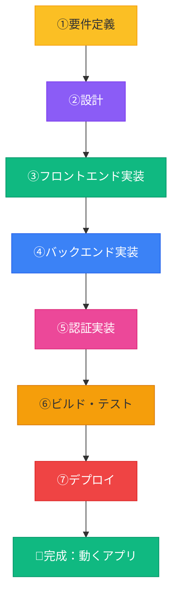

### **各工程の詳細**

| 工程 | 内容 | 従来の時間 | AI駆動の時間 | 削減率 |
|------|------|----------|------------|--------|
| **①要件定義** | 何を作るか決める | 1週間 | 2-3時間 | **95%削減** |
| **②設計** | システム構成を決める | 3-5日 | 1-2時間 | **90%削減** |
| **③フロントエンド** | ユーザーが見る画面 | 2週間 | 2-4時間 | **90%削減** |
| **④バックエンド** | データ処理の仕組み | 2週間 | 1-2時間 | **95%削減** |
| **⑤認証** | ログイン機能 | 1週間 | 30分 | **98%削減** |
| **⑥ビルド** | 本番用に最適化 | 1日 | 5分 | **99%削減** |
| **⑦デプロイ** | インターネット公開 | 2-3日 | 10分 | **99%削減** |
| **合計** | - | **約2ヶ月** | **約1日** | **98%削減** |

---

## 📚 この研修プログラムの全体構成

### **第1回から第7回までの学習マップ**

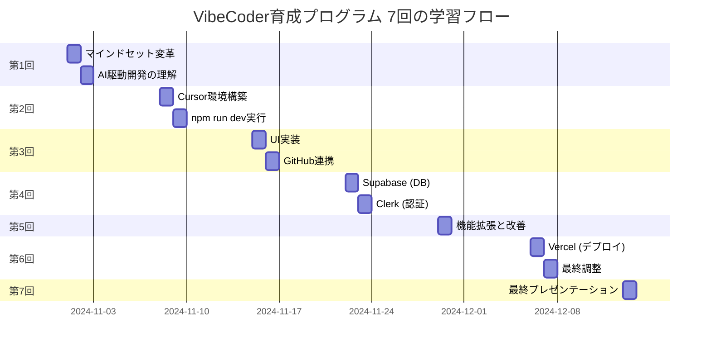

### **各回で達成すること**

#### **📍 第1回：オリエンテーションとマインドセット変革（今回）**

**学ぶこと**:
- この機会の価値理解（日本初、企業向けは180万円/人）
- AI駆動開発の可能性と価値
- Vibe Coderとは何か
- 要件定義の基礎

**達成目標**:
- ✅ 「自分にもできる」という確信
- ✅ AI駆動開発の全体像理解
- ✅ 宿題：オリジナルSNSの要件定義作成

**対応工程**: ①要件定義

---

#### **📍 第2回：Cursor環境構築と初期実装**

**学ぶこと**:
- Cursor完全セットアップ
- ターミナル基礎（非エンジニア向け）
- Next.jsプロジェクト作成
- npm run devでアプリ起動

**達成目標**:
- ✅ Cursorで開発できる環境完成
- ✅ localhost:3000でアプリが動く
- ✅ 基本的なページ構成の実装

**対応工程**: ②設計（開発環境）、③フロントエンド開始

---

#### **📍 第3回：UI実装とGitHub連携**

**学ぶこと**:
- Composerを使った本格UI実装
- GitHubへのプッシュ
- バージョン管理の基礎

**達成目標**:
- ✅ 見た目が整ったUIの完成
- ✅ GitHubにプロジェクトをプッシュ
- ✅ 基本的なGitワークフロー習得

**対応工程**: ③フロントエンド（UI実装完了）

---

#### **📍 第4回：データベースと認証の実装**

**学ぶこと**:
- データベース基礎（RDB）
- Supabaseセットアップ
- Clerk認証システム
- MASTER_INTEGRATION_PROMPTの活用

**達成目標**:
- ✅ データベースでデータ保存・取得
- ✅ ユーザー登録・ログイン機能
- ✅ フルスタックアプリの基盤完成

**対応工程**: ④バックエンド（Supabase）、⑤認証（Clerk）

---

#### **📍 第5回：機能拡張と改善**

**学ぶこと**:
- 追加機能の実装
- UI/UXの改善
- バグ修正とリファクタリング

**達成目標**:
- ✅ 自分のアイデアで機能追加
- ✅ ユーザー体験の向上
- ✅ より完成度の高いアプリに

**対応工程**: 反復開発（機能追加・改善）

---

#### **📍 第6回：デプロイと最終調整**

**学ぶこと**:
- Vercelへのデプロイ手順
- 環境変数の本番設定
- 最終プレゼンテーション資料作成

**達成目標**:
- ✅ インターネットで誰でもアクセス可能
- ✅ 実際のURLで公開
- ✅ プレゼンテーション準備完了

**対応工程**: ⑥ビルド、⑦デプロイ

---

#### **📍 第7回：最終プレゼンテーション**

**学ぶこと**:
- プレゼンテーション実践
- フィードバックの受け取り方
- 今後の学習ロードマップ

**達成目標**:
- ✅ オリジナルアプリのデモ発表
- ✅ 7週間の学習成果の共有
- ✅ 次のステップへの道筋

**対応工程**: なし（発表会）

---

## 🎯 最終的に作るもの

### **完成するアプリケーションの仕様**

```
アプリ名: 任意のWebアプリケーション

機能:
✅ フロントエンド（Next.js + React + TypeScript）
✅ データベース（Supabase + PostgreSQL）
✅ 認証システム（Clerk + Google OAuth）
✅ リアルタイムデータ同期
✅ レスポンシブデザイン（PC・スマホ対応）
✅ 本番環境デプロイ（Vercel）
✅ カスタムドメイン（オプション）

技術スタック:
- フロントエンド: Next.js 15 + React + TypeScript
- スタイリング: Tailwind CSS
- データベース: Supabase (PostgreSQL)
- 認証: Clerk
- ホスティング: Vercel
- バージョン管理: GitHub

成果物の価値:
💰 フリーランス案件: 30万円〜100万円相当
📊 ポートフォリオ: 転職活動で即戦力アピール
🚀 MVP開発: 自社サービスの立ち上げ
```

---

## 🔄 AI駆動開発と従来開発の比較

### **開発スピードの革命**

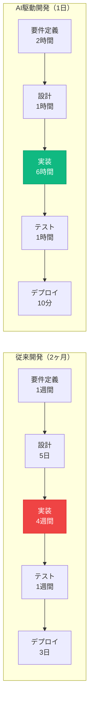

### **コスト削減効果**

| 項目 | 従来開発 | AI駆動開発 | 削減効果 |
|------|---------|-----------|---------|
| **開発期間** | 2ヶ月 | 1日 | **60倍** |
| **人件費** | 400万円<br/>（月100万円×2人×2ヶ月） | 5万円<br/>（AI利用料） | **80倍** |
| **修正コスト** | 高い（手戻り大） | 低い（即座に修正） | **10倍以上** |
| **学習コスト** | 1-2年 | 1.5ヶ月 | **10倍** |

---

## 🛠️ 各工程で使うツール

### **ツールマップ**

| 工程 | 主要ツール | 使用タイミング | 習得回 |
|------|----------|--------------|--------|
| **要件定義** | Claude/ChatGPT | プロジェクト開始時 | 第3回 |
| **設計** | Cursor Composer | 実装前 | 第2-3回 |
| **フロントエンド** | Cursor + Next.js | 画面作成 | 第2回 |
| **バックエンド** | Supabase | データ処理 | 第3回 |
| **認証** | Clerk | ログイン機能 | 第3回 |
| **ビルド** | Next.js CLI | デプロイ前 | 第4回 |
| **デプロイ** | Vercel | 公開時 | 第4回 |
| **バージョン管理** | GitHub | 常時 | 第2回〜 |

### **ツールの関係性**

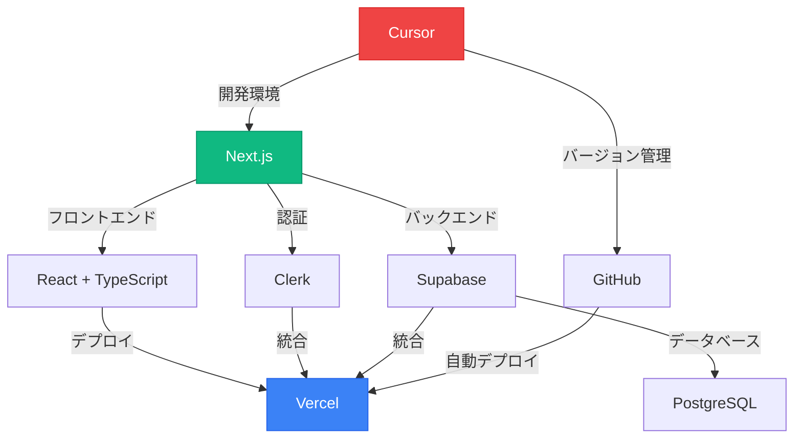

---

## 📈 学習の進め方

### **反復学習モデル**

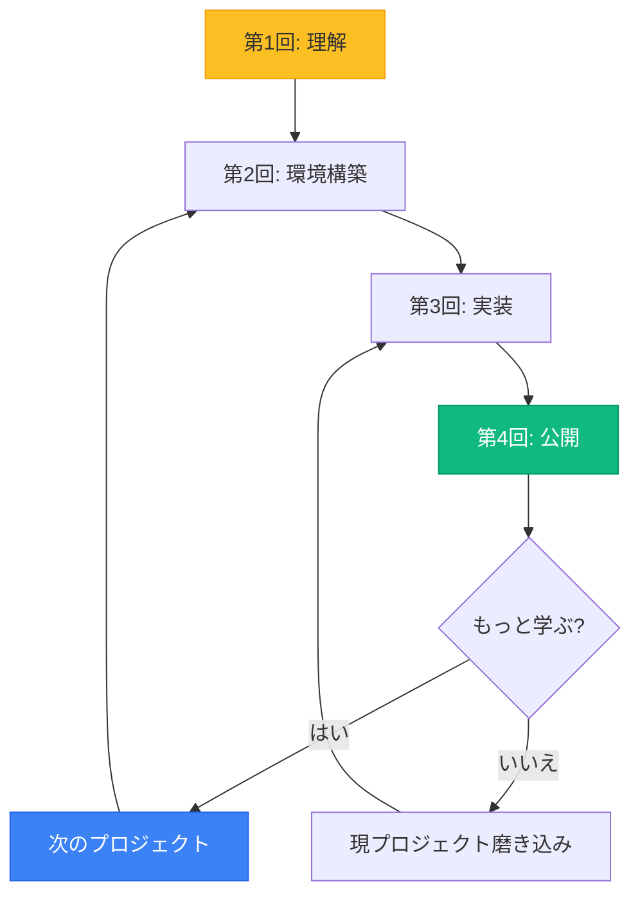

### **推奨学習サイクル**

```
1週目（第1回）:
✅ 全体像を理解
✅ AIツールに触れる
✅ マインドセット変革

2週目（第2回）:
✅ Cursor環境構築
✅ プロジェクト作成
✅ GitHub連携

3週目（第3回）:
✅ データベース実装
✅ 認証機能実装
✅ フルスタック化

4週目（第4回）:
✅ デプロイ実行
✅ 公開URL取得
✅ ポートフォリオ化

5週目以降:
✅ 2つ目のプロジェクト
✅ より高度な機能実装
✅ 実案件への挑戦
```

---

## 💡 この章のまとめ

- ✅ Webアプリ開発は**7つの工程**（要件定義→設計→実装→ビルド→デプロイ）
- ✅ AI駆動開発により**従来2ヶ月が1日に短縮**（98%削減）
- ✅ この研修は**全4回でフルスタック開発を習得**
- ✅ 第2回で環境構築、第3回で実装、第4回で公開
- ✅ 最終的に**30万円〜100万円相当のアプリが完成**
- ✅ 各工程で**最適なAIツールを使い分け**る

## 🚀 次の章への橋渡し

開発全体の流れとこの研修のゴールが明確になりました。
「2ヶ月が1日に」という劇的な効率化が、どのように実現されるのか。
次の第2章では、その中心にいる「Vibe Coder」という存在について、詳しく学んでいきます。

---

# 第2章：Vibe Coderとは

## 🎯 この章で学ぶこと

- Vibe Coderの定義と本質的な価値
- 従来のプログラマーとの決定的な違い
- なぜ非エンジニアこそVibe Coderになるべきか
- AI協働開発の具体的な5ステップワークフロー
- Vibe Coderに必要なスキルセット（技術的・非技術的）

## 📌 この章の位置づけ

第1章で「なぜあなたが、なぜ今なのか」を理解しました。
この章では、具体的に「Vibe Coderとは何者か」を明確に定義します。
第3章で学ぶ「3つの活用領域」の土台となる重要な概念です。

---

## 🌟 Vibe Coderの定義：3つの視点で理解する

### **シンプルな定義**

# **Vibe Coder = コードで制御される世界を、AIを通じて自在に操る人**

現代社会のあらゆるシステム（Web、アプリ、業務ツール）はコードで動いています。
Vibe Coderは、プログラミングスキルがなくても、AIという強力なパートナーを通じて、
これらのシステムを自在に作り、操ることができる人材です。

---

## 📖 Vibe Codingの起源：AIとの「ノリ」の良い開発

### **「Vibe Coding」という言葉の背景**

「Vibe Coding」という言葉は、元々「プログラマーがAIに対し、作りたいものの全体的な雰囲気（Vibe）を伝えることで、効率的に開発を進める手法」として提唱されました。

細かい技術仕様を記述するのではなく、**アイデアの核となるフィーリングや目的をAIと共有し、共創するスタイル**を指します。

### **元々の定義（Wikipedia）**
> Vibe CodingはAIに依存したプログラミング手法で、人は解きたい問題を、コーディングに特化した大規模言語モデル（LLM）へのプロンプトとして自然言語で記述する。
> プログラマの役割は手作業によるコーディングから、AIがソースコードを生成する際のガイドと生成したコードのテスト・改良へと変化してきている。

---

## 🌟 本研修が定義するVibe Coder

### **ビジネスにおける「アウトプット革命」の主役**

この研修では、Vibe Codingの概念を**エンジニアの領域からビジネス全体へと拡張**します。

## **Vibe Coder = AIとの協働により、アイデアを価値あるアウトプットへ高速に変換する、次世代の価値創造者**

これは単なる「AIが使える人」ではありません。

営業、マーケティング、企画、人事など、あらゆる職種のビジネスパーソンが、AIをパートナーとして**アイデアを即座に価値（プロトタイプ、企画書、業務改善ツールなど）へと変換する**ための新しい働き方であり、その実践者を指します。

### **重要な転換点**

コードを書くことが目的ではなく、**「コンテクストコントロール」**という新たなスキルを駆使して、ビジネスにおけるアウトプットの質と量を劇的に向上させる**「アウトプット革命」**の中心となる存在です。

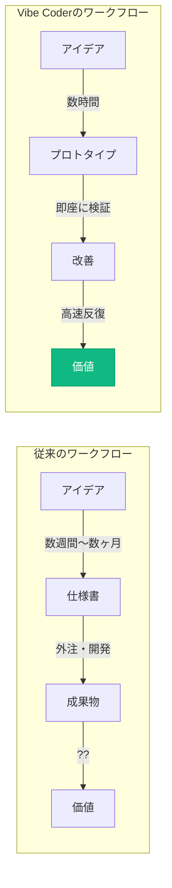

---

## 🔄 従来のプログラマーとVibe Coderの違い

### **パラダイムシフトを可視化する**

| 項目 | **従来のプログラマー** | **Vibe Coder** |
|------|---------------------|---------------|
| **主な作業** | 一からコードを手書きで作成 | AIとの対話を通じて開発 |
| **必要な知識** | 言語仕様やフレームワークの深い知識 | 自然言語でのコミュニケーション能力 |
| **時間の使い方** | デバッグやエラー解決に多くの時間 | アイデアの具現化に集中 |
| **重視する点** | 技術的な専門性 | ビジネス価値の創出 |
| **学習曲線** | 数年かけて習得 | 数週間〜数ヶ月で実用レベル |
| **参入障壁** | 高い（専門教育が必要） | 低い（AIがサポート） |
| **開発速度** | 慎重に積み上げる | 高速プロトタイピング |
| **失敗のコスト** | 高い（時間とリソース） | 低い（即座に修正可能） |

### **重要な気づき**

## **技術的な深さではなく、アイデアの価値と実装速度が勝負になる**

---

## 🔑 最重要概念：「コンテクストが全て」

### **このプログラムの本質は、プログラミングではありません**

## **「コンテクストコントロール」技術の習得です**

### **コンテクストコントロールとは？**

検討過程、思考回路、要件、制約条件、背景情報...
これらすべてを「コンテクスト」として構造化して管理し、
AIエージェントと協働しながら様々なアウトプットに変換する技術。

### **AIの出力品質 = 入力（コンテクスト）品質**

適切な背景情報を構造化して提供する能力こそが、Vibe Coderの真の力です。

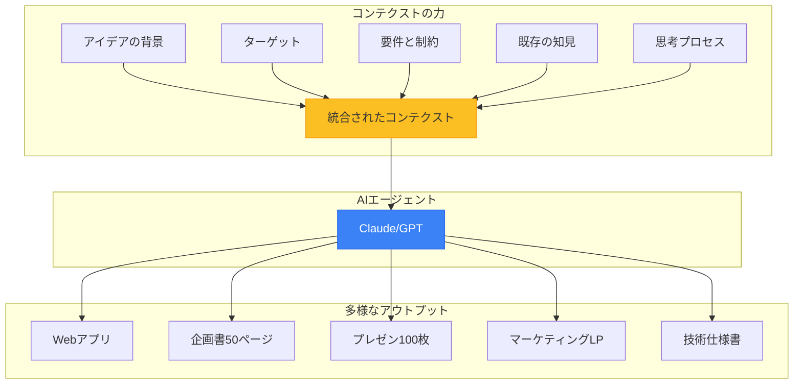

### **重要：すべてが整合性を保って生成される**

同じコンテクストから生成されるため、企画書とアプリとプレゼンの内容が完全に一致。
これまでのように「資料ごとに内容が矛盾する」問題が消滅します。

---

## 💥 アイデアの墓場から、アウトプットの工場へ

### **組織で起きている「アイデアの死」**

私たちの多くは、素晴らしいアイデアが形になる前に消えていく「アイデアの墓場」を経験してきました。

| 段階 | 現象 | 死因 |
|------|------|------|
| **会議** | 「それいいね！」 | → 議事録の1行で終了 |
| **Slack** | 「こんなのあったら...」 | → いいねスタンプで流れる |
| **企画書** | 「検討します」 | → リソース不足で頓挫 |

### **なぜアイデアの99%は形にならないのか？**

> **「誰が作るの？」**
> **「実装リソースが...」**
> **「ドキュメント化する時間が...」**

---

## 🔄 従来との決定的な違い

### **VibeCoderは、この状況を根本から変える新しいアプローチです**

| 項目 | **従来のアウトプット手法** | **VibeCoderのアプローチ** |
|------|------------------------|----------------------|
| **文化** | アイデアの揮発<br/>（「それいいね」で終わる） | 即時アウトプット文化<br/>（「まず作ってみよう」） |
| **障壁** | リソースの壁<br/>（「作る人がいない」） | AIによる価値の多角化<br/>（1アイデア→多成果物） |
| **プロセス** | 専門家への依存<br/>（担当者待ち） | 自律的な高速仮説検証<br/>（自分で即座に実装） |
| **焦点** | 時間とコスト | **ビジネス価値の最大化** |

## **この「アウトプット化の壁」が、今、完全に崩壊しつつある**

---

## 🏭 1つのアイデアから生まれる多様なアウトプット

### **2時間で作れるもの（実例）**

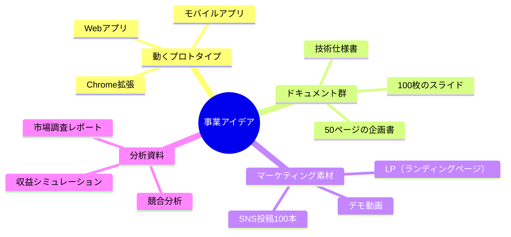

### **重要：これらすべてが同じコンテクストから、整合性を保って生成される**

---

## 🔧 AI協働開発の5ステップワークフロー

### **Vibe Coderの実践的な開発プロセス**

実際にVibe Coderとして開発する際の具体的なワークフローを理解しましょう。

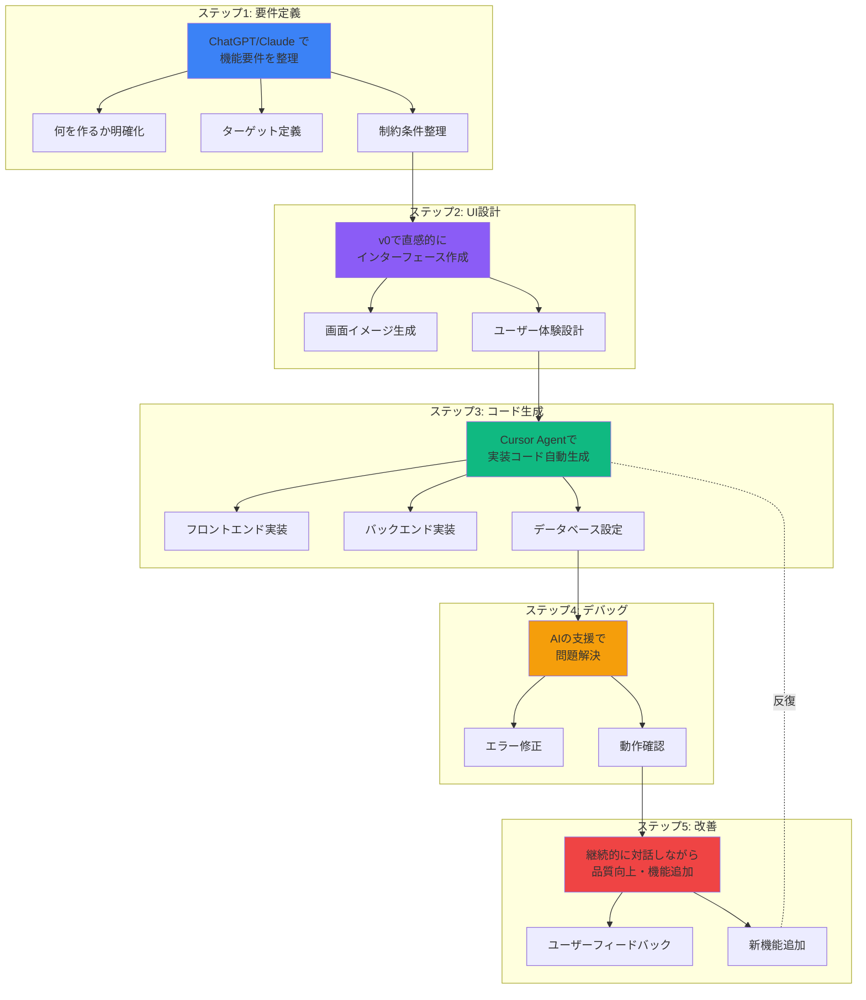

### **各ステップの詳細**

| ステップ | 使用ツール | 所要時間 | 重要なポイント |
|---------|-----------|---------|--------------|
| **1. 要件定義** | ChatGPT/Claude | 30分〜1時間 | コンテクストを明確に |
| **2. UI設計** | v0 | 30分〜1時間 | ユーザー体験を優先 |
| **3. コード生成** | Cursor Agent | 1〜3時間 | AIに任せる勇気 |
| **4. デバッグ** | Cursor/ChatGPT | 1〜2時間 | エラーは学びの機会 |
| **5. 改善** | 全ツール統合 | 継続的 | 小さく速く反復 |

### **重要な心構え**

✅ **完璧を求めない**：まず動くものを作り、改善していく
✅ **AIを信じる**：エラーが出ても、AIが解決策を提示してくれる
✅ **高速反復**：1つの機能に時間をかけすぎず、まず形にする
✅ **コンテクスト重視**：各ステップで「なぜ作るか」を明確に

---

## 🎓 Vibe Coderに必要なスキルセット

### **技術的スキルと非技術的スキルのバランス**

Vibe Coderとして成功するために必要なスキルは、従来のプログラマーとは大きく異なります。
**技術的な深さよりも、幅広い能力とAI活用力が重要**です。

### **技術的スキル（AIがサポートしてくれる）**

| スキル | 必要レベル | AI支援度 | 学習時間 |
|-------|----------|---------|---------|
| **基本的なWeb技術理解**<br/>（HTML、CSS、JavaScript） | 概念理解 | ★★★★★ | 数週間 |
| **AIツールの効果的な使い方**<br/>（Cursor、Claude、ChatGPT） | 実践レベル | ★★★★☆ | 数日〜1週間 |
| **プロンプトエンジニアリング**<br/>（AIへの指示の書き方） | 中級 | ★★★☆☆ | 継続的 |
| **バージョン管理（Git）**<br/>の基本操作 | 基礎のみ | ★★★★☆ | 1〜2週間 |

**重要：** これらは「完璧に理解する」必要はありません。**AIがほとんどをサポート**してくれます。

### **非技術的スキル（あなたの本当の強み）**

| スキル | 重要度 | Vibe Coderでの活用 |
|-------|-------|------------------|
| **論理的思考力** | ★★★★★ | 要件を構造化し、AIに明確に伝える |
| **問題解決能力** | ★★★★★ | エラーの本質を理解し、解決策を導く |
| **コミュニケーション能力** | ★★★★☆ | AIとの対話、ステークホルダーへの説明 |
| **継続的学習への意欲** | ★★★★★ | AI技術の進化に合わせて成長 |
| **ビジネス感覚** | ★★★★☆ | 何を作るべきかの判断 |
| **顧客理解** | ★★★★★ | ユーザーが本当に欲しいものを見抜く |

### **非エンジニアが既に持っているスキルの価値**

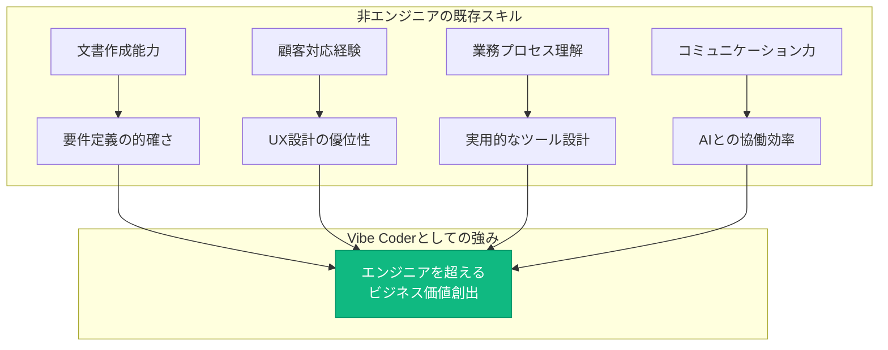

### **心構え：安心してください、AIがサポートします**

**難しそう？ でも安心してください。**

> AIがすべての技術的な詳細をサポートしてくれます。
> だから私たち非エンジニアもVibe Coderになれるんです。

**重要なのは：**
- ✅ 「何を作りたいか」を明確に伝える力
- ✅ 「なぜ作るのか」を理解している
- ✅ 「どう使われるか」をイメージできる
- ✅ 諦めずに試行錯誤する姿勢

---

## 🌟 VibeCoderがもたらす価値：組織OSのアップグレード

VibeCoderが増えることは、単に個人の生産性が上がること以上の意味を持ちます。それは組織全体のOSがアップグレードされることに等しい変革です。

**提供価値：**
- **アウトプット文化への変革**：「できない理由」を探す文化から、「まず10パターン作ってみる」文化へ。
- **意思決定の高速化**：プロトタイプや構造化された文書を元に、具体的で迅速な意思決定が可能になる。
- **イノベーションの加速**：現場の誰もがアイデアを形にできるため、組織の創造性が解放される。
- **圧倒的な競争優位**：コンテクストの質と量が、アウトプットの価値に直結し、他社には真似できないスピードと多様性を生み出す。

---

## 💡 この章のまとめ

- ✅ Vibe Coder = コードで制御される世界を、AIを通じて自在に操る人
- ✅ コンテクストコントロールが本質であり、プログラミングスキルではない
- ✅ 従来のプログラマーとは異なる、アイデアの価値と実装速度を重視
- ✅ AI協働開発の5ステップワークフローで実践的に開発
- ✅ 必要なスキルは非技術的スキルが中心、AIが技術をサポート
- ✅ アイデアの墓場から、アウトプットの工場へ組織を変革

## 🚀 次の章への橋渡し

Vibe Coderの定義と本質を理解しました。
次の第2.5章では、「なぜIDEを学ぶべきなのか」という革命の本質に迫ります。
チャット型AIとIDE型AIの決定的な違いを理解することで、真のアウトプット革命が見えてきます。

---

# 第2.5章：革命の本質 - なぜIDEを学ぶべきなのか

## 🎯 この章で学ぶこと

- チャット型AI（ChatGPT、Claude）とIDE型AI（Cursor、Windsurf）の決定的な違い
- なぜIDE型AIこそが真の革命なのか
- IDEが革命的な3つの理由
- 「午前の会議→午後にプロトタイプ」が現実になるメカニズム

## 📌 この章の位置づけ

多くの人が「AIを使っている」と言いますが、それはチャット型AIに限定されていることがほとんどです。
この章では、**IDE型AIこそが真のアウトプット革命をもたらす**という本質を理解します。
第3章以降の具体的な活用方法の前提となる、最も重要な概念です。

---

## 💬 多くの人が「AIを使っている」と言うが...

### **それは氷山の一角に過ぎない**

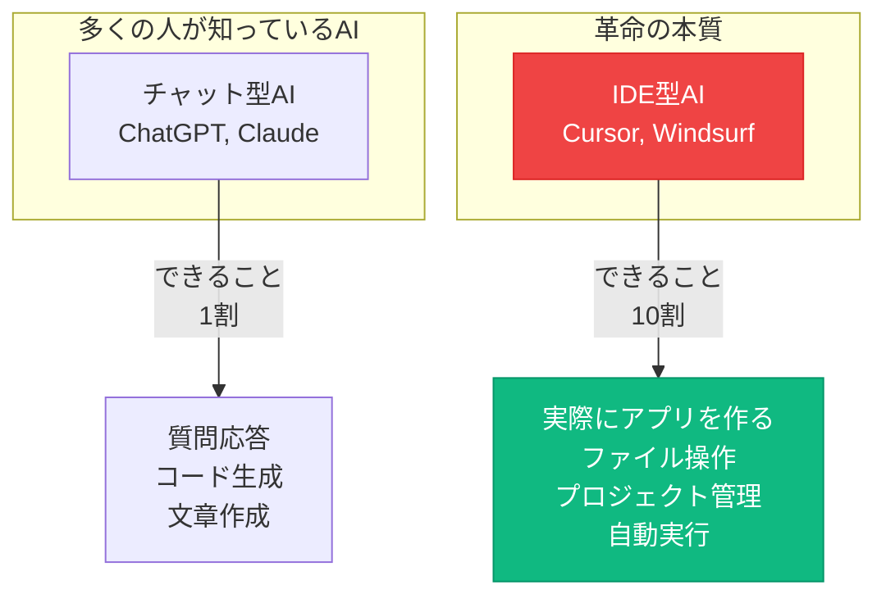

### **ChatGPTを使っているだけでは、本当の革命は起きない**

---

## 🔍 チャット型AIとIDE型AIの決定的な違い

### **比較表：何が違うのか？**

| 項目 | チャット型AI<br/>（ChatGPT, Claude） | IDE型AI<br/>（Cursor, Windsurf） |
|------|----------------------------------|--------------------------------|
| **できること** | 質問応答、コード生成 | **実際にファイルを作成・編集** |
| **作業範囲** | 1つの質問、1つのタスク | **プロジェクト全体を理解** |
| **自動化** | コピペが必要 | **AIがターミナル操作を代行** |
| **コンテクスト** | 会話履歴のみ | **全ファイルを常時参照** |
| **成果物** | テキスト | **動くアプリケーション** |
| **学習曲線** | すぐ使える | 少し学習が必要 |

### **重要な事実**
## **ChatGPT：30分で企画書**
## **Cursor：2時間で動くアプリ**

---

## 🚀 IDEが革命的な3つの理由

### **1️⃣ AIエージェントが代わりに作業する**

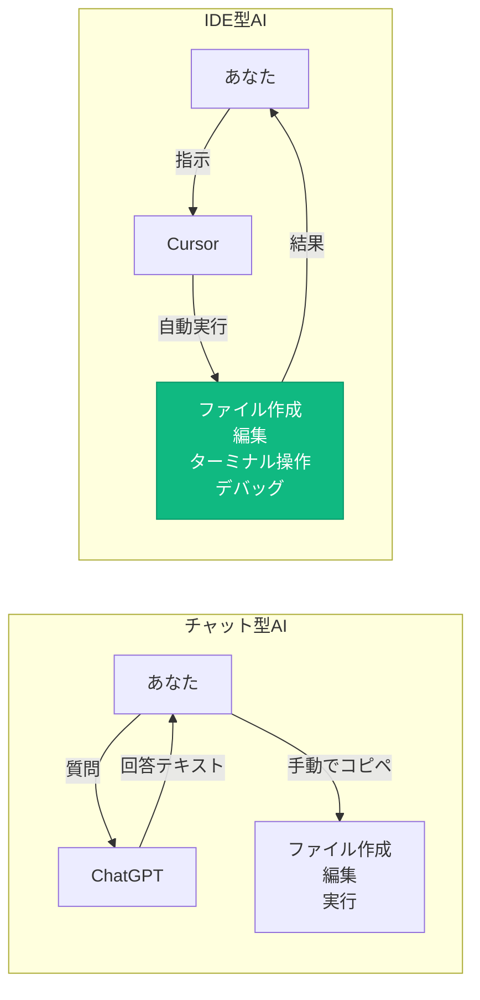

**あなたは指示するだけ。AIエージェントがファイル作成、編集、実行をすべて自動で行う。**

---

## 🧠 2️⃣ プロジェクト全体を理解している

### **チャット型AIの限界**

```
あなた：「この関数を修正して」
ChatGPT：「どの関数ですか？コードを貼り付けてください」
あなた：（コピペ）「これです」
ChatGPT：「修正しました」（修正コードを返す）
あなた：（また手動でコピペ...）
```

### **IDE型AIの革命**

```
あなた：「この関数を修正して」
Cursor：（全ファイルを既に理解している）
         「utils.ts の fetchData 関数ですね。
          他の3箇所でも使われているので、
          影響を考慮して修正します」
         （自動で修正完了）
```

### **プロジェクト全体を「コンテクスト」として理解**
- すべてのファイルを常時参照
- 関数の依存関係を把握
- 整合性のあるコード生成

---

## ⚡ 3️⃣ 「午前の会議→午後にプロトタイプ」が現実に

### **実際の開発フロー比較**

#### **チャット型AIの場合（3日間）**

| 時間 | 作業 | 問題 |
|------|------|------|
| **Day 1** | ChatGPTに相談 | コードをコピペ地獄 |
| **Day 2** | エラーが出る | 何が間違っているか不明 |
| **Day 3** | 修正を繰り返す | 結局動かない... |

#### **IDE型AIの場合（2時間）**

| 時間 | 作業 | 結果 |
|------|------|------|
| **10:00** | 「SNSアプリ作って」 | ✅ プロジェクト作成 |
| **10:30** | 「認証機能追加」 | ✅ 自動実装 |
| **11:00** | 「デザイン修正」 | ✅ 即座に反映 |
| **12:00** | **プロトタイプ完成** | 🎉 **デモ準備完了** |

---

## 🎯 IDEを習得すべき決定的な理由

### **AIツールの進化マップ**

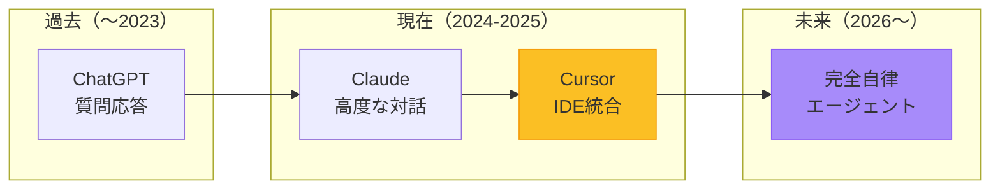

### **重要な事実**

## **IDEを使えるようになることは、未来の完全自律エージェントを使いこなす準備**

---

## 💡 実例：私自身の体験

### **2023年（チャットAIのみ使用）**
- 開発したアプリ数：**10本**
- 1アプリの開発期間：**2週間**
- エラー対応：**苦痛**
- コピペ回数：**無限**
- コード品質：**不安定**

### **2025年（IDE + AIエージェント）**
- 1年で開発したアプリ数：**60本**
- 1アプリの開発期間：**1~3日**
- エラー対応：**AIが自動修正**
- コピペ回数：**ほぼゼロ**
- コード品質：**モデルの進化で向上**

## **6倍の生産性向上、7倍の開発速度、そして品質も向上**

---

## 🎓 本プログラムでの学習内容

### **このブートキャンプで習得するIDE活用スキル**

#### **Week 1-2：IDE基礎**
- Cursorのセットアップ
- AIエージェントとの対話方法
- プロジェクト構造の理解

#### **Week 3-4：実践開発**
- コンテクストを活用した開発
- エラー対応の自動化
- プロトタイプ高速作成

#### **Week 5-6：応用と発表**
- オリジナルSNSアプリ開発
- デプロイとインターネット公開
- 成果発表

### **重要：IDEを学ぶことが、このプログラムの核心**

---

## 🚨 よくある誤解

### **「ChatGPTで十分では？」**

**答え：用途による**

| 用途 | 推奨ツール | 理由 |
|------|-----------|------|
| 質問応答 | ChatGPT | 会話に最適 |
| 文章作成 | Claude | 高度な文章生成 |
| **アプリ開発** | **Cursor** | **実装まで自動化** |
| **業務ツール作成** | **Cursor** | **即座にデプロイ可能** |

### **「学習コストが高そう...」**

**実際：ChatGPTが使えれば、Cursorも使える**
- 基本は同じ「会話」
- ただし、結果が「動くアプリ」になる

---

## 💡 この章のまとめ

- ✅ チャット型AIは氷山の一角、IDE型AIこそが真の革命
- ✅ IDE型AIは「実際にファイルを作る」「プロジェクト全体を理解」「自動実行」
- ✅ 「午前の会議→午後にプロトタイプ」が2時間で実現
- ✅ 講師自身が6倍の生産性向上、7倍の開発速度を体験
- ✅ IDEを学ぶことが、未来の完全自律エージェントへの準備

## 🚀 次の章への橋渡し

IDE型AIの革命的な価値を理解しました。
次の第3章では、Vibe Coderが活躍する「3つの活用領域」を学びます。
Coding（開発）だけでなく、Writing（文章）、Making（制作）すべてに応用できる力を理解していきます。

---

# 第3章：3つの活用領域 - Coding / Writing / Making

## 🎯 この章で学ぶこと

- Vibe Coderが活躍する3つの領域（Coding、Writing、Making）の全体像
- それぞれの領域でAIがもたらす革新的な変化
- 実務での具体的な活用イメージと効果
- 3つの領域を統合することで生まれる価値

## 📌 この章の位置づけ

第2章でVibe Coderの定義と本質を、第2.5章でIDE革命の重要性を理解しました。
この章では、その力を**どこで発揮するか**という実践的な視点に移ります。
Vibe Coderの活躍領域は開発だけではありません。文章作成、資料制作、すべてがAIとの協働で変革されます。

---

## 🌐 Vibe Coderの3つの活用領域

### **全体図：1つのコンテクストから、すべてが生まれる**

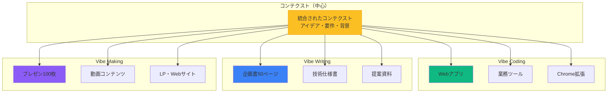

### **重要な原則**

すべてが**同じコンテクスト**から生成されるため：
- ✅ 企画書とアプリの内容が完全に一致
- ✅ プレゼンと仕様書が矛盾しない
- ✅ すべてのアウトプットが整合性を保つ

---

## 💻 1️⃣ Vibe Coding：アイデアを動くアプリに変換

### **できること**

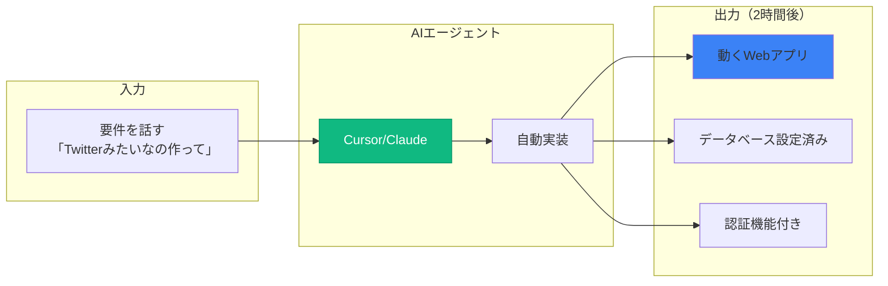

### **従来との比較**

| 項目 | 従来の開発 | Vibe Coding |
|------|-----------|------------|
| **開発期間** | 3〜6ヶ月 | 2時間〜3日 |
| **必要な人材** | 3〜5名のチーム | 1人（あなた） |
| **コスト** | 50万〜200万円 | ツール代月3,000円 |
| **修正速度** | 数週間 | 数分〜数時間 |
| **プロトタイプ** | 困難 | 即座に可能 |

### **実例：私が開発したアプリ**

| アプリ名 | 開発期間 | ビジネス成果 |
|---------|---------|-------------|
| **MENU DB入力システム** | 3日 | エンジニア不在でも基幹システム構築 |
| **Brainwave Analyzer 2** | 1週間 | 月額課金SaaS、継続収益化 |
| **Oh! My Gear** | 2週間 | 初のB2C公開サービス、SNS機能で成長中 |
| **MD Now!** | 2日 | Cursor拡張、開発者コミュニティで話題 |

### **重要な事実**

## **「コードが書けない」は、もはや言い訳にならない時代**

---

## 📝 2️⃣ Vibe Writing：思考を構造化された文書に変換

### **できること**

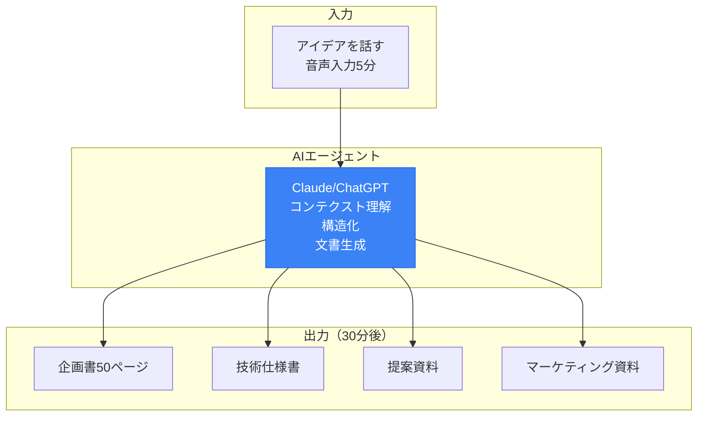

### **従来との違い**

| 項目 | 従来の文書作成 | Vibe Writing |
|------|--------------|-------------|
| **作成時間** | 数日かかる | 30分〜2時間 |
| **品質** | 担当者の力量に依存 | 一貫性のある高品質 |
| **修正** | 大変（構成から見直し） | 即座に反映（指示だけ） |
| **整合性** | 資料ごとにバラバラ | 完全一致 |
| **ボリューム** | 限界がある | 50ページでも100ページでも |

### **実用例：部門別の活用**

| 部門 | 従来の課題 | Vibe Writing解決策 | 時間削減 |
|------|-----------|------------------|---------|
| **営業** | 提案書作成に2日 | 30分で顧客専用カスタマイズ版 | **95%削減** |
| **マーケ** | 記事執筆に1週間 | 1時間で10記事ドラフト | **90%削減** |
| **人事** | 評価レポートに半日 | 10分で全員分の一次ドラフト | **97%削減** |
| **経営** | 事業計画書に1ヶ月 | 1日で詳細版完成 | **95%削減** |

### **革命的な変化**

## **「書く」ではなく「編集する」が仕事になる**

---

## 🎨 3️⃣ Vibe Making：価値を視覚的に伝える資料に変換

### **作れるもの**

| 成果物カテゴリ | 具体例 | 活用ツール | 所要時間 |
|-------------|--------|-----------|---------|
| **プレゼン資料** | 営業資料、研修資料、提案書 | Manus/Genspark | 1〜2時間 |
| **解説動画** | 商品説明、チュートリアル | NotebookLM/Sora2| 2〜3時間 |
| **Webページ** | LP、特設サイト | Cursor/v0/Genspark | 2〜4時間 |
| **SNSコンテンツ** | 投稿文、画像、動画 | nanobanana/Seedream | 30分〜1時間 |

### **実例：この講義資料も**

この講義資料（Markdown形式）も、コンテクストとAIで作成しました。

**作成フロー：**
1. アイデアを音声で5分入力（通勤中）
2. Claudeで構造化（30分）
3. 各章の詳細を順次生成（2時間）
4. 図表とMermaid図を追加（1時間）
5. **合計：約3.5時間で90分講義の資料完成**

### **従来との比較**

| 作業 | 従来 | Vibe Making |
|------|------|------------|
| **プレゼン100枚作成** | 3日間 | 2時間 |
| **動画台本+編集** | 1週間 | 半日 |
| **LP制作** | 外注2週間 | 自分で3時間 |
| **SNS投稿100本** | 不可能 | 1時間 |

---

## 🔗 3つの領域の統合活用

### **実例：新規事業立ち上げフロー**

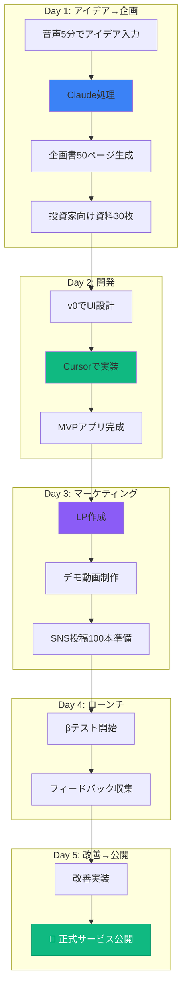

### **たった5日間で、アイデアから公開まで完結**

これは夢物語ではありません。**実際にこのプログラムの修了生が実現している**ペースです。

---

## 💡 組織での活用イメージ

### **各部門での3領域統合活用例**

| 部門 | Vibe Coding | Vibe Writing | Vibe Making |
|------|------------|-------------|------------|
| **営業** | 顧客管理ツール開発 | 提案書自動生成 | プレゼン資料・デモ動画 |
| **マーケ** | LP・キャンペーンサイト | 記事・ブログ量産 | SNS投稿自動化・広告素材 |
| **人事** | 勤怠・評価システム | 評価レポート・研修資料 | 研修スライド・マニュアル |
| **経営** | 経営ダッシュボード | 事業計画書・株主報告 | 株主総会資料・IR資料 |
| **開発** | プロトタイプ高速作成 | 技術仕様書・API文書 | 技術説明資料・デモ |

### **組織全体への影響**

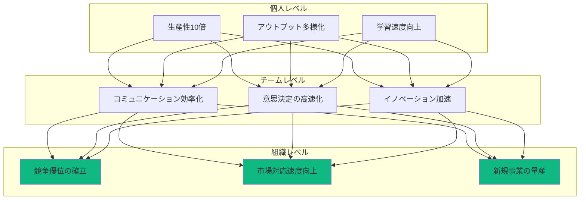

---

## 🔗 まとめ：3つの領域を統合する力

### **Vibe Coderの真価は、統合にある**

- ✅ **Coding**: アイデアを動くアプリに（2時間〜3日）
- ✅ **Writing**: 思考を構造化された文書に（30分〜2時間）
- ✅ **Making**: 価値を視覚的に伝える資料に（1〜3時間）

### **すべてが1つのコンテクストから生まれる**

企画書、アプリ、プレゼン、動画――すべてが同じコンテクストから生成されるため：
- 完全な整合性
- 一貫したメッセージ
- 修正が全体に即反映
- 圧倒的なスピード

## 💡 この章のまとめ

- ✅ Vibe Coderの活躍領域はCoding、Writing、Makingの3つ
- ✅ それぞれの領域で従来比90〜95%の時間削減が可能
- ✅ すべてが1つのコンテクストから整合性を保って生成される
- ✅ 5日間でアイデアから公開まで完結する事例が実在
- ✅ 個人・チーム・組織すべてのレベルで変革をもたらす

## 🚀 次の章への橋渡し

3つの活用領域を理解しました。
次の第4章では、「なぜ非エンジニアこそがVibe Coderとして有利なのか」を深掘りします。
あなたが既に持っている隠れた武器を、AIがどのように100倍に増幅するのかを学んでいきます。

---

# 第4章：非エンジニアの隠れた武器

## 🎯 この章で学ぶこと

- 非エンジニアが直面してきた「3つの壁」とその崩壊
- Vibe Coderが提供する「4つの解決策」
- 非エンジニアが既に持っている「4つの強み」とAIによる増幅効果
- 成功事例：営業・マーケター・企画担当がどう変貌したか

## 📌 この章の位置づけ

第3章で3つの活用領域を学びました。
この章では、**なぜ非エンジニアこそがこの革命の主役なのか**を理解します。
あなたが「自分には無理」と思っていた理由が、実は最大の強みに変わる瞬間を体験してください。

---

## 🚧 非エンジニアが直面する「3つの壁」

### **従来、これらの壁があなたを止めていた**

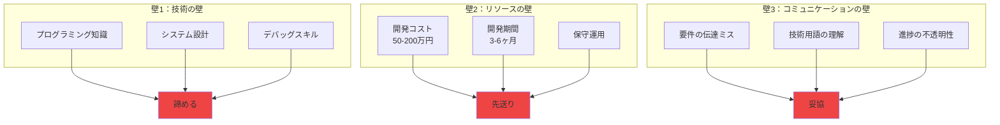

### **結果として起きていたこと**

- 💔 「いいアイデア」が会議で盛り上がって終わり
- 💔 「作りたいもの」がSlackのスタンプで流れていく
- 💔 「必要なツール」が「リソース不足」で頓挫
- 💔 「顧客の声」が「技術的に難しい」で却下

---

## 🎯 Vibe Coderが提供する「4つの解決策」

### **すべての壁を、AIが溶かしていく**

#### **1️⃣ 即座のアイデア実現**

- ✅ 思いついたアイデアをその日のうちに形にできる
- ✅ プロトタイプの作成が数時間で可能
- ✅ 市場の反応を素早く確認できる
- ✅ 失敗しても低コストで次のアイデアに移行

**実践例：**
午前の会議で「顧客からこんな機能が欲しいと言われた」→ 午後にプロトタイプ完成 → その日のうちに顧客にデモ。
試してみてダメならすぐに方向転換――**失敗コストが小さいからこそ、挑戦の回数を増やせる**わけです。

#### **2️⃣ 技術の壁をAIが肩代わり**

- ✅ 複雑なプログラミング知識が不要
- ✅ AIが技術的な詳細を補完
- ✅ 自然言語でのコミュニケーションが中心
- ✅ 学習コストの大幅な削減

**実践例：**
```
あなた：「ユーザーログイン機能が欲しい」
Cursor：「了解しました。認証にはClerkを使いますか？それともSupabase Auth？」
あなた：「おすすめは？」
Cursor：「このプロジェクトならClerkが簡単です。実装します」
（5分後）
Cursor：「Google認証付きログインが完成しました」
```

複雑なフレームワーク設定やライブラリ選定はAIが提案・自動生成します。
あなたは「どんな価値を届けたいか」「ユーザーはどう感じるか」など、**本質的な問いに集中**できます。

#### **3️⃣ コミュニケーションロスの大幅削減**

| 従来の壁 | Vibe Coderの解決策 | 具体例 |
|----------|-------------------|---------|
| **技術の壁** | AIが技術を肩代わり | エラーメッセージをコピペ → 解決策を提示 |
| **リソースの壁** | コスト1/100、期間1/10 | 50万円→5千円、3ヶ月→3日 |
| **コミュニケーションの壁** | 自然言語で直接指示 | 「Twitterみたいなの作って」→ 動くプロトタイプ |

- ✅ 完成イメージを文章でAIに伝え、即座にデモとして確認
- ✅ 要件のズレを早い段階で修正できる
- ✅ AIが生成したコードを見せながらエンジニアと議論
- ✅ 意思疎通が格段にスムーズに

#### **4️⃣ 自走できる改善サイクル**

プロトタイプ → ユーザーテスト → 改善――この迭代を、エンジニアの空き待ちなしで自主的に回せます。
**改善サイクルが短くなるほど学びも速くなり、製品価値は指数関数的に高まります。**

### **革命的な事実**

## **もはや「作れない理由」は存在しない**

---

## 💪 非エンジニアの「4つの強み」をAIが100倍に増幅

### **あなたが既に持っている武器**

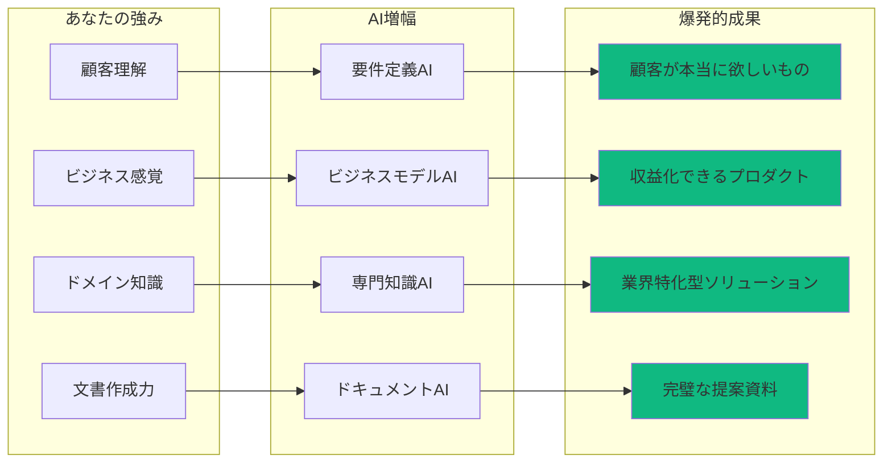

### **1️⃣ 顧客理解 × AI = 本当に欲しいものを作る力**

**あなたの強み：**
- 顧客の声を直接聞いている
- 痛みのポイントを肌で感じている
- 「あったらいいな」がリアルにわかる

**AIとの掛け算：**
```
あなた：「顧客はいつも見積書の作成に時間がかかると言っている」
AI：「見積書自動生成システムを作りましょう。どんな項目が必要ですか？」
あなた：（顧客の声を思い出しながら）「商品名、単価、数量、割引率...」
AI：「了解。では過去のデータから自動入力する機能も追加しますか？」
→ 顧客が本当に欲しかったツールが完成
```

**エンジニアにはない優位性：**
エンジニアは技術は詳しいが、顧客の痛みを直接知らない。
あなたは顧客の声をダイレクトに形にできる。

### **2️⃣ ビジネス感覚 × AI = 収益化できるプロダクト**

**あなたの強み：**
- 「これ売れるか？」の嗅覚
- コスト感覚
- 市場の動向理解

**AIとの掛け算：**
```
あなた：「この機能、月額500円なら100人は使ってくれそう」
AI：「では月額課金の仕組みも実装しましょう。Stripeを使いますか？」
あなた：「それで大丈夫？」
AI：「はい、標準的な決済手段です。実装します」
→ ビジネスモデルまで組み込んだプロダクトが完成
```

**エンジニアにはない優位性：**
技術的には作れても、「誰が買うか」「いくらなら買うか」がわからないエンジニアは多い。
あなたはビジネスの成否を見極められる。

### **3️⃣ ドメイン知識 × AI = 業界特化型ソリューション**

**あなたの強み：**
- 業界の常識・ルール・慣習を知っている
- 専門用語が自然に使える
- 業界特有の課題を理解している

**AIとの掛け算：**
```
あなた（不動産業界）：「重要事項説明書を自動生成したい」
AI：「どんな項目が必要ですか？」
あなた：「物件概要、権利関係、法令上の制限、契約条件...」
AI：「宅建業法に準拠したフォーマットで作成しますね」
→ 業界特化型ツールが完成
```

**エンジニアにはない優位性：**
汎用的なツールは作れても、業界特有のニーズには対応できない。
あなたは「業界の人が本当に欲しいもの」を作れる。

### **4️⃣ 文書作成力 × AI = 完璧な提案資料**

**あなたの強み：**
- 相手に伝わる文章が書ける
- 論理的な構成ができる
- 資料作成の経験が豊富

**AIとの掛け算：**
```
あなた：「このアイデアを投資家向けに50ページの事業計画書にまとめて」
AI：（あなたの過去の文書スタイルを学習）
    「市場分析、競合比較、収益予測、リスク評価を含めた計画書を作成しました」
あなた：（レビューして）「ここの表現をもっとポジティブに」
AI：「修正しました」
→ プロレベルの提案資料が完成
```

**エンジニアにはない優位性：**
技術文書は書けても、ビジネス文書が苦手なエンジニアは多い。
あなたは技術を「売れる言葉」に変換できる。

---

## 🏆 成功事例：非エンジニアの変貌

### **Case 1：営業担当Aさん（30代）**

**Before：**
- 顧客から「こんな機能が欲しい」と言われても、社内に伝えるだけ
- 開発部門は「リソース不足」で対応できず
- 競合に顧客を奪われる

**After（Vibe Coder化）：**
- 顧客の要望をその場でメモ → 帰社後2時間でプロトタイプ作成
- 翌日顧客にデモ → 「これこれ！」と大喜び
- 正式契約 → 年間売上500万円増加

**Aさんのコメント：**
> 「もう『開発部門に聞いてみます』とは言いません。自分で作ります。」

### **Case 2：マーケターBさん（20代）**

**Before：**
- LPを作りたいが、外注すると15万円、納期2週間
- A/Bテストしたいが、都度外注は予算オーバー
- アイデアはあるが形にできない

**After（Vibe Coder化）：**
- v0で30分でLP作成 → Cursorで細部調整1時間
- A/Bテスト用に10パターン作成 → 最適版を発見
- コンバージョン率が従来の3倍に

**Bさんのコメント：**
> 「月100万円の外注費が、月3,000円のツール代になりました。」

### **Case 3：企画担当Cさん（40代）**

**Before：**
- 社内業務改善のアイデアはあるが、稟議を通すのに3ヶ月
- 承認されても開発は半年先
- 完成する頃には状況が変わっている

**After（Vibe Coder化）：**
- アイデアを思いついたその日にプロトタイプ作成
- 部門内で試験運用 → 効果実証
- 稟議は「既に動いているもの」として即承認

**Cさんのコメント：**
> 「許可を取るより、まず作って見せる。承認スピードが10倍になりました。」

---

## 💡 この章のまとめ

- ✅ 非エンジニアが直面してきた3つの壁（技術・リソース・コミュニケーション）は完全に崩壊
- ✅ Vibe Coderは4つの解決策（即座の実現・技術代行・コミュニケーション効率・自走サイクル）を提供
- ✅ 非エンジニアの4つの強み（顧客理解・ビジネス感覚・ドメイン知識・文書作成力）がAIで100倍に増幅
- ✅ 実際の成功事例で、営業・マーケター・企画担当が劇的に変貌
- ✅ もはや「作れない理由」は存在しない

## 🚀 次の章への橋渡し

非エンジニアの隠れた武器を理解しました。
次の第5章では、「AIと共に成長する思考法」を学びます。
AI技術は日々進化します。その進化を自分の力に変える「3つのレンズ」を身につけていきましょう。

---

# 第5章：AIと共に成長する思考法

## 🎯 この章で学ぶこと

- なぜ「追いつく」ではなく「乗りこなす」のか
- AI進化の指数関数的な速度と、人間の線形的な学習の違い
- AI進化を追い風に変える「3つのレンズ」（編集者・ドメイン専門家・実験者）
- 日常に落とし込む4つのプラクティス
- 長期的価値を複利で積み上げる仕組み

## 📌 この章の位置づけ

第4章で非エンジニアの強みを理解しました。
この章では、**AI技術の急速な進化をどう自分の成長に変えるか**という、最も重要なマインドセットを学びます。
AIは日々進化しています。その進化に「追いかけられる」のではなく、「追い風として活用する」思考法を身につけます。

---

## 🚀 序章：なぜ「追いつく」ではなく「乗りこなす」なのか

### **AIの進化速度は、人間の想像を超えている**

2022年にGPT-3.5が登場し、多くの人が「AIがここまで文章を整えるのか」と驚きました。
ところが翌2023年にはGPT-4が、2024年にはGPT-4oが、2025年にはマルチモーダルとリアルタイム推論を標準搭載した**GPT-5系**が当たり前のようにリリースされました。

### **年単位どころか四半期単位で「できること」が書き換わる世界**

```mermaid
graph LR
    subgraph "2022"
        A1[GPT-3.5<br/>テキスト生成]
    end

    subgraph "2023"
        A2[GPT-4<br/>高度な推論]
    end

    subgraph "2024"
        A3[GPT-4o<br/>マルチモーダル]
    end

    subgraph "2025"
        A4[GPT-5系<br/>リアルタイム<br/>動画生成]
    end

    subgraph "2026〜"
        A5[完全自律<br/>エージェント]
    end

    A1 --> A2 --> A3 --> A4 --> A5

    style A4 fill:#fbbf24,stroke:#f59e0b
    style A5 fill:#a78bfa,stroke:#8b5cf6
```

人間が同じスピードで知識を暗記し、技能を習得しようとしても到底追いつきません。

### **ならば発想を転換しよう**

## **AIが伸びる速度を、そのまま自分のアウトプット速度に変換する仕組みを作る**

---

## 📈 第1章：指数関数と線形――二本のグラフが示す現実

### **AI進化の3つの側面**

#### **1️⃣ 演算能力の桁変わり**

- GPUあたりのFLOPS（浮動小数点演算）は18か月で倍増
- 並列推論の最適化により、クラウドAPIの実効価格は**毎年30〜50%下落**
- つまり、**同じ予算で倍の処理が可能**になる

#### **2️⃣ モデルサイズと汎用性のトレードオフ崩壊**

- 10Bパラメータクラスで GPT-3.5 並みの精度
- 100Bクラスで GPT-4 並みの精度を達成
- **小型モデル + 専門LoRA**という分散アーキテクチャが、オンデバイス用途を現実に

#### **3️⃣ 機能の水平拡張**

```mermaid
timeline
    title AI機能の拡張タイムライン
    2022 : テキスト生成
    2023 : 画像生成 : コード生成
    2024 : 動画生成 : 音声合成 : 3Dモデリング
    2025 : リアルタイム推論 : ロボット制御 : 自律エージェント
```

コード生成 → 画像生成 → 3Dモデリング → 動画自動編集 → **ロボット制御**へと、領域間の壁が毎年一枚ずつ剥がれている。

### **重要な気づき**

## **「全てを学びきる」戦略は、もはや不可能**

知識量・機能数・コストが同時に向上・低下していく状況は、経済史的にも珍しい。
そしてこの速度差こそが、「人間が全てを学びきる」という戦略を不可能にしている最大の要因です。

---

## 🔍 第2章：追い風に変える「3つのレンズ」

### **キーワード：編集者・ドメイン専門家・実験者**

AIの伸び幅を自分の成果に変換するには、**3つの役割を日常的に切り替える**ことが重要です。

```mermaid
graph TB
    subgraph "あなたの3つの役割"
        Role1[📝 編集者]
        Role2[🎓 ドメイン専門家]
        Role3[🧪 実験者]
    end

    subgraph "AI"
        AI[AIエージェント]
    end

    subgraph "成果"
        Output[高品質<br/>高速<br/>大量]
    end

    Role1 --> AI
    Role2 --> AI
    Role3 --> AI
    AI --> Output

    style Output fill:#10b981,stroke:#059669,color:#fff
```

---

### **2-1. 編集者のレンズ：AI出力を磨き、文脈に合わせる**

#### **AIの得意技と限界**

- ✅ 大量のドラフトを瞬時に出す（得意）
- ⚠️ そのままではノイズも混ざる（限界）

#### **編集者の仕事**

**「目的・読者・制約」に照らし合わせ、必要な20%を取り出し、不要な80%を捨てる**

#### **実践テクニック：二段階プロンプト**

```
【第1段階】
あなた：「新規事業の企画書を50ページ作って」
AI：（50ページ生成）

【第2段階：編集者モード】
あなた：「投資家向けに絞って、収益モデルとリスク評価を詳細に、
        他の部分は要約で15ページにまとめて」
AI：（最適化版を生成）
```

#### **編集者のチェックリスト**

- ✅ **要素分解**：箇条書きで目的と制約を並べた上で再度プロンプトへ投げ直す
- ✅ **対比確認**：AIが提示した案と、過去の成功パターン・ブランドガイドラインを突き合わせる
- ✅ **20/80ルール**：本当に必要な20%だけを残し、80%を削ぎ落とす勇気

---

### **2-2. ドメイン専門家のレンズ：業界知識を"翻訳キー"にする**

#### **専門知識が威力を発揮する領域**

医療・金融・法務・不動産など、**規制や専門用語が多い領域**では、**人間側の深い知識がAI出力の品質を決定**します。

#### **実践テクニック：3ステップ**

```
【ステップ1：前提共有】
あなた（医療業界）：「医療機器の薬事申請書を作成したい」
AI：「了解。対象はクラスⅠ、Ⅱ、Ⅲのどれですか？」
あなた：「クラスⅡの管理医療機器です」
AI：「PMDAのガイドラインに準拠して作成します」

【ステップ2：用語固定】
あなた：「業界用語リストを読み込んで」
（YAMLやCSVで用語定義をAIに渡す）

【ステップ3：検証ループ】
AI：（初期ドラフト生成）
あなた：（一次資料・法令集と突き合わせ）
      「ここの記載が薬機法第X条に抵触する可能性がある」
AI：「修正します」
```

#### **ドメイン専門家の優位性**

## **AIは汎用的な知識は持っているが、業界特有のニュアンスは人間にしかわからない**

あなたの専門知識が、AIの出力を「使えるレベル」から「プロレベル」に引き上げます。

---

### **2-3. 実験者のレンズ：小さく作り、速く壊す**

#### **AI活用の本質的な価値**

## **試行コストの低減**

従来なら数週間かかった実験が、数時間で完結します。

#### **実践例：高速実験サイクル**

```mermaid
graph LR
    subgraph "従来（3週間）"
        Old1[アイデア] --> Old2[外注見積]
        Old2 --> Old3[発注・開発]
        Old3 --> Old4[納品]
        Old4 --> Old5[テスト]
    end

    subgraph "Vibe Coder（同日）"
        New1[アイデア] --> New2[即実装30分]
        New2 --> New3[公開・テスト]
        New3 --> New4[データ取得]
        New4 -.即改善.-> New2
    end

    style New4 fill:#10b981
```

#### **実験者の活用例**

| 領域 | 従来 | Vibe Coder |
|------|------|-----------|
| **コード** | 1機能に1週間 | 10分で骨格完成 |
| **デザイン** | 3案作成に2日 | 30種類のカラーパレットを自動提案 |
| **コピー** | A/Bテスト用に5案 | CTA文言50本を生成 |

#### **実験者のマインドセット**

- ✅ 完璧を求めない（まず動くものを作る）
- ✅ 失敗を恐れない（コストが小さいから何度でも試せる）
- ✅ データで判断する（感覚ではなく、実測値で最適版を選ぶ）

---

## 🛠️ 第3章：日常に落とし込む4つのプラクティス

### **AIと共に成長するための具体的な習慣**

#### **1️⃣ 毎日30分、何かを自動化する**

```
例：
- 月曜：メール整理をGPTフィルタに置き換える
- 火曜：経費精算書の添付画像をOCR + GPTで項目抽出
- 水曜：会議議事録の自動要約
- 木曜：日報の自動生成
- 金曜：週次レポートの自動作成
```

**効果：**
- 1日30分 × 5日 = 週2.5時間の削減
- 月10時間、年間120時間の時間創出

#### **2️⃣ 週に1つ新機能を試す**

```
Week 1：画像生成モデルの最新版
Week 2：音声クローン
Week 3：RAG（Retrieval-Augmented Generation）
Week 4：動画生成AI
```

**実践方法：**
- 新機能を30分試す
- 3行で所感を記録（何ができた、何が難しかった、次はどう使うか）
- SlackやNotionでチームと共有

#### **3️⃣ 月に1本「公開物」を仕上げる**

```
例：
- 社外ブログ記事
- GitHubリポジトリ
- 簡易SaaSアプリ
- Twitterで技術Tips
```

**なぜ公開が重要か？**
- 「完成物」があると、学習効果が段違いに定着
- フィードバックが得られる
- ポートフォリオになる
- 信頼が積み上がる

#### **4️⃣ 四半期ごとに「手動作業」棚卸し**

```
【チェックリスト】
□ まだExcelで手入力している業務はないか？
□ 毎週同じフォーマットの資料を作っていないか？
□ コピペを繰り返している作業はないか？
□ 「これAIでできそう」と思いながら放置している業務は？
```

**やり方：**
1. リストアップ（15分）
2. AI化の優先順位付け（10分）
3. 週1本ずつ自動化実装（30分/週）

---

## 📈 第4章：長期的価値を複利で積み上げる

### **AI投資の複利効果**

```mermaid
graph TB
    subgraph "Year 1"
        Y1[初期投資<br/>月3,000円 × 12 = 36,000円]
    end

    subgraph "Year 2"
        Y2A[時間削減効果<br/>年間120時間]
        Y2B[スキル蓄積]
        Y2C[成果物増加]
    end

    subgraph "Year 3"
        Y3A[外注費削減<br/>年間50万円]
        Y3B[新規案件獲得<br/>年間100万円]
        Y3C[組織への影響力]
    end

    Y1 --> Y2A & Y2B & Y2C
    Y2A & Y2B & Y2C --> Y3A & Y3B & Y3C

    style Y3A fill:#10b981
    style Y3B fill:#10b981
    style Y3C fill:#10b981
```

### **複利が効く3つのポイント**

#### **1️⃣ 初期投資が雪だるま式に効く**

- AIツール月額数千円 × 1年 = 約5万円
- その知識で外注1本削減、業務を一つ受注すれば**即回収**
- 2年目以降は完全なプラス

#### **2️⃣ 実績 → 信頼 → 機会の連鎖**

```
成果物を作る
  ↓
社内外で評価される
  ↓
相談が増える
  ↓
高難度の課題に触れる
  ↓
さらにスキルアップ
  ↓
（最初に戻る）
```

#### **3️⃣ AIとともに自分も"更新"され続ける**

**重要な事実：**
ツールがアップデートされるたびに、**同じプロンプトでも結果が良くなる**。

つまり：
## **過去の学びが陳腐化せず、むしろ価値が増す**

これは他のスキルにはない、AI時代特有の現象です。

---

## 💡 実例：私自身の体験

### **デザインスキルゼロから、一晩で20種類のキービジュアル生成へ**

**Before（2022年）：**
- デザイナーに発注
- 費用：5万円/1デザイン
- 納期：2週間
- 修正：追加費用

**After（2025年）：**
- Genspark AI Designerで一晩に20種類生成
- 費用：月額3,000円
- 納期：即座
- 修正：無制限・無料

**何が変わったのか？**
私のデザインスキルが劇的に伸びたわけではありません。
**AIの側が伸び、その伸びを"そのまま取り込む癖"をつけた**だけです。

---

## 💡 この章のまとめ

- ✅ AIの進化速度は指数関数的、人間の学習は線形的 → 「追いつく」戦略は不可能
- ✅ 発想を転換：AIの伸びを自分のアウトプット速度に変換する仕組みを作る
- ✅ 3つのレンズ：編集者（磨く）・ドメイン専門家（翻訳）・実験者（試す）
- ✅ 日常の4つのプラクティス：毎日自動化・週1新機能・月1公開・四半期棚卸し
- ✅ 長期的には複利効果で、過去の学びが陳腐化せず価値が増す

## 🚀 次の章への橋渡し

AIと共に成長する思考法を身につけました。
次の第6章では、「投資思考」を学びます。
AIツールへの課金を「コスト」ではなく「投資」として捉え、最大のリターンを得る戦略を理解していきます。

---

# 第6章：投資思考 - AIツールを資産に変える

## 🎯 この章で学ぶこと

- AIへの課金を「経費」ではなく「資産形成」と捉える視点
- 無料ツールと有料ツールの決定的な違い（「試食」と「食事」の比喩）
- 投資判断フレームワークと「3ヶ月ルール」
- 投資効果を最大化する習慣
- よくある誤解と落とし穴

## 📌 この章の位置づけ

第5章でAIと共に成長する思考法を学びました。
この章では、その成長を加速させるための**投資思考**を身につけます。
月数千円の課金が、なぜ年間数百万円の価値を生むのか。その仕組みを理解します。

---

## 💰 序章：コストか？投資か？

### **問いかけ**

## **月3,000円の課金が、月30万円ぶんの仕事を肩代わりする――これを「コスト」と呼ぶべきか、「投資」と呼ぶべきか？**

### **結論**

**迷うくらいなら、ノールックで課金し、その"回収方法"を後から設計したほうが早い。**

なぜなら、**AIツールは使って初めて価値を語れる**からです。

---

## 🔄 第1章：投資とコストの境目を溶かす

### **1-1. 時間の買い取り**

#### **時間価値の計算**

```
あなたの時給 = 3,000円 と仮定

【Before AI】
- リサーチ：1時間
- 企画書作成：3時間
- 合計：4時間 = 12,000円相当

【After AI】
- リサーチ：5分
- 企画書作成：30分
- 合計：35分 = 約1,750円相当

削減：10,250円 / 1タスク
```

**月20タスクなら：**
10,250円 × 20 = **205,000円相当の時間を創出**

**AI課金：月3,000円**

**純利益：202,000円 / 月**

### **1-2. 打てる手札が増える**

AIは「効率化ツール」に留まりません。

| できること | 従来の方法 | コスト | Vibe Coder | コスト |
|----------|-----------|--------|-----------|--------|
| **画像生成** | デザイナー外注 | 5万円/1点 | Midjourney | 月3,000円（無制限） |
| **動画制作** | 制作会社 | 30万円/1本 | Sora + 編集AI | 月2,000円 |
| **Webアプリ** | 開発会社 | 100万円 | Cursor | 月2,000円 |
| **コピーライティング** | ライター | 5万円/記事 | Claude | 月2,000円（無制限） |

**従来なら別々の専門家を雇うしかなかった領域が、あなた一人で試せる**ようになります。

### **1-3. 評価と信用の上昇**

アウトプットが増えれば「できる人」という評判がつき、相談や案件が舞い込む好循環が始まります。

これは金額換算しづらい無形資産ですが、**キャリアの長期価値を左右**します。

---

## 🍴 第2章：無料 vs 有料 ――「試食」と「食事」の違い

### **完璧な比喩**

```mermaid
graph LR
    subgraph "無料版 = 試食コーナー"
        Free1[列に並ぶ]
        Free2[小さい皿]
        Free3[回数制限]
        Free4[途中で打ち切り]
    end

    subgraph "有料版 = レストランのテーブル"
        Paid1[席料を払う]
        Paid2[フルコース]
        Paid3[途切れない]
        Paid4[新作メニュー優先提供]
    end

    Free4 -.断続的な学習.-> Result1[腹落ちしない]
    Paid4 -.連続的な学習.-> Result2[深い理解]

    style Result1 fill:#ef4444
    style Result2 fill:#10b981,stroke:#059669,color:#fff
```

### **無料版の限界**

- ⚠️ 利用回数制限（ChatGPT: 1日数回、Claude: 50メッセージ/日）
- ⚠️ 処理待ち時間が長い
- ⚠️ 最新機能にアクセスできない
- ⚠️ 学習リズムが断続的になる

### **有料版の価値**

- ✅ 無制限（または大幅に緩和された制限）
- ✅ 優先処理（待ち時間ほぼゼロ）
- ✅ 最新機能への即アクセス
- ✅ 集中が切れず、学びと実践のループが連続的に回せる

### **判断基準**

> **週に3回以上ツールを開く → 迷わず課金**
>
> **月1回以下しか触れない → まず習慣化してから課金**

---

## 📊 第3章：投資判断フレームワーク

### **3ステップ判断法**

#### **ステップ1：見えるリターンを数値化**

```
【計算式】
時間節約 × 自分の時給 = A
外注費削減見込み = B
新規売上のシナリオ = C

合計リターン = A + B + C
```

**例：**
```
A: 月20時間削減 × 3,000円 = 60,000円
B: デザイン外注削減 月2回 × 50,000円 = 100,000円
C: 新規案件獲得 月1本 × 300,000円 = 300,000円

合計：460,000円/月

投資：10,000円/月（複数ツール）

ROI：4,600% 🚀
```

#### **ステップ2：見えないリターンを言語化**

数値化できないが重要な価値：

- ✅ **評判・信用**：「できる人」として認識される
- ✅ **学習速度**：新しいスキルを高速で習得
- ✅ **モチベーション維持**：成果が出るから続けられる
- ✅ **選択肢の拡大**：やりたいことが実現可能になる

#### **ステップ3：3ヶ月ルール**

```
まず3ヶ月使い倒す
  ↓
成果を棚卸し
  ↓
黒字なら継続
  ↓
赤字なら解約 or 他ツールへ乗換
```

**重要：年間一括払いは避ける**
- 先払いすると安心して触らなくなる
- 月額で「使わなければ損」という小さな圧を残す

---

## 🛠️ 第4章：投資効果を最大化する習慣

### **4つの習慣**

#### **1️⃣ 毎日使う**

- 1日10分でもいいので実務に組み込む
- 使わない日が3日続いたら、使い方を見直す

#### **2️⃣ 新機能即試し**

- リリースノートをチェック
- 翌日には触る
- 「いつか試そう」は「永遠に試さない」と同義

#### **3️⃣ 学びを公開**

- X（旧Twitter）や社内Slackで「気づき」をメモ
- アウトプットがさらなる学習を呼ぶ
- 他人に教えることで理解が深まる

#### **4️⃣ 費用対効果を測る**

**月末チェックリスト：**
```
□ 今月削減できた時間：___時間
□ 作成した成果物の数：___個
□ 外注せずに済んだ金額：___円
□ 新たに獲得した案件：___件
□ 合計価値：___円

投資：___円
ROI：___%
```

---

## ⚠️ 第5章：よくある誤解と落とし穴

### **誤解1：「無料で十分」は入り口の錯覚**

試食でお腹は満たせません。
学習密度が薄くなるぶん、結局遠回り。

**真実：**
有料版の方が**総コストは安い**（時間コスト含む）

### **誤解2：年間課金で「置物」化**

年間一括払いすると：
- ✅ 支払い済み → 安心
- ⚠️ 安心 → 使わなくなる
- ❌ 結果：1年後に後悔

**推奨：**
まずは月額で「使わなければ損」という小さな圧を残す

### **誤解3：ツール依存で目的を見失う**

手段が目的化しないよう、**「何を作りたいか」を先に紙に書く**

```
悪い例：
「Cursorを使いたい」→ 目的不明で挫折

良い例：
「顧客管理ツールを作りたい」→ そのためにCursorを使う
```

---

## 💡 結語：迷う時間こそ最大のコスト

### **事実**

AIツールへの課金で悩む1週間は、**学びと成果を1週間遅らせます**。

### **解決策**

**試して合わなければ解約すればいいだけ。**

躊躇の背後にあるのは「元を取れるか？」という不安ですが、
その答えは**"使い方次第"でしか得られません**。

### **行動指針**

## **まず席を確保し、使い倒し、数字で振り返る。**

このサイクルを回す限り、支払った月額は**「未来の売上と時間」に姿を変えて戻ってきます**。

---

## 💡 この章のまとめ

- ✅ AIへの課金は「コスト」ではなく「投資」である
- ✅ 無料版は「試食」、有料版は「食事」――学習密度が全く違う
- ✅ 投資判断は「見えるリターン数値化」+「見えないリターン言語化」+「3ヶ月ルール」
- ✅ 投資効果を最大化する4つの習慣：毎日使う・新機能即試し・学びを公開・費用対効果測定
- ✅ よくある誤解を避ける：無料で十分・年間一括・ツール依存
- ✅ 迷う時間こそが最大のコスト

## 🚀 次の章への橋渡し

投資思考を身につけました。
次の第7章では、「AIの技術進歩への期待」を学びます。
今できないことも、来年には当たり前になる――その未来を先読みし、今から準備を進める力を理解していきます。

---

# 第7章：未来への期待 - 不満は伸びしろの裏返し

## 🎯 この章で学ぶこと

- 「今できないこと」が「来年の当たり前」になる加速度的進化
- 現在の不満や制限が、実は最速で改善される領域である理由
- 技術進歩を先取りする思考法
- 早期学習者が得る複利メリット
- 具体的な進化が期待される5つの分野

## 📌 この章の位置づけ

第6章で投資思考を身につけました。
この章は、第一回講義の最後の章として、**未来への期待と希望**を語ります。
今日感じている不満や限界は、近い未来には解決されている――その確信を持って学び続ける力を得ます。

---

## 🌟 序章：不満は「伸びしろ」の裏返し

### **重要な視点転換**

## **「いま不可能でも、来年は当たり前になる」――AIの世界では、未来が現在へと前倒しで押し寄せてきます。**

私たちは、現状の欠点に落胆するより、**「来年やってくる可能性」に賭け、学びを前倒しで仕込んでおく**必要があります。

### **体験からの確信**

ChatGPTに「まだ間違いが多い」と感じた人も、Midjourneyの細部が崩れるのにがっかりした人も、
その**不満は一年どころか半年で解消される**経験をしたはずです。

**AI技術の改良曲線は、私たちの違和感を燃料に伸び続ける**――それがここ5年で繰り返し証明されてきました。

---

## 📊 第1章：改善スピードを肌で感じる

### **1-1. 指数関数の体感値**

```mermaid
graph LR
    subgraph "モデル進化"
        M1[GPT-1<br/>2018] --> M2[GPT-2<br/>2019]
        M2 --> M3[GPT-3<br/>2020]
        M3 --> M4[GPT-3.5<br/>2022]
        M4 --> M5[GPT-4<br/>2023]
        M5 --> M6[GPT-4o<br/>2024]
        M6 --> M7[GPT-5<br/>2025]
    end

    style M7 fill:#10b981,stroke:#059669,color:#fff
```

**数値で見る進化：**
- **モデル精度**：パラメータ10倍で性能1.8倍 → 量産＆最適化が追いつき**年2回のメジャーアップデート**
- **推論コスト**：2022年比で2025年は**1/20**。API料金も半減ペース
- **処理速度**：入力待ち時間が 3秒 → 1秒 → 200ミリ秒へ

### **1-2. 身近な例で理解する**

**スマートフォンの進化（2007年→2024年）よりもさらに速い**

| 年 | スマホ | AI |
|---|------|-----|
| **2007/2022** | 初代iPhone | GPT-3.5登場 |
| **2010/2023** | iPhone 4（カメラ向上） | GPT-4（推論能力向上） |
| **2024/2025** | iPhone 15 Pro（15世代目） | GPT-5（3世代で到達） |

**重要な気づき：**
1年前の最高性能が、今では**無料で使えるレベル**に。

### **1-3. 投資規模が裏付ける加速**

- 世界のAI R&D投資：年**3兆円超**
- 大企業1社で**数千億円**の研究開発費
- オープンソースLLMの「協業競争」が刷新サイクルを押し上げる

---

## 🚀 第2章：「いま足りない」は「明日強くなる」テーマ

### **現在の課題と進歩の兆し**

| 現在の課題 | 進歩の兆し | 期待される姿（1〜2年） |
|----------|----------|---------------------|
| **回答の誤り** | RAG/検索連携の標準化 | **ファクトエラー1桁%台**、引用付き回答がデフォルト |
| **行間が読めない** | 長コンテキスト & agent memory | プロジェクトの経緯を「覚えている」AI |
| **専門性が浅い** | 小型LoRA + 専門DB | **業界別「社内GPT」**がSaaSとして普及 |
| **操作が難しい** | ノーコード連携UI | クリックと音声だけでワークフロー自動化 |

### **重要な逆説**

## **自分が不満を感じた領域こそ、最速で改善される余地が大きい**

痛みを感じた場所をメモし、半年後に同じプロンプトで再テストしてみてください。
ほとんどの場合、**差分の大きさに驚くはずです**。

---

## 💡 第3章：技術進歩を先取りする三段ロケット

### **3-1. 観測**

- リリースノート・研究ブログを「読む」だけでなく **「試す」カレンダー**に登録
- 社内外のSlack / Discordで新機能スクリーンショットが流れたら、**その日にデモを走らせてみる**

### **3-2. 翻訳**

- 新しいAPIや関数を **「自分の課題」に書き換える**
- 例：RAGが出た → 「社内ドキュメント検索」を30行のYAMLで試作

### **3-3. 拡張**

- 成功した試作を **「汎用テンプレ」に抽象化**し、次の案件に即転用
- テンプレはGitHub/Gistで公開し、外部の改良を取り込む

---

## 🌱 第4章：早期学習者が得る複利メリット

### **3つの複利効果**

#### **1️⃣ 学習曲線の先行取り**

一度習熟した基本操作は、後発機能でもほぼ共通。
**早く始めるほど、新機能への適応が速くなる。**

#### **2️⃣ コミュニティの中心化**

先に成果を出すと質問される立場になり、情報が自動で集まる。

```mermaid
graph TB
    Start[早期に学習開始]
    Start --> Output[成果物公開]
    Output --> Question[質問が来る]
    Question --> Answer[回答する]
    Answer --> Learn[さらに学ぶ]
    Learn --> Output

    style Start fill:#fbbf24,stroke:#f59e0b
    style Learn fill:#10b981,stroke:#059669,color:#fff
```

#### **3️⃣ ポートフォリオ効果**

改善前夜に作った作品をアップデートすれば、**成長比較がそのまま成果物になる。**

**ポイント：**
## **「早い段階で恥をかく」ほど、後の伸びが鮮明に可視化される。**

---

## 🔮 第5章：期待が現実になる具体分野

### **5-1. 開発フロー**

**期待される未来（2026〜2027年）**
- コード生成精度：**95%超**
- **「読んで手直し」が主流**（書くのではなくレビューする）
- テストコード・CI設定自動化 → バグ検出前倒し
- **アイデアを話すだけでアプリ完成**

### **5-2. クリエイティブ**

**期待される未来**
- デザイン提案**1,000案を1分で生成**
- 動画・3Dアセット自動生成 → **ゲームやXRで個人製作が当たり前に**
- **頭の中のイメージを即座に画像化・動画化**

### **5-3. ビジネスインテリジェンス**

**期待される未来**
- 決算書読解 → KPI予測 → スライド化を**ワンコマンド**
- マーケティングAIが「次週の勝ち筋」を提案、**クリックで施策実行**
- **市場調査から事業計画まで自動作成**

### **5-4. 教育とスキルアップ**

**期待される未来**
- 個別弱点を**リアルタイム解析** → 即時補強問題を自動出題
- AIメンターが**キャリア相談〜面接練習まで伴走**
- **あなたの理解度に合わせた説明**

---

## 💡 結語：風向きは変えられないが、帆の張り方は変えられる

AIの進歩を「脅威」と見るか「追い風」と見るかは、**完全に私たちの選択に委ねられています。**

明日届くアップデートをただ待つのではなく、**今日の手元のAIで何ができるかを試し、明日の自分の底力を一段上げておく。**

それこそが、Vibe Coderが体現する **「AIの成長を自分の成長に結びつける」最短ルート**です。

---

## 💡 この章のまとめ

- ✅ 「いま不可能」でも「来年は当たり前」――AIの改善スピードは予想を超える
- ✅ 現在の制限や不満は一時的で、多くの問題は近い将来に解決される
- ✅ 不満を感じた領域こそ、最速で改善される余地が大きい
- ✅ 早期学習者が得る複利メリット：学習曲線の先行取り・コミュニティ中心化・ポートフォリオ効果
- ✅ 具体的な進化期待分野：開発・クリエイティブ・BI・教育
- ✅ 「未来が来るまで」ではなく「未来を迎え撃つ」準備を整える

---

# 全体のまとめ：今日から始まる、あなたの変革

## 🎯 第一回講義で学んだこと

### **全7章の要点**

1. **イントロダクション**：世界の革命、講師の体験、あなたにもできる
2. **Vibe Coderとは**：コンテクストコントロールの本質
3. **3つの活用領域**：Coding / Writing / Making
4. **非エンジニアの武器**：4つの強みがAIで100倍に
5. **成長する思考法**：3つのレンズと4つのプラクティス
6. **投資思考**：コストではなく投資として捉える
7. **未来への期待**：不満は伸びしろの裏返し

---

## 🚀 今日から始めるアクションプラン

### **Step 1：今日中に決める（30分）**

最低限必要なツール：
- **ChatGPT Plus** または **Claude Pro**：月額$20
- **Cursor Pro**：月額$20

**合計：月額約6,000円の投資**

### **Step 2：明日までに始める（2時間）**

1. 環境構築
2. 簡単なプロジェクトを作成
3. 最初の成功体験を作る

### **Step 3：1週間で習慣化（毎日30分）**

- 毎朝30分：AI と対話しながら実装
- 毎晩10分：学びを3行メモ＋共有

### **Step 4：1ヶ月で成果を出す**

- Week 1：簡単なアプリ1本
- Week 2：実務で使えるツール1本
- Week 3：公開できるレベルのアプリ1本
- Week 4：振り返りと次の計画

---

## 💬 最後に：あなたへのメッセージ

### **2022年12月、私もまったくコードが書けませんでした。**

でも、**「作りたい」という情熱だけはありました。**

### **そして2025年の今、80本のアプリを開発し、ビジネスで成果を出しています。**

**特別な才能を得たわけではありません。**
**ただ、AIという強力なパートナーを得て、「始めた」だけです。**

---

## 🎯 あなたに伝えたい3つのメッセージ

### **1️⃣ 「特別な才能」は不要です**

必要なのは：
- 作りたいという情熱
- 諦めずに試行錯誤する姿勢
- AIとの協働スキル

### **2️⃣ 「遅すぎる」ことはありません**

- 今日始めれば、明日には最初のアプリが動く
- 1週間続ければ、習慣になる
- 1ヶ月続ければ、実用的なツールが作れる
- 6ヶ月続ければ、人生が変わる

### **3️⃣ 「あなたにもできる」**

**この講義を受けている、まさに今この瞬間が、あなたの人生の転換点です。**

---

## 🌟 第一回講義の締めくくり

### **今日、あなたは新しい人類(Vibe Coder)になる第一歩を踏み出しました。**

- ✅ マインドセットの変革：「できない」から「まず作ってみる」へ
- ✅ 価値観の革命：「コスト」から「投資」へ
- ✅ 行動の革命：「アイデアの墓場」から「アウトプットの工場」へ

### **次回（第二回）予告**

- LLMの基礎理解
- AI駆動要件定義の実践
- Cursor環境構築
- 技術スタックの選定

### **宿題**

次回までに：
1. ChatGPT Plus または Claude Pro に課金
2. Cursor をインストール
3. 簡単なアプリを1本作ってみる
4. 作りたいオリジナルSNSのアイデアを考える

---

## 🎉 おめでとうございます！

**第一回講義「オリエンテーションとマインドセット変革」完了です！**

あなたは今、**Vibe Coder への道を歩み始めました。**

**さあ、一緒に未来を創りましょう。**

## **"今日から、あなたは新しい人類(Vibe Coder)です"**

---

**次回講義でお会いしましょう！**
