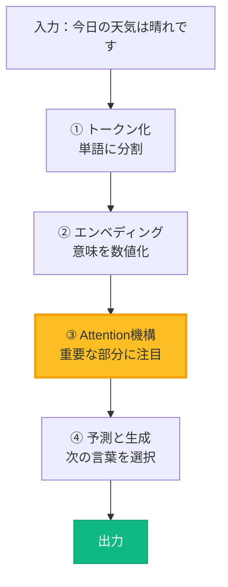
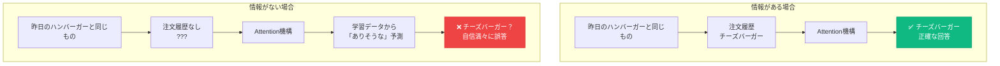
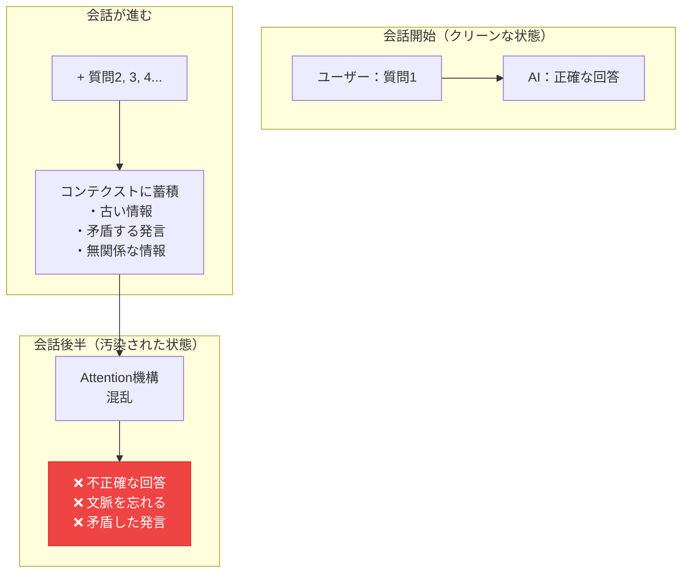
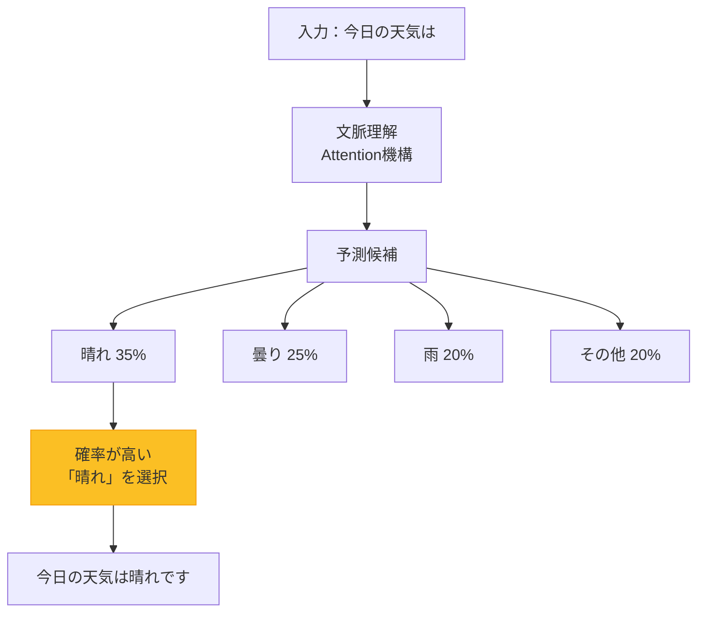
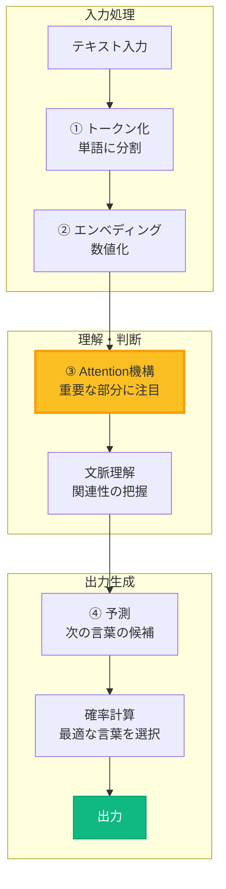
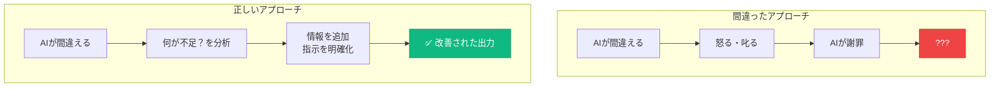
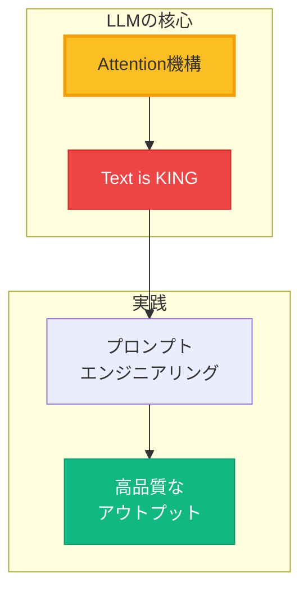

# 第一回講義 Part 2: ビジネス活用事例とLLM基礎

> **Part 1からの継続**：マインドセット変革を完了したあなたは、今度は「実際にどう使われているか」を知り、Vibe Coderの「武器」であるLLMの仕組みを理解していきます。

---

## 🎯 Part 2の学習目標

このPartを終えると、以下ができるようになります：

✅ AI駆動開発の実践事例を通じて、具体的なイメージを持てる
✅ 意思決定の高速化と経営シミュレーションの実例を知る
✅ LLMの本質と動作原理を理解する
✅ Attention機構の役割を説明できる
✅ ハルシネーションとコンテクスト汚染を防げる
✅ 効果的なプロンプトを設計できる
✅ 音声入力で思考速度のアウトプットができる

**重要な理解**：
> 💡 **「理論」だけでなく「実例」を知ることで、自分の現場に応用できる。**
>
> 泉水が実際に現場で使った事例を知ることで、
> 「自分の組織でもできる」という確信が生まれる。

---

## 📚 本パートのアジェンダ

### **第0章: AI駆動開発の実践事例** (15分) ⭐ NEW
- 泉水の現場から：意思決定の高速化事例
- ゲーミフィケーション概念の共有を2時間で
- 経営シミュレーションツールで変数を可視化
- 大手・中小企業の成功パターン

### **第1章: LLMとは？ - 大規模言語モデルの理解** (10分)
- LLMの本質：予測マシン
- 3つの比喩：司書・インターン・自動補完
- LLMの4つの特徴

### **第2章: LLMの「理解」の仕組み** (20分)
- テキスト処理の4ステップ
- Attention機構の本質
- ハルシネーション（幻覚）のメカニズム
- コンテクストウィンドウとコンテクスト汚染

### **第3章: Text is KING - プロンプトエンジニアリング** (30分)
- 基本の4原則（役割・文脈・明確性・段階的）
- 高度なテクニック（Few-shot・Chain of Thought）
- 実践的なプロンプト設計

### **第4章: 音声入力の活用** (5分)
- 思考速度でのアウトプット
- 推奨ツールと実践例

---

## 第0章　AI駆動開発の実践事例

## 🎯 この章で学ぶこと

- 泉水が実際の現場で行った「意思決定の高速化」事例
- 午前の会議から午後にはプロトタイプが完成する開発速度
- 経営シミュレーションツールによるビジネスモデル設計
- 大手企業・中小企業の成功パターン

## 📌 この章の位置づけ

Part 1で「なぜ Vibe Coder なのか」を理解しました。
この章では、**実際にどう使われているか**を具体的な事例で学びます。
「自分の組織でも使える」というイメージを持つことが目標です。

---

### 💼 泉水の現場事例：意思決定を2時間で加速させる

#### **事例1: ゲーミフィケーション概念の共有**

**背景**：
```
午前の経営会議で「ゲーミフィケーションに取り組むべきか？」という議論が発生。

メンバーそれぞれが思い浮かべる「ゲーミフィケーション」のイメージがバラバラで、
議論が噛み合わない状態に。

「ポイント制度？」「ランキング？」「バッジ？」「レベルアップ？」
具体例がないと、議論が進まない...
```

**従来の対応（想定）**：
```
1. 調査レポート作成を依頼 → 2週間待つ
2. 外部コンサルに依頼 → 50万円 + 1ヶ月
3. 先送り → 「次回の会議で」→ 結局やらない
```

**泉水の対応（AI駆動）**：
```
午前11時：会議終了
　↓
11時30分：Cursorで複数のゲームプロトタイプ作成開始
　- ポイント制度型
　- ランキング型
　- バッジ・実績型
　- レベルアップ型
　- クエスト型
　↓
午後2時：5つのプロトタイプ完成
　↓
午後3時：Slackで共有 → 全員が触れる
　↓
午後4時：「これはレベルアップ型がいい！」と即決
```

**成果**：
- ⏱️ **意思決定時間**：2週間 or 1ヶ月 → **5時間**
- 💰 **コスト**：50万円 → **ほぼ0円**
- 🎯 **効果**：全員が同じイメージを共有、即座に意思決定

**重要なポイント**：
> 💡 **「言葉で説明」するより「触れるプロトタイプ」を見せる方が100倍速い**
>
> 会議で30分議論するより、5分触れるプロトタイプを作る方が早い。
> これがAI駆動開発の真価。

---

#### **事例2: 経営シミュレーションツールで変数を可視化**

**背景**：
```
新規事業の収益モデル設計中。

「顧客単価を上げるべきか、顧客数を増やすべきか？」
「マーケティング予算をどう配分すべきか？」
「損益分岐点はどこか？」

Excelで試算するも、変数が多すぎて直感的に理解できない。
経営陣が数字に弱いメンバーもいて、説明が難航...
```

**泉水の対応（AI駆動）**：
```
午前中：経営会議でビジネスモデルを議論
　↓
昼休み：Cursorで経営シミュレーションツール作成
　- スライダーで変数を変更（顧客単価、顧客数、コスト等）
　- リアルタイムで収益グラフが変化
　- 損益分岐点が視覚的に分かる
　- 最悪・標準・最良シナリオを切り替え可能
　↓
午後：経営会議で実演
　「顧客単価を10%上げると...」→ スライダー動かす → グラフ変化
　「マーケティング予算を2倍にすると...」→ スライダー動かす → 損益分岐点が前倒し
　↓
その場で意思決定：「まず顧客単価を上げる戦略でいこう」
```

**成果**：
- 📊 **視覚化**：複雑なビジネスモデルが一目で理解できる
- ⚡ **即座にシミュレーション**：「もしこうしたら？」を1秒で検証
- 🎯 **合意形成**：全員が同じ画面を見て、納得した意思決定

**ツールの仕様**：
```typescript
// 主要な変数
- 顧客単価（Customer LTV）
- 新規顧客獲得数/月（CAC効率）
- チャーン率（解約率）
- マーケティング予算
- 固定費・変動費

// リアルタイム計算
→ 月次収益・年次収益
→ 損益分岐点（何ヶ月後？）
→ キャッシュフロー
→ ROI（投資対効果）

// 視覚化
→ 折れ線グラフ（収益推移）
→ 棒グラフ（コスト構造）
→ 円グラフ（収益内訳）
```

**作成時間**：約2時間

**重要なポイント**：
> 💡 **「静的な資料」より「動くシミュレーション」が意思決定を加速させる**
>
> PowerPointで説明するより、スライダーを動かして「見せる」方が早い。
> 経営層が自分で触って試せることが、納得感を生む。

---

### 🏢 大手企業の成功事例

#### **パナソニックコネクト株式会社**

**取り組み**：
- 1日5,000回のAI利用
- 全社員がChatGPTやGitHub Copilotを活用

**成果**：
- 業務効率30%向上
- コード生成時間80%削減
- ドキュメント作成時間70%削減

**学び**：
> 「全社員に使わせる」という強いコミットメントが成功の鍵

---

#### **セブン‐イレブン・ジャパン**

**取り組み**：
- 商品企画プロセスにAI活用
- トレンド分析、顧客ニーズ予測

**成果**：
- 商品企画期間を**10分の1に短縮**（3ヶ月 → 10日）
- 市場投入スピードの劇的向上

**学び**：
> AIは「作業の効率化」だけでなく「スピードそのもの」を変える

---

#### **ヤフー株式会社**

**取り組み**：
- 全社員11,000人にAI利用を義務化
- 独自AIアシスタント「LLM GARDEN」開発

**成果**：
- 社内の知識共有が加速
- 新規事業アイデアの創出件数が増加

**学び**：
> 「義務化」することで、最初は抵抗があっても慣れれば必須ツールに

---

#### **三菱UFJ銀行**

**取り組み**：
- 行員8,000人がCopilot for Microsoft 365活用
- Excel、Word、PowerPointの作業を自動化

**成果**：
- 資料作成時間60%削減
- 顧客対応時間が増加

**学び**：
> 既存ツール（Microsoft 365）にAIを統合することで、学習コストを最小化

---

### 🏪 中小企業の成功パターン

#### **製造業A社（従業員200名）**

**取り組み**：
- AI画像認識で品質検査を自動化
- 不良品検出システムをCursorで開発

**成果**：
- 不良率70%削減
- 検査時間90%削減
- 年間コスト削減：約500万円

**開発期間**：2週間（外注なら3ヶ月 + 300万円）

**学び**：
> 中小企業こそ、AI駆動開発で大企業との差を埋められる

---

#### **商社B社（従業員50名）**

**取り組み**：
- 見積書作成を自動化
- 過去の見積データからAIが最適価格を提案

**成果**：
- 見積書作成時間80%削減（30分 → 6分）
- 月間100時間の創出
- 営業活動に集中できる時間が増加

**開発期間**：1週間

**学び**：
> 「定型業務」こそAI自動化の絶好のターゲット

---

#### **サービス業C社（従業員30名）**

**取り組み**：
- カスタマーサポートの一次対応を自動化
- ChatGPT APIで問い合わせボット開発

**成果**：
- 一次対応の70%を自動化
- サポート担当者が複雑な問い合わせに集中
- 顧客満足度が向上

**開発期間**：3日

**学び**：
> 小規模企業でも、3日で実用レベルのシステムが作れる時代

---

### 📊 AI活用の投資対効果（ROI）

#### **実際の数字で見るROI**

| 項目 | 従来 | AI駆動 | 削減率 |
|:-----|:-----|:------|:------|
| **開発期間** | 3ヶ月 | 2週間 | **85%削減** |
| **開発コスト** | 300万円 | ほぼ0円 | **99%削減** |
| **修正対応** | 2週間 | 1日 | **90%削減** |
| **ドキュメント作成** | 5日 | 2時間 | **97%削減** |

#### **時間単価で計算すると**

```
【従来】
開発：300万円（外注）
修正：50万円/回
年間維持費：100万円
→ 3年で550万円

【AI駆動】
開発：0円（社内で2週間）
修正：0円（即座に対応）
年間維持費：ツール代 月2万円 × 12ヶ月 = 24万円
→ 3年で72万円

差額：478万円の削減
```

**重要なポイント**：
> 💡 **AI駆動開発の真のROIは「コスト削減」ではなく「スピード」**
>
> 3ヶ月待っている間に、競合は市場を取られてしまう。
> 2週間で市場に出せることが、最大の競争優位。

---

### 💡 この章のまとめ

#### **学んだこと**

✅ **泉水の実例**：意思決定を2時間で加速、経営シミュレーションで可視化
✅ **大手企業**：パナソニック、セブン、ヤフー、MUFGの成功パターン
✅ **中小企業**：製造業、商社、サービス業の実用例
✅ **ROI**：開発期間85%削減、コスト99%削減

#### **重要な気づき**

> **「言葉で説明」より「触れるプロトタイプ」**
> **「静的な資料」より「動くシミュレーション」**
> **「外注して待つ」より「自分で即座に作る」**

#### **あなたの組織でも、今日から始められる**

- 会議で出たアイデアを、その場でプロトタイプ化
- 複雑なビジネスモデルを、シミュレーションツールで可視化
- 定型業務を、AI自動化で削減

---

## 🚀 次の章への橋渡し

実際の事例を通じて「AI駆動開発の可能性」を理解しました。

次の第1章では、これらを実現する「LLM」という技術の本質を学びます。
「なぜAIがこんなことをできるのか？」を理解することで、より効果的に使いこなせるようになります。

---

## 第1章　LLMとは？ - 大規模言語モデルの理解

### LLMの本質：「予測マシン」

**LLMを一言で表すと：**

> 💡 **「次に来る言葉を予測する超高性能なシステム」**

これだけです。難しく考える必要はありません。

---

### 身近な例で理解する

**スマホの予測変換を思い出してください：**

```
「今日の」と入力すると...
→ 「天気」「予定」「ランチ」などが候補に出る
```

**LLMは、これの超強化版**

- 📚 **膨大な読書経験**：インターネット上の大量テキストから学習
- 🧠 **文脈を深く理解**：前後関係を把握して予測
- 🚀 **長文生成**：単語だけでなく、文章・段落・コード全体を生成

---

### LLMの比喩：3つの視点

理解を深めるために、LLMを3つの異なる角度から見てみましょう。

#### 1️⃣ **図書館の司書さん**

```
📚 膨大な本（知識）を記憶している
👂 あなたの質問を理解して、適切な情報を探す
⚠️  でも、時々記憶違いをする（ハルシネーション）
✅ 質問が具体的であるほど、良い回答をしてくれる
```

**司書さんに聞く時のコツと同じ**：
- 「何か面白い本ある？」→ 困る
- 「30代女性向けのビジネス書で、リーダーシップについて書かれた2024年出版の本ありますか？」→ 的確に案内できる

---

#### 2️⃣ **優秀なスーパーインターン**

```
💼 知識は豊富だが、判断は人間が必要
⚡ タイピングの3-4倍の速度で作業
🔄 24時間365日、疲れ知らず
📝 下書きは得意、最終判断は苦手
```

**仕事を任せる時のコツと同じ**：
- ❌ 「いい感じにやっといて」→ 混乱する
- ✅ 「この資料を3ページに要約して、重要な数字は太字で、グラフは削除して」→ 完璧にこなす

---

#### 3️⃣ **高度な自動補完システム**

```
⌨️  入力に合わせて次を予測
🧠 文脈を理解して整合性を保つ
🎯 確率的に最適な言葉を選択
```

**自動補完の強化版と同じ**：
- メール：「お世話になって」→「おります」（95%の確率）
- コード：`function add(`→`num1, num2) { return num1 + num2; }`
- 文章：「今日の天気は」→「晴れです」（過去のパターンから予測）

---

### LLMの特徴：4つのポイント

#### ✅ 1. **大規模なパラメータ数**

```
パラメータ = AIの「設定つまみ」の数

・GPT-4: 約1.8兆個のパラメータ
・Claude 4.1 Opus: 推定2兆個以上
・Gemini 2.5: 推定3兆個以上

パラメータが多いほど、複雑なパターンを学習可能
→ より精度の高い予測ができる
```

**身近な例**：料理の味付け
- 塩だけ（1パラメータ）→ 単純な味
- 塩・砂糖・醤油・酢・スパイス（多パラメータ）→ 複雑で深い味

---

#### ✅ 2. **汎用性**

**様々なタスクに対応可能**：

| タスクカテゴリ | 具体例 |
|------------|--------|
| **文章作成** | メール、報告書、ブログ記事、小説 |
| **翻訳** | 英語↔日本語、専門用語対応 |
| **要約** | 長文ドキュメント、会議議事録 |
| **コード生成** | Python, JavaScript, TypeScript, SQL |
| **分析** | データ解析、問題の原因究明 |
| **アイデア出し** | ビジネス企画、商品名、キャッチコピー |
| **教育** | 説明、チュートリアル、Q&A |

一つのモデルで、これら全てに対応できる
→ 複数のツールを使い分ける必要がない

---

#### ✅ 3. **文脈理解**

**長い文脈を理解し、一貫した回答を生成**

```
コンテクストウィンドウ = LLMが一度に記憶できる範囲

・Claude 4.1: 200,000トークン（書籍約200冊分）
・GPT-5: 128,000トークン（書籍約100冊分）
・Gemini 2.5: 1,000,000トークン（書籍約1000冊分）
```

**実例：**
```
あなた：「タスク管理アプリを作りたい」
AI：「了解しました。React + TypeScriptで作成しますか？」

あなた：「うん、あとSupabaseも使いたい」
AI：「Supabaseのデータベース設計から始めましょう」
（前の会話を覚えていて、話をつなげる）

あなた：「さっきのデザインをマテリアルUIに変更して」
AI：「タスク管理アプリのデザインをMaterial-UIで再作成します」
（3つ前の会話まで覚えていて、適切に対応）
```

---

#### ✅ 4. **創造性**

**学習したパターンを組み合わせて新しいアイデアを提案**

```
ただし、重要な注意点：
❌ 本当に「理解」しているわけではない
❌ 「意識」や「感情」はない
❌ 「正しさ」を保証するわけではない

✅ パターンを組み合わせて「もっともらしい」ものを生成
✅ 新しい視点や組み合わせは得意
✅ 最終判断は人間が行う必要がある
```

**実例：**
- 「和食レストランの新メニューアイデア」→ 既存の和食知識を組み合わせて斬新な提案
- 「ありそうでなかった家電製品」→ 既存技術を新しい形で組み合わせ
- 「SNS投稿のキャッチコピー」→ トレンドと商品特性を融合

---

### 主要なLLMサービス（2025年11月時点）

| サービス/モデル | 開発元 | 特徴 | 料金 |
|---------------|--------|------|------|
| **Claude 4.1 Opus** | Anthropic | 最高性能、深い推論、長文処理最強 | $20/月（Pro） |
| **Claude 4.5 Sonnet** | Anthropic | バランス型、高速、コーディング特化 | $20/月（Pro） |
| **GPT-5** | OpenAI | マルチモーダル、推論特化、画像理解 | $20/月（Plus） |
| **Gemini 3.0 Pro** | Google | 100万トークン処理、Google連携 | 従量課金 |
| **Gemini 3.0 Flash** | Google | 超高速、低コスト、大量処理向け | 無料/従量課金 |
| **DeepSeek R1/V3** | DeepSeek | 推論能力、研究支援、低コスト | 無料/従量課金 |

**どれを選ぶべき？**

- 📊 **深い分析・長文処理** → Claude 4.1 Opus
- 💻 **コード生成・開発作業** → Claude 4.6 Sonnet
- 🖼️ **画像認識・マルチモーダル** → GPT-5
- 🧮 **論理的推論・数学** → o3-mini, DeepSeek R1
- 📈 **大量データ処理** → Gemini 2.5 Pro
- ⚡ **高速・低コスト重視** → Gemini 2.5 Flash, DeepSeek V3

---

### LLMの得意・不得意を理解する

#### ✅ **得意なこと**（積極的に活用）

**1. 大量の情報を記憶し、要約し、整理すること**
```
例：「この100ページの仕様書を5つのポイントにまとめて」
→ 重要な部分を抽出して簡潔に整理
```

**2. 指示された通りに、文章やコードを生成すること**
```
例：「React + TypeScriptでTodoアプリのコンポーネントを作成」
→ 技術的な文脈を理解して適切なコードを生成
```

**3. 長い文脈を理解し、一貫した回答を生成すること**
```
例：「先ほどの設計に基づいて実装コードを書いて」
→ 前の会話を参照して整合性を保つ
```

**4. 創造的なアイデアや解決策を提案すること**
```
例：「このUIをもっと使いやすくするアイデアを5つ提案して」
→ 学習パターンを組み合わせて新しい提案
```

---

#### ❌ **苦手なこと**（注意が必要）

**1. 指示が曖昧だと、適切な回答ができない**
```
❌ 悪い例：「いい感じのアプリ作って」
✅ 良い例：「タスク管理機能を持つWebアプリを作成。優先度設定と期限管理が必要」
```

**2. 文脈（話の流れ）を忘れることがある**
```
対策：重要な情報は都度リマインド
理由：トークン数の制限により、古い情報は記憶から消える
```

**3. 事実確認をせず、もっともらしい嘘をつく（ハルシネーション）**
```
対策：重要な情報は必ず検証
理由：予測マシンなので、「確率的にありそう」なことを生成
```

**4. 最新の情報（訓練データ以降）を知らない**
```
対策：最新情報は自分で提供する
理由：学習データの時点までの知識のみ
```

---

## 第2章　LLMの「理解」の仕組み

### AIがテキストを理解するまでの4ステップ



**重要ポイント**：
> 🎯 **Step 3のAttention機構が、LLMの「賢さ」の核心です。**
>
> これを理解すれば、なぜ「Text is KING」なのかが分かります。

---

### Step ① テキストの分解（トークン化）

**簡単な例：「今日の天気は晴れです」**

```
入力：「今日の天気は晴れです」
    ↓
トークン化（単語に分割）
    ↓
["今日", "の", "天気", "は", "晴れ", "です"]
```

#### なぜ分割するの？

- コンピュータは文章全体を一度に理解できない
- 単語レベルに分けることで、それぞれの意味を把握
- 「今日」「天気」「晴れ」という重要な単語を特定

---

#### 実際のトークン化はもっと細かい

```
日本語：「理解しました」 → ["理", "解", "し", "ました"]
英語："understanding" → ["under", "stand", "ing"]

なぜ？
・頻出する部分単位（サブワード）に分割
・未知の言葉でも対応できる
・効率的な学習と予測が可能
```

**重要な理解**：
```
トークン = LLMの「語彙単位」

・日本語1文字 ≒ 2〜3トークン
・英語1単語 ≒ 1〜2トークン
・コード1行 ≒ 20〜50トークン

コンテクストウィンドウ（記憶容量）はトークン数で決まる
→ Claude 4.1: 200,000トークン ≒ 日本語約7万文字
```

---

### Step ② 意味の数値化（エンベディング）

**単語を数値（ベクトル）に変換**

```
トークン：["今日", "の", "天気", "は", "晴れ", "です"]
    ↓
数値ベクトルに変換（簡略化した例）
    ↓
"今日"   → [0.23, -0.54, 0.87, ...]
"天気"   → [0.45,  0.12, -0.33, ...]
"晴れ"   → [0.78,  0.91,  0.15, ...]
```

---

#### 身近な例で理解：色の数値表現

```
🎨 色を数値で表現するのと同じ

・「赤」 → RGB(255, 0, 0)
・「青」 → RGB(0, 0, 255)
・「紫」 → RGB(128, 0, 128)

→ 数値で表現することで、コンピュータが「色の近さ」を計算できる
  （紫は赤と青の中間、というような関係が数値で分かる）
```

**単語も同じ**：
```
「晴れ」  → [0.78, 0.91, 0.15, ...]
「快晴」  → [0.82, 0.89, 0.18, ...]  ← 似た数値
「曇り」  → [0.32, 0.45, 0.62, ...]  ← 異なる数値
「雨」    → [-0.21, 0.12, 0.78, ...] ← さらに異なる

数値で表現することで、コンピュータが「意味の近さ」を計算できる
```

---

#### 重要ポイント

> 💡 **似た意味の単語は、似た数値（ベクトル）になる**

**実例：単語の距離関係**
```
「晴れ」と「快晴」：距離0.12（とても近い）
「晴れ」と「曇り」：距離0.45（やや遠い）
「晴れ」と「雨」  ：距離0.78（遠い）
「晴れ」と「車」  ：距離0.95（全く関係ない）

この「距離」の計算により、AIは文脈に適した言葉を選べる
```

---

### Step ③ 「注目する力」- Attention機構の本質

> 🌟 **これがLLMの「賢さ」の核心部分です！**

---

#### 🍽️ レストランの注文で理解する

**超簡単な例：店員さんが注文を聞くとき**

```
お客さん：「ハンバーガーとコーラをお願いします」

店員の頭の中（これがAttention機構）：
👀 全部の単語を見る
   ["ハンバーガー", "と", "コーラ", "を", "お願いします"]

🎯 重要度を判定：
   "ハンバーガー" → ⭐⭐⭐ 超重要！（商品名）
   "コーラ"       → ⭐⭐⭐ 超重要！（商品名）
   "と"           → ⭐ 普通（つなぎの言葉）
   "を"           → ⭐ 普通（つなぎの言葉）
   "お願いします" → ⭐⭐ 重要（注文の意図）

💡 関連性を理解：
   「ハンバーガー」と「コーラ」は
   両方とも注文したい商品
   → セットメニューを提案できる
```

**Attention機構 = 重要な情報に注目する力**

---

#### もっと複雑な例：文脈の理解

**良いケース：必要な情報がある**

```
お客さん：「昨日食べた美味しいハンバーガーと同じもの」
店員：「昨日の注文履歴を確認します...チーズバーガーですね！」

Attention機構の働き：
1. "昨日" に注目 → 過去の体験を参照
2. "同じもの" に注目 → 「昨日のハンバーガー」を指していると理解
3. "美味しい" に注目 → ポジティブな評価だったことを記憶

→ 注文履歴という**コンテクスト（文脈情報）**があるので正確に対応
```

---

**悪いケース：情報が不足している**

```
お客さん：「昨日食べた美味しいハンバーガーと同じもの」
新人店員：「昨日の注文履歴がありません...でも多分チーズバーガーですか？」
        （実際はテリヤキバーガーだった）

→ 情報がないのに「もっともらしい嘘」を自信満々につく
   = これがハルシネーション（幻覚）の典型例
```

---

#### ⚠️ ハルシネーション（幻覚）はなぜ起こるのか

**OpenAI 2025年研究の結論：**

> LLMは「分からない」と言うより、「もっともらしい答え」を予測する方が
> 評価で高得点を取れるように訓練されている。
> だから、情報が不足していても自信満々に間違える。



---

#### ハルシネーションの3大原因（最新研究より）

**1. コンテクストの不足**
```
例：「今日の天気は」→ 天気情報がないのに「晴れです」と予測

対策：**必要な情報を与えるか、取得手段を提供する**
```

**2. Attentionの迷子（"Lost in the Middle"）**
```
例：長い文章の「真ん中」にある重要情報を見落とす

対策：**重要情報は最初か最後に配置**
```

**3. 「当て推量」が得をする訓練**
```
例：「分かりません」より「多分〇〇です」の方が評価が高い

対策：**不確実な時は「分からない」と言わせる設計**
```

---

#### 💡 実践的な対策：正しい出力を得るために

**天気の例で理解する：**

```
❌ 悪い例：情報を与えない
あなた：「今日の東京の天気は？」
AI：「晴れです」（予測で回答 = ハルシネーションの可能性）

✅ 良い例1：情報を与える
あなた：「今日の東京の天気は曇りで気温は15度です。この情報を基に服装を提案して」
AI：「曇りで15度なら、薄手のジャケットがおすすめです」（正確な回答）

✅ 良い例2：取得手段を提供する
あなた：「天気APIで今日の東京の天気を取得してから、服装を提案して」
AI：（APIで天気取得）→「曇りで15度なので、薄手のジャケットがおすすめです」
```

**重要な原則：**

> 🎯 **「正確な回答が欲しければ、正確な情報を与える」**
>
> - AIは予測マシン。情報がなければ「らしい」回答を返す
> - ハルシネーションを防ぐ = Attentionが正しい情報に注目できるようにする

---

### ⚠️ コンテクストウィンドウとコンテクスト汚染

#### コンテクストウィンドウとは？

**LLMが一度に「覚えていられる」情報量の限界**

```
コンテクストウィンドウ = LLMの「作業記憶」の容量

例：
- Claude 4.1: 200,000トークン（約15万語、書籍200冊分）
- GPT-5: 128,000トークン（約10万語、書籍100冊分）
- Gemini 2.5: 1,000,000トークン（約75万語、書籍1000冊分）
```

**トークンとは？**
- 単語や文字の小さな単位
- 日本語1文字 ≒ 2〜3トークン
- 英語1単語 ≒ 1〜2トークン

---

#### コンテクスト汚染（Context Contamination）とは？

**会話が長くなると、コンテクストに「ノイズ」が溜まり、AIが本当に重要な情報を見失う現象**



---

#### コンテクスト汚染の3大原因（2025年研究より）

**1. Lost in the Middle（真ん中迷子）**
```
現象：会話の最初と最後は覚えているが、真ん中の重要情報を見落とす

対策：重要な情報は最初か最後に再提示
```

**2. 矛盾の蓄積**
```
例：
質問1：「予算は1万円で」
質問5：「3万円の提案もいいですね」
質問10：AIが予算を混同

対策：重要な制約は毎回リマインド
```

**3. 無関係な情報の増加**
```
現象：本題と関係ない雑談や脱線がAttentionを分散させる

対策：定期的に会話をリセット
```

---

#### 実践的な対策：コンテクストを清潔に保つ

```
✅ 対策1：定期的なリセット
- 20〜30回のやり取りで新しい会話を開始
- 重要な情報だけを要約して引き継ぐ

✅ 対策2：重要情報の再提示
「先ほどお伝えした予算1万円、納期2週間で、
 改めて提案をお願いします」

✅ 対策3：簡潔なコミュニケーション
- 必要な情報だけを伝える
- 無関係な雑談は別の会話で

✅ 対策4：矛盾のチェック
AIが矛盾した回答をしたら、
すぐに指摘して修正
```

**重要な気づき：**

> 📝 **コンテクストは「資産」であり「負債」でもある**
>
> - 情報が多いほど理解が深まる（資産）
> - 情報が多すぎると混乱する（負債）
> - だからこそ、**質の高いコンテクスト管理**が重要

---

### Step ④ 次の言葉の予測と生成

**例：「今日の天気は」と入力された場合**

```
入力：「今日の天気は」
    ↓
Attention機構で文脈を理解
「今日」「天気」が重要と判断
    ↓
次に来る可能性が高い単語を予測
    ↓
「晴れ」     → 35%の確率
「曇り」     → 25%の確率
「雨」       → 20%の確率
「雪」       → 10%の確率
「不明」     → 10%の確率
    ↓
最も確率の高い「晴れ」を選択
    ↓
出力：「今日の天気は晴れです」
```

---

### 確率的な判断の重要性



**重要な理解：**

> 🎯 **LLMは「予測マシン」**
>
> - 膨大なデータから学習したパターンで予測
> - **100%正確ではなく、確率的な判断**
> - だからこそ、適切な指示（プロンプト）が重要！
> - 文脈（コンテクスト）が明確なほど、予測精度が上がる

---

### LLMの処理フロー全体像（まとめ）



**この流れを理解することで、なぜ「Text is KING」なのかが明確になります**

---

### 📌 コラム：「AIに怒っても意味がない」科学的根拠

#### よくある光景

```
ユーザー：「さっきも言ったのに！ちゃんと聞いてる！？もう一度よく考えて！」
AI：「申し訳ございません。もっと注意深く考え直します...」
```

**このやり取り、完全に時間の無駄です。AIは反省していません。**

---

#### 科学的事実：AIは感情を持たない

**2024-2025年の研究結果（複数の査読論文より）：**

##### **1. 怒りや脅しは性能を下げる**

```
研究：多言語での礼儀レベルとLLM性能の関係（2024）

結果：
- 不適切/攻撃的なプロンプト → 性能低下
- 丁寧すぎるプロンプト → 一貫した改善なし
- 中立的で明確な指示 → 最も高性能

結論：敵対的な口調は助けにならず、むしろ害になる
```

##### **2. 「反省」はロールプレイに過ぎない**

```
AIが「申し訳ございません」と言う理由：

✅ 学習データに「謝罪パターン」が含まれている
✅ 人間の対話を模倣している
✅ 批判された後の「望ましい応答」を予測

❌ 本当に反省している
❌ 感情的に傷ついている
❌ 次回から「気をつけよう」と思っている
```

##### **3. 「もっと頑張る」は幻想**

```
AIが「慎重に考え直します」と言っても：

実際の処理：
1. 入力テキストをトークン化
2. Attention機構で重要部分に注目
3. 確率的に次のトークンを予測
4. 出力

→ 「頑張る」という概念は存在しない
→ 入力が変わらなければ、出力も変わらない
```

---

#### なぜ「怒り」が効いたように感じるのか？

**実は、怒った「後」にあなたが無意識にやっていること：**

```
❌ 間違った理解：
「怒ったから、AIが反省して正確になった」

✅ 実際に起きていること：
「怒った後、あなたがより具体的な指示を与えた」

例：
悪い指示（怒る前）：
「さっきの続きで」

良い指示（怒った後）：
「予算1万円、納期2週間、React + TypeScriptで、
 さっきのTodoアプリに優先度機能を追加してください」

→ 指示の質が改善されたから、出力が改善された
```

---

#### 研究が示す「効果的なアプローチ」

**2024-2025年の実証研究より：**

##### **✅ 効果がある方法**

```
1. 構造化された指示
   - 役割、文脈、制約、出力形式を明示
   - ステップバイステップの指示

2. 重要情報の再提示
   「先ほどお伝えした予算1万円、納期2週間で...」

3. 具体的な検証基準
   「根拠を併記」「不明点は質問」

4. 会話のリセット
   長くなったら新しい会話を開始
```

##### **❌ 効果がない（または逆効果な）方法**

```
1. 感情的な表現
   「お願いだから」「もっと頑張って」
   → 性能低下またはほぼ無効

2. 脅迫的な言葉
   「間違えたら承知しないぞ」
   → 安全機能が作動して拒否される可能性

3. 過度な丁寧さ
   「もしよろしければ、ご検討いただけませんでしょうか」
   → 曖昧さが増えて精度低下
```

---

#### 実践的なアドバイス



**AIが間違えた時のチェックリスト：**

```
□ 必要な情報は全て与えたか？
□ 指示は具体的で明確か？
□ コンテクストが長すぎないか？（汚染の可能性）
□ 矛盾した指示を出していないか？
□ 重要な制約を忘れていないか？
```

---

#### まとめ：「感情」ではなく「構造」で勝負

**科学的に証明された事実：**

> 🎯 **AIの性能を決めるのは「感情」ではなく「入力の質」**
>
> - 怒りや脅しは性能を下げる
> - 「反省」はロールプレイ（演技）
> - 効果があるのは：明確な指示・十分な情報・適切な構造

**だから「Text is KING」なのです。**

感情ではなく、論理と構造で対話しましょう。

---

### Attention機構とText is KINGのまとめ

**これまで学んだ3つの重要ポイント：**

#### 1. **Attention機構 = 重要な部分に注目する力**
```
・具体的な単語があるほど、適切に注目できる
・文脈が明確なほど、関連性を理解できる
・情報が不足すると、予測で補おうとする（ハルシネーション）
```

#### 2. **ハルシネーション = 情報不足時の予測による誤答**
```
対策：
・必要な情報を与える
・取得手段を提供する
・不確実な時は「分からない」と言わせる
```

#### 3. **コンテクスト管理 = 会話の品質を維持する技術**
```
対策：
・定期的なリセット
・重要情報の再提示
・簡潔なコミュニケーション
・矛盾のチェック
```

---

## **だから「Text is KING」**

> 💡 **入力の質（Text）が、出力の質を決める**
>
> - 具体的で明確なテキスト → Attentionが正しく機能
> - 曖昧で不完全なテキスト → ハルシネーションとコンテクスト汚染
> - 感情的な表現 → 性能低下
> - 構造化された指示 → 最高のパフォーマンス

---

## 第3章　Text is KING - プロンプトエンジニアリング

### プロンプトエンジニアリングとは？

**定義：**
> AIから望む結果を得るために、入力テキスト（プロンプト）を設計する技術

**なぜ重要なのか？**
- LLMの性能を100%引き出すには、適切な指示が必要
- 同じ質問でも、言い方次第で結果が10倍違う
- プロンプト = プログラミング言語のような存在

---

### 実践：悪いプロンプト vs 良いプロンプト

#### 例1：明確性 (Clarity) - 日常会話で理解する

**❌ 悪い例（人間同士でも困る例）:**
```
"何か美味しいもの教えて"
```

*人間でも困る質問: 和食？洋食？予算は？辛いの好き？アレルギーは？*

*AIの心の声: 何が...？どんな料理？予算は？好みは？さっぱり分からない...*
→ **Attentionが注目すべきポイントが不明確**

---

**✅ 良い例（人間にも分かりやすい例）:**
```
"今日の夕食用に、30分で作れる和食のレシピを教えてください。
予算は500円以内、2人分、野菜多めでお願いします"
```

*人間でも答えやすい質問: 時間、予算、人数、好みが明確*

*AIの心の声: OK！30分、500円、2人分、和食、野菜多め...完璧に理解しました！*
→ **Attentionが適切に注目できる：時間・予算・人数・ジャンル・食材**

---

#### 例2：具体性 (Specificity) - 買い物で理解する

**❌ 悪い例（お店の人も困る例）:**
```
"いい感じのプレゼント教えて"
```

*店員さんも困る質問: 誰に？予算は？どんな関係？年齢は？*

*AIの心の声: いい感じって...？誰に？何のために？どんな予算？*
→ **Attentionが注目すべき「いい感じ」の基準が不明**

---

**✅ 良い例（店員さんも答えやすい例）:**
```
"30代の女性の同僚への誕生日プレゼントを教えてください。
予算3000円、オフィスで使えるもの、
シンプルで実用的なものが良いです"
```

*店員さんも答えやすい質問: 相手、目的、予算、用途が具体的*

*AIの心の声: 30代女性、同僚、誕生日、3000円、オフィス用、実用的...具体的で分かりました！*
→ **Attentionが注目：年齢・性別・関係性・目的・予算・用途・スタイル**

---

#### 例3：文脈 (Context) - 道案内で理解する

**❌ 悪い例（道を聞かれても困る例）:**
```
"駅への行き方教えて"
```

*道案内でも困る質問: どこの駅？今どこにいる？徒歩？車？*

*AIの心の声: どこの駅？現在地は？交通手段は？時間制限は？*
→ **Attentionが必要とする文脈情報が不足**

---

**✅ 良い例（道案内でも分かりやすい例）:**
```
"渋谷スクランブル交差点から東京駅まで、
電車で1時間以内、乗り換え少なめの行き方を教えてください。
初心者向けに分かりやすく説明してください"
```

*道案内でも答えやすい質問: 出発地、目的地、手段、条件が明確*

*AIの心の声: 渋谷→東京駅、電車、1時間以内、乗り換え少なめ、初心者向け...完璧に理解！*
→ **Attentionが注目：出発地・目的地・交通手段・時間制約・難易度**

---

### プロンプトエンジニアリング - 基本の4原則

**Attention機構を最大限活用する方法**

#### **4つの原則：**

1. **役割を与える** - AIに専門家の視点を持たせる
2. **文脈を与える** - 状況を明確にする
3. **明確に & 具体的に** - 曖昧さを排除
4. **段階的に** - 複雑なタスクを分解

---

### 1. 役割を与える (Role-playing)

#### 人に相談するのと同じ

**日常例：医者に相談する場合**

```
❌ "体調悪いから何かして"
→ 医者も困る：何が悪い？どんな症状？
   → Attentionが注目すべき症状が不明

✅ "あなたは経験豊富な内科医です。
   3日前から頭痛と微熱（37.2度）が続いています。
   考えられる原因と対処法を教えてください。"
→ 医者も答えやすい：専門家として具体的な症状に対応
   → Attentionが注目：症状・期間・体温・専門性
```

**AIでも同じ：**

```
❌ "何か企画考えて"

✅ "あなたは10年の経験を持つイベントプランナーです。
   会社の創立記念パーティー（50名規模）の企画を考えてください。"
```

**効果：** AIが専門家の視点で考え、より実践的な回答を生成

---

### 2. 文脈を与える (Context)

#### 状況を説明するのと同じ

**日常例：友人にレストランを聞く場合**

```
❌ "美味しいお店教えて"
→ 友人も困る：どんな時に？誰と？予算は？
   → Attentionが注目すべき条件が不明

✅ "明日、大学時代の友人4人と久しぶりに会います。
   新宿で、予算1人3000円、和食で個室があるお店を教えてください。"
→ 友人も答えやすい：状況が具体的で的確なアドバイスが可能
   → Attentionが注目：日時・人数・場所・予算・ジャンル・条件
```

**AIでも同じ：**

```
❌ "メール書いて"

✅ "取引先への謝罪メールを作成してください。
   納期遅延（3日遅れ）についての謝罪で、
   今後の対策も含めて丁寧に書きたいです。"
```

**効果：** 背景情報により、適切なトーンと内容の文章を生成

---

### 3. 明確に & 具体的に (Clarity & Specificity)

#### 注文を明確にするのと同じ

**日常例：カフェで注文する場合**

```
❌ "何か飲み物"
→ 店員さんも困る：コーヒー？紅茶？サイズは？
   → Attentionが注目すべき商品が不明

✅ "アイスコーヒーのMサイズ、砂糖なし、ミルク多めでお願いします"
→ 店員さんも対応しやすい：具体的で間違いがない
   → Attentionが注目：商品・温度・サイズ・カスタマイズ
```

**AIでも同じ：**

```
❌ "いい感じのデザインで"

✅ "以下の仕様でWebサイトのデザインをお願いします：
   - 色：青系（#2563eb）をメインカラー
   - レイアウト：3カラム構成
   - フォント：游ゴシック、16px
   - ボタン：角丸5px、ホバー効果あり"
```

**効果：** 曖昧さがなくなり、期待通りの結果を得られる

---

### 4. 段階的に (Step-by-step)

#### 料理のレシピと同じ

**日常例：料理を教える場合**

```
❌ "カレー作って"
→ いきなり全部は無理：材料は？手順は？
   → Attentionが全体を把握できず混乱

✅ "カレーの作り方を以下の手順で教えてください：
   1. まず必要な材料をリストアップ
   2. 野菜の切り方を説明
   3. 炒める順番を指示
   4. 煮込み時間を明記
   5. 最後の味付けのコツ"
→ 段階的で分かりやすい：失敗しにくい
   → Attentionが段階ごとに適切に注目
```

**AIでも同じ：**

```
❌ "Webサイト作って"

✅ "コーポレートサイトを以下の手順で作成してください：
   1. まず、必要なページ構成を提案
   2. 各ページの内容を詳細設計
   3. デザインの方向性を決定
   4. HTMLとCSSのコード生成
   5. レスポンシブ対応の実装"
```

**効果：** 複雑なタスクを整理し、体系的な回答を得られる

---

### 高度なテクニック - Few-shot Learning（例示学習）

#### 子供に教えるのと同じ：お手本を見せる

**日常例：子供に挨拶を教える場合**

```
親：「挨拶はこうするのよ」

例1: 朝 → "おはようございます"
例2: 昼 → "こんにちは"
例3: 夜 → "こんばんは"

親：「じゃあ、夕方は何て言う？」
子供：「こんばんは！」（パターンを学習）
→ Attentionが例のパターンに注目して学習
```

**AIでも同じ：**

```
"以下の例に従って、新しい挨拶メッセージを作成してください：

例1: 新入社員向け
「ようこそ！分からないことがあれば何でも聞いてくださいね。」

例2: 転職者向け
「お疲れさまです！新しい環境ですが、一緒に頑張りましょう。」

例3: インターン向け
「はじめまして！短い期間ですが、たくさん学んでいってください。」

新しく作成: 中途採用者向けの挨拶メッセージ"
→ Attentionが各例の特徴に注目してパターンを理解
```

**効果：3-5個の例を示すだけで、精度8割以上に！**

---

### 高度なテクニック - Chain of Thought（思考の連鎖）

#### 人間の問題解決と同じ：順序立てて考える

**日常例：旅行計画を立てる場合**

```
友人：「今度の連休、どこか旅行しない？」

✅ 良い考え方（段階的）：
1. まず予算はどのくらい？
2. 何日間の予定？
3. 誰が参加する？
4. どんな目的？（観光？温泉？グルメ？）
5. 交通手段は？
6. 宿泊先のこだわりは？
7. 以上を踏まえて候補地を選定

→ 具体的で実現可能な旅行プランが完成
   → Attentionが各段階で必要な情報に注目
```

**AIでも同じ：**

```
❌ 悪い例：「売上が下がった原因を教えて」

✅ 良い例：
「売上が20%減少しました。以下の順序で分析してください：
1. まず、考えられる原因を全てリストアップ
2. 次に、各原因の可能性を評価（高・中・低）
3. データで検証可能な原因を特定
4. 最も可能性が高い原因3つを選定
5. 各原因への対策を提案
6. 実施の優先順位を決定」
→ Attentionが段階ごとに論理的に分析
```

**効果：複雑な問題でも精度が20-30%向上！**

---

### 実践的なプロンプトの組み合わせ例

#### すべての原則を組み合わせた完璧なプロンプト

```
あなたは経験豊富なフルスタック開発者です。【役割】

中小企業向けの在庫管理システムを開発しています。【文脈】
月間1000件程度の取引を処理する必要があります。

以下の要件でAPIを設計してください：【明確性】
- 商品の登録・更新・削除
- 在庫数の増減処理
- 在庫アラート機能（在庫10個以下で通知）

ステップバイステップで進めてください：【段階的】
1. 必要なエンドポイントをリストアップ
2. 各エンドポイントのリクエスト/レスポンス定義
3. エラーハンドリングの方針
4. 実装サンプルコード（Node.js + Express）
```

**Attentionが注目するポイント：**
- 役割：フルスタック開発者の視点
- 文脈：中小企業、在庫管理、1000件/月
- 要件：CRUD、在庫管理、アラート
- 手順：4段階の明確なステップ

---

## 第4章　音声入力の活用 - 思考速度でのアウトプット

### 音声入力の価値

> 💡 **重要**: 音声入力の詳細はPart 1で学習済みのため、ここでは要点のみ確認します。

**音声入力の3大メリット：**

#### 1️⃣ **圧倒的な速度**
```
タイピング：40〜60文字/分
音声入力：150〜200文字/分

= 3〜4倍の速度でアウトプット可能
```

#### 2️⃣ **思考の流れを止めない**
```
タイピング：考えながら打つ→思考が途切れる
音声入力：話しながら考える→思考が加速する

= 脳のスピードで直接アウトプット
```

#### 3️⃣ **構造化はAIに任せる**
```
あなた：ラフな思考を音声で吐き出す
AI：整理・構造化・清書

= あなたは「創造」に集中できる
```

---

### 推奨ツール

#### **AquaVoice**（最も推奨）
```
✅ 専門用語の辞書対応（Cursor, Supabase, TypeScript等）
✅ リアルタイムで高精度
✅ 日本語の方言・訛りにも対応
✅ 句読点の自動挿入

料金：無料〜月額980円
```

#### **Whisper API**（OpenAI）
```
✅ 最高レベルの精度
✅ 多言語対応
✅ APIとして組み込み可能

料金：従量課金（$0.006/分）
```

#### **OS標準機能**（すぐに始められる）
```
macOS：command + command（2回押し）
Windows：Windows + H

✅ 追加コスト不要
✅ すぐに使える
⚠️  専門用語は弱い
```

---

### 実践例（AquaVoice）

```
あなた（音声）：
"Cursorで タスク管理アプリを React TypeScript Supabase で作成
機能は CRUD操作と Google認証 マテリアルUIで実装"

↓ AquaVoiceがテキスト化 ↓

Cursorでタスク管理アプリをReact、TypeScript、Supabaseで作成。
機能はCRUD操作とGoogle認証、Material-UIで実装。

↓ AIに投げる ↓

具体的な実装プランと��ード生成
```

> 📝 **ポイント**: 細かい指示も音声なら一瞬。構造化はAIに任せましょう。

---

### 音声入力の実践Tips

#### ✅ **効果的な使い方**

```
1. 完璧を求めない
   → 80%の精度で十分、あとはAIが修正

2. 専門用語は区切る
   「React（ポーズ）TypeScript（ポーズ）」

3. 長文は段落分け
   「改行」「次の段落」と言う

4. 修正はAIに任せる
   完璧な音声入力を目指さない
```

#### ❌ **避けるべきこと**

```
1. 音声で全てを完成させようとする
   → ラフなアウトプットでOK

2. 専門用語を無理に音声化
   → 辞書登録するか、後で修正

3. 静かな環境にこだわる
   → 最新AIは雑音除去能力が高い
```

---

## 🎯 Part 2のまとめ

### 本パートで学んだこと

#### **1. LLMの本質**
```
✅ 「次の言葉を予測する」超高性能システム
✅ 図書館の司書、スーパーインターン、高度な自動補完
✅ 大規模・汎用・文脈理解・創造性の4特徴
```

#### **2. LLMの理解の仕組み**
```
✅ ① トークン化：単語に分割
✅ ② エンベディング：意味を数値化
✅ ③ Attention機構：重要な部分に注目（最重要！）
✅ ④ 予測と生成：確率的に次の言葉を選択
```

#### **3. Text is KING**
```
✅ Attention機構が適切に機能するには、具体的なテキストが必要
✅ 曖昧な表現では、何に注目すべきか分からない
✅ 入力の質が出力の質を決定する
✅ 感情ではなく、論理と構造で対話する
```

#### **4. プロンプトエンジニアリング**
```
✅ 基本の4原則：役割・文脈・明確性・段階的
✅ 高度なテクニック：Few-shot、Chain of Thought
✅ すべてはAttention機構を最大限活用するため
```

#### **5. 音声入力の活用**
```
✅ 思考速度でのテキスト入力による生産性向上
✅ タイピングの3-4倍の速度
✅ 構造化はAIに任せる
```

---

### 重要ポイント



- **Attention機構**：LLMが重要な情報に注目する仕組み
- **Text is KING**：具体的で明確なテキストが全ての基盤
- **プロンプトエンジニアリング**：Attention機構を最大限活用する技術

---

### 今すぐ試してみること

#### 1. 日常的な例で練習してみよう

```
🍳 料理のレシピを聞いてみる
「30分で作れる、2人分の和食のレシピを、
初心者向けに分かりやすく教えてください」

🎁 プレゼント選びを相談してみる
「30代男性の同僚への転職祝い、予算5000円で、
実用的でセンスの良いものを提案してください」

🚗 旅行プランを立ててもらう
「2泊3日の関西旅行、予算1人5万円、
グルメと観光を楽しみたい大人2人のプランを作成してください」
```

#### 2. 音声入力を活用してみよう
- **AquaVoice**や**OS標準の音声入力**を使用
- 思考の流れのまま話してみる
- 細かい修正はAIに任せる

#### 3. 複数のAIで比較してみよう
- **Claude 4.1 Opus**: 深い分析が得意
- **GPT-5**: 創造的なアイデアが得意
- **Gemini 2.5 Flash**: 高速な回答が得意
- **DeepSeek R1**: 論理的推論が得意

---

### LLMとの上手な付き合い方 - まとめ図解

```
🤝 LLMは「優秀な新人アシスタント」

   📝 入力の質 = 出力の質
      ↓
   🎯 Attention機構が適切に機能するテキスト
      ↓
   💡 期待を超える結果

【成功の4ステップ】
1. 🎭 役割を与える（専門家として扱う）
2. 🗺️  文脈を説明する（状況を共有する）
3. 🔍 具体的に指示する（詳細を明確に）
4. 📋 段階的に依頼する（ステップ分け）
```

---

## 🚀 次のステップ：Part 3へ

**Part 2完了、おめでとうございます！**

LLMの仕組みを理解したあなたは、次に進む準備ができました。

### **Part 3: ビジネス要件定義の実践**

```
学ぶ内容：
✅ あなたのアイデアをAIが理解できる「ビジネス要件」に変換
✅ Markdownを使った要件定義の作成方法
✅ AI駆動開発のスタート地点を固める
```

**休憩を取って、Part 3の準備をしてください！**

---

**Part 3でお会いしましょう！**

---

© 2025 TEKION Group | **Take it "温" - テクノロジーを、心地いい温度で届ける。**
