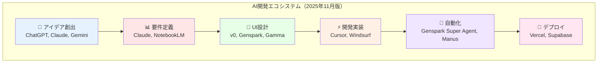
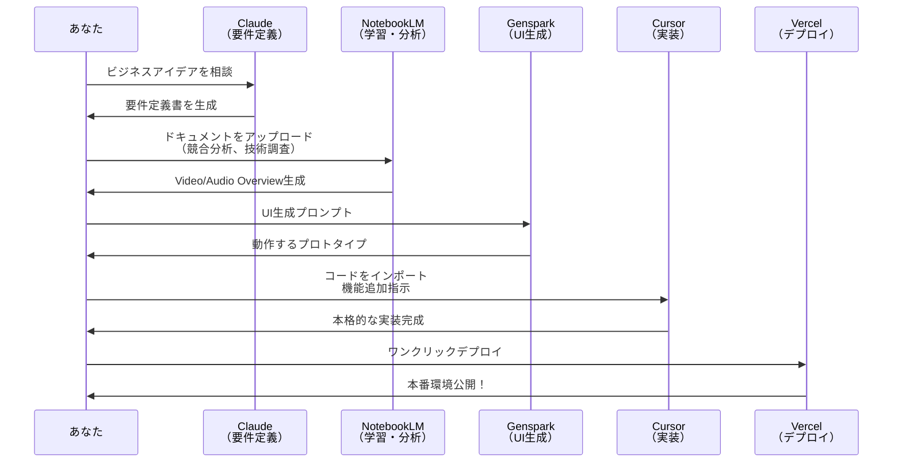
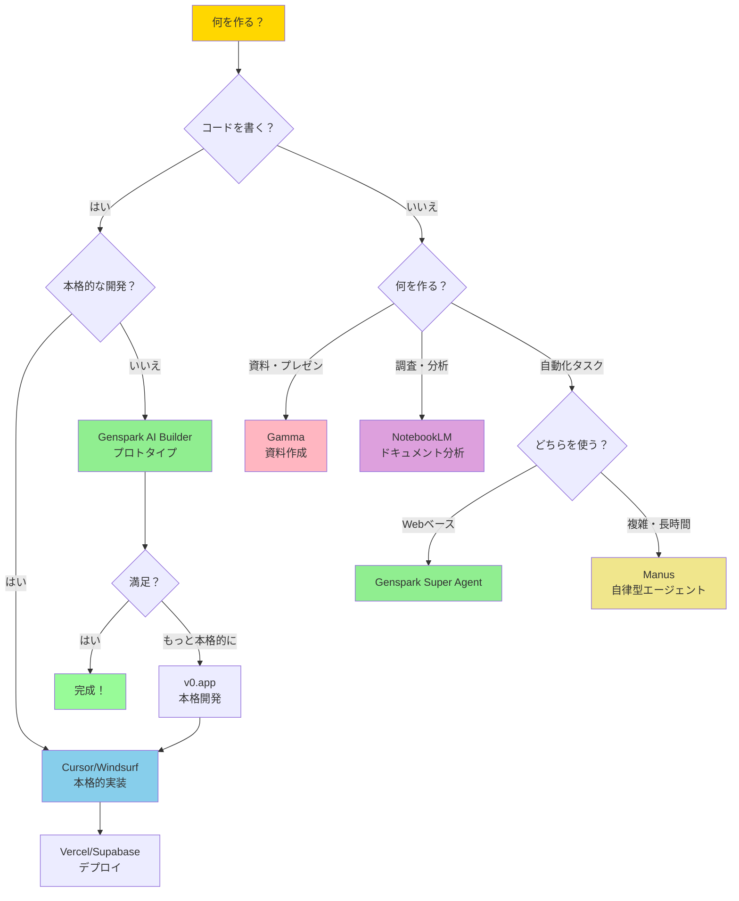
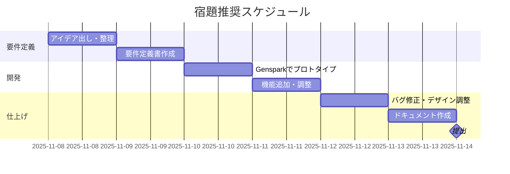
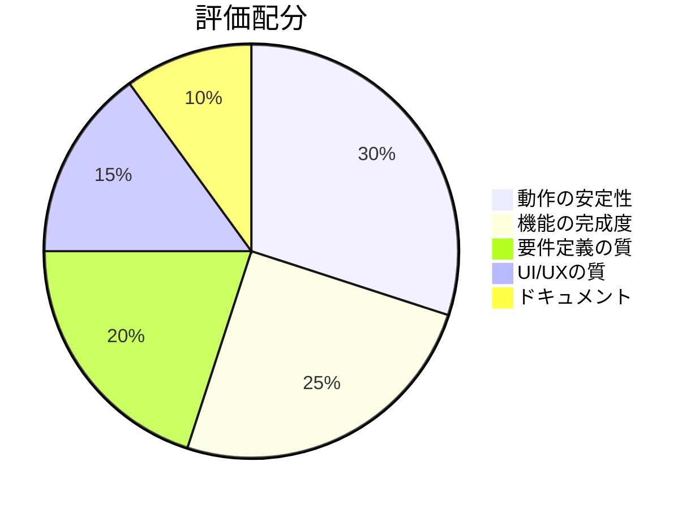
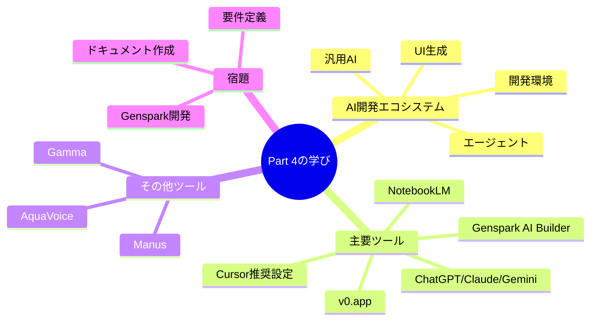
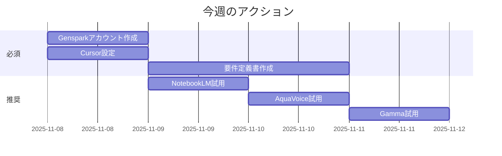
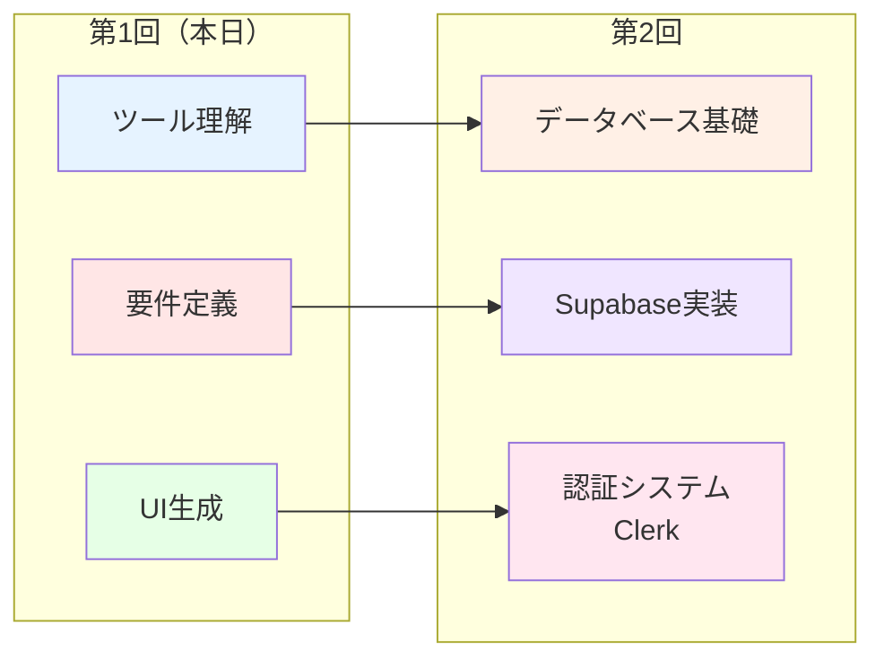

# 第一回講義 Part 4: ツール紹介と宿題説明

## 🎯 Part 4の学習目標

このPartでは、AI駆動開発に必要な実践的ツール群を学び、宿題に取り組むための準備を整えます。

**学習目標：**
- AI開発エコシステムの全体像を理解する
- 2025年11月時点の最新ツールとその使い分けを知る
- Genspark AI Builderの活用方法を習得する
- Cursorの推奨設定を理解し、効率的な開発環境を構築する
- 宿題の進め方と提出要件を明確にする

## 📌 Part 4の位置づけ

### これまでの流れ
- **Part 1**: オリエンテーションとマインドセット変革
- **Part 2**: ビジネス活用事例とLLM基礎
- **Part 3**: ビジネス要件定義の実践

### Part 4の役割
**「理論から実践へ」の橋渡し**

Part 3で学んだ要件定義を、実際のツールを使って形にする方法を学びます。宿題を通じて、学んだことを即座に実践し、AI駆動開発の感覚を体得します。

### 第二回講義への橋渡し
第二回では、より本格的なWeb開発（データベース、認証、デプロイ）に進むため、Part 4で紹介するツールの基本操作をマスターしておくことが重要です。

---

## 第1章　AI開発エコシステムの全体像

### 1.1 なぜ複数のツールを使い分けるのか

AI開発は、単一のツールでは完結しません。まるでオーケストラのように、異なる楽器（ツール）が協奏してこそ、美しい交響曲（プロダクト）が生まれます。

#### AI開発エコシステムの構造



#### ツールの専門性と使い分けの原則

| **開発フェーズ** | **役割** | **主要ツール** | **選択基準** |
|:------------|:---------|:--------------|:-----------|
| **🎯 アイデア創出** | ブレインストーミングパートナー | ChatGPT, Claude, Gemini | 対話の質、専門性 |
| **📊 情報整理・分析** | リサーチャー | NotebookLM, Manus | ドキュメント処理能力 |
| **🎨 UI/UX設計** | デザイナー | Genspark, v0, Gamma | 生成速度、柔軟性 |
| **⚡ 開発実装** | 副操縦士 | Cursor, Windsurf | 精度、統合環境 |
| **🔄 自動化・エージェント** | 自律実行AI | Genspark, Manus | タスクの複雑さ |
| **📝 資料作成** | プレゼンター | Gamma,Genspark,Manus | デザイン性、API連携 |
| **🎤 音声入力** | 入力効率化 | AquaVoice | 精度、速度 |

**重要な考え方：**
> **「完璧な万能ツールは存在しない」**
>
> 各ツールは特定の用途に最適化されています。適材適所で使い分けることで、開発効率が劇的に向上します。

---

### 1.2 2025年11月時点のAI開発フロー

#### 典型的な開発フロー（最新版）



---

## 第2章　主要ツールの詳細解説

### 2.1 汎用AI御三家（ChatGPT、Claude、Gemini）

#### ChatGPT（OpenAI）
**最新情報（2025年11月）**

- **GPT-5.1時代の到来**：GPT-4oを超える推論能力
- **Operators機能**：Webブラウザ自動操作、定期実行タスク
- **Advanced Voice Mode**：リアルタイム音声会話
- **DALL-E 4統合**：画像生成の品質向上
- **Sora 2リリース**（2025年10月）：次世代動画生成AI
  - **より物理的に正確**：リアルな動きと物理法則の再現
  - **マルチショット生成**：複数シーンを連続生成
  - **キャラクター・カメオ機能**：特定の人物をシーンに登場させる
  - **Storyboardモード**：秒単位で詳細に制御可能
  - **尺の拡張**：10秒（標準）、15秒（全ユーザー）、25秒（Pro・Web）
  - **iOS/Androidアプリ**：モバイルで動画生成（米国・カナダ・日本など対応）
  - **追加購入**：日次制限を超える動画生成が可能

**活用例**
```
プロンプト例：
「営業資料のドラフトを作成してください。
弊社は中小企業向けSaaSを提供しており、
今回は製造業の顧客向けに在庫管理の
効率化を提案したいです。
業界の課題と弊社の解決策を3ページにまとめて」
```

---

#### Claude（Anthropic）
**最新情報（2025年11月）**

- **Claude 4.5 Sonnet**：より長文対応、推論能力向上
- **Memory機能**：会話履歴を永続的に記憶（Team/Enterprise）
- **Artifacts進化**：コード、図表、文書をリアルタイム生成・編集
- **Research Mode**：45分かけて徹底リサーチ

**活用例**
```
プロンプト例：
「添付した100ページの業務マニュアルを分析し、
以下を提案してください：
1. 効率化できるポイント10個
2. 各ポイントについてAI活用の可能性
3. 実装の優先順位と理由
4. 期待されるROI試算」
```

---

#### Gemini（Google）
**最新情報（2025年11月）**

- **Gemini 3.0シリーズ**：Pro、Flash、Flash-Liteの3モデル体制
- **2Mトークンコンテキスト**：動画・大規模文書を一括処理可能
- **Agent Mode（プレビュー）**：自律的にタスクを実行するエージェント機能
- **Structured Outputs**：JSON Schema完全対応（2025年11月5日アップデート）
- **Personal Context & Temporary Chats**：会話記憶とプライバシー保護
- **Gemini for Home**：Nest/Homeデバイス向けアシスタント（早期アクセス開始）
- **Veo 3.1動画生成**：より高品質なプレゼン動画生成
- **Google Workspace統合強化**：Gmail、Drive、Sheets自動化

**💡 注目機能：**
- **Scheduled Actions**：定期実行タスクの自動化
- **Canvas機能**：スライド生成とリアルタイム編集

**活用例**
```
プロンプト例：
「今月のGmailから顧客からの問い合わせを抽出し、
カテゴリ別に分類して、Sheetsに集計してください。
各カテゴリの対応時間平均も計算して」

Agent Mode活用例：
「毎週月曜9時に先週の営業データを集計し、
レポートをGoogle Slidesで自動作成してチームに共有」
```

**参考情報：**
> **Gemini 3.0について**：2025年11月時点で正式発表はありません。現在はGemini 2.5シリーズが最新です。

---

### 2.2 NotebookLM - ドキュメントを知識に変える

Google製の革新的な学習・分析ツール。2025年11月時点で最も進化したドキュメント分析AI。

#### 最新機能（2025年11月）

**🆕 2025年10月29日：メジャーアップデート**
- **100万トークンコンテキスト**：会話記憶が6倍に拡大
- **Goals機能**：アシスタントの役割とスタイルをカスタマイズ
  - 「エンジニア向けに技術的に説明」
  - 「経営層向けにビジネス視点で要約」等

**🆕 2025年10月13日：Video Overviews視覚強化**
- **6つの新ビジュアルスタイル**（Google Nano Banana搭載）
  - Watercolor（水彩）
  - Papercraft（ペーパークラフト）
  - Anime（アニメ）
  - Whiteboard（ホワイトボード）
  - Retro Print（レトロ印刷）
  - Heritage（ヘリテージ）
- **Brief形式**：短縮版動画

**🆕 2025年9月：学習・レポート機能**
- **レポート生成**：構造化された分析レポート
- **フラッシュカード生成**：学習用カスタマイズ可能
- **クイズ生成**：理解度チェック
- **80+言語対応**

#### 主要機能一覧

| 機能 | 説明 | 対応形式 |
|:-----|:-----|:--------|
| **ドキュメントアップロード** | 複数ソースを統合分析 | PDF, テキスト, Google Docs, URL, YouTube |
| **Audio Overview** | AI音声ポッドキャスト生成 | 80言語、オフライン再生可能 |
| **Video Overview** | ナレーション付きスライドショー動画 | 6つのビジュアルスタイル、共有リンク |
| **Mind Map** | 概念の可視化 | インタラクティブ、ドリルダウン可能 |
| **質問応答** | 無制限のQ&A | 引用付き回答、タイムスタンプ |
| **Public Notebooks** | 読み取り専用共有 | リンク共有、閲覧者も質問可能 |
| **Discover Sources** | 関連ソース自動発見 | "I'm Feeling Curious"機能 |

#### Vibe Coderとしての活用法

```
【活用パターン1：技術学習】
1. YouTube技術解説動画（3本）をアップロード
2. Video Overviewで要点整理動画を自動生成
3. Audio Overviewで通勤中に復習
4. フラッシュカードで知識定着

【活用パターン2：要件定義】
1. 競合サイトのURLを5つ投入
2. 横断的な分析レポート生成
3. 差別化ポイントを抽出
4. 要件定義書に反映

【活用パターン3：議事録整理】
1. 会議の録音文字起こしをアップロード
2. 構造化されたレポート生成
3. Audio Overviewで音声要約
4. チームメンバーに共有
```

#### 料金

| プラン | 月額 | 容量制限 |
|:------|:-----|:--------|
| **無料版** | $0 | 1ノートブックあたり50ソース、1ソースあたり50万文字 |
| **NotebookLM Plus** | Google One AI Premium含む | より高い上限、カスタマイズ機能 |

**💡 プロのコツ：**
- 技術系YouTube動画をNotebookLMに入れて、Video Overviewで要点整理動画を作成
- 長大な技術ドキュメントを投入し、Goalsで「初心者向け」「上級者向け」等、視点を変えて分析
- 競合分析時は複数のURL + 自社資料を統合して、差別化ポイントを自動抽出

---

### 2.3 開発環境 - Cursor & Windsurf

#### Cursor - AI統合IDE（推奨）

**最新情報（2025年11月）**
- **Cursor 2.0リリース**（2025年10月29日）
- **Multi-Agents**：最大8エージェントを並列実行（独立したworktree）
- **新Composer**：従来比4倍高速、より高精度なコード生成
- **Browser for Agent（GA）**：エージェントがブラウザ操作可能、埋め込みサポート
- **Sandboxed Terminals（GA）**：macOSで安全なターミナル実行
- **Plan Mode**：バックグラウンドで計画を立てながら実行
- **Voice Mode**：音声でコード指示
- **Team Commands**：チーム全体で共有可能なコマンド
- **Enterprise強化**：サンドボックスポリシー、hook配布、監査ログ

#### Cursor推奨設定（2025年11月ベストプラクティス）

**必須設定（まず最初にやること）**

1. **Privacy Modeを有効化**
   - `Cursor Settings → General → Privacy Mode: ON`
   - **効果**：コードが学習に使われない、エンタープライズ対応

2. **モデル選択**（2025年11月最新推奨）
   - ⚠️ `Auto`は非推奨（モデルを明示的に選択することを推奨）
   - **推奨使い分け**：
     - 通常開発・バグ修正 → **Claude 4.5 Sonnet（非Thinking）**
     - 設計レビュー → **GPT-5.1 Codex**
     - 設計書がある場合の実装 → **Composer 1**
     - npm run dev/Git実行 → **Composer 1**
     - Sonnetで解決できないバグ → **GPT-5.1 Codex**
   - **各モデルの特徴**：
     - **Claude 4.5 Sonnet（非Thinking）**：スピード、思考力、説明のわかりやすさのバランスに優れる。日常的な開発の主力として最適。
     - **GPT-5.1 Codex**：無口なスーパーエンジニア。設計力・実装力はSonnetより高いが、応答は遅い。難易度の高い課題や設計レビューで威力を発揮。
     - **Composer 1**：思考力は他に比べ少し劣るが、速度が数倍速い。明確な指示がある作業や定型作業に最適。作業者として最高のパフォーマンス。
   - 設定場所：`Cursor Settings → Models`

3. **コードベースインデックス**
   ```
   ✅ Index new files by default: ON
   ✅ .cursorignore 作成（下記参照）
   ❌ Git Graph relationships: 必要な場合のみON
   ```

4. **Chat & Composer設定**
   ```
   ✅ Iterate on lints (beta): ON（自動リントエラー修正）
   ❌ Auto-apply to files outside context: OFF（安全のため）
   ❌ Always search the web: OFF（必要時のみ）
   ```

5. **Editor/UX設定**
   ```
   ✅ Chat/Edit tooltip: ON
   ✅ Auto-select for Ctrl/Cmd+K: ON
   ✅ Themed diffs: ON（差分が見やすい）
   ```

#### .cursorignore 推奨設定

```gitignore
# 必須除外（すべてのプロジェクト）
node_modules/
.venv/
.mypy_cache/
.pytest_cache/
__pycache__/
*.pyc

# ビルド出力
build/
dist/
out/
.next/
.nuxt/
.vercel/
target/

# ログ・キャッシュ
*.log
coverage/
.cache/

# 大容量ファイル
*.mp4
*.zip
*.tar.gz
data/raw/
```

#### .cursor/rules 推奨設定

従来の`.cursorrules`ではなく、**新しい`.cursor/rules`**を使用。

**ディレクトリ構造：**
```
.cursor/
├── rules/
│   ├── coding-style.mdc     # コーディング規約
│   ├── testing.mdc          # テスト規約
│   ├── security.mdc         # セキュリティチェックリスト
│   └── framework.mdc        # フレームワーク固有パターン
```

**例：coding-style.mdc**
```markdown
# コーディング規約

## 命名規則
- 変数名：camelCase（例：userName, orderCount）
- 定数：UPPER_SNAKE_CASE（例：API_URL, MAX_RETRY）
- コンポーネント：PascalCase（例：UserProfile, OrderList）

## インポート順序
1. React/Next.js
2. サードパーティライブラリ
3. 内部モジュール
4. 型定義

## エラーハンドリング
- 必ずtry-catchで囲む
- エラーログは必須
- ユーザーフレンドリーなエラーメッセージ
```

#### Cursor効率的な使い方

**パターン1：小規模な修正**
```
1. コードを選択
2. Cmd+K（Ctrl+K）で編集モード
3. 「この関数にエラーハンドリングを追加して」
4. 差分レビュー → Accept
```

**パターン2：新機能追加（Composer）**
```
1. Cmd+I（Ctrl+I）でComposer起動
2. 「ユーザーログイン機能を追加。
   - メールアドレスとパスワード入力
   - バリデーション追加
   - ログイン成功時にダッシュボードへリダイレクト」
3. AIが複数ファイルを自動生成・編集
4. 動作確認
```

**便利なショートカット**
- `Cmd+K / Ctrl+K`：インライン編集
- `Cmd+I / Ctrl+I`：Composer（Agent）起動
- `Cmd+L / Ctrl+L`：Chat起動
- `@files`：ファイルをコンテキストに追加
- `@tests`：テストファイルを参照

---

#### Windsurf - エンタープライズ向け本格IDE

**Cursor vs Windsurf 比較（2025年11月版）**

| 機能 | Cursor | Windsurf |
|:-----|:-------|:---------|
| **使いやすさ** | ⭐⭐⭐⭐⭐（初心者向け） | ⭐⭐⭐⭐（中級者向け） |
| **エンタープライズ機能** | ⭐⭐⭐ | ⭐⭐⭐⭐⭐ |
| **JetBrains対応** | ❌ | ✅ |
| **複数ファイル同時編集** | ⭐⭐⭐⭐ | ⭐⭐⭐⭐⭐（Cascade Agent） |
| **価格** | $20-40/月 | $15-60/月 |

**推奨利用判断基準：**
- **50人未満の組織**：Cursor推奨（簡単・高速・コスパ良）
- **50人以上の組織**：Windsurf推奨（管理・統制・JetBrains統合）
- **初学者**：Cursor推奨
- **既存JetBrains利用者**：Windsurf推奨

---

### 2.4 UI/プロトタイプ生成 - Genspark & v0

#### ⭐ Genspark AI Builder（推奨：宿題で使用）

**2025年11月時点の最新情報**

Gensparkは「AI検索エンジン」から「ノーコード/ローコード開発プラットフォーム」へ進化。**誰でもコードが書ける**をコンセプトに、Super Agentを搭載した総合開発環境を提供。

##### 主要機能

**1. AI Developer（コア機能）**
- **誰でもコードが書ける**：自然言語でアプリ開発
- **GitHub統合**：ブラウザ/アプリ内で完結
- **マルチモデル**：OpenAI、Anthropic、Google、xAI等を選択可能
- **プロトタイプ→実装**：UIから機能実装まで一貫対応

**2. Custom Super Agent**
- **1プロンプトでエージェント作成**
- **Agent Store**：作成したエージェントを共有・再利用
- **自動化タスク**：データ収集、レポート生成、ワークフロー自動化

**3. Super Agent**
- **リサーチ→実装→検証**：エンドツーエンド実行
- **音声通話対応**（OpenAI Realtime API）
- **スライド、動画生成**
- **構造化JSON出力**：他ツールとの連携

**4. Genspark AI Browser**
- **オンデバイス無料AI**
- **広告ブロック標準搭載**
- **MCP Store**：700+ツール統合（GitHub、Notion、Slack等）
- **Autopilotモード**：自動ブラウジング、スクレイピング

##### 料金プラン（2025年11月）

| プラン | 月額 | クレジット/特典 |
|:------|:-----|:--------------|
| **Personal** | 価格変動あり | 基本機能 |
| **Team** | **$30/ユーザー** | 12,000クレジット/席、無制限AIチャット（〜2025/12/31） |
| **Enterprise** | カスタム | SSO、データ保護、カスタムSLA |

##### Vibe Coderとしての活用法

```
【パターン1：シンプルなツール作成（宿題推奨）】
プロンプト例：
「ToDoリストアプリを作ってください。
機能：
- タスクの追加・削除
- 完了チェックボックス
- ローカルストレージで保存
- シンプルで使いやすいデザイン」

→ 5分で動作するプロトタイプ完成！

【パターン2：業務ツール開発】
プロンプト例：
「社内向け備品管理システムを作成。
- 備品一覧表示（名前、カテゴリ、在庫数、最終更新日）
- 新規登録フォーム
- 在庫数が5以下でアラート表示
- CSVエクスポート機能」

→ 15分で実用レベルのツール完成！

【パターン3：Super Agent活用】
プロンプト例：
「競合サイト5社の価格情報を毎週月曜9時に自動収集し、
比較表をスプレッドシートに記録するエージェントを作って」

→ 自動化エージェント完成、定期実行！
```

##### Gensparkの注意点

- **信頼性は発展途上**：メディアモデル（Sora 2等）で失敗報告あり
- **公開API未提供**（2025年11月時点）
- **プロトタイプ向き**：本格的なアプリは別途IDEで仕上げ推奨

##### 🎁 紹介コード（泉水推奨）

```
https://www.genspark.ai/invite_member?invite_code=YzY5YTFjYmZMODEzM0w3ZDM3TDhlN2JMZjQ2NDU0ZGY0YTk4
```

---

#### v0.app（Vercel）- 本格的Web開発向け

**最新情報（2025年11月）**

- **v0.dev → v0.app**：より「アプリ開発」に特化
- **エージェント化**：研究→計画→実装→デバッグを自動実行
- **Model API（OpenAI互換）**：プログラマティックに生成可能
- **Vercel統合強化**：ワンクリックデプロイ

##### v0の特徴

- **コード編集可能**：React/Next.js、Tailwind、shadcn/ui
- **Git連携**：リポジトリ管理、チームコラボ
- **プロダクション向け**：エンタープライズSSO、HIPAA BAA対応
- **Vercelエコシステム**：デプロイ、エッジ関数、ストレージ統合

##### 料金プラン（2025年5月更新）

| プラン | 月額 | クレジット |
|:------|:-----|:----------|
| **Free** | $0 | $5相当/月 |
| **Premium** | $20 | $20相当/月 |
| **Team** | $30/人 | $30相当/人/月 |

##### v0の活用法

```
プロンプト例：
「社内ポータルサイトのトップページを作成。
- ヘッダー：会社ロゴ、ナビゲーション
- お知らせセクション：最新3件表示（カード形式）
- クイックリンク：よく使うツールへのショートカット
- 今日の予定：カレンダー風UI
- デザイン：信頼感のある青系、レスポンシブ対応」

→ 30秒で生成、コード編集可能、即Vercelデプロイ可能！
```

##### v0とGensparkの使い分け

| 用途 | 推奨ツール | 理由 |
|:-----|:----------|:-----|
| **プロトタイプ検証** | **Genspark** | 速い、ノーコード、試行錯誤しやすい |
| **学習・宿題** | **Genspark** | ハードル低い、エージェント活用 |
| **本格的Web開発** | **v0 + Cursor** | コード編集可能、Git管理、デプロイ連携 |
| **プロダクション** | **v0 + Cursor** | エンタープライズ対応、スケーラビリティ |

**💡 推奨ワークフロー：**
```
1. Gensparkでプロトタイプ作成（5分）
2. 方向性が決まったらv0で本格開発（30分）
3. Cursorで機能追加・リファクタリング（1時間）
4. Vercelでデプロイ（5分）
```

---

### 2.5 その他の注目ツール

#### Manus - 完全自律型AIエージェント

**最新情報（2025年11月）**

**🆕 2025年11月アップデート**
- **チームSSO**：30席以上は無料、30席未満は$150/月
- **Manus Collab**：タスクあたり最大50人でコラボレーション可能
- **Connectors（MCP統合）**：
  - Gmail/Google Calendar
  - GitHub
  - Linear、monday.com
  - Supabase/Postgres（自然言語SQLクエリ）

**🆕 Manus 1.5（2025年10月16日）**
- **フルスタックアプリビルダー**：1プロンプトでバックエンド、認証、DB、分析まで実装
- **無制限コンテキスト**
- **エンジン高速化**、出力品質向上

##### Manusの特徴

**エンドツーエンド実行**
- 計画→実行→検証まで自動
- クラウド上で動作（PCを閉じてもOK）
- 数時間かかる作業も自律完遂

**マルチエージェント構成**
- Planner（計画）
- Researcher（調査）
- Coder（開発）
- Executor（実行）

**実績のあるユースケース**
- 市場調査レポート作成（100ページ超）
- データ分析とExcel出力
- 簡単なWebアプリ開発
- 競合サイトの情報収集
- プレゼン資料の自動生成

##### 料金（2025年11月）

| プラン | 月額 | 特徴 |
|:------|:-----|:-----|
| **Plus** | $39 | 個人利用 |
| **Pro** | $199 | 高頻度利用、高度なタスク |
| **Teams** | カスタム | SSO、コラボ、Connectors |

##### 注意点
- まだベータ的な側面あり
- データプライバシーに配慮必要
- 完璧ではなく、エラーも発生

##### 🎁 紹介コード（泉水推奨）

```
https://manus.im/invitation/LBFHK33EAA9J
```

---

#### AquaVoice - 音声入力革命

**最新情報（2025年11月）**

デスクトップ音声入力アプリ。どのテキストフィールド（Gmail、Slack、IDE、ターミナル）にも音声で入力可能。

##### 主要機能

- **97.3%精度**（AI/開発用語に特化したAISpeak benchmark）
- **49言語対応**、自動言語検出
- **リアルタイム整形**：入力先アプリに合わせてフォーマット自動調整
- **Custom Instructions**：カスタム辞書、スタイル指定
- **オンスクリーンコンテキスト認識**：画面内容を理解して入力

##### 性能

- **起動**：50ms以下
- **テキスト挿入**：450ms
- **Whisper代替**：ドロップイン互換API（Avalon API）

##### 料金（2025年11月・米国）

| プラン | 月額 | 無料枠 |
|:------|:-----|:------|
| **Starter** | **無料** | 1,000語 |
| **Pro** | **$8**（年間） | 無制限 |
| **Team** | **$12**（年間） | 無制限、チーム管理 |
| **学生割引** | 70% OFF | .eduメール必須 |

**Avalon API**：$0.39/時間（無料トライアル終了）

##### Vibe Coderとしての活用法

```
【活用例1：Cursorでのコーディング】
音声で「ユーザー認証機能を追加」
→ Cursorに自動入力、Composerが実装

【活用例2：議事録作成】
会議中に音声でメモ取り
→ Google Docsに自動整形入力

【活用例3：プロンプト入力効率化】
長いプロンプトを音声で高速入力
→ ChatGPT/Claudeで即実行
```

##### 🎁 紹介コード（泉水推奨）

```
https://withaqua.com/share?code=RS-4E7E
```

---

#### Gamma - AI資料作成特化

**最新情報（2025年11月）**

**🆕 2025年11月：Generate API v1.0 GA（一般提供開始）**
- プログラマティックに資料作成可能
- ヘッダー/フッター追加、画像URL挿入
- フォルダ管理、メール共有
- **Create from Template API（ベータ）**
- **公式Make.com統合**

##### 主要機能

**Gamma Agent（AIデザインパートナー）**
- Web調査（引用付き）
- リンク/スクリーンショットからコンテンツ精錬
- 画像リスタイル、デッキ全体リスタイル
- フィードバック受付→自動改善

**Smart Diagrams拡張**
- 12+種類の新ダイアグラムタイプ
- テーマ/レイアウト大幅追加

**Remix機能（ベータ）**
- 既存デッキをテンプレート化
- 新データで再利用（構造維持）

**Analytics（Pro）**
- カードレベルのエンゲージメント追跡
- 閲覧時間、視聴者数
- カード別滞在時間

##### 料金

| プラン | 月額 | 特徴 |
|:------|:-----|:-----|
| **Free** | $0 | 基本機能 |
| **Pro** | $20前後 | API、Analytics、カスタムブランディング |
| **Ultra** | $40前後 | 最先端モデル、早期機能アクセス |

##### Vibe Coderとしての活用法

```
【活用例1：営業資料作成】
プロンプト：
「中小企業向けSaaS営業資料を作成。
1. 業界の課題
2. 弊社の解決策
3. 導入事例
4. 料金プラン
5. お問い合わせ

デザイン：プロフェッショナル、青系」

→ 5分で完成、即プレゼン可能！

【活用例2：技術勉強会資料】
プロンプト：
「Next.js 15の新機能解説資料。
対象：エンジニア向け、30分発表用。
技術的詳細含む。コード例も挿入」

→ 技術資料も自動生成！

【活用例3：API経由で自動化】
- 週次レポートを自動生成
- CRMデータからプレゼン資料作成
- テンプレートから量産
```

##### 🎁 紹介コード（泉水推奨）

```
https://gamma.app/signup?r=d7yk2o6aeeq68gd
```

---

### 2.6 ツール選択のフローチャート



---

## 第3章　宿題説明

### 3.1 宿題の目的

この宿題は、Part 1〜3で学んだ内容を実践し、AI駆動開発の感覚を体得することが目的です。

**到達目標：**
1. ビジネス要件定義を実践できる
2. Genspark AI Builderで動くアプリを作れる
3. AI開発フローの全体像を理解する
4. 次回講義（データベース、認証）への準備ができる

---

### 3.2 宿題内容

#### 📝 タスク1: ビジネス要件定義（必須）

**概要：**
Part 3で学んだ要件定義手法を使い、自分のアプリのビジネス要件を整理します。

**成果物：**
`/docs/input`フォルダにMarkdown形式で保存

**必須項目：**
```markdown
# [アプリ名] ビジネス要件定義書

## 1. 背景と目的
- なぜこのアプリを作るのか
- 解決したい課題
- 期待される効果

## 2. ターゲットユーザー
- 誰が使うのか
- ユーザーの課題・ニーズ
- 使用シーン

## 3. 主要機能
- 必須機能3つ
- あれば嬉しい機能2つ
- 将来的に追加したい機能

## 4. 成功指標（KPI）
- どうなれば成功か
- 測定可能な指標

## 5. 技術要件（ざっくり）
- 必要な技術スタック（分かる範囲で）
- 参考にしたい類似サービス
```

**ヒント：**
- Claudeと対話しながら整理するのがおすすめ
- Part 3のテンプレートを活用
- 完璧を求めず、まず書いてみる

---

#### 💻 タスク2: Genspark AI Builderで開発（必須）

**概要：**
タスク1で定義した要件に基づき、Genspark AI Builderでアプリを作成します。

**レベル別推奨テーマ：**

##### **Level 1: シンプルなツール（初心者推奨）**

| テーマ | 必須機能 | 所要時間 |
|:------|:--------|:--------|
| **ToDoリスト** | 追加、削除、完了チェック | 30分 |
| **タイマー** | 開始、停止、リセット | 30分 |
| **メモ帳** | 作成、編集、ローカル保存 | 30分 |
| **カウンター** | カウントアップ/ダウン、リセット | 20分 |

**プロンプト例（ToDoリスト）：**
```
ToDoリストアプリを作成してください。

機能：
1. タスクを追加できる（入力フォーム）
2. タスクを削除できる（削除ボタン）
3. タスクを完了にできる（チェックボックス）
4. 完了したタスクは取り消し線表示
5. ローカルストレージに保存（リロードしても残る）

デザイン：
- シンプルで使いやすい
- スマホでも見やすいレスポンシブ対応
- 色は青系でモダンな印象
```

---

##### **Level 2: 業務系ツール（中級者向け）**

| テーマ | 必須機能 | 所要時間 |
|:------|:--------|:--------|
| **経費精算フォーム** | 入力、カテゴリ選択、合計表示 | 1時間 |
| **備品管理** | 一覧、登録、在庫アラート | 1時間 |
| **シフト管理表** | カレンダー、シフト入力、集計 | 1.5時間 |
| **顧客管理** | 一覧、詳細、検索 | 1.5時間 |

**プロンプト例（備品管理）：**
```
社内向け備品管理システムを作成してください。

機能：
1. 備品一覧表示
   - 備品名
   - カテゴリ（文房具、機器、その他）
   - 在庫数
   - 最終更新日
2. 新規備品登録フォーム
3. 在庫数が5以下の場合、アラート表示（赤字）
4. カテゴリでフィルタリング
5. 検索機能（備品名で検索）

デザイン：
- ビジネス向けで信頼感のある見た目
- テーブル形式で情報整理
- レスポンシブ対応
```

---

##### **Level 3: チャレンジ課題（上級者向け）**

| テーマ | 必須機能 | 所要時間 |
|:------|:--------|:--------|
| **社内Wiki風ページ** | 記事一覧、詳細、検索、カテゴリ | 2時間 |
| **ダッシュボード** | グラフ表示、KPI可視化 | 2時間 |
| **簡易チャットアプリ** | メッセージ送受信、ユーザー表示 | 2.5時間 |
| **オリジナルアイデア** | 自由 | 2-3時間 |

**プロンプト例（ダッシュボード）：**
```
営業ダッシュボードを作成してください。

機能：
1. KPI表示（カード形式）
   - 今月の売上
   - 前月比
   - 目標達成率
   - 新規顧客数
2. 売上推移グラフ（折れ線グラフ）
3. カテゴリ別売上（円グラフ）
4. 最近の商談一覧（テーブル）
5. ダミーデータで動作確認可能

デザイン：
- プロフェッショナルな見た目
- データ可視化重視
- ダークモード/ライトモード切り替え可能
```

---

#### 🎓 タスク3: v0でも試す（オプション・余裕がある方向け）

**概要：**
Gensparkで作成したアプリを、v0でも作成し、違いを体験します。

**目的：**
- GensparkとV0の使い分けを理解
- 本格的な開発の準備

**手順：**
1. Gensparkで作成したアプリと同じ要件でv0にプロンプト入力
2. 生成されたコードをダウンロード
3. Cursorで開いて動作確認
4. 感じた違いをメモ（提出物に含める）

---

### 3.3 宿題の進め方

#### 推奨スケジュール（1週間）



---

#### Day 1-2: 要件定義

**やること：**
1. **アイデア出し**（30分）
   - 何を作るか決める
   - Claudeと対話してアイデアを膨らませる

   ```
   Claudeへのプロンプト例：
   「ToDoリストアプリを作りたいです。
   一般的なToDoアプリにはどんな機能がありますか？
   また、差別化できるユニークな機能のアイデアを5つ提案してください」
   ```

2. **要件定義書作成**（1時間）
   - Part 3のテンプレート使用
   - `/docs/input/[アプリ名]_requirements.md`に保存
   - Claudeに添削してもらう

   ```
   Claudeへのプロンプト例：
   「以下の要件定義書をレビューしてください。
   改善点を3つ指摘し、具体的な修正案を提示してください。

   [要件定義書を貼り付け]」
   ```

---

#### Day 3-4: Gensparkで開発

**やること：**
1. **Gensparkアカウント作成**（5分）
   - 紹介コード使用：`https://www.genspark.ai/invite_member?invite_code=YzY5YTFjYmZMODEzM0w3ZDM3TDhlN2JMZjQ2NDU0ZGY0YTk4`

2. **初回プロトタイプ生成**（30分）
   - 要件定義書を元にプロンプト作成
   - AI Developerで生成
   - 動作確認

3. **機能追加・調整**（1-2時間）
   - 追加機能を1つずつ指示
   - デザイン調整
   - エラー修正

**効率的なプロンプトのコツ：**

```
【良いプロンプト例】
「ToDoリストに以下の機能を追加してください：
1. タスクに優先度（高/中/低）を設定できる
2. 優先度でフィルタリング機能
3. 優先度は色で区別（高=赤、中=黄、低=緑）

現在のコードを維持しながら、上記機能を追加してください」

【悪いプロンプト例】
「もっと良くして」
→ 具体性がない

「全部やり直して」
→ 積み重ねが無駄になる
```

---

#### Day 5-6: ブラッシュアップ

**やること：**
1. **バグ修正**（30分）
   - 動作確認
   - エラーがあればGensparkに修正依頼

   ```
   プロンプト例：
   「タスク削除ボタンをクリックすると、
   コンソールに「undefined」エラーが表示されます。
   修正してください」
   ```

2. **デザイン調整**（30分）
   - フォント、色、レイアウト微調整

   ```
   プロンプト例：
   「全体的に余白を広げて、
   フォントサイズを1.2倍にしてください。
   また、ボタンの角を丸くして、
   ホバー時にアニメーション効果を追加」
   ```

3. **スクリーンショット撮影**（15分）
   - トップページ
   - 主要機能画面
   - モバイル表示

---

#### Day 7: ドキュメント作成・提出

**やること：**
1. **README作成**（30分）

```markdown
# [アプリ名]

## 概要
このアプリは[目的]を解決するために作成しました。

## 主要機能
1. [機能1]
2. [機能2]
3. [機能3]

## 使い方
1. [手順1]
2. [手順2]
3. [手順3]

## 技術スタック
- Genspark AI Builder
- [その他使用した技術]

## 開発で学んだこと
- [学び1]
- [学び2]
- [学び3]

## スクリーンショット


```

2. **開発プロセスメモ作成**（15分）

```markdown
# 開発プロセス

## 使用したプロンプト
### 初回生成
[プロンプトを記載]

### 機能追加1
[プロンプトを記載]

### デザイン調整
[プロンプトを記載]

## つまずいたポイント
- [ポイント1]：[解決方法]
- [ポイント2]：[解決方法]

## 改善したいポイント
- [改善点1]
- [改善点2]
```

3. **提出準備**（15分）
   - フォルダ構成確認
   - ファイル名確認
   - ZIPまたはGitHub URL準備

---

### 3.4 提出要件

#### 必須提出物

| 項目 | 内容 | 形式 | 保存場所 |
|:-----|:-----|:-----|:--------|
| **1. ビジネス要件定義書** | Part 3のテンプレート使用 | Markdown | `/docs/input/[アプリ名]_requirements.md` |
| **2. 動作するアプリ** | Gensparkで作成 | HTML/JS/CSS一式 | `/src/` |
| **3. README** | 機能説明、使い方 | Markdown | `/README.md` |
| **4. 開発プロセスメモ** | 使用したプロンプト、つまずいたポイント | Markdown | `/docs/process.md` |
| **5. スクリーンショット** | 動作画面3枚以上 | PNG/JPG | `/screenshots/` |

#### オプション提出物（加点対象）

| 項目 | 内容 | 加点ポイント |
|:-----|:-----|:-----------|
| **v0版の比較** | v0でも作成し、違いをレポート | +10点 |
| **デプロイ** | Vercel等で公開、URLを提出 | +10点 |
| **動画デモ** | 使い方解説動画（1-2分） | +5点 |
| **テストケース** | 動作確認項目リスト | +5点 |

---

#### 推奨フォルダ構成

```
my-todo-app/
├── docs/
│   ├── input/
│   │   └── todo_requirements.md      # ビジネス要件定義書
│   └── process.md                     # 開発プロセスメモ
├── src/
│   ├── index.html
│   ├── style.css
│   └── app.js
├── screenshots/
│   ├── top.png
│   ├── feature1.png
│   └── mobile.png
└── README.md
```

---

### 3.5 評価基準



#### 詳細評価項目

| 項目 | 配点 | 評価ポイント |
|:-----|:-----|:-----------|
| **動作の安定性** | 30点 | エラーなく動作、基本機能が確実に動く |
| **機能の完成度** | 25点 | 要件定義の機能が実装されている |
| **要件定義の質** | 20点 | 明確、具体的、実現可能性 |
| **UI/UXの質** | 15点 | 使いやすさ、見た目の良さ |
| **ドキュメント** | 10点 | README、プロセスメモの充実度 |

#### 加点要素

- **実用性**：実際の業務で使えるツール（+10点）
- **創意工夫**：ユニークな機能、デザイン（+10点）
- **エラーハンドリング**：ユーザーフレンドリーなエラー処理（+5点）
- **アクセシビリティ**：キーボード操作、スクリーンリーダー対応（+5点）

---

### 3.6 よくある質問（FAQ）

#### Q1: どのレベルを選べばいい？
**A:** 迷ったらLevel 1から。完成させることが最重要です。Level 1を早めに完成させて、余裕があればLevel 2にチャレンジするのもOK。

#### Q2: プログラミング経験ゼロでも大丈夫？
**A:** 全く問題ありません。GensparkのAI Developerが99%やってくれます。あなたは「何を作りたいか」を伝えるだけです。

#### Q3: 時間がかかりそう...
**A:** Level 1なら実作業時間は2-3時間程度。毎日30分ずつ進めれば1週間で余裕をもって完成します。

#### Q4: エラーが出て動かない
**A:** Gensparkに「エラーが出ています。以下のエラーメッセージです：[エラー内容]。修正してください」と伝えるだけでOK。

#### Q5: デザインセンスがない
**A:** Gensparkに「モダンでプロフェッショナルな感じで」「Apple風のミニマルデザインで」等、参考イメージを伝えればOK。

#### Q6: GensparkとV0、どちらを使うべき？
**A:** 宿題はGenspark推奨。理由は、ノーコードで速く、初心者でも扱いやすいため。余裕がある方はv0も試して違いを体験してみてください。

#### Q7: 提出期限に間に合わない場合は？
**A:** 未完成でも提出してください。プロセスも評価対象です。「どこまでできたか」「何につまずいたか」をプロセスメモに書けば部分点あり。

#### Q8: 他の受講生と同じテーマでもいい？
**A:** もちろんOK。同じテーマでも実装やデザインは異なるはず。逆に、比較して学べるメリットもあります。

---

### 3.7 成功者の開発パターン

過去の受講生の成功事例から、効率的な開発パターンを紹介します。

#### パターン1: シンプル&確実型（初心者推奨）

```
Day 1: 要件定義（1時間）
Day 2: Gensparkで初回生成（30分）
Day 3: 機能追加（1時間）
Day 4: バグ修正・デザイン調整（30分）
Day 5: ドキュメント作成・提出（30分）

→ 合計3.5時間で完成
```

**成功のコツ：**
- 最小限の機能で動くものを先に作る
- 1つずつ機能を追加していく
- 完璧を求めず、まず完成させる

---

#### パターン2: 段階的改善型（中級者推奨）

```
Day 1: 要件定義（1時間）
Day 2: 最小限の機能で動作確認（30分）
Day 3-4: 機能を1つずつ追加（各30分×4回）
Day 5: UI/UX改善（1時間）
Day 6: ドキュメント作成（30分）

→ 少しずつ確実に完成
```

**成功のコツ：**
- 毎日小さな成功体験を積む
- 「追加→確認→追加→確認」のサイクル
- 機能追加の優先順位をつける

---

#### パターン3: 週末集中型（時間がある方向け）

```
土曜AM: 要件定義（1時間）
土曜AM: Gensparkで実装（2時間）
土曜PM: 機能追加、デザイン調整（1時間）
日曜AM: v0でも試してみる（1時間）
日曜AM: ドキュメント作成（30分）

→ 週末で完結
```

**成功のコツ：**
- まとまった時間で一気に進める
- 集中力が続く午前中に開発
- 午後はドキュメントや仕上げ

---

#### 共通する成功要因

1. **完璧を求めない**：まず動くものを作る
2. **AIを信頼する**：細かく指示しすぎない
3. **つまずいたら質問する**：Slackで即座に質問
4. **プロセスを楽しむ**：結果より学びを重視

---

## 第4章　今日のまとめと次回への準備

### 4.1 Part 4で学んだこと



---

### 4.2 今日から始められること

#### 今日中にやること（30分）

1. **Gensparkアカウント作成**（5分）
   - 紹介コード使用：[https://www.genspark.ai/invite_member?invite_code=YzY5YTFjYmZMODEzM0w3ZDM3TDhlN2JMZjQ2NDU0ZGY0YTk4](https://www.genspark.ai/invite_member?invite_code=YzY5YTFjYmZMODEzM0w3ZDM3TDhlN2JMZjQ2NDU0ZGY0YTk4)

2. **Cursor推奨設定**（10分）
   - Privacy Mode: ON
   - .cursorignore作成
   - .cursor/rules作成

3. **宿題のアイデア出し**（15分）
   - Claudeと対話
   - 3つアイデアを出して1つに絞る

---

#### 今週中にやること



---

### 4.3 第二回講義への準備

**第二回の内容予告（2025年11月14日予定）：**



**第二回までに準備しておくこと：**

1. **宿題を完成させる**（必須）
   - 第二回では宿題アプリを発展させます

2. **Supabaseアカウント作成**（推奨）
   - [https://supabase.com/](https://supabase.com/)
   - 無料プランでOK

3. **Clerkアカウント作成**（推奨）
   - [https://clerk.com/](https://clerk.com/)
   - 無料プランでOK

4. **データベース基礎を軽く予習**（オプション）
   - NotebookLMに「データベース入門」系の記事を投入
   - Audio Overviewで通勤中に学習

---

### 4.4 モチベーション維持のコツ

#### 小さな成功体験を積む

```
Day 1: アカウント作成完了！
Day 2: 要件定義書完成！
Day 3: 初めてのアプリが動いた！
Day 4: 機能追加成功！
Day 5: デザインが良くなった！
Day 6: ドキュメント完成！
Day 7: 提出完了！

→ 毎日1つずつ達成感を味わう
```

#### コミュニティを活用

- **Slackで進捗報告**：他の受講生の刺激を受ける
- **画面共有で困りごと解決**：オフィスアワー活用
- **成功体験の共有**：「できた！」を投稿してモチベUP

#### 完璧主義を捨てる

> **「完璧なアプリより、動くアプリ」**
>
> 最初から完璧を目指さず、まず動くものを作る。
> 改善は後からいくらでもできます。

---

## 💡 最後のメッセージ

### あなたは今、AI駆動開発の入り口に立っています

Part 1〜4で学んだことは、すべて「実践」につながります。
宿題は単なる課題ではなく、**あなた自身のスキルを証明する最初の作品**です。

### 思い出してください

- Part 1で学んだ**マインドセット**
- Part 2で知った**LLMの可能性**
- Part 3で実践した**要件定義**
- Part 4で出会った**強力なツール群**

これらすべてを組み合わせれば、あなたは**1週間でアプリを作れる人**になります。

### 最初の一歩が、最も大きな一歩

```
今日 → アカウント作成
明日 → 要件定義
明後日 → 初めてのアプリ
1週間後 → 完成品を提出
1ヶ月後 → 本格的なWebアプリを開発
3ヶ月後 → 自信を持ってVibe Coderを名乗れる
```

### 一緒に、未来を作りましょう

**第2回講義でお会いしましょう！**

**頑張れ、Vibe Coders！** 🚀

---

## 参考資料

### 公式ドキュメント

- **Genspark**: [https://www.genspark.ai/](https://www.genspark.ai/)
- **v0.app**: [https://v0.app/](https://v0.app/)
- **Cursor**: [https://cursor.com/](https://cursor.com/)
- **NotebookLM**: [https://notebooklm.google.com/](https://notebooklm.google.com/)
- **Manus**: [https://manus.im/](https://manus.im/)
- **AquaVoice**: [https://aquavoice.com/](https://aquavoice.com/)
- **Gamma**: [https://gamma.app/](https://gamma.app/)

### 推奨コンテンツ

- **NotebookLM公式ブログ**: [https://blog.google/technology/google-labs/](https://blog.google/technology/google-labs/)
- **Cursor Documentation**: [https://docs.cursor.com/](https://docs.cursor.com/)
- **Vercel v0 Documentation**: [https://vercel.com/docs/v0](https://vercel.com/docs/v0)

### コミュニティ

- **TEKION Group Slack**: 招待リンクは別途送付
- **Genspark Community**: [https://www.reddit.com/r/genspark_ai/](https://www.reddit.com/r/genspark_ai/)

---

**Document Version**: 1.1.0
**Last Updated**: 2025年11月9日
**Author**: 泉水亮介（TEKION Group）
**License**: TEKION Group内部資料（無断転載禁止）
