# 第三回講義：DB基礎とSupabase実装

## 🎯 この講義で学ぶこと

- **データベースの本質**を身近な例で理解し、なぜWebアプリに必須なのかを実感する
- **スプレッドシートからデータベースへ**の進化を体験し、リレーションの概念を習得する
- **SQL vs NoSQL**の違いを理解し、適切な選択ができるようになる
- **Supabaseによる本格的なDB構築**を30分で実現し、プロ仕様のデータベースを操作する
- **AIによるDB設計の自動化**で、要件定義からER図・SQL生成までを瞬時に実行する
- **RLS（Row Level Security）**でセキュアなデータ管理を実装し、本番環境レベルの安全性を確保する

## 📌 この講義の位置づけ

第二回でWebアプリケーションの仕組みと技術スタックを理解しました。
この講義では、アプリケーションの「記憶装置」であるデータベースを徹底的に学びます。

前回作成したフロントエンドは「ハリボテ」の状態です。今回、そこに「データの魂」を吹き込み、実際に情報を保存・管理できる本物のアプリケーションへと進化させます。

次回の認証システム（Clerk）実装と合わせて、フルスタックWebアプリケーションの基盤が完成します。

---

# 第1章：データベースという「記憶装置」の革命

## 🎯 この章で学ぶこと

- **データベースとは何か**を身近な例で完全理解する
- なぜ**スプレッドシートでは限界**があるのかを実感する
- **すべてのWebアプリ**がデータベースで動いている理由を知る
- データベースがもたらす**4つの革命的な優位性**を理解する

## 📌 この章の位置づけ

データベースは難しそうに見えますが、実は「整理された情報の保管庫」に過ぎません。
この章では、身近な例から始めて、段階的に理解を深めていきます。
次章以降の実装の土台となる重要な概念をしっかり理解しましょう。

## 🚀 衝撃の事実：あなたはすでにデータベースを使っている

### **「スマホの連絡先も、Googleカレンダーも、家計簿アプリも、全部データベース」**

これは誇張ではありません。**今、この瞬間もデータベースに囲まれて生活しています**。

| あなたがしていること | 実はこれが... | 管理されているデータ |
|------------------|------------|----------------|
| **📱 スマホの連絡先** | データベース | 名前、電話番号、メールアドレス、写真 |
| **📅 Googleカレンダー** | データベース | 予定、場所、参加者、繰り返し設定 |
| **💰 家計簿アプリ** | データベース | 収支、カテゴリ、日付、メモ |
| **📚 Kindle** | データベース | 購入履歴、読書位置、ハイライト、メモ |
| **🎵 Spotify** | データベース | プレイリスト、再生履歴、お気に入り |

### データベースの定義：3つの要素

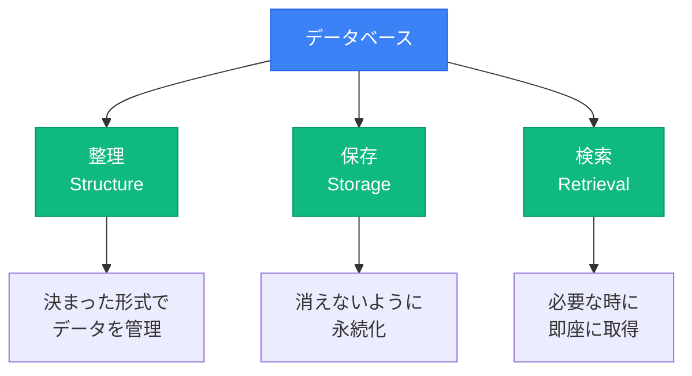

## 💥 なぜデータベースが必要なのか？

### メモ帳 vs データベース：決定的な違い

#### ❌ メモ帳で管理する場合

```text
山田太郎さんの電話番号は090-1234-5678です
田中花子さんのメールはtanaka@example.com
あ、山田太郎さんの住所は東京都渋谷区...
田中花子さんの電話番号は080-9876-5432
山田太郎さんのメールはyamada@example.com
```

**問題点**：
- 🔍 **検索が大変** - 全部読まないと見つからない
- 📋 **重複しやすい** - 山田太郎さんの情報がバラバラ
- ✏️ **更新が漏れる** - 電話番号変更を全箇所に反映できない
- 🔗 **関連性が不明** - 誰が誰の上司か分からない

#### ✅ データベースで管理する場合

| ID | 名前 | 電話番号 | メール | 住所 |
|----|------|---------|--------|------|
| 1 | 山田太郎 | 090-1234-5678 | yamada@example.com | 東京都渋谷区... |
| 2 | 田中花子 | 080-9876-5432 | tanaka@example.com | 神奈川県横浜市... |

**利点**：
- ✅ **検索が瞬時** - 名前で即座に検索可能
- ✅ **重複がない** - 1人1レコードで管理
- ✅ **更新が確実** - 1箇所変えれば全体に反映
- ✅ **関連付け可能** - 上司部下、フォロー関係も管理

## 🎯 実例で見る：有名サービスのデータベース活用

### すべてのWebアプリはデータベースで動いている

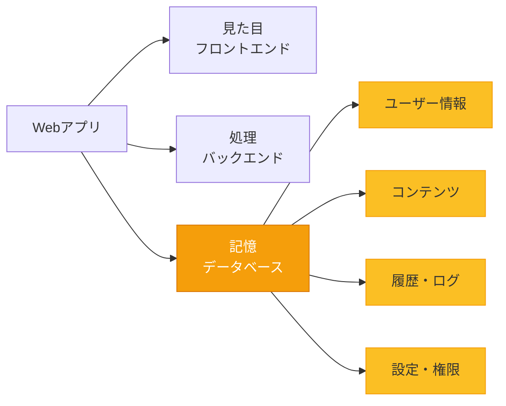

| サービス | 管理されているデータ | データ量の規模 |
|---------|------------------|-------------|
| **Instagram** | 📸 写真、❤️ いいね、👥 フォロー、💬 コメント | **500億枚**の写真 |
| **Amazon** | 📦 商品情報、📊 在庫、🛒 注文履歴、⭐ レビュー | **3億5000万個**の商品 |
| **Netflix** | 🎬 動画メタデータ、📺 視聴履歴、🎯 おすすめ | **2億3000万人**の視聴データ |
| **Twitter/X** | 📝 ツイート、♻️ リツイート、❤️ いいね | 毎日**5億件**のツイート |

**重要な気づき**：
- アプリの見た目は氷山の一角
- 裏側には膨大なデータベースが存在
- **データベースなしでは何も保存できない = アプリとして成立しない**

## 🔥 データベースの4つの革命的な優位性

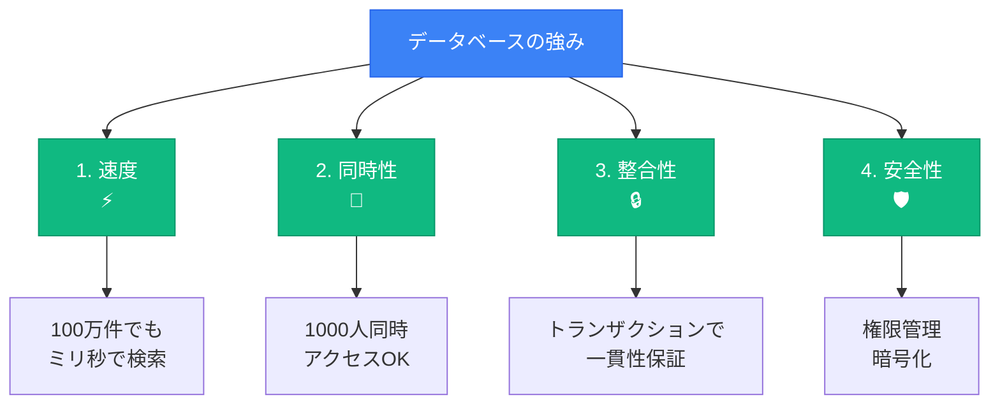

### 比較表：スプレッドシート vs データベース

| 観点 | スプレッドシート | データベース | 勝者 |
|------|---------------|------------|------|
| **データ量** | 〜1万行で限界 | **数億行**でもOK | DB 🏆 |
| **速度** | 1万行で遅延発生 | インデックスで**ミリ秒検索** | DB 🏆 |
| **同時アクセス** | 10人程度 | **数千〜数万人** | DB 🏆 |
| **データ整合性** | 手動管理（ミス多発） | 自動制約（FOREIGN KEY等） | DB 🏆 |
| **セキュリティ** | 全員が全データ閲覧可 | **行レベル**で権限制御 | DB 🏆 |
| **学習コスト** | 低（誰でも使える） | 中（でもAIが助けてくれる！） | 引き分け |
| **料金** | 無料 | 無料枠あり〜月額課金 | 用途次第 |

## 💡 この章のまとめ

- ✅ データベースは「**整理された情報の保管庫**」である
- ✅ あなたは既に毎日**数十個のデータベース**を使っている
- ✅ メモ帳やスプレッドシートには**限界**がある
- ✅ すべてのWebアプリは**データベースが心臓部**
- ✅ データベースは**速度・同時性・整合性・安全性**で圧倒的に優れている

## 🚀 次の章への橋渡し

データベースの必要性と優位性を理解しました。
次の第2章では、実際にスプレッドシートを使って「データベースの基本概念」を体感します。
テーブル、レコード、リレーションといった重要な概念を、手を動かしながら学んでいきましょう。

---

# 第2章：スプレッドシートで体感するDB設計

## 🎯 この章で学ぶこと

- **データベースの基本用語**をスプレッドシートで体感する
- **テーブル設計の基礎**を実際に作りながら理解する
- **リレーション（関連）**の概念をVLOOKUPで実践する
- **正規化**の必要性を実感する
- スプレッドシートの**限界を体験**し、本物のDBの必要性を理解する

## 📌 この章の位置づけ

第1章で理解したデータベースの概念を、実際に手を動かして体感します。
スプレッドシートという身近なツールを使うことで、データベースの基本構造を直感的に理解できます。
この体験が、第3章以降の本格的なデータベース構築の土台になります。

## 🛠️ ハンズオン：SNSアプリのデータベースを作ってみよう

### 今から作るもの：Instagram風アプリのデータ構造

私たちが作るSNSアプリで管理するデータ：
1. **ユーザー情報** - 誰が使っているか
2. **投稿** - 誰が何を投稿したか
3. **いいね** - 誰がどの投稿を気に入ったか
4. **フォロー関係** - 誰が誰をフォローしているか

**この構造は Instagram や Twitter と同じです！**

### データベース基礎用語の理解

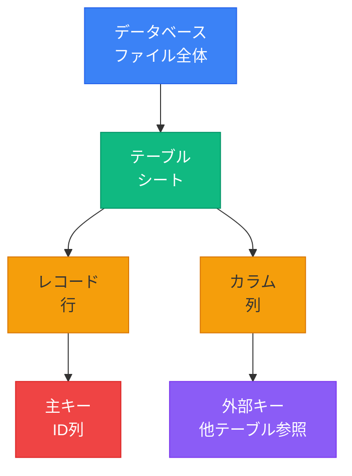

| データベース用語 | スプレッドシートでの対応 | 説明 |
|---------------|-------------------|------|
| **データベース** | ファイル全体（`.xlsx`） | プロジェクトの全データを格納する箱 |
| **テーブル** | シート | `users`や`posts`といったデータの種類ごとの表 |
| **レコード（行）** | 行 | 1人のユーザー、1つの投稿といった個々のデータ |
| **カラム（列）** | 列 | `name`、`email`、`content`等の属性 |
| **主キー** | ID列 | `user_id`、`post_id`等（重複しない識別子） |
| **外部キー** | 他シート参照 | `posts`の`user_id` → `users`の`user_id` |

## 📊 実践：4つのテーブルを作成

### 準備（一緒にやりましょう！）

1. **Google スプレッドシートを新規作成**
2. **ファイル名**：「SNSアプリ_データベース演習」
3. **以下の4つのシートを作成**：
   - `users`（ユーザー情報）
   - `posts`（投稿）
   - `likes`（いいね）
   - `follows`（フォロー関係）

### シート1：users（ユーザー情報）👥

実際に入力してみましょう：

| user_id | email | username | avatar_url | created_at |
|---------|-------|----------|------------|------------|
| 1 | yamada@example.com | yamada_taro | https://... | 2025-01-01 10:00 |
| 2 | tanaka@example.com | tanaka_hanako | https://... | 2025-01-02 11:00 |
| 3 | sato@example.com | sato_jiro | https://... | 2025-01-03 09:00 |

**ポイント解説**：
- **user_id**: 絶対に重複しない番号（主キー）
- **email**: ログイン時の識別子（ユニーク制約）
- **username**: 表示名（変更可能）
- **created_at**: いつ登録したか（監査ログ）

### シート2：posts（投稿）📝

投稿データを追加：

| post_id | user_id | content | image_url | created_at |
|---------|---------|---------|-----------|------------|
| 1 | 1 | おはようございます！今日も一日頑張りましょう💪 | null | 2025-01-10 08:00 |
| 2 | 2 | カフェでコーヒータイム☕️ | https://... | 2025-01-10 10:30 |
| 3 | 1 | プログラミング楽しい！#VibeCoder | null | 2025-01-10 14:00 |
| 4 | 3 | 初投稿です。よろしくお願いします！ | null | 2025-01-10 15:00 |
| 5 | 2 | 夕焼けが綺麗でした🌅 | https://... | 2025-01-10 18:00 |

## 🔗 リレーション（関連）を体験する

### VLOOKUPで投稿者名を表示

postsシートのF列に以下を追加：

**Cursorへの指示**：
```
postsシートのF列に投稿者名を表示したいです。
user_idを使って、usersシートのusernameを参照する
VLOOKUP関数を作成してください。
```

結果：

| post_id | user_id | content | ... | 投稿者名 |
|---------|---------|---------|-----|----------|
| 1 | 1 | おはよう... | ... | yamada_taro |
| 2 | 2 | カフェで... | ... | tanaka_hanako |

**これがリレーション！** user_idで2つのテーブルが繋がっている

### シート3：likes（いいね）❤️

誰がどの投稿にいいねしたか：

| like_id | user_id | post_id | created_at |
|---------|---------|---------|------------|
| 1 | 2 | 1 | 2025-01-10 08:30 |
| 2 | 3 | 1 | 2025-01-10 08:45 |
| 3 | 1 | 2 | 2025-01-10 11:00 |
| 4 | 3 | 2 | 2025-01-10 11:30 |
| 5 | 1 | 4 | 2025-01-10 15:15 |
| 6 | 2 | 3 | 2025-01-10 15:30 |

**Cursorへの指示**：
```
各投稿のいいね数を集計したいです。
COUNTIF関数を使って、post_idごとのいいね数を
計算する式を作成してください。
```

### シート4：follows（フォロー関係）👥

誰が誰をフォローしているか：

| follow_id | follower_id | following_id | created_at |
|-----------|-------------|--------------|------------|
| 1 | 1 | 2 | 2025-01-05 10:00 |
| 2 | 1 | 3 | 2025-01-06 11:00 |
| 3 | 2 | 1 | 2025-01-07 09:00 |
| 4 | 3 | 1 | 2025-01-07 14:00 |
| 5 | 3 | 2 | 2025-01-08 16:00 |
| 6 | 2 | 3 | 2025-01-09 10:00 |

**解釈の仕方**：
- follower_id = 1, following_id = 2
  → 「山田太郎が田中花子をフォロー」

## 📈 データの関連性を可視化

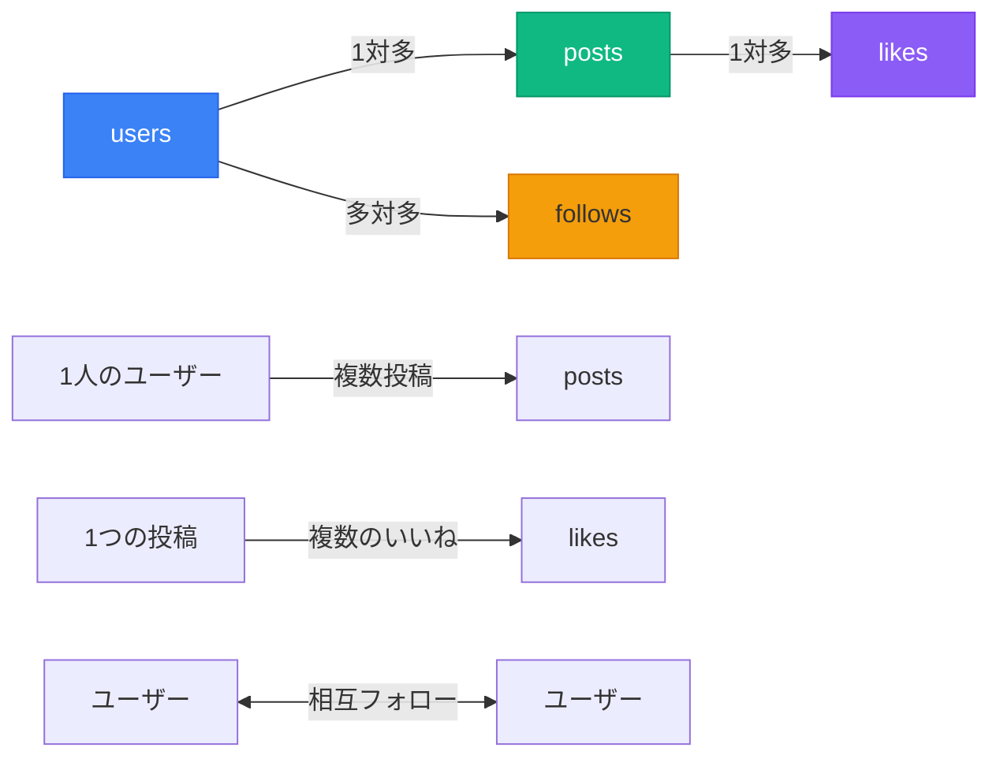

### リレーションの3つのパターン

| パターン | 説明 | 例 |
|---------|------|-----|
| **1対1** | 1つのレコードが1つのレコードと対応 | ユーザー ⟷ プロフィール詳細 |
| **1対多** | 1つのレコードが複数のレコードと対応 | ユーザー → 投稿（1人が複数投稿） |
| **多対多** | 複数のレコードが複数のレコードと対応 | ユーザー ⟷ ユーザー（フォロー関係） |

## ⚠️ スプレッドシートの限界を体感

### 規模が大きくなったら何が起こるか？

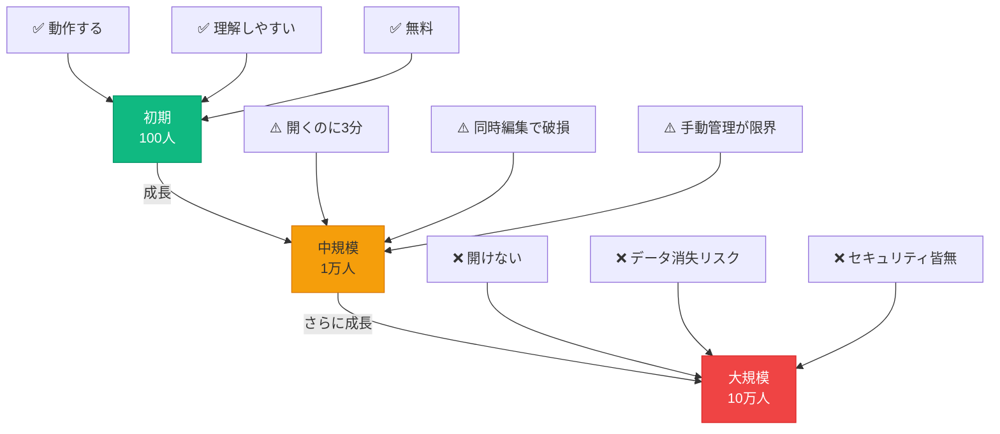

| ユーザー数 | 投稿数 | スプレッドシートの状態 | 問題点 |
|-----------|--------|---------------------|--------|
| 100人 | 1,000件 | ✅ 快適に動作 | 特になし |
| 1,000人 | 10,000件 | ⚠️ 動作が重い | ファイルを開くのに**30秒** |
| 10,000人 | 100,000件 | ❌ ほぼ使用不可 | 開くのに**3分**、頻繁にクラッシュ |
| 100,000人 | 1,000,000件 | ❌ 完全に破綻 | **開けない**、データ破損の危険 |

## 💡 この章のまとめ

- ✅ スプレッドシートで**データベースの基本構造**を体験した
- ✅ **テーブル、レコード、カラム**の概念を理解した
- ✅ **リレーション（関連）**をVLOOKUPで実践した
- ✅ **1対多、多対多**の関係性を学んだ
- ✅ スプレッドシートの**限界**を実感した

## 🚀 次の章への橋渡し

スプレッドシートでデータベースの基本概念を理解しました。
しかし、規模が大きくなると限界があることも分かりました。
次の第3章では、本物のデータベースの世界に入り、SQL vs NoSQLという2大勢力について学びます。

---

# 第3章：SQL vs NoSQL - データベースの2大勢力

## 🎯 この章で学ぶこと

- **SQLとNoSQL**の本質的な違いを理解する
- それぞれの**得意分野と苦手分野**を把握する
- **有名サービスがどちらを選んでいるか**を知る
- **初心者が最初に学ぶべき**データベースを決定する
- **AI時代の学習方法**で効率的にマスターする道筋を理解する

## 📌 この章の位置づけ

スプレッドシートから卒業して本物のデータベースを選ぶ時、2つの大きな選択肢があります。
この章では、その違いを明確に理解し、今回なぜSupabase（SQL）を選ぶのかを納得していただきます。
正しい選択が、今後の開発効率を大きく左右します。

## 🥊 2つの思想：きっちり型 vs ゆるふわ型

### SQL型データベース - 「きっちり型」

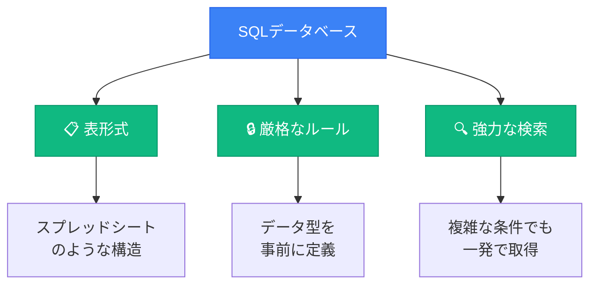

**特徴**：
- ✅ **きっちり整理** - 列が事前に決まっている
- ✅ **関連性が明確** - 外部キーで確実に繋がる
- ✅ **複雑な検索が得意** - JOINで複数テーブルを結合
- ❌ **自由度が低い** - 後から項目を追加しづらい

### NoSQL型データベース - 「ゆるふわ型」

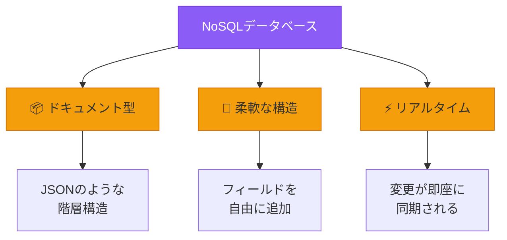

**特徴**：
- ✅ **自由度が高い** - 項目を自由に追加・削除
- ✅ **階層構造** - ネストで関連データをまとめる
- ✅ **リアルタイム同期** - 変更が即座に反映
- ❌ **複雑な検索が苦手** - 事前のインデックス設計が必要

## 📊 具体例で理解：同じデータの保存方法

### SQL型での保存（Supabase）

```
usersテーブル:
| id | name      | email              |
|----|-----------|-------------------|
| 1  | 山田太郎  | yamada@example.com |
| 2  | 田中花子  | tanaka@example.com |

postsテーブル:
| id | user_id | content           | created_at |
|----|---------|-------------------|------------|
| 1  | 1       | 今日は良い天気！  | 2025-01-10 |
| 2  | 2       | ランチなう        | 2025-01-10 |
```

### NoSQL型での保存（Firebase）

```json
// ユーザー1のデータ（全部まとめて）
{
  "id": 1,
  "name": "山田太郎",
  "email": "yamada@example.com",
  "posts": [
    {
      "id": 1,
      "content": "今日は良い天気！",
      "created_at": "2025-01-10",
      "images": ["photo1.jpg"],  // 自由に項目追加OK
      "location": "東京タワー"    // これもOK
    }
  ],
  "favorites": ["ラーメン"]  // ユーザーごとに違う項目OK
}
```

## 🎯 6つの観点で徹底比較

| 観点 | SQL（Supabase） | NoSQL（Firebase） | 勝者 |
|------|----------------|------------------|------|
| **1. データ構造** | 📋 表形式（テーブル） | 📦 ドキュメント型（JSON） | 用途次第 |
| **2. 自由度** | ❌ 列は事前定義必須 | ✅ フィールド自由追加 | NoSQL 🏆 |
| **3. 検索能力** | ✅ 複雑な検索が得意 | ❌ 複雑な検索は苦手 | SQL 🏆 |
| **4. データ整合性** | ✅ 厳格なルール | ⚠️ アプリ側で管理 | SQL 🏆 |
| **5. 学習難易度** | ⚠️ SQL文法（でもAIが書く） | ✅ JavaScript風 | NoSQL 🏆 |
| **6. リアルタイム** | ⚠️ 追加実装が必要 | ✅ 標準装備 | NoSQL 🏆 |

## 🌐 実際のサービスはどっちを使ってる？

> ⚠️ **重要**: 実際の大規模サービスは、**SQLとNoSQLを組み合わせたハイブリッド構成**が一般的です。用途に応じて最適なデータベースを選択しています。

### SQLを主に使用しているサービス

| サービス | 主なDB | 理由 | 具体的な用途 |
|---------|--------|------|------------|
| **GitHub** | MySQL | 複雑な権限管理とリレーション | リポジトリ権限、Issue管理、PR管理、ユーザー情報 |
| **Amazon（ECサイト）** | Oracle/MySQL | 整合性が最重要 | 在庫管理、注文処理、決済処理（ただし、DynamoDBも併用） |

### NoSQLを主に使用しているサービス

| サービス | 主なDB | 理由 | 具体的な用途 |
|---------|--------|------|------------|
| **Discord** | Cassandra/ScyllaDB | リアルタイム必須、高スループット | チャットメッセージ、音声通話状態 |
| **Netflix** | Cassandra | 柔軟なデータ構造、大規模分散 | ユーザープロファイル、視聴履歴、レコメンデーション |
| **Medium** | MongoDB | コンテンツの多様性、柔軟なスキーマ | 記事、コメント、ハイライト |

### ハイブリッド構成（SQL + NoSQL）のサービス

| サービス | SQL用途 | NoSQL用途 | 理由 |
|---------|---------|-----------|------|
| **Instagram** | PostgreSQL（メタデータ） | Cassandra（タイムライン） | メタデータは複雑な検索が必要、タイムラインは高速読み取りが必要 |
| **Twitter/X** | MySQL（ユーザーデータ） | Cassandra（タイムライン） | ユーザー情報は整合性重要、タイムラインは大規模分散が必要 |
| **Uber** | PostgreSQL（位置情報、マッチング） | Cassandra（リアルタイム位置） | 位置情報の高速検索とリアルタイム更新の両立 |
| **Spotify** | PostgreSQL（メタデータ） | Cassandra（再生履歴、プレイリスト） | メタデータは検索が必要、再生履歴は大規模書き込みが必要 |
| **YouTube** | MySQL（動画メタデータ） | BigTable/Cassandra（コメント、視聴履歴） | メタデータは検索が必要、コメントは大規模分散が必要 |
| **Facebook** | MySQL（友達関係、プロフィール） | Cassandra（メッセージ、タイムライン） | 関係性は整合性重要、メッセージは大規模分散が必要 |
| **Airbnb** | MySQL（予約管理、ユーザー情報） | Elasticsearch（検索ログ） | 予約は整合性重要、検索は高速検索が必要 |

```mermaid
graph TB
    A[ハイブリッド型] --> B[Instagram]
    A --> C[Twitter/X]
    A --> D[Uber]
    A --> E[Spotify]
    A --> F[YouTube]
    A --> G[Facebook]
    A --> H[Airbnb]

    B --> B1[SQL: メタデータ]
    B --> B2[NoSQL: タイムライン]

    C --> C1[SQL: ユーザーデータ]
    C --> C2[NoSQL: タイムライン]

    D --> D1[SQL: 位置情報]
    D --> D2[NoSQL: リアルタイム位置]

    E --> E1[SQL: メタデータ]
    E --> E2[NoSQL: 再生履歴]

    F --> F1[SQL: 動画メタデータ]
    F --> F2[NoSQL: コメント]

    G --> G1[SQL: 友達関係]
    G --> G2[NoSQL: メッセージ]

    H --> H1[SQL: 予約管理]
    H --> H2[NoSQL: 検索ログ]

    style A fill:#3b82f6,stroke:#2563eb,color:#fff
    style B fill:#10b981,stroke:#059669,color:#fff
    style C fill:#10b981,stroke:#059669,color:#fff
    style D fill:#10b981,stroke:#059669,color:#fff
    style E fill:#10b981,stroke:#059669,color:#fff
    style F fill:#10b981,stroke:#059669,color:#fff
    style G fill:#10b981,stroke:#059669,color:#fff
    style H fill:#10b981,stroke:#059669,color:#fff
```

## 🎯 じゃあ初心者はどっちを選ぶべき？

### 結論：まずはSQLから始めるのがオススメ！

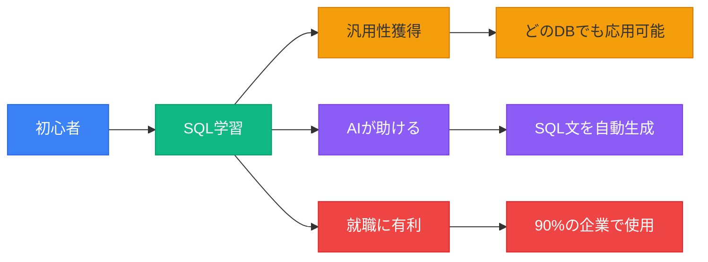

### 3つの強力な理由

#### 理由1：汎用性が高い
```
SQL学習 → どのデータベースでも応用可能
- PostgreSQL（Supabase）
- MySQL
- SQLite
- SQL Server
- Oracle
```

#### 理由2：AIが助けてくれる
```
従来：SQL文法暗記に数ヶ月
↓
AI時代：「こういうデータが欲しい」と言えば即生成
```

**Cursorへの指示例**：
```
ユーザーごとの投稿数を多い順に表示するSQLを書いてください。
投稿者の名前、メールアドレス、投稿数を含めてください。
```

#### 理由3：就職・転職に有利
- 企業の**90%以上**がSQLデータベースを使用
- データ分析の**必須スキル**
- NoSQLより**求人が多い**

## 🔄 でも、NoSQLも後で学ぶべき！

### NoSQLが最適なケース

#### ケース1：リアルタイムチャットアプリ
```javascript
// Firebaseなら3行でリアルタイム同期
db.collection('messages').onSnapshot((snapshot) => {
  // 新しいメッセージが自動的に表示される
});
```

#### ケース2：IoTデバイスのログ
```json
{
  "device_id": "sensor_001",
  "temperature": 23.5,
  "new_sensor": 1234  // 突然追加されてもOK！
}
```

## 💡 この章のまとめ

- ✅ SQL = **きっちり型**、NoSQL = **ゆるふわ型**
- ✅ SQLは**複雑な検索**が得意、NoSQLは**リアルタイム**が得意
- ✅ 有名サービスは**用途に応じて使い分け**ている
- ✅ 初心者は**SQLから始める**のがオススメ
- ✅ AI時代なら**SQL文法を覚える必要なし**

## 🚀 次の章への橋渡し

SQL vs NoSQLの違いを理解し、今回SQLを選ぶ理由が明確になりました。
次の第4章では、いよいよSupabaseを使って本格的なデータベースを構築します。
30分で本番環境レベルのデータベースが完成します！

---

# 第4章：Supabaseで本格DB構築（30分で完成）

## 🎯 この章で学ぶこと

- **Supabaseプロジェクト**を作成し、本番環境を準備する
- **Table Editor**を使って視覚的にテーブルを作成する
- **AIにSQL生成を任せて**、複雑なテーブル構造も瞬時に実装する
- **APIキーの管理方法**を学び、セキュアな開発環境を構築する
- **リアルタイム機能**を有効化し、最新のWeb技術を体験する

## 📌 この章の位置づけ

第3章で学んだSQLデータベースを、実際にSupabaseで構築します。
スプレッドシートで作った構造を、本物のデータベースとして実装します。
この章の完了後、あなたのアプリは実際にデータを保存・管理できるようになります。

## 🚀 なぜSupabaseを選ぶのか？

### Supabaseの圧倒的なメリット

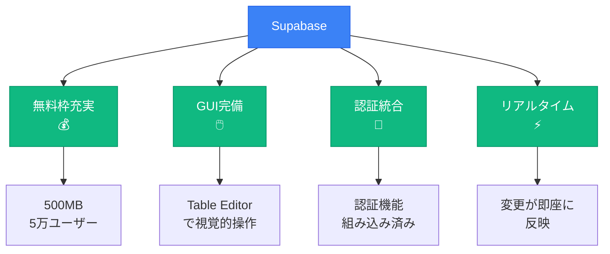

### 他の選択肢との比較

| サービス | 種類 | 特徴 | 料金 | 向いている用途 |
|---------|------|------|------|--------------|
| **Supabase** | SQL (PostgreSQL) | オールインワン、認証付き | **無料枠充実** | 一般的なWebアプリ |
| **Firebase** | NoSQL | リアルタイム同期 | 無料枠あり | チャット、ゲーム |
| **PlanetScale** | SQL (MySQL) | スケーラブル | 有料中心 | 大規模アプリ |
| **MongoDB Atlas** | NoSQL | 柔軟なスキーマ | 無料枠少ない | ドキュメント型データ |

## 🎯 Supabaseプロジェクト作成

### ステップ1：アカウント作成

1. **[supabase.com](https://supabase.com) にアクセス**
2. **「Start your project」をクリック**
3. **GitHubアカウントでサインイン**（推奨）

### ステップ2：新規プロジェクト作成

**入力項目**：
- **Organization**: 個人名 or チーム名
- **Project name**: `vibe-coder-sns`
- **Database Password**: 強力なパスワード（**必ず保存！**）
- **Region**: **Tokyo（東京）**を選択
- **Pricing Plan**: **Free（無料）**

プロジェクト作成には約2分かかります。その間に次の説明を読みましょう。

## 🔑 APIキーの管理（超重要！）

### 2025年11月最新：新しいAPIキー体系

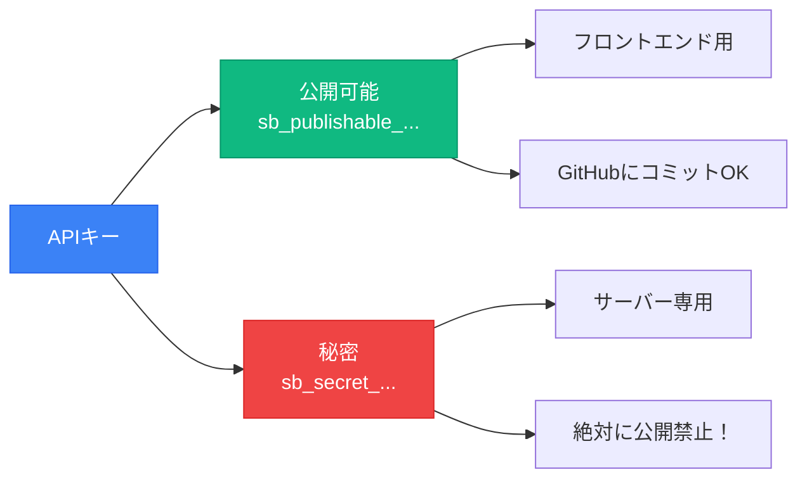

### APIキー取得方法

1. **Settings → API** に移動
2. 以下をコピー：

| キーの種類 | 使用場所 | 例 |
|-----------|---------|-----|
| **Project URL** | 両方 | `https://xxxxx.supabase.co` |
| **Publishable key** | フロントエンド | `sb_publishable_...` |
| **Secret key** | サーバーのみ | `sb_secret_...` |

### .env.localファイルの作成

**Cursorへの指示**：
```
プロジェクトルートに.env.localファイルを作成して、
以下の環境変数を設定してください：
- NEXT_PUBLIC_SUPABASE_URL
- NEXT_PUBLIC_SUPABASE_PUBLISHABLE_KEY
- SUPABASE_SECRET_KEY

また、.gitignoreに.env.localが含まれていることを確認してください。
```

## 🛠️ Table Editorでテーブル作成

### GUIで簡単テーブル作成

1. **Supabase Dashboard → Table Editor**
2. **「New Table」をクリック**

### usersテーブルの作成

**Cursorへの指示**：
```
Supabaseのusersテーブルを作成したいです。
以下のカラムを含めてください：
- id (UUID, 主キー)
- email (テキスト, ユニーク, NOT NULL)
- username (テキスト, NOT NULL)
- avatar_url (テキスト)
- created_at (タイムスタンプ, デフォルト: now())
- updated_at (タイムスタンプ, 自動更新)

Table Editorで設定する項目を教えてください。
```

実際の設定：

| Column | Type | Default | Constraints |
|--------|------|---------|------------|
| id | uuid | `gen_random_uuid()` | Primary Key |
| email | text | - | Unique, Not Null |
| username | text | - | Not Null |
| avatar_url | text | - | - |
| created_at | timestamptz | `now()` | Not Null |
| updated_at | timestamptz | `now()` | Not Null |

## 🤖 AIにテーブル作成を任せる

### 複雑なテーブル構造もAIで一発生成

**Cursorへの指示**：
```
SupabaseのSQL Editorで実行するテーブル作成文を生成してください。

要件：
- usersテーブル：メール、ユーザー名、アバター画像
- postsテーブル：投稿内容、画像URL、投稿者への外部キー
- likesテーブル：誰がどの投稿にいいねしたか
- followsテーブル：フォロー関係
- UUID型の主キー、タイムスタンプ付き
- ユーザー削除時は投稿も削除（CASCADE）
- 適切なインデックスも作成

PostgreSQL用のCREATE TABLE文を生成してください。
```

**生成されたSQLをSQL Editorにコピペして実行！**

## 🔗 リレーション（外部キー）の設定

### なぜ外部キー制約が必要？

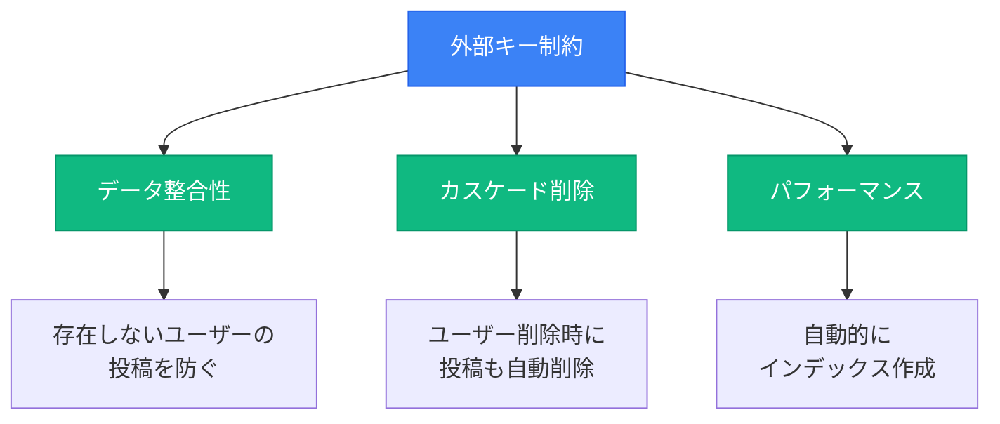

### Table Editorでの設定方法

1. `posts`テーブルを開く
2. `user_id`カラムの設定を編集
3. **Foreign Key Relation**：
   - Referenced table: `users`
   - Referenced column: `id`
   - On delete: `CASCADE`
   - On update: `CASCADE`

## 📝 テストデータの投入

### AIにサンプルデータも生成させる

**Cursorへの指示**：
```
Supabaseでテストデータを投入するSQLを作成してください。

要件：
- usersテーブルに3人の日本人っぽいテストユーザー
- 各ユーザーに2〜3個の投稿
- 日本語のカジュアルな投稿内容
- いいねとフォロー関係も含める
- アバター画像はui-avatars.comのダミー画像を使用

INSERT文を生成してください。
```

**生成されたSQL → SQL Editorで実行！**

## ⚡ リアルタイム機能の有効化

### データの変更を即座に反映

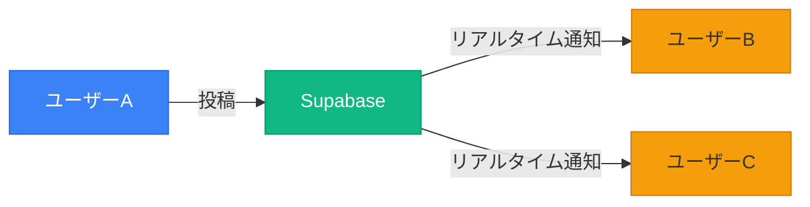

### 有効化方法

1. **Dashboard → Database → Replication**
2. テーブルを選択（posts、likes）
3. **「Enable Replication」をON**

**Cursorへの指示**：
```
Supabaseのリアルタイム機能を使って、
新しい投稿が追加されたら自動的に画面に表示される
React/Next.jsのコードを生成してください。
```

## 🧪 動作確認

### Table Editorで確認

1. **Table Editor → postsテーブル**
2. **「Insert row」で新しい投稿を追加**
3. データが正しく保存されることを確認

### API経由でテスト

ブラウザで以下のURLにアクセス：
```
https://xxxxx.supabase.co/rest/v1/posts?select=*
```

**Cursorへの指示**：
```
SupabaseのJavaScript SDKを使って、
投稿一覧を取得するコードを作成してください。
エラーハンドリングも含めてください。
```

## 💡 この章のまとめ

- ✅ Supabaseで**本番環境レベル**のデータベースを構築した
- ✅ **Table Editor**で視覚的にテーブルを作成した
- ✅ **AIにSQL生成**を任せて効率的に実装した
- ✅ **APIキー**を安全に管理する方法を学んだ
- ✅ **リアルタイム機能**を有効化した

## 🚀 次の章への橋渡し

Supabaseで本格的なデータベースが完成しました。
しかし、誰でもデータを操作できる状態では危険です。
次の第5章では、RLS（Row Level Security）を設定して、セキュアなデータベースを構築します。

---

# 第5章：RLSでセキュアなデータ管理

## 🎯 この章で学ぶこと

- **RLS（Row Level Security）**の概念と重要性を理解する
- **データベースレベルのセキュリティ**を実装する
- **AIにポリシー作成を任せて**、複雑なルールも簡単に設定する
- **よく使うポリシーパターン**を習得する
- **動作確認の方法**を学び、セキュリティが機能していることを検証する

## 📌 この章の位置づけ

第4章で作成したデータベースは、現在「誰でも全データを操作できる」危険な状態です。
この章では、RLSを設定してデータベースレベルでセキュリティを確保します。
これにより、本番環境で安全に運用できるデータベースが完成します。

## 🔒 RLSとは何か？

### Row Level Security = 行レベルのセキュリティ

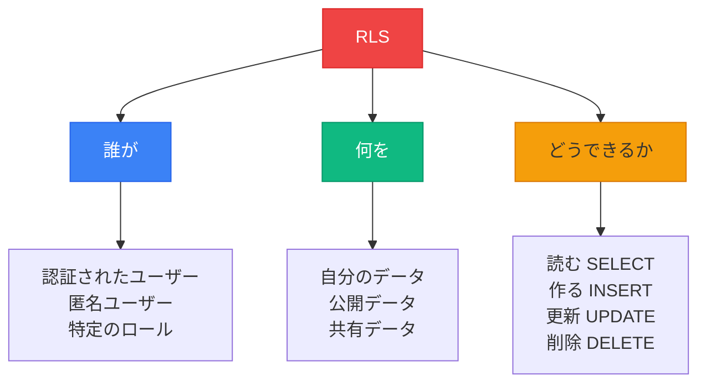

### なぜRLSが重要なのか？

#### ❌ アプリケーション側だけのセキュリティ（危険）

```javascript
// フロントエンドのコード（簡単に改ざん可能）
if (user.id === post.user_id) {
  // 削除ボタンを表示
}
// でも、開発者ツールで直接APIを叩けば削除できてしまう！
```

#### ✅ データベース側でもセキュリティ（安全）

```sql
-- データベースレベルで制御（改ざん不可能）
CREATE POLICY "Users can delete own posts"
ON posts FOR DELETE
USING (auth.uid() = user_id);
-- APIを直接叩いても、他人の投稿は削除できない！
```

## 🛡️ RLSの仕組み

### 二重の防御壁


1. **フロントエンド**：UIレベルの制御（ユーザビリティ）
2. **バックエンド**：ビジネスロジックの検証
3. **データベース（RLS）**：最後の砦（絶対的な保護）

## 🚀 RLSポリシーの実装

### ステップ1：RLSを有効化

**Cursorへの指示**：
```
SupabaseでRLSを有効化するSQLを生成してください。
users、posts、likes、followsテーブルすべてに対して
RLSを有効化したいです。
```

生成されるSQL：
```sql
ALTER TABLE users ENABLE ROW LEVEL SECURITY;
ALTER TABLE posts ENABLE ROW LEVEL SECURITY;
ALTER TABLE likes ENABLE ROW LEVEL SECURITY;
ALTER TABLE follows ENABLE ROW LEVEL SECURITY;
```

### ステップ2：基本的なポリシー設定

**Cursorへの指示**：
```
postsテーブルに以下のRLSポリシーを作成してください：

1. 誰でも投稿を閲覧可能（SELECT）
2. ログインユーザーのみ新規投稿可能（INSERT）
3. 投稿者本人のみ編集可能（UPDATE）
4. 投稿者本人のみ削除可能（DELETE）

PostgreSQL用のCREATE POLICY文を生成してください。
```

## 📚 よく使うRLSポリシーパターン

### パターン1：公開コンテンツ（SNSの投稿）

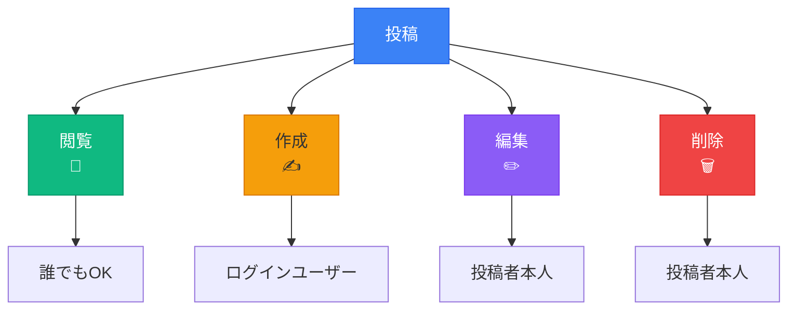

**Cursorへの指示**：
```
「投稿は誰でも見られるが、作成はログインユーザーのみ、
編集・削除は投稿者本人のみ」というRLSポリシーを作成してください。
```

### パターン2：プライベートデータ（ユーザー設定）

**Cursorへの指示**：
```
「ユーザー設定は本人のみがすべての操作可能」
というRLSポリシーを作成してください。
```

### パターン3：フォロー限定コンテンツ

**Cursorへの指示**：
```
「プライベート投稿はフォロワーのみ閲覧可能」
というRLSポリシーを作成してください。
followsテーブルとJOINする必要があります。
```

## 🧪 RLSの動作確認

### 確認方法1：Table Editorでテスト

1. **Authentication → Users**で複数のテストユーザーを作成
2. 各ユーザーでログインして操作を試す
3. 他人のデータが操作できないことを確認

### 確認方法2：エラーケーステスト

| テスト内容 | 期待される結果 | 確認方法 |
|-----------|---------------|---------|
| 他人の投稿を削除しようとする | エラー（RLS） | コンソールログ確認 |
| ログインせずに投稿しようとする | エラー（RLS） | 認証なしでAPI実行 |
| 他人のプロフィールを編集しようとする | エラー（RLS） | 別ユーザーでテスト |
| フォローしていない人の限定投稿を見る | 取得できない | データが返らないことを確認 |

### 確認方法3：SQL Editorで検証

**Cursorへの指示**：
```
RLSポリシーが正しく動作しているか確認するSQLクエリを作成してください。
特定のユーザーとしてクエリを実行する方法も教えてください。
```

## 🎯 実践的なポリシー例

### Instagram風のポリシー設定

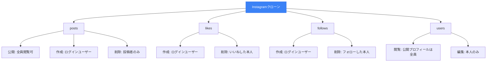

**Cursorへの指示**：
```
Instagram風のSNSアプリ用のRLSポリシーセットを作成してください。

要件：
- 投稿は全員が閲覧可能、投稿者のみ削除可能
- いいねはログインユーザーが付けられ、本人のみ取り消し可能
- フォローはログインユーザーができ、本人のみ解除可能
- ユーザープロフィールは公開、編集は本人のみ

すべてのテーブルに対するCREATE POLICY文を生成してください。
```

## ⚠️ よくある失敗と対処法

### 失敗1：RLSを有効化したらデータが見えなくなった

**原因**：ポリシーを1つも設定していない
**解決**：最低1つのポリシーを設定する

**Cursorへの指示**：
```
RLSを有効化した後、一時的にすべてのデータを
閲覧可能にするポリシーを作成してください。
開発中のデバッグ用です。
```

### 失敗2：service_roleキーを使ってもRLSが効いてしまう

**原因**：クライアント側でservice_roleキーを使用している
**解決**：service_roleキーはサーバー側のみで使用

### 失敗3：ポリシーが複雑になりすぎる

**原因**：1つのポリシーですべてを制御しようとしている
**解決**：シンプルな複数のポリシーに分割

## 💡 この章のまとめ

- ✅ **RLS**はデータベースレベルの最強のセキュリティ
- ✅ **二重の防御壁**で確実にデータを保護
- ✅ **AIにポリシー作成を任せる**ことで効率的に実装
- ✅ **よく使うパターン**を理解すれば応用が効く
- ✅ **動作確認**を必ず行い、セキュリティを検証する

## 🚀 次の章への橋渡し

RLSの設定により、セキュアなデータベースが完成しました。
次の第6章では、AIを活用したDB設計の自動化について学びます。
要件定義書からER図、そしてSQL文まで、すべてAIに生成させる方法を習得します。

---

# 第6章：AIによるDB設計の完全自動化

## 🎯 この章で学ぶこと

- **要件定義書からER図を自動生成**する方法を習得する
- **AIに最適なDB設計を提案**させるテクニックを学ぶ
- **命名規則の重要性**を理解し、統一された設計を実現する
- **複雑なビジネスロジックも自動実装**する方法を知る
- **AIが生成したコードの検証方法**を身につける

## 📌 この章の位置づけ

第5章まででデータベースの基礎と実装方法を学びました。
この章では、その知識をベースに「AIに設計・実装を任せる」方法を習得します。
これにより、開発スピードが10倍以上に向上します。

## ⚡ 従来の方法 vs AI駆動の方法

### 時間比較：4時間30分 → 12分（22倍高速！）

```mermaid
graph TB
    subgraph "従来の方法（4時間30分）"
        A1[要件分析<br/>30分] --> A2[エンティティ抽出<br/>30分]
        A2 --> A3[属性定義<br/>1時間]
        A3 --> A4[リレーション設計<br/>1時間]
        A4 --> A5[ER図作成<br/>30分]
        A5 --> A6[SQL文作成<br/>1時間]
    end

    subgraph "AI駆動の方法（12分）"
        B1[要件をAIに投げる<br/>1分] --> B2[ER図自動生成<br/>30秒]
        B2 --> B3[SQL自動生成<br/>30秒]
        B3 --> B4[レビュー・修正<br/>10分]
    end

    style A1 fill:#ef4444,stroke:#dc2626,color:#fff
    style A2 fill:#ef4444,stroke:#dc2626,color:#fff
    style A3 fill:#ef4444,stroke:#dc2626,color:#fff
    style A4 fill:#ef4444,stroke:#dc2626,color:#fff
    style A5 fill:#ef4444,stroke:#dc2626,color:#fff
    style A6 fill:#ef4444,stroke:#dc2626,color:#fff

    style B1 fill:#10b981,stroke:#059669,color:#fff
    style B2 fill:#10b981,stroke:#059669,color:#fff
    style B3 fill:#10b981,stroke:#059669,color:#fff
    style B4 fill:#10b981,stroke:#059669,color:#fff
```

## 🎯 実践：要件定義からER図を生成

### ステップ1：要件定義書の準備

**例：ECサイトの要件定義**
```markdown
## システム要件
- オンラインショッピングサイト
- ユーザー登録・ログイン機能
- 商品の検索・閲覧
- カート機能
- 注文・決済処理
- 注文履歴の確認
- 商品レビュー機能
- お気に入り機能
- 在庫管理
```

### ステップ2：AIへの指示

**Cursorへの指示**：
```
以下のシステム要件定義書を基に、
データベースのER図をMermaid記法で作成してください。

要件：
- オンラインショッピングサイト
- ユーザー登録・ログイン機能
- 商品の検索・閲覧
- カート機能
- 注文・決済処理
- 注文履歴の確認
- 商品レビュー機能
- お気に入り機能
- 在庫管理

各テーブルには以下を含めてください：
- 主キー（id）
- 作成日時（created_at）
- 更新日時（updated_at）
- 必要な外部キー
- 適切なインデックス

また、リレーションシップも明確に示してください。
```

### ステップ3：生成されたER図

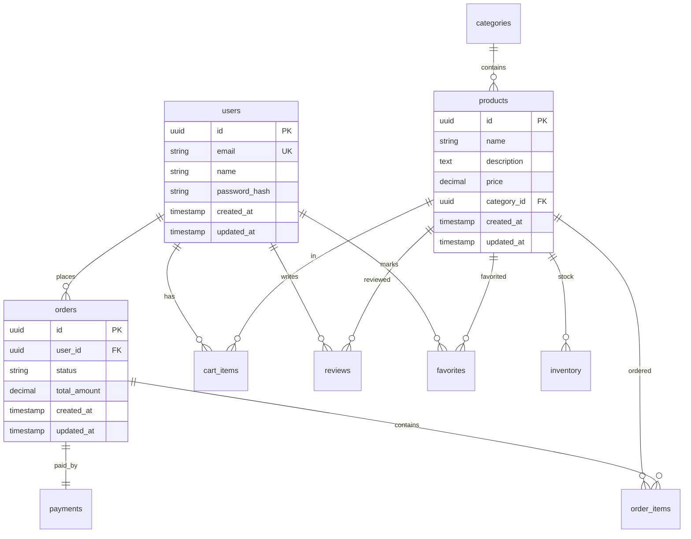

## 📝 命名規則の重要性

### 統一されたルールがチーム開発を救う

```mermaid
graph TB
    A[命名規則] --> B[テーブル名]
    A --> C[カラム名]
    A --> D[インデックス名]

    B --> B1[複数形<br/>users, posts]
    B --> B2[snake_case<br/>user_profiles]

    C --> C1[主キー: id]
    C --> C2[外部キー: xxx_id]
    C --> C3[日時: xxx_at]
    C --> C4[フラグ: is_xxx]

    D --> D1[idx_テーブル_カラム]

    style A fill:#3b82f6,stroke:#2563eb,color:#fff
    style B fill:#10b981,stroke:#059669,color:#fff
    style C fill:#10b981,stroke:#059669,color:#fff
    style D fill:#10b981,stroke:#059669,color:#fff
```

### 命名規則チートシート

| 種類 | ルール | 良い例 | 悪い例 |
|------|--------|-------|-------|
| **テーブル名** | 複数形、snake_case | users, user_profiles | User, UserProfile |
| **主キー** | 単純に`id` | id | user_id, userId |
| **外部キー** | `参照先_id` | user_id, post_id | user, postId |
| **日時** | `_at`で終わる | created_at, deleted_at | created, create_time |
| **フラグ** | `is_`で始まる | is_active, is_verified | active, verified |
| **数量** | `_count`で終わる | like_count, view_count | likes, views |

### なぜ重要？

1. **AIの精度向上** - 統一された命名規則でAIが正確なコードを生成
2. **チーム開発** - 全員が同じルールで理解しやすい
3. **バグ削減** - 命名の一貫性でミスを防ぐ
4. **保守性** - 後から見ても理解しやすい

## 🚀 複雑なビジネスロジックの自動実装

### 例：在庫管理システム

**Cursorへの指示**：
```
ECサイトの在庫管理システムを実装してください。

要件：
1. 商品の在庫数を管理
2. 注文時に在庫を自動的に減らす
3. 在庫が0になったら注文できない
4. キャンセル時に在庫を戻す
5. 在庫数の変更履歴を記録

以下を生成してください：
- テーブル構造（CREATE TABLE）
- トリガー関数（在庫の自動更新）
- RLSポリシー
- 在庫チェックの関数
```

### AIが生成する高度な機能

1. **トリガー** - データ変更時の自動処理
2. **ストアドプロシージャ** - 複雑なビジネスロジック
3. **ビュー** - 複雑なJOINを簡略化
4. **マテリアライズドビュー** - パフォーマンス最適化

## 🧪 AIが生成したコードの検証方法

### 3段階の検証プロセス

```mermaid
flowchart LR
    A[生成されたコード] --> B[構文チェック]
    B --> C[ロジック確認]
    C --> D[実データテスト]

    B --> B1[SQL Editorで<br/>構文エラー確認]
    C --> C1[ビジネス要件と<br/>照合]
    D --> D1[実際にデータを<br/>入れて動作確認]

    style A fill:#3b82f6,stroke:#2563eb,color:#fff
    style B fill:#10b981,stroke:#059669,color:#fff
    style C fill:#f59e0b,stroke:#d97706
    style D fill:#ef4444,stroke:#dc2626,color:#fff
```

### 検証チェックリスト

**Cursorへの指示**：
```
生成されたデータベース設計を検証するチェックリストを作成してください。
以下の観点を含めてください：

1. データ型の適切性
2. 主キー・外部キーの設定
3. インデックスの最適性
4. RLSポリシーの網羅性
5. パフォーマンスの考慮
6. 将来の拡張性
```

## 🎯 実践例：完全なSNSアプリのDB設計

### 要件定義

```markdown
## SNSアプリ「VibeSocial」の要件
- ユーザー登録・プロフィール管理
- 投稿（テキスト、画像、動画）
- いいね、コメント、シェア
- フォロー/フォロワー機能
- DM（ダイレクトメッセージ）
- 通知機能
- ハッシュタグ
- 検索機能
- プライバシー設定
```

### AIへの包括的な指示

**Cursorへの指示**：
```
SNSアプリ「VibeSocial」の完全なデータベース設計を行ってください。

上記の要件に基づいて、以下を生成してください：

1. ER図（Mermaid形式）
2. 全テーブルのCREATE TABLE文
3. 必要なインデックス
4. RLSポリシー（セキュリティ）
5. リアルタイム購読の設定
6. パフォーマンス最適化の提案
7. サンプルデータのINSERT文
8. よく使うクエリの例

PostgreSQL（Supabase）用に最適化してください。
```

## 💡 AIを最大限活用するコツ

### 効果的なプロンプトの書き方

| 要素 | 良い例 | 悪い例 |
|------|-------|-------|
| **具体性** | 「ユーザーの投稿を新しい順に10件取得」 | 「投稿を表示」 |
| **制約条件** | 「RLSでユーザー本人のみ削除可能に」 | 「セキュリティを考慮」 |
| **技術指定** | 「PostgreSQL 15用、Supabase対応」 | 「SQL」 |
| **出力形式** | 「CREATE TABLE文で出力」 | 「テーブル作って」 |

### 段階的な指示

1. **まず概要** → 「SNSアプリのER図を作成」
2. **次に詳細** → 「postsテーブルの詳細設計」
3. **最後に最適化** → 「パフォーマンスを改善」

## 💡 この章のまとめ

- ✅ 要件定義書から**ER図を瞬時に生成**できる
- ✅ **命名規則の統一**でAIの精度が向上する
- ✅ **複雑なビジネスロジック**もAIに実装させられる
- ✅ **3段階の検証**で品質を保証する
- ✅ **効果的なプロンプト**で望む結果を得られる

## 🚀 次の章への橋渡し

AIによるDB設計の自動化を習得しました。
最後の第7章では、今日学んだすべてを統合して、実践的な演習を行います。
実際にあなたのアプリケーションのデータベースを構築していきましょう。

---

# 第7章：実践演習とまとめ

## 🎯 この章で学ぶこと

- **学んだ知識を統合**して、実際のアプリDBを構築する
- **よくあるトラブルと対処法**を事前に知る
- **パフォーマンス最適化**の基本を理解する
- **次のステップ**として認証システムへの準備をする
- **AI時代の学習スタイル**を確立する

## 📌 この章の位置づけ

これまでの6章で学んだ知識を実践に移します。
実際にあなたのアプリケーションのデータベースを構築し、本番環境で使えるレベルまで仕上げます。
次回の認証システム実装への橋渡しも行います。

## 🛠️ 実践演習：あなたのアプリDBを作る

### 30分でできること

```mermaid
flowchart LR
    A[要件定義<br/>5分] --> B[ER図生成<br/>5分]
    B --> C[Supabase設定<br/>5分]
    C --> D[テーブル作成<br/>5分]
    D --> E[RLS設定<br/>5分]
    E --> F[動作確認<br/>5分]

    style A fill:#3b82f6,stroke:#2563eb,color:#fff
    style B fill:#10b981,stroke:#059669,color:#fff
    style C fill:#f59e0b,stroke:#d97706
    style D fill:#8b5cf6,stroke:#7c3aed,color:#fff
    style E fill:#ef4444,stroke:#dc2626,color:#fff
    style F fill:#fbbf24,stroke:#f59e0b
```

### ステップ1：要件定義（5分）

**Cursorへの指示テンプレート**：
```
私は[アプリの種類]を作っています。
以下の機能を実現したいです：

主な機能：
- [機能1]
- [機能2]
- [機能3]

この要件に基づいて、データベース設計を始めましょう。
まず、必要なテーブルとその関係を教えてください。
```

### ステップ2：ER図生成（5分）

**Cursorへの指示**：
```
上記の要件に基づいて、ER図をMermaid形式で生成してください。
各テーブルの主要なカラムも含めてください。
```

### ステップ3：Supabase設定（5分）

1. 新規プロジェクト作成
2. APIキーの取得
3. .env.localファイルの設定

### ステップ4：テーブル作成（5分）

**Cursorへの指示**：
```
ER図に基づいて、SupabaseのSQL Editorで実行する
CREATE TABLE文を生成してください。
外部キー制約とインデックスも含めてください。
```

### ステップ5：RLS設定（5分）

**Cursorへの指示**：
```
作成したテーブルに適切なRLSポリシーを設定してください。
一般的なSNSアプリのセキュリティレベルで。
```

### ステップ6：動作確認（5分）

- Table Editorでデータ投入
- RLSの動作確認
- APIエンドポイントのテスト

## 🚨 よくあるトラブルと対処法

### トラブルシューティングガイド

| 問題 | 原因 | 解決方法 |
|------|------|---------|
| **データが取得できない** | RLSが有効でポリシー未設定 | ポリシーを追加 or 一時的にRLS無効化 |
| **外部キーエラー** | 参照先レコードが存在しない | 参照先にデータを先に投入 |
| **Permission denied** | APIキーの種類が間違い | publishableキーを使用 |
| **テーブルが作成できない** | 予約語を使用 | テーブル名を変更 |
| **パフォーマンスが遅い** | インデックス未設定 | 頻繁に検索するカラムにインデックス追加 |

### デバッグのコツ

**Cursorへの指示**：
```
Supabaseで以下のエラーが発生しています：
[エラーメッセージをペースト]

原因と解決方法を教えてください。
```

## ⚡ パフォーマンス最適化

### 基本的な最適化テクニック

```mermaid
graph TB
    A[パフォーマンス最適化] --> B[インデックス]
    A --> C[クエリ最適化]
    A --> D[キャッシュ]

    B --> B1[頻繁に検索する<br/>カラムに設定]
    C --> C1[必要なデータのみ<br/>取得]
    D --> D1[変更の少ない<br/>データをキャッシュ]

    style A fill:#3b82f6,stroke:#2563eb,color:#fff
    style B fill:#10b981,stroke:#059669,color:#fff
    style C fill:#10b981,stroke:#059669,color:#fff
    style D fill:#10b981,stroke:#059669,color:#fff
```

### AIに最適化を依頼

**Cursorへの指示**：
```
以下のテーブルのパフォーマンスを改善したいです：
- postsテーブル（100万レコード想定）
- よく実行する検索：
  - 特定ユーザーの投稿一覧
  - 最新投稿の取得
  - ハッシュタグ検索

適切なインデックスとクエリ最適化の提案をしてください。
```

## 🔄 バックアップとリカバリ

### データを失わないために

| 環境 | バックアップ方法 | 頻度 | 保持期間 |
|------|---------------|------|---------|
| **開発環境** | 手動エクスポート | 大きな変更前 | 1週間 |
| **ステージング** | 自動バックアップ | 毎日 | 7日間 |
| **本番環境** | Supabase Pro | 毎日 | 30日間 |

**Cursorへの指示**：
```
Supabaseのデータベースをバックアップする方法を教えてください。
開発環境での手動バックアップ方法を詳しく。
```

## 🎓 AI時代の学習スタイル

### 従来の学習 vs Vibe Coder流

```mermaid
graph TB
    subgraph "従来の学習（非効率）"
        A1[SQL文法暗記<br/>1ヶ月] --> A2[ER図の書き方<br/>2週間]
        A2 --> A3[正規化理論<br/>1週間]
        A3 --> A4[やっと実装開始]
    end

    subgraph "Vibe Coder流（効率的）"
        B1[概念理解<br/>90分] --> B2[AIにSQL生成<br/>させる]
        B2 --> B3[動くものを<br/>作る]
        B3 --> B4[必要に応じて<br/>深掘り]
    end

    style A1 fill:#ef4444,stroke:#dc2626,color:#fff
    style A2 fill:#ef4444,stroke:#dc2626,color:#fff
    style A3 fill:#ef4444,stroke:#dc2626,color:#fff
    style A4 fill:#ef4444,stroke:#dc2626,color:#fff

    style B1 fill:#10b981,stroke:#059669,color:#fff
    style B2 fill:#10b981,stroke:#059669,color:#fff
    style B3 fill:#10b981,stroke:#059669,color:#fff
    style B4 fill:#10b981,stroke:#059669,color:#fff
```

**結果**：10倍速で実装、理解も実践を通じて深まる

### 実践的なプロンプト集

```markdown
# DB設計プロンプト
「[アプリ名]のデータベース設計をPostgreSQL用に作成してください」

# RLSポリシープロンプト
「[テーブル名]に[セキュリティ要件]のRLSポリシーを作成してください」

# 最適化プロンプト
「[問題の症状]を改善するための最適化方法を教えてください」

# デバッグプロンプト
「[エラーメッセージ]の原因と解決方法を教えてください」
```

## 🎊 本日の成果

### できるようになったこと

✅ **概念理解**
- データベースの必要性を体感
- スプレッドシートでリレーションを理解
- SQL vs NoSQLの違いを把握

✅ **実践スキル**
- Supabaseプロジェクトの作成
- Table Editorでのテーブル作成
- RLSによるセキュリティ設定
- リアルタイム機能の有効化

✅ **AI活用**
- 要件定義からER図を自動生成
- SQLクエリをAIで作成
- RLSポリシーをAIで設計
- トラブルシューティングもAIで解決

## 🚀 次回予告：認証システムとClerk実装

### Session 3-2で学ぶこと

```mermaid
graph LR
    A[今回のDB] --> B[認証システム]
    B --> C[Clerk実装]
    C --> D[ユーザー管理]
    D --> E[完全なアプリ]

    style A fill:#10b981,stroke:#059669,color:#fff
    style B fill:#3b82f6,stroke:#2563eb,color:#fff
    style C fill:#8b5cf6,stroke:#7c3aed,color:#fff
    style D fill:#f59e0b,stroke:#d97706
    style E fill:#ef4444,stroke:#dc2626,color:#fff
```

- **ログイン機能を10分で実装**
- **Google/GitHub認証の追加**
- **ユーザーごとのデータ管理**
- **Supabase × Clerkの連携**

### 重要な準備

📁 **supabase_prompt/**フォルダを確認
→ 次回使用する魔法のプロンプトが入っています！

## 💡 この章のまとめ

- ✅ 30分で**本番環境レベルのDB**を構築できる
- ✅ **トラブルシューティング**もAIで即解決
- ✅ **パフォーマンス最適化**の基本を理解した
- ✅ **AI時代の学習スタイル**で10倍速習得
- ✅ 次回の**認証システム実装**への準備完了

## 🚀 最後に：データベースは怖くない

### 覚えておいてほしいこと

- DBは「**整理された情報の保管庫**」に過ぎない
- スプレッドシートの**進化版**として理解する
- **AIが複雑な部分を代行**してくれる
- **Supabaseなら30分**で本番環境構築
- **失敗してもAIが助けて**くれる

> **"データベースマスターへの道は、AIと共に歩めば近道になる"**

**お疲れ様でした！** 🎊

あなたは今日、データベースの基礎から実装まで、すべてを習得しました。
次回の認証システム実装で、フルスタックアプリケーションが完成します！

---

## 付録：クイックリファレンス

### 用語集

| 用語 | 説明 | 例 |
|------|------|-----|
| **データベース（DB）** | データを整理して保存する仕組み | MySQL、PostgreSQL |
| **テーブル** | データを表形式で管理する単位 | users、posts |
| **レコード** | テーブルの1行分のデータ | 1人のユーザー情報 |
| **カラム** | テーブルの列（データの項目） | name、email |
| **主キー（PK）** | レコードを一意に識別するID | user_id = 1 |
| **外部キー（FK）** | 他テーブルとの関連を示すID | posts.user_id |
| **SQL** | データベースを操作する言語 | SELECT、INSERT |
| **RLS** | Row Level Security（行レベルセキュリティ） | 自分のデータのみ操作可 |
| **インデックス** | 検索を高速化する仕組み | idx_posts_user_id |

### AIプロンプト集

```markdown
# 基本操作
「全ユーザーを取得するSQL」
「ID=1のユーザーの投稿を取得するSQL」

# テーブル作成
「[アプリ名]のテーブル構造をCREATE TABLE文で」

# RLS設定
「投稿者本人のみ削除可能なRLSポリシー」

# 最適化
「[テーブル名]の検索を高速化するインデックス」

# デバッグ
「[エラーメッセージ]の解決方法」
```

### Supabaseチートシート

| 操作 | 場所 | 説明 |
|------|------|------|
| **テーブル作成** | Table Editor | GUIで視覚的に作成 |
| **SQL実行** | SQL Editor | 複雑な操作やAI生成コード |
| **RLS設定** | Authentication → Policies | セキュリティルール |
| **データ確認** | Table Editor | データの追加・編集・削除 |
| **ログ確認** | Logs | エラーやクエリログ |
| **APIテスト** | API Docs | エンドポイントの確認 |

### トラブル対処早見表

| 症状 | 確認項目 | 対処法 |
|------|---------|--------|
| データが見えない | RLS有効？ | ポリシー追加 |
| 保存できない | 必須項目？ | NOT NULL確認 |
| エラー500 | APIキー？ | 環境変数確認 |
| 遅い | インデックス？ | EXPLAIN実行 |