# 第1章：宿題レビューとWebアプリの仕組み

## 🎯 この章で学ぶこと

- **Vibe Coderマインドセット**の実践（AIと対話しながら開発）
- **Webアプリの3層構造**（レストラン厨房の比喩で理解）
- **APIの概念**（電話注文システムとしての理解）
- **環境変数の重要性**（家の鍵としての管理方法）
- **音声入力による効率化**（3-4倍の生産性向上）

## 📌 この章の位置づけ

第一回でGenspark AI Builderを使ってプロトタイプを作成しました。今回は、Webアプリケーションがどのように動くのか、その**仕組みと構造**を理解します。これにより、次章以降でCursorを使った本格的な開発に進む準備が整います。

---

# Part 1: 宿題振り返りとマインドセット（15分）

## 1. Genspark宿題の簡単な振り返り

### 🎯 宿題のチェックポイント（3分）

第一回Part 4で出された宿題を振り返ります。

#### ✅ 提出物確認

| チェック項目 | 確認内容 | 目的 |
|:----------|:--------|:-----|
| **動くアプリ** | Genspark AI Builderで作成 | プロトタイプ作成の体験 |
| **要件定義** | `requirements.md`を作成 | 要件の言語化練習 |
| **動作確認** | アプリが実際に動作する | 成果物の可視化 |

#### 💡 宿題から学んだこと

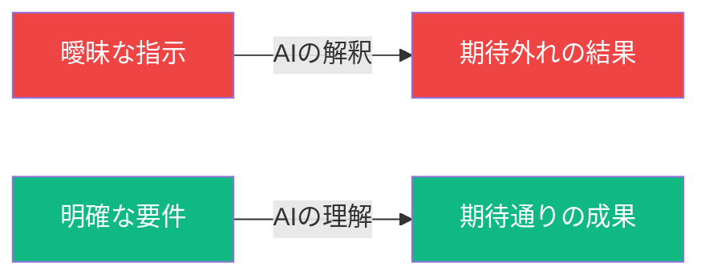

**Gensparkの強みと限界：**

| 側面 | Genspark AI Builder | 実務レベル（Cursor） |
|:-----|:-------------------|:-----------------|
| **強み** | プロトタイプが数分で完成 | 細かいカスタマイズ可能 |
| **限界** | カスタマイズが難しい | 初期設定が必要 |
| **用途** | アイデアの検証 | 本番アプリの開発 |

---

## 2. Vibe Coderマインドセットの実践

### 🧠 Vibe Coder = AIと対話しながら開発する人

第一回Part 1で学んだ内容の実践編です。

#### **Vibe Coderの3原則**

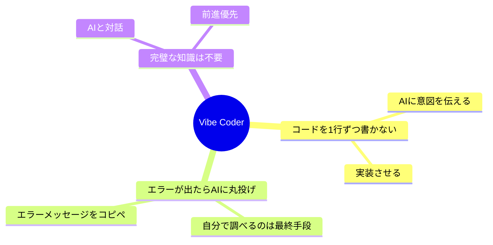

### 💡 実例: エラー対処の効率化

#### 🐌 従来の開発者（非効率）vs 🚀 Vibe Coder（効率的）

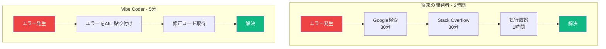

### 🎯 第二回の目標レベル

| レベル | ツール | 特徴 | 今回の位置 |
|:------|:------|:-----|:----------|
| **初級** | Genspark AI Builder | 完全自動生成 | 完了 ✅ |
| **中級** | Cursor + AI | コード制御可能、DB設計可能 | **👈 今ココ** |
| **上級** | 実務開発 | チーム開発・本番運用 | 第三回以降 |

---

# Part 2: Webアプリケーションの仕組み（30分）

## 1. 3層アーキテクチャ入門

### 🏗️ Webアプリの基本構造 = レストランの仕組み

Webアプリケーションの仕組みを、**レストラン**に例えて理解しましょう。

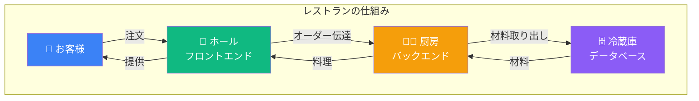

### 📖 各層の役割（レストラン比喩）

| レストラン | Webアプリ | 役割 | 具体例 |
|:----------|:---------|:-----|:-------|
| **ホール（接客）** | フロントエンド | お客様が見る部分 | ログイン画面、投稿一覧 |
| **厨房（調理）** | バックエンド | 処理・加工 | ログイン処理、データ保存 |
| **冷蔵庫（保管）** | データベース | 材料・データ保存 | ユーザー情報、投稿内容 |

#### 🎨 フロントエンド = レストランのホール

**役割**：お客様（ユーザー）が直接触れる部分

- **メニュー表** = 画面のデザイン（HTML/CSS）
- **注文の受付** = ボタンクリック、フォーム入力
- **料理の提供** = データの表示
- **雰囲気作り** = UI/UXデザイン

> **Cursorへの指示例**：
> 「SNSアプリのタイムライン画面を作ってください。投稿一覧が表示され、各投稿にはユーザー名、内容、投稿時刻、いいねボタンが含まれます。」

#### ⚙️ バックエンド = レストランの厨房

**役割**：注文を処理して料理（データ）を作る

- **レシピに従う** = ビジネスロジック実行
- **材料の準備** = データベースからデータ取得
- **調理** = データの加工・計算
- **品質管理** = セキュリティチェック

> **Cursorへの指示例**：
> 「投稿を保存するAPIを作ってください。ユーザーIDと投稿内容を受け取って、タイムスタンプを追加してデータベースに保存します。」

#### 🗄️ データベース = レストランの冷蔵庫

**役割**：材料（データ）を整理して保管

- **食材の保管** = データの永続化
- **賞味期限管理** = データの更新・削除
- **在庫管理** = データの検索・集計
- **分類整理** = テーブル設計

> **Cursorへの指示例**：
> 「SNSアプリ用のデータベーステーブルを設計してください。ユーザー情報、投稿、いいね、フォロー関係を管理できるようにします。」

---

## 2. フロントエンド・バックエンド・データベースの詳細

### 🎨 フロントエンド詳細

#### 2025年のモダンフロントエンド技術

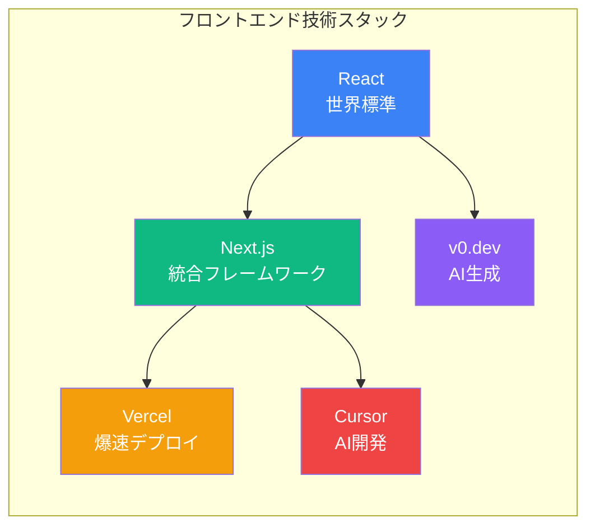

**なぜReact + Next.jsが主流なのか？**

| 理由 | メリット | Vibe Coderにとっての価値 |
|:-----|:--------|:---------------------|
| **世界標準** | 求人数No.1、情報豊富 | AIが最も理解している |
| **コンポーネント** | 部品の再利用 | 「ボタンを作って」で完成 |
| **統合環境** | 面倒な設定不要 | すぐに開発開始できる |
| **AI対応** | Cursor、v0が完全対応 | AIとの相性が最高 |

### ⚙️ バックエンド詳細

#### 2025年のモダンバックエンド選択肢

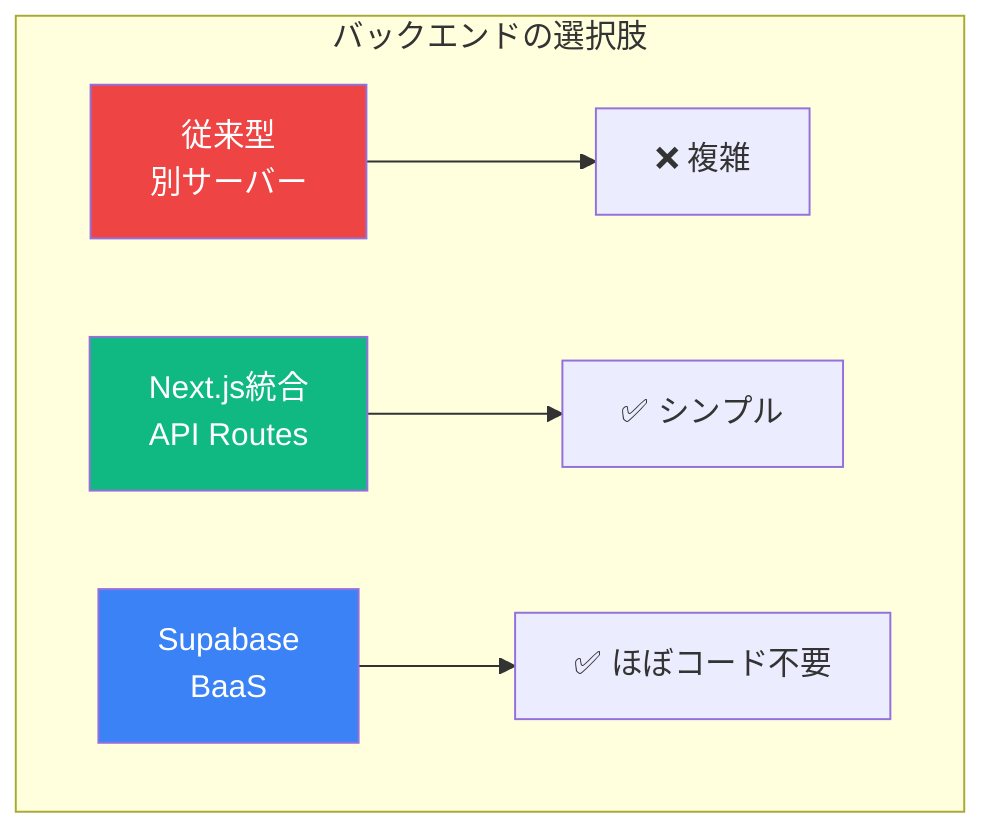

**主流アプローチの比較**

| アプローチ | 特徴 | 適している場面 |
|:----------|:-----|:-------------|
| **Next.js App Router** | フロント＋バック統合 | 中規模アプリ |
| **Supabase** | データベース＋認証パッケージ | 素早く作りたい |
| **従来型** | 完全に分離 | 大規模システム |

### 🗄️ データベース詳細

#### データベースの種類と選び方

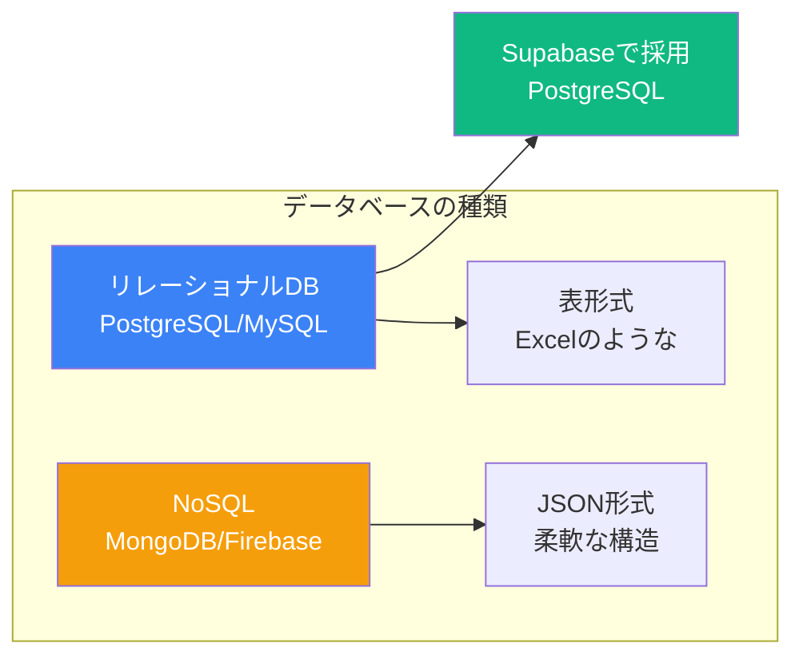

**2025年の推奨：PostgreSQL（Supabase経由）**

| 理由 | メリット |
|:-----|:--------|
| **無料** | オープンソース |
| **高機能** | JSON型もサポート |
| **Supabase採用** | 設定不要で使える |
| **AI理解度** | AIが最も得意 |

---

## 3. リクエスト・レスポンスの流れ

### 🔄 Webアプリの動作フロー

**例：SNSアプリで「投稿一覧」を表示するケース**

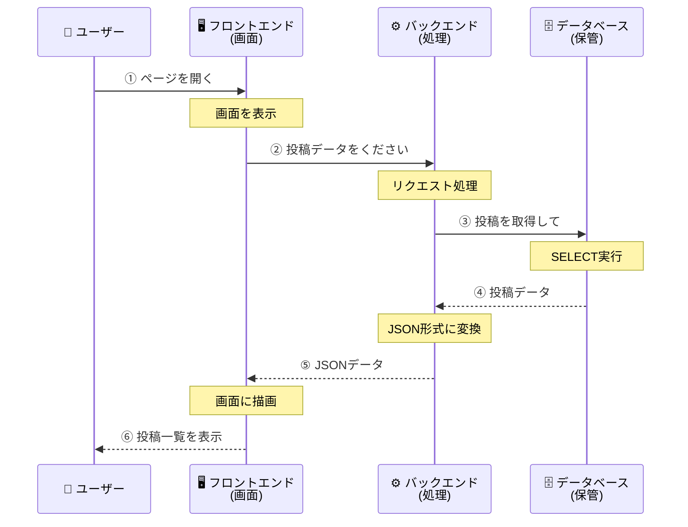

### 📊 各ステップでの処理内容

#### ステップ1：ユーザーがブラウザでアクセス
```
ユーザー: https://myapp.com/posts にアクセス
```

#### ステップ2：フロントエンドが起動

> **Cursorへの指示**：
> 「投稿一覧ページを作ってください。ページが表示されたら、APIから投稿データを取得して、画面に一覧表示します。」

#### ステップ3：バックエンドAPIが処理

> **Cursorへの指示**：
> 「投稿一覧を取得するAPIエンドポイントを作ってください。データベースから最新20件の投稿を取得して、JSON形式で返します。」

#### ステップ4：データベースからデータ取得

> **Cursorへの指示**：
> 「投稿テーブルから、作成日時の新しい順に20件取得するクエリを実行してください。」

#### ステップ5-6：レスポンスと画面表示

**返ってくるデータのイメージ：**

| フィールド | 内容 | 例 |
|:----------|:-----|:---|
| **id** | 投稿ID | 1, 2, 3... |
| **content** | 投稿内容 | "Hello World!" |
| **authorId** | 投稿者ID | 123 |
| **createdAt** | 投稿日時 | "2025-11-07 10:00" |

---

## 4. 実例: mygear.jp の仕組み

### 🎯 実際のWebアプリケーション事例

**mygear.jp** = ガジェット共有プラットフォーム（実在のサービス）

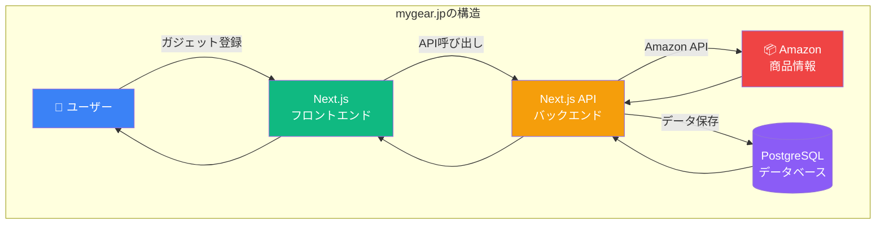

### 🔍 実際の処理フロー例

#### ユーザーが「ガジェットを登録」するケース

**処理の流れ：**

| ステップ | 処理内容 | 使用技術 |
|:--------|:--------|:--------|
| ① **入力** | 製品名を入力 | React フォーム |
| ② **API呼び出し** | バックエンドへ送信 | fetch API |
| ③ **外部API連携** | Amazon商品情報取得 | Amazon API |
| ④ **データ保存** | PostgreSQLに保存 | Prisma ORM |
| ⑤ **画面更新** | 登録完了を表示 | React State |

### 💡 mygear.jp から学ぶポイント

#### 本講義で作るSNSアプリとの類似性

| mygear.jp | 本講義で作るSNSアプリ | 共通の学び |
|:----------|:-------------------|:----------|
| ガジェット登録 | 投稿作成 | データの作成処理 |
| 一軍・二軍リスト | タイムライン | リスト表示の実装 |
| ユーザープロフィール | マイページ | ユーザー管理 |
| Amazon API連携 | OpenAI API連携 | 外部API活用 |
| PostgreSQL | Supabase (PostgreSQL) | データベース設計 |
| 認証機能 | Clerk認証 | ユーザー認証 |
| Vercelデプロイ | Vercelデプロイ | 本番公開方法 |

---

# Part 3: API - 外部サービスの力を借りる（25分）

## 1. APIとは何か

### 🔌 API = 他のサービスの機能を借りる仕組み

**APIを「電話注文サービス」に例えると：**

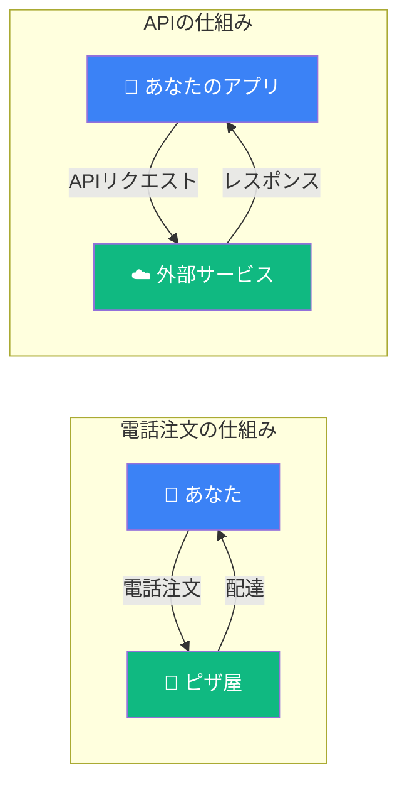

### 📞 身近なAPI活用例

| サービス | API | あなたが得られるもの | 作らなくて済むもの |
|:--------|:----|:-----------------|:---------------|
| **天気予報** | 天気API | 最新の天気データ | 気象観測所 |
| **ログイン** | Google認証API | 安全なログイン機能 | パスワード管理システム |
| **地図** | Google Maps API | 地図表示・経路検索 | 地図データベース |
| **決済** | Stripe API | クレジットカード決済 | 決済システム |
| **AI** | OpenAI API | ChatGPT機能 | AI学習モデル |

### 🌐 REST API（最も一般的な形式）

#### HTTPメソッドと用途

| メソッド | 用途 | 日常での例え | SNSアプリでの例 |
|:--------|:----|:-----------|:-------------|
| `GET` | データ取得 | 📖 メニューを見る | 投稿一覧を見る |
| `POST` | データ作成 | 📝 注文する | 新規投稿する |
| `PUT/PATCH` | データ更新 | ✏️ 注文変更 | 投稿を編集 |
| `DELETE` | データ削除 | 🗑️ 注文キャンセル | 投稿を削除 |

> **Cursorへの指示例**：
> 「投稿を管理するREST APIを作ってください。GET（一覧取得）、POST（新規作成）、PUT（更新）、DELETE（削除）のエンドポイントを用意します。」

---

## 2. APIとライブラリの違い

### 🤔 よくある混同を解決

**レストランで例えると：**

```mermaid
graph TB
    subgraph ライブラリ = 調理器具
        Tools[🔪 包丁<br/>🍳 フライパン<br/>🥄 おたま]
        Tools -->|自分で使う| YourKitchen[あなたの厨房]
    end

    subgraph API = デリバリーサービス
        Delivery[📞 電話注文<br/>🍕 ピザ配達<br/>🍱 弁当配達]
        Delivery -->|お金を払って利用| YourHome[あなたの家]
    end

    style Tools fill:#3b82f6,color:#fff
    style Delivery fill:#10b981,color:#fff
```

### 📊 APIとライブラリの比較表

| 項目 | ライブラリ | API | 例 |
|:-----|:----------|:----|:---|
| **実体** | 道具（コード） | サービス（外部） | axios vs OpenAI API |
| **場所** | あなたのPC内 | インターネット上 | ローカル vs クラウド |
| **通信** | 不要 | 必要 | オフラインOK vs オンライン必須 |
| **料金** | 基本無料 | 従量課金が多い | npm install vs 月額料金 |
| **管理** | 自分で更新 | 提供者が管理 | package.json vs APIキー |

> **Cursorへの指示例**：
> 「axiosライブラリを使って、OpenAI APIにリクエストを送る関数を作ってください。」

---

## 3. 環境変数とAPIキーの安全な管理

### 🔑 APIキー = 家の鍵

**環境変数を「家の鍵」に例えると：**

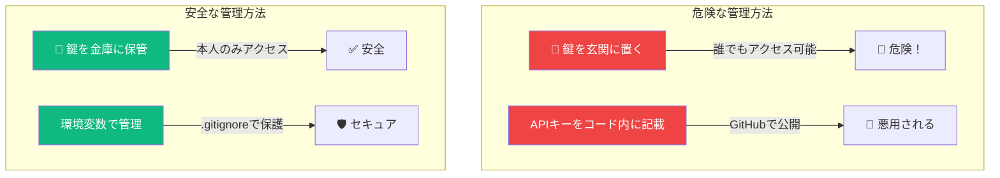

### ⚠️ 絶対にやってはいけないこと

| ❌ NG行為 | 結果 | 対策 |
|:---------|:-----|:-----|
| **コードに直接記載** | GitHubで世界公開 | 環境変数を使う |
| **フロントエンドで使用** | ブラウザで見える | サーバー側のみで使用 |
| **Gitにコミット** | 履歴に永久保存 | .gitignoreに追加 |

### ✅ 正しい管理方法

#### 環境変数の基本構造

> **Cursorへの指示**：
> 「`.env.local`ファイルを作成して、APIキーを環境変数として管理できるようにしてください。OpenAI、Supabase、Clerkのキーを安全に保管します。」

**環境変数の命名ルールと構造例（簡略版）：**

```bash
# .env.local の構造例
# サーバー専用（秘密情報）
DATABASE_URL=postgresql://...
OPENAI_API_KEY=sk-proj-xxxxx

# ブラウザでも使用可能（公開可能）
NEXT_PUBLIC_APP_URL=https://myapp.com
NEXT_PUBLIC_SUPABASE_URL=https://xxx.supabase.co
```

**命名ルール：**

| 用途 | プレフィックス | 使用場所 | 例 |
|:-----|:-------------|:--------|:---|
| **公開可能** | `NEXT_PUBLIC_` | フロント＆サーバー | `NEXT_PUBLIC_APP_URL` |
| **秘密情報** | なし | サーバーのみ | `OPENAI_API_KEY` |

---

## 4. `.env.local`と`.env.example`の使い分け

### 📁 ファイル構成と役割

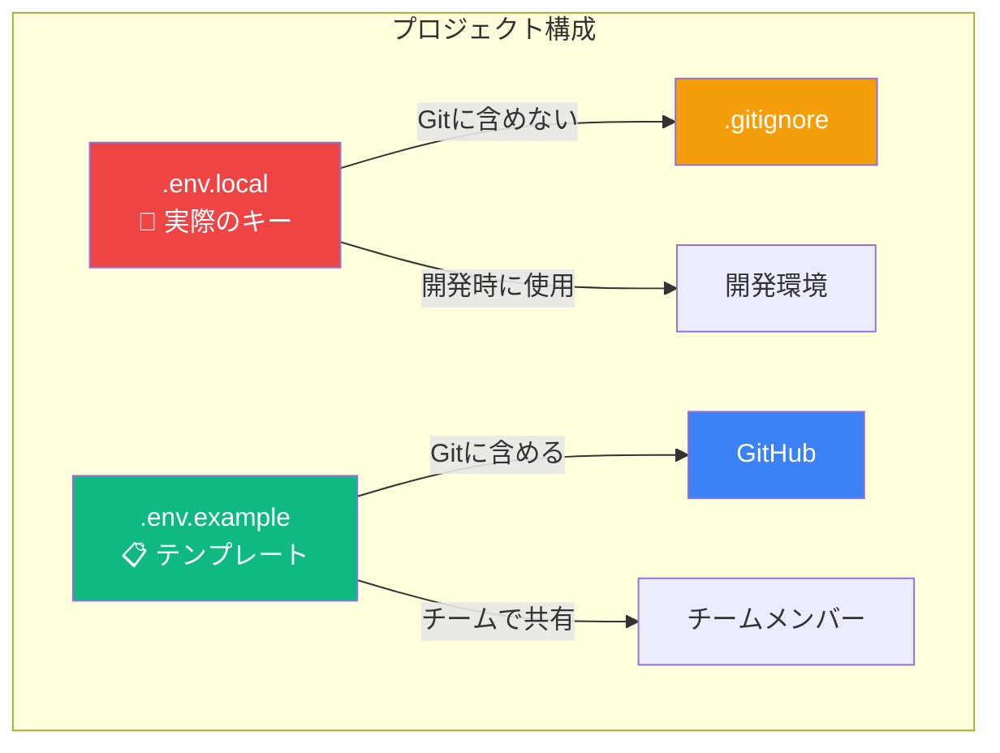

### 📊 各ファイルの役割

| ファイル | 内容 | Git管理 | 目的 |
|:--------|:-----|:--------|:-----|
| **`.env.local`** | 本物のAPIキー | ❌ 除外 | 実際の開発で使用 |
| **`.env.example`** | サンプル・説明 | ✅ 含める | チームへの指示書 |
| **`.gitignore`** | 除外設定 | ✅ 含める | セキュリティ保護 |

### 🚀 チーム開発での流れ

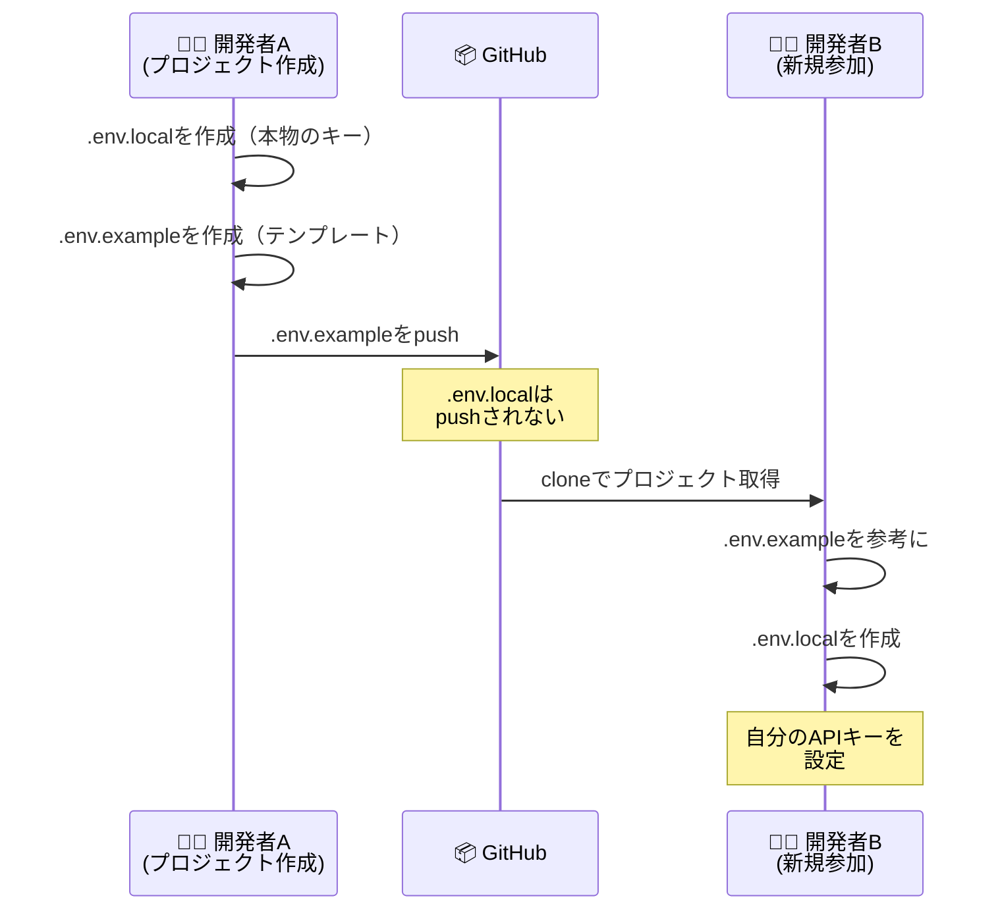

> **Cursorへの指示**：
> 「`.env.example`ファイルを作成してください。必要な環境変数の一覧と、各APIキーの取得方法をコメントで記載します。」

---

## 5. 実例: Supabase、Clerk、OpenAI

### 🗄️ Supabase（データベース + 認証）

#### Supabaseで何ができるか

| 機能 | 説明 | 使用例 |
|:-----|:-----|:-------|
| **データベース** | PostgreSQL | 投稿、ユーザー情報の保存 |
| **リアルタイム** | 自動更新 | チャット、通知 |
| **認証** | ログイン機能 | メール認証、OAuth |
| **ストレージ** | ファイル保存 | 画像、動画のアップロード |

> **Cursorへの指示**：
> 「Supabaseクライアントを初期化してください。環境変数からURLとAnon Keyを読み込んで、データベースにアクセスできるようにします。」

### 🔐 Clerk（認証専門）

#### Clerkの特徴

| 機能 | メリット | 実装の簡単さ |
|:-----|:--------|:-----------|
| **Google認証** | 1クリックログイン | 5分で実装 |
| **GitHub認証** | 開発者向け | 5分で実装 |
| **メール認証** | パスワードレス | 10分で実装 |
| **ユーザー管理** | ダッシュボード付き | 設定不要 |

> **Cursorへの指示**：
> 「Clerkを使ってGoogle認証を実装してください。ログインボタンを押したらGoogleアカウントで認証できるようにします。」

### 🤖 OpenAI API（ChatGPT）

#### OpenAI APIの活用例

| 用途 | 機能 | SNSアプリでの使用例 |
|:-----|:-----|:-----------------|
| **文章生成** | 自動作成 | 投稿の下書き提案 |
| **要約** | 長文を短く | タイムラインの要約 |
| **翻訳** | 多言語対応 | 投稿の自動翻訳 |
| **感情分析** | ポジネガ判定 | 不適切投稿の検出 |

> **Cursorへの指示**：
> 「OpenAI APIを使って投稿内容を改善する機能を作ってください。ユーザーが書いた文章を、より読みやすく魅力的にリライトします。」

### 🔒 セキュリティチェックリスト

| チェック項目 | 確認内容 | 対策 |
|:-----------|:--------|:-----|
| ✅ `.env.local`が`.gitignore`に | Gitで管理されていない | `git status`で確認 |
| ✅ `.env.example`を作成 | チーム共有用テンプレート | 必要な変数を記載 |
| ✅ `NEXT_PUBLIC_`の使い分け | 公開可能なキーのみ | フロント用に限定 |
| ✅ 本番環境の設定 | Vercelで環境変数設定 | デプロイ前に設定 |
| ✅ APIキーの定期更新 | セキュリティ対策 | 3ヶ月ごとに更新 |

---

# Part 4: Text is KING - 音声入力の実践（15分）

## 1. なぜ音声入力が重要なのか

### 🎤 AI時代の最強スキル = 音声入力

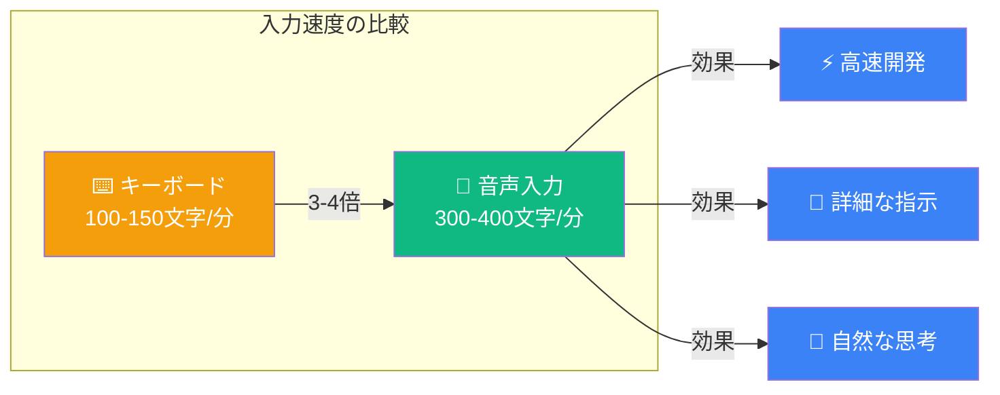

### 💡 音声入力の実例比較

#### 同じ指示を入力する場合

| 入力方法 | 所要時間 | 文字数 | 詳細度 |
|:---------|:--------|:-------|:------|
| **キーボード** | 30秒 | 50文字 | 簡潔 |
| **音声入力** | 10秒 | 150文字 | 詳細 |

**具体例：**

> **キーボード（30秒）**：
> 「Reactでログインフォームを作って。メールとパスワードの入力欄が必要。」

> **音声入力（10秒）**：
> 「Reactでログインフォームを作って。メールとパスワードの入力欄が必要で、バリデーションも実装して。送信ボタンを押したらSupabaseのauth.signInWithPasswordを呼び出して。エラーメッセージも表示できるようにして。」

---

## 2. AquaVoiceの使い方（実演）

### 🎙️ 音声入力ツールの選択肢

| ツール | 対応OS | 精度 | 価格 | 特徴 |
|:-------|:-------|:-----|:-----|:-----|
| **AquaVoice** | macOS | ⭐⭐⭐⭐⭐ | 有料 | Whisper AI使用 |
| **Windows音声認識** | Windows | ⭐⭐⭐ | 無料 | OS標準機能 |
| **Google音声入力** | Web | ⭐⭐⭐⭐ | 無料 | Chrome必須 |
| **Whisper Desktop** | Win/Mac | ⭐⭐⭐⭐⭐ | 無料 | ローカル処理 |

### 🔧 推奨設定（共通）

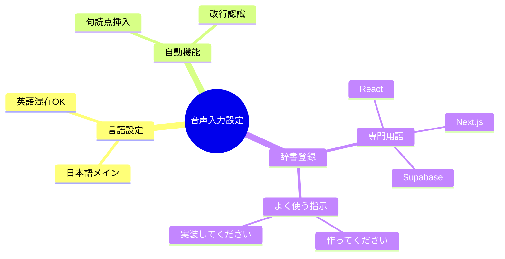

---

## 3. 音声入力で効率10倍

### 🚀 実践的な使用シーン

#### シーン1：Cursorへの要件指示

**音声入力の流れ：**

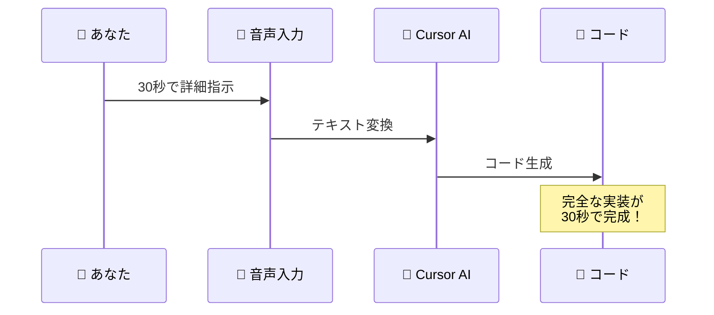

> **音声入力例（30秒）**：
> 「SNSアプリの投稿機能を実装したい。ユーザーが投稿フォームにテキストを入力して、画像も1枚アップロードできるようにして。投稿ボタンを押したら、Supabaseのpostsテーブルに保存して、リアルタイムでタイムラインに表示されるようにして。全部Server Actionsで実装してね。」

#### シーン2：エラー解決

**従来 vs 音声入力：**

| 方法 | 手順 | 時間 |
|:-----|:-----|:-----|
| **従来** | エラーをコピー → Google検索 → 試行錯誤 | 30分 |
| **音声** | 「このエラーを直して」＋エラー内容を読み上げ | 1分 |

#### シーン3：コミットメッセージ

> **音声入力例（15秒）**：
> 「投稿機能を実装。postsテーブルへのCRUD操作、画像アップロード機能、いいね機能の楽観的UI更新、リアルタイムタイムライン表示を追加。Server Actionsで実装し、Zodでバリデーションスキーマを定義。」

### 💡 音声入力のコツ

#### ✅ 効果的な話し方

| コツ | 説明 | 例 |
|:----|:-----|:---|
| **具体的に** | 曖昧な指示を避ける | 「ログイン機能」→「メールとパスワードでログイン、Clerkと連携」 |
| **区切りを意識** | 句読点の位置 | 「まず、〜します。次に、〜します。」 |
| **専門用語は英語** | 認識精度向上 | 「React（リアクト）」「Next.js（ネクストジェイエス）」 |
| **パス表記** | スラッシュを明確に | 「アット スラッシュ lib スラッシュ supabase」 |

### 📊 音声入力の効果測定

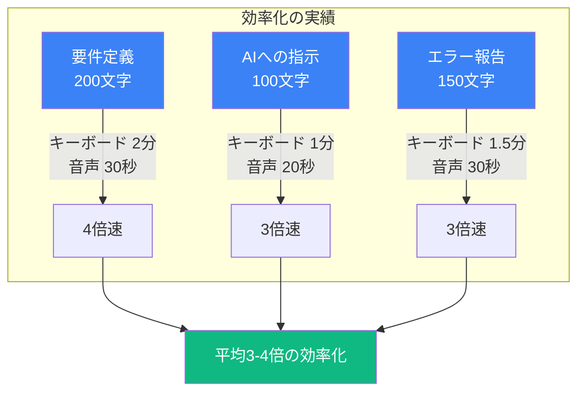

### 🎯 今日から実践する4ステップ

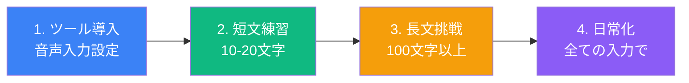

---

# Part 5: まとめと次回予告（5分）

## 💡 この章のまとめ

### 📚 今日学んだ5つのポイント

| # | テーマ | キーポイント | 実践価値 |
|:--|:------|:----------|:---------|
| 1 | **Vibe Coderマインド** | AIと対話しながら開発 | エラー解決が5分に短縮 |
| 2 | **3層アーキテクチャ** | レストラン比喩で理解 | Webアプリの仕組みが明確に |
| 3 | **API活用** | 電話注文のように利用 | 外部サービスで機能拡張 |
| 4 | **環境変数管理** | 家の鍵のように保護 | セキュリティリスク回避 |
| 5 | **音声入力** | 3-4倍の効率化 | 開発速度が劇的に向上 |

### 🎯 今日のキーメッセージ

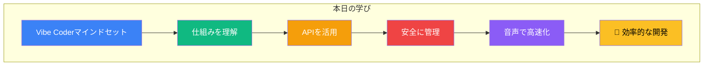

## 🚀 次の章への橋渡し

### 次回：技術スタックとAI要件定義演習

次の`2-2_技術スタックとAI要件定義演習.md`では、今回学んだWebアプリの仕組みを基に、**実際に使う技術の選定**と**AIを使った要件定義の自動化**を学びます。

**次回の内容：**

| Part | 内容 | 実践内容 |
|:-----|:-----|:--------|
| **Part 1** | 技術スタックとは？ | 2025年の最適な組み合わせ |
| **Part 2** | AI要件定義演習 | Claude/ChatGPTで自動生成 |
| **Part 3** | データベース設計 | AIでテーブル設計 |
| **Part 4** | 実装準備 | Cursorでの開発開始 |

**準備するもの：**
- ✅ Cursor（インストール済み）
- ✅ 音声入力ツール（推奨）
- ✅ 今日学んだ知識

---

### 🎉 第二回（前半）お疲れ様でした！

**今日の成果：**
- Webアプリの仕組みが理解できた
- APIと環境変数の重要性がわかった
- 音声入力で効率化の準備ができた

**次回予告：**
実際にSNSアプリの要件定義を作成し、技術選定を行います。AIの力を借りて、プロの開発者と同等の設計書を30分で作成します！

---

## 参考資料

### 📚 さらに学びたい方へ

| リソース | 内容 | URL/場所 |
|:--------|:-----|:--------|
| **Next.js公式** | フレームワーク詳細 | nextjs.org |
| **Supabase Docs** | データベース設定 | supabase.com/docs |
| **Clerk Docs** | 認証実装 | clerk.com/docs |
| **音声入力比較** | 各ツールの詳細 | 講義Slack参照 |

### 💬 よくある質問

**Q1: プログラミング経験がなくても大丈夫？**
A: はい、AIに指示を出すだけなので、コードを書く必要はありません。

**Q2: 音声入力は必須ですか？**
A: 必須ではありませんが、3-4倍効率が上がるので強く推奨します。

**Q3: 環境変数を間違えて公開してしまったら？**
A: すぐにAPIキーを無効化して、新しいキーを発行してください。

**Q4: Webアプリの仕組みをもっと詳しく知りたい**
A: 次回の技術スタック選定で、より詳細に解説します。

---

**第二回前半、ありがとうございました！次回もお楽しみに！** 🚀
