# 第二回講義（後半）：技術スタックとAI要件定義演習

## 🎯 この講義で学ぶこと

- **技術スタックの本質**を理解し、「どの技術を選ぶべきか」を判断できるようになる
- **Vibe Coder推奨技術スタック**（Next.js、TypeScript、Supabase、Clerk、Vercel）の全体像を把握する
- **AIによる要件定義の革命的手法**を実践し、アイデアを設計図に自動変換する体験
- **システム要件定義書の生成**から実装への橋渡しまでのワークフローを習得する
- **環境変数とAPIキーの管理**方法を理解し、安全な開発環境を構築する
- **Text is KING**の実践を通じて、AIへの指示の質を劇的に向上させる

## 📌 この講義の位置づけ

本講義は、第二回の後半パートです。前半で学んだWebアプリの仕組みとAPIの基礎知識を土台に、実際の開発で使う「技術スタック」と「AI要件定義」を学びます。

これは単なる技術の紹介ではありません。**あなたのアイデアを形にするための「道具選び」と「設計図作成」**という、開発の最も重要な2つのスキルを身につける時間です。

第三回以降の実装フェーズに向けて、今回の内容は**すべての開発の土台**となります。

---

# 第1章：技術スタックの本質を理解する

## 🎯 この章で学ぶこと

- **技術スタックとは何か**を建築に例えて直感的に理解する
- **技術選択の4つの判断基準**（AI相性・無料枠・学習効率・将来性）を習得する
- **適材適所の技術選択**がアプリケーションの品質を決定することを理解する

## 📌 この章の位置づけ

前半で学んだWebアプリの仕組みを踏まえ、実際の開発で使う「建材」である技術スタックについて学びます。これは、第2章で紹介する推奨技術を理解するための基礎となります。

---

## 🏠 家を建てることに例えると

### **建築とWebアプリケーションの驚くべき類似性**

あなたが家を建てるとき、どのような材料を選びますか？基礎にはコンクリート、骨組みには鉄骨、外壁にはサイディング、屋根には瓦...。それぞれの部分に最適な材料を選びますよね。

**Webアプリケーション開発も、まったく同じです。**

```mermaid
graph TB
    subgraph "🏠 家を建てる"
        A[基礎/コンクリート<br/>安定性・耐久性]
        B[骨組み/鉄骨<br/>構造の強度]
        C[外壁/サイディング<br/>見た目・保護]
        D[屋根/瓦<br/>防水・耐候性]
        E[内装/壁紙<br/>快適性・美観]

        A --> B
        B --> C
        C --> D
        D --> E
    end

    subgraph "💻 Webアプリを作る"
        F[データベース<br/>データの永続化]
        G[バックエンド<br/>ビジネスロジック]
        H[フロントエンド<br/>ユーザー体験]
        I[ホスティング<br/>公開・配信]
        J[認証システム<br/>セキュリティ]

        F --> G
        G --> H
        H --> I
        I --> J
    end

    style A fill:#3b82f6,stroke:#2563eb,color:#fff
    style F fill:#3b82f6,stroke:#2563eb,color:#fff
    style E fill:#10b981,stroke:#059669,color:#fff
    style J fill:#10b981,stroke:#059669,color:#fff
```

### **適材適所が品質を決定する**

| 建築の要素 | **目的** | Webアプリの要素 | **目的** |
|-----------|---------|----------------|---------|
| **基礎（コンクリート）** | 建物全体を支える | **データベース** | すべてのデータを管理 |
| **骨組み（鉄骨）** | 構造の強度を保つ | **バックエンド** | ビジネスロジックを処理 |
| **外壁（サイディング）** | 見た目と保護 | **フロントエンド** | ユーザー体験を提供 |
| **屋根（瓦）** | 雨風から守る | **ホスティング** | 世界中からアクセス可能に |
| **内装（壁紙）** | 快適な空間作り | **認証システム** | 安全性と個人化 |

> **「良い家には良い材料、良いアプリには良い技術スタック」**

---

## 🎯 なぜ技術スタックの理解が必要なのか

### **1. AIへの的確な指示ができるようになる**

```markdown
❌ 悪い例：
「タスク管理アプリを作って」
→ AIは何を使うべきか分からず、一般的な回答しかできない

✅ 良い例：
「Next.js 15とSupabaseを使って、Clerk認証付きのタスク管理アプリを作って」
→ AIは具体的で実装可能なコードを生成できる
```

### **2. 実現可能性を判断できるようになる**

| 質問 | なぜ重要か | 判断の例 |
|------|----------|---------|
| **「この機能は無料でできる？」** | 予算管理 | Supabaseなら500MBまで無料 |
| **「どれくらいの規模まで対応？」** | スケール計画 | 初期は1,000人、後で拡張可能 |
| **「学習にどれくらい時間が？」** | スケジュール | Next.jsなら1週間で基礎習得 |

### **3. コスト見積もりができるようになる**

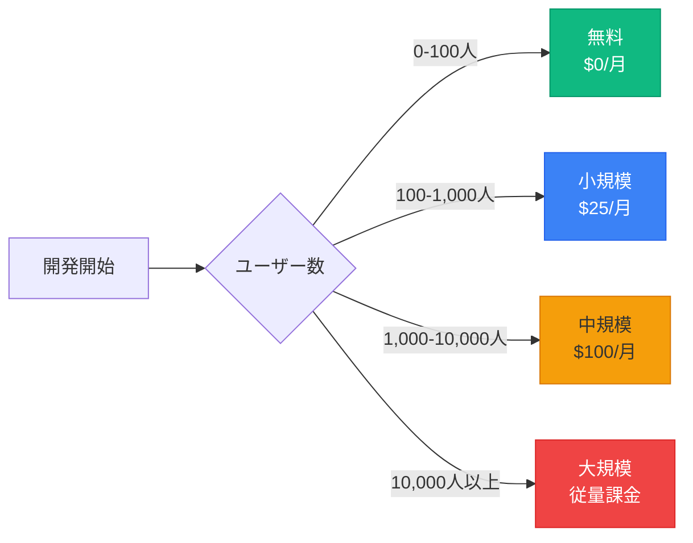

---

## 🔍 技術選択の4つの判断基準

### **何を基準に技術を選ぶべきか**

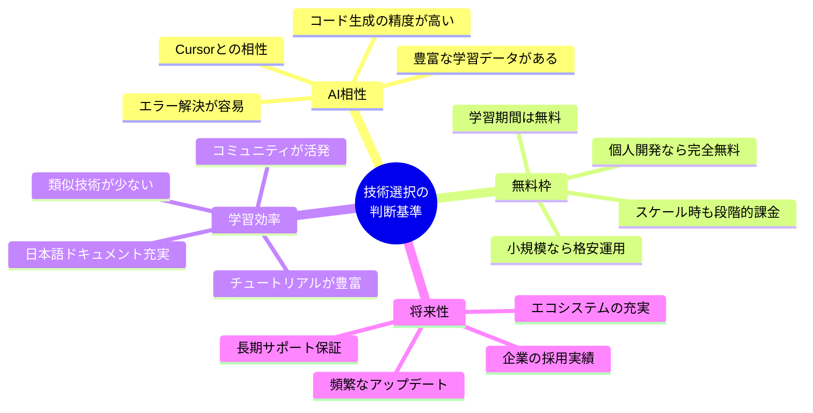

### **判断基準の重要度（Vibe Coder視点）**

| 判断基準 | **重要度** | **理由** | **具体例** |
|---------|-----------|---------|-----------|
| **AI相性** | ⭐⭐⭐⭐⭐ | Cursorでの開発効率に直結 | Next.js、TypeScript |
| **無料枠** | ⭐⭐⭐⭐⭐ | 初期コストゼロで始められる | Supabase、Vercel |
| **学習効率** | ⭐⭐⭐⭐ | 短期間での習得が可能 | React、Tailwind CSS |
| **将来性** | ⭐⭐⭐ | 長期的な投資価値 | React 19、Next.js 15 |

---

## 💡 この章のまとめ

- ✅ 技術スタックは「Webアプリを作るための建材」である
- ✅ 適材適所の技術選択が、アプリケーションの品質を決定する
- ✅ AIへの指示、実現可能性、コスト見積もりのために技術理解は必須
- ✅ AI相性、無料枠、学習効率、将来性の4つの観点で技術を評価する
- ✅ Vibe CoderにとってAI相性と無料枠は特に重要

## 🚀 次の章への橋渡し

技術選択の判断基準を理解しました。次の第2章では、これらの基準をすべて満たす「Vibe Coder推奨技術スタック」を具体的に紹介します。なぜNext.js、TypeScript、Supabase、Clerk、Vercelの組み合わせが最適なのか、その理由と使い方を詳しく見ていきましょう。

---

# 第2章：Vibe Coder推奨技術スタック

## 🎯 この章で学ぶこと

- **2025年最新の推奨技術スタック**の全体像と選定理由を理解する
- **Next.js 15とReact 19**の革新的な機能と実装方法を学ぶ
- **TypeScript**によるAI生成コードの品質向上メカニズムを理解する
- **Supabase**のオールインワン機能（DB、認証、ストレージ、リアルタイム）を把握する
- **Clerk**による最速認証実装の方法を習得する
- **Vercel**の自動デプロイの仕組みを理解する

## 📌 この章の位置づけ

第1章で学んだ技術選択の判断基準に基づき、実際にVibe Coderが使用すべき具体的な技術スタックを紹介します。これらは第3章のAI要件定義演習で実際に指定する技術となります。

---

## 🚀 推奨スタック一覧

### **初心者が最初に真似すべき黄金の構成**

| 役割 | **技術** | **バージョン** | **選定理由** |
|------|----------|---------------|-------------|
| **フロントエンド** | Next.js | 15 | 最新機能とAI対応の最前線 |
| **UIライブラリ** | React | 19 | Server Actions標準搭載 |
| **言語** | TypeScript | 5.x | 型安全でAI生成精度向上 |
| **バックエンド** | Next.js API Routes | 15 | 統一環境で学習コスト削減 |
| **データベース** | Supabase | 最新 | 無料枠充実・リアルタイム対応 |
| **認証** | Clerk | 最新 | 実装最速・UI標準装備 |
| **ホスティング** | Vercel | 最新 | GitHub連携で自動デプロイ |
| **スタイリング** | Tailwind CSS | 3.x | クラス名だけでデザイン完成 |

### **なぜこの組み合わせが最適なのか**

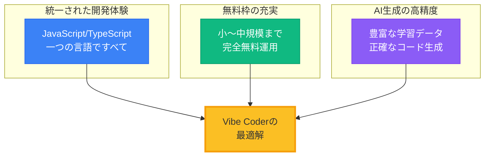

### **技術間の依存関係**

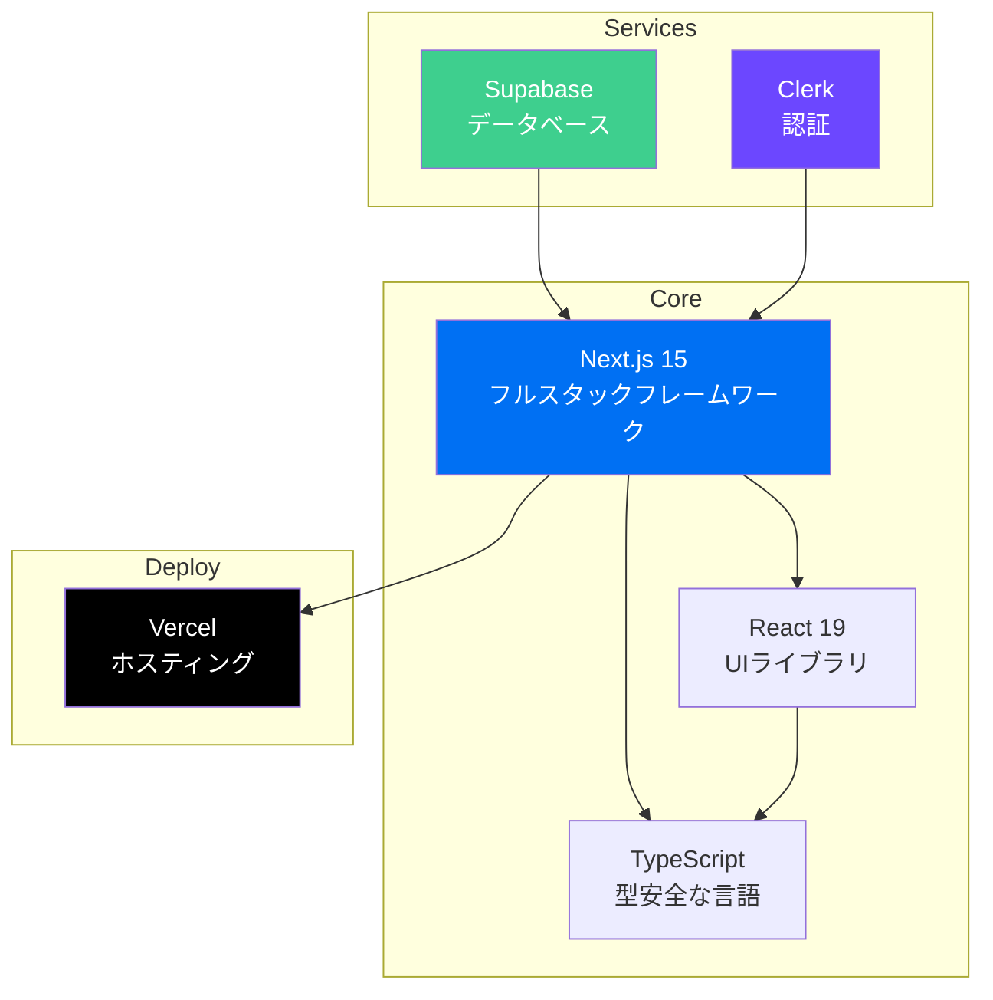

---

## 📘 Next.js 15 - フルスタックReactフレームワーク

### **なぜNext.jsが革命的なのか**

#### **従来のReact開発の3つの課題**

| 課題 | **問題の詳細** | **実際の影響** |
|------|---------------|---------------|
| **SEO対策困難** | 検索エンジンがJavaScriptを読めない | Googleに見つけてもらえない |
| **初期表示が遅い** | すべてをブラウザで処理 | ユーザーが離脱する |
| **バックエンド分離** | API開発が別プロジェクト | 開発が複雑で時間がかかる |

#### **Next.jsによる解決**

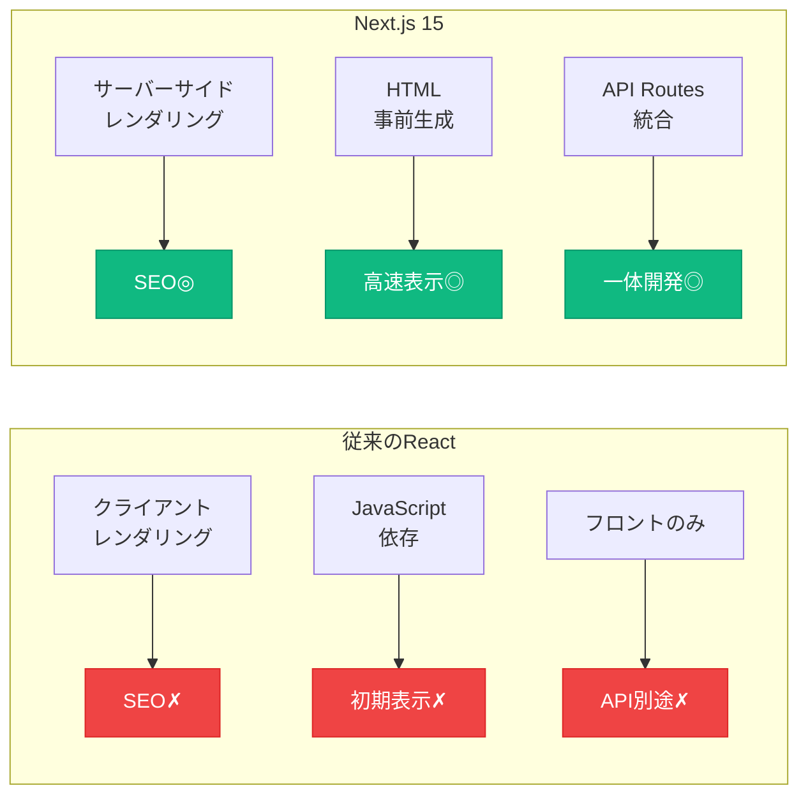

### **Next.js 15の3つの革新的機能**

#### **1. ファイルベースルーティング**

```
app/
├── page.tsx              → / (トップページ)
├── about/
│   └── page.tsx         → /about
├── blog/
│   └── [id]/
│       └── page.tsx     → /blog/123, /blog/456...
└── api/
    └── tasks/
        └── route.ts     → /api/tasks (APIエンドポイント)
```

> **「ファイルを作るだけでページができる魔法」**

#### **2. React 19の最新機能を完全サポート**

| 機能 | **何ができるか** | **Vibe Coderへの恩恵** |
|------|-----------------|---------------------|
| **Server Actions** | フォーム処理が劇的に簡単 | API不要で直接DB操作 |
| **useActionState** | 楽観的UIの標準実装 | リアルタイム感のあるUX |
| **use() API** | 非同期処理の新しい書き方 | よりシンプルなコード |

#### **3. Turbopack開発サーバー**

```bash
# 従来の開発サーバー起動
next dev              # 起動に10-30秒

# Turbopack使用
next dev --turbo      # 起動に1-3秒（10倍高速！）
```

### **Cursorへの指示例**

```markdown
Cursorへの指示:
Next.js 15のApp Routerでプロジェクトを作成してください。

要件:
- TypeScript有効化
- Tailwind CSS有効化
- ESLint有効化
- src/ディレクトリ使用
- App Router使用

以下のコマンドで実行:
npx create-next-app@latest my-app --typescript --tailwind --app --src-dir --eslint
```

---

## 🔷 TypeScript - 型安全なJavaScript

### **なぜTypeScriptがVibe Coderに必須なのか**

#### **JavaScriptの危険な罠**

```javascript
// JavaScriptの問題：エラーが実行時まで分からない
const task = { title: "買い物", completed: false };
console.log(task.titel);  // typo！でも気づけない
// 実行すると → undefined（バグの原因）
```

#### **TypeScriptによる安全装置**

```typescript
// TypeScript：エディタが即座にエラーを教えてくれる
interface Task {
  title: string;
  completed: boolean;
}

const task: Task = { title: "買い物", completed: false };
console.log(task.titel);  // ❌ エディタが赤線で警告！
// Property 'titel' does not exist on type 'Task'. Did you mean 'title'?
```

### **AI生成コードの品質が劇的に向上する理由**

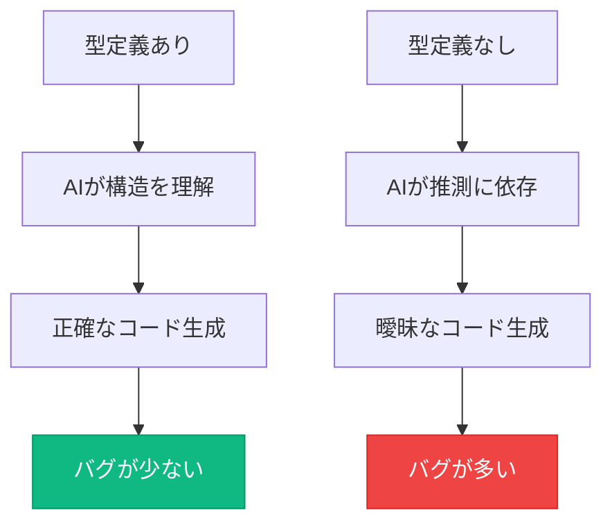

### **基本的な型定義の例**

```typescript
// Cursorへの指示:
// タスク管理のCRUD操作をTypeScriptで実装してください

// AIが生成する型定義
interface Task {
  id: string;
  title: string;
  description?: string;      // ? は省略可能
  completed: boolean;
  dueDate: Date | null;      // nullも許容
  createdAt: Date;
  updatedAt: Date;
}

// 関数の型定義
function createTask(title: string): Task {
  return {
    id: crypto.randomUUID(),
    title,
    description: undefined,
    completed: false,
    dueDate: null,
    createdAt: new Date(),
    updatedAt: new Date()
  };
}
```

---

## 🌊 Supabase - オールインワンバックエンド

### **5つのサービスが1つに統合された革命**

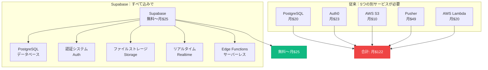

### **Supabaseの無料枠で何ができるか**

| リソース | **無料枠** | **実際の規模感** |
|---------|-----------|----------------|
| **データベース** | 500MB | 約100万件のタスクデータ |
| **ストレージ** | 1GB | 約1,000枚の画像 |
| **帯域幅** | 2GB/月 | 約10,000回のアクセス |
| **認証ユーザー** | 無制限 | 制限なし！ |
| **リアルタイム** | 200同時接続 | 小規模SNSには十分 |

### **基本的な使い方**

```typescript
// Cursorへの指示:
// Supabaseを使ってタスク管理機能を実装してください

// 1. 接続設定
import { createClient } from '@supabase/supabase-js'

const supabase = createClient(
  process.env.NEXT_PUBLIC_SUPABASE_URL!,
  process.env.NEXT_PUBLIC_SUPABASE_ANON_KEY!
)

// 2. データ取得（めちゃくちゃ簡単！）
const { data: tasks, error } = await supabase
  .from('tasks')
  .select('*')
  .order('created_at', { ascending: false })

// 3. リアルタイム更新（これだけ！）
supabase
  .channel('tasks')
  .on('postgres_changes',
    { event: '*', schema: 'public', table: 'tasks' },
    (payload) => console.log('変更検知！', payload)
  )
  .subscribe()
```

---

## 🔐 Clerk - 最速で実装できる認証システム

### **なぜClerkが圧倒的に速いのか**

#### **従来の認証実装の地獄**

| 実装項目 | **開発時間** | **難易度** |
|---------|------------|-----------|
| ログイン画面UI | 8時間 | ⭐⭐⭐ |
| パスワードハッシュ化 | 4時間 | ⭐⭐⭐⭐ |
| セッション管理 | 6時間 | ⭐⭐⭐⭐ |
| Googleログイン連携 | 8時間 | ⭐⭐⭐⭐⭐ |
| パスワードリセット | 6時間 | ⭐⭐⭐⭐ |
| **合計** | **32時間** | **地獄** |

#### **Clerkなら15分で完成**

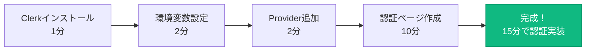

### **Clerkの5つの特徴**

| 特徴 | **詳細** | **メリット** |
|------|---------|-------------|
| **美しいUIが標準装備** | SignIn/SignUp/UserProfile完成済み | デザイン不要 |
| **豊富な認証方法** | Google、GitHub、LINE、パスキー対応 | ユーザーが選べる |
| **日本語対応** | 管理画面も認証画面も日本語 | 設定が簡単 |
| **10,000 MAU無料** | 月間アクティブユーザー1万人まで無料 | ほぼ永久無料 |
| **B2B機能完備** | 組織管理、ロール権限、SSO | エンタープライズ対応可 |

### **実装例（たったこれだけ！）**

```typescript
// Cursorへの指示:
// Clerkを使って認証機能を実装してください

// 1. レイアウトでProviderを設定
import { ClerkProvider } from '@clerk/nextjs'

export default function RootLayout({ children }) {
  return (
    <ClerkProvider>
      <html lang="ja">
        <body>{children}</body>
      </html>
    </ClerkProvider>
  )
}

// 2. 認証が必要なページ（これだけ！）
import { auth } from '@clerk/nextjs';
import { redirect } from 'next/navigation';

export default async function DashboardPage() {
  const { userId } = auth();

  if (!userId) {
    redirect('/sign-in');
  }

  return <div>ようこそ！ユーザーID: {userId}</div>;
}
```

---

## ▲ Vercel - GitHubプッシュで即座に公開

### **世界最速のデプロイ体験**

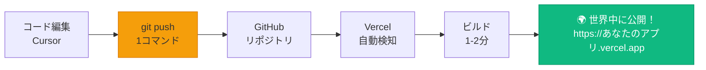

### **プレビューデプロイの魔法**

| 機能 | **説明** | **使用場面** |
|------|---------|-------------|
| **本番環境** | mainブランチが自動的に本番に | ユーザー向け |
| **プレビュー環境** | プルリクエストごとに専用URL | テスト・レビュー用 |
| **ロールバック** | 1クリックで過去のバージョンに戻す | 緊急時の対応 |

---

## 💡 この章のまとめ

- ✅ Vibe Coder推奨スタックは、統一性・無料枠・AI相性のベストバランス
- ✅ Next.js 15でフロントもバックエンドも一つのプロジェクトで完結
- ✅ TypeScriptによって、AIが生成するコードの品質が劇的に向上
- ✅ Supabaseは5つのサービスが1つに統合された革命的なツール
- ✅ Clerkなら認証実装が32時間→15分に短縮される
- ✅ Vercelはgit pushするだけで世界中に公開できる

## 🚀 次の章への橋渡し

推奨技術スタックの全体像を理解しました。次の第3章では、これらの技術を使って実際にアプリケーションを構築する第一歩、「AIによる要件定義」を実践します。あなたのアイデアを、AIが自動的にシステム設計書に変換する魔法を体験しましょう。

---

# 第3章：AIによる要件定義の革命

## 🎯 この章で学ぶこと

- **要件定義とは何か**を理解し、なぜそれが開発の成否を決めるのかを学ぶ
- **AIによる要件定義の自動化**という革命的手法を実践する
- **2段階のプロンプト戦略**で、ビジネスアイデアからシステム設計書を生成する
- **MoSCoW分類**による機能優先度の設定方法を理解する
- **生成された要件書の活用方法**を習得し、実装への橋渡しをマスターする

## 📌 この章の位置づけ

第2章で学んだ技術スタックを前提に、実際の開発プロセスの最初のステップである「要件定義」を学びます。これは単なる文書作成ではなく、AIを活用してアイデアを実装可能な設計図に変換する、Vibe Coderの核心的スキルです。

---

## 📋 要件定義とは何か？

### **夢を設計図に変える作業**

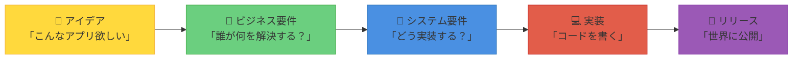

### **従来の要件定義の3つの問題**

| 問題 | **詳細** | **結果** |
|------|---------|---------|
| **専門知識が必要** | UMLやER図、フローチャートの知識 | 非エンジニアには不可能 |
| **コミュニケーションが困難** | エンジニアとの認識のズレ | 「思ってたのと違う」 |
| **抜け漏れによる手戻り** | 後から「あの機能も必要だった」 | 開発期間が2倍、3倍に |

### **AI時代の解決策**

> **「AIが自動的に要件を抽出・整理・文書化してくれる」**

人間の10年分の経験をAIが数秒で実行し、プロレベルの要件定義書を生成します。

---

## 🤖 AIプロンプトの2段階戦略

### **なぜ2段階なのか**

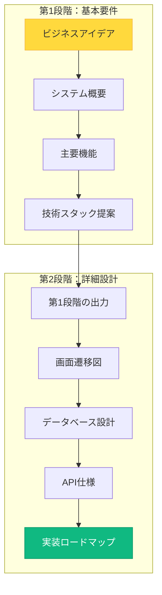

### **第1プロンプト：システム要件抽出**

```yaml
役割: プロダクトマネージャー & システムアーキテクト
入力: ビジネス要件（あなたのアイデア）
処理:
  1. 情報の統合・分析
  2. 不足情報の確認
  3. 技術要件への変換
  4. リスク分析
出力:
  - システム概要
  - 機能要件・非機能要件
  - 技術スタック提案
  - 開発ロードマップ
  - UI/UX方向性
```

### **第2プロンプト：詳細要件定義**

```yaml
役割: シニアエンジニア & UXデザイナー
入力: 第1プロンプトの出力
処理:
  1. 詳細設計への展開
  2. 図表の自動生成
  3. 実装仕様の具体化
  4. テストケースの作成
出力:
  - Mermaid形式の各種図
  - MoSCoW分類による優先度
  - ユーザーストーリー
  - API仕様書
  - ワイヤーフレーム
```

---

## 📊 生成される要件書の構造

### **第1プロンプトの出力例**

```markdown
# システム要件定義書

## 1. システム概要
- **プロダクト名**: TaskMaster Pro
- **解決する課題**: チームのタスク管理の非効率性
- **提供価値**: リアルタイム協働とAI支援による生産性向上

## 2. 主要機能
### コア機能（必須）
- タスクのCRUD操作
- ユーザー認証と権限管理
- リアルタイム同期

### 差別化機能
- AI による優先度自動設定
- 音声入力対応
- スマート通知

## 3. 技術スタック
- フロントエンド: Next.js 15 + TypeScript
- バックエンド: Supabase
- 認証: Clerk
- ホスティング: Vercel

## 4. 開発ロードマップ
- Phase 1 (MVP): 2週間 - 基本CRUD
- Phase 2: 1ヶ月 - AI機能追加
- Phase 3: 2ヶ月 - エンタープライズ機能
```

### **第2プロンプトで追加される詳細**

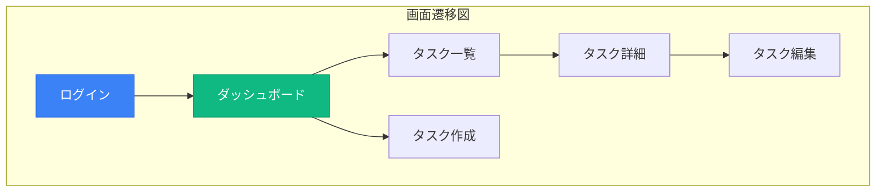

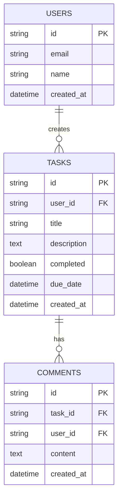

---

## 🎯 MoSCoW分類による優先度設定

### **機能を4つのカテゴリーに分類**

| カテゴリー | **意味** | **判断基準** | **例** |
|-----------|---------|-------------|--------|
| **Must have** | 必須機能 | これがないとサービスが成立しない | ログイン、基本CRUD |
| **Should have** | 推奨機能 | あるべきだが、なくても動く | 検索、フィルター |
| **Could have** | あれば良い | 余裕があれば実装 | ダークモード、通知音 |
| **Won't have** | 今回は実装しない | 将来のバージョンで検討 | AI予測、音声認識 |

### **Phase別の実装計画**

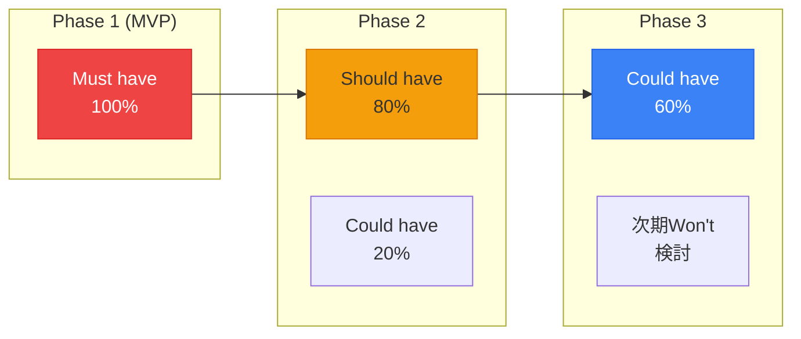

---

## 💡 この章のまとめ

- ✅ 要件定義は「アイデアを設計図に変える」最も重要な作業
- ✅ AIによって専門知識なしにプロレベルの要件定義が可能になった
- ✅ 2段階のプロンプト戦略で、概要から詳細まで自動生成
- ✅ MoSCoW分類で機能の優先度を明確にし、段階的に実装
- ✅ 生成された要件書は開発の指針、チーム共有、進捗管理に活用

## 🚀 次の章への橋渡し

AIによる要件定義の理論を理解しました。次の第4章では、実際に手を動かして、あなたのアイデアを要件定義書に変換する演習を行います。プロンプトの準備から実行、結果の確認まで、ステップバイステップで進めていきます。

---

# 第4章：要件定義演習 - 実践編

## 🎯 この章で学ぶこと

- **演習の事前準備**として、ファイル構成とフォルダ構造を整える
- **第1プロンプトの実行**で、基本的なシステム要件を生成する
- **第2プロンプトの実行**で、実装レベルの詳細設計を完成させる
- **生成結果の評価と改善**方法を学び、AIとの対話を深める
- **要件書から実装への橋渡し**を理解し、次のステップを明確にする

## 📌 この章の位置づけ

第3章で学んだ理論を実践に移します。実際にCursorを使ってAIプロンプトを実行し、あなたのアイデアをシステム要件定義書に変換する体験をします。これは第三回以降の実装フェーズに直結する重要な演習です。

---

## 📁 演習の準備

### **ステップ1：フォルダ構造の作成**

```bash
# プロジェクトルートで以下を実行
your-project/
├── docs/
│   ├── input/          # あなたのアイデア（入力）
│   │   ├── business_requirements.md
│   │   ├── lean_canvas.md
│   │   └── product_vision.md
│   ├── output/         # AIが生成する設計書（出力）
│   │   ├── system_requirements.md
│   │   └── detailed_requirements_specification.md
│   └── prompt/         # AIプロンプト
│       ├── system-requirements-prompt.md
│       └── detailed_requirements_prompt.md
```

### **インプットファイルの準備**

```markdown
# docs/input/business_requirements.md の例

## プロダクト概要
**名称**: レシピシェア
**一言説明**: 料理レシピを写真でシェアするSNS

## ターゲットユーザー
- **ペルソナ**: 30代主婦の田中花子さん
- **課題**: 毎日の献立を考えるのが大変
- **現在の解決法**: クックパッドを見る
- **不満**: レシピが多すぎて選べない

## 提供価値
- AIが好みを学習して3つに絞る
- 買い物リストを自動生成
- 家族の評価を記録

## 収益モデル
- 基本無料
- プレミアム機能（月額500円）
  - 無制限保存
  - 詳細な栄養分析
  - 広告非表示
```

---

## 🔄 第1プロンプトの実行

### **手順**

```mermaid
graph LR
    A[Cursor起動<br/>Cmd+L] --> B[プロンプト読込<br/>@docs/prompt]
    B --> C[AI実行<br/>30秒待機]
    C --> D[結果確認<br/>output/]
    D --> E[追加質問<br/>必要に応じて]

    style A fill:#3b82f6,stroke:#2563eb,color:#fff
    style D fill:#10b981,stroke:#059669,color:#fff
```

### **Cursorでの実行コマンド**

```markdown
新規チャット開始: Cmd+L (Mac) / Ctrl+L (Windows)

入力:
@docs/prompt/system-requirements-prompt.md
```

### **AIの処理フロー**

| ステップ | **処理内容** | **所要時間** |
|---------|------------|-------------|
| **1. 入力分析** | `/docs/input`内のファイルを読み込み | 5秒 |
| **2. 情報統合** | ビジネス要件を統合・整理 | 10秒 |
| **3. 変換処理** | システム要件へ変換 | 10秒 |
| **4. 出力生成** | Markdown形式で文書作成 | 5秒 |

### **生成される基本要件書**

```markdown
# システム要件定義書
生成日: 2025-11-08
プロダクト: レシピシェア

## システム概要
### 解決する課題
- 献立選びの時間短縮（現状30分→目標5分）
- レシピの個人最適化
- 買い物の効率化

### 主要機能
#### コア機能（Must have）
- [ ] レシピ投稿（画像必須）
- [ ] AIレコメンド（3つ提案）
- [ ] 買い物リスト自動生成
- [ ] 家族評価システム

#### 差別化機能（Should have）
- [ ] 栄養分析
- [ ] 季節の食材提案
- [ ] アレルギー対応フィルター

## 技術スタック
- Frontend: Next.js 15 + TypeScript
- Backend: Supabase (PostgreSQL + Storage)
- Auth: Clerk
- AI: OpenAI API
- Hosting: Vercel

## 開発ロードマップ
- Phase 1 (2週間): 基本投稿・閲覧機能
- Phase 2 (1ヶ月): AI機能実装
- Phase 3 (1ヶ月): 収益化機能
```

---

## 🔄 第2プロンプトの実行

### **より詳細な設計への展開**

```markdown
新規チャット継続

入力:
@docs/prompt/detailed_requirements_prompt.md
```

### **追加される詳細情報**

#### **画面遷移図（Mermaid）**

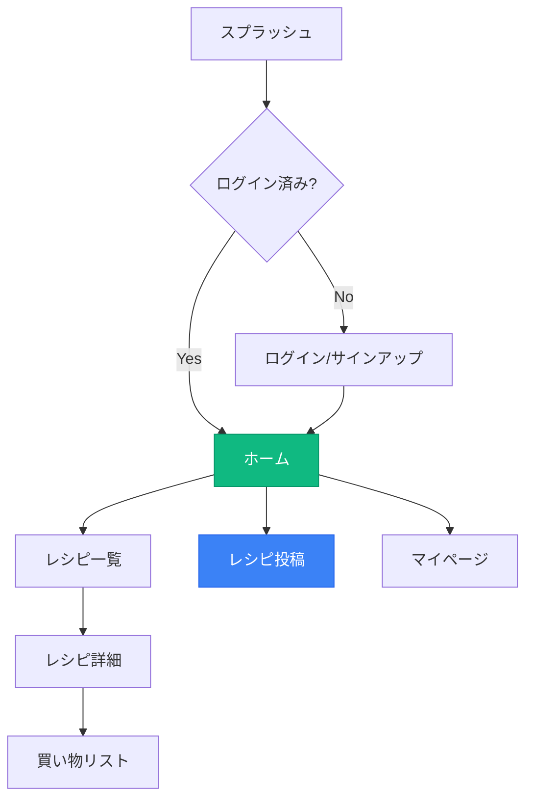

#### **データベース設計（ER図）**

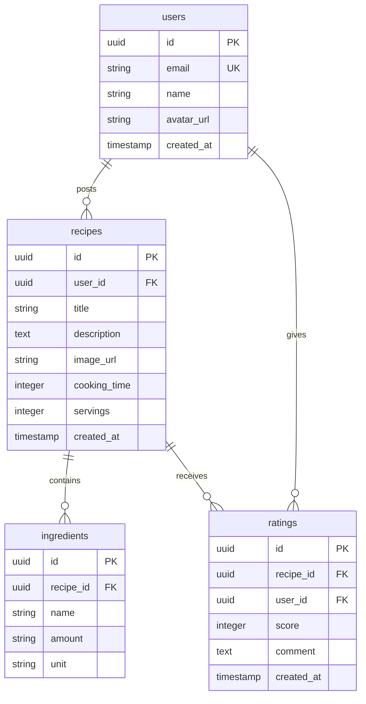

#### **API仕様（REST）**

| エンドポイント | **メソッド** | **説明** | **認証** |
|--------------|------------|---------|---------|
| `/api/recipes` | GET | レシピ一覧取得 | 不要 |
| `/api/recipes` | POST | レシピ投稿 | 必要 |
| `/api/recipes/:id` | GET | レシピ詳細取得 | 不要 |
| `/api/recipes/:id/rate` | POST | 評価投稿 | 必要 |
| `/api/shopping-list` | POST | 買い物リスト生成 | 必要 |
| `/api/ai/recommend` | GET | AIレコメンド取得 | 必要 |

---

## 📈 生成結果の評価と改善

### **チェックポイント**

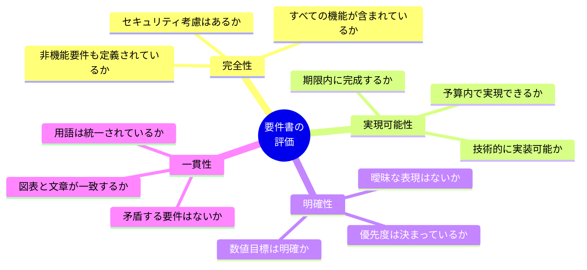

### **よくある改善ポイント**

| 問題 | **対処法** | **AIへの追加指示例** |
|------|----------|-------------------|
| **機能が多すぎる** | MVP範囲を絞る | 「Phase 1は最小限の機能に絞って」 |
| **技術が複雑** | シンプルな代替案 | 「初心者でも実装可能な技術で」 |
| **コストが高い** | 無料サービス活用 | 「完全無料で運用可能な構成で」 |
| **期限が厳しい** | フェーズ分割 | 「1週間で作れるMVPを定義」 |

### **AIとの対話例**

```markdown
追加質問:
「Phase 1のMVPをさらに絞って、3日で実装可能な最小構成を提案してください。必須機能は『レシピ投稿』と『一覧表示』のみとします。」

AIの回答:
Phase 1 MVP（3日版）
Day 1: 環境構築とDB設計
- Next.jsプロジェクト作成
- Supabaseセットアップ
- 基本的なテーブル作成

Day 2: 投稿機能
- 画像アップロード（Supabase Storage）
- レシピ投稿フォーム
- データ保存処理

Day 3: 表示機能とデプロイ
- レシピ一覧ページ
- レシピ詳細ページ
- Vercelデプロイ
```

---

## 🎯 要件書から実装への橋渡し

### **要件書の活用方法**

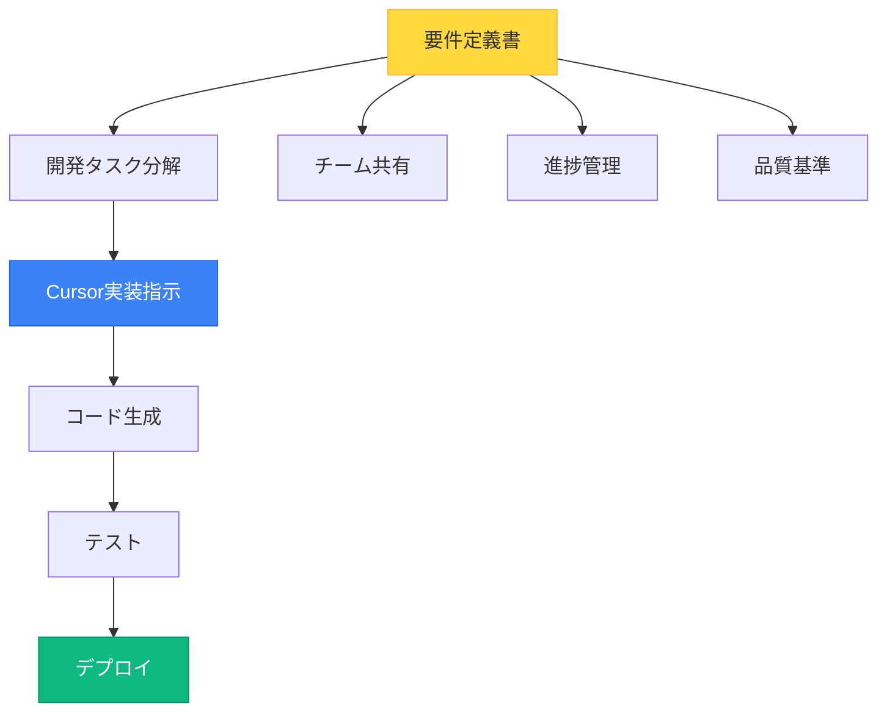

### **次のアクション（優先順位順）**

| 優先度 | **タスク** | **所要時間** | **成果物** |
|--------|----------|------------|-----------|
| **1** | 開発環境構築 | 30分 | Next.jsプロジェクト |
| **2** | Supabaseセットアップ | 20分 | データベース準備完了 |
| **3** | Clerk設定 | 15分 | 認証システム稼働 |
| **4** | 基本UIの実装 | 2時間 | 投稿・一覧画面 |
| **5** | Vercelデプロイ | 10分 | 公開URL取得 |

### **Cursorへの実装指示例**

```markdown
@docs/output/system_requirements.md を基に、
Phase 1のMVP機能を実装してください。

優先順位:
1. レシピ投稿機能（画像アップロード含む）
2. レシピ一覧表示（最新10件）
3. レシピ詳細表示

技術スタック:
- Next.js 15 (App Router)
- TypeScript
- Supabase（データベース＆ストレージ）
- Tailwind CSS

フォルダ構造:
src/
  app/
    page.tsx (一覧)
    recipes/
      new/page.tsx (投稿)
      [id]/page.tsx (詳細)
  components/
    RecipeCard.tsx
    RecipeForm.tsx
  lib/
    supabase.ts
```

---

## 💡 この章のまとめ

- ✅ フォルダ構造を整理し、input/output/promptの3層構造で管理
- ✅ 第1プロンプトで基本要件、第2プロンプトで詳細設計を生成
- ✅ 生成結果は必ず評価し、必要に応じてAIと対話して改善
- ✅ MoSCoW分類でMVPを明確にし、段階的に実装を進める
- ✅ 要件書は開発の羅針盤として、常に参照しながら進める

## 🚀 次の章への橋渡し

要件定義演習を通じて、アイデアが具体的な設計書に変わりました。次の第5章では、生成された要件書をさらに洗練させ、実装に向けた環境構築を進めます。また、よくある失敗パターンとその対策も学びます。

---

# 第5章：要件定義の品質向上テクニック

## 🎯 この章で学ぶこと

- **Text is KING**の原則を理解し、インプットの質を劇的に向上させる
- **よくある失敗パターン**を知り、初心者が陥りやすい罠を回避する
- **要件定義の反復改善**プロセスを習得し、品質を継続的に高める
- **実装への移行判断基準**を理解し、適切なタイミングを見極める
- **環境変数とAPIキーの安全管理**方法を実践的に学ぶ

## 📌 この章の位置づけ

第4章の演習を踏まえ、要件定義の品質をさらに高めるためのテクニックを学びます。これは単なる文書作成のコツではなく、AI駆動開発の成功率を大きく左右する重要なスキルです。

---

## 📝 Text is KING - インプットの質が全てを決める

### **なぜインプットの質が重要なのか**

```mermaid
graph TB
    subgraph "質の低いインプット"
        A1[曖昧な説明] --> B1[AIが推測]
        B1 --> C1[一般的な回答]
        C1 --> D1[使えない要件書]
    end

    subgraph "質の高いインプット"
        A2[具体的な説明] --> B2[AIが理解]
        B2 --> C2[的確な回答]
        C2 --> D2[実装可能な要件書]
    end

    style D1 fill:#ef4444,stroke:#dc2626,color:#fff
    style D2 fill:#10b981,stroke:#059669,color:#fff
```

### **良いインプットの5つの要素**

| 要素 | **悪い例** | **良い例** |
|------|----------|----------|
| **具体性** | 「タスク管理アプリ」 | 「5人チームで使う、カンバン方式のタスク管理アプリ」 |
| **数値化** | 「速いレスポンス」 | 「3秒以内にページ表示」 |
| **ペルソナ** | 「ユーザー」 | 「30代会社員の田中さん、Excel管理に疲れている」 |
| **現状と理想** | 「便利にしたい」 | 「現状：メール添付で共有（30分）→ 理想：リアルタイム共有（0分）」 |
| **制約条件** | 記載なし | 「予算：月3,000円まで、期限：1ヶ月、スキル：初心者」 |

### **インプット改善の実例**

#### **Before（曖昧）**
```markdown
## アプリ概要
料理のSNSアプリを作りたい
```

#### **After（具体的）**
```markdown
## アプリ概要
**名称**: おうちシェフ
**対象**: 30-40代の主婦層（月5万人想定）

## 解決する課題
- **現状**: クックパッド検索に平均15分、レシピ選びに迷う
- **理想**: AIが家族の好みを学習し、3つに絞って5秒で提案

## 差別化ポイント
1. 家族の評価を蓄積（👍👎で簡単入力）
2. 冷蔵庫の食材から逆引き検索
3. 栄養バランスを自動計算

## 成功指標
- 1日1回以上の利用率: 60%以上
- レシピ決定時間: 5分以内
- 家族満足度: 4.0/5.0以上
```

---

## ⚠️ よくある失敗パターンと対策

### **失敗パターン1：完璧主義の罠**

```mermaid
graph LR
    A[100個の機能を<br/>リストアップ] --> B[全部実装<br/>しようとする]
    B --> C[複雑になりすぎる]
    C --> D[完成しない]

    E[10個の機能に<br/>絞る] --> F[MVPを<br/>まず作る]
    F --> G[ユーザー<br/>フィードバック]
    G --> H[段階的に<br/>機能追加]

    style D fill:#ef4444,stroke:#dc2626,color:#fff
    style H fill:#10b981,stroke:#059669,color:#fff
```

**対策**: 「Phase 1は5機能まで」というルールを設ける

### **失敗パターン2：技術優先思考**

| 症状 | **問題** | **対策** |
|------|---------|---------|
| 「最新技術を全部使いたい」 | 学習コストが爆発 | 推奨スタックに固定 |
| 「マイクロサービスにしたい」 | 複雑すぎて管理不能 | モノリシックから始める |
| 「AIを全部に組み込みたい」 | コストが跳ね上がる | コア機能のみAI活用 |

### **失敗パターン3：スケール前提の過剰設計**

```markdown
❌ 悪い例：
「100万人が同時アクセスしても大丈夫なシステム」
→ 初期ユーザー10人なのに、月10万円のインフラコスト

✅ 良い例：
「まず100人で検証、1,000人で最適化、10,000人で本格スケール」
→ 段階的にインフラを拡張（初期は無料）
```

### **失敗パターン4：ユーザー視点の欠如**

```mermaid
mindmap
  root((ユーザー視点))
    作りたい機能
      開発者の興味
      技術的チャレンジ
      カッコいい機能
    使われる機能
      日常の課題解決
      時間の節約
      ストレス軽減
      楽しさ提供
```

**対策**: 必ず「誰の、どんな課題を、どう解決するか」を明確にする

---

## 🔄 要件定義の反復改善プロセス

### **PDCAサイクルで品質向上**

```mermaid
graph TB
    A[Plan<br/>要件定義v1] --> B[Do<br/>プロトタイプ作成]
    B --> C[Check<br/>レビュー・検証]
    C --> D[Act<br/>要件定義v2]
    D --> A

    C --> E{十分な品質?}
    E -->|Yes| F[実装開始]
    E -->|No| D

    style F fill:#10b981,stroke:#059669,color:#fff
```

### **各バージョンでの改善ポイント**

| バージョン | **フォーカス** | **改善内容** | **成果物** |
|-----------|--------------|------------|-----------|
| **v1** | 全体像の把握 | アイデアを形にする | 基本要件書 |
| **v2** | 実現可能性 | 技術的な裏付け | 詳細設計書 |
| **v3** | ユーザー価値 | UX改善、優先度調整 | 実装仕様書 |
| **v4** | 運用考慮 | セキュリティ、保守性 | 最終仕様書 |

### **AIへの段階的な質問例**

```markdown
# 第1回質問（概要）
「タスク管理アプリの要件定義をしてください」

# 第2回質問（詳細化）
「Phase 1のMVPに絞って、3日で実装可能な仕様にしてください」

# 第3回質問（技術選定）
「Next.js 15とSupabaseを使った具体的な実装方法を追加してください」

# 第4回質問（最適化）
「パフォーマンスとセキュリティの観点から要件を見直してください」
```

---

## 🚦 実装への移行判断基準

### **要件定義完了のチェックリスト**

```mermaid
graph TB
    subgraph "ビジネス要件"
        A[ターゲット明確?]
        B[価値提案明確?]
        C[収益モデル?]
    end

    subgraph "システム要件"
        D[機能一覧完成?]
        E[技術スタック確定?]
        F[DB設計完了?]
    end

    subgraph "実装準備"
        G[環境構築済み?]
        H[APIキー取得?]
        I[Git設定完了?]
    end

    A & B & C & D & E & F & G & H & I --> J{全てYes?}
    J -->|Yes| K[実装開始！]
    J -->|No| L[要件見直し]

    style K fill:#10b981,stroke:#059669,color:#fff
    style L fill:#f59e0b,stroke:#d97706
```

### **最低限必要な成果物**

| 成果物 | **必須項目** | **確認方法** |
|--------|------------|-------------|
| **ビジネス要件書** | ペルソナ、課題、価値 | ユーザーインタビュー |
| **システム要件書** | 機能一覧、非機能要件 | 技術レビュー |
| **画面遷移図** | 主要画面のフロー | ユーザビリティテスト |
| **データモデル** | ER図、テーブル定義 | DB設計レビュー |
| **技術スタック** | 使用技術の確定 | 実装可能性検証 |

---

## 🔐 環境変数とAPIキーの安全管理

### **なぜ環境変数が重要なのか**

```mermaid
graph TB
    subgraph "危険な管理"
        A[APIキーを<br/>コードに直接記述] --> B[GitHubに<br/>プッシュ]
        B --> C[公開される]
        C --> D[不正利用<br/>高額請求]
    end

    subgraph "安全な管理"
        E[環境変数に<br/>分離] --> F[.env.local<br/>に記載]
        F --> G[.gitignore<br/>で除外]
        G --> H[安全に<br/>運用]
    end

    style D fill:#ef4444,stroke:#dc2626,color:#fff
    style H fill:#10b981,stroke:#059669,color:#fff
```

### **環境変数の設定方法**

#### **1. .env.localファイルの作成**

```bash
# .env.local（実際の値を記載、Gitには上げない）

# Supabase
NEXT_PUBLIC_SUPABASE_URL=https://xxxxx.supabase.co
NEXT_PUBLIC_SUPABASE_ANON_KEY=eyJhbGc...実際のキー
SUPABASE_SERVICE_ROLE_KEY=eyJhbGc...管理者キー

# Clerk
NEXT_PUBLIC_CLERK_PUBLISHABLE_KEY=pk_test_xxxxx
CLERK_SECRET_KEY=sk_test_xxxxx

# OpenAI
OPENAI_API_KEY=sk-xxxxx
```

#### **2. .env.exampleファイルの作成**

```bash
# .env.example（テンプレート、Gitに上げる）

# Supabase
NEXT_PUBLIC_SUPABASE_URL=your_supabase_url_here
NEXT_PUBLIC_SUPABASE_ANON_KEY=your_anon_key_here
SUPABASE_SERVICE_ROLE_KEY=your_service_role_key_here

# Clerk
NEXT_PUBLIC_CLERK_PUBLISHABLE_KEY=your_publishable_key_here
CLERK_SECRET_KEY=your_secret_key_here

# OpenAI
OPENAI_API_KEY=your_openai_key_here
```

#### **3. .gitignoreの設定**

```bash
# .gitignore
.env.local
.env
```

### **各サービスのAPIキー取得方法**

| サービス | **取得場所** | **所要時間** | **注意点** |
|---------|------------|------------|----------|
| **Supabase** | Dashboard → Settings → API | 5分 | 2つのキーを正確にコピー |
| **Clerk** | Dashboard → API Keys | 3分 | PublishableとSecretを区別 |
| **OpenAI** | API Keys → Create new secret key | 2分 | 一度しか表示されない |
| **Vercel** | 自動設定される | 0分 | GitHub連携で自動 |

---

## 💡 この章のまとめ

- ✅ Text is KING - インプットの質が要件定義の質を決定する
- ✅ 完璧主義、技術優先、過剰設計、ユーザー視点欠如を避ける
- ✅ PDCAサイクルで要件定義を段階的に改善する
- ✅ チェックリストで実装開始のタイミングを判断する
- ✅ 環境変数でAPIキーを安全に管理し、絶対にコードに書かない

## 🚀 次の章への橋渡し

要件定義の品質を高めるテクニックを学びました。次の第6章では、実際の開発プロジェクトでの成功事例と、プロジェクト完遂のための実践的なアドバイスを紹介します。

---

# 第6章：実践事例と次のステップ

## 🎯 この章で学ぶこと

- **実際の変換例**を通じて、ビジネスアイデアからシステム要件への変換プロセスを具体的に理解する
- **成功プロジェクトの共通パターン**を学び、成功の再現性を高める
- **開発環境構築の実践手順**を習得し、すぐに開発を始められる状態を作る
- **本日の宿題と次回への準備**を明確にし、学習の継続性を確保する

## 📌 この章の位置づけ

これまで学んだ技術スタックと要件定義のスキルを統合し、実際のプロジェクトに適用する方法を学びます。理論から実践への橋渡しとなる、最も実践的な章です。

---

## 🔄 実際の変換例

### **ケース1：ガジェット好きのための備忘録SNS**

#### **ビジネス要件（入力）**

```markdown
## コンセプト
「自分が買ったガジェットの備忘録を、同じ趣味の人とシェアする」

## ターゲット
- 20-40代のガジェット好き男性
- 年間10万円以上ガジェットに使う
- YouTubeレビューをよく見る

## 課題
- 買ったガジェットの設定を忘れる
- 同じ趣味の人と繋がりにくい
- レビューが散在していて比較しにくい
```

#### **システム要件（AI出力）**

```mermaid
graph TB
    subgraph "Core Features"
        A[ガジェット登録<br/>写真・スペック]
        B[タイムライン<br/>フォロワーの投稿]
        C[レビュー機能<br/>5段階評価]
        D[比較機能<br/>スペック比較表]
    end

    subgraph "Differentiation"
        E[自動スペック取得<br/>Amazon API]
        F[使用期間記録<br/>満足度変化]
        G[セットアップメモ<br/>備忘録機能]
    end

    A --> B
    B --> C
    C --> D
    D --> E
    E --> F
    F --> G

    style A fill:#3b82f6,stroke:#2563eb,color:#fff
    style E fill:#10b981,stroke:#059669,color:#fff
```

#### **技術スタック選定理由**

| 要件 | **選定技術** | **理由** |
|------|------------|---------|
| **リアルタイムタイムライン** | Supabase Realtime | WebSocket標準対応 |
| **画像大量保存** | Supabase Storage | 1GB無料、CDN付き |
| **スペック比較** | React Table | 高機能な表コンポーネント |
| **Amazon連携** | Amazon Product API | 商品情報自動取得 |

---

### **ケース2：料理レシピ写真シェアSNS**

#### **ビジネス要件（入力）**

```markdown
## コンセプト
「作った料理を写真でシェア、家族の評価で成長するレシピ帳」

## ターゲット
- 30-40代主婦
- 料理は好きだが献立に悩む
- 家族の好みを把握したい

## 提供価値
- AIが家族の好みを学習
- 献立を3つに絞って提案
- 買い物リストを自動生成
```

#### **システム要件（AI出力）**

```mermaid
erDiagram
    users ||--o{ recipes : creates
    users ||--o{ family_members : manages
    family_members ||--o{ ratings : gives
    recipes ||--o{ ingredients : contains
    recipes ||--o{ ratings : receives
    recipes ||--o{ photos : has

    users {
        uuid id PK
        string email
        string name
        json preferences
    }

    recipes {
        uuid id PK
        uuid user_id FK
        string title
        text instructions
        integer cooking_time
        float total_cost
    }

    ratings {
        uuid id PK
        uuid recipe_id FK
        uuid member_id FK
        integer score "1-5"
        string emoji "😍😊😐😕😫"
    }
```

#### **開発フェーズ**

```mermaid
graph LR
    subgraph "Phase 1 (1週間)"
        A[基本投稿<br/>写真+レシピ]
    end

    subgraph "Phase 2 (2週間)"
        B[家族評価<br/>システム]
        C[材料管理<br/>買い物リスト]
    end

    subgraph "Phase 3 (3週間)"
        D[AI分析<br/>好み学習]
        E[献立提案<br/>3つ推薦]
    end

    A --> B
    B --> C
    C --> D
    D --> E

    style A fill:#ef4444,stroke:#dc2626,color:#fff
    style C fill:#f59e0b,stroke:#d97706
    style E fill:#10b981,stroke:#059669,color:#fff
```

---

## ✨ 成功プロジェクトの共通パターン

### **成功の3要素**

```mermaid
mindmap
  root((成功の<br/>3要素))
    明確な価値提案
      具体的な課題
      測定可能な改善
      ユーザーの声
    段階的実装
      小さく始める
      早く公開
      継続的改善
    技術の固定
      推奨スタック
      既存の知識活用
      新技術は1つまで
```

### **成功事例の共通点**

| 項目 | **成功パターン** | **失敗パターン** |
|------|----------------|----------------|
| **初期スコープ** | 5機能以下のMVP | 20機能の完璧主義 |
| **開発期間** | 2週間で初版公開 | 3ヶ月かけて未完成 |
| **技術選定** | 推奨スタック+1 | 10個の新技術に挑戦 |
| **ユーザーフィードバック** | 1週目から収集 | 完成してから収集 |
| **改善サイクル** | 毎週アップデート | 月1回の大型更新 |

### **講師の実例：MENU DBシステム**

```markdown
## 概要
飲食店のメニュー情報をDB化し、原価計算を自動化

## 開発プロセス
Week 1: 基本CRUD機能のみ（5機能）
Week 2: ユーザーフィードバックで優先度変更
Week 3: 原価計算機能追加
Week 4: レポート機能追加

## 結果
- 初版2週間で納品
- その後3ヶ月で機能を段階追加
- ユーザー満足度95%
```

---

## 🛠 開発環境構築の実践手順

### **Step 1: Next.jsプロジェクト作成（5分）**

```bash
# ターミナルで実行
npx create-next-app@latest my-recipe-app \
  --typescript \
  --tailwind \
  --app \
  --src-dir \
  --eslint

cd my-recipe-app
```

### **Step 2: 必要パッケージのインストール（3分）**

```bash
# Supabase
npm install @supabase/supabase-js

# Clerk
npm install @clerk/nextjs

# その他便利なパッケージ
npm install react-hot-toast  # 通知
npm install date-fns         # 日付処理
npm install zod              # バリデーション
```

### **Step 3: 環境変数の設定（5分）**

```bash
# .env.localを作成
touch .env.local

# エディタで開いて、各サービスのキーを設定
# Supabase、Clerk、OpenAIなど
```

### **Step 4: Supabaseプロジェクト作成（10分）**

```mermaid
graph LR
    A[supabase.com<br/>アクセス] --> B[New Project<br/>クリック]
    B --> C[プロジェクト名<br/>入力]
    C --> D[Region選択<br/>Tokyo]
    D --> E[Create Project]
    E --> F[APIキー<br/>コピー]

    style A fill:#3b82f6,stroke:#2563eb,color:#fff
    style F fill:#10b981,stroke:#059669,color:#fff
```

### **Step 5: 基本的なフォルダ構造**

```
src/
├── app/
│   ├── layout.tsx        # ClerkProvider設定
│   ├── page.tsx          # ホームページ
│   ├── api/
│   │   └── [...routes]   # API Routes
│   └── (auth)/
│       ├── sign-in/
│       └── sign-up/
├── components/
│   ├── ui/               # 共通UIコンポーネント
│   └── features/         # 機能別コンポーネント
├── lib/
│   ├── supabase.ts       # Supabaseクライアント
│   └── utils.ts          # ユーティリティ関数
└── types/
    └── index.ts          # TypeScript型定義
```

---

## 📝 本日の宿題

### **必須課題（所要時間：60分）**

#### **1. 要件定義書の完成（30分）**

```markdown
タスク:
□ business_requirements.md を完成させる
□ 第1プロンプトを実行して基本要件を生成
□ 第2プロンプトを実行して詳細設計を追加
□ Phase 1のMVP範囲を明確化（5機能以内）

成果物:
- docs/output/system_requirements.md
- docs/output/detailed_requirements_specification.md
```

#### **2. 開発環境構築（20分）**

```bash
# 実行するコマンド
npx create-next-app@latest [あなたのアプリ名] \
  --typescript --tailwind --app --src-dir --eslint

cd [あなたのアプリ名]
npm install @supabase/supabase-js @clerk/nextjs

# Gitリポジトリ作成
git init
git add .
git commit -m "Initial commit"
```

#### **3. サービスアカウント作成（10分）**

| サービス | **URL** | **作成するもの** |
|---------|--------|----------------|
| **Supabase** | supabase.com | プロジェクト作成、APIキー取得 |
| **Clerk** | clerk.com | アプリケーション作成、キー取得 |
| **Vercel** | vercel.com | アカウント作成（GitHub連携） |

### **任意課題（チャレンジ）**

```markdown
1. v0.devでUIプロトタイプを作成
   - 要件定義書を基にプロンプト作成
   - 3つのバリエーションを生成
   - 最も良いものを選択

2. ワイヤーフレーム作成
   - 主要3画面をスケッチ
   - 画面遷移を矢印で表現
   - 必要な要素をリストアップ

3. 技術調査
   - 使用予定の技術の公式ドキュメントを読む
   - チュートリアルを1つ完了
   - 不明点をリストアップ
```

---

## 💡 この章のまとめ

- ✅ 実際の変換例を通じて、要件定義の具体的なイメージを掴んだ
- ✅ 成功プロジェクトは「小さく始めて、早く公開、継続的改善」が共通
- ✅ 開発環境構築は30分あれば完了できる
- ✅ 要件定義書の完成と環境構築が次回への重要な準備
- ✅ Phase 1は5機能以内に絞ることが成功の鍵

## 🚀 次の章への橋渡し

技術スタックと要件定義の実践的なスキルを身につけました。最終章では、今日の学びをまとめ、次回講義への期待を高めます。また、継続的な学習のためのリソースも紹介します。

---

# 第7章：まとめと未来への展望

## 🎯 この章で学ぶこと

- **本日の学びの総復習**を行い、重要ポイントを再確認する
- **次回講義への期待**を高め、学習の継続性を確保する
- **Vibe Coderとしての成長ロードマップ**を理解し、長期的な視野を持つ
- **継続的学習のためのリソース**を把握し、自主学習の道筋を立てる
- **AIと共に創る未来**のビジョンを共有し、モチベーションを最大化する

## 📌 この章の位置づけ

本日の講義の締めくくりとして、学んだ内容を統合し、次のステップへの道筋を明確にします。これは単なるまとめではなく、Vibe Coderとしての旅の始まりを祝福し、未来への期待を共有する時間です。

---

## 📚 本日の学びの総まとめ

### **3つの重要な理解**

```mermaid
graph TB
    subgraph "1. 技術スタックの理解"
        A[建材を選ぶように<br/>技術を選択]
        B[推奨構成から始めて<br/>徐々に最適化]
        C[4つの観点で判断]
    end

    subgraph "2. AI要件定義の威力"
        D[ビジネスアイデアを<br/>設計書に自動変換]
        E[専門知識不要で<br/>本格的な要件定義]
        F[抜け漏れ防止と<br/>新たな視点]
    end

    subgraph "3. 実践的ワークフロー"
        G[docs/input →<br/>AI分析 → output]
        H[要件書を指針に<br/>開発を進める]
        I[段階的実装で<br/>リスク最小化]
    end

    A & B & C --> J[技術選択力]
    D & E & F --> K[要件定義力]
    G & H & I --> L[実践力]

    J & K & L --> M[Vibe Coderの<br/>3つの力]

    style M fill:#fbbf24,stroke:#f59e0b,stroke-width:3px
```

### **できるようになったこと**

| Before（講義前） | **After（講義後）** |
|----------------|------------------|
| 技術選択に迷う | ✅ 推奨スタックを理解し、判断基準を持つ |
| 要件定義が分からない | ✅ AIで要件定義を自動化できる |
| エンジニアと話せない | ✅ 技術用語を理解し、設計書を共有できる |
| 何から始めれば？ | ✅ MVP定義から環境構築まで明確 |
| アイデアだけで止まる | ✅ 実装可能な設計書に変換できる |

### **習得したスキル一覧**

```mermaid
mindmap
  root((習得スキル))
    技術理解
      Next.js 15の特徴
      TypeScriptの利点
      Supabaseの5機能
      Clerkの実装速度
      Vercelの自動デプロイ
    要件定義
      2段階プロンプト戦略
      MoSCoW優先度設定
      Mermaid図の理解
      ER図の読み方
    実践技術
      環境変数管理
      APIキー保護
      フォルダ構造設計
      Git基本操作
    思考法
      Text is KING
      MVP思考
      段階的実装
      ユーザー視点
```

---

## 🚀 次回講義への期待

### **第三回で学ぶこと**

```mermaid
graph LR
    subgraph "第三回前半"
        A[DB基礎] --> B[Supabase<br/>実装]
    end

    subgraph "第三回後半"
        C[認証基礎] --> D[Clerk<br/>実装]
    end

    E[要件定義書] --> A
    B --> F[データ永続化]
    D --> G[ユーザー管理]

    F & G --> H[本格的な<br/>アプリ完成]

    style E fill:#ffd93d,stroke:#f4b942
    style H fill:#10b981,stroke:#059669,color:#fff
```

### **次回までの準備チェックリスト**

- [ ] 要件定義書が完成している
- [ ] 開発環境が構築済み
- [ ] Supabaseプロジェクトを作成済み
- [ ] Clerkアカウントを作成済み
- [ ] Phase 1の機能が5個以内に絞られている
- [ ] 基本的なフォルダ構造が整っている

### **第三回後にできるようになること**

| スキル | **詳細** | **成果物** |
|--------|---------|-----------|
| **データベース設計** | テーブル作成、リレーション設定 | 動くDB |
| **CRUD操作** | Create、Read、Update、Delete | 機能する画面 |
| **認証システム** | ログイン、サインアップ、ログアウト | セキュアなアプリ |
| **リアルタイム同期** | 複数ユーザーでの同時編集 | 協働アプリ |

---

## 🎓 Vibe Coderとしての成長ロードマップ

### **4週間後のあなた**

```mermaid
graph TB
    subgraph "Week 1"
        A[マインドセット<br/>変革] --> B[要件定義<br/>マスター]
    end

    subgraph "Week 2"
        C[DB・認証<br/>実装] --> D[基本アプリ<br/>完成]
    end

    subgraph "Week 3"
        E[デプロイ<br/>公開] --> F[ユーザー<br/>フィードバック]
    end

    subgraph "Week 4"
        G[機能追加<br/>改善] --> H[本格運用<br/>開始]
    end

    B --> C
    D --> E
    F --> G

    H --> I[🎉 Vibe Coder<br/>デビュー！]

    style A fill:#ffd93d,stroke:#f4b942
    style I fill:#10b981,stroke:#059669,color:#fff
```

### **3ヶ月後の到達レベル**

| 期間 | **到達レベル** | **作れるもの** |
|------|--------------|---------------|
| **1ヶ月後** | 基本的なWebアプリ | ToDoアプリ、メモアプリ |
| **2ヶ月後** | データベース連携アプリ | SNS、ブログシステム |
| **3ヶ月後** | 本格的なサービス | SaaS、業務システム |

### **1年後のビジョン**

> **「あなたは複数のサービスを運営し、**
> **AIと協働して新しい価値を生み出し続けている」**

---

## 📖 継続的学習のためのリソース

### **公式ドキュメント（必須）**

| リソース | **URL** | **学習優先度** |
|---------|--------|---------------|
| **Next.js** | nextjs.org/docs | ⭐⭐⭐⭐⭐ |
| **Supabase** | supabase.com/docs | ⭐⭐⭐⭐⭐ |
| **Clerk** | clerk.com/docs | ⭐⭐⭐⭐ |
| **TypeScript** | typescriptlang.org | ⭐⭐⭐⭐ |
| **React** | react.dev | ⭐⭐⭐ |

### **学習コミュニティ**

```mermaid
graph TB
    subgraph "TEKION Group"
        A[Vibe Coder<br/>Discord]
        B[Slack<br/>#vibecoder]
    end

    subgraph "外部コミュニティ"
        C[Zenn.dev]
        D[Qiita]
        E[Stack Overflow]
    end

    subgraph "学習プラットフォーム"
        F[Udemy]
        G[YouTube]
        H[公式Tutorial]
    end

    A & B --> I[質問・相談]
    C & D & E --> J[技術情報]
    F & G & H --> K[学習教材]

    I & J & K --> L[継続的<br/>成長]

    style L fill:#10b981,stroke:#059669,color:#fff
```

### **推奨学習パス**

```markdown
## 今週
- [ ] Next.js公式チュートリアル完了
- [ ] Supabaseクイックスタート実践

## 来週
- [ ] TypeScript基礎（3時間コース）
- [ ] Tailwind CSSの基本

## 再来週
- [ ] React Hooksの理解
- [ ] Server Actionsの実装

## 1ヶ月後
- [ ] 自分のアイデアでアプリ作成
- [ ] Vercelにデプロイして公開
```

---

## 🌟 AIと共に創る未来

### **Vibe Coderとしての可能性**

```mermaid
graph TB
    subgraph "現在のあなた"
        A[アイデアを持つ<br/>非エンジニア]
    end

    subgraph "1ヶ月後"
        B[MVP開発者<br/>基本アプリ作成]
    end

    subgraph "3ヶ月後"
        C[フルスタック<br/>開発者]
    end

    subgraph "6ヶ月後"
        D[サービス<br/>運営者]
    end

    subgraph "1年後"
        E[技術起業家<br/>イノベーター]
    end

    A --> B --> C --> D --> E

    style A fill:#ffd93d,stroke:#f4b942
    style E fill:#10b981,stroke:#059669,color:#fff
```

### **革命の主役はあなた**

| 時代 | **主役** | **必要スキル** | **価値創造** |
|------|---------|---------------|-------------|
| **産業革命** | 工場経営者 | 機械操作 | 大量生産 |
| **IT革命** | プログラマー | コーディング | デジタル化 |
| **AI革命** | **Vibe Coder** | **コンテクストコントロール** | **無限の創造** |

### **最後のメッセージ**

> **「技術は手段、価値創造が目的」**
>
> AIはあなたの可能性を解放するパートナーです。
> プログラミング経験がないことは、もはやハンデではありません。
> むしろ、ユーザー視点を持つあなたこそが、
> 真に価値あるサービスを生み出せるのです。
>
> **完璧な設計より、動くプロトタイプ。**
> **まず作り、そして改善する。**
>
> あなたはもうVibe Coderです。
> さあ、一緒に未来を創りましょう！

---

## 💡 この講義のまとめ

- ✅ 技術スタックの選択基準と推奨構成を完全に理解した
- ✅ AIによる要件定義で、アイデアを設計書に変換できるようになった
- ✅ 環境構築から実装への道筋が明確になった
- ✅ Text is KINGの原則で、AIへの指示の質を高められる
- ✅ MVP思考と段階的実装で、確実に成果を出せる

## 🚀 次回への橋渡し

今回学んだ技術スタックと要件定義は、すべての開発の土台となります。次回の第三回では、いよいよ実装フェーズに入ります。Supabaseでデータベースを構築し、Clerkで認証システムを実装して、本格的なアプリケーションを完成させます。

要件定義書を完成させ、開発環境を整えて、次回の講義に臨んでください。

---

# 📚 付録：クイックリファレンス

## コマンド集

```bash
# Next.jsプロジェクト作成
npx create-next-app@latest my-app --typescript --tailwind --app --src-dir --eslint

# 開発サーバー起動
npm run dev       # 通常起動
npm run dev:turbo # Turbopack（高速）

# パッケージインストール
npm install @supabase/supabase-js
npm install @clerk/nextjs

# Git操作
git add .
git commit -m "メッセージ"
git push origin main

# Vercelデプロイ
vercel
```

## 環境変数テンプレート

```bash
# Supabase
NEXT_PUBLIC_SUPABASE_URL=https://xxxxx.supabase.co
NEXT_PUBLIC_SUPABASE_ANON_KEY=eyJhbGc...
SUPABASE_SERVICE_ROLE_KEY=eyJhbGc...

# Clerk
NEXT_PUBLIC_CLERK_PUBLISHABLE_KEY=pk_test_xxxxx
CLERK_SECRET_KEY=sk_test_xxxxx

# OpenAI (オプション)
OPENAI_API_KEY=sk-xxxxx
```

## Cursorへの指示テンプレート

```markdown
# 要件定義を基に実装
@docs/output/system_requirements.md を基に、
Phase 1のMVP機能を実装してください。

# エラー解決
以下のエラーが発生しました：
[エラーメッセージ]
環境：Next.js 15, TypeScript, Supabase
解決方法を教えてください。

# 機能追加
[機能名]を追加実装してください。
要件：
- [要件1]
- [要件2]
TypeScriptの型定義も含めてお願いします。
```

---

**お疲れ様でした！🎉**

**次回もお会いできることを楽しみにしています。**
**頑張ってください！応援しています！🚀**