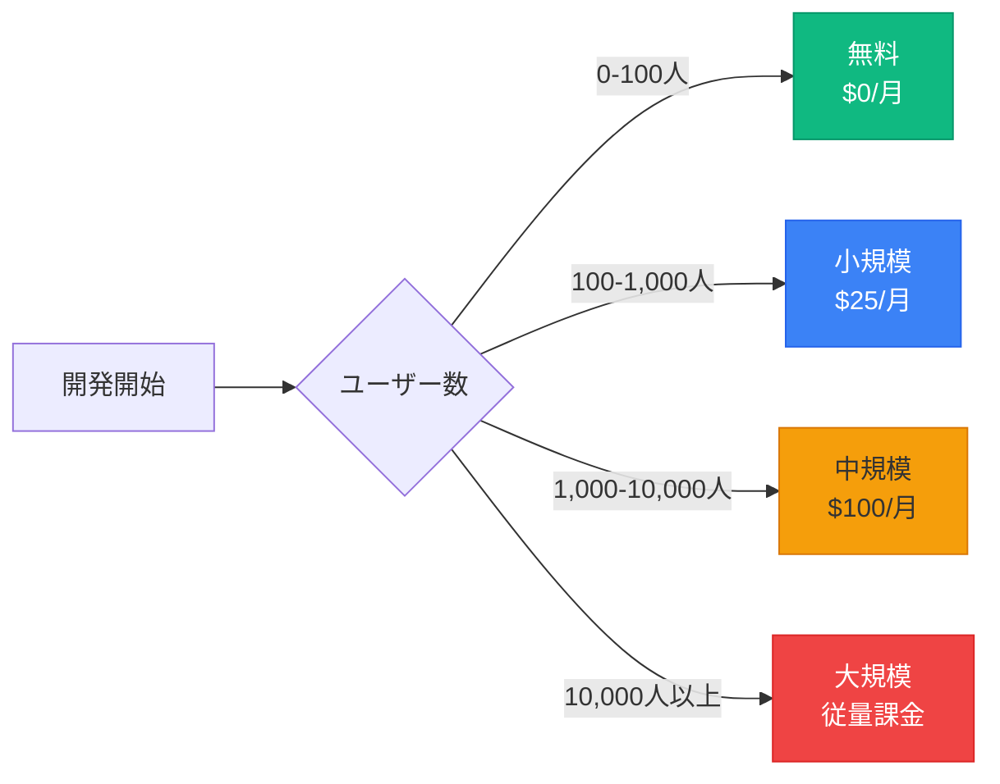
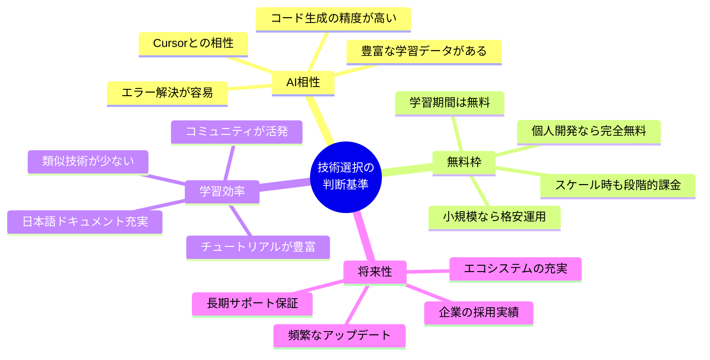
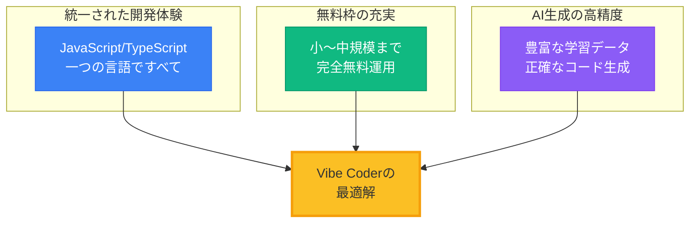
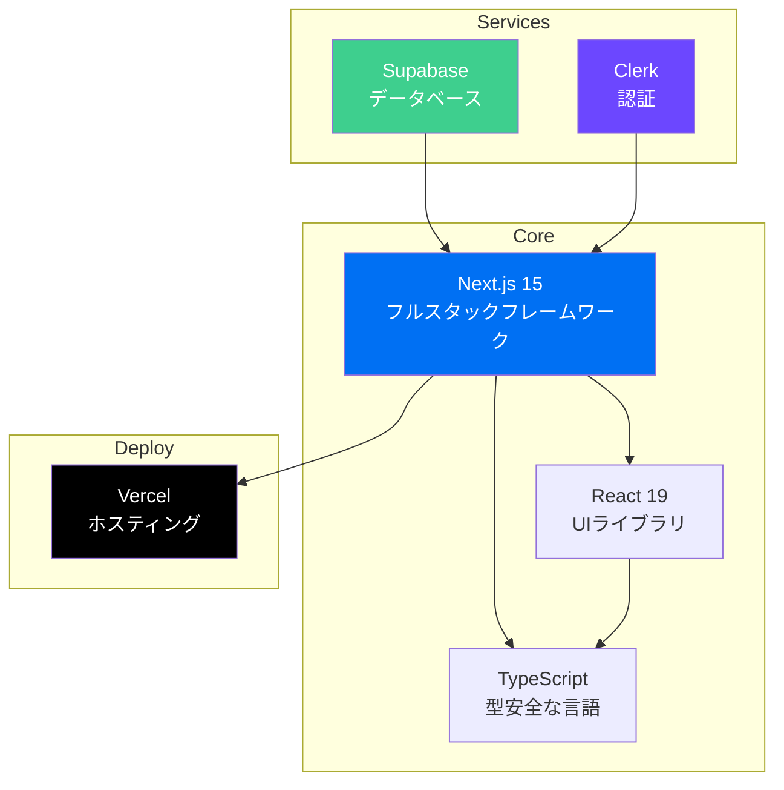
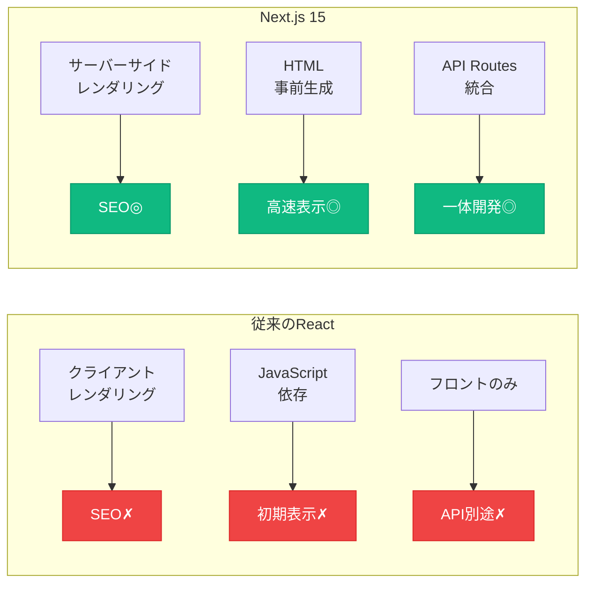
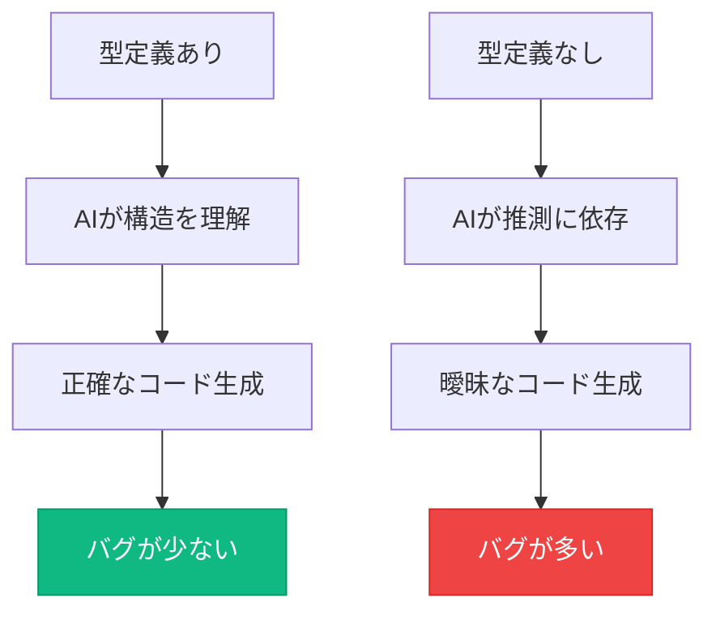
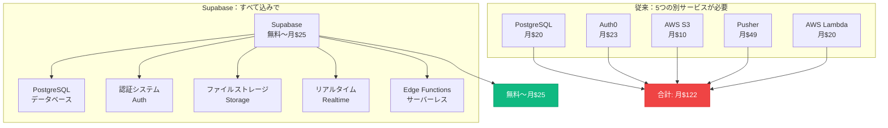
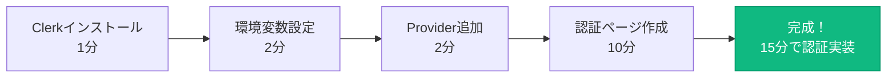
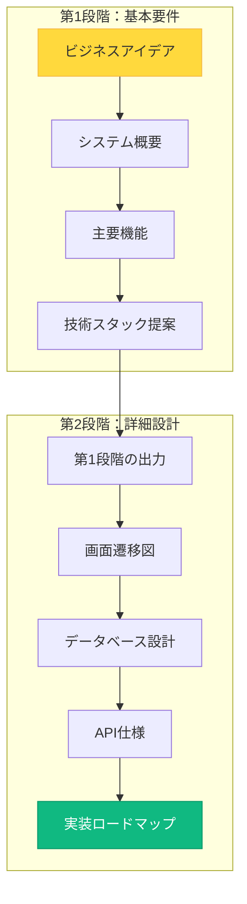
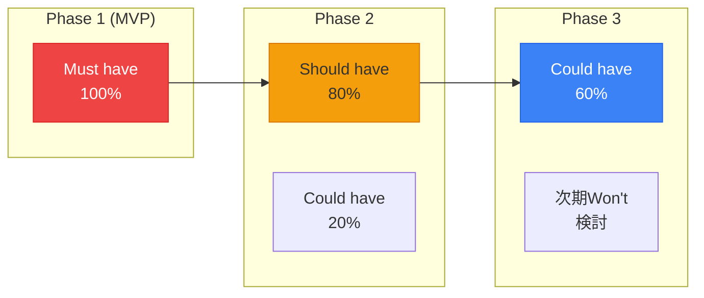

# 第二回講義（後半）：技術スタックとAI要件定義演習

## 🎯 この講義で学ぶこと

- **技術スタックの本質**を理解し、「どの技術を選ぶべきか」を判断できるようになる
- **Vibe Coder推奨技術スタック**（Next.js、TypeScript、Supabase、Clerk、Vercel）の全体像を把握する
- **AIによる要件定義の革命的手法**を実践し、アイデアを設計図に自動変換する体験
- **Cursorへの指示方法**を習得し、AIとの対話で開発を進める力を身につける
- **Text is KING**の実践を通じて、AIへの指示の質を劇的に向上させる

## 📌 この講義の位置づけ

本講義は、第二回の後半パートです。前半で学んだWebアプリの仕組みとAPIの基礎知識を土台に、実際の開発で使う「技術スタック」と「AI要件定義」を学びます。

これは単なる技術の紹介ではありません。**あなたのアイデアを形にするための「道具選び」と「設計図作成」**という、開発の最も重要な2つのスキルを身につける時間です。

第三回以降の実装フェーズに向けて、今回の内容は**すべての開発の土台**となります。

---

# 第1章：技術スタックの本質を理解する

## 🎯 この章で学ぶこと

- **技術スタックとは何か**を建築に例えて直感的に理解する
- **技術選択の4つの判断基準**（AI相性・無料枠・学習効率・将来性）を習得する
- **適材適所の技術選択**がアプリケーションの品質を決定することを理解する

## 📌 この章の位置づけ

前半で学んだWebアプリの仕組みを踏まえ、実際の開発で使う「建材」である技術スタックについて学びます。これは、第2章で紹介する推奨技術を理解するための基礎となります。

---

## 🏠 家を建てることに例えると

### **建築とWebアプリケーションの驚くべき類似性**

あなたが家を建てるとき、どのような材料を選びますか？基礎にはコンクリート、骨組みには鉄骨、外壁にはサイディング、屋根には瓦...。それぞれの部分に最適な材料を選びますよね。

**Webアプリケーション開発も、まったく同じです。**


### **適材適所が品質を決定する**

| 建築の要素 | **目的** | Webアプリの要素 | **目的** |
|-----------|---------|----------------|---------|
| **基礎（コンクリート）** | 建物全体を支える | **データベース** | すべてのデータを管理 |
| **骨組み（鉄骨）** | 構造の強度を保つ | **バックエンド** | ビジネスロジックを処理 |
| **外壁（サイディング）** | 見た目と保護 | **フロントエンド** | ユーザー体験を提供 |
| **屋根（瓦）** | 雨風から守る | **ホスティング** | 世界中からアクセス可能に |
| **内装（壁紙）** | 快適な空間作り | **認証システム** | 安全性と個人化 |

> **「良い家には良い材料、良いアプリには良い技術スタック」**

---

## 🎯 なぜ技術スタックの理解が必要なのか

### **1. AIへの的確な指示ができるようになる**

```markdown
❌ 悪い例：
「タスク管理アプリを作って」
→ AIは何を使うべきか分からず、一般的な回答しかできない

✅ 良い例：
「Next.js 15とSupabaseを使って、Clerk認証付きのタスク管理アプリを作って」
→ AIは具体的で実装可能なコードを生成できる
```

**重要な気づき**: 技術名を指定するだけで、AIの回答品質が10倍向上します。

### **2. 実現可能性を判断できるようになる**

| 質問 | なぜ重要か | 判断の例 |
|------|----------|---------|
| **「この機能は無料でできる？」** | 予算管理 | Supabaseなら500MBまで無料 |
| **「どれくらいの規模まで対応？」** | スケール計画 | 初期は1,000人、後で拡張可能 |
| **「学習にどれくらい時間が？」** | スケジュール | Next.jsなら1週間で基礎習得 |

### **3. コスト見積もりができるようになる**



---

## 🔍 技術選択の4つの判断基準

### **何を基準に技術を選ぶべきか**



### **判断基準の重要度（Vibe Coder視点）**

| 判断基準 | **重要度** | **理由** | **具体例** |
|---------|-----------|---------|-----------|
| **AI相性** | ⭐⭐⭐⭐⭐ | Cursorでの開発効率に直結 | Next.js、TypeScript |
| **無料枠** | ⭐⭐⭐⭐⭐ | 初期コストゼロで始められる | Supabase、Vercel |
| **学習効率** | ⭐⭐⭐⭐ | 短期間での習得が可能 | React、Tailwind CSS |
| **将来性** | ⭐⭐⭐ | 長期的な投資価値 | React 19、Next.js 15 |

---

## 💡 この章のまとめ

- ✅ 技術スタックは「Webアプリを作るための建材」である
- ✅ 適材適所の技術選択が、アプリケーションの品質を決定する
- ✅ AIへの指示、実現可能性、コスト見積もりのために技術理解は必須
- ✅ AI相性、無料枠、学習効率、将来性の4つの観点で技術を評価する
- ✅ Vibe CoderにとってAI相性と無料枠は特に重要

## 🚀 次の章への橋渡し

技術選択の判断基準を理解しました。次の第2章では、これらの基準をすべて満たす「Vibe Coder推奨技術スタック」を具体的に紹介します。なぜNext.js、TypeScript、Supabase、Clerk、Vercelの組み合わせが最適なのか、その理由を詳しく見ていきましょう。

---

# 第2章：Vibe Coder推奨技術スタック

## 🎯 この章で学ぶこと

- **2025年最新の推奨技術スタック**の全体像と選定理由を理解する
- **それぞれの技術の役割と強み**を把握し、なぜこの組み合わせが最適かを学ぶ
- **Cursorへの指示方法**を習得し、AIに技術スタックを正しく伝える力を身につける
- **無料枠と有料プランの境界**を理解し、コスト管理の戦略を立てる

## 📌 この章の位置づけ

第1章で学んだ技術選択の判断基準に基づき、実際にVibe Coderが使用すべき具体的な技術スタックを紹介します。これらは第3章のAI要件定義演習で実際に指定する技術となります。

---

## 🚀 推奨スタック一覧

### **初心者が最初に真似すべき黄金の構成**

| 役割 | **技術** | **バージョン** | **選定理由** |
|------|----------|---------------|-------------|
| **フロントエンド** | Next.js | 15 | 最新機能とAI対応の最前線 |
| **UIライブラリ** | React | 19 | Server Actions標準搭載 |
| **言語** | TypeScript | 5.x | 型安全でAI生成精度向上 |
| **バックエンド** | Next.js API Routes | 15 | 統一環境で学習コスト削減 |
| **データベース** | Supabase | 最新 | 無料枠充実・リアルタイム対応 |
| **認証** | Clerk | 最新 | 実装最速・UI標準装備 |
| **ホスティング** | Vercel | 最新 | GitHub連携で自動デプロイ |
| **スタイリング** | Tailwind CSS | 3.x | クラス名だけでデザイン完成 |

### **なぜこの組み合わせが最適なのか**



### **技術間の依存関係**



---

## 📘 Next.js 15 - フルスタックReactフレームワーク

### **なぜNext.jsが革命的なのか**

#### **従来のReact開発の3つの課題**

| 課題 | **問題の詳細** | **実際の影響** |
|------|---------------|---------------|
| **SEO対策困難** | 検索エンジンがJavaScriptを読めない | Googleに見つけてもらえない |
| **初期表示が遅い** | すべてをブラウザで処理 | ユーザーが離脱する |
| **バックエンド分離** | API開発が別プロジェクト | 開発が複雑で時間がかかる |

#### **Next.jsによる解決**



### **Next.js 15の3つの革新的機能**

#### **1. ファイルベースルーティング**

> **「ファイルを作るだけでページができる魔法」**

ファイル構造がそのままURLになります：
- `app/page.tsx` → `/` (トップページ)
- `app/about/page.tsx` → `/about`
- `app/blog/[id]/page.tsx` → `/blog/123`, `/blog/456`...

#### **2. React 19の最新機能を完全サポート**

| 機能 | **何ができるか** | **Vibe Coderへの恩恵** |
|------|-----------------|---------------------|
| **Server Actions** | フォーム処理が劇的に簡単 | API不要で直接DB操作 |
| **useActionState** | 楽観的UIの標準実装 | リアルタイム感のあるUX |
| **use() API** | 非同期処理の新しい書き方 | よりシンプルなコード |

#### **3. Turbopack開発サーバー**

**従来**: 起動に10-30秒
**Turbopack**: 起動に1-3秒（10倍高速！）

### **Cursorへの指示例**

```markdown
Cursorへの指示:
Next.js 15のApp Routerでプロジェクトを作成してください。

要件:
- TypeScript有効化
- Tailwind CSS有効化
- ESLint有効化
- src/ディレクトリ使用
- App Router使用
```

**重要**: このように具体的に技術とバージョンを指定することで、AIは正確なコードを生成できます。

---

## 🔷 TypeScript - 型安全なJavaScript

### **なぜTypeScriptがVibe Coderに必須なのか**

TypeScriptは「JavaScriptに型チェック機能を追加した言語」です。これにより：

1. **エディタが即座にエラーを教えてくれる**
2. **AIが生成するコードの品質が劇的に向上する**
3. **チーム開発での認識のズレが減る**

### **AI生成コードの品質が劇的に向上する理由**



### **Cursorへの指示例**

```markdown
Cursorへの指示:
TypeScriptでタスク管理のデータ型を定義してください。

必要なフィールド:
- id（文字列）
- title（文字列）
- completed（真偽値）
- dueDate（日付、省略可能）
```

AIはこれだけの指示で、適切な型定義を生成してくれます。

---

## 🌊 Supabase - オールインワンバックエンド

### **5つのサービスが1つに統合された革命**



### **Supabaseの無料枠で何ができるか**

| リソース | **無料枠** | **実際の規模感** |
|---------|-----------|----------------|
| **データベース** | 500MB | 約100万件のタスクデータ |
| **ストレージ** | 1GB | 約1,000枚の画像 |
| **帯域幅** | 2GB/月 | 約10,000回のアクセス |
| **認証ユーザー** | 無制限 | 制限なし！ |
| **リアルタイム** | 200同時接続 | 小規模SNSには十分 |

### **Cursorへの指示例**

```markdown
Cursorへの指示:
Supabaseを使ってタスク管理機能を実装してください。

必要な機能:
1. タスクの作成・読み取り・更新・削除（CRUD）
2. リアルタイム更新（他のユーザーの変更が即座に反映）
3. 環境変数の適切な管理
```

**重要**: コードの詳細は書かず、「何をしたいか」を明確に伝えるだけで、AIが完全な実装を生成します。

---

## 🔐 Clerk - 最速で実装できる認証システム

### **なぜClerkが圧倒的に速いのか**

#### **従来の認証実装の地獄**

| 実装項目 | **開発時間** | **難易度** |
|---------|------------|-----------|
| ログイン画面UI | 8時間 | ⭐⭐⭐ |
| パスワードハッシュ化 | 4時間 | ⭐⭐⭐⭐ |
| セッション管理 | 6時間 | ⭐⭐⭐⭐ |
| Googleログイン連携 | 8時間 | ⭐⭐⭐⭐⭐ |
| パスワードリセット | 6時間 | ⭐⭐⭐⭐ |
| **合計** | **32時間** | **地獄** |

#### **Clerkなら15分で完成**



### **Clerkの5つの特徴**

| 特徴 | **詳細** | **メリット** |
|------|---------|-------------|
| **美しいUIが標準装備** | SignIn/SignUp/UserProfile完成済み | デザイン不要 |
| **豊富な認証方法** | Google、GitHub、LINE、パスキー対応 | ユーザーが選べる |
| **日本語対応** | 管理画面も認証画面も日本語 | 設定が簡単 |
| **10,000 MAU無料** | 月間アクティブユーザー1万人まで無料 | ほぼ永久無料 |
| **B2B機能完備** | 組織管理、ロール権限、SSO | エンタープライズ対応可 |

### **Cursorへの指示例**

```markdown
Cursorへの指示:
Clerkを使って認証機能を実装してください。

要件:
1. Googleログインに対応
2. ログイン済みユーザーのみダッシュボードにアクセス可能
3. ユーザープロフィール画面を用意
```

---

## ▲ Vercel - GitHubプッシュで即座に公開

### **世界最速のデプロイ体験**


### **プレビューデプロイの魔法**

| 機能 | **説明** | **使用場面** |
|------|---------|-------------|
| **本番環境** | mainブランチが自動的に本番に | ユーザー向け |
| **プレビュー環境** | プルリクエストごとに専用URL | テスト・レビュー用 |
| **ロールバック** | 1クリックで過去のバージョンに戻す | 緊急時の対応 |

---

## 💡 この章のまとめ

- ✅ Vibe Coder推奨スタックは、統一性・無料枠・AI相性のベストバランス
- ✅ Next.js 15でフロントもバックエンドも一つのプロジェクトで完結
- ✅ TypeScriptによって、AIが生成するコードの品質が劇的に向上
- ✅ Supabaseは5つのサービスが1つに統合された革命的なツール
- ✅ Clerkなら認証実装が32時間→15分に短縮される
- ✅ Vercelはgit pushするだけで世界中に公開できる
- ✅ **重要**: Cursorへの指示では技術名を明確に指定することで、AIの生成精度が10倍向上する

## 🚀 次の章への橋渡し

推奨技術スタックの全体像を理解しました。次の第3章では、これらの技術を使って実際にアプリケーションを構築する第一歩、「AIによる要件定義」を実践します。あなたのアイデアを、AIが自動的にシステム設計書に変換する魔法を体験しましょう。

---

# 第3章：AIによる要件定義の革命

## 🎯 この章で学ぶこと

- **要件定義とは何か**を理解し、なぜそれが開発の成否を決めるのかを学ぶ
- **AIによる要件定義の自動化**という革命的手法を実践する
- **2段階のプロンプト戦略**で、ビジネスアイデアからシステム設計書を生成する
- **MoSCoW分類**による機能優先度の設定方法を理解する
- **Cursorとの対話で設計書を完成させる**方法を習得する

## 📌 この章の位置づけ

第2章で学んだ技術スタックを前提に、実際の開発プロセスの最初のステップである「要件定義」を学びます。これは単なる文書作成ではなく、AIを活用してアイデアを実装可能な設計図に変換する、Vibe Coderの核心的スキルです。

---

## 📋 要件定義とは何か？

### **夢を設計図に変える作業**


### **従来の要件定義の3つの問題**

| 問題 | **詳細** | **結果** |
|------|---------|---------|
| **専門知識が必要** | UMLやER図、フローチャートの知識 | 非エンジニアには不可能 |
| **コミュニケーションが困難** | エンジニアとの認識のズレ | 「思ってたのと違う」 |
| **抜け漏れによる手戻り** | 後から「あの機能も必要だった」 | 開発期間が2倍、3倍に |

### **AI時代の解決策**

> **「AIが自動的に要件を抽出・整理・文書化してくれる」**

人間の10年分の経験をAIが数秒で実行し、プロレベルの要件定義書を生成します。

---

## 🤖 AIプロンプトの2段階戦略

### **なぜ2段階なのか**



### **第1プロンプト：システム要件抽出**

**Cursorへの指示例**:
```markdown
あなたはプロダクトマネージャーとシステムアーキテクトです。

以下のビジネスアイデアから、システム要件定義書を作成してください：

【ビジネスアイデア】
- 誰のための？: 料理好きな30代主婦
- 何を解決する？: 毎日の献立選びに30分かかる
- どう解決する？: AIが好みを学習して3つに絞る
- 収益化：基本無料、プレミアム月額500円

【出力してほしい内容】
1. システム概要（解決する課題、提供価値）
2. 主要機能（Must have、Should have、Could have）
3. 推奨技術スタック（Next.js 15、Supabase、Clerkを前提）
4. 開発ロードマップ（Phase別）
5. UI/UX方向性
```

### **第2プロンプト：詳細要件定義**

**Cursorへの指示例**:
```markdown
先ほど作成したシステム要件定義書を基に、実装レベルの詳細設計を追加してください：

【追加してほしい内容】
1. Mermaid形式の画面遷移図
2. Mermaid形式のER図（データベース設計）
3. API仕様（エンドポイント一覧）
4. 各機能のユーザーストーリー
5. 優先度別の実装順序
```

**重要**: このように段階的に指示することで、AIは混乱せず、高品質な設計書を生成できます。

---

## 📊 生成される要件書の構造イメージ

### **第1プロンプトで得られるもの**

- **システム概要**: 何を作るか、誰のために、なぜ必要か
- **主要機能**: Must/Should/Could有別の機能リスト
- **技術スタック**: 具体的なライブラリとバージョン
- **開発ロードマップ**: Phase1(MVP)→Phase2→Phase3

### **第2プロンプトで追加されるもの**

- **画面遷移図**: Mermaid形式でビジュアル化
- **データベース設計**: ER図でテーブル構造を明確化
- **API仕様**: エンドポイント、メソッド、パラメータ
- **実装順序**: 何から作るべきかの優先度

---

## 🎯 MoSCoW分類による優先度設定

### **機能を4つのカテゴリーに分類**

| カテゴリー | **意味** | **判断基準** | **例** |
|-----------|---------|-------------|--------|
| **Must have** | 必須機能 | これがないとサービスが成立しない | ログイン、基本CRUD |
| **Should have** | 推奨機能 | あるべきだが、なくても動く | 検索、フィルター |
| **Could have** | あれば良い | 余裕があれば実装 | ダークモード、通知音 |
| **Won't have** | 今回は実装しない | 将来のバージョンで検討 | AI予測、音声認識 |

### **Phase別の実装計画**



---

## 💡 この章のまとめ

- ✅ 要件定義は「アイデアを設計図に変える」最も重要な作業
- ✅ AIによって専門知識なしにプロレベルの要件定義が可能になった
- ✅ 2段階のプロンプト戦略で、概要から詳細まで自動生成
- ✅ MoSCoW分類で機能の優先度を明確にし、段階的に実装
- ✅ **重要**: Cursorへの指示は段階的に、具体的に行うことで品質が向上する

## 🚀 次の章への橋渡し

AIによる要件定義の理論を理解しました。次の第4章では、実際に手を動かして、あなたのアイデアを要件定義書に変換する演習を行います。プロンプトの準備から実行、結果の確認まで、ステップバイステップで進めていきます。

---

# 第4章：要件定義演習 - 実践編

## 🎯 この章で学ぶこと

- **演習の事前準備**として、ファイル構成とフォルダ構造を整える
- **Cursorでの実際の対話方法**を学び、プロンプトを実行する
- **生成結果の評価と改善**方法を学び、AIとの対話を深める
- **要件書から実装への橋渡し**を理解し、次のステップを明確にする

## 📌 この章の位置づけ

第3章で学んだ理論を実践に移します。実際にCursorを使ってAIプロンプトを実行し、あなたのアイデアをシステム要件定義書に変換する体験をします。これは第三回以降の実装フェーズに直結する重要な演習です。

---

## 📁 演習の準備

### **推奨フォルダ構造**

プロジェクトルートに以下の構造を作成することを推奨します：

```
your-project/
├── docs/
│   ├── input/          # あなたのアイデア（入力）
│   │   └── business_requirements.md
│   ├── output/         # AIが生成する設計書（出力）
│   │   ├── system_requirements.md
│   │   └── detailed_requirements.md
│   └── prompt/         # AIプロンプト（テンプレート）
│       ├── system-requirements-prompt.md
│       └── detailed-requirements-prompt.md
```

### **business_requirements.md の書き方**

```markdown
## プロダクト概要
**名称**: レシピシェア
**一言説明**: 料理レシピを写真でシェアするSNS

## ターゲットユーザー
- **ペルソナ**: 30代主婦の田中花子さん
- **課題**: 毎日の献立を考えるのが大変
- **現在の解決法**: クックパッドを見る
- **不満**: レシピが多すぎて選べない

## 提供価値
- AIが好みを学習して3つに絞る
- 買い物リストを自動生成
- 家族の評価を記録

## 収益モデル
- 基本無料
- プレミアム機能（月額500円）
```

**重要**: このように構造化して書くことで、AIが正確に理解し、質の高い設計書を生成できます。

---

## 🔄 Cursorでの実行手順

### **ステップ1：新規チャットを開始**

```
Cmd+L (Mac) / Ctrl+L (Windows)
```

### **ステップ2：プロンプトを指定**

```markdown
Cursorに入力:
@docs/prompt/system-requirements-prompt.md

または、直接プロンプトをコピペ
```

### **ステップ3：結果を確認**

AIが生成した設計書を確認し、以下をチェック：

- ✅ ビジネス課題が正しく理解されているか
- ✅ 主要機能がMoSCoW分類されているか
- ✅ 技術スタック（Next.js、Supabase、Clerk）が含まれているか
- ✅ 実装ロードマップがPhase別になっているか

### **ステップ4：不足があれば追加質問**

```markdown
Cursorに追加質問:
「データベース設計（ER図）をMermaid形式で追加してください」
「画面遷移図もMermaid形式でお願いします」
```

**重要**: AIとの対話は1回で完璧である必要はありません。段階的に質問して、完成度を高めていきます。

---

## 🎯 生成結果の活用方法

### **1. 実装の指針として活用**

生成された設計書は、Cursorに実装を指示する際の「コンテクスト」となります：

```markdown
Cursorへの指示:
@docs/output/system_requirements.md を参考に、
タスク管理アプリの基本CRUD機能を実装してください。

まずは Must have の機能から始めます。
```

### **2. チームとの共有**

設計書をチームメンバーやステークホルダーと共有し、認識を合わせます。

### **3. 進捗管理**

MoSCoW分類とPhase別ロードマップを使って、開発の進捗を追跡します。

---

## 💡 この章のまとめ

- ✅ 演習の準備として、docs/input、output、promptのフォルダ構造を作成
- ✅ business_requirements.mdに構造化してアイデアを記述
- ✅ CursorでCmd+Lを押し、プロンプトを指定して実行
- ✅ 生成結果を確認し、不足があれば追加質問で改善
- ✅ 完成した設計書は実装の指針、チーム共有、進捗管理に活用
- ✅ **重要**: AIとの対話は反復的で、段階的に完成度を高めていく

## 🚀 次の章への橋渡し

実際にAIで要件定義書を生成する方法を学びました。次の第5章では、要件定義の品質をさらに向上させるテクニックを学びます。どのような情報を追加すれば、より実装しやすい設計書になるのかを理解していきます。

---

# 第5章：要件定義の品質向上テクニック

## 🎯 この章で学ぶこと

- **質の高い要件を引き出す質問技法**を習得する
- **環境変数とAPIキーの管理方法**を理解し、セキュリティを確保する
- **段階的な質問で設計を深める方法**を学ぶ
- **実装時のトラブルを事前に防ぐ設計**のコツを理解する

## 📌 この章の位置づけ

第4章で基本的な要件定義書を生成しました。この章では、その品質をさらに高め、実装時のトラブルを最小化するためのテクニックを学びます。

---

## 🔍 質の高い要件を引き出す質問技法

### **段階的質問アプローチ**

一度にすべてを聞くのではなく、段階的に深堀りしていきます：

**第1回質問（概要）**:
```markdown
「このアプリは誰のため、何を解決しますか？」
```

**第2回質問（詳細化）**:
```markdown
「ユーザーが最も頻繁に使う機能は何ですか？
その機能を使う典型的なシナリオを教えてください」
```

**第3回質問（技術選定）**:
```markdown
「リアルタイム更新が必要ですか？
画像アップロードは必要ですか？
ユーザー数の想定は？」
```

**第4回質問（最適化）**:
```markdown
「パフォーマンス要件はありますか？
（例：ページ読み込み3秒以内）
セキュリティで特に注意すべき点は？」
```

### **重要な気づき**

> **「段階的に質問することで、AIはより正確で実装しやすい設計書を生成できる」**

---

## 🔐 環境変数とAPIキーの管理

### **なぜ環境変数が重要なのか**

APIキーや接続情報を直接コードに書くと：
- ❌ GitHubに公開された瞬間、悪用される
- ❌ 本番と開発で設定を切り替えられない
- ❌ チームメンバーごとに設定が異なる

### **正しい管理方法**

#### **ローカル開発用: .env.local**
```bash
# .env.local（実際の値を記載、Gitには上げない）
NEXT_PUBLIC_SUPABASE_URL=https://あなたのプロジェクト.supabase.co
NEXT_PUBLIC_SUPABASE_ANON_KEY=あなたの匿名キー
NEXT_PUBLIC_CLERK_PUBLISHABLE_KEY=あなたのClerkキー
CLERK_SECRET_KEY=あなたのClerkシークレット
```

#### **テンプレート用: .env.example**
```bash
# .env.example（テンプレート、Gitに上げる）
NEXT_PUBLIC_SUPABASE_URL=
NEXT_PUBLIC_SUPABASE_ANON_KEY=
NEXT_PUBLIC_CLERK_PUBLISHABLE_KEY=
CLERK_SECRET_KEY=
```

#### **.gitignore で保護**
```bash
# .gitignore
.env
.env.local
.env.*.local
```

### **Cursorへの指示例**

```markdown
Cursorへの指示:
環境変数を適切に管理するための設定を行ってください。

要件:
1. .env.localファイルを作成（実際の値は手動入力）
2. .env.exampleファイルを作成（テンプレート）
3. .gitignoreで.env.localを除外
4. コード内で環境変数を正しく参照
```

---

## 💡 この章のまとめ

- ✅ 質の高い要件を引き出すには、段階的に質問していく
- ✅ 概要→詳細→技術選定→最適化の順で深堀りする
- ✅ 環境変数とAPIキーは.env.localで管理し、Gitにコミットしない
- ✅ .env.exampleをテンプレートとして用意し、チーム共有する
- ✅ **重要**: セキュリティは最初から意識することで、後のトラブルを防げる

## 🚀 次の章への橋渡し

要件定義の品質向上テクニックを学びました。次の第6章では、実際の事例を見ながら、要件定義から実装までの流れを具体的に理解していきます。

---

# 第6章：実践事例と次のステップ

## 🎯 この章で学ぶこと

- **実際の開発事例**から、要件定義から実装までの流れを理解する
- **第三回以降の学習内容**を把握し、全体像を掴む
- **今日からできるアクション**を明確にし、実践への第一歩を踏み出す

## 📌 この章の位置づけ

第5章まで学んだ要件定義の技術を、実際の開発事例に当てはめて理解を深めます。そして、第三回以降の実装フェーズへの準備を整えます。

---

## 📚 実践事例：タスク管理アプリの開発

### **ステップ1：アイデアの言語化（5分）**

```markdown
## プロダクト概要
個人用タスク管理アプリ

## 解決する課題
TODOリストが散らばって管理できない

## 主要機能
- タスクの作成・完了・削除
- 優先度設定
- 期限設定
```

### **ステップ2：AI要件定義（10分）**

Cursorに第1プロンプトを実行し、システム要件定義書を生成。
次に第2プロンプトで、画面遷移図とER図を追加。

### **ステップ3：環境構築（第三回で学習）**

- Next.js 15プロジェクト作成
- Supabaseプロジェクト作成
- Clerkプロジェクト作成
- 環境変数設定

### **ステップ4：実装（第三回で学習）**

```markdown
Cursorへの指示:
@docs/output/system_requirements.md を参考に、
タスク管理アプリの基本CRUD機能を実装してください。
```

### **ステップ5：デプロイ（第四回で学習）**

Vercelにデプロイし、世界中からアクセス可能に。

---

## 🚀 次回以降の学習内容

### **第三回：データベースと認証の実装**

- Supabaseでデータベースを作成
- テーブル設計とデータ操作
- Clerkで認証機能を実装
- ログイン済みユーザーのみアクセス可能にする

### **第四回：デプロイと本番運用**

- Vercelへのデプロイ
- 環境変数の本番設定
- カスタムドメインの設定
- 本番環境での動作確認

---

## 💡 今日からできるアクション

### **アクション1：アイデアを書き出す（今日中）**

自分が作りたいアプリのアイデアを、`docs/input/business_requirements.md`に書き出してみましょう。

### **アクション2：AI要件定義を試す（明日までに）**

Cursorで第1プロンプトを実行し、システム要件定義書を生成してみましょう。

### **アクション3：技術スタックを確認（今週中）**

Next.js、Supabase、Clerkの公式サイトを見て、どんな機能があるか確認しましょう。

---

## 💡 この章のまとめ

- ✅ 実際の開発は、アイデア→要件定義→環境構築→実装→デプロイの流れ
- ✅ 各ステップでAIを活用することで、開発時間を劇的に短縮できる
- ✅ 第三回でデータベースと認証、第四回でデプロイを学ぶ
- ✅ 今日から、自分のアイデアを言語化し、AI要件定義を試してみる
- ✅ **重要**: 小さく始めて、段階的に機能を追加していくのがVibe Coderの流儀

## 🚀 次の章への橋渡し

実践事例と次のステップを理解しました。最後の第7章では、今日学んだすべてをまとめ、未来への展望を描きます。

---

# 第7章：まとめと未来への展望

## 🎯 この章で学ぶこと

- **今日学んだすべての内容**を振り返り、要点を整理する
- **技術の進化と未来**を展望し、Vibe Coderとしての成長の道筋を描く
- **継続学習のための資料とコミュニティ**を知る

## 📌 この章の位置づけ

第二回講義（後半）の総括です。技術スタックとAI要件定義という2つの核心スキルを学びました。これらは第三回以降の実装フェーズにおける羅針盤となります。

---

## 🎓 今日学んだこと総まとめ

### **第1章：技術スタックの本質**

- ✅ 技術スタックは「Webアプリを作るための建材」
- ✅ AI相性、無料枠、学習効率、将来性の4つの観点で評価
- ✅ 適切な技術選択が、開発効率と品質を決定する

### **第2章：Vibe Coder推奨技術スタック**

- ✅ Next.js 15：フロント+バックエンド統合
- ✅ TypeScript：AI生成コードの品質向上
- ✅ Supabase：5つのサービスがオールインワン
- ✅ Clerk：認証実装が15分で完了
- ✅ Vercel：git pushで自動デプロイ

### **第3章：AIによる要件定義の革命**

- ✅ 2段階のプロンプト戦略で高品質な設計書を生成
- ✅ MoSCoW分類で機能の優先度を明確化
- ✅ AIとの対話で、専門知識なしにプロレベルの設計が可能

### **第4章：要件定義演習**

- ✅ docs構造を整え、business_requirements.mdを作成
- ✅ CursorでAIプロンプトを実行し、設計書を生成
- ✅ 段階的な質問で、設計の品質を向上

### **第5章：品質向上テクニック**

- ✅ 段階的質問で深堀りする技法
- ✅ 環境変数とAPIキーの適切な管理
- ✅ セキュリティを最初から意識する

### **第6章：実践事例と次のステップ**

- ✅ アイデア→要件定義→実装→デプロイの全体フロー
- ✅ 第三回でDB・認証、第四回でデプロイを学ぶ
- ✅ 今日からアイデアを言語化し、AI要件定義を試す

---

## 🔮 未来への展望

### **技術は日々進化している**

- **AI能力の向上**: GPT-5、Claude 4など、さらに高精度なモデルが登場
- **ノーコードの進化**: AIが自動でコードを書き、デプロイする時代へ
- **リアルタイム協働**: 複数人が同時にAIと開発する環境の実現

### **Vibe Coderとしての成長曲線**


### **継続学習のための資料**

- **公式ドキュメント**: Next.js、Supabase、Clerkの公式サイト
- **コミュニティ**: Discord、X（旧Twitter）でのVibe Coderコミュニティ
- **実践**: 小さなアプリを毎週1つ作る習慣

---

## 💡 今日の最重要ポイント

### **3つの覚えておくべきこと**

1. **技術スタックの選択が、すべての基礎**
   - Next.js 15、TypeScript、Supabase、Clerk、Vercel
   - この組み合わせで、無料で高速開発が可能

2. **AI要件定義は、開発の羅針盤**
   - 段階的なプロンプト戦略で高品質な設計書を生成
   - 実装前に設計書を作ることで、手戻りを最小化

3. **Cursorへの指示は、具体的に**
   - 技術名、バージョン、要件を明確に指定
   - 段階的に質問し、対話で完成度を高める

---

## 🎯 次回までの宿題

### **課題1：アイデアの言語化**

`docs/input/business_requirements.md`に、自分が作りたいアプリのアイデアを書き出してください。

### **課題2：AI要件定義の実践**

Cursorで第1プロンプトを実行し、システム要件定義書を生成してください。

### **課題3：技術スタックの調査**

Next.js、Supabase、Clerkの公式サイトを見て、どんな機能があるか確認してください。

---

## 🎉 第二回講義（後半）完了！

お疲れ様でした！今日は技術スタックとAI要件定義という、Vibe Coderの核心スキルを学びました。

次回の第三回では、いよいよ実装フェーズに入ります。SupabaseでDB、Clerkで認証を実装し、動くアプリケーションを作り上げます。

**さあ、一緒に未来を創りましょう。**

---

# 📚 付録：クイックリファレンス

## Cursorへの指示例まとめ

### Next.jsプロジェクト作成
```markdown
Next.js 15のApp Routerでプロジェクトを作成してください。
TypeScript、Tailwind CSS、ESLint有効化。
```

### Supabase統合
```markdown
Supabaseを使ってタスク管理機能を実装してください。
CRUD操作とリアルタイム更新に対応。
```

### Clerk認証
```markdown
Clerkを使って認証機能を実装してください。
Googleログイン対応、ログイン済みのみダッシュボードアクセス可能。
```

### 要件定義
```markdown
以下のビジネスアイデアから、システム要件定義書を作成してください。
【アイデア】...
【出力内容】システム概要、主要機能、技術スタック、ロードマップ
```

### エラー解決
```markdown
以下のエラーが発生しています。原因と解決策を教えてください。
【エラー】...
```

---

**これで第二回講義（後半）の資料は完了です。第三回でお会いしましょう！**
