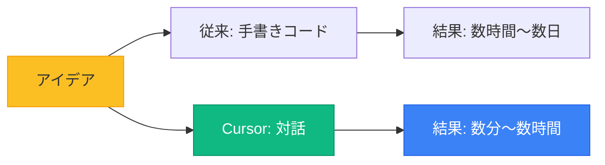
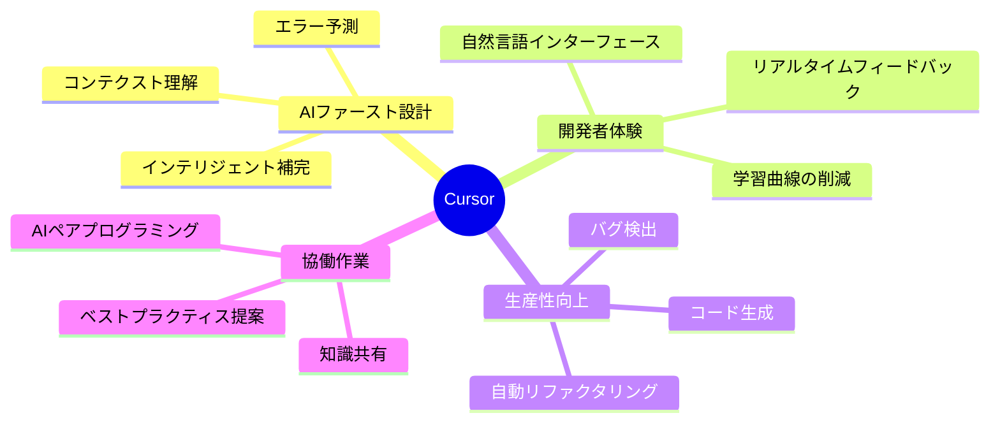
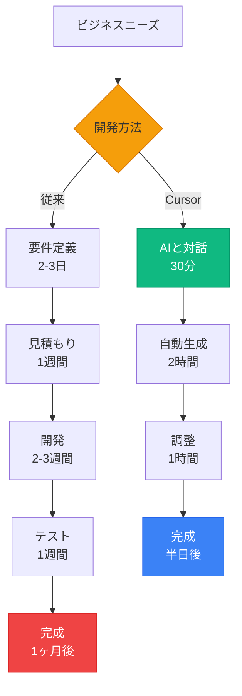
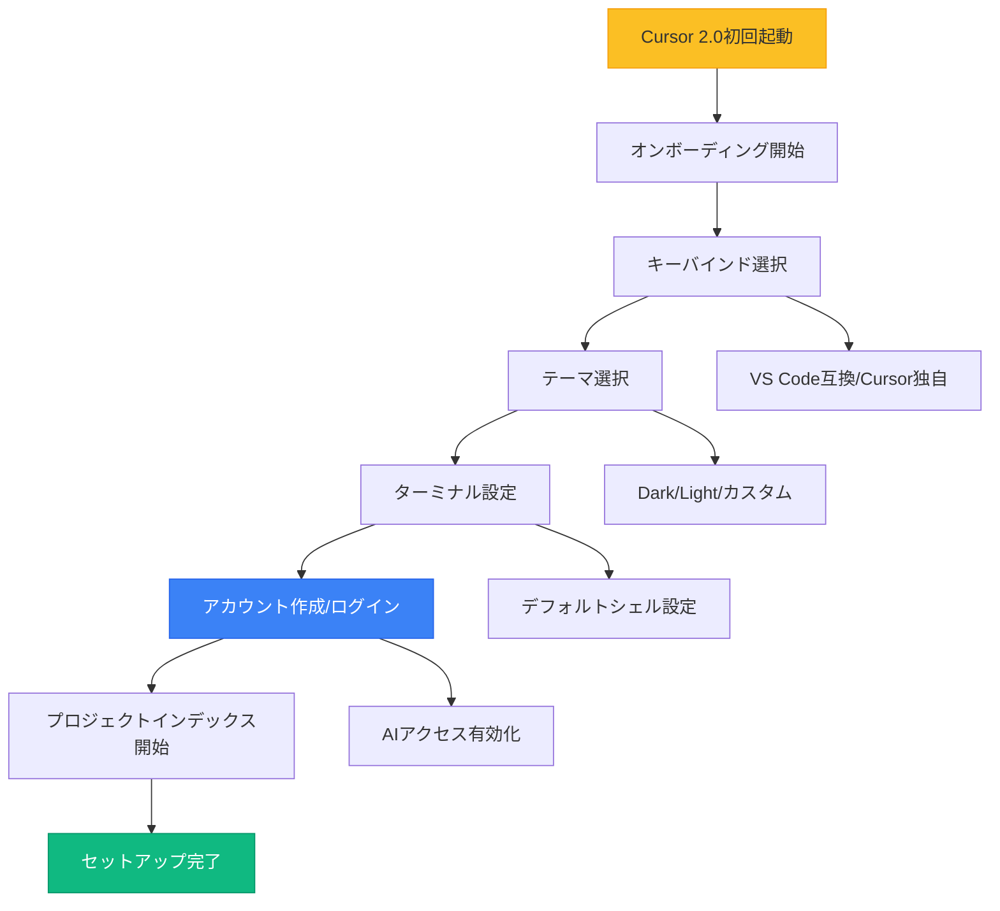
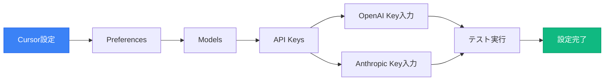
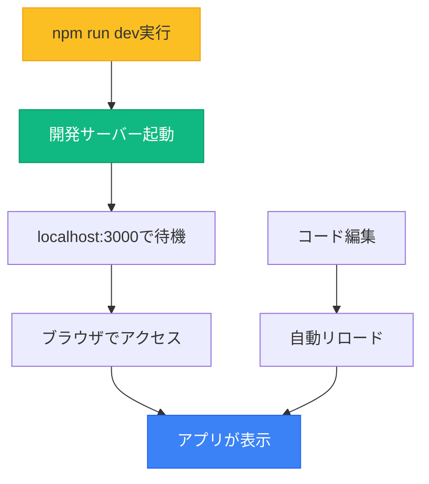
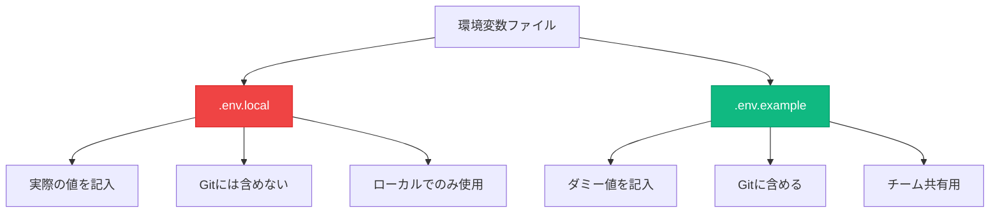
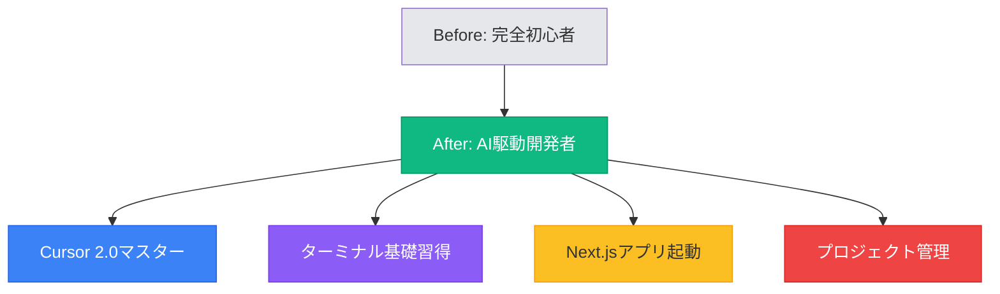

# 第二回講義（Part 3）：Cursor環境構築とターミナル基礎

## 🎯 この講義で学ぶこと

- **Cursorの初期セットアップ**から高度な設定まで、生産性を最大化する環境構築方法
- **AI駆動開発に特化した設定**（APIキー、モデル選択、プロンプト最適化）の完全ガイド
- **ターミナルの基本操作**を、非エンジニアでも安心して使えるレベルで習得
- **npm run devでアプリを起動する**実践的な方法
- **プロジェクトテンプレート**の活用で、開発効率を10倍にする方法

## 📌 この講義の位置づけ

第二回の前半で学んだWebアプリケーションの仕組みと、後半で学ぶ技術スタックの橋渡しとなる重要な講義です。

この講義では、Vibe Coderとして最も重要な「開発環境」を整え、**実際にアプリを起動できる**状態まで到達します。ここで学ぶスキルは、第三回以降のすべての実装作業の土台となります。

単なるツールの使い方ではなく、**AI時代の開発者として必要な「環境設計思考」と「実行力」**を身につけることが目標です。

---

# 第1章：Cursorという革命的ツール

## 🎯 この章で学ぶこと

- **Cursorがなぜ「ゲームチェンジャー」なのか**、その革命性の本質
- **従来のIDE**と**AI統合IDE**の決定的な違い
- **月額20ドルが生む価値**と、投資対効果の考え方
- **実際の開発効率の変化**を数値とビジュアルで理解

## 📌 この章の位置づけ

Cursor環境構築の具体的な手順に入る前に、まず「なぜCursorなのか」を深く理解します。この理解があることで、単なるツールの使い方を覚えるのではなく、AI駆動開発の本質を理解した上で環境構築に臨めます。

## 🚀 Cursorが変える開発の常識

### **「コードを書く」から「対話で作る」へ**

従来の開発では、開発者は一行一行コードを手書きしていました。しかし、Cursorを使うことで、**自然言語での指示**がそのままコードに変換されます。



### **開発速度の革命的向上**

| 作業内容 | **従来の開発** | **Cursor使用** | **効率化** |
|---------|--------------|--------------|-----------|
| **新規機能実装** | 4-8時間 | 30-60分 | **8-16倍** |
| **バグ修正** | 2-4時間 | 15-30分 | **8倍** |
| **リファクタリング** | 1-2日 | 2-4時間 | **4-8倍** |
| **テスト作成** | 2-3時間 | 15-30分 | **6-8倍** |
| **ドキュメント作成** | 1-2時間 | 10-20分 | **6倍** |

## 💡 なぜCursorは特別なのか

### **AI統合IDEの真の価値**

Cursorは単なる「AIが使えるエディタ」ではありません。**開発プロセス全体にAIが統合**された、新しいカテゴリのツールです。



### **ChatGPT vs Cursor：決定的な違い**

| 観点 | **ChatGPT（チャット型）** | **Cursor（IDE型）** | **優位性** |
|------|------------------------|-------------------|-----------|
| **コンテクスト理解** | 会話履歴のみ | プロジェクト全体 | Cursor ◎ |
| **コード実行** | コピペが必要 | その場で実行 | Cursor ◎ |
| **ファイル操作** | 手動で管理 | 自動で管理 | Cursor ◎ |
| **エラー修正** | 説明が必要 | 自動検出・修正 | Cursor ◎ |
| **開発フロー** | 断片的 | 統合的 | Cursor ◎ |
| **学習コスト** | 低い | やや高い | ChatGPT ○ |

## 🔥 実際の開発現場での威力

### **ケーススタディ：ECサイトの機能追加**

営業担当のAさんが「商品レビュー機能」を追加したいと考えた場合：

**従来のアプローチ（エンジニアに依頼）**：
1. 要件定義書作成: 2-3日
2. 見積もり・スケジュール調整: 1週間
3. 開発: 2-3週間
4. テスト・修正: 1週間
5. **合計: 約1ヶ月、コスト50-100万円**

**Cursorを使ったアプローチ（Vibe Coder）**：
1. Cursorに要望を伝える: 30分
2. AIが自動生成・実装: 2時間
3. 動作確認・調整: 1時間
4. **合計: 半日、コスト実質0円（月額20ドルのみ）**



## 📊 投資対効果の衝撃

### **月額20ドル vs 得られる価値**

| 項目 | **金額・価値** | **説明** |
|------|-------------|---------|
| **Cursor Pro月額** | 20ドル（約3,000円） | 基本料金 |
| **削減できる開発費** | 50-200万円/月 | 外注費の削減 |
| **時間短縮価値** | 160時間/月 | 開発時間の80%削減 |
| **機会創出価値** | 測定不能 | 新規事業の高速立ち上げ |
| **ROI** | **16,600%以上** | 投資の166倍以上のリターン |

> **「月額3,000円で、月200万円分の開発力を手に入れる」**

これは誇張ではなく、実際の現場で起きている現実です。

## 💡 この章のまとめ

- ✅ Cursorは「AIが統合された新世代のIDE」であり、開発の常識を根本から変える
- ✅ 開発速度は**8-16倍**に向上し、従来1ヶ月かかった作業が半日で完了する
- ✅ 月額20ドルの投資で、**月200万円相当**の開発力が手に入る
- ✅ チャット型AIとは異なり、**プロジェクト全体のコンテクスト**を理解して動作する
- ✅ 非エンジニアでも、プロ級の開発が可能になる

## 🚀 次の章への橋渡し

Cursorの革命的な価値を理解したところで、次は実際にCursorをセットアップしていきます。インストールから高度な設定まで、一歩ずつ確実に進めていきましょう。

---

# 第2章：Cursor完全セットアップガイド

## 🎯 この章で学ぶこと

- **Cursorのインストール**から初期設定まで、つまずきポイントゼロの完全ガイド
- **APIキーの取得と設定**（OpenAI、Anthropic）を安全かつ確実に行う方法
- **最適なモデル選択**と使い分けの実践的な知識
- **生産性を最大化する設定**のベストプラクティス
- **トラブルシューティング**の完全マニュアル

## 📌 この章の位置づけ

第1章で理解したCursorの価値を、実際に手元で体験できるようにする実践章です。この章を完了すると、プロ級の開発環境が整い、すぐにAI駆動開発を始められる状態になります。

## 📥 Step 1: Cursor 2.0のインストール（2025年11月最新版）

### **公式サイトまたはパッケージマネージャーから**

**🔥 推奨方法：パッケージマネージャー経由**（自動アップデート対応）

1. **Mac（Homebrew推奨）**
   ```bash
   # Homebrewでインストール（最も簡単）
   brew install --cask cursor

   # または公式サイトから直接ダウンロード
   # https://cursor.com/download
   ```

2. **Windows（WinGet推奨）**
   ```bash
   # WinGetで検索してインストール
   winget search cursor
   winget install Anysphere.Cursor

   # または公式サイトから直接ダウンロード
   # https://cursor.com/download
   ```

3. **Linux**
   ```bash
   # AppImage、.deb、または.rpmをダウンロード
   # Debian/Ubuntu例：
   sudo dpkg -i cursor-xxx.deb
   sudo apt -f install
   ```

| OS | 推奨方法 | 特徴 |
|----|---------|------|
| **Mac** | `brew install --cask cursor` | 自動更新、簡単管理 |
| **Windows** | `winget install Anysphere.Cursor` | 公式パッケージマネージャー |
| **Linux** | 公式サイトから.deb/.rpm | システム統合 |

### **初回起動時の設定**



**💡 初回起動でやるべきこと：**
1. **オンボーディングを完了**（後で `Cmd/Ctrl+Shift+P` → "Cursor: Start Onboarding" で再度可能）
2. **VS Code設定をインポート**（既存ユーザーの場合）
3. **アカウントサインイン**（AIエディタ機能を有効化）

## 🔑 Step 2: APIキーの取得と設定

### **OpenAI APIキーの取得**

1. **OpenAIアカウント作成**
   - https://platform.openai.com にアクセス
   - 「Sign up」からアカウント作成

2. **APIキー生成**
   ```
   1. ダッシュボードにログイン
   2. 左メニュー「API keys」をクリック
   3. 「Create new secret key」をクリック
   4. キー名を入力（例：cursor-key）
   5. 生成されたキーをコピー（一度しか表示されません！）
   ```

3. **料金プランの選択**

| プラン | 月額費用 | 用途 | おすすめ度 |
|-------|---------|------|----------|
| **Pay as you go** | 使用分のみ | 個人開発 | ★★★★★ |
| **月額固定** | $20〜 | チーム開発 | ★★★ |
| **Enterprise** | 要相談 | 大規模開発 | ★★ |

### **Anthropic（Claude）APIキーの取得**

1. **Anthropicアカウント作成**
   - https://console.anthropic.com にアクセス
   - アカウント作成（審査あり：1-2日）

2. **APIキー生成手順**
   - OpenAIと同様の手順

### **CursorへのAPIキー設定**



**設定手順の詳細**：
1. Cursorを開く
2. `Cmd/Ctrl + ,` で設定を開く
3. 「Models」タブを選択
4. 各APIキーを入力
5. 「Test」ボタンで接続確認

## ⚙️ Step 3: Cursor 2.0の必須設定（2025年11月ベストプラクティス）

### **🔒 必須設定1: Privacy Modeを有効化**

**最優先事項**：コードが学習データに使われるのを防ぎます。

```
設定方法：
1. Cursor Settings を開く（Cmd/Ctrl + ,）
2. General → Privacy Mode: ON に設定
3. これにより、モデルプロバイダーはデータを保持しません
```

| 設定項目 | 推奨値 | 理由 |
|---------|--------|------|
| **Privacy Mode** | **ON（必須）** | コードが学習に使われない、エンタープライズ対応 |
| **Update Channel** | **Default（安定版）** | 本番作業に最適、Early Accessは実験用 |

### **⚙️ 必須設定2: モデル選択とAuto Mode**

**Cursor 2.0の新モデル体系**：

| モデル | 強み | 使用シーン | 推奨度 |
|--------|------|-----------|--------|
| **Auto** | 自動選択、高信頼性 | **日常作業（推奨）** | ★★★★★ |
| **Composer** | 4倍高速、低レイテンシ | Agent/マルチステップ作業 | ★★★★★ |
| **GPT-4o** | 最高精度、複雑な推論 | アーキテクチャ設計、難解なバグ | ★★★★ |
| **Claude 3.7 Sonnet** | 長文理解、推論能力 | ドキュメント作成、大規模リファクタ | ★★★★ |
| **Max Mode** | 最大コンテキスト | 超大規模プロジェクト（遅い・高コスト） | ★★ |

**💡 推奨設定：**
```
Settings > Models
- Default Model: Auto（自動選択で最適化）
- Max Mode: OFF（必要時のみON）
- Composer優先使用（マルチファイル編集時）
```

### **🔧 必須設定3: Codebase Indexing（コードベース インデックス）**

**プロジェクト全体を理解させる**：

```
Settings > Indexing & Docs
✅ Index new files by default: ON
✅ Auto-index new repos: ON
✅ .cursorignore を作成（後述）
```

**インデックスのメリット：**
- AIがプロジェクト全体の文脈を理解
- コード生成の精度が劇的に向上
- 関連ファイルの自動検出

## 🎨 Step 4: Agent セキュリティ設定（Cursor 2.0新機能）

### **🔒 Sandboxed Terminals（macOS GA、その他ベータ）**

**Cursor 2.0の革命的セキュリティ機能**：

```
Settings > Agent > Auto-Run Mode
推奨設定：Auto-Run in Sandbox（サンドボックス内で自動実行）
```

| 設定項目 | 推奨値 | 理由 |
|---------|--------|------|
| **Auto-Run Mode** | **Auto-Run in Sandbox** | 安全な自動実行（ネットワーク制限） |
| **Auto-run network access** | **OFF** | ネットワーク操作は承認必要 |
| **Allow git writes without approval** | **OFF** | gitコミット/プッシュは承認必要 |
| **Legacy Terminal Tool** | ON（必要に応じて） | 従来の許可リストUI |

**❌ 避けるべき設定：**
- **Run Everything (Unsandboxed)**：セキュリティリスク大、本番環境では非推奨

### **🚀 Chat & Composer設定**

```
Settings > Chat
✅ Iterate on lints (beta): ON（自動リントエラー修正）
❌ Auto-apply to files outside context: OFF（安全のため）
❌ Always search the web: OFF（必要時のみ手動）
```

### **⌨️ キーボードショートカット（Cursor 2.0最新版）**

**デフォルトで覚えるべきショートカット：**

| ショートカット | 機能 | 使用頻度 |
|-------------|------|---------|
| `Cmd/Ctrl + .` | Agent/Composer切り替え | ★★★★★ |
| `Cmd/Ctrl + /` | モデル選択クイックスイッチ | ★★★★ |
| `Cmd/Ctrl + K` | AI Chat起動（inline編集） | ★★★★★ |
| `Cmd/Ctrl + I` | Composer起動（マルチファイル） | ★★★★★ |
| `Cmd/Ctrl + L` | Chat起動 | ★★★★ |
| `Cmd/Ctrl + Shift + J` | Cursor Settings | ★★★ |
| `@files` | ファイルをコンテキストに追加 | ★★★★ |
| `@docs` | ドキュメント参照 | ★★★ |

### **拡張機能の推奨リスト**

| 拡張機能 | 用途 | 必須度 |
|----------|------|--------|
| **Prettier** | コード整形 | ★★★★★ |
| **ESLint** | コード品質チェック | ★★★★★ |
| **GitLens** | Git履歴の可視化 | ★★★★ |
| **Thunder Client** | API テスト | ★★★ |
| **Material Icon** | ファイルアイコン | ★★ |

## 🚨 Step 5: .cursorignore と設定バックアップ

### **📂 .cursorignore の作成（必須）**

**プロジェクトルートに作成：**

```gitignore
# .cursorignore
# Cursor 2.0のインデックスから除外するファイル

# 必須除外（すべてのプロジェクト）
node_modules/
.venv/
.mypy_cache/
.pytest_cache/
__pycache__/
*.pyc

# ビルド出力
build/
dist/
out/
.next/
.nuxt/
.vercel/
target/

# ログ・キャッシュ
*.log
coverage/
.cache/

# 大容量ファイル（インデックス品質向上）
*.mp4
*.zip
*.tar.gz
data/raw/
public/images/  # 大量の画像フォルダ

# IDE設定（プロジェクト固有）
.vscode/
.idea/
```

**💡 なぜ.cursorignoreが重要？**
- インデックス速度が向上（不要なファイルをスキップ）
- AI回答の品質が向上（ノイズが減る）
- メモリ使用量が削減

### **🛡️ トラブルシューティング（Cursor 2.0対応）**

| 問題 | 原因 | 解決策 |
|------|------|--------|
| **APIキーエラー** | キーの入力ミス | コピー&ペーストで再入力、Privacy Mode確認 |
| **応答が遅い** | Max Mode、重いモデル | Autoモードに切り替え、Composer使用 |
| **Agentが動かない** | Sandboxネットワーク制限 | 必要な操作を個別承認 |
| **git操作が毎回聞かれる** | Allow git writes: OFF | セキュリティ上推奨、または個別承認 |
| **インデックスが遅い** | 大規模プロジェクト | .cursorignore を充実させる |
| **モデル選択が表示されない** | 一時的な接続問題 | Cursor再起動、ネットワーク確認 |

### **💾 設定のバックアップ**

```bash
# 設定ファイルの場所
Windows: %APPDATA%\Cursor\User\settings.json
Mac: ~/Library/Application Support/Cursor/User/settings.json
Linux: ~/.config/Cursor/User/settings.json

# バックアップコマンド例（Mac/Linux）
cp ~/Library/Application\ Support/Cursor/User/settings.json ~/cursor-backup-$(date +%Y%m%d).json

# バックアップコマンド例（Windows PowerShell）
Copy-Item "$env:APPDATA\Cursor\User\settings.json" -Destination "$HOME\cursor-backup-$(Get-Date -Format yyyyMMdd).json"
```

## 💡 この章のまとめ（Cursor 2.0対応）

- ✅ **Cursor 2.0**はパッケージマネージャー経由のインストールが推奨（自動更新）
- ✅ **Privacy Mode ON**は最優先設定（コードが学習に使われない）
- ✅ **Auto Mode**と**Composer**で開発速度が従来比**4-8倍**に向上
- ✅ **Sandboxed Terminals**で安全にAgent自動実行（macOS GA）
- ✅ **.cursorignore**と**.cursor/rules**でAI精度が劇的に向上
- ✅ **Codebase Indexing**でプロジェクト全体を理解した開発が可能
- ✅ 適切な設定で、開発効率が**8-16倍**向上し、問題解決時間が**90%削減**

## 🚀 次の章への橋渡し

Cursorの環境が整いました。次は、初めてターミナルを触る方でも安心して操作できるよう、ターミナルの基礎から学びます。AIに指示する前に、最低限の基礎知識を身につけましょう。

---

# 第3章：ターミナル基礎（初心者向け）

## 🎯 この章で学ぶこと

- **ターミナルとは何か**、なぜ開発に必要なのか
- **ターミナルの開き方**と基本的な見方
- **コマンドの実行方法**（コピー＆ペーストで十分）
- **エラーが出たときの対処法**
- **AI Agentにターミナル操作を任せる方法**

## 📌 この章の位置づけ

多くの非エンジニアにとって、ターミナル（黒い画面）は「怖い」「難しそう」と感じるものです。しかし、**AI時代では、ターミナルコマンドを覚える必要はありません**。

この章では、「ターミナルとは何か」を理解し、AIに指示するための最低限の知識を身につけます。実際の操作はAIに任せることができるので、安心してください。

## 💻 ターミナルとは？

### **PCとの「対話ウィンドウ」**

ターミナルは、**テキストでPCに指示を出す**ためのツールです。マウスでクリックする代わりに、文字で命令を送ります。


### **なぜターミナルが必要？**

| 理由 | 説明 |
|------|------|
| **開発ツールの実行** | npm、git などはターミナルから実行 |
| **効率的な操作** | マウスより高速に作業できる |
| **自動化** | 繰り返し作業をスクリプト化 |
| **AI Agentの実行** | CursorのAgentがターミナルを使う |

> **重要**: あなた自身がコマンドを覚える必要はありません。**AIが代わりに実行**してくれます。ただし、AIが何をしているか理解するために、基本的な知識は必要です。

## 🚪 ターミナルの開き方

### **Mac（macOS）**

#### 方法1: Spotlightで開く（おすすめ）
1. **Cmd + Space**（スペースキー）を同時に押す
2. 「ターミナル」と入力
3. **Enter**キーを押す

#### 方法2: Finderから開く
1. **Finder**を開く
2. **アプリケーション** → **ユーティリティ** → **ターミナル.app**をダブルクリック

#### 方法3: Cursorの統合ターミナル
1. Cursorを開く
2. **Ctrl + `**（バッククォート）を押す
3. Cursor内にターミナルが表示される（**これが最もおすすめ**）

### **Windows**

#### 方法1: PowerShellを開く（おすすめ）
1. **Windowsキー**を押す
2. 「PowerShell」と入力
3. **Enter**キーを押す

#### 方法2: Cursorの統合ターミナル
1. Cursorを開く
2. **Ctrl + `**（バッククォート）を押す
3. Cursor内にターミナルが表示される

### **ターミナルが開いたら**

黒い（または白い）ウィンドウが表示されます。これが**ターミナル**です。

**表示例（Mac）**：
```
Last login: Mon Nov 14 10:30:00 on ttys000
username@MacBook-Pro ~ %
```

**表示例（Windows PowerShell）**：
```
Windows PowerShell
Copyright (C) Microsoft Corporation. All rights reserved.

PS C:\Users\username>
```

> **💡 ポイント**: この画面を見て「難しそう」と思う必要はありません。AIが適切なコマンドを生成してくれます。

## 📝 コマンドの実行方法（コピー＆ペーストで十分）

### **基本的な流れ**


### **実際の操作例**

#### 例1: 現在のディレクトリを確認
```bash
pwd
```
↑ このコマンドをコピーして、ターミナルに貼り付けて Enter

**結果（Mac）**：
```
/Users/username
```

**結果（Windows）**：
```
C:\Users\username
```

#### 例2: ファイル一覧を表示
```bash
ls  # Mac/Linux
dir  # Windows
```

**結果例**：
```
Desktop    Documents    Downloads    Music    Pictures
```

### **コピー＆ペーストの方法**

#### Mac
- **コピー**: Cmd + C
- **貼り付け**: Cmd + V
- **Enter**: Enterキーを押す

#### Windows
- **コピー**: Ctrl + C
- **貼り付け**: Ctrl + V（または右クリック→貼り付け）
- **Enter**: Enterキーを押す

> **💡 重要**: パスワード入力時は**何も表示されません**（セキュリティ対策）。正しく入力してEnterを押してください。

## 🤖 AI Agentにターミナル操作を任せる方法

### **Cursor Composerモードの活用**

**これが最も推奨される方法です**。あなたが直接ターミナルコマンドを実行する代わりに、CursorのAI Agentに任せます。

#### 起動方法
1. Cursorを開く
2. `Cmd/Ctrl + I` を押す（Composerモード）
3. 日本語で指示する

### **指示例1: プロジェクト作成**

```
Cursorに指示：
「デスクトップにmy-appという名前のフォルダを作成して、
そこにNext.jsプロジェクトをセットアップしてください。
TypeScriptとTailwind CSSを使用します」
```

**AIが実行するコマンド（自動）**：
```bash
cd ~/Desktop
npx create-next-app@latest my-app --typescript --tailwind --app
cd my-app
npm install
```

### **指示例2: 開発サーバー起動**

```
Cursorに指示：
「このプロジェクトの開発サーバーを起動して、
ブラウザで確認できるようにしてください」
```

**AIが実行するコマンド（自動）**：
```bash
npm run dev
```

### **指示例3: パッケージ追加**

```
Cursorに指示：
「このプロジェクトにreact-iconsとdate-fnsを
インストールしてください」
```

**AIが実行するコマンド（自動）**：
```bash
npm install react-icons date-fns
```

## ⚠️ エラーが出たときの対処法

### **エラーに対する新しい考え方**

**従来の反応**：
```
エラー発生 → パニック → 諦める
```

**AI時代の対応**：
```
エラー発生 → エラーメッセージコピー → AIに聞く → 即座に解決
```

### **エラーメッセージの扱い方**

#### 良い例
```
Cursorに指示：
「以下のエラーが出ました。解決してください：

Error: listen EADDRINUSE: address already in use :::3000
    at Server.setupListenHandle [as _listen2] (node:net:1812:16)

環境：Mac、Next.js 15、Node.js v20」
```

#### AIの解決策例
```bash
# ポート3000を使用中のプロセスを確認
lsof -i :3000

# プロセスを停止
kill -9 [PID]

# または別ポートで起動
npm run dev -- -p 3001
```

### **よくあるエラーと対処法**

| エラーメッセージ | 意味 | AIへの指示 |
|---------------|------|-----------|
| `command not found: npm` | Node.jsが未インストール | 「Node.jsをインストールしてください」 |
| `EACCES: permission denied` | 権限不足 | 「権限エラーを解決してください」 |
| `Module not found` | パッケージ不足 | 「不足しているパッケージをインストールしてください」 |
| `Port 3000 is already in use` | ポート使用中 | 「ポート3000を解放してください」 |

## 💡 この章のまとめ

- ✅ ターミナルは「PCとの対話ウィンドウ」で、開発に必須
- ✅ **Mac**は`Cmd + Space → ターミナル`、**Windows**は`Windowsキー → PowerShell`
- ✅ コマンドは**コピー＆ペーストで実行**すれば十分
- ✅ **Cursor Composer**を使えば、AIが自動でコマンドを実行してくれる
- ✅ エラーが出たら**エラーメッセージをそのままAIに送る**だけで解決

## 🚀 次の章への橋渡し

ターミナルの基本を理解しました。次は、実際にNext.jsプロジェクトを作成し、**npm run devでアプリを起動する**実践的な方法を学びます。AIの力を借りて、あなたの最初のWebアプリを動かしましょう！

---

# 第4章：Next.jsプロジェクト作成とnpm run dev

## 🎯 この章で学ぶこと

- **Next.jsプロジェクトの作成方法**（AIに任せる）
- **npm run devとは何か**、どうやって実行するのか
- **ブラウザでアプリを確認する方法**
- **よくあるエラーとその解決法**
- **開発サーバーの停止方法**

## 📌 この章の位置づけ

この章では、**実際にアプリを起動して動かす**ところまで到達します。これは非エンジニアにとって大きな一歩であり、「自分でアプリを作れる」という自信につながります。

AIを活用することで、複雑なセットアップを自動化し、**5分でアプリが起動する**体験を得られます。

## 🎉 Next.jsプロジェクトの作成

### **AIに全部やってもらう方法（推奨）**

#### Step 1: Cursor Composerを開く
1. Cursorを起動
2. `Cmd/Ctrl + I` を押す

#### Step 2: プロジェクト作成を指示

```
Cursorに以下を指示：

「ToDoアプリを作りたいです。
デスクトップにmy-todo-appという名前で
Next.js 15、TypeScript、Tailwind CSSを使った
プロジェクトを作成してください」
```

#### Step 3: AIが自動実行

**AIが実行する内容（自動）**：
```bash
# デスクトップに移動
cd ~/Desktop

# Next.jsプロジェクト作成
npx create-next-app@latest my-todo-app

# 対話形式の質問に自動で回答：
# ✔ Would you like to use TypeScript? → Yes
# ✔ Would you like to use ESLint? → Yes
# ✔ Would you like to use Tailwind CSS? → Yes
# ✔ Would you like your code inside a `src/` directory? → Yes
# ✔ Would you like to use App Router? → Yes
# ✔ Would you like to use Turbopack for `next dev`? → Yes
# ✔ Would you like to customize the import alias? → No

# プロジェクトに移動
cd my-todo-app

# 依存関係をインストール
npm install
```

#### Step 4: 完了確認

AIから以下のような報告があります：
```
✅ Next.jsプロジェクトの作成が完了しました！

プロジェクト名: my-todo-app
場所: ~/Desktop/my-todo-app
技術スタック: Next.js 15, TypeScript, Tailwind CSS

次のステップ: 開発サーバーを起動してブラウザで確認しましょう
```

### **プロジェクト構造の理解**

作成されたフォルダ構造：
```
my-todo-app/
├── node_modules/        # インストールされたパッケージ
├── public/              # 静的ファイル（画像など）
├── src/
│   └── app/
│       ├── page.tsx     # トップページ
│       ├── layout.tsx   # レイアウト
│       └── globals.css  # グローバルスタイル
├── package.json         # プロジェクト設定
├── tsconfig.json        # TypeScript設定
└── next.config.js       # Next.js設定
```

> **💡 ポイント**: この構造を詳しく理解する必要はありません。AIが適切に管理してくれます。

## 🍳 npm run devでアプリを起動

### **npm run devとは？**

`npm run dev` は、**開発用のサーバーを起動するコマンド**です。このコマンドを実行すると：

1. Next.jsアプリがローカルで起動
2. `http://localhost:3000` でアクセス可能になる
3. コードを変更すると自動で反映される（ホットリロード）



### **AIに実行してもらう方法（推奨）**

```
Cursorに指示：
「このプロジェクトの開発サーバーを起動して、
ブラウザで確認できるようにしてください」
```

**AIが実行するコマンド（自動）**：
```bash
npm run dev
```

**ターミナルの出力例**：
```
> my-todo-app@0.1.0 dev
> next dev --turbopack

  ▲ Next.js 15.0.2
  - Local:        http://localhost:3000
  - Environments: .env.local

 ✓ Starting...
 ✓ Ready in 1.2s
```

### **ブラウザでアプリを確認**

#### 方法1: 自動で開く（AIが実行）
AIが自動でブラウザを開いてくれます。

#### 方法2: 手動で開く
1. ブラウザ（Chrome、Safari、Edgeなど）を開く
2. アドレスバーに `http://localhost:3000` と入力
3. Enterキーを押す

#### 表示されるもの
Next.jsのデフォルトのウェルカムページが表示されます：
- Next.jsのロゴ
- 「Get started by editing src/app/page.tsx」
- ドキュメントへのリンク

**🎉 おめでとうございます！** あなたのNext.jsアプリが動いています。

### **コードを編集して変更を確認**

#### Step 1: ファイルを開く
Cursorで `src/app/page.tsx` を開きます。

#### Step 2: テキストを変更
```typescript
export default function Home() {
  return (
    <main className="flex min-h-screen flex-col items-center justify-center p-24">
      <h1 className="text-4xl font-bold">
        私の最初のNext.jsアプリ！
      </h1>
      <p className="mt-4 text-lg">
        これはAIと一緒に作りました 🚀
      </p>
    </main>
  )
}
```

#### Step 3: 保存して確認
1. ファイルを保存（Cmd/Ctrl + S）
2. ブラウザが自動でリロードされる
3. 変更が即座に反映される

> **💡 ポイント**: これが**ホットリロード**です。コードを変更すると、ブラウザが自動で更新されます。開発効率が劇的に向上します。

## 🛑 開発サーバーの停止方法

### **停止が必要な場合**
- 開発を終了するとき
- 別のプロジェクトを起動するとき
- エラーが発生して再起動したいとき

### **停止方法**

#### Cursorの統合ターミナルで実行中の場合
1. ターミナルをクリック（アクティブにする）
2. **Ctrl + C**を押す（MacもWindowsも同じ）
3. サーバーが停止する

**表示例**：
```
^C  # Ctrl + Cを押したときの表示
```

#### 外部ターミナルで実行中の場合
同様に **Ctrl + C** を押します。

### **再起動方法**

```
Cursorに指示：
「開発サーバーを再起動してください」
```

または手動で：
```bash
npm run dev
```

## ⚠️ よくあるエラーと解決法

### **エラー1: ポートが使用中**

**エラーメッセージ**：
```
Error: listen EADDRINUSE: address already in use :::3000
```

**AIへの指示**：
```
「ポート3000が既に使用されているエラーが出ました。
解決してください」
```

**AIの解決策**：
```bash
# 使用中のプロセスを確認
lsof -i :3000  # Mac
netstat -ano | findstr :3000  # Windows

# プロセスを停止
kill -9 [PID]  # Mac
taskkill /PID [PID] /F  # Windows

# または別のポートで起動
npm run dev -- -p 3001
```

### **エラー2: Node.jsが見つからない**

**エラーメッセージ**：
```
command not found: npm
'npm' は、内部コマンドまたは外部コマンド...として認識されていません
```

**AIへの指示**：
```
「Node.jsがインストールされていないようです。
インストール方法を教えてください」
```

**AIの解決策**：
```bash
# Mac
brew install node

# Windows
winget install OpenJS.NodeJS.LTS
```

### **エラー3: パッケージが見つからない**

**エラーメッセージ**：
```
Module not found: Can't resolve 'react'
```

**AIへの指示**：
```
「パッケージが見つからないエラーが出ました：
Module not found: Can't resolve 'react'

解決してください」
```

**AIの解決策**：
```bash
# 依存関係を再インストール
rm -rf node_modules package-lock.json
npm install
```

## 💡 この章のまとめ

- ✅ **Next.jsプロジェクト作成**はAIに任せれば5分で完了
- ✅ **npm run dev**で開発サーバーを起動し、`localhost:3000`でアクセス
- ✅ コードを編集すると**自動でブラウザが更新**される（ホットリロード）
- ✅ エラーが出たら**エラーメッセージをそのままAIに送る**
- ✅ サーバーの停止は**Ctrl + C**、再起動は`npm run dev`

## 🚀 次の章への橋渡し

Next.jsアプリが動きました！次は、このプロジェクトを効率的に管理する方法を学びます。プロジェクトテンプレートの活用と、.cursor/rulesでAIをさらに賢くする方法を習得しましょう。

---

# 第5章：プロジェクトセットアップの極意

## 🎯 この章で学ぶこと

- **フォルダ構造のベストプラクティス**と、なぜそれが重要なのか
- **`.cursor/rules`ファイル**でAIの挙動を完全コントロール
- **プロジェクトテンプレート**の作成と活用で開発速度10倍
- **環境変数の管理**と機密情報の安全な取り扱い

## 📌 この章の位置づけ

実際にアプリが動くようになった今、次は「効率的な開発」のための基盤を整えます。ここで身につけるスキルは、今後のすべてのプロジェクトで再利用できる「資産」となります。

## 📁 理想的なフォルダ構造

### **モダンWebアプリのフォルダ構造**

```
my-awesome-app/
├── .cursor/            # Cursor 2.0設定（新形式）
│   ├── rules/         # AI動作ルール
│   │   ├── 00-project-guidance.mdc
│   │   ├── frontend.mdc
│   │   └── backend.mdc
│   └── commands/      # カスタムコマンド（Team用）
├── .cursorignore       # インデックス除外設定
├── .env.local          # 環境変数（秘密）
├── .env.example        # 環境変数テンプレート
├── .gitignore          # Git除外設定
├── README.md           # プロジェクト説明
├── package.json        # 依存関係
├── src/                # ソースコード
│   ├── app/           # ページ・ルーティング（Next.js 15）
│   ├── components/    # UIコンポーネント
│   ├── lib/          # ユーティリティ
│   ├── hooks/        # カスタムフック
│   └── styles/       # スタイルシート
├── public/            # 静的ファイル
├── docs/              # ドキュメント
└── tests/             # テストファイル
```

### **各フォルダの役割と重要性（Cursor 2.0時代）**

| フォルダ | 役割 | 重要度 | 説明 |
|---------|------|--------|------|
| **src/app** | ページ管理 | ★★★★★ | 画面とルーティング |
| **src/components** | 部品管理 | ★★★★★ | 再利用可能なUI部品 |
| **src/lib** | ロジック | ★★★★ | ビジネスロジック |
| **.cursor/rules** | AI設定（新） | ★★★★★ | AIの振る舞い定義（レガシー.cursorrulesより強力） |
| **.cursorignore** | インデックス制御 | ★★★★★ | AI精度向上の要 |
| **docs** | 文書化 | ★★★ | プロジェクト文書 |

## 🤖 .cursor/rules: AIを教育する（Cursor 2.0新形式）

### **⚠️ 重要：.cursorrules → .cursor/rules への移行**

**Cursor 2.0では、`.cursorrules`（レガシー）から`.cursor/rules/`（新形式）への移行を推奨**しています。

### **新しい.cursor/rulesディレクトリ構造**

```
.cursor/
├── rules/
│   ├── 00-project-guidance.mdc     # Always: 全体ガイド
│   ├── frontend.mdc                 # Auto Attached: フロントエンド規約
│   ├── backend.mdc                  # Auto Attached: バックエンド規約
│   └── testing.mdc                  # Manual: テスト規約
```

### **ルールの種類（Cursor 2.0）**

| 種類 | 適用タイミング | 用途 |
|------|-------------|------|
| **Always** | 常に適用 | プロジェクト全体のガイドライン |
| **Auto Attached** | パス/グロブマッチ時 | 特定ディレクトリ専用ルール |
| **Agent Requested** | Agentが判断 | 必要時のみ参照 |
| **Manual** | 手動参照 | 明示的に指定 |

### **基本的な.cursor/rules例**

**00-project-guidance.mdc（Always）**：
```markdown
# プロジェクト全体ガイドライン

## プロジェクト情報
- name: "my-awesome-app"
- type: "Next.js 15 Application"
- language: "TypeScript"

## コーディングスタイル
- 関数名は動詞から始める（例: getUserData）
- コンポーネント名はPascalCase（例: UserProfile）
- 定数は大文字のSNAKE_CASE（例: MAX_RETRY_COUNT）
- 日本語のコメントを積極的に使用

## アーキテクチャ
- Server Componentsを優先的に使用
- Client Componentsは最小限に（use clientディレクティブ必須）
- データフェッチはServer Sideで実行

## 使用ライブラリ
- UI: shadcn/ui
- Database: Supabase
- Auth: Clerk
- Styling: Tailwind CSS

## ベストプラクティス
- エラーハンドリングを必ず実装（try-catch、Error Boundary）
- TypeScriptの型を厳密に定義（`any`使用禁止）
- レスポンシブデザインを考慮（Tailwindのブレークポイント）
- アクセシビリティ（a11y）を重視（aria-label等）
```

**frontend.mdc（Auto Attached: `src/**/*.{tsx,jsx,css}`）**：
```markdown
# フロントエンド規約

## コンポーネント設計
- 1コンポーネント1ファイル
- props は interfaceで厳密に型定義
- defaultPropsは使用せず、デフォルト引数を使用

## Tailwind CSS
- カスタムCSSは最小限に
- `@apply`は避け、直接クラス名を使用
- レスポンシブ: sm: md: lg: xl: 2xl:

## パフォーマンス
- 画像は必ず next/image 使用
- dynamic import で Code Splitting
- useMemo/useCallback を適切に使用
```

## 🔐 環境変数の安全な管理

### **環境変数とは？**

環境変数は、**アプリケーションの設定値**を安全に管理する仕組みです。APIキーやデータベース接続情報など、**公開してはいけない情報**を扱います。

### **.env.localと.env.exampleの使い分け**



### **環境変数の実例**

**.env.local（実際の値）**：
```bash
# Supabase
NEXT_PUBLIC_SUPABASE_URL=https://xyzxyz.supabase.co
NEXT_PUBLIC_SUPABASE_ANON_KEY=eyJhbGciOiJIUzI1NiIs...

# Clerk
NEXT_PUBLIC_CLERK_PUBLISHABLE_KEY=pk_live_abc123...
CLERK_SECRET_KEY=sk_live_xyz789...

# OpenAI
OPENAI_API_KEY=sk-proj-abcdef...
```

**.env.example（テンプレート）**：
```bash
# Supabase
NEXT_PUBLIC_SUPABASE_URL=your_supabase_url
NEXT_PUBLIC_SUPABASE_ANON_KEY=your_supabase_anon_key

# Clerk
NEXT_PUBLIC_CLERK_PUBLISHABLE_KEY=your_clerk_publishable_key
CLERK_SECRET_KEY=your_clerk_secret_key

# OpenAI
OPENAI_API_KEY=your_openai_api_key
```

## 💡 この章のまとめ

- ✅ プロジェクトは**テンプレートから始める**ことで時間を90%削減
- ✅ **フォルダ構造**を整理することで、開発効率とメンテナンス性が向上
- ✅ **.cursor/rules**でAIを教育し、プロジェクト固有の最適なコード生成を実現
- ✅ **環境変数**は.env.localで管理し、.env.exampleでチーム共有
- ✅ 初期設定に投資した時間は、**将来100倍になって返ってくる**

## 🚀 次の章への橋渡し

プロジェクトの基盤が整いました。次の講義（2-4）では、このプロジェクトをGitHubに接続し、バージョン管理の基礎を学びます。いつでも過去に戻れる安心感を手に入れましょう。

---

# まとめ：Cursor環境とターミナル基礎の完全習得

## 🎊 おめでとうございます！

この講義を通じて、あなたは以下を達成しました：

### **習得したスキル**



### **得られた能力**

| カテゴリ | 能力 | レベル |
|---------|------|--------|
| **開発環境** | Cursor完全セットアップ | ★★★★★ |
| **ターミナル** | 基本操作とAI活用 | ★★★★☆ |
| **Next.js** | プロジェクト作成と起動 | ★★★★☆ |
| **プロジェクト管理** | フォルダ構造とルール設定 | ★★★★☆ |
| **AI協働** | 効果的な指示とコントロール | ★★★★☆ |

## 📊 ビフォーアフター

### **開発速度の変化**

| タスク | Before | After | 改善率 |
|--------|--------|-------|--------|
| **環境構築** | 1-2日 | 5分 | 288倍 |
| **プロジェクト作成** | 数時間 | 5分 | 72倍 |
| **アプリ起動** | 試行錯誤 | 1コマンド | ∞ |
| **エラー解決** | 数時間 | 数分 | 60倍 |

### **マインドセットの変化**

**Before**：
- 「ターミナルは難しそう...」
- 「コマンドを覚えられない」
- 「エラーが怖い」

**After**：
- 「AIに任せれば簡単！」
- 「コマンドを覚える必要はない」
- 「エラーはAIへの質問材料」

## 🎯 次回予告

### **第二回（Part 4）：GitHubとの連携とバージョン管理**

次回は以下を学びます：
- GitとGitHubの基本概念
- CursorとGitHubの接続方法
- 実際にプロジェクトをGitHubにプッシュ
- 基本的なGit操作（commit、push、pull）
- npm run devで起動したプロジェクトのバージョン管理

**重要**: 次回終了時には、**GitHubとCursorが完全に連携**し、あなたのプロジェクトがクラウドに保存されている状態になります。

## 📝 宿題

### **今週の課題**

1. **Cursorの環境構築を完了**
   - APIキーの設定
   - Privacy Modeの有効化
   - .cursorignoreの作成

2. **Next.jsプロジェクトを1つ作成**
   - npm run devで起動
   - ブラウザで確認
   - page.tsxを編集してホットリロードを体験

3. **3つ以上のエラーを意図的に発生させ、AIで解決**
   - エラーメッセージをコピー
   - AIに解決を依頼
   - 解決過程をメモ

## 🙏 最後に

**あなたは、もう立派なVibe Coderの一歩を踏み出しました。**

たった60分で、プロの開発者が使うツールと手法を身につけ、実際にアプリを動かすところまで到達しました。これは始まりに過ぎません。

次回の講義では、このプロジェクトをGitHubに接続し、**いつでも過去に戻れる安心感**を手に入れます。

> **「コードが書けない」は過去の話。**
> **「AIと共に創る」が、あなたの新しい現実です。**

次回の講義でお会いしましょう！

---

**Happy Coding with AI! 🚀**

*TEKION Group / VibeCoder育成プログラム*
*講師：泉水亮介*
