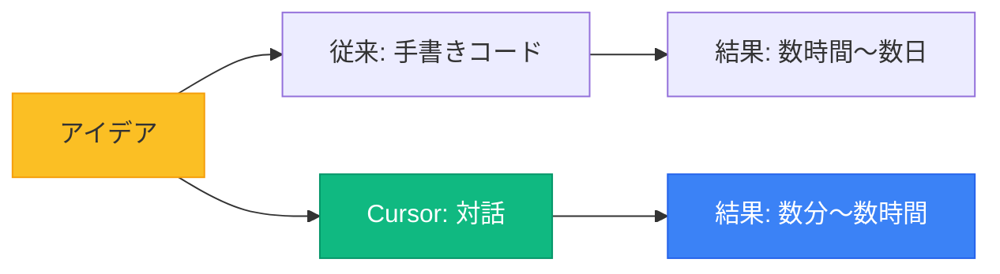
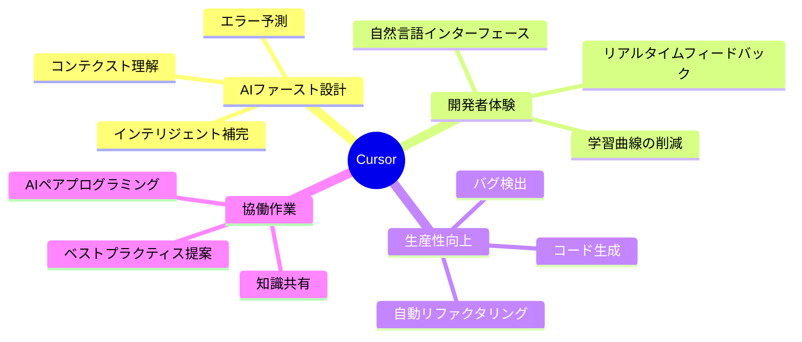
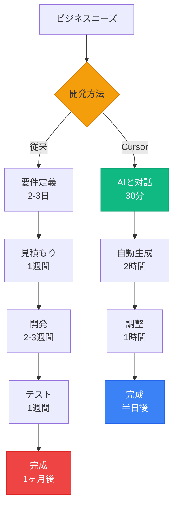
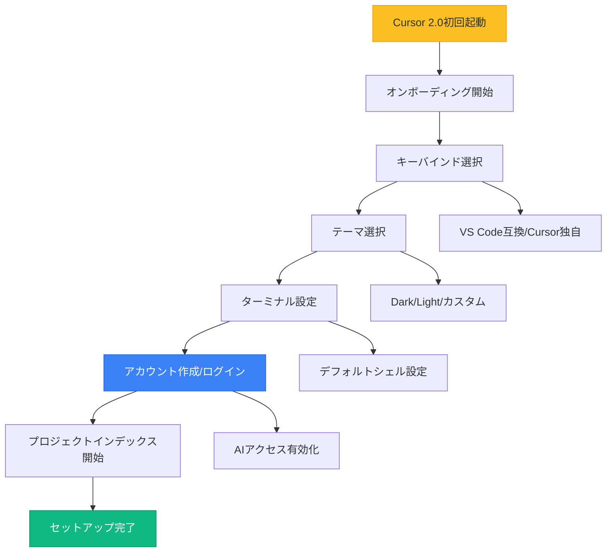
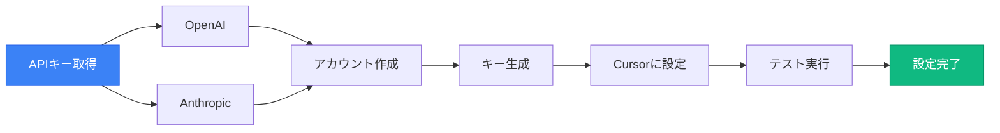
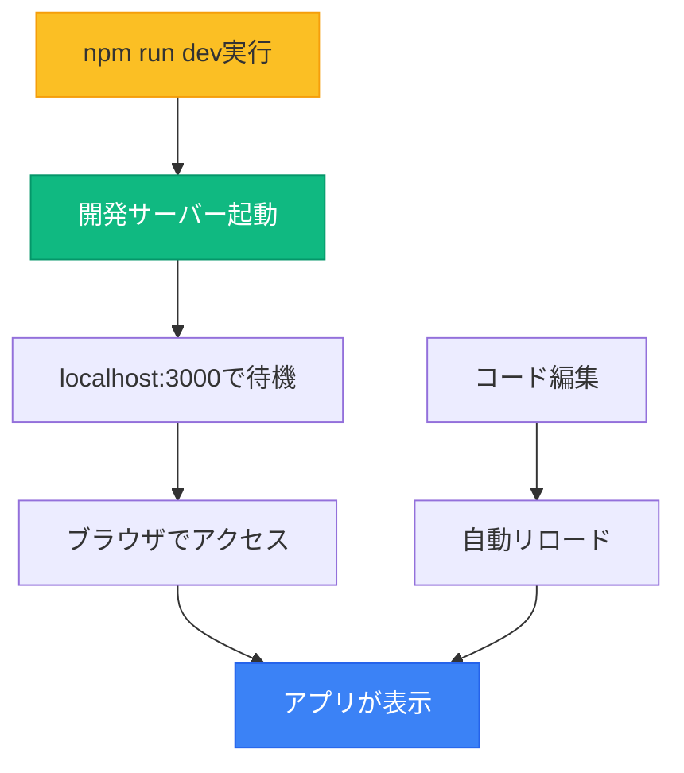
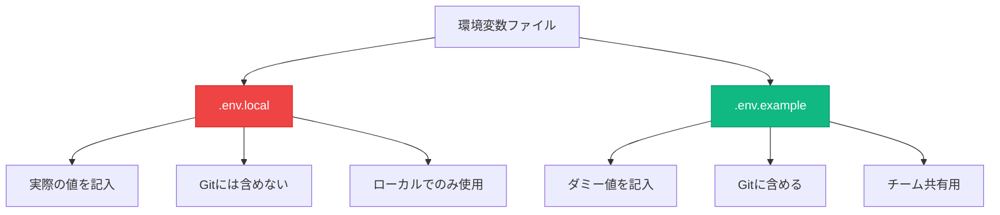
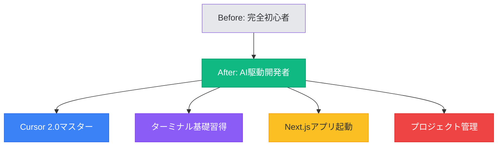

# 第二回講義（Part 3）：Cursor環境構築とターミナル基礎

## 🎯 この講義で学ぶこと

- **Cursorの初期セットアップ**から高度な設定まで、生産性を最大化する環境構築方法
- **AI駆動開発に特化した設定**（APIキー、モデル選択、プロンプト最適化）の完全ガイド
- **ターミナルの基本操作**を、非エンジニアでも安心して使えるレベルで習得
- **npm run devでアプリを起動する**実践的な方法
- **プロジェクトテンプレート**の活用で、開発効率を10倍にする方法

## 📌 この講義の位置づけ

第二回の前半で学んだWebアプリケーションの仕組みと、後半で学ぶ技術スタックの橋渡しとなる重要な講義です。

この講義では、Vibe Coderとして最も重要な「開発環境」を整え、**実際にアプリを起動できる**状態まで到達します。ここで学ぶスキルは、第三回以降のすべての実装作業の土台となります。

単なるツールの使い方ではなく、**AI時代の開発者として必要な「環境設計思考」と「実行力」**を身につけることが目標です。

---

# 第1章：Cursorという革命的ツール

## 🎯 この章で学ぶこと

- **Cursorがなぜ「ゲームチェンジャー」なのか**、その革命性の本質
- **従来のIDE**と**AI統合IDE**の決定的な違い
- **月額20ドルが生む価値**と、投資対効果の考え方
- **実際の開発効率の変化**を数値とビジュアルで理解

## 📌 この章の位置づけ

Cursor環境構築の具体的な手順に入る前に、まず「なぜCursorなのか」を深く理解します。この理解があることで、単なるツールの使い方を覚えるのではなく、AI駆動開発の本質を理解した上で環境構築に臨めます。

## 🚀 Cursorが変える開発の常識

### **「コードを書く」から「対話で作る」へ**

従来の開発では、開発者は一行一行コードを手書きしていました。しかし、Cursorを使うことで、**自然言語での指示**がそのままコードに変換されます。



### **開発速度の革命的向上**

| 作業内容 | **従来の開発** | **Cursor使用** | **効率化** |
|---------|--------------|--------------|-----------|
| **新規機能実装** | 4-8時間 | 30-60分 | **8-16倍** |
| **バグ修正** | 2-4時間 | 15-30分 | **8倍** |
| **リファクタリング** | 1-2日 | 2-4時間 | **4-8倍** |
| **テスト作成** | 2-3時間 | 15-30分 | **6-8倍** |
| **ドキュメント作成** | 1-2時間 | 10-20分 | **6倍** |

## 💡 なぜCursorは特別なのか

### **AI統合IDEの真の価値**

Cursorは単なる「AIが使えるエディタ」ではありません。**開発プロセス全体にAIが統合**された、新しいカテゴリのツールです。



### **ChatGPT vs Cursor：決定的な違い**

| 観点 | **ChatGPT（チャット型）** | **Cursor（IDE型）** | **優位性** |
|------|------------------------|-------------------|-----------|
| **コンテクスト理解** | 会話履歴のみ | プロジェクト全体 | Cursor ◎ |
| **コード実行** | コピペが必要 | その場で実行 | Cursor ◎ |
| **ファイル操作** | 手動で管理 | 自動で管理 | Cursor ◎ |
| **エラー修正** | 説明が必要 | 自動検出・修正 | Cursor ◎ |
| **開発フロー** | 断片的 | 統合的 | Cursor ◎ |
| **学習コスト** | 低い | やや高い | ChatGPT ○ |

## 🔥 実際の開発現場での威力

### **ケーススタディ：ECサイトの機能追加**

営業担当のAさんが「商品レビュー機能」を追加したいと考えた場合：

**従来のアプローチ（エンジニアに依頼）**：
1. 要件定義書作成: 2-3日
2. 見積もり・スケジュール調整: 1週間
3. 開発: 2-3週間
4. テスト・修正: 1週間
5. **合計: 約1ヶ月、コスト50-100万円**

**Cursorを使ったアプローチ（Vibe Coder）**：
1. Cursorに要望を伝える: 30分
2. AIが自動生成・実装: 2時間
3. 動作確認・調整: 1時間
4. **合計: 半日、コスト実質0円（月額20ドルのみ）**



## 📊 投資対効果の衝撃

### **月額20ドル vs 得られる価値**

| 項目 | **金額・価値** | **説明** |
|------|-------------|---------|
| **Cursor Pro月額** | 20ドル（約3,000円） | 基本料金 |
| **削減できる開発費** | 50-200万円/月 | 外注費の削減 |
| **時間短縮価値** | 160時間/月 | 開発時間の80%削減 |
| **機会創出価値** | 測定不能 | 新規事業の高速立ち上げ |
| **ROI** | **16,600%以上** | 投資の166倍以上のリターン |

> **「月額3,000円で、月200万円分の開発力を手に入れる」**

これは誇張ではなく、実際の現場で起きている現実です。

## 💡 この章のまとめ

- ✅ Cursorは「AIが統合された新世代のIDE」であり、開発の常識を根本から変える
- ✅ 開発速度は**8-16倍**に向上し、従来1ヶ月かかった作業が半日で完了する
- ✅ 月額20ドルの投資で、**月200万円相当**の開発力が手に入る
- ✅ チャット型AIとは異なり、**プロジェクト全体のコンテクスト**を理解して動作する
- ✅ 非エンジニアでも、プロ級の開発が可能になる

## 🚀 次の章への橋渡し

Cursorの革命的な価値を理解したところで、次は実際にCursorをセットアップしていきます。インストールから高度な設定まで、一歩ずつ確実に進めていきましょう。

---

# 第2章：Cursor完全セットアップガイド

## 🎯 この章で学ぶこと

- **Cursorのインストール**から初期設定まで、つまずきポイントゼロの完全ガイド
- **APIキーの取得と設定**（OpenAI、Anthropic）を安全かつ確実に行う方法
- **最適なモデル選択**と使い分けの実践的な知識
- **生産性を最大化する設定**のベストプラクティス
- **トラブルシューティング**の完全マニュアル

## 📌 この章の位置づけ

第1章で理解したCursorの価値を、実際に手元で体験できるようにする実践章です。この章を完了すると、プロ級の開発環境が整い、すぐにAI駆動開発を始められる状態になります。

## 📥 Step 1: Cursor 2.0のインストール（2025年11月最新版）

### **Cursorへの指示でインストールを実行**

**🎯 推奨アプローチ：AIに任せる**

Cursorをインストールした後、Cursorに以下のように指示することで、必要なツールを自動インストールできます。

```
Cursorに指示：

「私の環境は[Mac/Windows]です。
開発に必要なツール（Node.js、Git、パッケージマネージャー）を
すべてインストールしてください」
```

AIが自動的に：
- あなたのOSを検出
- 最適なインストール方法を選択（Homebrew、WinGetなど）
- 必要なコマンドを実行
- インストール完了を確認

してくれます。

### **初回起動時の設定**



**💡 初回起動でやるべきこと：**
1. **オンボーディングを完了**（後で再度可能）
2. **VS Code設定をインポート**（既存ユーザーの場合）
3. **アカウントサインイン**（AIエディタ機能を有効化）

## 🔑 Step 2: APIキーの取得と設定

### **APIキー取得の基本的な流れ**



### **Cursorへの指示例**

```
Cursorに質問：

「OpenAI APIキーの取得手順を教えてください。
初めてなので、詳しく説明してください」
```

AIが以下を説明してくれます：
- アカウント作成手順
- APIキー生成方法
- 料金プランの選択
- セキュリティ上の注意点

### **料金プランの選択**

| プラン | 月額費用 | 用途 | おすすめ度 |
|-------|---------|------|----------|
| **Pay as you go** | 使用分のみ | 個人開発 | ★★★★★ |
| **月額固定** | $20〜 | チーム開発 | ★★★ |
| **Enterprise** | 要相談 | 大規模開発 | ★★ |

## ⚙️ Step 3: Cursor 2.0の必須設定（2025年11月ベストプラクティス）

### **🔒 必須設定1: Privacy Modeを有効化**

**最優先事項**：コードが学習データに使われるのを防ぎます。

```
設定方法：
1. Cursor Settings を開く（Cmd/Ctrl + ,）
2. General → Privacy Mode: ON に設定
3. これにより、モデルプロバイダーはデータを保持しません
```

| 設定項目 | 推奨値 | 理由 |
|---------|--------|------|
| **Privacy Mode** | **ON（必須）** | コードが学習に使われない、エンタープライズ対応 |
| **Update Channel** | **Default（安定版）** | 本番作業に最適、Early Accessは実験用 |

### **⚙️ 必須設定2: モデル選択とAuto Mode**

**Cursor 2.0の新モデル体系**：

| モデル | 強み | 使用シーン | 推奨度 |
|--------|------|-----------|--------|
| **Auto** | 自動選択、高信頼性 | **日常作業（推奨）** | ★★★★★ |
| **Composer** | 4倍高速、低レイテンシ | Agent/マルチステップ作業 | ★★★★★ |
| **GPT-4o** | 最高精度、複雑な推論 | アーキテクチャ設計、難解なバグ | ★★★★ |
| **Claude 3.7 Sonnet** | 長文理解、推論能力 | ドキュメント作成、大規模リファクタ | ★★★★ |
| **Max Mode** | 最大コンテキスト | 超大規模プロジェクト（遅い・高コスト） | ★★ |

**💡 推奨設定：**
```
Settings > Models
- Default Model: Auto（自動選択で最適化）
- Max Mode: OFF（必要時のみON）
- Composer優先使用（マルチファイル編集時）
```

### **🔧 必須設定3: Codebase Indexing（コードベース インデックス）**

**プロジェクト全体を理解させる**：

```
Settings > Indexing & Docs
✅ Index new files by default: ON
✅ Auto-index new repos: ON
✅ .cursorignore を作成（後述）
```

**インデックスのメリット：**
- AIがプロジェクト全体の文脈を理解
- コード生成の精度が劇的に向上
- 関連ファイルの自動検出

## 🎨 Step 4: Agent セキュリティ設定（Cursor 2.0新機能）

### **🔒 Sandboxed Terminals（macOS GA、その他ベータ）**

**Cursor 2.0の革命的セキュリティ機能**：

```
Settings > Agent > Auto-Run Mode
推奨設定：Auto-Run in Sandbox（サンドボックス内で自動実行）
```

| 設定項目 | 推奨値 | 理由 |
|---------|--------|------|
| **Auto-Run Mode** | **Auto-Run in Sandbox** | 安全な自動実行（ネットワーク制限） |
| **Auto-run network access** | **OFF** | ネットワーク操作は承認必要 |
| **Allow git writes without approval** | **OFF** | gitコミット/プッシュは承認必要 |
| **Legacy Terminal Tool** | ON（必要に応じて） | 従来の許可リストUI |

**❌ 避けるべき設定：**
- **Run Everything (Unsandboxed)**：セキュリティリスク大、本番環境では非推奨

### **🚀 Chat & Composer設定**

```
Settings > Chat
✅ Iterate on lints (beta): ON（自動リントエラー修正）
❌ Auto-apply to files outside context: OFF（安全のため）
❌ Always search the web: OFF（必要時のみ手動）
```

### **⌨️ キーボードショートカット（Cursor 2.0最新版）**

**デフォルトで覚えるべきショートカット：**

| ショートカット | 機能 | 使用頻度 |
|-------------|------|---------|
| `Cmd/Ctrl + .` | Agent/Composer切り替え | ★★★★★ |
| `Cmd/Ctrl + /` | モデル選択クイックスイッチ | ★★★★ |
| `Cmd/Ctrl + K` | AI Chat起動（inline編集） | ★★★★★ |
| `Cmd/Ctrl + I` | Composer起動（マルチファイル） | ★★★★★ |
| `Cmd/Ctrl + L` | Chat起動 | ★★★★ |
| `Cmd/Ctrl + Shift + J` | Cursor Settings | ★★★ |
| `@files` | ファイルをコンテキストに追加 | ★★★★ |
| `@docs` | ドキュメント参照 | ★★★ |

### **拡張機能の推奨リスト**

| 拡張機能 | 用途 | 必須度 |
|----------|------|--------|
| **Prettier** | コード整形 | ★★★★★ |
| **ESLint** | コード品質チェック | ★★★★★ |
| **GitLens** | Git履歴の可視化 | ★★★★ |
| **Thunder Client** | API テスト | ★★★ |
| **Material Icon** | ファイルアイコン | ★★ |

## 🚨 Step 5: .cursorignore と設定バックアップ

### **📂 .cursorignore の作成（必須）**

**AIに生成してもらう方法：**

```
Cursorに指示：

「このプロジェクト用の.cursorignoreファイルを作成してください。
以下を除外したいです：
- node_modules
- ビルド出力
- ログファイル
- 大容量ファイル
- IDE設定ファイル」
```

AIが自動的に最適な`.cursorignore`を生成してくれます。

**💡 なぜ.cursorignoreが重要？**
- インデックス速度が向上（不要なファイルをスキップ）
- AI回答の品質が向上（ノイズが減る）
- メモリ使用量が削減

### **🛡️ トラブルシューティング（Cursor 2.0対応）**

| 問題 | 原因 | AIへの指示 |
|------|------|----------|
| **APIキーエラー** | キーの入力ミス | 「APIキーエラーを解決してください」 |
| **応答が遅い** | Max Mode、重いモデル | 「Cursor応答が遅いです。最適化してください」 |
| **Agentが動かない** | Sandboxネットワーク制限 | 「Agent動作エラーを確認してください」 |
| **git操作が毎回聞かれる** | Allow git writes: OFF | 「git操作の承認設定を確認してください」 |
| **インデックスが遅い** | 大規模プロジェクト | 「.cursorignoreを最適化してください」 |
| **モデル選択が表示されない** | 一時的な接続問題 | 「Cursor接続状態を確認してください」 |

### **💾 設定のバックアップ（Cursorに任せる）**

```
Cursorに指示：

「Cursor設定ファイルをバックアップしてください。
日付付きのファイル名で保存してください」
```

AIが自動的に：
- 設定ファイルの場所を検出
- 適切なファイル名でバックアップ
- 保存場所を報告

してくれます。

## 💡 この章のまとめ（Cursor 2.0対応）

- ✅ **Cursor 2.0**はAIに指示してインストール・設定できる
- ✅ **Privacy Mode ON**は最優先設定（コードが学習に使われない）
- ✅ **Auto Mode**と**Composer**で開発速度が従来比**4-8倍**に向上
- ✅ **Sandboxed Terminals**で安全にAgent自動実行（macOS GA）
- ✅ **.cursorignore**と**.cursor/rules**でAI精度が劇的に向上
- ✅ **Codebase Indexing**でプロジェクト全体を理解した開発が可能
- ✅ 適切な設定で、開発効率が**8-16倍**向上し、問題解決時間が**90%削減**

## 🚀 次の章への橋渡し

Cursorの環境が整いました。次は、初めてターミナルを触る方でも安心して操作できるよう、ターミナルの基礎から学びます。AIに指示する前に、最低限の基礎知識を身につけましょう。

---

# 第3章：ターミナル基礎（初心者向け）

## 🎯 この章で学ぶこと

- **ターミナルとは何か**、なぜ開発に必要なのか
- **ターミナルの開き方**と基本的な見方
- **コマンドの実行方法**（コピー＆ペーストで十分）
- **エラーが出たときの対処法**
- **AI Agentにターミナル操作を任せる方法**

## 📌 この章の位置づけ

多くの非エンジニアにとって、ターミナル（黒い画面）は「怖い」「難しそう」と感じるものです。しかし、**AI時代では、ターミナルコマンドを覚える必要はありません**。

この章では、「ターミナルとは何か」を理解し、AIに指示するための最低限の知識を身につけます。実際の操作はAIに任せることができるので、安心してください。

## 💻 ターミナルとは？

### **PCとの「対話ウィンドウ」**

ターミナルは、**テキストでPCに指示を出す**ためのツールです。マウスでクリックする代わりに、文字で命令を送ります。


### **なぜターミナルが必要？**

| 理由 | 説明 |
|------|------|
| **開発ツールの実行** | npm、git などはターミナルから実行 |
| **効率的な操作** | マウスより高速に作業できる |
| **自動化** | 繰り返し作業をスクリプト化 |
| **AI Agentの実行** | CursorのAgentがターミナルを使う |

> **重要**: あなた自身がコマンドを覚える必要はありません。**AIが代わりに実行**してくれます。ただし、AIが何をしているか理解するために、基本的な知識は必要です。

## 🚪 ターミナルの開き方

### **Mac（macOS）**

#### 方法1: Spotlightで開く（おすすめ）
1. **Cmd + Space**（スペースキー）を同時に押す
2. 「ターミナル」と入力
3. **Enter**キーを押す

#### 方法2: Cursorの統合ターミナル（最もおすすめ）
1. Cursorを開く
2. **Ctrl + `**（バッククォート）を押す
3. Cursor内にターミナルが表示される

### **Windows**

#### 方法1: PowerShellを開く（おすすめ）
1. **Windowsキー**を押す
2. 「PowerShell」と入力
3. **Enter**キーを押す

#### 方法2: Cursorの統合ターミナル（最もおすすめ）
1. Cursorを開く
2. **Ctrl + `**（バッククォート）を押す
3. Cursor内にターミナルが表示される

### **ターミナルが開いたら**

黒い（または白い）ウィンドウが表示されます。これが**ターミナル**です。

> **💡 ポイント**: この画面を見て「難しそう」と思う必要はありません。AIが適切なコマンドを生成してくれます。

## 📝 コマンドの基本概念

### **コマンドとは？**

コマンドは、PCに対する「命令文」です。


### **よく使うコマンドの例（覚えなくてOK）**

```
pwd     # 現在のディレクトリを表示
ls      # ファイル一覧を表示（Mac/Linux）
dir     # ファイル一覧を表示（Windows）
cd      # ディレクトリ移動
```

> **重要**: これらのコマンドを覚える必要はありません。AIに「〜したい」と伝えれば、AIが適切なコマンドを実行してくれます。

## 🤖 AI Agentにターミナル操作を任せる方法

### **Cursor Composerモードの活用**

**これが最も推奨される方法です**。あなたが直接ターミナルコマンドを実行する代わりに、CursorのAI Agentに任せます。

#### 起動方法
1. Cursorを開く
2. `Cmd/Ctrl + I` を押す（Composerモード）
3. 日本語で指示する

### **指示例1: プロジェクト作成**

```
Cursorに指示：

「デスクトップにmy-appという名前のフォルダを作成して、
そこにNext.jsプロジェクトをセットアップしてください。
TypeScriptとTailwind CSSを使用します」
```

AIが自動的に：
- デスクトップに移動
- フォルダ作成
- Next.jsプロジェクト生成
- 依存関係インストール

すべて実行してくれます。

### **指示例2: 開発サーバー起動**

```
Cursorに指示：

「このプロジェクトの開発サーバーを起動して、
ブラウザで確認できるようにしてください」
```

AIが自動的に：
- `npm run dev`コマンド実行
- ブラウザを開く
- localhost:3000を表示

してくれます。

### **指示例3: パッケージ追加**

```
Cursorに指示：

「このプロジェクトにreact-iconsとdate-fnsを
インストールしてください」
```

AIが自動的に：
- 適切なパッケージマネージャーを選択
- インストールコマンド実行
- インストール完了を確認

してくれます。

## ⚠️ エラーが出たときの対処法

### **エラーに対する新しい考え方**

**従来の反応**：
```
エラー発生 → パニック → 諦める
```

**AI時代の対応**：
```
エラー発生 → エラーメッセージコピー → AIに聞く → 即座に解決
```

### **エラーメッセージの扱い方**

#### 良い例
```
Cursorに指示：

「以下のエラーが出ました。解決してください：

Error: listen EADDRINUSE: address already in use :::3000
    at Server.setupListenHandle [as _listen2] (node:net:1812:16)

環境：Mac、Next.js 15、Node.js v20」
```

AIが自動的に：
- エラー原因を特定
- 解決策を提示
- 必要なコマンドを実行
- 解決を確認

してくれます。

### **よくあるエラーと対処法**

| エラーメッセージ | 意味 | AIへの指示 |
|---------------|------|-----------|
| `command not found: npm` | Node.jsが未インストール | 「Node.jsをインストールしてください」 |
| `EACCES: permission denied` | 権限不足 | 「権限エラーを解決してください」 |
| `Module not found` | パッケージ不足 | 「不足しているパッケージをインストールしてください」 |
| `Port 3000 is already in use` | ポート使用中 | 「ポート3000を解放してください」 |

## 💡 この章のまとめ

- ✅ ターミナルは「PCとの対話ウィンドウ」で、開発に必須
- ✅ **Mac**は`Cmd + Space → ターミナル`、**Windows**は`Windowsキー → PowerShell`
- ✅ コマンドは**覚える必要なし**、AIに日本語で指示すればOK
- ✅ **Cursor Composer**を使えば、AIが自動でコマンドを実行してくれる
- ✅ エラーが出たら**エラーメッセージをそのままAIに送る**だけで解決

## 🚀 次の章への橋渡し

ターミナルの基本を理解しました。次は、実際にNext.jsプロジェクトを作成し、**npm run devでアプリを起動する**実践的な方法を学びます。AIの力を借りて、あなたの最初のWebアプリを動かしましょう！

---

# 第4章：Next.jsプロジェクト作成とnpm run dev

## 🎯 この章で学ぶこと

- **Next.jsプロジェクトの作成方法**（AIに任せる）
- **npm run devとは何か**、どうやって実行するのか
- **ブラウザでアプリを確認する方法**
- **よくあるエラーとその解決法**
- **開発サーバーの停止方法**

## 📌 この章の位置づけ

この章では、**実際にアプリを起動して動かす**ところまで到達します。これは非エンジニアにとって大きな一歩であり、「自分でアプリを作れる」という自信につながります。

AIを活用することで、複雑なセットアップを自動化し、**5分でアプリが起動する**体験を得られます。

## 🎉 Next.jsプロジェクトの作成

### **AIに全部やってもらう方法（推奨）**

#### Step 1: Cursor Composerを開く
1. Cursorを起動
2. `Cmd/Ctrl + I` を押す

#### Step 2: プロジェクト作成を指示

```
Cursorに以下を指示：

「ToDoアプリを作りたいです。
デスクトップにmy-todo-appという名前で
Next.js 15、TypeScript、Tailwind CSSを使った
プロジェクトを作成してください」
```

#### Step 3: AIが自動実行

AIが自動的に以下を実行してくれます：
- デスクトップに移動
- Next.jsプロジェクト作成
- 対話形式の質問に自動回答（TypeScript、ESLint、Tailwind CSSなど）
- プロジェクトに移動
- 依存関係をインストール

#### Step 4: 完了確認

AIから以下のような報告があります：
```
✅ Next.jsプロジェクトの作成が完了しました！

プロジェクト名: my-todo-app
場所: ~/Desktop/my-todo-app
技術スタック: Next.js 15, TypeScript, Tailwind CSS

次のステップ: 開発サーバーを起動してブラウザで確認しましょう
```

### **プロジェクト構造の理解**

作成されたフォルダには以下が含まれます：
- **node_modules**: インストールされたパッケージ
- **public**: 静的ファイル（画像など）
- **src/app**: アプリケーションの本体
- **package.json**: プロジェクト設定

> **💡 ポイント**: この構造を詳しく理解する必要はありません。AIが適切に管理してくれます。

## 🍳 npm run devでアプリを起動

### **npm run devとは？**

`npm run dev` は、**開発用のサーバーを起動するコマンド**です。このコマンドを実行すると：

1. Next.jsアプリがローカルで起動
2. `http://localhost:3000` でアクセス可能になる
3. コードを変更すると自動で反映される（ホットリロード）



### **AIに実行してもらう方法（推奨）**

```
Cursorに指示：

「このプロジェクトの開発サーバーを起動して、
ブラウザで確認できるようにしてください」
```

AIが自動的に：
- `npm run dev`コマンド実行
- ブラウザを開く
- localhost:3000を表示

してくれます。

### **ブラウザでアプリを確認**

#### 表示されるもの
Next.jsのデフォルトのウェルカムページが表示されます：
- Next.jsのロゴ
- 「Get started by editing src/app/page.tsx」
- ドキュメントへのリンク

**🎉 おめでとうございます！** あなたのNext.jsアプリが動いています。

### **コードを編集して変更を確認**

```
Cursorに指示：

「src/app/page.tsxを開いて、
『私の最初のNext.jsアプリ！』という
大きな見出しを表示するように変更してください」
```

AIが自動的に：
- ファイルを開く
- コードを編集
- 保存

してくれます。ブラウザが自動でリロードされ、変更が即座に反映されます。

> **💡 ポイント**: これが**ホットリロード**です。コードを変更すると、ブラウザが自動で更新されます。開発効率が劇的に向上します。

## 🛑 開発サーバーの停止方法

### **停止が必要な場合**
- 開発を終了するとき
- 別のプロジェクトを起動するとき
- エラーが発生して再起動したいとき

### **停止方法**

#### Cursorの統合ターミナルで実行中の場合
1. ターミナルをクリック（アクティブにする）
2. **Ctrl + C**を押す（MacもWindowsも同じ）
3. サーバーが停止する

### **再起動方法**

```
Cursorに指示：

「開発サーバーを再起動してください」
```

AIが自動的に再起動してくれます。

## ⚠️ よくあるエラーと解決法

### **エラー対処の基本原則**

```
Cursorに指示：

「以下のエラーが出ました。解決してください：

[エラーメッセージをそのままコピー＆ペースト]

環境：[Mac/Windows]、Next.js 15」
```

この形式でAIに伝えれば、ほぼすべてのエラーが解決できます。

### **よくあるエラー例**

| エラーメッセージ | AIへの指示 |
|---------------|-----------|
| `Port 3000 is already in use` | 「ポート3000が使用中です。解決してください」 |
| `command not found: npm` | 「Node.jsがインストールされていません。インストールしてください」 |
| `Module not found` | 「パッケージが見つかりません。再インストールしてください」 |

## 💡 この章のまとめ

- ✅ **Next.jsプロジェクト作成**はAIに任せれば5分で完了
- ✅ **npm run dev**で開発サーバーを起動し、`localhost:3000`でアクセス
- ✅ コードを編集すると**自動でブラウザが更新**される（ホットリロード）
- ✅ エラーが出たら**エラーメッセージをそのままAIに送る**
- ✅ サーバーの停止は**Ctrl + C**、再起動はAIに指示

## 🚀 次の章への橋渡し

Next.jsアプリが動きました！次は、このプロジェクトを効率的に管理する方法を学びます。プロジェクトテンプレートの活用と、.cursor/rulesでAIをさらに賢くする方法を習得しましょう。

---

# 第5章：プロジェクトセットアップの極意

## 🎯 この章で学ぶこと

- **フォルダ構造のベストプラクティス**と、なぜそれが重要なのか
- **`.cursor/rules`ファイル**でAIの挙動を完全コントロール
- **プロジェクトテンプレート**の作成と活用で開発速度10倍
- **環境変数の管理**と機密情報の安全な取り扱い

## 📌 この章の位置づけ

実際にアプリが動くようになった今、次は「効率的な開発」のための基盤を整えます。ここで身につけるスキルは、今後のすべてのプロジェクトで再利用できる「資産」となります。

## 📁 理想的なフォルダ構造

### **モダンWebアプリのフォルダ構造**

```
my-awesome-app/
├── .cursor/            # Cursor 2.0設定（新形式）
│   ├── rules/         # AI動作ルール
│   │   ├── 00-project-guidance.mdc
│   │   ├── frontend.mdc
│   │   └── backend.mdc
│   └── commands/      # カスタムコマンド（Team用）
├── .cursorignore       # インデックス除外設定
├── .env.local          # 環境変数（秘密）
├── .env.example        # 環境変数テンプレート
├── .gitignore          # Git除外設定
├── README.md           # プロジェクト説明
├── package.json        # 依存関係
├── src/                # ソースコード
│   ├── app/           # ページ・ルーティング（Next.js 15）
│   ├── components/    # UIコンポーネント
│   ├── lib/          # ユーティリティ
│   ├── hooks/        # カスタムフック
│   └── styles/       # スタイルシート
├── public/            # 静的ファイル
├── docs/              # ドキュメント
└── tests/             # テストファイル
```

### **各フォルダの役割と重要性（Cursor 2.0時代）**

| フォルダ | 役割 | 重要度 | 説明 |
|---------|------|--------|------|
| **src/app** | ページ管理 | ★★★★★ | 画面とルーティング |
| **src/components** | 部品管理 | ★★★★★ | 再利用可能なUI部品 |
| **src/lib** | ロジック | ★★★★ | ビジネスロジック |
| **.cursor/rules** | AI設定（新） | ★★★★★ | AIの振る舞い定義 |
| **.cursorignore** | インデックス制御 | ★★★★★ | AI精度向上の要 |
| **docs** | 文書化 | ★★★ | プロジェクト文書 |

## 🤖 .cursor/rules: AIを教育する（Cursor 2.0新形式）

### **⚠️ 重要：.cursorrules → .cursor/rules への移行**

**Cursor 2.0では、`.cursorrules`（レガシー）から`.cursor/rules/`（新形式）への移行を推奨**しています。

### **新しい.cursor/rulesディレクトリ構造**

```
.cursor/
├── rules/
│   ├── 00-project-guidance.mdc     # Always: 全体ガイド
│   ├── frontend.mdc                 # Auto Attached: フロントエンド規約
│   ├── backend.mdc                  # Auto Attached: バックエンド規約
│   └── testing.mdc                  # Manual: テスト規約
```

### **ルールの種類（Cursor 2.0）**

| 種類 | 適用タイミング | 用途 |
|------|-------------|------|
| **Always** | 常に適用 | プロジェクト全体のガイドライン |
| **Auto Attached** | パス/グロブマッチ時 | 特定ディレクトリ専用ルール |
| **Agent Requested** | Agentが判断 | 必要時のみ参照 |
| **Manual** | 手動参照 | 明示的に指定 |

### **AIにルールを生成してもらう方法**

```
Cursorに指示：

「このプロジェクト用の.cursor/rulesディレクトリを作成してください。
以下のルールを含めてください：

1. プロジェクト全体のガイドライン（00-project-guidance.mdc）
   - プロジェクト名: my-awesome-app
   - 技術スタック: Next.js 15, TypeScript, Tailwind CSS
   - コーディングスタイル: 関数名は動詞から、コンポーネントはPascalCase

2. フロントエンド規約（frontend.mdc）
   - 1コンポーネント1ファイル
   - propsはinterfaceで型定義
   - Tailwind CSSを優先

3. バックエンド規約（backend.mdc）
   - エラーハンドリング必須
   - TypeScriptのany禁止
```

AIが自動的に：
- `.cursor/rules`ディレクトリを作成
- 各ルールファイルを生成
- 適切なメタデータを設定

してくれます。

## 🔐 環境変数の安全な管理

### **環境変数とは？**

環境変数は、**アプリケーションの設定値**を安全に管理する仕組みです。APIキーやデータベース接続情報など、**公開してはいけない情報**を扱います。

### **.env.localと.env.exampleの使い分け**



### **AIに環境変数ファイルを作成してもらう**

```
Cursorに指示：

「このプロジェクト用の環境変数ファイルを作成してください。

.env.localに以下を含めてください：
- Supabase URL
- Supabase ANON KEY
- Clerk PUBLISHABLE KEY
- Clerk SECRET KEY

.env.exampleにはダミー値を入れて、
チームメンバーが参考にできるようにしてください」
```

AIが自動的に：
- `.env.local`を作成（実際の値を入力できるフォーマット）
- `.env.example`を作成（ダミー値入り）
- `.gitignore`に`.env.local`を追加

してくれます。

## 💡 この章のまとめ

- ✅ プロジェクトは**テンプレートから始める**ことで時間を90%削減
- ✅ **フォルダ構造**を整理することで、開発効率とメンテナンス性が向上
- ✅ **.cursor/rules**でAIを教育し、プロジェクト固有の最適なコード生成を実現
- ✅ **環境変数**は.env.localで管理し、.env.exampleでチーム共有
- ✅ すべてAIに指示するだけで、プロフェッショナルな構成が完成する

## 🚀 次の章への橋渡し

プロジェクトの基盤が整いました。次の講義（2-4）では、このプロジェクトをGitHubに接続し、バージョン管理の基礎を学びます。いつでも過去に戻れる安心感を手に入れましょう。

---

# まとめ：Cursor環境とターミナル基礎の完全習得

## 🎊 おめでとうございます！

この講義を通じて、あなたは以下を達成しました：

### **習得したスキル**



### **得られた能力**

| カテゴリ | 能力 | レベル |
|---------|------|--------|
| **開発環境** | Cursor完全セットアップ | ★★★★★ |
| **ターミナル** | 基本操作とAI活用 | ★★★★☆ |
| **Next.js** | プロジェクト作成と起動 | ★★★★☆ |
| **プロジェクト管理** | フォルダ構造とルール設定 | ★★★★☆ |
| **AI協働** | 効果的な指示とコントロール | ★★★★☆ |

## 📊 ビフォーアフター

### **開発速度の変化**

| タスク | Before | After | 改善率 |
|--------|--------|-------|--------|
| **環境構築** | 1-2日 | 5分 | 288倍 |
| **プロジェクト作成** | 数時間 | 5分 | 72倍 |
| **アプリ起動** | 試行錯誤 | 1コマンド | ∞ |
| **エラー解決** | 数時間 | 数分 | 60倍 |

### **マインドセットの変化**

**Before**：
- 「ターミナルは難しそう...」
- 「コマンドを覚えられない」
- 「エラーが怖い」

**After**：
- 「AIに任せれば簡単！」
- 「コマンドを覚える必要はない」
- 「エラーはAIへの質問材料」

## 🎯 次回予告

### **第二回（Part 4）：GitHubとの連携とバージョン管理**

次回は以下を学びます：
- GitとGitHubの基本概念
- CursorとGitHubの接続方法
- 実際にプロジェクトをGitHubにプッシュ
- 基本的なGit操作（commit、push、pull）
- npm run devで起動したプロジェクトのバージョン管理

**重要**: 次回終了時には、**GitHubとCursorが完全に連携**し、あなたのプロジェクトがクラウドに保存されている状態になります。

## 📝 宿題

### **今週の課題**

1. **Cursorの環境構築を完了**
   - APIキーの設定
   - Privacy Modeの有効化
   - .cursorignoreの作成（AIに指示）

2. **Next.jsプロジェクトを1つ作成**
   - npm run devで起動（AIに指示）
   - ブラウザで確認
   - page.tsxを編集してホットリロードを体験（AIに指示）

3. **3つ以上のエラーを意図的に発生させ、AIで解決**
   - エラーメッセージをコピー
   - AIに解決を依頼
   - 解決過程をメモ

## 🙏 最後に

**あなたは、もう立派なVibe Coderの一歩を踏み出しました。**

たった60分で、プロの開発者が使うツールと手法を身につけ、実際にアプリを動かすところまで到達しました。これは始まりに過ぎません。

次回の講義では、このプロジェクトをGitHubに接続し、**いつでも過去に戻れる安心感**を手に入れます。

> **「コードが書けない」は過去の話。**
> **「AIと共に創る」が、あなたの新しい現実です。**

次回の講義でお会いしましょう！

---

**Happy Coding with AI! 🚀**

*TEKION Group / VibeCoder育成プログラム*
*講師：泉水亮介*
