# 第二回講義：実践ワークフローとドキュメント作成

## 🎯 この講義で学ぶこと

- **AI駆動開発の実践的ワークフロー**を理解し、アイデアから実装までの最短経路を習得する
- **要件定義から実装までの5ステップフロー**を使って、効率的な開発プロセスを体験する
- **ドキュメント作成の重要性**と、AIを活用した自動生成テクニックをマスターする
- **バージョン管理の基礎**を学び、開発履歴を適切に管理する方法を理解する
- **コラボレーション開発**の基本を身につけ、チームでの開発準備を整える
- **品質管理の実践**を通じて、プロフェッショナルな開発手法を習得する

## 📌 この講義の位置づけ

本講義は、VibeCoder育成プログラム全4回の第2回・最終パートです。

前半で学んだ技術スタック、要件定義、Cursor操作の知識を統合し、実際のプロジェクト開発で使える**実践的なワークフロー**を習得します。この講義で学ぶワークフローとドキュメント作成は、第3回のデータベース実装、第4回のデプロイメントの土台となります。

ここで身につける「効率的な開発サイクル」が、**Vibe Coderとしての生産性**を決定づけます。

---

# 第1章：AI駆動開発の実践ワークフロー

## 🎯 この章で学ぶこと

- **従来の開発プロセス**と**AI駆動開発プロセス**の決定的な違い
- **5ステップワークフロー**による効率的な開発サイクル
- **イテレーション（繰り返し改善）**の重要性と実践方法
- **生産性10倍**を実現する具体的な時短テクニック

## 📌 この章の位置づけ

第2回の前半で学んだ要件定義とCursor操作を、実際の開発フローに落とし込みます。理論から実践への橋渡しとなる重要な章です。

---

## 🚀 従来の開発 vs AI駆動開発

### **開発プロセスの革命的変化**

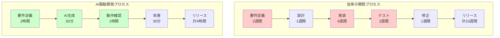

### **時間短縮の内訳**

| プロセス | **従来の開発** | **AI駆動開発** | **短縮率** |
|---------|--------------|---------------|-----------|
| **要件定義** | 2週間（80時間） | 2時間 | **97.5%削減** |
| **設計・実装** | 5週間（200時間） | 30分 | **99.75%削減** |
| **テスト・修正** | 3週間（120時間） | 1.5時間 | **98.75%削減** |
| **合計** | 10週間（400時間） | 4時間 | **99%削減** |

---

## 📊 5ステップワークフロー

### **アイデアから実装までの最短経路**

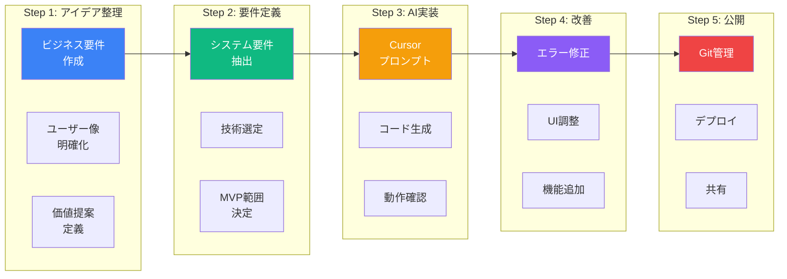

---

## 🎯 Step 1: アイデア整理（30分）

### **最初の30分で決まる成功率**

#### **必須項目チェックリスト**

```markdown
## ビジネス要件テンプレート

### 1. 解決したい課題
- [ ] 誰の課題か明確である
- [ ] 具体的な困りごとが言語化されている
- [ ] 既存の解決策の問題点が整理されている

### 2. ターゲットユーザー
- [ ] ペルソナが具体的（名前、年齢、職業）
- [ ] 利用シーン・文脈が明確
- [ ] ユーザー数の規模感がある

### 3. 提供価値
- [ ] コア価値が1文で説明できる
- [ ] 競合との差別化ポイントが明確
- [ ] ユーザーメリットが3つ以上ある

### 4. MVP機能
- [ ] 必須機能が3-5個に絞られている
- [ ] nice-to-have機能と区別されている
- [ ] 実装優先順位が決まっている
```

### **実例：タスク管理アプリ**

| 項目 | **悪い例** | **良い例** |
|------|-----------|-----------|
| **課題** | 「タスク管理が大変」 | 「フリーランスの田中さん（35歳）は、複数プロジェクトのタスク管理で、締切を見落として信用を失いかけた」 |
| **ユーザー** | 「忙しい人」 | 「月10件のプロジェクトを同時進行するフリーランスデザイナー」 |
| **価値** | 「便利なツール」 | 「締切3日前に自動でSlack通知し、納期遅延をゼロにする」 |
| **MVP** | 「全機能実装」 | 「①タスク登録 ②締切設定 ③Slack通知」の3機能のみ |

---

## 🎯 Step 2: AI要件定義（30分）

### **AIプロンプトで自動生成**

#### **Cursorへの指示例**

```markdown
以下のビジネス要件から、システム要件定義書を作成してください：

## ビジネス要件
- ターゲット：月10件のプロジェクトを持つフリーランス
- 課題：締切管理の失念による信用失墜リスク
- 解決策：自動リマインダー付きタスク管理システム

## MVP機能
1. タスクの登録・編集・削除
2. 締切日時の設定とカウントダウン表示
3. 締切3日前・1日前・当日のSlack自動通知

## 技術要件
- フロントエンド：Next.js 15 + TypeScript
- データベース：Supabase
- 通知：Slack Web API
- デプロイ：Vercel

詳細な要件定義書を作成し、以下を含めてください：
- データベーススキーマ
- API設計
- 画面遷移図
- 実装優先順位
```

### **AIが生成する要件書の構造**

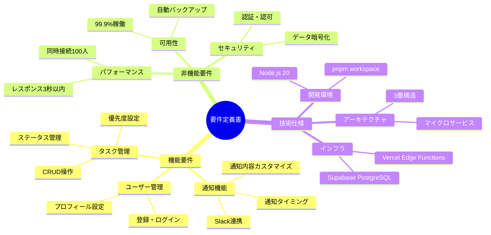

---

## 🎯 Step 3: Cursor実装（1時間）

### **コード生成から動作確認まで**

#### **実装の流れ**

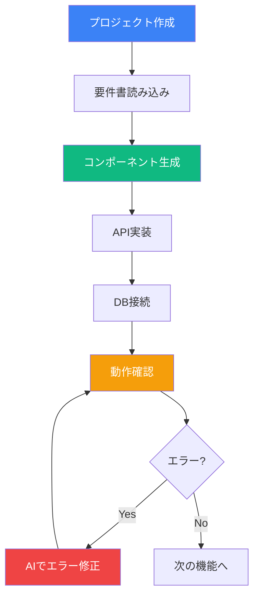

#### **Cursorプロンプトの実例**

```markdown
@codebase を参照して、以下のタスク管理機能を実装してください：

## 実装内容
1. タスク一覧画面（/tasks）
   - タスクカード表示（タイトル、締切、ステータス）
   - 締切までの残り時間をカウントダウン表示
   - ステータスに応じた色分け（未着手:グレー、進行中:青、完了:緑）

2. タスク追加フォーム
   - モーダルダイアログで表示
   - 必須項目：タイトル、締切日時
   - オプション：説明、優先度、カテゴリ

3. Supabaseとの連携
   - tasksテーブルのCRUD操作
   - リアルタイム更新（Supabase Realtime）
   - 楽観的UI更新

使用技術：
- Next.js 15 App Router
- TypeScript
- Tailwind CSS
- shadcn/ui
- Supabase Client
```

### **生成されるコードの品質チェック**

| チェック項目 | **確認ポイント** | **AIへの追加指示** |
|------------|----------------|-------------------|
| **型安全性** | TypeScriptの型定義が完備 | 「型定義を厳密にしてください」 |
| **エラーハンドリング** | try-catchが適切に配置 | 「エラー処理を追加してください」 |
| **レスポンシブ対応** | モバイル表示が崩れない | 「モバイル対応してください」 |
| **パフォーマンス** | 不要な再レンダリング回避 | 「React.memoを使って最適化してください」 |
| **アクセシビリティ** | キーボード操作可能 | 「aria属性を適切に設定してください」 |

---

## 💡 この章のまとめ

- ✅ AI駆動開発により、開発時間を**99%削減**できる
- ✅ **5ステップワークフロー**で、アイデアから実装まで4時間で完成
- ✅ **要件定義の品質**が、AI生成コードの品質を決定する
- ✅ **エラーは恐れず**、AIに修正を任せることで高速開発
- ✅ **MVPに集中**し、必要最小限の機能から始める

## 🚀 次の章への橋渡し

5ステップワークフローの基本を理解しました。
次の第2章では、このワークフローを**実際のプロジェクト**に適用し、**イテレーション開発**の実践方法を学びます。
小さく始めて、素早く改善する「アジャイル開発」の本質に迫ります。

---

# 第2章：イテレーション開発の実践

## 🎯 この章で学ぶこと

- **MVPファースト思考**で、最速でユーザー価値を提供する方法
- **フィードバックループ**を高速で回す技術
- **段階的機能追加**による着実な成長戦略
- **失敗を恐れない文化**の構築と実践

## 📌 この章の位置づけ

第1章で学んだ5ステップワークフローを、実際のプロジェクトで**繰り返し実行**する方法を学びます。一度で完璧を目指すのではなく、**小さく始めて素早く改善**する開発手法を習得します。

---

## 🔄 イテレーション開発とは

### **小さく始めて、素早く改善**

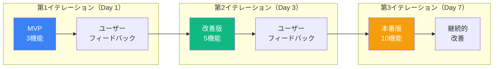

### **従来の開発との比較**

| 観点 | **ウォーターフォール開発** | **イテレーション開発** |
|------|-------------------------|---------------------|
| **リリース頻度** | 3ヶ月に1回 | **毎日〜週1回** |
| **フィードバック** | 完成後に一括 | **都度反映** |
| **リスク** | 最後まで分からない | **早期発見・修正** |
| **ユーザー満足度** | 期待とズレやすい | **期待に沿いやすい** |
| **開発コスト** | 手戻りで増大 | **最小限に抑制** |

---

## 📊 MVPの定義と実装

### **Minimum Viable Product（実用最小限の製品）**

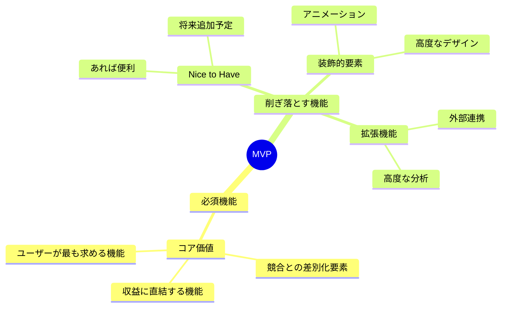

### **実例：ECサイトのMVP進化**

| イテレーション | **機能** | **開発時間** | **ユーザー数** |
|--------------|---------|------------|-------------|
| **MVP（v0.1）** | 商品表示・カート・決済 | 4時間 | 10人 |
| **v0.2** | ユーザー登録・ログイン | 2時間 | 50人 |
| **v0.3** | 商品検索・フィルター | 3時間 | 200人 |
| **v1.0** | レビュー・お気に入り | 4時間 | 1,000人 |
| **v2.0** | レコメンド・クーポン | 8時間 | 5,000人 |

---

## 🚀 フィードバックループの構築

### **ユーザーの声を即座に反映**

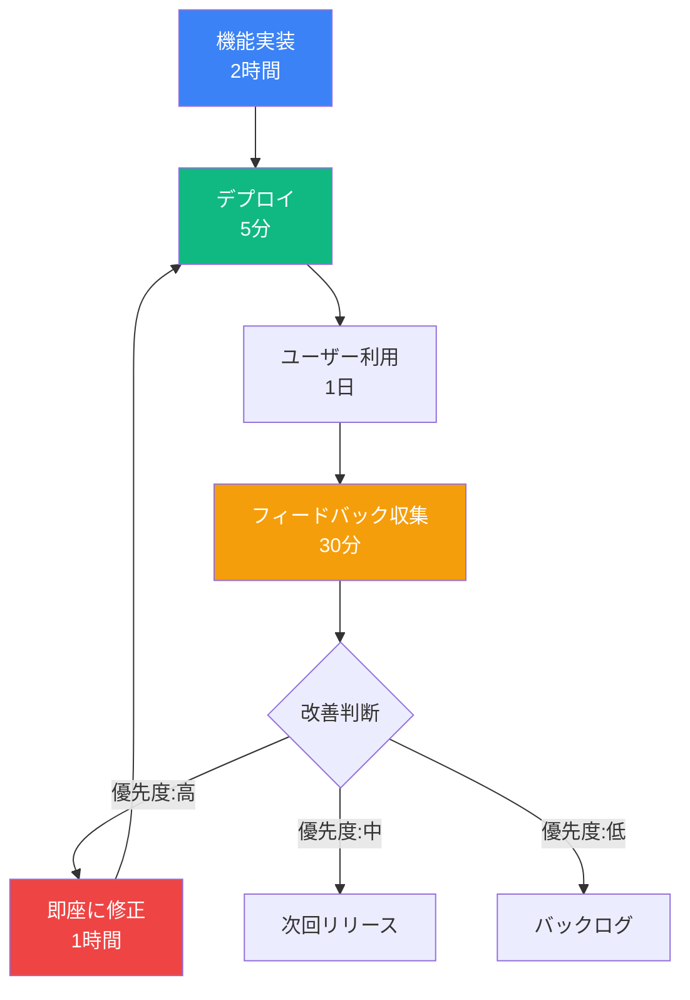

### **フィードバック収集の方法**

| 方法 | **ツール** | **メリット** | **実装時間** |
|------|----------|------------|------------|
| **アンケート** | Google Forms | 構造化データ | 5分 |
| **ユーザーインタビュー** | Zoom/Meet | 深い洞察 | 30分/人 |
| **アクセス解析** | Google Analytics | 定量データ | 10分設定 |
| **ヒートマップ** | Hotjar | 視覚的理解 | 15分設定 |
| **エラーログ** | Sentry | 自動収集 | 20分設定 |

---

## 📈 段階的機能追加の戦略

### **優先順位付けマトリクス**

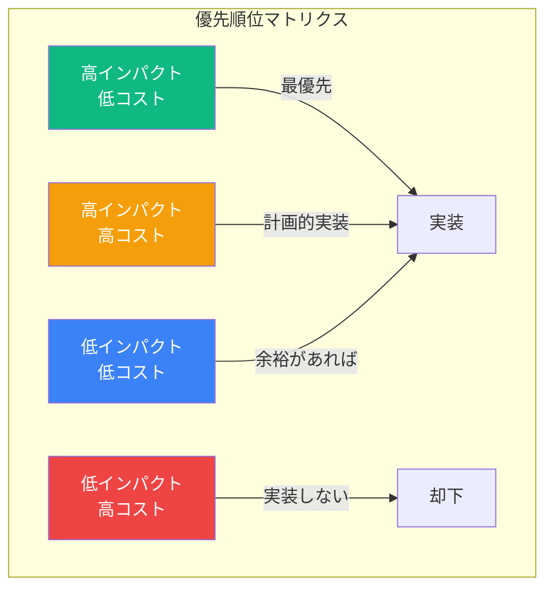

### **実装判断のフレームワーク**

```markdown
## 機能追加判断シート

### 1. インパクト評価（1-10点）
- [ ] ユーザー価値向上度
- [ ] 収益貢献度
- [ ] 差別化要素強化度

### 2. コスト評価（1-10点）
- [ ] 開発時間
- [ ] 技術的難易度
- [ ] 保守運用負荷

### 3. 実装判断
- スコア 7以上 → 即座に実装
- スコア 4-6 → 次のイテレーション
- スコア 3以下 → バックログまたは却下
```

---

## 🎯 失敗から学ぶ文化

### **失敗は最高の教師**

| 失敗の種類 | **学び** | **次のアクション** |
|----------|---------|------------------|
| **機能の使われなさ** | ユーザーニーズのズレ | ユーザーインタビュー強化 |
| **パフォーマンス問題** | 技術選定ミス | アーキテクチャ見直し |
| **UXの悪さ** | デザイン軽視 | ユーザビリティテスト導入 |
| **バグの多発** | テスト不足 | CI/CD整備 |

### **ポストモーテム（振り返り）テンプレート**

```markdown
## インシデント振り返り

### 何が起きたか
- 発生日時：
- 影響範囲：
- 症状：

### なぜ起きたか（5 Whys分析）
1. なぜ？ →
2. なぜ？ →
3. なぜ？ →
4. なぜ？ →
5. なぜ？ → 根本原因

### 再発防止策
- 短期対策：
- 中期対策：
- 長期対策：

### 学んだこと
- 技術的学び：
- プロセス的学び：
- 文化的学び：
```

---

## 💡 この章のまとめ

- ✅ **MVPファースト**で、最小限の機能から始める
- ✅ **1週間で3回**のイテレーションを回す
- ✅ **フィードバック収集**を仕組み化する
- ✅ **優先順位マトリクス**で機能追加を判断
- ✅ **失敗を歓迎**し、学びに変える文化を作る

## 🚀 次の章への橋渡し

イテレーション開発の実践方法を学びました。
次の第3章では、この開発サイクルを支える重要な要素である**ドキュメント作成**について学びます。
AIを活用して、品質の高いドキュメントを効率的に作成する方法を習得します。

---

# 第3章：AIを活用したドキュメント作成

## 🎯 この章で学ぶこと

- **ドキュメントの重要性**と、開発効率への影響を理解する
- **AIによる自動生成**で、ドキュメント作成時間を90%削減する方法
- **README.mdの書き方**と、プロジェクトの第一印象を良くする技術
- **API仕様書、設計書**などの技術文書を効率的に作成する方法
- **ユーザーマニュアル**を分かりやすく作成するテクニック

## 📌 この章の位置づけ

開発と並行して重要なのが**ドキュメント作成**です。適切なドキュメントは、チーム開発、保守、ユーザーサポートのすべてに影響します。AIを活用することで、高品質なドキュメントを短時間で作成できるようになります。

---

## 📚 なぜドキュメントが重要なのか

### **ドキュメントがもたらす5つの価値**

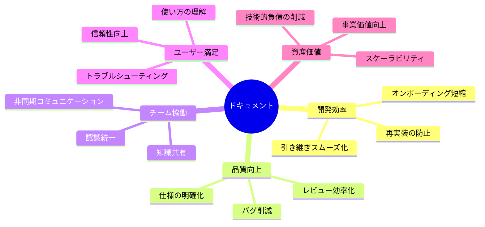

### **ドキュメント不足による損失**

| 問題 | **影響** | **年間損失（推定）** |
|------|---------|-------------------|
| **新メンバーのキャッチアップ遅延** | 生産性低下 | 200万円/人 |
| **同じ質問の繰り返し** | 時間の無駄 | 150万円 |
| **仕様理解のズレ** | 手戻り発生 | 500万円 |
| **バグの増加** | 品質低下 | 300万円 |
| **ユーザーサポート増加** | コスト増 | 400万円 |

---

## 🤖 AIドキュメント生成の実践

### **コードからドキュメントを自動生成**

#### **Cursorプロンプト例**

```markdown
@codebase を分析して、以下のドキュメントを生成してください：

## 1. README.md
- プロジェクト概要
- 主要機能一覧
- 技術スタック
- セットアップ手順
- 環境変数の説明
- 開発コマンド一覧
- デプロイ方法
- トラブルシューティング
- ライセンス

## 2. API仕様書
- エンドポイント一覧
- リクエスト/レスポンス形式
- 認証方法
- エラーコード一覧
- 使用例（curl/JavaScript）

## 3. データベース設計書
- ER図（Mermaid形式）
- テーブル定義
- インデックス設計
- リレーション説明

マークダウン形式で、初心者にも分かりやすく記述してください。
```

### **生成されるREADME.mdの例**

```markdown
# 📝 TaskMaster - スマートタスク管理アプリ

## 概要
TaskMasterは、フリーランサー向けの締切管理に特化したタスク管理アプリケーションです。
Slack通知機能により、締切の見落としを防ぎ、信頼性の高い業務遂行を支援します。

## ✨ 主要機能
- ✅ タスクの作成・編集・削除
- 📅 締切カウントダウン表示
- 🔔 Slack自動通知（3日前・1日前・当日）
- 📊 進捗ダッシュボード
- 🏷️ カテゴリ別管理

## 🛠 技術スタック
- **Frontend**: Next.js 15, TypeScript, Tailwind CSS
- **Backend**: Supabase (PostgreSQL)
- **Authentication**: Clerk
- **Notifications**: Slack Web API
- **Deployment**: Vercel

## 🚀 セットアップ

### 必要要件
- Node.js 20.0.0以上
- pnpm 8.0.0以上

### インストール手順
\`\`\`bash
# リポジトリのクローン
git clone https://github.com/yourusername/taskmaster.git
cd taskmaster

# 依存関係のインストール
pnpm install

# 環境変数の設定
cp .env.example .env.local
# .env.localを編集して必要な値を設定

# 開発サーバーの起動
pnpm dev
\`\`\`

### 環境変数
\`\`\`env
NEXT_PUBLIC_SUPABASE_URL=your_supabase_url
NEXT_PUBLIC_SUPABASE_ANON_KEY=your_supabase_anon_key
NEXT_PUBLIC_CLERK_PUBLISHABLE_KEY=your_clerk_key
SLACK_WEBHOOK_URL=your_slack_webhook_url
\`\`\`
```

---

## 📋 技術文書のテンプレート集

### **1. API仕様書テンプレート**

```markdown
## API: タスク取得
### エンドポイント
`GET /api/tasks`

### 認証
Bearer Token required

### リクエストパラメータ
| パラメータ | 型 | 必須 | 説明 |
|-----------|---|-----|------|
| status | string | No | フィルター（pending/completed） |
| limit | number | No | 取得件数（デフォルト:20） |

### レスポンス
\`\`\`json
{
  "success": true,
  "data": [
    {
      "id": "uuid",
      "title": "タスク名",
      "deadline": "2025-11-10T10:00:00Z",
      "status": "pending"
    }
  ],
  "total": 42
}
\`\`\`

### エラーレスポンス
| コード | 説明 | 対処法 |
|-------|------|--------|
| 401 | 認証エラー | トークンを確認 |
| 429 | レート制限 | 時間をおいて再試行 |
| 500 | サーバーエラー | サポートに連絡 |
```

### **2. データベース設計書テンプレート**

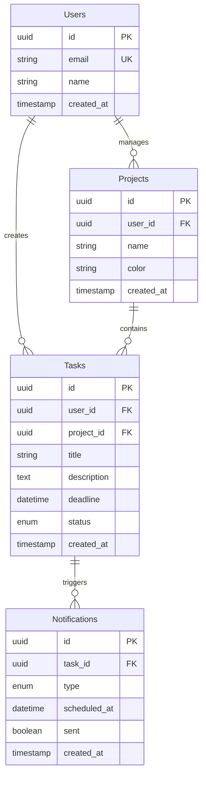

---

## 📝 ユーザー向けドキュメント

### **分かりやすいマニュアルの要素**

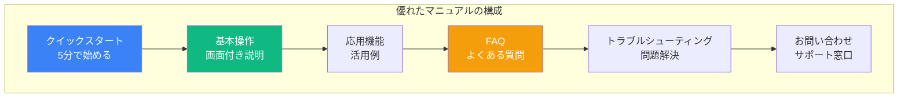

### **ユーザーマニュアルのサンプル**

```markdown
# TaskMaster 使い方ガイド

## 🚀 クイックスタート（5分で始める）

### 1. アカウント登録
1. [TaskMaster](https://taskmaster.app)にアクセス
2. 「新規登録」ボタンをクリック
3. Googleアカウントでログイン

### 2. 最初のタスクを作成
1. ダッシュボードの「＋」ボタンをクリック
2. タスク名と締切日を入力
3. 「作成」ボタンをクリック

### 3. Slack通知を設定
1. 設定メニューから「通知設定」を選択
2. 「Slackと連携」ボタンをクリック
3. 通知を受け取るチャンネルを選択

🎉 これで準備完了です！

## 📖 基本操作

### タスクの管理
[画面キャプチャ付きで説明]

### プロジェクトの作成
[画面キャプチャ付きで説明]

## ❓ よくある質問

**Q: 無料で使えますか？**
A: はい、月100タスクまで無料です。

**Q: モバイルアプリはありますか？**
A: 現在開発中です。ブラウザからご利用ください。
```

---

## 🎨 ドキュメントデザインのベストプラクティス

### **読みやすさを高める工夫**

| 要素 | **悪い例** | **良い例** |
|------|-----------|-----------|
| **見出し** | すべて同じサイズ | 階層構造を明確に |
| **コード** | プレーンテキスト | シンタックスハイライト付き |
| **説明** | 長文の段落 | 箇条書きと短文 |
| **画像** | テキストのみ | スクリーンショット付き |
| **例** | 抽象的な説明 | 具体的なユースケース |

### **Mermaidダイアグラムの活用**

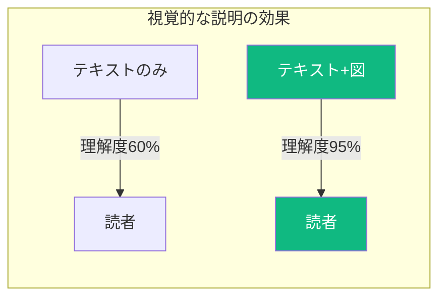

---

## 💡 この章のまとめ

- ✅ ドキュメントは**開発資産**として価値がある
- ✅ AIを使えば、ドキュメント作成時間を**90%削減**できる
- ✅ **README.md**はプロジェクトの顔、第一印象を大切に
- ✅ **技術文書**はテンプレートを活用して効率化
- ✅ **ユーザーマニュアル**は、画像とステップバイステップが重要

## 🚀 次の章への橋渡し

AIを活用したドキュメント作成の方法を学びました。
次の第4章では、作成したコードとドキュメントを適切に管理する**バージョン管理**について学びます。
GitとGitHubを使った、プロフェッショナルな開発フローを習得します。

---

# 第4章：バージョン管理の基礎

## 🎯 この章で学ぶこと

- **Gitの基本概念**と、なぜバージョン管理が必要なのかを理解する
- **GitHubの活用方法**と、コラボレーション開発の基礎を学ぶ
- **コミットメッセージの書き方**と、履歴を見やすくする技術
- **ブランチ戦略**の基本と、並行開発の進め方
- **プルリクエスト**によるコードレビューの実践

## 📌 この章の位置づけ

個人開発から**チーム開発**へステップアップするために必須の知識です。バージョン管理を適切に行うことで、安全に実験し、失敗を恐れずに開発を進められるようになります。

---

## 🔧 Gitとは何か

### **タイムマシンのような開発ツール**

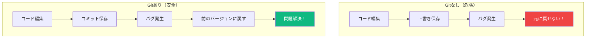

### **バージョン管理のメリット**

| 機能 | **効果** | **具体例** |
|------|---------|-----------|
| **履歴管理** | いつ誰が何を変更したか分かる | 「3日前の田中さんの修正が原因」 |
| **バックアップ** | データ消失の心配なし | PCが壊れてもGitHubから復元 |
| **並行開発** | 複数人で同時に作業 | Aさん：機能追加、Bさん：バグ修正 |
| **実験環境** | 本番を壊さずテスト | 新機能をブランチで試す |
| **レビュー** | 品質向上 | チームでコードをチェック |

---

## 📦 Gitの基本操作

### **必須コマンド5つだけ**


### **Cursorでの実行方法**

```markdown
## Cursorのターミナルで実行

# 1. 初期設定（最初の1回だけ）
git config --global user.name "あなたの名前"
git config --global user.email "your-email@example.com"

# 2. リポジトリ初期化
git init

# 3. 変更をステージング（保存準備）
git add .  # すべてのファイル
git add src/components/TaskList.tsx  # 特定ファイル

# 4. コミット（保存）
git commit -m "タスク一覧機能を追加"

# 5. GitHubにプッシュ（アップロード）
git push origin main

# 6. 最新版を取得（ダウンロード）
git pull origin main
```

---

## 💬 コミットメッセージの書き方

### **良いコミットメッセージの例**

| タイプ | **プレフィックス** | **例** |
|--------|------------------|--------|
| **機能追加** | feat: | `feat: タスク削除機能を追加` |
| **バグ修正** | fix: | `fix: 締切日が保存されない問題を修正` |
| **ドキュメント** | docs: | `docs: README.mdにセットアップ手順を追加` |
| **スタイル** | style: | `style: インデントを統一` |
| **リファクタリング** | refactor: | `refactor: タスク処理を関数に分離` |
| **テスト** | test: | `test: タスク作成のテストを追加` |
| **その他** | chore: | `chore: パッケージをアップデート` |

### **コミットメッセージテンプレート**

```markdown
## AIへの指示で自動生成

以下の変更内容から、適切なコミットメッセージを生成してください：

変更内容：
- TaskList.tsxでタスクの完了状態を切り替える機能を追加
- タスク完了時にアニメーションを追加
- Supabaseのtasksテーブルにstatus列を追加

日本語で、以下の形式で生成：
- 1行目：要約（50文字以内）
- 2行目：空行
- 3行目以降：詳細説明（必要に応じて）
```

---

## 🌲 ブランチ戦略

### **機能ごとに分岐して開発**

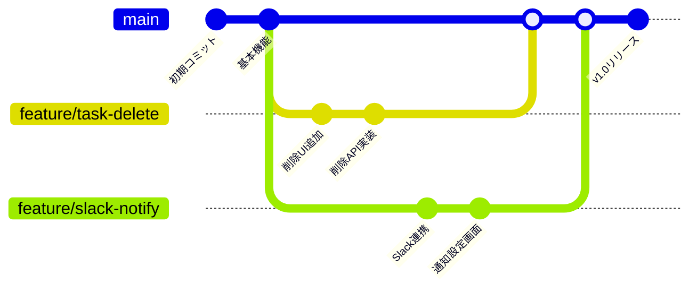

### **ブランチ命名規則**

| 目的 | **命名パターン** | **例** |
|------|----------------|--------|
| **機能追加** | feature/機能名 | `feature/user-profile` |
| **バグ修正** | fix/バグ内容 | `fix/login-error` |
| **ホットフィックス** | hotfix/緊急修正 | `hotfix/security-patch` |
| **実験** | experiment/試験内容 | `experiment/new-ui` |

### **ブランチ操作コマンド**

```bash
# ブランチ作成＆切り替え
git checkout -b feature/new-feature

# ブランチ一覧表示
git branch

# ブランチ切り替え
git checkout main

# ブランチ削除（マージ済み）
git branch -d feature/new-feature

# ブランチをマージ
git checkout main
git merge feature/new-feature
```

---

## 🔄 GitHubでのコラボレーション

### **プルリクエスト（PR）の流れ**

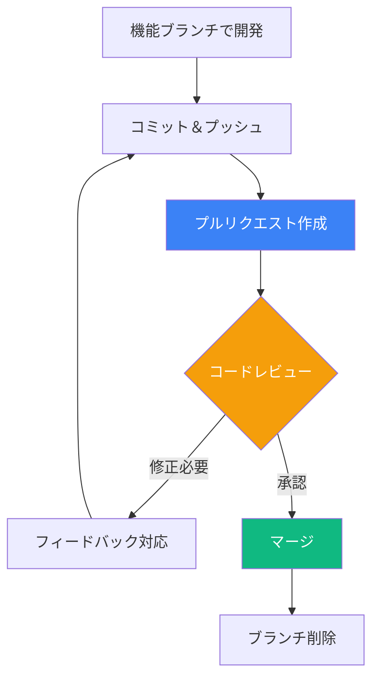

### **PRテンプレート**

```markdown
## 概要
このPRで実装した機能や修正した問題を簡潔に説明

## 変更内容
- [ ] タスク削除機能の実装
- [ ] 削除確認ダイアログの追加
- [ ] 削除後のトースト通知

## スクリーンショット
（UIの変更がある場合は画像を添付）

## テスト方法
1. タスク一覧ページを開く
2. タスクの削除ボタンをクリック
3. 確認ダイアログでOKを選択
4. タスクが削除されることを確認

## チェックリスト
- [ ] コードは動作確認済み
- [ ] エラーハンドリングを実装
- [ ] ドキュメントを更新
```

---

## 🛡️ GitHubのセキュリティ

### **秘密情報の管理**

| ファイル | **Gitに含める** | **Gitに含めない** |
|---------|---------------|-----------------|
| **.env.local** | ❌ | APIキー、秘密鍵 |
| **.env.example** | ✅ | キー名のみ（値は空） |
| **package.json** | ✅ | 依存関係 |
| **node_modules/** | ❌ | 自動生成される |
| **dist/**, **build/** | ❌ | ビルド成果物 |

### **.gitignoreの設定**

```bash
# 環境変数
.env
.env.local
.env.production

# 依存関係
node_modules/
.pnpm-store/

# ビルド成果物
dist/
build/
.next/
out/

# エディタ設定
.vscode/
.idea/
*.swp
*.swo

# OS固有ファイル
.DS_Store
Thumbs.db

# ログファイル
*.log
npm-debug.log*
yarn-debug.log*
yarn-error.log*
```

---

## 💡 この章のまとめ

- ✅ Gitは**開発の保険**、失敗を恐れずに挑戦できる
- ✅ **5つの基本コマンド**だけで十分始められる
- ✅ **意味のあるコミットメッセージ**で履歴を資産に
- ✅ **ブランチ戦略**で、安全に並行開発
- ✅ **プルリクエスト**でコード品質を向上

## 🚀 次の章への橋渡し

バージョン管理の基礎を理解しました。
次の第5章では、チーム開発をさらに効率化する**コラボレーションツール**と**自動化**について学びます。
CI/CDやGitHub Actionsを使った、モダンな開発フローを習得します。

---

# 第5章：コラボレーションと自動化

## 🎯 この章で学ぶこと

- **チーム開発の効率化**を実現するツールとプラクティス
- **GitHub Issues/Projects**を使ったタスク管理
- **CI/CD**による自動テスト・デプロイの仕組み
- **GitHub Actions**で繰り返し作業を自動化する方法
- **コードレビュー文化**の構築と実践

## 📌 この章の位置づけ

個人開発からチーム開発への移行、そして開発プロセスの**自動化**により、品質と生産性を大幅に向上させる方法を学びます。これにより、**スケーラブルな開発体制**を構築できます。

---

## 👥 チーム開発の基盤

### **効率的なコラボレーションの要素**

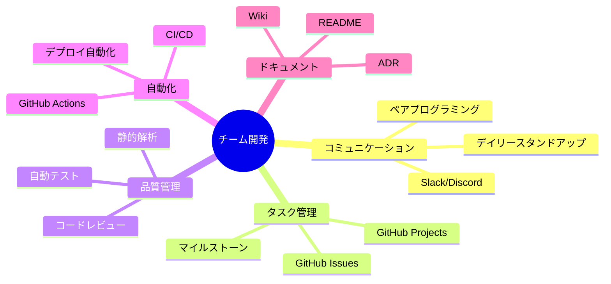

### **開発フローの全体像**

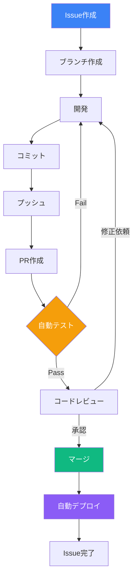

---

## 📋 GitHub Issues/Projectsでのタスク管理

### **Issue駆動開発**

#### **Issueテンプレート**

```markdown
---
name: 機能要望
about: 新機能の提案
title: '[FEATURE] '
labels: enhancement
assignees: ''
---

## 概要
実装したい機能を1-2文で説明

## 背景・目的
- なぜこの機能が必要か
- どんな問題を解決するか

## 要件
- [ ] 機能要件1
- [ ] 機能要件2
- [ ] 機能要件3

## 実装案
技術的なアプローチ（任意）

## 完了条件
- [ ] コードレビュー完了
- [ ] テスト追加
- [ ] ドキュメント更新
```

### **GitHub Projectsカンバン**

| TODO | **In Progress** | **Review** | **Done** |
|------|----------------|------------|----------|
| #12 ユーザー認証 | #15 タスク削除 | #14 Slack連携 | #13 DB設計 |
| #16 検索機能 | #17 UI改善 | | #11 環境構築 |
| #18 通知設定 | | | #10 要件定義 |

---

## 🔄 CI/CDパイプライン

### **継続的インテグレーション/デプロイ**

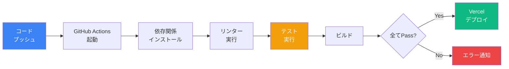

### **GitHub Actions設定例**

```yaml
# .github/workflows/ci.yml
name: CI/CD Pipeline

on:
  push:
    branches: [main]
  pull_request:
    branches: [main]

jobs:
  test:
    runs-on: ubuntu-latest

    steps:
    - uses: actions/checkout@v3

    - name: Setup Node.js
      uses: actions/setup-node@v3
      with:
        node-version: '20'

    - name: Install pnpm
      uses: pnpm/action-setup@v2
      with:
        version: 8

    - name: Install dependencies
      run: pnpm install

    - name: Run linter
      run: pnpm lint

    - name: Run tests
      run: pnpm test

    - name: Build
      run: pnpm build

    - name: Deploy to Vercel
      if: github.ref == 'refs/heads/main'
      run: |
        pnpm vercel --prod --token=${{ secrets.VERCEL_TOKEN }}
```

---

## 🤖 作業の自動化

### **繰り返し作業をGitHub Actionsで自動化**

| 作業 | **自動化方法** | **効果** |
|------|--------------|----------|
| **依存関係の更新** | Dependabot | セキュリティリスク削減 |
| **コード整形** | Prettier Action | コードスタイル統一 |
| **リリースノート作成** | Release Drafter | 変更履歴自動生成 |
| **Issue自動ラベル** | Labeler Action | 分類の効率化 |
| **定期バックアップ** | Scheduled Action | データ保護 |

### **自動化スクリプトの例**

```yaml
# 毎日午前2時にバックアップ
name: Daily Backup

on:
  schedule:
    - cron: '0 17 * * *'  # UTC 17:00 = JST 2:00

jobs:
  backup:
    runs-on: ubuntu-latest
    steps:
    - uses: actions/checkout@v3

    - name: Backup database
      run: |
        # Supabaseのデータをエクスポート
        curl -X POST ${{ secrets.SUPABASE_BACKUP_URL }} \
          -H "Authorization: Bearer ${{ secrets.SUPABASE_KEY }}"

    - name: Upload to S3
      uses: jakejarvis/s3-sync-action@master
      with:
        args: --acl private
      env:
        AWS_S3_BUCKET: ${{ secrets.AWS_S3_BUCKET }}
        AWS_ACCESS_KEY_ID: ${{ secrets.AWS_ACCESS_KEY_ID }}
        AWS_SECRET_ACCESS_KEY: ${{ secrets.AWS_SECRET_ACCESS_KEY }}
```

---

## 📝 コードレビューのベストプラクティス

### **建設的なレビューのポイント**

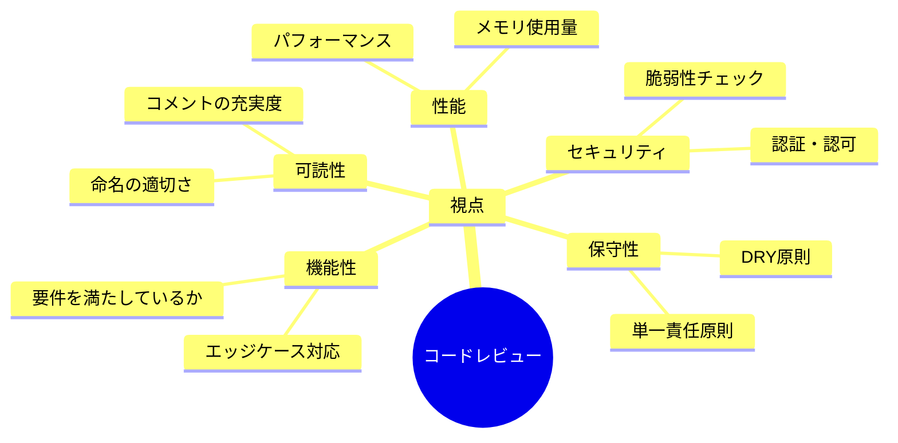

### **レビューコメントの書き方**

| タイプ | **悪い例** | **良い例** |
|--------|-----------|-----------|
| **提案** | 「これは間違ってる」 | 「こう書くとより読みやすくなりそうです：[コード例]」 |
| **質問** | 「意味不明」 | 「この処理の意図を教えていただけますか？」 |
| **称賛** | （コメントなし） | 「エラーハンドリングが丁寧で素晴らしいです！」 |
| **必須修正** | 「直して」 | 「[Must] セキュリティリスクがあるため、この部分の修正をお願いします」 |

### **レビューチェックリスト**

```markdown
## コードレビューチェックリスト

### 機能面
- [ ] 要件を満たしている
- [ ] エラーケースを考慮している
- [ ] テストが追加されている

### コード品質
- [ ] 命名が分かりやすい
- [ ] 重複コードがない
- [ ] 適切にコメントされている

### パフォーマンス
- [ ] 不要な処理がない
- [ ] N+1問題がない
- [ ] 適切にキャッシュを使用

### セキュリティ
- [ ] 入力値検証がある
- [ ] SQLインジェクション対策
- [ ] XSS対策

### ドキュメント
- [ ] README更新
- [ ] API仕様書更新
- [ ] 変更履歴記載
```

---

## 💡 この章のまとめ

- ✅ **GitHub Issues/Projects**でタスクを可視化・管理
- ✅ **CI/CD**により、品質を保ちながら高速リリース
- ✅ **GitHub Actions**で繰り返し作業を自動化
- ✅ **コードレビュー**で品質向上とナレッジ共有
- ✅ **自動化**により、創造的な作業に集中できる

## 🚀 次の章への橋渡し

コラボレーションと自動化の仕組みを学びました。
次の第6章では、開発したアプリケーションの**品質管理**について深く学びます。
テスト、モニタリング、パフォーマンス最適化の実践方法を習得します。

---

# 第6章：品質管理の実践

## 🎯 この章で学ぶこと

- **テストの重要性**と、AIを活用した効率的なテスト作成
- **エラー監視**と**パフォーマンス測定**の実装方法
- **ユーザビリティテスト**による使いやすさの改善
- **セキュリティ対策**の基本と実践
- **継続的な改善サイクル**の構築方法

## 📌 この章の位置づけ

開発速度だけでなく、**品質**も重要です。この章では、ユーザーに価値を提供し続けるための品質管理手法を学びます。AIを活用することで、品質管理も効率的に行えるようになります。

---

## 🧪 テストの基礎と実践

### **テストピラミッド**

```mermaid
graph TB
    subgraph "テストの種類と割合"
        A[E2Eテスト<br/>10%]
        B[統合テスト<br/>30%]
        C[単体テスト<br/>60%]
    end

    A --> D[実行時間: 遅い<br/>カバー範囲: 広い]
    B --> E[実行時間: 中<br/>カバー範囲: 中]
    C --> F[実行時間: 速い<br/>カバー範囲: 狭い]

    style A fill:#ef4444,color:#fff
    style B fill:#f59e0b,color:#fff
    style C fill:#10b981,color:#fff
```

### **AIによるテストコード生成**

#### **Cursorプロンプト**

```markdown
@codebase のTaskList.tsxコンポーネントに対するテストを作成してください。

以下のケースをカバーしてください：
1. タスク一覧が正しく表示される
2. タスクの追加が正常に動作する
3. タスクの削除が正常に動作する
4. 空の状態で適切なメッセージが表示される
5. エラー時の表示が正しい

使用ライブラリ：
- @testing-library/react
- Jest
- MSW（モックサーバー）

テストは日本語のdescribeで記述してください。
```

### **生成されるテストコード例**

```typescript
import { render, screen, fireEvent, waitFor } from '@testing-library/react'
import { TaskList } from './TaskList'

describe('タスク一覧コンポーネント', () => {
  describe('正常系', () => {
    test('タスクが正しく表示される', async () => {
      render(<TaskList />)

      await waitFor(() => {
        expect(screen.getByText('買い物')).toBeInTheDocument()
        expect(screen.getByText('会議準備')).toBeInTheDocument()
      })
    })

    test('新しいタスクを追加できる', async () => {
      render(<TaskList />)

      const input = screen.getByPlaceholderText('タスクを入力')
      const button = screen.getByText('追加')

      fireEvent.change(input, { target: { value: '新規タスク' } })
      fireEvent.click(button)

      await waitFor(() => {
        expect(screen.getByText('新規タスク')).toBeInTheDocument()
      })
    })
  })

  describe('エラー処理', () => {
    test('APIエラー時にエラーメッセージが表示される', async () => {
      // エラーをシミュレート
      server.use(
        rest.get('/api/tasks', (req, res, ctx) => {
          return res(ctx.status(500))
        })
      )

      render(<TaskList />)

      await waitFor(() => {
        expect(screen.getByText('エラーが発生しました')).toBeInTheDocument()
      })
    })
  })
})
```

---

## 📊 モニタリングとアラート

### **本番環境の監視体制**

```mermaid
flowchart TB
    subgraph "監視対象"
        A[アプリケーション]
        B[API]
        C[データベース]
    end

    subgraph "監視ツール"
        D[Sentry<br/>エラー監視]
        E[Vercel Analytics<br/>パフォーマンス]
        F[Uptime Robot<br/>死活監視]
    end

    subgraph "通知"
        G[Slack通知]
        H[メール通知]
        I[PagerDuty]
    end

    A & B & C --> D & E & F
    D & E & F --> G & H & I

    style D fill:#8b5cf6,color:#fff
    style E fill:#3b82f6,color:#fff
    style F fill:#10b981,color:#fff
```

### **Sentryの設定例**

```typescript
// sentry.client.config.ts
import * as Sentry from '@sentry/nextjs'

Sentry.init({
  dsn: process.env.NEXT_PUBLIC_SENTRY_DSN,
  environment: process.env.NODE_ENV,
  integrations: [
    new Sentry.BrowserTracing(),
    new Sentry.Replay()
  ],
  tracesSampleRate: 1.0,
  replaysSessionSampleRate: 0.1,
  replaysOnErrorSampleRate: 1.0,
})

// エラー通知のカスタマイズ
Sentry.setContext('user_info', {
  subscription: 'premium',
  feature_flags: ['new_ui', 'beta_features']
})
```

### **監視ダッシュボードの例**

| メトリクス | **閾値** | **アラート条件** | **対応** |
|-----------|---------|----------------|----------|
| **エラー率** | < 1% | 5分間で > 5% | 緊急対応 |
| **レスポンス時間** | < 200ms | 平均 > 1秒 | パフォーマンス改善 |
| **可用性** | 99.9% | ダウンタイム発生 | 即座に復旧作業 |
| **CPU使用率** | < 70% | 継続的に > 90% | スケールアップ |
| **メモリ使用率** | < 80% | > 90% | メモリリーク調査 |

---

## 🎨 ユーザビリティテスト

### **使いやすさの測定と改善**

```mermaid
mindmap
  root((UXテスト))
    定量評価
      タスク完了率
      エラー率
      完了時間
      クリック数
    定性評価
      ユーザーインタビュー
      アンケート
      行動観察
      感情分析
    ツール
      Hotjar
      FullStory
      Maze
      UsabilityHub
```

### **5秒テストの実施**

```markdown
## 5秒テストシナリオ

### 目的
ファーストビューで価値が伝わるか確認

### 手順
1. トップページを5秒間表示
2. 画面を隠す
3. 以下を質問：
   - このサービスは何をするもの？
   - 誰向けのサービス？
   - 最初にクリックする場所は？

### 成功基準
- 80%以上が正しく理解
- 主要CTAを認識
- ポジティブな第一印象
```

---

## 🔒 セキュリティ対策

### **基本的なセキュリティチェックリスト**

```markdown
## セキュリティチェックリスト

### 認証・認可
- [ ] 強固なパスワードポリシー
- [ ] 二要素認証（2FA）対応
- [ ] セッション管理の適切な実装
- [ ] JWTトークンの安全な保存

### データ保護
- [ ] HTTPS通信の強制
- [ ] 機密データの暗号化
- [ ] SQLインジェクション対策
- [ ] XSS（クロスサイトスクリプティング）対策

### アクセス制御
- [ ] CORS設定の適切な設定
- [ ] レート制限の実装
- [ ] ファイルアップロード制限
- [ ] 管理画面のIP制限

### 監査
- [ ] アクセスログの記録
- [ ] 異常検知の仕組み
- [ ] 定期的なセキュリティ監査
- [ ] 脆弱性スキャンの実施
```

### **環境変数の安全な管理**

```bash
# ❌ 危険な例
API_KEY=sk_live_abcd1234  # 本番キーを直接記述

# ✅ 安全な例
# .env.local（開発環境）
API_KEY=sk_test_abcd1234  # テスト用キー

# Vercel環境変数（本番環境）
# ダッシュボードから設定
# - プレビュー環境用
# - 本番環境用
# を分けて管理
```

---

## 📈 パフォーマンス最適化

### **Core Web Vitalsの改善**

| 指標 | **目標** | **測定ツール** | **改善方法** |
|------|---------|--------------|------------|
| **LCP**<br/>(Largest Contentful Paint) | < 2.5秒 | PageSpeed Insights | 画像最適化、CDN使用 |
| **FID**<br/>(First Input Delay) | < 100ms | Chrome DevTools | JSバンドル最小化 |
| **CLS**<br/>(Cumulative Layout Shift) | < 0.1 | Lighthouse | サイズ指定、フォント最適化 |

### **Next.js最適化テクニック**

```typescript
// 画像最適化
import Image from 'next/image'

<Image
  src="/hero.jpg"
  alt="Hero"
  width={1920}
  height={1080}
  priority  // LCP改善
  placeholder="blur"  // CLS改善
/>

// 動的インポート
const HeavyComponent = dynamic(() => import('./HeavyComponent'), {
  loading: () => <Skeleton />,
  ssr: false
})

// データフェッチ最適化
// Parallel Data Fetching
const [users, posts] = await Promise.all([
  fetchUsers(),
  fetchPosts()
])
```

---

## 🔄 継続的改善のサイクル

### **PDCAサイクルの実践**

```mermaid
flowchart TB
    P[Plan<br/>計画] --> D[Do<br/>実行]
    D --> C[Check<br/>評価]
    C --> A[Act<br/>改善]
    A --> P

    P --> P1[KPI設定<br/>目標値決定]
    D --> D1[実装<br/>リリース]
    C --> C1[測定<br/>分析]
    A --> A1[対策<br/>次の計画]

    style P fill:#3b82f6,color:#fff
    style D fill:#10b981,color:#fff
    style C fill:#f59e0b,color:#fff
    style A fill:#8b5cf6,color:#fff
```

### **改善の優先順位付け**

```markdown
## 改善タスクの評価マトリクス

### インパクト vs 工数

|  | 低工数 | 高工数 |
|--|--------|--------|
| **高インパクト** | 🔥 最優先<br/>・ページ速度改善<br/>・エラー修正 | 📋 計画的実施<br/>・大規模リファクタ<br/>・新機能追加 |
| **低インパクト** | ⚡ Quick Win<br/>・UI微調整<br/>・文言修正 | ❌ 後回し<br/>・過度な最適化<br/>・Nice to have |
```

---

## 💡 この章のまとめ

- ✅ **テスト自動化**により、品質を保ちながら高速開発
- ✅ **モニタリング**で問題を早期発見・対応
- ✅ **ユーザビリティテスト**で使いやすさを継続改善
- ✅ **セキュリティ対策**でユーザーの信頼を獲得
- ✅ **PDCAサイクル**で継続的に品質向上

## 🚀 次の章への橋渡し

品質管理の実践方法を学びました。
最終章の第7章では、これまで学んだすべてを統合し、**実際のプロジェクトで成功するための総仕上げ**を行います。
プロフェッショナルなVibe Coderとしての完成形を目指します。

---

# 第7章：プロフェッショナルへの道

## 🎯 この章で学ぶこと

- **実プロジェクトでの成功パターン**と失敗から学ぶ知恵
- **ポートフォリオ構築**によるキャリア戦略
- **継続的学習**の仕組みと最新技術のキャッチアップ方法
- **コミュニティ参加**による成長加速
- **次のステップ**として目指すべき方向性

## 📌 この章の位置づけ

第2回講義の総仕上げとして、これまで学んだ技術を**実践で活かす方法**と、**継続的に成長し続ける仕組み**を学びます。Vibe Coderとしてのキャリアを成功に導くための戦略を身につけます。

---

## 🏆 成功プロジェクトのパターン

### **実際の成功事例分析**

```mermaid
timeline
    title タスク管理アプリ開発の実例（3週間）

    Week 1 : MVP開発
           : 3つの基本機能
           : 10人のテストユーザー

    Week 2 : フィードバック反映
           : 5つの機能追加
           : 100人のユーザー獲得

    Week 3 : 本格リリース
           : 10の機能完成
           : 500人のアクティブユーザー
           : 月額課金開始
```

### **成功の共通要因**

| 要因 | **詳細** | **実例** |
|------|---------|----------|
| **明確な価値提案** | 誰の何を解決するか | 「締切を忘れるフリーランサーの信用問題を解決」 |
| **素早い仮説検証** | 1週間以内にMVP | 3機能だけで価値を確認 |
| **ユーザーの声を聞く** | 毎日フィードバック収集 | Discordコミュニティで対話 |
| **継続的改善** | 週3回以上のアップデート | 小さな改善を積み重ね |
| **適切な技術選択** | 枯れた技術を使う | Next.js + Supabase |

---

## 💼 ポートフォリオ戦略

### **採用担当者が見るポイント**

```mermaid
mindmap
  root((ポートフォリオ))
    技術力
      使用技術の幅
      コード品質
      問題解決能力
    実績
      完成したプロダクト
      ユーザー数
      収益実績
    プロセス
      要件定義書
      設計ドキュメント
      テストカバレッジ
    成長性
      学習履歴
      貢献活動
      最新技術への対応
```

### **効果的なポートフォリオ構成**

```markdown
## ポートフォリオサイトの構成

### 1. ヒーローセクション
- キャッチコピー：「アイデアを形にするVibe Coder」
- 簡潔な自己紹介（2-3文）
- CTAボタン：作品を見る

### 2. プロジェクトショーケース（3-5個）
各プロジェクトに含める情報：
- スクリーンショット/デモ動画
- 概要（解決した課題）
- 使用技術
- 工夫したポイント
- GitHub/デモサイトリンク

### 3. スキルセット
- 技術スタック（レベル表示付き）
- ツール/サービス
- ソフトスキル

### 4. 開発プロセス
- 要件定義からデプロイまでのフロー
- 品質管理の取り組み

### 5. ブログ/学習記録
- 技術記事
- 開発日記
- 学んだことのアウトプット

### 6. コンタクト
- メールフォーム
- SNSリンク
- カレンダー予約
```

---

## 📚 継続的学習の仕組み

### **技術トレンドのキャッチアップ**

| 情報源 | **頻度** | **活用方法** |
|--------|---------|------------|
| **X (Twitter)** | 毎日15分 | 技術インフルエンサーをフォロー |
| **Zenn/Qiita** | 週2-3記事 | 実践的なTips収集 |
| **YouTube** | 週1-2動画 | 新機能のチュートリアル |
| **GitHub Trending** | 週1回 | 注目プロジェクト確認 |
| **技術カンファレンス** | 月1回 | オンライン視聴 |

### **学習計画テンプレート**

```markdown
## 月次学習計画

### 今月のテーマ
「Next.js 15の新機能マスター」

### 週別目標
- Week 1: Server Actions深掘り
- Week 2: Partial Prerendering実装
- Week 3: Parallel Routes活用
- Week 4: プロジェクトに適用

### アウトプット
- [ ] ブログ記事 2本
- [ ] GitHubでサンプルコード公開
- [ ] 社内勉強会で発表

### 振り返り
- できたこと：
- できなかったこと：
- 来月への改善点：
```

---

## 🌐 コミュニティの活用

### **参加すべきコミュニティ**

```mermaid
graph TB
    subgraph "オンラインコミュニティ"
        A[Discord<br/>TEKION VibeCoder]
        B[Slack<br/>技術コミュニティ]
        C[GitHub<br/>OSS貢献]
    end

    subgraph "イベント"
        D[もくもく会]
        E[LT会]
        F[ハッカソン]
    end

    subgraph "得られるもの"
        G[最新情報]
        H[人脈]
        I[モチベーション]
        J[フィードバック]
    end

    A & B & C --> G & H & I & J
    D & E & F --> G & H & I & J

    style A fill:#3b82f6,color:#fff
    style E fill:#10b981,color:#fff
    style I fill:#f59e0b,color:#fff
```

### **コミュニティでの振る舞い**

| 行動 | **Dos** | **Don'ts** |
|------|---------|-----------|
| **質問** | 調べてから具体的に質問 | 「動きません」だけの質問 |
| **回答** | 経験を交えて丁寧に | 上から目線の説教 |
| **共有** | 失敗談も含めて共有 | 自慢話ばかり |
| **議論** | 建設的な提案 | 批判だけ |

---

## 🎯 キャリアパスの選択肢

### **Vibe Coderの3つの道**

```mermaid
flowchart TB
    A[Vibe Coder<br/>基礎習得] --> B{キャリア選択}

    B --> C[フリーランス]
    C --> C1[個人開発]
    C --> C2[受託開発]
    C --> C3[技術顧問]

    B --> D[起業]
    D --> D1[SaaS開発]
    D --> D2[受託会社]
    D --> D3[技術スタートアップ]

    B --> E[企業勤務]
    E --> E1[社内SE]
    E --> E2[プロダクトマネージャー]
    E --> E3[テックリード]

    style A fill:#3b82f6,color:#fff
    style C fill:#10b981,color:#fff
    style D fill:#f59e0b,color:#fff
    style E fill:#8b5cf6,color:#fff
```

### **各パスの特徴と必要スキル**

| パス | **メリット** | **必要スキル** | **年収目安** |
|------|------------|--------------|------------|
| **フリーランス** | 自由な働き方 | 営業力、自己管理 | 400-1,200万 |
| **起業** | 大きな成長機会 | ビジネス感覚、忍耐力 | 0-無限大 |
| **企業勤務** | 安定、チーム開発 | コミュニケーション | 400-800万 |

---

## 🚀 次のレベルへの挑戦

### **スキルアップロードマップ**

```mermaid
journey
    title Vibe Coderの成長ジャーニー

    section 初級（今ここ）
      基本的なCRUD: 5: 完了
      Cursor活用: 5: 完了
      Git基礎: 4: 進行中

    section 中級（3ヶ月後）
      複雑なDB設計: 3: 計画
      API設計: 3: 計画
      テスト自動化: 2: 計画

    section 上級（6ヶ月後）
      アーキテクチャ設計: 1: 未着手
      パフォーマンス最適化: 1: 未着手
      セキュリティ: 1: 未着手

    section エキスパート（1年後）
      チームリード: 0: 構想
      技術選定: 0: 構想
      OSS貢献: 0: 構想
```

### **挑戦すべきプロジェクト**

```markdown
## レベル別プロジェクトアイデア

### 初級（完成まで1週間）
- ToDoアプリ with リアルタイム同期
- マークダウンエディタ
- ポモドーロタイマー

### 中級（完成まで1ヶ月）
- ECサイト（Stripe決済付き）
- SNSクローン
- プロジェクト管理ツール

### 上級（完成まで3ヶ月）
- SaaS型サービス
- AI活用アプリ
- モバイルアプリ（React Native）

### エキスパート（継続開発）
- オープンソースライブラリ
- 開発者向けツール
- プラットフォーム構築
```

---

## 💡 この章のまとめ

- ✅ **成功パターン**を理解し、失敗を恐れずに挑戦する
- ✅ **ポートフォリオ**で実力をアピールする
- ✅ **継続的学習**の仕組みを作り、成長し続ける
- ✅ **コミュニティ**を活用して、情報収集と人脈構築
- ✅ **キャリアパス**を意識して、戦略的にスキルアップ

## 🚀 講義全体のまとめ

第2回講義「実践ワークフローとドキュメント作成」を通じて、以下を学びました：

1. **AI駆動開発の実践的ワークフロー**（5ステップで4時間開発）
2. **イテレーション開発**による継続的改善
3. **AIを活用したドキュメント作成**で効率90%向上
4. **バージョン管理**による安全な開発
5. **コラボレーション**と**自動化**による生産性向上
6. **品質管理**の実践手法
7. **プロフェッショナル**としてのキャリア戦略

---

## 🎊 次回予告：第3回「データベースと認証」

### **第3回で学ぶこと**

```mermaid
mindmap
  root((第3回))
    データベース基礎
      RDBの概念
      SQLの基本
      正規化
    Supabase実装
      テーブル設計
      Row Level Security
      リアルタイム機能
    認証システム
      Clerk導入
      ソーシャルログイン
      権限管理
    実装演習
      完全なCRUD
      リアルタイムチャット
      マルチテナント
```

### **宿題：プロジェクトの実装**

```markdown
## 第3回までの宿題

### 必須課題（2時間）
1. 本日学んだワークフローで小さなアプリを作成
   - 3機能以上のMVP
   - GitHubにプッシュ
   - README.md作成

2. ドキュメント作成
   - 要件定義書
   - API仕様書（該当する場合）

### 推奨課題
- GitHub Actionsでlinter設定
- 簡単なテストを1つ追加
- Vercelにデプロイ

### 提出方法
- GitHubリポジトリのURLを共有
- 実装で困った点をまとめる
```

---

## 📚 参考リソース

### **公式ドキュメント**
- [Next.js 15 Documentation](https://nextjs.org/docs)
- [Supabase Docs](https://supabase.com/docs)
- [GitHub Docs](https://docs.github.com)
- [Vercel Documentation](https://vercel.com/docs)

### **学習リソース**
- [The Modern JavaScript Tutorial](https://javascript.info/)
- [Git入門](https://www.backlog.jp/git-tutorial/)
- [GitHub Actions実践入門](https://zenn.dev/topics/githubactions)

### **コミュニティ**
- TEKION VibeCoder Discord
- Zenn Dev Community
- Stack Overflow

### **ツール**
- [Cursor](https://cursor.sh)
- [Claude](https://claude.ai)
- [GitHub](https://github.com)
- [Vercel](https://vercel.com)

---

## 🙏 最後に

### **今日学んだことを忘れないために**

> **"The best way to learn is to teach"（学ぶ最良の方法は教えること）**

今日学んだことを：
1. **実践**してみる（手を動かす）
2. **記録**する（ブログ、メモ）
3. **共有**する（SNS、コミュニティ）

### **メッセージ**

AI駆動開発は、**あなたのアイデアを形にする最強の武器**です。

完璧を求めずに、**小さく始めて、素早く改善**することを心がけてください。

エラーを恐れず、**AIを相棒**として、楽しみながら開発を続けてください。

**You are already a Vibe Coder!** 🚀

次回の講義でまたお会いしましょう！

---

**第2回講義：実践ワークフローとドキュメント作成**
**完了** ✨