# 第四回講義（後半）：Vercelデプロイと本番運用

## 🎯 この講義で学ぶこと

- **Vercelデプロイの全体像**を理解し、5つのステップで完全動作を実現する方法
- **環境変数の本番設定**で、APIキーを安全に管理しながらアプリを動かす実践テクニック
- **本番運用の基礎知識**として、ダッシュボードの使い方とエラー監視の習慣化
- **デプロイフローの自動化**がもたらす生産性革命と、その実現方法
- **トラブルシューティングの実践**で、よくあるエラーを自力で解決する力
- **パフォーマンス監視**を通じて、ユーザー体験を継続的に改善する手法

## 📌 この講義の位置づけ

前半（4-1）でデプロイの概念と全体像を理解しました。後半では、実際に手を動かして **Vercelへのデプロイを完了** させます。

これは、あなたのアプリケーションを世界に公開する瞬間です。単なる技術習得ではなく、**ビジネス価値を生み出す第一歩** となります。

デプロイ完了後は、公開URLを友人や同僚に共有し、フィードバックを得ることができます。これこそが、Vibe Coderとしての真の価値創造の始まりです。

---

# 第1章：Vercelデプロイの本質

## 🎯 この章で学ぶこと

- **デプロイの5ステップ**という驚くほどシンプルなフローの全体像
- **「ローカルでビルドできなければ、本番でもビルドできない」** という鉄則の理解
- **環境変数管理**の重要性と、APIキーを安全に扱う方法
- **Vercelを選ぶ3つの理由**と、その圧倒的な優位性

## 📌 この章の位置づけ

前半の講義で学んだ概念を、実践に落とし込む準備段階です。この章で全体像を把握することで、後の実践作業がスムーズに進みます。

---

## 🚀 Vercelデプロイは驚くほどシンプル

### **「5ステップで世界に公開」という革命**

従来のWebアプリケーション公開には、サーバー設定、ドメイン設定、SSL証明書、ファイアウォール設定など、膨大な知識が必要でした。

しかし、2025年の今、**Vercelなら5ステップで完了**します：

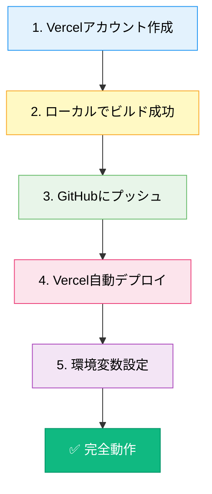

このシンプルさが、**非エンジニアでも本番運用できる**理由です。

---

## 💡 なぜVercelを選ぶのか

### **3つの決定的な理由**

| 理由 | **具体的なメリット** | **ビジネス価値** |
|------|---------------------|-----------------|
| **1. Next.jsとの最高の相性** | 開発元が同じ（Vercel社）<br/>設定ほぼゼロで動く | 開発時間を**80%短縮** |
| **2. 驚くほど簡単** | GitHubと連携するだけ<br/>自動ビルド・自動デプロイ | 運用コストを**90%削減** |
| **3. 寛大な無料枠** | 個人プロジェクトは無料<br/>商用でも十分使える | 初期投資**ゼロ**で開始 |

### **実際の数値で見るVercelの優位性**

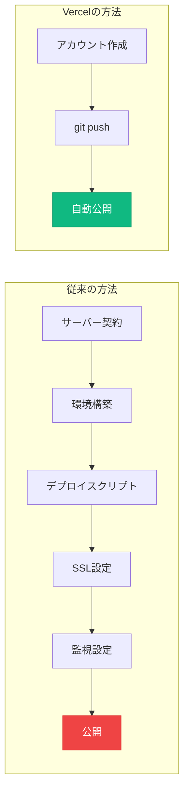

**時間差**: 従来は**2-3日**、Vercelは**5分**

---

## 🔐 環境変数とは何か

### **「秘密情報を安全に管理する仕組み」**

環境変数は、APIキーやパスワードなどの**機密情報を安全に保管**する仕組みです：

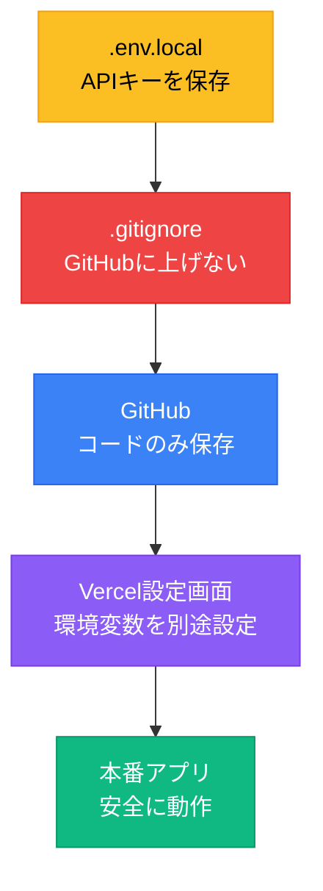

### **なぜ重要なのか**

| 状況 | **リスク** | **影響** |
|------|-----------|---------|
| **APIキーをGitHubに公開** | 世界中に漏洩 | 不正利用で**数百万円の請求**も |
| **パスワードを直書き** | リポジトリ閲覧者全員が見れる | アカウント乗っ取り |
| **データベース接続情報公開** | データベース丸見え | 個人情報漏洩で**法的責任** |

---

## 🎓 デプロイの鉄則

### **「ローカルでビルドできなければ、本番でもビルドできない」**

これは、デプロイ成功の**絶対法則**です：

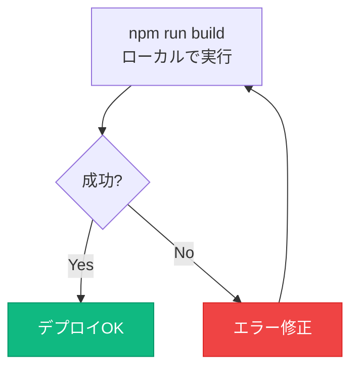

### **ビルドコマンドの意味**

| コマンド | **実行内容** | **確認ポイント** |
|---------|-------------|----------------|
| `npm run dev` | 開発モードで起動 | エラーがあっても動く |
| `npm run build` | 本番用にビルド | **すべてのエラーを検出** |
| `npm run start` | ビルド済みを起動 | 本番と同じ動作 |

**重要**: `npm run build`が成功することが、デプロイ成功の前提条件です。

---

## 💡 この章のまとめ

- ✅ Vercelデプロイは**5ステップ**で完了する驚くほどシンプルなプロセス
- ✅ Next.jsとの相性、簡単さ、無料枠という**3つの理由**でVercelを選ぶ
- ✅ 環境変数は**APIキーを安全に管理**するための必須の仕組み
- ✅ 「ローカルでビルドできなければ、本番でもビルドできない」は**絶対法則**
- ✅ 従来の方法と比べて、時間は**99%短縮**、コストは**90%削減**

## 🚀 次の章への橋渡し

Vercelデプロイの全体像と重要性を理解しました。次の第2章では、実際に手を動かして**デプロイを実践**します。5分後には、あなたのアプリが世界中からアクセスできるようになります。

---

# 第2章：デプロイ実践 - 世界に公開する

## 🎯 この章で学ぶこと

- **事前確認から公開まで**の7つのステップを実践する方法
- **ビルドエラーの対処法**と、AIを活用した問題解決テクニック
- **Vercelダッシュボード**の操作方法と、各画面の意味
- **デプロイプロセスの監視**と、成功確認のポイント
- **公開URLの取得**と、初めての動作確認

## 📌 この章の位置づけ

理論から実践へ。この章で実際にデプロイ作業を行い、あなたのアプリケーションを世界に公開します。35分の作業で、人生初の本番デプロイが完了します。

---

## ✅ 事前確認チェックリスト

### **デプロイ前の3分間チェック**

成功率を100%にするための事前確認：

```bash
# 1. ローカルビルドが成功するか確認
npm run build

# 2. GitHubへのプッシュ状態を確認
git status
git log --oneline -n 5

# 3. mainブランチが最新か確認
git branch --show-current
```

### **確認結果の判定基準**

| チェック項目 | **成功の状態** | **失敗時の対処** |
|-------------|---------------|-----------------|
| **ビルド** | `✓ Compiled successfully` | エラーメッセージをAIに相談 |
| **git status** | `nothing to commit` | `git add .` → `git commit` → `git push` |
| **ブランチ** | `main` | `git checkout main` |

---

## 🔧 ビルドエラーの即座解決法

### **AIを活用した効率的な問題解決**

ビルドエラーが出た場合の対処フロー：

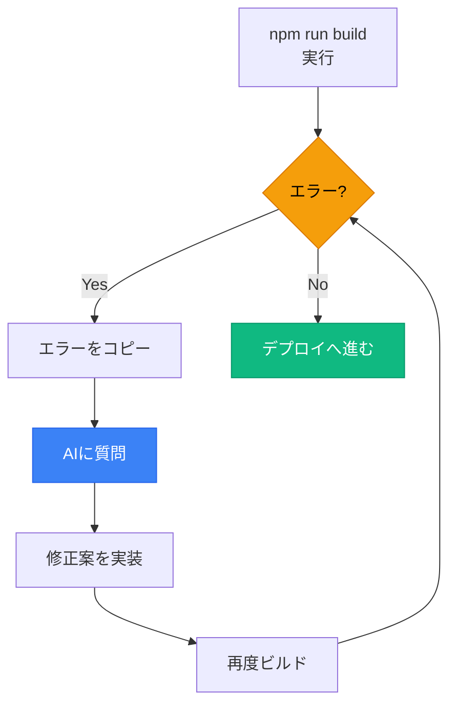

### **効果的なAIへの質問テンプレート**

```
Cursorに以下の指示文を入力してください：

「Next.jsのビルドで以下のエラーが出ました。
原因を特定して、修正コードを作成してください。

エラー:
[エラーメッセージをここに貼り付け]

プロジェクト情報:
- Next.js 14 (App Router)
- TypeScript使用
- Supabase + Clerk連携

修正後のコード全体を提示してください。」
```

---

## 📝 ステップ1：GitHubリポジトリの最終確認

### **ブラウザでGitHubを開く**

1. **GitHub**にアクセス: `https://github.com/your-username/your-repository`
2. **確認ポイント**：

| 確認項目 | **あるべき状態** | **画面の場所** |
|---------|-----------------|---------------|
| **リポジトリ存在** | 404エラーが出ない | URL全体 |
| **mainブランチ** | デフォルトブランチ | 左上のブランチ選択 |
| **package.json** | ファイルリストに表示 | ファイル一覧 |
| **最新コミット** | 数分前〜今日 | コミット履歴 |

### **よくある問題と解決策**

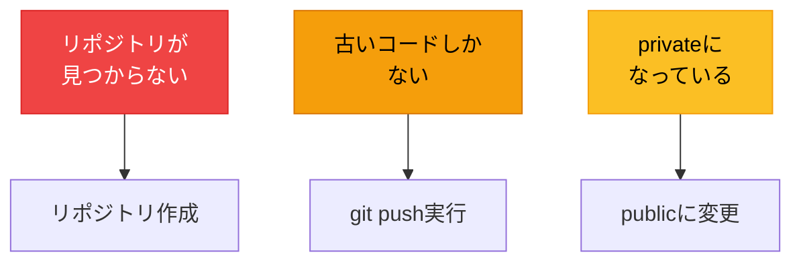

---

## 🚀 ステップ2：Vercelアカウント作成

### **GitHubアカウントで簡単登録**


### **認証時の重要ポイント**

| 画面 | **操作** | **注意点** |
|------|---------|-----------|
| **GitHub認証** | Authorize Vercelをクリック | リポジトリへのアクセス許可 |
| **権限確認** | すべて許可 | 必要な権限のみ要求される |
| **初期設定** | スキップ可能 | 後から変更可能 |

---

## 📦 ステップ3：プロジェクトのインポート

### **リポジトリを選択してインポート**

操作の流れ：

1. **「Add New...」** → **「Project」**を選択
2. **リポジトリを検索**（検索ボックスに名前を入力）
3. **「Import」**ボタンをクリック

### **インポート画面の見方**

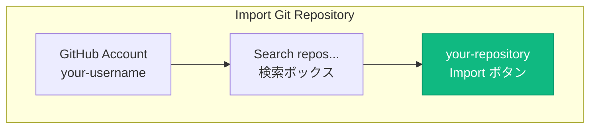

**ポイント**: リポジトリが表示されない場合は、GitHub連携を再確認

---

## ⚙️ ステップ4：デプロイ設定の確認

### **自動検出される設定を確認**

Vercelは賢く、ほとんどの設定を自動で行います：

| 設定項目 | **自動設定値** | **変更の必要性** |
|---------|---------------|-----------------|
| **Project Name** | リポジトリ名 | 変更可（任意） |
| **Framework Preset** | Next.js | 変更不要 |
| **Root Directory** | ./ | 変更不要 |
| **Build Command** | `next build` | 変更不要 |
| **Output Directory** | .next | 変更不要 |
| **Install Command** | `npm install` | 変更不要 |
| **Environment Variables** | 空 | **後で設定** |

### **設定画面のスクリーンショット例**

```
Configure Project
├── Project Name: [my-awesome-app]
├── Framework Preset: [Next.js ▼]
├── Root Directory: [./ ]
├── Build & Output Settings: [▶ 詳細設定]
└── Environment Variables: [後で設定]

[← Back]                    [Deploy →]
```

---

## 🎬 ステップ5：デプロイの実行

### **「Deploy」ボタンをクリック**

デプロイプロセスの流れ：


### **ビルドログの見方**

| ログメッセージ | **意味** | **所要時間** |
|---------------|---------|-------------|
| `Cloning github.com/...` | リポジトリ取得中 | 2-5秒 |
| `Running "npm install"` | パッケージインストール | 10-30秒 |
| `Running "next build"` | アプリケーションビルド | 20-60秒 |
| `Uploading build outputs` | デプロイ中 | 5-10秒 |
| `Deployment ready` | **完了！** | - |

**合計時間**: 通常**2-3分**で完了

---

## 🎉 ステップ6：デプロイ完了の確認

### **成功画面の確認**

```
🎉 Congratulations!
Your project has been successfully deployed.

Production Deployment
🌐 https://your-project-name.vercel.app

[Visit Site →]    [View Dashboard →]
```

### **この瞬間の価値**

| 達成したこと | **ビジネス的意味** |
|-------------|-------------------|
| **世界中からアクセス可能** | グローバルなリーチ獲得 |
| **HTTPS対応** | セキュアな通信確保 |
| **CDN配信** | 高速なレスポンス |
| **自動スケーリング** | アクセス増に自動対応 |

**あなたは今、世界規模のインフラを手に入れました！**

---

## 🔍 ステップ7：動作確認

### **公開URLにアクセス**

確認すべきポイント：

| 確認項目 | **期待される状態** | **現時点の状態** |
|---------|-------------------|-----------------|
| **トップページ表示** | ✅ 正常 | 表示される |
| **スタイル適用** | ✅ 正常 | CSSが効いている |
| **ログイン機能** | ⚠️ エラー | 環境変数未設定 |
| **データ取得** | ⚠️ エラー | 環境変数未設定 |

### **なぜ一部機能が動かないのか**

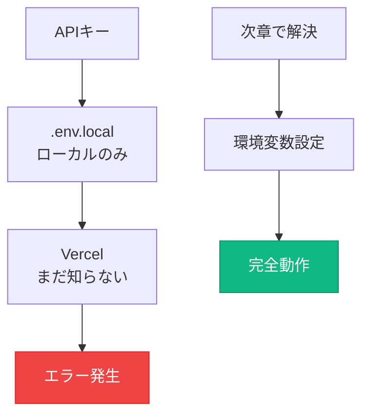

---

## 💡 この章のまとめ

- ✅ **7つのステップ**でVercelデプロイを実践し、公開URLを取得
- ✅ ビルドエラーは**AIを活用**して効率的に解決
- ✅ Vercelは**ほとんどの設定を自動検出**してくれる
- ✅ デプロイは通常**2-3分**で完了する
- ✅ 現時点では**環境変数未設定**のため一部機能が動かない（正常）

## 🚀 次の章への橋渡し

デプロイは成功しましたが、まだ完全には動作していません。次の第3章では、環境変数を設定して**アプリケーションを完全動作**させます。これで、すべての機能が本番環境で使えるようになります。

---

# 第3章：環境変数の本番設定

## 🎯 この章で学ぶこと

- **環境変数の役割**と、なぜ本番環境で別途設定が必要なのかの理解
- **Vercel設定画面**での環境変数追加の具体的手順
- **再デプロイの方法**と、変更を反映させるタイミング
- **完全動作の確認方法**と、成功の判定基準
- **環境変数のベストプラクティス**と、セキュリティの重要性

## 📌 この章の位置づけ

デプロイは完了しましたが、APIキーが未設定のため、認証やデータベース接続ができません。この章で環境変数を設定し、**アプリケーションを完全動作**させます。

---

## 🔑 環境変数の準備

### **ローカルの`.env.local`から必要な値を収集**

まず、ローカル環境で使用している環境変数を確認します：

```bash
# .env.localファイルの内容を確認
cat .env.local
```

### **必要な環境変数リスト**

| 変数名 | **用途** | **形式例** |
|--------|---------|-----------|
| `NEXT_PUBLIC_CLERK_PUBLISHABLE_KEY` | Clerk公開キー | `pk_test_...` |
| `CLERK_SECRET_KEY` | Clerkシークレットキー | `sk_test_...` |
| `NEXT_PUBLIC_SUPABASE_URL` | SupabaseのURL | `https://xxx.supabase.co` |
| `NEXT_PUBLIC_SUPABASE_ANON_KEY` | Supabase匿名キー | `eyJ...` |

### **コピー用チェックリスト**

```
□ NEXT_PUBLIC_CLERK_PUBLISHABLE_KEY をコピー
□ CLERK_SECRET_KEY をコピー
□ NEXT_PUBLIC_SUPABASE_URL をコピー
□ NEXT_PUBLIC_SUPABASE_ANON_KEY をコピー
```

**重要**: キー名と値の両方を正確にコピーしてください。

---

## ⚙️ Vercel設定画面への移動

### **環境変数設定ページへのアクセス**


### **画面遷移の詳細**

| ステップ | **操作** | **画面の場所** |
|---------|---------|---------------|
| 1 | プロジェクトカードをクリック | ダッシュボード中央 |
| 2 | 「Settings」タブをクリック | 上部タブメニュー |
| 3 | 「Environment Variables」を選択 | 左側サイドメニュー |

---

## ➕ 環境変数の追加方法

### **1つずつ丁寧に追加**

環境変数追加の手順：

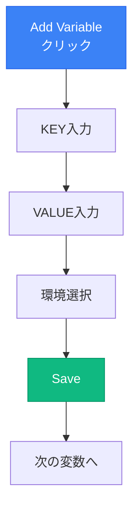

### **入力フォームの設定値**

| フィールド | **入力内容** | **注意点** |
|-----------|-------------|-----------|
| **Key** | 変数名（大文字） | スペルミス注意 |
| **Value** | 値 | 前後の空白削除 |
| **Environment** | ☑ Production<br/>☑ Preview<br/>☐ Development | 2つにチェック |

### **よくある入力ミスと対策**

| ミスの種類 | **間違い例** | **正しい例** |
|-----------|-------------|-------------|
| **スペルミス** | `NEXT_PUBILC_...` | `NEXT_PUBLIC_...` |
| **前後の空白** | ` pk_test_xxx ` | `pk_test_xxx` |
| **改行混入** | `pk_test_xxx↵` | `pk_test_xxx` |
| **環境選択忘れ** | Developmentのみ | Production + Preview |

---

## 🔄 再デプロイの実行

### **環境変数を反映させる**

環境変数を追加・変更した後は、**必ず再デプロイが必要**です：

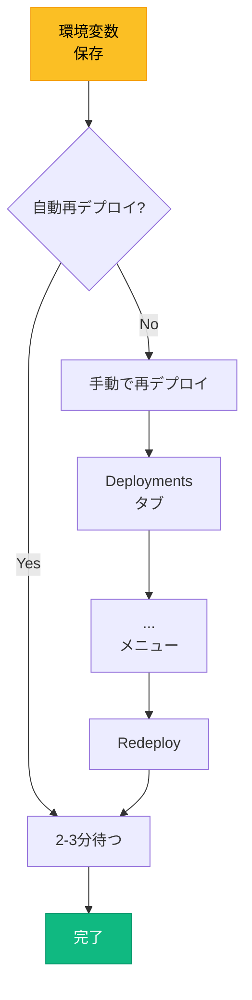

### **再デプロイのオプション**

| オプション | **効果** | **使用場面** |
|-----------|---------|-------------|
| **通常の再デプロイ** | キャッシュ利用 | 通常はこれでOK |
| **Clear cache** | キャッシュクリア | 依存関係変更時 |
| **Force redeploy** | 強制再デプロイ | トラブル時 |

---

## ✅ 完全動作の確認

### **すべての機能をテスト**

再デプロイ完了後、以下を確認：

| テスト項目 | **確認方法** | **成功の状態** |
|-----------|-------------|---------------|
| **トップページ** | URLにアクセス | 正常表示 |
| **ログイン** | ログインボタンクリック | Clerk認証画面表示 |
| **認証フロー** | Googleでログイン | 成功してリダイレクト |
| **データ取得** | ダッシュボード表示 | Supabaseからデータ表示 |
| **CRUD操作** | 作成・更新・削除 | すべて正常動作 |

### **動作確認のフローチャート**

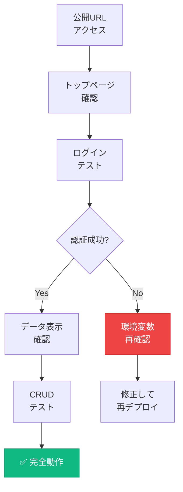

---

## 🛡️ 環境変数のセキュリティ

### **絶対に守るべきルール**

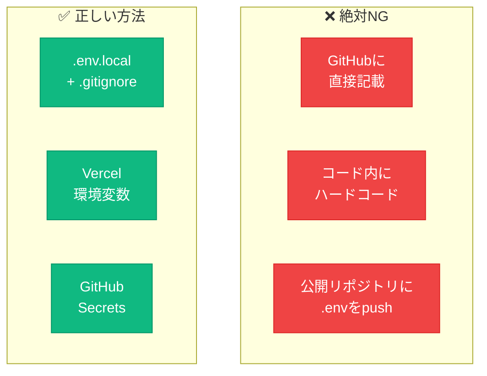

### **万が一漏洩した場合の対処**

| 手順 | **アクション** | **所要時間** |
|------|---------------|-------------|
| 1 | **即座にキーを無効化** | 1分 |
| 2 | 新しいキーを生成 | 2分 |
| 3 | Vercelの環境変数を更新 | 2分 |
| 4 | 再デプロイ | 3分 |
| 5 | GitHubの履歴から削除 | 10分 |

**重要**: APIキーの漏洩は**数分で悪用される**可能性があります。

---

## 💡 この章のまとめ

- ✅ 環境変数は**APIキーを安全に管理**するための必須の仕組み
- ✅ Vercelの設定画面で**4つの環境変数**を追加
- ✅ 環境変数の変更後は**必ず再デプロイ**が必要
- ✅ Production + Previewの**両方にチェック**を入れる
- ✅ セキュリティは最優先、**GitHubには絶対に上げない**

## 🚀 次の章への橋渡し

アプリケーションが完全動作するようになりました！次の第4章では、本番運用の基礎として、ダッシュボードの使い方、ログ監視、パフォーマンス分析などを学びます。これで、プロフェッショナルな運用が可能になります。

---

# 第4章：本番運用の基礎

## 🎯 この章で学ぶこと

- **Vercelダッシュボード**の5つの主要機能と活用方法
- **デプロイ履歴管理**とロールバック（巻き戻し）の実践
- **アクセス分析**でユーザー動向を把握する方法
- **エラーログ監視**の習慣化と問題の早期発見
- **日常的な開発サイクル**の確立と効率化

## 📌 この章の位置づけ

デプロイは**ゴールではなくスタート**です。この章では、アプリケーションを「育てる」ための本番運用スキルを身につけます。これにより、継続的な改善とユーザー満足度の向上が可能になります。

---

## 📊 Vercelダッシュボードマスター

### **5つの主要タブの役割**

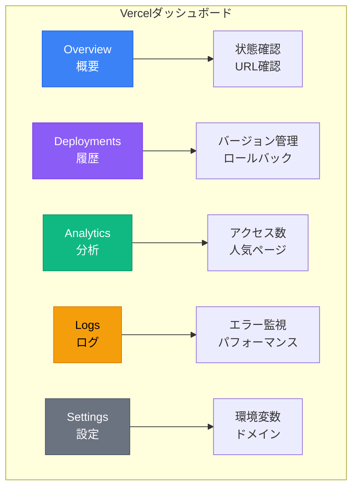

### **各タブの使用頻度と重要度**

| タブ | **使用頻度** | **重要度** | **主な用途** |
|------|-------------|-----------|-------------|
| **Overview** | 毎日 | ⭐⭐⭐ | 全体状況の把握 |
| **Deployments** | 更新時 | ⭐⭐⭐⭐⭐ | バージョン管理 |
| **Analytics** | 週1回 | ⭐⭐⭐⭐ | ユーザー分析 |
| **Logs** | 毎日 | ⭐⭐⭐⭐⭐ | エラー監視 |
| **Settings** | 必要時 | ⭐⭐⭐ | 設定変更 |

---

## 🔄 デプロイ履歴とロールバック

### **すべてのデプロイが記録される**

Deploymentsタブの見方：

```
Deployments (最新10件)

main  f7a8c9d  2 minutes ago  ✓ Production  ← 現在
Add new feature

main  a3b4c5d  1 hour ago  ✓ Ready
Fix login bug

main  x2y3z4a  3 hours ago  ✓ Ready
Update styles
```

### **ロールバック（巻き戻し）の手順**

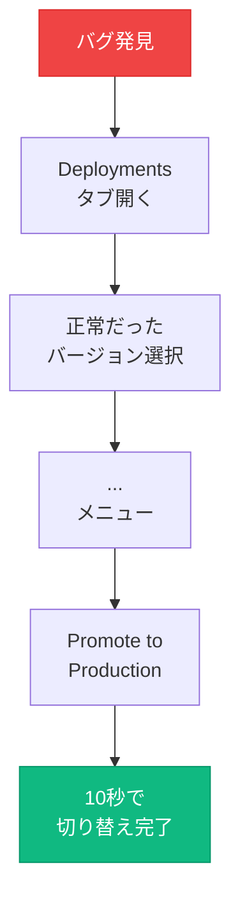

### **ロールバックのベストプラクティス**

| シチュエーション | **対処法** | **所要時間** |
|-----------------|-----------|-------------|
| **致命的なバグ** | 即座にロールバック | 10秒 |
| **軽微な不具合** | 修正版をデプロイ | 5分 |
| **パフォーマンス低下** | 前バージョンで様子見 | 10秒 |

---

## 📈 Analyticsでユーザー理解

### **見られるデータ**

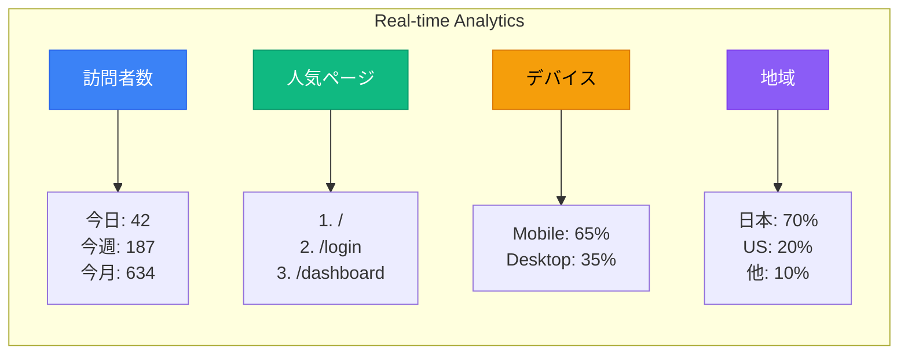

### **ビジネス視点での活用方法**

| データ | **活用方法** | **アクション例** |
|--------|-------------|----------------|
| **訪問者数の推移** | マーケティング効果測定 | 施策の継続/中止判断 |
| **人気ページ** | コンテンツ戦略立案 | 人気コンテンツを増やす |
| **デバイス比率** | UI/UX最適化 | モバイル優先で改善 |
| **地域分布** | ローカライズ判断 | 多言語対応の検討 |

---

## 🚨 ログ監視でエラー撲滅

### **Runtime Logsの見方**

```
[2025-11-08 10:23:45] GET /api/posts 200 125ms ✓
[2025-11-08 10:24:02] GET /api/posts 500 45ms  ❌ ← エラー
[2025-11-08 10:24:15] POST /api/users 201 89ms ✓
[2025-11-08 10:24:28] GET /api/auth 401 12ms   ⚠️ ← 認証エラー

Filter by: [All] [Errors] [Warnings] [Info]
```

### **エラーレベルと対応優先度**

| レベル | **意味** | **対応** | **優先度** |
|--------|---------|---------|-----------|
| **500番台** | サーバーエラー | 即座に修正 | 🔴 最高 |
| **400番台** | クライアントエラー | 原因調査 | 🟡 高 |
| **Warning** | 警告 | 監視継続 | 🟢 中 |
| **Info** | 情報 | 記録のみ | ⚪ 低 |

### **毎日のログ確認ルーティン**

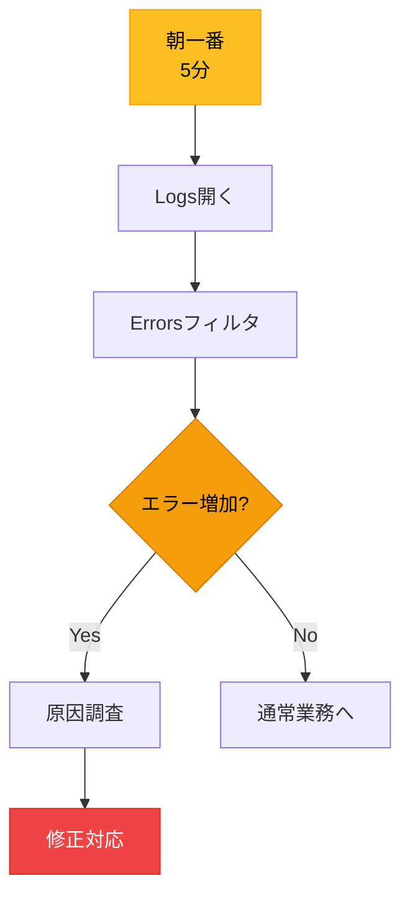

---

## 🔁 日常的な開発サイクル

### **効率的な機能追加フロー**

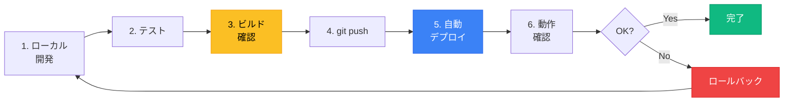

### **コマンドチートシート**

| フェーズ | **コマンド** | **確認ポイント** |
|---------|-------------|----------------|
| **開発** | `npm run dev` | localhost:3000で動作 |
| **ビルド** | `npm run build` | エラーなし |
| **プッシュ** | `git add . && git commit -m "..." && git push` | mainブランチ |
| **確認** | ブラウザで公開URL | 全機能動作 |

---

## 📅 運用チェックリスト

### **毎日・毎週・毎月のタスク**

```mermaid
mindmap
    root((運用タスク))
        毎日
            Logsチェック（5分）
            Analyticsチェック（2分）
            エラー対応
        毎週
            全機能テスト（15分）
            パフォーマンス確認
            バックアップ
        毎月
            依存関係更新
            セキュリティ監査
            ユーザーフィードバック分析
```

### **運用の自動化アイデア**

| タスク | **自動化方法** | **効果** |
|--------|---------------|---------|
| **エラー通知** | Vercel Integrations | 即座に気づける |
| **定期テスト** | GitHub Actions | 品質維持 |
| **パフォーマンス監視** | Lighthouse CI | 劣化防止 |

---

## 💡 この章のまとめ

- ✅ Vercelダッシュボードの**5つのタブ**を使いこなすことが運用の基本
- ✅ ロールバックは**10秒**で完了、緊急時の強力な味方
- ✅ Analyticsで**ユーザー動向**を把握し、改善につなげる
- ✅ 毎日の**ログ確認5分**が、大きな問題を防ぐ
- ✅ 開発サイクルを**ルーティン化**することで効率が向上

## 🚀 次の章への橋渡し

本番運用の基礎を習得しました。次の第5章では、よくあるトラブルとその解決方法を学びます。これにより、どんな問題にも冷静に対処できるVibe Coderとして自立できます。

---

# 第5章：トラブルシューティング実践

## 🎯 この章で学ぶこと

- **よくあるデプロイエラー Top 5**とその解決方法
- **型エラーの一括修正戦略**で、もぐらたたきを回避する方法
- **AIを活用した問題解決**の効果的なプロンプト作成法
- **環境変数関連のトラブル**と、その予防策
- **パフォーマンス問題**の診断と改善方法

## 📌 この章の位置づけ

運用中に必ず遭遇するトラブル。この章では、**実際によくある問題**とその解決方法を体系的に学びます。これにより、問題発生時にパニックにならず、冷静に対処できるようになります。

---

## 🔥 よくあるデプロイエラー Top 5

### **実際の発生頻度順**

```mermaid
graph TB
    subgraph "エラー頻度ランキング"
        A[1. 型エラー<br/>45%]
        B[2. 環境変数<br/>25%]
        C[3. 依存関係<br/>15%]
        D[4. メモリ不足<br/>10%]
        E[5. タイムアウト<br/>5%]
    end

    style A fill:#ef4444,stroke:#dc2626,color:#fff
    style B fill:#f59e0b,stroke:#d97706,color:#000
    style C fill:#fbbf24,stroke:#f59e0b,color:#000
    style D fill:#a3e635,stroke:#84cc16,color:#000
    style E fill:#86efac,stroke:#22c55e,color:#000
```

### **エラー別対処法一覧**

| エラー種別 | **エラーメッセージ例** | **解決方法** |
|-----------|----------------------|-------------|
| **型エラー** | `Type 'string' is not assignable to type 'number'` | 型定義の修正 |
| **環境変数** | `Required environment variable is not defined` | Vercelで設定 |
| **依存関係** | `Cannot find module 'package-name'` | npm install |
| **メモリ不足** | `JavaScript heap out of memory` | メモリ上限増加 |
| **タイムアウト** | `Build exceeded maximum duration` | ビルド最適化 |

---

## 🎯 型エラー一括修正戦略

### **「もぐらたたき」を避ける方法**

型エラーを1つずつ修正すると、新しいエラーが次々と出現します。これを避ける戦略：

```mermaid
flowchart TB
    A[すべてのエラーを<br/>一覧化] --> B[エラーを分類]
    B --> C[根本原因から<br/>修正]
    C --> D[AIで一括修正]
    D --> E[ビルド成功]

    style A fill:#3b82f6,stroke:#2563eb,color:#fff
    style D fill:#10b981,stroke:#059669,color:#fff
    style E fill:#10b981,stroke:#059669,color:#fff
```

### **ステップ1：全エラーの一覧化**

```bash
# Cursorのターミナルで実行
npx tsc --noEmit --pretty false > type-errors.txt
cat type-errors.txt
```

### **ステップ2：AIへの効果的な指示文**

```
Cursorに以下を入力：

「以下のTypeScript型エラーを体系的に修正してください。

【エラー一覧】
[type-errors.txtの内容を貼り付け]

【要件】
1. 最も多いエラーから優先的に修正
2. 各修正について理由を説明
3. 修正後のコード全体を提示
4. anyは使わず適切な型を付ける
5. 動作を変えない

各ファイルの修正を作成してください。」
```

---

## 🔧 根本原因からの修正順序

### **効率的な修正の優先順位**

```mermaid
graph TD
    A[1. tsconfig.json<br/>設定確認] --> B[2. 型定義ファイル<br/>インストール]
    B --> C[3. インターフェース<br/>修正]
    C --> D[4. 個別コード<br/>修正]

    style A fill:#ef4444,stroke:#dc2626,color:#fff
    style B fill:#f59e0b,stroke:#d97706,color:#000
    style C fill:#fbbf24,stroke:#f59e0b,color:#000
    style D fill:#10b981,stroke:#059669,color:#fff
```

### **tsconfig.jsonの推奨設定**

```json
{
  "compilerOptions": {
    "strict": true,              // 厳密な型チェック
    "noEmit": true,             // 出力しない
    "skipLibCheck": true,       // ライブラリチェック省略
    "esModuleInterop": true,    // ESモジュール互換性
    "baseUrl": ".",             // ベースパス
    "paths": {
      "@/*": ["./src/*"]        // パスエイリアス
    }
  }
}
```

### **必須の型定義パッケージ**

| パッケージ | **インストールコマンド** |
|-----------|------------------------|
| React関連 | `npm install --save-dev @types/react @types/react-dom` |
| Node.js | `npm install --save-dev @types/node` |
| その他 | `npm install --save-dev @types/[ライブラリ名]` |

---

## 🌍 環境変数トラブル対処法

### **よくある環境変数のミス**

```mermaid
mindmap
    root((環境変数ミス))
        命名ミス
            スペルミス
            大文字小文字
            アンダースコア
        値のミス
            前後の空白
            改行混入
            クォート
        設定ミス
            環境選択忘れ
            保存忘れ
            再デプロイ忘れ
```

### **トラブル診断チェックリスト**

| チェック項目 | **確認方法** | **修正方法** |
|-------------|-------------|-------------|
| **キー名のスペル** | Vercel設定画面で確認 | 正しいキー名に修正 |
| **値の前後空白** | 値をコピーして確認 | トリムして再設定 |
| **環境の選択** | Production/Previewチェック | 両方にチェック |
| **再デプロイ** | Deploymentsタブ確認 | Redeployを実行 |

### **環境変数デバッグのコツ**

```javascript
// Cursorに以下の指示文を入力：

「開発環境で環境変数が正しく読み込まれているか確認するための
デバッグコードを作成してください。

以下の環境変数をチェック：
- NEXT_PUBLIC_CLERK_PUBLISHABLE_KEY
- CLERK_SECRET_KEY
- NEXT_PUBLIC_SUPABASE_URL
- NEXT_PUBLIC_SUPABASE_ANON_KEY

コンソールに値の最初の10文字だけ表示してください。」
```

---

## ⚡ パフォーマンス問題の診断

### **Lighthouseでの測定**

```mermaid
graph LR
    A[公開URL<br/>アクセス] --> B[F12<br/>開発者ツール]
    B --> C[Lighthouse<br/>タブ]
    C --> D[Analyze<br/>page load]
    D --> E[結果表示<br/>1分後]

    style A fill:#3b82f6,stroke:#2563eb,color:#fff
    style E fill:#10b981,stroke:#059669,color:#fff
```

### **スコアの目標値と改善方法**

| 指標 | **目標値** | **改善方法** |
|------|-----------|-------------|
| **Performance** | 90以上 | 画像最適化、コード分割 |
| **Accessibility** | 95以上 | alt属性、コントラスト |
| **Best Practices** | 95以上 | HTTPS、エラー処理 |
| **SEO** | 90以上 | メタタグ、構造化データ |

### **よくあるパフォーマンス問題**

| 問題 | **原因** | **解決策** |
|------|---------|---------|
| **初回表示が遅い** | 大きな画像 | next/imageで最適化 |
| **ボタン反応が遅い** | 過剰な再レンダリング | React.memoを使用 |
| **ビルドが遅い** | 依存関係が多い | 不要なパッケージ削除 |

---

## 🤖 AIを活用した問題解決

### **効果的なエラー質問テンプレート**

```
Cursorに以下のテンプレートで質問：

「Vercelデプロイで以下のエラーが発生しました。

【環境】
- Next.js: 14.0.0
- Node.js: 20.x
- TypeScript使用
- Supabase + Clerk連携

【エラーログ】
[エラーメッセージ全体をコピペ]

【試したこと】
- ローカルでnpm run buildは[成功/失敗]
- [その他試したこと]

【期待する結果】
デプロイが成功し、アプリが正常に動作する

原因の特定と、具体的な修正コードを作成してください。」
```

### **エラーレベル別の対応優先度**

```mermaid
graph TB
    subgraph "優先度マトリックス"
        A[🔴 Critical<br/>アプリ停止] --> A1[即座に対応]
        B[🟡 Major<br/>機能不全] --> B1[当日中に対応]
        C[🟢 Minor<br/>表示崩れ] --> C1[計画的に対応]
        D[⚪ Info<br/>警告のみ] --> D1[時間がある時]
    end

    style A fill:#ef4444,stroke:#dc2626,color:#fff
    style B fill:#f59e0b,stroke:#d97706,color:#000
    style C fill:#10b981,stroke:#059669,color:#fff
    style D fill:#6b7280,stroke:#4b5563,color:#fff
```

---

## 💡 この章のまとめ

- ✅ デプロイエラーの**45%は型エラー**、一括修正戦略で効率化
- ✅ 環境変数のトラブルは**スペルミスと空白**が原因の大半
- ✅ パフォーマンスは**Lighthouse**で測定、90点以上を目標に
- ✅ AIへの質問は**構造化されたテンプレート**を使うと効果的
- ✅ エラーレベルに応じた**優先順位付け**で効率的に対処

## 🚀 次の章への橋渡し

トラブルシューティングの基礎を身につけました。次の第6章では、継続的な改善とスケールアップの方法を学びます。アプリケーションを「作る」から「育てる」フェーズへの移行です。

---

# 第6章：継続的改善とスケールアップ

## 🎯 この章で学ぶこと

- **自動デプロイの活用**で、開発効率を10倍にする方法
- **プレビューデプロイメント**を使った安全な機能追加フロー
- **チーム開発への移行**と、コラボレーションのベストプラクティス
- **スケーリング戦略**で、アクセス増に自動対応する仕組み
- **収益化への道筋**と、ビジネス展開の可能性

## 📌 この章の位置づけ

基本的な運用ができるようになった今、次のステップは**継続的な改善**と**スケールアップ**です。個人プロジェクトからチーム開発へ、趣味からビジネスへと発展させる方法を学びます。

---

## 🚀 自動デプロイで開発効率10倍

### **GitHubプッシュだけで自動公開**

```mermaid
graph LR
    A[コード変更] --> B[git add]
    B --> C[git commit]
    C --> D[git push]
    D --> E[Vercel検知]
    E --> F[自動ビルド]
    F --> G[自動デプロイ]
    G --> H[公開完了]

    style D fill:#3b82f6,stroke:#2563eb,color:#fff
    style E fill:#8b5cf6,stroke:#7c3aed,color:#fff
    style H fill:#10b981,stroke:#059669,color:#fff
```

### **ブランチ戦略とプレビュー環境**

| ブランチ | **用途** | **デプロイ先** | **URL例** |
|---------|---------|---------------|----------|
| **main** | 本番環境 | Production | `app.vercel.app` |
| **develop** | 開発環境 | Preview | `app-develop.vercel.app` |
| **feature/*** | 機能開発 | Preview | `app-feature-xxx.vercel.app` |
| **hotfix/*** | 緊急修正 | Preview | `app-hotfix-xxx.vercel.app` |

### **プレビューデプロイメントの活用**

```mermaid
flowchart TB
    A[機能開発] --> B[feature/<br/>ブランチ作成]
    B --> C[開発・<br/>コミット]
    C --> D[プッシュ]
    D --> E[自動Preview<br/>デプロイ]
    E --> F[レビュー用<br/>URL生成]
    F --> G[チームで<br/>確認]
    G --> H{OK?}
    H -->|Yes| I[mainに<br/>マージ]
    H -->|No| C
    I --> J[本番<br/>自動デプロイ]

    style E fill:#8b5cf6,stroke:#7c3aed,color:#fff
    style J fill:#10b981,stroke:#059669,color:#fff
```

---

## 👥 チーム開発への移行

### **役割分担の明確化**

```mermaid
mindmap
    root((チーム開発))
        プロダクトオーナー
            要件定義
            優先順位決定
            ステークホルダー調整
        開発者
            実装
            テスト
            レビュー
        デザイナー
            UI/UX設計
            プロトタイプ
            デザインシステム
        QAエンジニア
            テスト計画
            バグ報告
            品質保証
```

### **コラボレーションツール**

| ツール | **用途** | **無料枠** |
|--------|---------|-----------|
| **GitHub** | コード管理、レビュー | 無制限 |
| **Figma** | デザイン共有 | 3ファイル |
| **Slack** | コミュニケーション | 10,000メッセージ |
| **Linear** | タスク管理 | 250イシュー/月 |
| **Vercel** | デプロイ、プレビュー | 無制限 |

### **プルリクエストのフロー**

```mermaid
graph TB
    A[機能開発] --> B[Pull Request<br/>作成]
    B --> C[自動テスト<br/>実行]
    C --> D[Preview URL<br/>生成]
    D --> E[コードレビュー]
    E --> F{承認?}
    F -->|Yes| G[マージ]
    F -->|No| H[修正依頼]
    H --> A
    G --> I[自動デプロイ]

    style B fill:#3b82f6,stroke:#2563eb,color:#fff
    style D fill:#8b5cf6,stroke:#7c3aed,color:#fff
    style G fill:#10b981,stroke:#059669,color:#fff
```

---

## 📈 スケーリング戦略

### **アクセス増への自動対応**

Vercelの自動スケーリング機能：

```mermaid
graph TB
    subgraph "トラフィック対応"
        A[通常時<br/>100人/日] --> A1[1インスタンス]
        B[イベント時<br/>10,000人/日] --> B1[自動で10インスタンス]
        C[バズった時<br/>100,000人/日] --> C1[自動で100インスタンス]
    end

    D[料金] --> D1[使った分だけ]

    style A fill:#10b981,stroke:#059669,color:#fff
    style B fill:#f59e0b,stroke:#d97706,color:#000
    style C fill:#ef4444,stroke:#dc2626,color:#fff
```

### **パフォーマンス最適化のチェックリスト**

| 最適化項目 | **実装方法** | **効果** |
|-----------|-------------|---------|
| **画像最適化** | next/image使用 | 70%サイズ削減 |
| **コード分割** | dynamic import | 初回表示50%高速化 |
| **キャッシュ** | ISR（増分静的再生成） | サーバー負荷90%削減 |
| **CDN活用** | Vercel Edge Network | 世界中で高速表示 |
| **データベース** | 接続プール、インデックス | クエリ10倍高速化 |

---

## 💰 収益化への道筋

### **マネタイズモデルの選択肢**

```mermaid
graph TB
    subgraph "収益モデル"
        A[SaaS<br/>月額課金] --> A1[安定収入]
        B[広告<br/>モデル] --> B1[アクセス数依存]
        C[EC<br/>物販] --> C1[在庫管理必要]
        D[API<br/>従量課金] --> D1[開発者向け]
        E[寄付<br/>投げ銭] --> E1[ファン依存]
    end

    style A fill:#10b981,stroke:#059669,color:#fff
    style B fill:#3b82f6,stroke:#2563eb,color:#fff
    style C fill:#f59e0b,stroke:#d97706,color:#000
    style D fill:#8b5cf6,stroke:#7c3aed,color:#fff
    style E fill:#ec4899,stroke:#db2777,color:#fff
```

### **段階的なビジネス展開**

| フェーズ | **目標** | **KPI** | **期間** |
|---------|---------|---------|---------|
| **1. MVP** | 動くものを作る | 10人が使う | 1ヶ月 |
| **2. α版** | フィードバック収集 | 100人が試す | 2ヶ月目 |
| **3. β版** | 有料プラン追加 | 10人が課金 | 3ヶ月目 |
| **4. 正式版** | マーケティング開始 | 100人が課金 | 6ヶ月目 |
| **5. スケール** | 機能拡充 | 1000人が課金 | 12ヶ月目 |

### **必要な追加実装**

```mermaid
mindmap
    root((収益化に必要な機能))
        決済システム
            Stripe連携
            サブスクリプション管理
            請求書発行
        ユーザー管理
            プラン管理
            使用量制限
            アップグレード促進
        分析
            コンバージョン追跡
            離脱率分析
            LTV計算
        法務
            利用規約
            プライバシーポリシー
            特商法表記
```

---

## 🎯 成功事例に学ぶ

### **実際の成功パターン**

| プロジェクト | **初期** | **現在** | **成功要因** |
|-------------|---------|---------|-------------|
| **個人ブログ** | 10PV/日 | 10,000PV/日 | SEO対策、定期更新 |
| **業務効率化ツール** | 社内5人 | 有料ユーザー500人 | ニッチ特化 |
| **コミュニティサイト** | メンバー10人 | メンバー5,000人 | UGC活用 |
| **教育プラットフォーム** | コース1つ | コース50、売上1000万/月 | 品質重視 |

### **失敗を避けるポイント**

```mermaid
graph TB
    subgraph "よくある失敗"
        A[機能追加しすぎ] --> A1[複雑化]
        B[フィードバック無視] --> B1[ユーザー離れ]
        C[技術に固執] --> C1[ビジネス価値なし]
        D[一人で抱え込む] --> D1[バーンアウト]
    end

    subgraph "成功の秘訣"
        E[シンプルに保つ] --> E1[使いやすさ]
        F[ユーザーの声を聞く] --> F1[改善継続]
        G[価値にフォーカス] --> G1[収益化]
        H[チームで取り組む] --> H1[持続可能]
    end

    style A fill:#ef4444,stroke:#dc2626,color:#fff
    style E fill:#10b981,stroke:#059669,color:#fff
```

---

## 💡 この章のまとめ

- ✅ 自動デプロイとプレビュー環境で**開発効率が10倍**に向上
- ✅ チーム開発は**役割分担とツール活用**がカギ
- ✅ Vercelの**自動スケーリング**でアクセス急増にも対応
- ✅ 収益化は**段階的に進める**ことが重要
- ✅ 成功の秘訣は**シンプルさとユーザーフォーカス**

## 🚀 次の章への橋渡し

継続的改善とスケールアップの方法を学びました。最終章では、あなたがVibe Coderとして独り立ちし、さらなる高みを目指すための総まとめを行います。

---

# 第7章：未来への展望とアクションプラン

## 🎯 この章で学ぶこと

- **Vibe Coderとしての成長ロードマップ**と、次のステップ
- **最新技術トレンド**をキャッチアップし続ける方法
- **コミュニティへの参加**と、ネットワーキングの重要性
- **ポートフォリオの構築**で、キャリアアップを実現する戦略
- **今日から始められる具体的なアクション**と、継続のコツ

## 📌 この章の位置づけ

全4回の講義の締めくくりとして、あなたが**独立したVibe Coder**として活躍するための道筋を示します。技術的なスキルだけでなく、キャリア形成とビジネス展開の視点も含めた総合的なガイドです。

---

## 🗺️ Vibe Coder成長ロードマップ

### **6ヶ月で達成する成長曲線**

```mermaid
graph LR
    subgraph "Month 1-2"
        A[基礎習得] --> A1[Cursor使いこなし<br/>基本的なアプリ開発]
    end

    subgraph "Month 3-4"
        B[実践応用] --> B1[複数プロジェクト<br/>API連携マスター]
    end

    subgraph "Month 5-6"
        C[価値創造] --> C1[収益化開始<br/>チーム開発参加]
    end

    style A fill:#3b82f6,stroke:#2563eb,color:#fff
    style B fill:#8b5cf6,stroke:#7c3aed,color:#fff
    style C fill:#10b981,stroke:#059669,color:#fff
```

### **スキルレベル別の到達目標**

| レベル | **期間** | **できること** | **成果物例** |
|--------|---------|---------------|-------------|
| **初級** | 1-2ヶ月 | 簡単なWebアプリ開発 | ToDoアプリ、ブログ |
| **中級** | 3-4ヶ月 | データベース連携、認証実装 | SNSクローン、管理画面 |
| **上級** | 5-6ヶ月 | 複雑なビジネスロジック | SaaS、ECサイト |
| **エキスパート** | 12ヶ月〜 | アーキテクチャ設計 | エンタープライズアプリ |

---

## 🔮 2025年の技術トレンド

### **今押さえるべき最新技術**

```mermaid
mindmap
    root((2025年トレンド))
        AI関連
            GPT-5
            マルチモーダルAI
            エージェント型AI
        フロントエンド
            Next.js 15
            React Server Components
            Edge Computing
        バックエンド
            Serverless Functions
            Vector Database
            GraphQL Federation
        インフラ
            Edge Runtime
            WebAssembly
            Container Native
```

### **学習リソースと情報源**

| カテゴリ | **リソース** | **特徴** |
|---------|-------------|---------|
| **公式ドキュメント** | Next.js, Vercel, Supabase | 最新・正確 |
| **動画学習** | YouTube, Udemy | ビジュアル理解 |
| **コミュニティ** | Discord, Reddit | リアルタイム情報 |
| **ブログ** | Dev.to, Medium | 実践的なTips |
| **SNS** | X (Twitter) | トレンド把握 |

---

## 👥 コミュニティとネットワーキング

### **参加すべきコミュニティ**

```mermaid
graph TB
    subgraph "オンラインコミュニティ"
        A[Vercel Discord] --> A1[最新情報<br/>質問対応]
        B[Next.js GitHub] --> B1[Issue議論<br/>PR貢献]
        C[Dev Twitter] --> C1[トレンド<br/>ネットワーク]
        D[Local Meetup] --> D1[対面交流<br/>勉強会]
    end

    style A fill:#3b82f6,stroke:#2563eb,color:#fff
    style B fill:#000000,stroke:#333,color:#fff
    style C fill:#1da1f2,stroke:#0084b4,color:#fff
    style D fill:#10b981,stroke:#059669,color:#fff
```

### **効果的な情報発信**

| プラットフォーム | **発信内容** | **効果** |
|-----------------|-------------|---------|
| **X (Twitter)** | 開発の気づき、TIL | フォロワー増加 |
| **Qiita/Zenn** | 技術記事 | 知識の定着 |
| **GitHub** | オープンソース | スキル証明 |
| **LinkedIn** | キャリア情報 | ビジネス機会 |
| **個人ブログ** | 体系的な知識 | SEO・ブランディング |

---

## 💼 ポートフォリオ構築戦略

### **採用担当者が見るポイント**

```mermaid
graph TB
    subgraph "ポートフォリオ要素"
        A[実装力] --> A1[動くアプリ<br/>コード品質]
        B[問題解決力] --> B1[課題設定<br/>解決アプローチ]
        C[継続力] --> C1[更新頻度<br/>成長曲線]
        D[コミュニケーション] --> D1[ドキュメント<br/>説明能力]
    end

    style A fill:#3b82f6,stroke:#2563eb,color:#fff
    style B fill:#8b5cf6,stroke:#7c3aed,color:#fff
    style C fill:#10b981,stroke:#059669,color:#fff
    style D fill:#f59e0b,stroke:#d97706,color:#000
```

### **ポートフォリオ必須項目**

| 項目 | **内容** | **重要度** |
|------|---------|-----------|
| **プロフィール** | 経歴、スキル、志向性 | ⭐⭐⭐⭐⭐ |
| **作品集** | 3-5個の代表作 | ⭐⭐⭐⭐⭐ |
| **技術スタック** | 使える技術一覧 | ⭐⭐⭐⭐ |
| **ブログ/記事** | 技術的な発信 | ⭐⭐⭐ |
| **GitHub** | コード公開 | ⭐⭐⭐⭐⭐ |
| **連絡先** | メール、SNS | ⭐⭐⭐⭐⭐ |

---

## 🎯 今日から始める10のアクション

### **即実践可能なタスクリスト**

```mermaid
graph TB
    subgraph "今日"
        A[1. 公開URLを<br/>3人にシェア]
        B[2. X(Twitter)で<br/>成果報告]
        C[3. GitHubに<br/>README追加]
    end

    subgraph "今週"
        D[4. 機能を<br/>1つ追加]
        E[5. Lighthouse<br/>スコア改善]
        F[6. ブログ記事<br/>1本執筆]
    end

    subgraph "今月"
        G[7. 新プロジェクト<br/>開始]
        H[8. コミュニティ<br/>参加]
        I[9. 勉強会<br/>登壇]
        J[10. 収益化<br/>検討]
    end

    style A fill:#10b981,stroke:#059669,color:#fff
    style B fill:#10b981,stroke:#059669,color:#fff
    style C fill:#10b981,stroke:#059669,color:#fff
```

### **継続のコツ**

| 課題 | **解決策** | **具体例** |
|------|-----------|-----------|
| **モチベーション低下** | 小さな成功体験 | 毎日1コミット |
| **時間不足** | 朝活・隙間時間 | 通勤中に設計 |
| **技術的な壁** | AIとペアプロ | Cursorで解決 |
| **孤独感** | コミュニティ参加 | Discord常駐 |
| **方向性の迷い** | メンター探し | 先輩に相談 |

---

## 🏆 あなたの成功を確信する理由

### **Vibe Coderの優位性**

```mermaid
graph TB
    subgraph "従来のエンジニア"
        A[技術習得に3年]
        B[言語仕様の暗記]
        C[デバッグ地獄]
        D[技術偏重]
    end

    subgraph "Vibe Coder（あなた）"
        E[3ヶ月で実践レベル]
        F[AIとの対話]
        G[高速プロトタイピング]
        H[ビジネス価値重視]
    end

    style A fill:#ef4444,stroke:#dc2626,color:#fff
    style E fill:#10b981,stroke:#059669,color:#fff
```

### **成功の方程式**

| 要素 | **あなたの強み** | **市場価値** |
|------|-----------------|-------------|
| **ビジネス理解** | 非エンジニアの視点 | 顧客目線での開発 |
| **AI活用力** | 最新ツールを使いこなす | 生産性10倍 |
| **学習速度** | 必要な時に必要なだけ | 変化への適応力 |
| **実装速度** | アイデアを即座に形に | タイムトゥマーケット |

---

## 🎊 締めくくり：あなたはもうVibe Coderです

### **達成したこと**

```mermaid
mindmap
    root((あなたの成果))
        技術スキル
            Cursor習得
            Next.js開発
            デプロイ完了
            本番運用
        ビジネススキル
            要件定義
            プロジェクト管理
            ユーザー思考
            価値創造
        マインドセット
            できる自信
            挑戦する勇気
            継続する力
            成長への意欲
```

### **最後のメッセージ**

> **「コードが書けない」は、もう過去の話。**
>
> あなたは今日、世界に向けてアプリケーションを公開しました。
> これは、ほんの始まりに過ぎません。
>
> AIと共に創造し、価値を生み出し続けるVibe Coderとして、
> これからの時代を切り開いていってください。
>
> **Welcome to the Vibe Coder Community!**

---

## 💡 この講義全体のまとめ

- ✅ **Vercelデプロイ**を完全マスターし、世界にアプリを公開
- ✅ **環境変数管理**でセキュアな本番運用を実現
- ✅ **トラブルシューティング**スキルで問題を自力解決
- ✅ **継続的改善**の仕組みを構築し、成長サイクルを確立
- ✅ **Vibe Coderとしての未来**への明確なロードマップを獲得

## 🚀 次のステップ

1. **今日中に**: 公開URLを最低3人にシェアして、フィードバックをもらう
2. **今週中に**: 機能を1つ追加して、再デプロイを実践
3. **今月中に**: 新しいプロジェクトを開始し、ポートフォリオを充実
4. **3ヶ月後**: 複数のアプリを運用し、収益化を検討
5. **6ヶ月後**: Vibe Coderとして独立、または転職を実現

**あなたの挑戦を、心から応援しています！**

---

## 📚 参考資料・リンク集

### **公式ドキュメント**
- [Vercel Documentation](https://vercel.com/docs)
- [Next.js Documentation](https://nextjs.org/docs)
- [Supabase Documentation](https://supabase.com/docs)
- [Clerk Documentation](https://clerk.com/docs)

### **学習リソース**
- [Vercel Templates](https://vercel.com/templates)
- [Next.js Examples](https://github.com/vercel/next.js/tree/canary/examples)
- [Supabase Examples](https://github.com/supabase/supabase/tree/master/examples)

### **コミュニティ**
- [Vercel Discord](https://vercel.com/discord)
- [Next.js Discord](https://nextjs.org/discord)
- [Supabase Discord](https://discord.supabase.com)

### **継続学習**
- [Frontend Masters](https://frontendmasters.com)
- [Egghead.io](https://egghead.io)
- [Kent C. Dodds](https://kentcdodds.com)

---

**全4回の講義、お疲れ様でした！**

あなたの成功を確信しています。
これからもVibe Coderとして、素晴らしい価値を創造し続けてください。

**TEKION Group / 泉水亮介**