# 第四回講義 Part 3：最新AI開発エコシステムと未来への準備

## 🎯 この講義で学ぶこと

- **MCP（Model Context Protocol）革命**：AIアプリケーションとツールをつなぐ新しい標準の理解と活用方法
- **次世代AIコーディングエージェント**：Claude Code、Codex CLI、Windsurf、Cursorなど最新ツールの選び方と使い方
- **ORM（Object-Relational Mapping）の実践**：PrismaとDrizzleの比較と、データベース操作の簡素化手法
- **2025年秋の最新トレンド**：Sora 2、OpenAI DevDay発表、実用AIツールの最新動向
- **今すぐ始める実践ガイド**：30日でAI開発者になるためのロードマップと具体的な手順
- **未来への準備**：継続的な学習と成長のための戦略

## 📌 この講義の位置づけ

本講義は、VibeCoder育成プログラム全4回の最終講義Part 3です。

第1回〜第4回Part 2までの講義では、AI駆動開発の基礎から実践、デプロイまでを体系的に学びました。このPart 3では、講義で触れきれなかった重要な概念やツール、そして**2025年10月〜11月の最新情報**をまとめ、皆さんが独立してVibe Coderとして活動できる準備を整えます。

次のステップへ進むための「地図」として、この講義を活用してください。

---

# 第1章：MCP革命 - AIアプリケーションの新しい接続方法

## 🎯 この章で学ぶこと

- **MCPの本質**：「AIのためのUSB-C」という革命的な概念の理解
- **標準化の力**：複雑な接続が簡単になる仕組み
- **実践的な活用例**：ビジネスワークフローの自動化
- **セキュリティ対策**：安全にMCPを使うための注意点
- **将来性**：AI業界の標準になる可能性

## 📌 この章の位置づけ

これまでの講義では、個別のツール（Cursor、Supabase、Clerk）の使い方を学びました。この章では、これらのツールを**統合的に接続**する新しい方法「MCP」について理解し、より高度な自動化への道を開きます。

---

## 🔌 MCPとは何か？ - AIのためのUSB-C

### **革命的な標準化プロトコル**

**MCP（Model Context Protocol）**は、Anthropic社が2024年に開発した、AIアプリケーションとツール・データを標準化された方法で接続するためのオープンプロトコルです。

### 📱 わかりやすい例え：USB-Cケーブル

スマートフォンの充電を思い出してください。昔は、各メーカーが独自の充電ケーブルを使っていました：
- iPhone：Lightningケーブル
- Android：Micro USB、USB-C
- ガラケー：独自規格

今では、USB-Cという**統一規格**により、どのデバイスも同じケーブルで充電できます。

**MCPは、AIアプリケーションにとってのUSB-C**です。

---

## 🔄 MCPがない世界 vs MCPがある世界

### **従来の複雑な接続（MCPがない場合）**

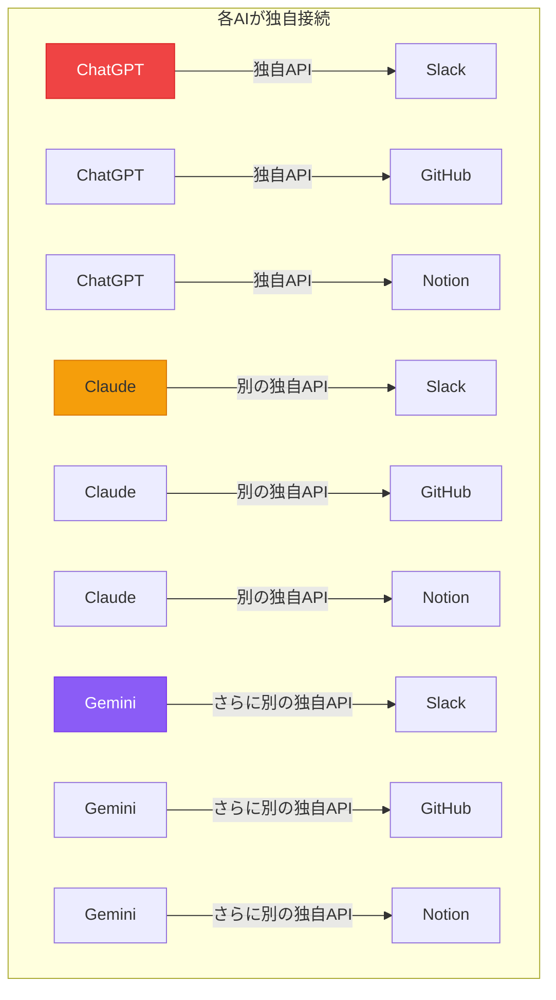

**問題点**：
- 各AIが各ツールに対して個別の接続方法を開発
- 開発コストが膨大
- メンテナンスが困難
- 新しいツールへの対応が遅い

### **統一された接続（MCPがある場合）**

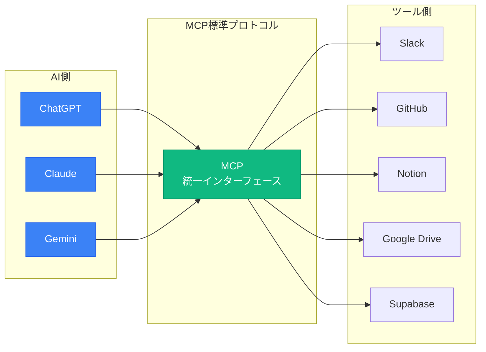

**メリット**：
- ✅ 一度の実装で全AIに対応
- ✅ 新しいツールもすぐに使える
- ✅ メンテナンスコスト削減
- ✅ 開発スピード向上

---

## 📅 MCPの最新アップデート（2025年9月〜11月）

### **重要なマイルストーン**

| 日付 | アップデート | 影響 |
|------|-------------|------|
| **2025年9月5日** | PHP SDK正式リリース | PHP開発者も参入可能に |
| **2025年9月20日** | リモートMCPコネクタ | クラウド接続が簡単に |
| **2025年10月10日** | セキュリティ強化版 | 企業利用が加速 |
| **2025年11月（予定）** | 次期仕様リリース | さらなる機能拡張 |

---

## 🎯 MCPで何ができるのか？ - 実践的な活用例

### **使用例1：ソフトウェア開発の自動化**

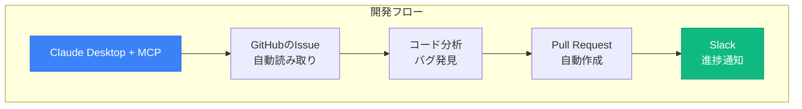

**Cursorへの指示例**：
```
「GitHubのIssueを読み取って、該当するバグを修正し、Pull Requestを作成して、完了したらSlackに通知する処理を作成してください」
```

### **使用例2：ビジネスワークフローの自動化**

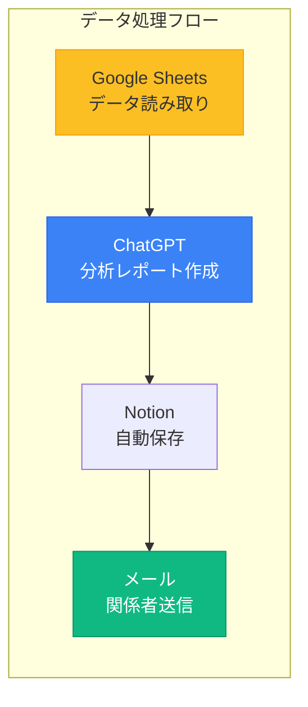

**Cursorへの指示例**：
```
「Google Sheetsからデータを読み込んで、AIで分析レポートを作成し、Notionに保存して、関係者にメール送信する処理を作成してください」
```

### **使用例3：顧客対応の自動化**

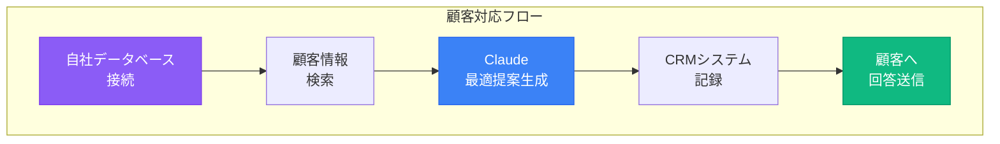

---

## 🛠️ MCPを使える主要ツール（2025年11月現在）

| ツール | 対応状況 | 特徴 | 推奨用途 |
|--------|----------|------|---------|
| **Claude Desktop** | ✅ 完全対応 | MCPサーバーを簡単に追加可能 | 一般的な作業 |
| **Claude Code** | ✅ 完全対応 | コーディング作業に特化 | 開発作業 |
| **Messages API** | ✅ 対応 | API経由でMCPサーバーを利用 | システム統合 |
| **Claude Mobile** | 🔄 一部対応 | モバイルアプリでも利用可能 | 外出先での作業 |
| **Cursor** | 🔄 開発中 | 統合予定（2025年末） | IDE内での利用 |

---

## ⚠️ セキュリティに関する重要な注意

### **2025年9月の事件から学ぶ**

2025年9月、悪意のあるMCPサーバーによるメール情報の流出事件が報告されました。

### 🔐 安全に使うための4つの鉄則

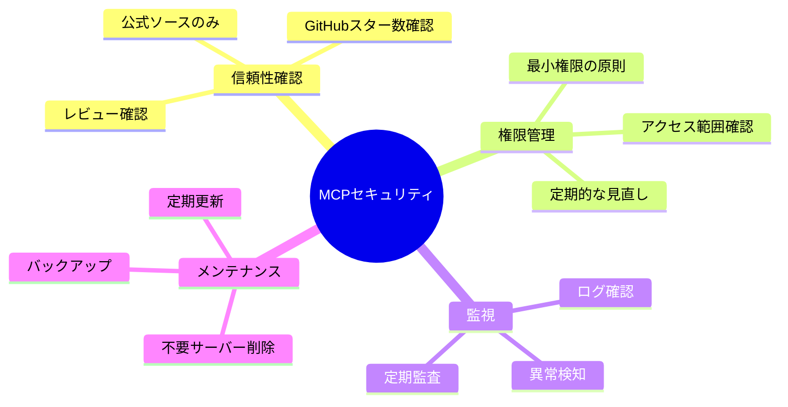

**Cursorへの指示例**：
```
「MCPサーバーの権限要求を確認し、必要最小限のアクセス権限のみを付与する設定ファイルを作成してください」
```

---

## 🌟 MCPの将来性 - なぜ今学ぶべきなのか

### **業界標準になる3つの理由**

1. **大手企業の採用**
   - Microsoft、Google、Amazonが相次いで対応表明
   - エンタープライズ向け機能の充実

2. **開発者コミュニティの支持**
   - GitHub上で10,000以上のMCPサーバー公開
   - 活発なコントリビューション

3. **実用性の高さ**
   - 開発時間を50%削減した事例多数
   - メンテナンスコストの大幅削減

### **今後の展開予想**

| 時期 | 予想される変化 |
|------|--------------|
| **2025年末** | 主要AIツールの80%がMCP対応 |
| **2026年前半** | 企業の標準プロトコルとして採用 |
| **2026年後半** | AI開発の必須スキルに |

---

## 💡 この章のまとめ

- ✅ MCPは「AIのためのUSB-C」として、複雑な接続を簡単にする革命的プロトコル
- ✅ 一度の実装で複数のAIとツールを接続でき、開発効率が大幅に向上
- ✅ セキュリティに注意しながら、信頼できるソースからのみMCPサーバーを利用
- ✅ 2025年11月現在、急速に普及しており、今後の標準となる可能性大
- ✅ Vibe Coderとして、MCPを理解し活用することで競争優位性を確保

## 🚀 次の章への橋渡し

MCPという「接続の標準化」を理解しました。次の第2章では、この接続を活用して実際にコードを生成する「次世代AIコーディングエージェント」について学びます。Claude Code、Codex CLI、Windsurfなど、最新ツールの選び方と使い方を詳しく解説します。

---

# 第2章：次世代AIコーディングエージェント

## 🎯 この章で学ぶこと

- **エージェントの進化**：エディタ内補完から完全自律型への変化
- **5大ツールの徹底比較**：Claude Code、Codex CLI、Windsurf、Cursor、Amazon Kiro
- **選択基準の明確化**：自分に最適なツールを選ぶ方法
- **実践的な使い方**：各ツールの具体的な活用手順
- **学習ロードマップ**：段階的にスキルアップする方法

## 📌 この章の位置づけ

第一回でCursorの基礎を学びました。この章では、2025年に登場した**さらに強力なAIコーディングエージェント**を比較し、皆さんのニーズに最適なツールを選択できるようにします。

---

## 🚀 AIコーディング支援の新たなフェーズ

### **2023年〜2025年の劇的な進化**

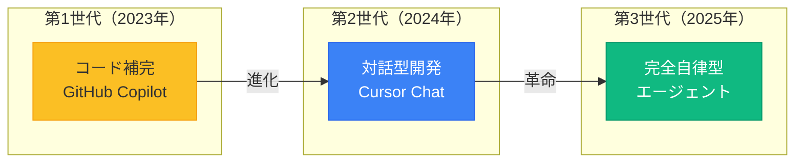

**第3世代の特徴**：
- 🤖 複数ファイルの同時編集
- 🔄 プロジェクト全体の理解
- 🎯 長時間タスクの自律実行
- 📊 自動テスト・デバッグ

---

## 🏆 5大AIコーディングエージェント詳細解説

### 1. **Claude Code** - ターミナルファーストの革新

#### 概要と特徴

Anthropic社が2025年にリリースした、**ターミナルで動作する**AIコーディングエージェントです。

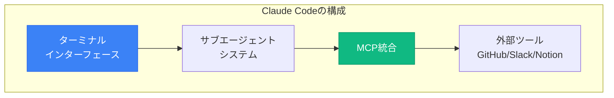

#### インストールと使い方

**Cursorへの指示例**：
```
「Claude Codeをnpm経由でインストールし、初期設定を行うスクリプトを作成してください。環境変数の設定も含めてください」
```

#### こんな人におすすめ

| 条件 | 適合度 | 理由 |
|------|--------|------|
| ターミナル作業が好き | ⭐⭐⭐⭐⭐ | ネイティブ対応 |
| MCP活用したい | ⭐⭐⭐⭐⭐ | 完全統合 |
| Claude愛好者 | ⭐⭐⭐⭐⭐ | 同じAIモデル |
| 初心者 | ⭐⭐⭐ | 学習曲線あり |

---

### 2. **Codex CLI** - OpenAIのエンタープライズ対応 🔥

#### 概要と特徴

OpenAIが**2025年10月6日に正式リリース**した、エンタープライズ向けAIエージェントです。

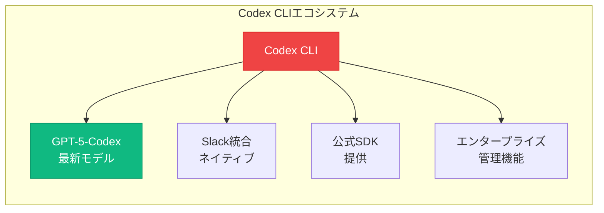

#### 革新的な機能

##### **GPT-5-Codexモデル**
- 複雑な要求を段階的に分解
- 複数ファイルの同時編集
- 自動コードレビュー

##### **Slack統合（正式版）**

**活用例**：
```
Slackチャンネルで：
@Codex このPull Requestをレビューして

Codexが自動で：
✓ コード分析
✓ バグ発見
✓ 改善提案
✓ 結果をSlackに投稿
```

##### **エンタープライズ管理**

| 機能 | 内容 | メリット |
|------|------|---------|
| **RBAC** | 役割ベースアクセス制御 | セキュリティ強化 |
| **Analytics** | 使用状況の可視化 | コスト管理 |
| **ドメイン制限** | アクセス制御 | 情報漏洩防止 |
| **管理者トグル** | 機能ON/OFF制御 | 柔軟な運用 |

#### 料金体系

- **ChatGPT Plus/Pro/Business/Enterprise**：追加料金なし
- **API経由**：従量課金制

**Cursorへの指示例**：
```
「Codex CLIを使って、GitHubのPull Requestを自動レビューし、結果をSlackに投稿する自動化スクリプトを作成してください」
```

---

### 3. **Windsurf（旧Codeium）** - スタンドアロンAI IDE

#### 概要と特徴

2025年にCodeiumが進化した**独立型IDE**です。

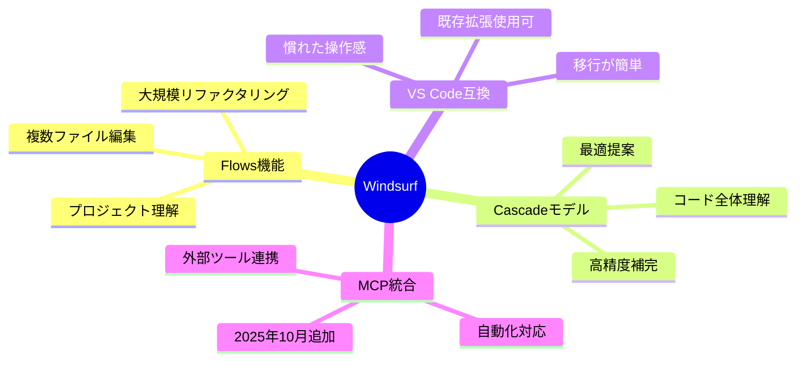

#### こんな人におすすめ

- VS Codeから移行したい人
- 大規模プロジェクトを扱う人
- 独立したIDEを求める人

---

### 4. **Cursor** - AI IDE の定番

#### 最新バージョン1.7の新機能（2025年9月29日）

| 機能 | 内容 | 革新性 |
|------|------|---------|
| **ブラウザコントロール** | AIがブラウザ操作してデバッグ | ⭐⭐⭐⭐⭐ |
| **Agent-autocomplete** | エージェントモードの自動補完 | ⭐⭐⭐⭐ |
| **Hooks** | ファイル保存時の自動実行 | ⭐⭐⭐⭐ |
| **Bugbot GA** | バグ自動修正の正式版 | ⭐⭐⭐⭐⭐ |

**Cursorへの指示例**：
```
「Cursorのブラウザコントロール機能を使って、フロントエンドのE2Eテストを自動化する設定を作成してください」
```

---

### 5. **Amazon Kiro** - AWS発の仕様駆動開発 🆕

#### 革新的な特徴

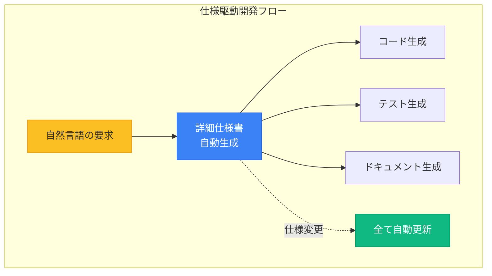

#### メリット

1. **コード前に仕様が明確**
2. **自動ドキュメント生成**
3. **チーム共有が簡単**
4. **AWS完全統合**

---

## 📊 5大AIエージェント完全比較表

| 特徴 | Claude Code | Codex CLI | Windsurf | Cursor | Amazon Kiro |
|------|-------------|-----------|----------|--------|-------------|
| **開発元** | Anthropic | OpenAI | Codeium | Cursor | Amazon |
| **価格** | 従量課金 | ChatGPT含む/$0 | $0〜10/月 | $0〜200/月 | プレビュー無料 |
| **MCP統合** | ✅ ネイティブ | 外部経由 | ✅ 対応 | 開発中 | ✅ ネイティブ |
| **Slack統合** | MCP経由 | ✅ ネイティブ | 外部経由 | 外部経由 | MCP経由 |
| **SDK提供** | ❌ | ✅ 公式SDK | ❌ | ❌ | ❌ |
| **仕様駆動** | ❌ | ❌ | ❌ | ❌ | ✅ 独自機能 |
| **ブラウザ操作** | ❌ | ❌ | ❌ | ✅ v1.7 | ❌ |
| **おすすめ度** | ⭐⭐⭐⭐⭐ | ⭐⭐⭐⭐⭐ | ⭐⭐⭐⭐ | ⭐⭐⭐⭐⭐ | ⭐⭐⭐⭐ |

---

## 🎓 初めてのAIコーディングエージェント：推奨学習ルート

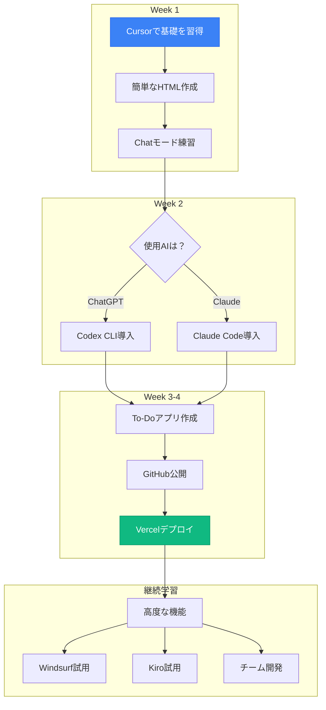

---

## 💡 この章のまとめ

- ✅ AIコーディングエージェントは「補完」から「完全自律型」へ進化
- ✅ Claude Code（MCP重視）、Codex CLI（企業向け）、Windsurf（リファクタリング）、Cursor（定番）、Kiro（仕様駆動）それぞれに強み
- ✅ ChatGPTユーザーはCodex CLI、Claude愛好者はClaude Codeがおすすめ
- ✅ まずはCursorで基礎を学び、徐々に高度なツールへ移行
- ✅ 選択の基準は「使いたいAI」「チーム環境」「予算」で決める

## 🚀 次の章への橋渡し

AIコーディングエージェントの選び方を理解しました。次の第3章では、これらのエージェントで実際にデータベースを操作する際に必要な「ORM」について、PrismaとDrizzleを比較しながら実践的に学びます。

---

# 第3章：ORM完全ガイド - データベース操作を簡単に

## 🎯 この章で学ぶこと

- **ORMの本質**：データベース操作を簡単にする技術の理解
- **Prisma vs Drizzle**：2大ORMの特徴と使い分け
- **実践的な導入方法**：Next.jsプロジェクトでの具体的な手順
- **選択基準**：プロジェクトに最適なORMを選ぶ方法
- **トラブルシューティング**：よくある問題と解決方法

## 📌 この章の位置づけ

第3回講義でSupabaseとデータベースの基礎を学びました。この章では、データベース操作をより**簡単かつ安全**にする「ORM」技術について、実践的なアプローチで理解を深めます。

---

## 🗄️ ORMとは？ - SQLを書かない新しい方法

### **Object-Relational Mapping の革命**

ORMは、データベースの操作を**プログラミング言語のオブジェクト**として扱えるようにする技術です。

### 📝 ORMがない場合 vs ORMがある場合

#### 従来の方法（生SQL）- エラーが起きやすい

```javascript
// ユーザー情報を取得（SQLを文字列で書く）
const result = await db.query(
  'SELECT * FROM users WHERE email = ? AND age > ?',
  ['user@example.com', 18]
);

// データを挿入（タイプミスに気づきにくい）
await db.query(
  'INSERT INTO users (name, email, age) VALUES (?, ?, ?)',
  ['太郎', 'taro@example.com', 25]
);
```

**問題点**：
- ❌ タイプミスが実行時まで分からない
- ❌ データ型の安全性がない
- ❌ データベースを変更すると全て書き換え

#### ORMを使った方法 - 安全で簡単

```javascript
// ユーザー情報を取得（型安全）
const user = await prisma.user.findFirst({
  where: {
    email: 'user@example.com',
    age: { gt: 18 }
  }
});

// データを挿入（自動補完が効く）
await prisma.user.create({
  data: {
    name: '太郎',
    email: 'taro@example.com',
    age: 25
  }
});
```

**メリット**：
- ✅ エディタが自動補完
- ✅ タイプミスを即座に検出
- ✅ データベース変更も簡単

---

## 🥊 Prisma vs Drizzle：2大ORM徹底比較

### 📘 **Prisma** - すべてが揃った定番ORM

#### 特徴とメリット

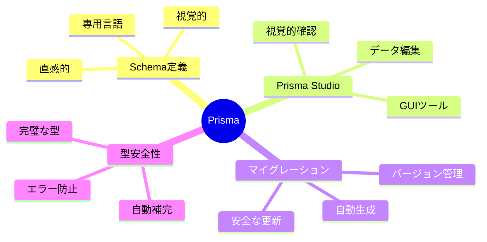

#### Prismaのスキーマ例

**Cursorへの指示**：
```
「ユーザーと投稿を管理するPrismaスキーマを作成してください。ユーザーは複数の投稿を持ち、各投稿は1人の作者を持ちます」
```

生成されるスキーマ：
```prisma
model User {
  id        Int      @id @default(autoincrement())
  email     String   @unique
  name      String?
  posts     Post[]
  createdAt DateTime @default(now())
}

model Post {
  id        Int      @id @default(autoincrement())
  title     String
  content   String?
  published Boolean  @default(false)
  author    User     @relation(fields: [authorId], references: [id])
  authorId  Int
  createdAt DateTime @default(now())
}
```

#### Prisma Studioの魅力

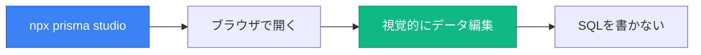

---

### ⚡ **Drizzle** - SQL-firstの軽量ORM

#### 特徴とメリット

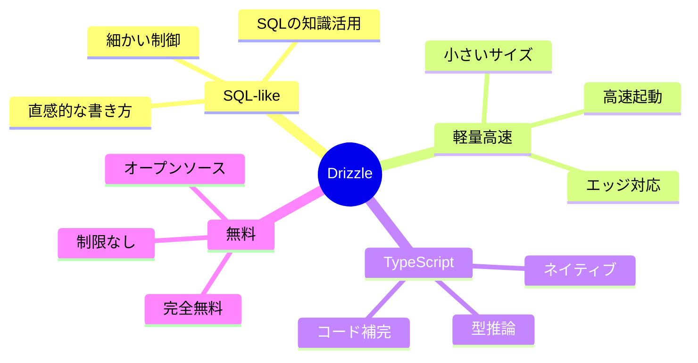

#### DrizzleのTypeScriptスキーマ例

**Cursorへの指示**：
```
「DrizzleでユーザーとポストのスキーマをTypeScriptで定義してください。PostgreSQL用で作成してください」
```

生成されるスキーマ：
```typescript
import { pgTable, serial, text, integer, boolean, timestamp } from 'drizzle-orm/pg-core';

export const users = pgTable('users', {
  id: serial('id').primaryKey(),
  email: text('email').notNull().unique(),
  name: text('name'),
  createdAt: timestamp('created_at').defaultNow()
});

export const posts = pgTable('posts', {
  id: serial('id').primaryKey(),
  title: text('title').notNull(),
  content: text('content'),
  published: boolean('published').default(false),
  authorId: integer('author_id').references(() => users.id),
  createdAt: timestamp('created_at').defaultNow()
});
```

---

## 📊 Prisma vs Drizzle 詳細比較表

| 項目 | Prisma | Drizzle | 判定基準 |
|------|--------|---------|----------|
| **学習難易度** | ⭐⭐⭐ やさしい | ⭐⭐⭐⭐ 中級者向け | 初心者ならPrisma |
| **書き方** | 専用Schema言語 | TypeScript | TS経験者ならDrizzle |
| **GUIツール** | ✅ Prisma Studio | ❌ なし | 視覚的作業ならPrisma |
| **型安全性** | ⭐⭐⭐⭐⭐ 完璧 | ⭐⭐⭐⭐⭐ 完璧 | 同等 |
| **パフォーマンス** | ⭐⭐⭐⭐ 良い | ⭐⭐⭐⭐⭐ 最高 | 速度重視ならDrizzle |
| **バンドルサイズ** | 大きめ（2MB） | 小さい（500KB） | エッジならDrizzle |
| **Next.js統合** | ✅ 公式ガイド充実 | ✅ 対応 | Prismaがやや有利 |
| **料金** | 基本無料〜$29/月 | 完全無料 | 予算重視ならDrizzle |

---

## 🎯 どちらを選ぶべき？ - 明確な選択基準

### **Prismaを選ぶべき場合**

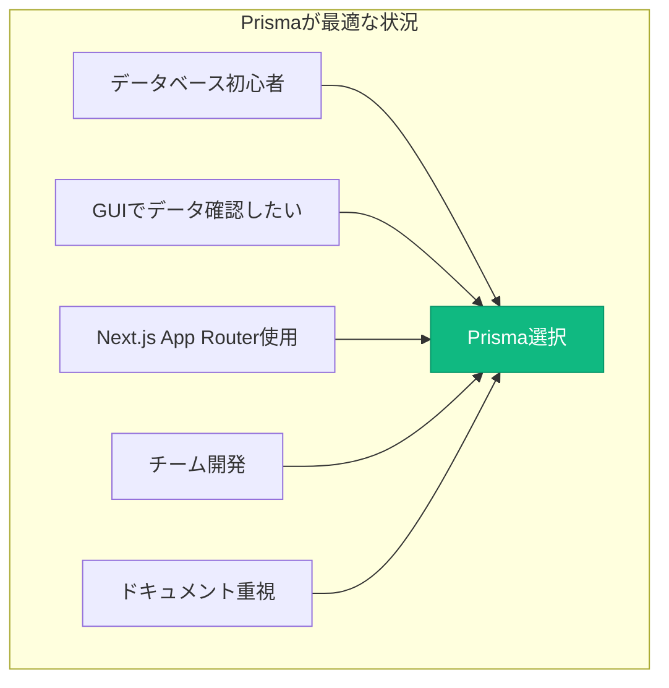

### **Drizzleを選ぶべき場合**

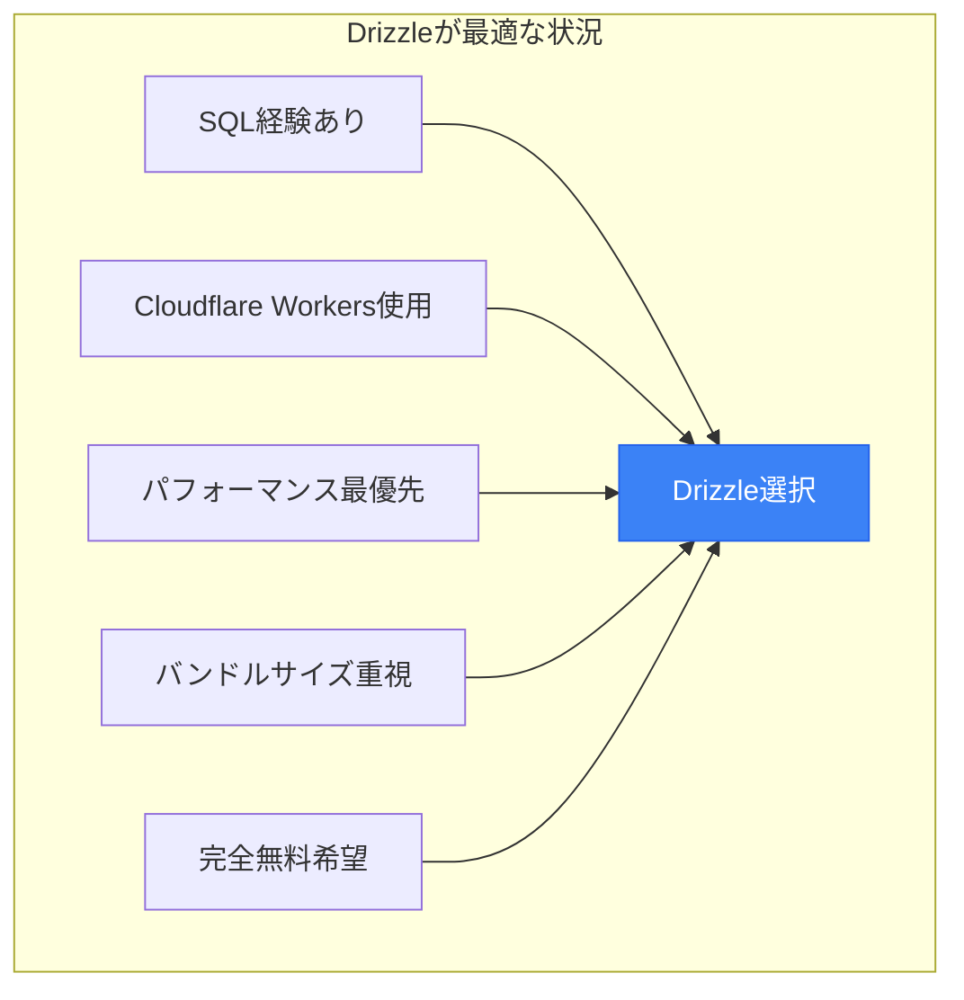

---

## 🚀 実践：Next.js + Prismaで始める

### ステップバイステップガイド

**Cursorへの指示例**：
```
「Next.jsプロジェクトにPrismaを導入し、Supabaseと接続する完全なセットアップスクリプトを作成してください。環境変数の設定も含めてください」
```

### よくあるトラブルと解決法

| エラー | 原因 | 解決方法 |
|--------|------|----------|
| **P1001: Can't reach database** | 接続文字列エラー | パスワードの特殊文字をURLエンコード |
| **Missing generator** | Prisma未生成 | `npx prisma generate`実行 |
| **Migration failed** | スキーマ不整合 | `npx prisma migrate reset`で初期化 |

---

## 💡 この章のまとめ

- ✅ ORMはSQLを書かずにデータベース操作を型安全に行える革新的技術
- ✅ Prismaは「すべてが揃った」初心者向け、Drizzleは「軽量高速」な中級者向け
- ✅ GUIツールやドキュメント重視ならPrisma、パフォーマンスやエッジ環境ならDrizzle
- ✅ どちらも型安全性は完璧で、プロジェクトの要件に応じて選択
- ✅ 最初はPrismaで学習し、必要に応じてDrizzleへ移行が推奨ルート

## 🚀 次の章への橋渡し

データベース操作を簡単にするORMを理解しました。次の第4章では、2025年秋の最新トレンド、特に**Sora 2による動画生成革命**や**OpenAI DevDayの重要発表**について学び、最新技術をビジネスに活用する方法を探ります。

---

# 第4章：2025年秋の最新トレンド

## 🎯 この章で学ぶこと

- **Sora 2の衝撃**：動画+音声生成の新時代とビジネス活用
- **OpenAI DevDay 2025**：10月6日の革新的な発表内容
- **実用AIツール**：非エンジニアでも今すぐ使える最新サービス
- **プライバシーとセキュリティ**：重要な変更と対策
- **トレンドの読み方**：継続的な情報収集の方法

## 📌 この章の位置づけ

これまでの講義で基礎技術を学びました。この章では、**2025年10月〜11月の最新動向**を理解し、常に最新技術をキャッチアップできるVibe Coderになるための視点を養います。

---

## 🎬 Sora 2の衝撃 - 動画生成の新時代

### **2025年10月、ついに実用レベルへ**

OpenAIのSora 2により、動画生成AIが革命的な進化を遂げました。

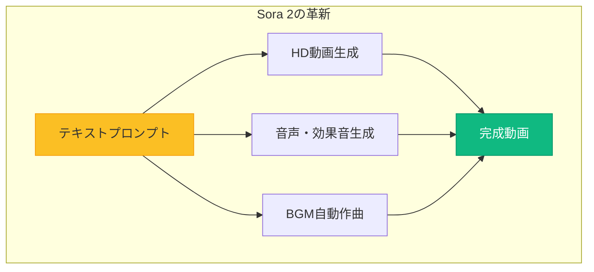

### 🌟 Sora 2の主要機能

#### 1. **動画 + 音声の同時生成**

| 要素 | 自動生成される内容 | 品質 |
|------|------------------|------|
| **映像** | HD画質の動画 | ⭐⭐⭐⭐⭐ |
| **効果音** | 環境に合わせた自然な音 | ⭐⭐⭐⭐ |
| **環境音** | 波の音、雑踏など | ⭐⭐⭐⭐⭐ |
| **BGM** | シーンに合わせた音楽 | ⭐⭐⭐⭐ |

**実例プロンプト**：
```
「森の中を走る犬。朝の爽やかな雰囲気。鳥のさえずりと風の音」
```

#### 2. **Cameos機能 - あなたが主役に**


**プライバシー保護**：
- ✅ 自分のCameoは自分だけが使用可能
- ✅ 他人による無断使用は不可能
- ✅ いつでも削除可能

### 🎯 ビジネス活用例

**Cursorへの指示例**：
```
「Sora 2 APIを使って、商品説明文から自動的にプロモーション動画を生成するWebアプリを作成してください」
```

---

## 🚀 OpenAI DevDay 2025 - 10月6日の衝撃発表

### 主要発表まとめ

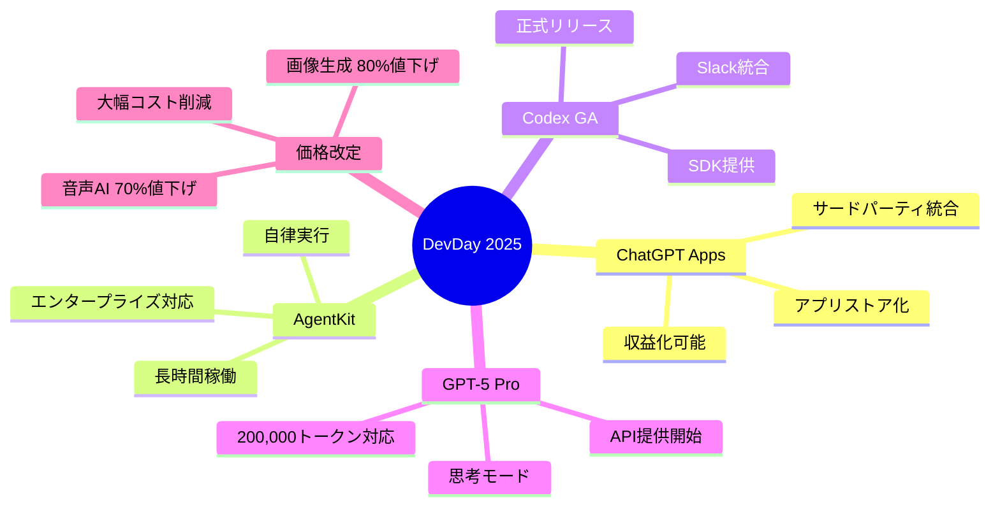

### 📱 ChatGPTにアプリを追加可能に

**Apps SDK（プレビュー版）**により、ChatGPTが「アプリストア」のように進化。

**できること**：
- ChatGPT内でNotionを開いてメモ作成
- Figmaでデザイン編集
- Spotifyで音楽再生
- 自作アプリの統合・配布

**Cursorへの指示例**：
```
「ChatGPT Apps SDKを使って、ChatGPT内で動作するタスク管理アプリを作成してください」
```

---

## 🌍 非エンジニアのための実用AI（2025年11月版）

### 今すぐ使える最新ツール一覧

| サービス | 用途 | 料金 | 特徴 |
|---------|------|------|------|
| **YouTube Shorts × Veo 3** | 動画生成 | 無料 | 8秒動画を音声付きで |
| **Meta Vibes** | AIフィード | 無料 | 無限の動画生成 |
| **Adobe Firefly Video** | 商用動画 | $4.99/月〜 | 商用利用OK |
| **Synthesia 3.0** | アバター動画 | $22/月〜 | 140言語対応 |
| **Runway Gen-4** | キャラクター動画 | $12/月〜 | 一貫性保持 |
| **GitHub Copilot Free** | コード補完 | 無料（2,000回/月） | 個人利用に最適 |

### 詳細解説：YouTube Shorts × Veo 3

**使い方**：
1. YouTube Studioを開く
2. 「Create with AI」を選択
3. プロンプト入力
4. 3分で生成完了
5. そのまま投稿可能

**活用例**：
- SNS投稿用コンテンツ
- アイキャッチ動画
- ストーリー投稿
- 教育コンテンツ

---

## 🔐 重要：プライバシーポリシーの変更

### Anthropic Claude - 2025年10月8日からの変更

```mermaid
flowchart TB
    subgraph "影響を受けるユーザー"
        Personal[個人向けプラン]
        Personal --> Training[AIトレーニングに使用]
    end

    subgraph "影響なし"
        Enterprise[Enterpriseプラン]
        API[API利用]
        Team[Teamプラン]
    end

    style Training fill:#ef4444,stroke:#dc2626,color:#fff
    style Enterprise fill:#10b981,stroke:#059669,color:#fff
```

### オプトアウト方法

**Cursorへの指示例**：
```
「Claudeのプライバシー設定を自動的にオプトアウトするスクリプトを作成してください。設定手順も日本語で説明してください」
```

---

## 💡 この章のまとめ

- ✅ Sora 2により動画+音声の同時生成が可能になり、コンテンツ制作が革命的に変化
- ✅ OpenAI DevDayで発表されたChatGPT Apps、AgentKit、価格改定により開発が加速
- ✅ YouTube Shorts × Veo 3など、無料で使える実用AIツールが多数登場
- ✅ プライバシーポリシーの変更に注意し、適切な設定で情報を保護
- ✅ 最新トレンドを追うことで、競争優位性を維持

## 🚀 次の章への橋渡し

最新トレンドを把握しました。次の第5章では、これらの知識を活かして**実際に30日でAI開発者になる**ための具体的なロードマップと実践ガイドを提供します。

---

# 第5章：今すぐ始める実践ガイド

## 🎯 この章で学ぶこと

- **30日間のロードマップ**：ゼロからAI開発者になる具体的な手順
- **環境構築の完全ガイド**：つまづきやすいポイントと解決方法
- **実践プロジェクト**：段階的に難易度を上げる学習方法
- **トラブルシューティング**：よくある問題と具体的な解決策
- **継続学習の戦略**：長期的な成長のための方法論

## 📌 この章の位置づけ

これまでの講義で学んだ知識を**実践に移す**ための具体的なガイドです。理論から実装へ、確実にステップアップできる道筋を示します。

---

## 🚀 30日でAI開発者になる - 実証済みのロードマップ

### 全体スケジュール

```mermaid
gantt
    title 30日間の学習ロードマップ
    dateFormat YYYY-MM-DD
    section 第1週
    環境構築とツール導入    :2025-11-09, 2d
    最初のプロジェクト      :2d
    基本操作の習得          :3d

    section 第2週
    Supabase設定           :2d
    Prisma導入             :2d
    データベース連携        :3d

    section 第3週
    Clerk認証              :2d
    Vercelデプロイ         :3d
    統合テスト             :2d

    section 第4週
    AIエージェント導入     :2d
    MCP統合               :2d
    総まとめプロジェクト    :3d
```

---

## 📅 第1週：環境構築とツール導入

### Day 1-2: アカウント作成

**必須アカウント一覧**：

| サービス | 用途 | 料金 | 優先度 |
|---------|------|------|--------|
| **OpenAI** | ChatGPT、Sora 2 | $20/月〜 | ⭐⭐⭐⭐⭐ |
| **Anthropic** | Claude | Pay as you go | ⭐⭐⭐⭐⭐ |
| **GitHub** | コード管理 | 無料 | ⭐⭐⭐⭐⭐ |
| **Vercel** | デプロイ | 無料 | ⭐⭐⭐⭐⭐ |
| **Supabase** | データベース | 無料 | ⭐⭐⭐⭐ |
| **Clerk** | 認証 | 無料 | ⭐⭐⭐⭐ |

**Cursorへの指示例**：
```
「上記のサービスのアカウント作成手順と、各サービスのAPIキー取得方法をまとめたドキュメントを作成してください」
```

### Day 3-4: ツールインストール

```mermaid
flowchart TB
    subgraph "インストール順序"
        Node[1. Node.js<br/>公式サイトから]
        Node --> Git[2. Git<br/>バージョン管理]
        Git --> Cursor[3. Cursor<br/>AI IDE]
        Cursor --> CLI[4. CLIツール<br/>npm経由]
    end

    style Node fill:#3b82f6,stroke:#2563eb,color:#fff
    style Cursor fill:#10b981,stroke:#059669,color:#fff
```

### Day 5-7: 最初のプロジェクト

**段階的な練習**：

1. **HTML単体ページ**
   ```
   「シンプルな自己紹介ページをHTMLで作成してください」
   ```

2. **CSS追加**
   ```
   「モダンなデザインのCSSを追加してください」
   ```

3. **JavaScript導入**
   ```
   「ダークモード切り替え機能を追加してください」
   ```

---

## 📅 第2週：データベースとORM

### Day 8-10: Supabaseプロジェクト

**セットアップ手順**：

```mermaid
flowchart LR
    subgraph "Supabase設定"
        Create[プロジェクト作成]
        Create --> Table[テーブル作成]
        Table --> RLS[RLS設定]
        RLS --> API[APIキー取得]
    end

    style Create fill:#3b82f6,stroke:#2563eb,color:#fff
    style API fill:#10b981,stroke:#059669,color:#fff
```

**Cursorへの指示例**：
```
「Supabaseでユーザー管理テーブルを作成し、RLS（Row Level Security）を設定するSQLスクリプトを作成してください」
```

### Day 11-14: Prismaで接続

**実装ステップ**：

| ステップ | 内容 | コマンド/指示 |
|---------|------|-------------|
| 1. 初期化 | Next.jsプロジェクト作成 | `npm create next-app@latest` |
| 2. Prisma追加 | ORMインストール | `npm install prisma @prisma/client` |
| 3. スキーマ定義 | データモデル作成 | 「User, Postモデルを定義」 |
| 4. マイグレーション | DB反映 | `npx prisma migrate dev` |
| 5. Studio確認 | GUI確認 | `npx prisma studio` |

---

## 📅 第3週：認証とデプロイ

### Day 15-17: Clerk認証実装

```mermaid
flowchart TB
    subgraph "認証フロー"
        Setup[Clerk設定]
        Setup --> Provider[Provider追加]
        Provider --> Button[ログインボタン]
        Button --> Protected[保護ページ]
        Protected --> Test[動作テスト]
    end

    style Setup fill:#3b82f6,stroke:#2563eb,color:#fff
    style Test fill:#10b981,stroke:#059669,color:#fff
```

### Day 18-21: Vercelデプロイ

**デプロイチェックリスト**：

- [ ] GitHubリポジトリ作成
- [ ] コードをプッシュ
- [ ] Vercelでインポート
- [ ] 環境変数設定
- [ ] デプロイ実行
- [ ] カスタムドメイン設定（オプション）

---

## 📅 第4週：高度な機能

### Day 22-24: AIコーディングエージェント導入

**選択と導入**：

```mermaid
flowchart TB
    Choice{使用AI}
    Choice -->|ChatGPT| Codex[Codex CLI導入]
    Choice -->|Claude| ClaudeCode[Claude Code導入]

    Codex --> Practice1[プロンプト練習]
    ClaudeCode --> Practice2[MCP統合]

    Practice1 --> Project[統合プロジェクト]
    Practice2 --> Project

    style Choice fill:#fbbf24,stroke:#f59e0b
    style Project fill:#10b981,stroke:#059669,color:#fff
```

### Day 25-27: MCP統合

**MCPサーバー追加手順**：

1. Claude Desktop設定を開く
2. MCPサーバー追加
3. GitHubサーバーを設定
4. 権限確認
5. 動作テスト

### Day 28-30: 総まとめプロジェクト

**要件**：
- ✅ ユーザー認証（Clerk）
- ✅ データベース（Supabase + Prisma）
- ✅ CRUD操作
- ✅ Vercelデプロイ
- ✅ AI支援開発

---

## 🐛 よくあるトラブルと解決法

### トラブルシューティングマトリックス

| エラー | 原因 | 解決方法 | Cursorへの指示 |
|--------|------|----------|---------------|
| **Prismaマイグレーションエラー** | DB接続失敗 | パスワードをURLエンコード | 「接続文字列を修正」 |
| **Clerk動作しない** | 環境変数エラー | `.env.local`確認 | 「環境変数チェックスクリプト作成」 |
| **Vercelデプロイ失敗** | 環境変数未設定 | Dashboard確認 | 「必要な環境変数リスト作成」 |
| **AIエージェント遅い** | レート制限 | APIキー確認 | 「使用量確認スクリプト作成」 |

---

## 📚 学習ロードマップ：次のステップ

### スキルレベル別の成長パス

```mermaid
flowchart TB
    subgraph "レベル1（〜1ヶ月）"
        L1[基礎完了]
    end

    subgraph "レベル2（1〜3ヶ月）"
        L2[Server Actions<br/>状態管理<br/>フォーム管理]
    end

    subgraph "レベル3（3〜6ヶ月）"
        L3[tRPC<br/>Testing<br/>CI/CD]
    end

    subgraph "レベル4（6ヶ月〜）"
        L4[MCP開発<br/>エージェントカスタマイズ<br/>パフォーマンス最適化]
    end

    L1 --> L2 --> L3 --> L4

    style L1 fill:#10b981,stroke:#059669,color:#fff
    style L4 fill:#ef4444,stroke:#dc2626,color:#fff
```

---

## 💡 この章のまとめ

- ✅ 30日間の具体的なロードマップで、確実にAI開発者になれる
- ✅ 第1週で環境構築、第2週でDB、第3週で認証・デプロイ、第4週で高度な機能
- ✅ トラブルシューティングは、エラーメッセージをAIに投げることが基本
- ✅ 段階的にレベルアップし、6ヶ月後にはエキスパートレベルへ
- ✅ 継続的な学習と実践が、Vibe Coderとしての成長の鍵

## 🚀 次の章への橋渡し

実践的な30日間のロードマップを理解しました。最終章の第6章では、Vibe Coderとして**長期的に成長し続ける**ための戦略と、未来への準備について学びます。

---

# 第6章：未来への準備 - 継続的な成長戦略

## 🎯 この章で学ぶこと

- **技術トレンドの読み方**：変化の激しいAI業界で生き残る方法
- **コミュニティの活用**：一人で学ばない、共に成長する
- **ポートフォリオ構築**：実績を可視化する重要性
- **キャリア戦略**：Vibe Coderとしてのキャリアパス
- **未来への展望**：2026年以降の予測と準備

## 📌 この章の位置づけ

VibeCoder育成プログラムの最終章として、プログラム終了後も**継続的に成長**し、常に最先端を走り続けるための戦略を提供します。これは終わりではなく、新たな始まりです。

---

## 🔮 技術トレンドの読み方

### 情報収集の3層構造

```mermaid
flowchart TB
    subgraph "第1層：公式情報"
        Official[OpenAI Blog<br/>Anthropic News<br/>Vercel Blog]
    end

    subgraph "第2層：コミュニティ"
        Community[X（Twitter）<br/>Discord<br/>GitHub Trending]
    end

    subgraph "第3層：実践"
        Practice[自分で試す<br/>プロジェクト作成<br/>フィードバック]
    end

    Official --> Community --> Practice
    Practice --> Insight[独自の洞察]

    style Official fill:#3b82f6,stroke:#2563eb,color:#fff
    style Insight fill:#10b981,stroke:#059669,color:#fff
```

### 必須フォローリスト

| カテゴリ | 情報源 | 更新頻度 | 重要度 |
|---------|--------|----------|--------|
| **公式ブログ** | OpenAI, Anthropic, Vercel | 週1〜2回 | ⭐⭐⭐⭐⭐ |
| **YouTube** | Fireship, Theo | 毎日 | ⭐⭐⭐⭐ |
| **X（Twitter）** | AI研究者、開発者 | リアルタイム | ⭐⭐⭐⭐⭐ |
| **Discord** | 各ツールの公式サーバー | 常時 | ⭐⭐⭐⭐ |
| **GitHub** | Trending, Stars | 毎日チェック | ⭐⭐⭐⭐ |

---

## 🤝 コミュニティの活用

### 成長を加速させるコミュニティ戦略

```mermaid
mindmap
  root((コミュニティ))
    参加
      Discord参加
      勉強会出席
      オンラインイベント
    貢献
      質問に回答
      知識共有
      OSS貢献
    構築
      自分のコミュニティ
      勉強会主催
      メンター活動
    成果
      人脈形成
      最新情報入手
      仕事獲得
```

### 推奨コミュニティ

**国際コミュニティ**：
- Next.js Discord（30,000+メンバー）
- Prisma Discord（15,000+メンバー）
- Supabase Discord（20,000+メンバー）

**日本語コミュニティ**：
- Zenn（技術記事投稿）
- Qiita（Q&A形式）
- X（Twitter）の#駆動開発

---

## 💼 ポートフォリオ構築戦略

### 効果的なポートフォリオの要素

```mermaid
flowchart LR
    subgraph "ポートフォリオ構成"
        Projects[プロジェクト<br/>3-5個]
        GitHub[GitHub<br/>活動履歴]
        Blog[技術ブログ<br/>学習記録]
        Demo[デモサイト<br/>実動作]
    end

    Projects --> Portfolio[統合ポートフォリオ]
    GitHub --> Portfolio
    Blog --> Portfolio
    Demo --> Portfolio

    Portfolio --> Opportunity[機会獲得]

    style Portfolio fill:#3b82f6,stroke:#2563eb,color:#fff
    style Opportunity fill:#10b981,stroke:#059669,color:#fff
```

### プロジェクトアイデア

| レベル | プロジェクト | 技術スタック | 期間 |
|--------|-------------|-------------|------|
| **初級** | To-Doアプリ | Next.js + Supabase | 1週間 |
| **中級** | SNSクローン | + Clerk + Prisma | 2週間 |
| **上級** | SaaSプロダクト | + Stripe + AI API | 1ヶ月 |
| **エキスパート** | オープンソース | 独自ツール開発 | 継続的 |

**Cursorへの指示例**：
```
「GitHubのREADMEを魅力的にし、プロジェクトの価値を明確に伝えるテンプレートを作成してください」
```

---

## 🚀 Vibe Coderとしてのキャリアパス

### 3つの成長方向

```mermaid
graph TB
    subgraph "スペシャリスト"
        S1[特定分野の専門家]
        S2[AIツール専門]
        S3[高単価案件]
    end

    subgraph "ジェネラリスト"
        G1[幅広い知識]
        G2[プロジェクトマネジメント]
        G3[CTOポジション]
    end

    subgraph "エバンジェリスト"
        E1[教育・啓蒙]
        E2[講演・執筆]
        E3[コミュニティリーダー]
    end

    VibeCoder[Vibe Coder] --> S1
    VibeCoder --> G1
    VibeCoder --> E1

    style VibeCoder fill:#3b82f6,stroke:#2563eb,color:#fff
```

### 収益化の選択肢

| 方法 | 難易度 | 収益性 | 開始時期 |
|------|--------|--------|----------|
| **受託開発** | ⭐⭐⭐ | 中 | 3ヶ月後〜 |
| **SaaS開発** | ⭐⭐⭐⭐⭐ | 高 | 6ヶ月後〜 |
| **技術顧問** | ⭐⭐⭐⭐ | 高 | 1年後〜 |
| **教育・研修** | ⭐⭐⭐ | 中 | 6ヶ月後〜 |
| **OSS+スポンサー** | ⭐⭐⭐⭐ | 変動 | 1年後〜 |

---

## 🔮 2026年以降の展望

### 予測される変化

```mermaid
flowchart TB
    subgraph "2025年末"
        Current[現在地点]
    end

    subgraph "2026年前半"
        H1[AIエージェント標準化<br/>MCP完全普及<br/>ノーコード進化]
    end

    subgraph "2026年後半"
        H2[完全自律開発<br/>マルチモーダルAI<br/>リアルタイム協働]
    end

    subgraph "2027年"
        Future[AGI実現？<br/>新パラダイム]
    end

    Current --> H1 --> H2 --> Future

    style Current fill:#10b981,stroke:#059669,color:#fff
    style Future fill:#ef4444,stroke:#dc2626,color:#fff
```

### 準備すべきこと

| 時期 | 準備内容 | アクション |
|------|---------|-----------|
| **今すぐ** | 基礎固め | このプログラム完走 |
| **3ヶ月以内** | 実績作り | 3つ以上のプロジェクト |
| **6ヶ月以内** | 専門性確立 | 得意分野の決定 |
| **1年以内** | ネットワーク構築 | コミュニティ活動 |
| **継続的** | 学習習慣 | 毎日1時間の学習 |

---

## 🎯 最終メッセージ：あなたへ

### Vibe Coderとして歩み始めるあなたへ

```mermaid
flowchart TB
    Start[今日のあなた]
    Start --> Learn[学習と実践]
    Learn --> Create[価値創造]
    Create --> Share[知識共有]
    Share --> Grow[継続的成長]
    Grow --> Future[未来のイノベーター]

    style Start fill:#3b82f6,stroke:#2563eb,color:#fff
    style Future fill:#10b981,stroke:#059669,color:#fff
```

**覚えておいてほしい3つのこと**：

1. **完璧を求めない**
   - 60%の完成度でリリース
   - フィードバックで改善
   - 高速反復が鍵

2. **AIと共に成長**
   - AIは道具でありパートナー
   - 人間の創造性は不可欠
   - 共創の時代

3. **コミュニティを大切に**
   - 一人で悩まない
   - 知識は共有する
   - 助け合いの精神

---

## 💡 この章のまとめ

- ✅ 技術トレンドは公式情報→コミュニティ→実践の3層で把握
- ✅ ポートフォリオは3-5個の実動プロジェクトで構成
- ✅ キャリアはスペシャリスト、ジェネラリスト、エバンジェリストの3方向
- ✅ 2026年以降はさらなる自動化とAGIの可能性に備える
- ✅ 完璧を求めず、AIと共に成長し、コミュニティを大切にする

## 🚀 プログラムの締めくくり

VibeCoder育成プログラムの全カリキュラムを完了しました。ここで学んだことは、あなたの新しいキャリアの**出発点**です。

技術は日々進化しますが、「学び続ける姿勢」と「AIと協働する力」があれば、どんな変化にも対応できます。

今日から、あなたも立派な**Vibe Coder**です。

自信を持って、新しい世界へ踏み出してください。

---

# 🎓 まとめ：次のステップへ

## この講義で学んだこと

✅ **MCP革命**：AIアプリケーションとツールを繋ぐ新しい標準
✅ **次世代AIエージェント**：Claude Code、Codex CLI、Windsurfなど最新ツール
✅ **ORM技術**：PrismaとDrizzleによるデータベース操作の簡素化
✅ **2025年秋トレンド**：Sora 2、OpenAI DevDay、実用AIツール
✅ **30日ロードマップ**：具体的な学習パスと実践方法
✅ **未来への準備**：継続的な成長戦略とキャリアパス

## 🚀 今日から始められること

1. **Cursorで簡単なプロジェクトを作成**
2. **MCPサーバーを1つ試してみる**
3. **Sora 2やVeo 3で動画生成を体験**
4. **GitHubアカウントでポートフォリオ開始**
5. **コミュニティに参加して情報収集**

## 🌟 VibeCoder育成プログラムの次へ

この講義シリーズ（第1回〜第4回）で、AI駆動開発の基礎から実践、最新トレンドまでを学びました。

**次にやるべきこと**：
1. **自分のプロジェクトを作る**（ポートフォリオ構築）
2. **GitHubで公開**（実績の可視化）
3. **X（Twitter）で発信**（ネットワーク構築）
4. **最新情報をキャッチアップ**（継続学習）
5. **コミュニティで貢献**（知識の共有）

## 📬 最後に

**🎉 おめでとうございます！**

VibeCoder育成プログラムの全カリキュラムを完了しました。

あなたは今、**AIと共に価値を創造する力**を手に入れました。

この力を使って、世界にインパクトを与えてください。

**Happy Vibe Coding! 🚀**

---

> **最終更新**: 2025年11月8日
> **作成**: TEKION Group VibeCoder育成プログラム
> **バージョン**: 1.0（11月版）

---

## 📚 参考リンク集

### 公式ドキュメント
- [MCP公式](https://modelcontextprotocol.io/)
- [Claude Code](https://claude.ai/code)
- [Codex CLI](https://developers.openai.com/codex/)
- [Windsurf](https://windsurf.com/)
- [Cursor](https://cursor.sh/)
- [Amazon Kiro](https://aws.amazon.com/kiro)
- [Prisma](https://www.prisma.io/)
- [Drizzle](https://orm.drizzle.team/)
- [Sora 2](https://openai.com/sora)

### 学習リソース
- [Next.js Learn](https://nextjs.org/learn)
- [Prisma Getting Started](https://www.prisma.io/docs/getting-started)
- [Drizzle Tutorial](https://orm.drizzle.team/docs/tutorial)

### コミュニティ
- [Next.js Discord](https://discord.gg/nextjs)
- [Prisma Discord](https://discord.gg/prisma)
- [Supabase Discord](https://discord.supabase.com/)
- [日本語コミュニティ] Zenn、Qiita

---