# 第四回講義：デモデイと最終課題 - 本番クオリティで届けよう

## 🎯 この講義で学ぶこと

- **デモデイの本質**を理解し、「アイデアを形にする」から「価値を届ける」への飛躍
- **最終課題の要件**と、本番運用を見据えた開発プロセスの実践方法
- **ビルド安定化とデプロイの必須知識**を習得し、Vercel への公開を自走で完遂
- **プレゼンテーションの技術**と、ストーリーで魅力を伝える方法
- **学びの横展開**により、AI駆動開発を業務全体へ拡大する戦略
- **Vibe Coder としての自信**を確立し、次のステップへの明確な道筋

## 📌 この講義の位置づけ

VibeCoder育成プログラム全4回の最終講義です。

これまでの3回で積み上げた知識と技術を総動員し、**実際に動作するWebアプリケーション**を本番環境へデプロイします。単なる開発スキルの証明ではなく、**価値を届けるプロセス全体**を体験し、Vibe Coder としての総合力を発揮する集大成です。

デモデイは「初めての本番リリース」であり、今後のプロダクト開発やキャリアへの重要な一歩となります。

---

# 第1章：イントロダクション - デモデイが変える未来

## 🎯 この章で学ぶこと

- **デモデイの真の意義**と、単なる成果発表を超えた価値創造の場としての理解
- **世界のデモデイ事例**から学ぶ、プレゼンテーションが生み出す可能性
- **最終課題のビジョン**と、本番運用を通じた成長の道筋

## 📌 この章の位置づけ

この章では、デモデイを「ゴール」ではなく「新たなスタート」として捉え直します。世界中で起きているデモデイから生まれた成功事例を通じて、あなたの発表が持つ可能性を理解します。

---

## 💥 デモデイから始まる革命

### **「金曜日のデモが、月曜日の新規事業になる」**

これは、シリコンバレーで日常的に起きている現実です。

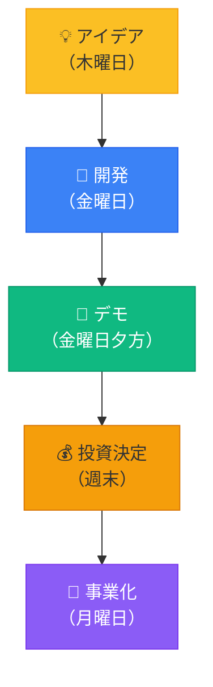

### **デモデイが生み出した成功事例**

| 企業名 | デモデイの内容 | 現在の評価額 | 成功の秘訣 |
|--------|-------------|------------|-----------|
| **Airbnb** | 部屋シェアの簡単なデモ | 7.5兆円 | ストーリーの力 |
| **Stripe** | 7行のコードでの決済デモ | 10兆円 | シンプルさの追求 |
| **Dropbox** | 動画だけのプロトタイプ | 1.2兆円 | ビジョンの明確さ |

### **あなたのデモデイも、誰かの未来を変える**

- ✅ **社内の課題**を解決し、業務効率化のモデルケースに
- ✅ **新規事業のタネ**となり、会社の新たな収益源に
- ✅ **キャリアの転換点**となり、次のステージへの扉を開く

---

## 🚀 最終課題のビジョン：「作る」から「届ける」へ

### **従来の開発 vs Vibe Coder のデモデイ**

| 観点 | **従来の開発** | **Vibe Coder のデモデイ** |
|------|-------------|------------------------|
| **目的** | 技術の証明 | 価値の証明 |
| **プロセス** | 完璧を求めて時間をかける | MVPを素早く届ける |
| **評価基準** | コードの品質 | ユーザーの反応 |
| **発表スタイル** | 技術説明中心 | ストーリーとデモ中心 |
| **次のステップ** | レビューと修正 | 実運用とフィードバック |

### **本番運用がもたらす学び**

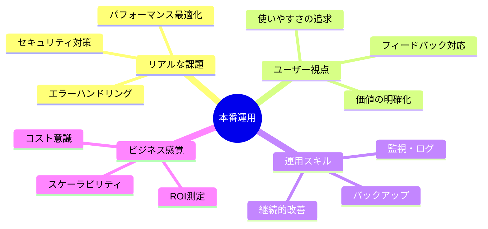

---

## 💡 この章のまとめ

- ✅ デモデイは「成果発表」ではなく「価値創造の第一歩」
- ✅ 世界中でデモから始まった革命的なサービスが存在する
- ✅ 最終課題は「作る」だけでなく「届ける」プロセス全体を体験
- ✅ 本番運用を通じて、実践的なスキルとビジネス感覚を獲得
- ✅ あなたのデモも、誰かの未来を変える可能性を持っている

## 🚀 次の章への橋渡し

デモデイの意義と可能性を理解しました。次の第2章では、具体的な最終課題の要件と、本番クオリティを実現するための開発プロセスを詳しく解説します。

---

# 第2章：最終課題の全体像

## 🎯 この章で学ぶこと

- **最終課題の詳細要件**と、必須要素・推奨要素の理解
- **3段階のゴール設定**により、自分に合った目標を選択
- **技術スタックの選定基準**と、安定運用のためのベストプラクティス
- **評価基準の詳細**を理解し、効果的な開発戦略を立案

## 📌 この章の位置づけ

第1章でデモデイの意義を理解しました。この章では、最終課題として「何を」「どのレベルで」作るべきかを明確にします。第3章の開発プロセスへつなげる重要な基盤となります。

---

## 🎯 最終課題：本番稼働を見据えたオリジナルWebアプリ開発

### **課題の3つの目的**

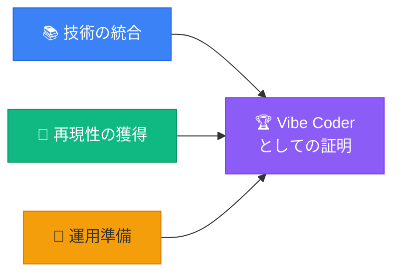

1. **技術の統合**: フロント・バック・DB・認証・デプロイをスルーで体験
2. **再現性の獲得**: AI駆動開発のワークフローを自走で回し切る
3. **運用準備**: ログ・メトリクス・権限など、公開後を意識した設計

### **テーマ選定のヒント**

| カテゴリ | 例 | なぜ良いか |
|---------|-----|-----------|
| **業務効率化** | タスク管理、申請システム | 実用性が高く継続利用される |
| **情報共有** | 社内Wiki、FAQ bot | チームへの価値提供が明確 |
| **趣味・興味** | 読書記録、運動記録 | モチベーション維持しやすい |
| **社会課題** | 地域情報、ボランティアマッチング | インパクトが大きい |

---

## 📋 必須要件と推奨要素

### **必須要件（Must Have）**

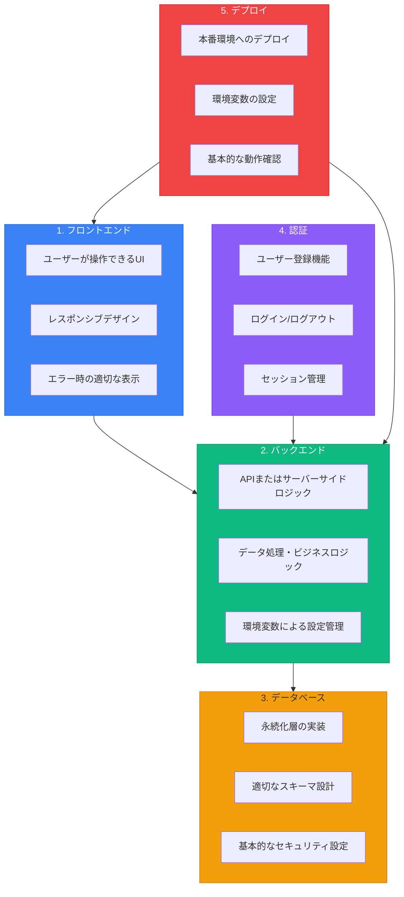

### **推奨技術スタック**

| レイヤー | 推奨技術 | 理由 | Cursorへの指示例 |
|---------|---------|------|----------------|
| **フロントエンド** | Next.js + TypeScript | 型安全性と開発効率 | 「Next.js 14のApp Routerを使用してレスポンシブなUIを作成してください」 |
| **バックエンド** | Next.js API Routes | フロントと統合 | 「API Routeでユーザーデータを処理するエンドポイントを作成してください」 |
| **データベース** | Supabase | 簡単セットアップ | 「Supabaseでユーザーテーブルと投稿テーブルを作成してください」 |
| **認証** | Clerk | 豊富な認証オプション | 「ClerkでGoogle認証とメール認証を実装してください」 |
| **デプロイ** | Vercel | Next.jsとの相性抜群 | 「Vercelへのデプロイ設定を作成してください」 |

### **推奨要素（Should Have）**

- ✅ **リアルタイム機能**: WebSocketやSupabase Realtime
- ✅ **ファイルアップロード**: Supabase Storage
- ✅ **通知機能**: メール通知やプッシュ通知
- ✅ **検索機能**: 全文検索やフィルタリング
- ✅ **ダッシュボード**: 統計情報の可視化

---

## 🎯 3段階のゴール設定

### **自分に合ったゴールを選ぼう**

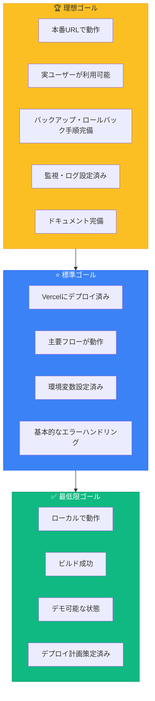

### **ゴール別の時間配分目安**

| ゴール | 開発 | テスト | デプロイ | ドキュメント | 合計時間目安 |
|--------|------|--------|---------|------------|------------|
| **理想ゴール** | 60% | 15% | 15% | 10% | 40-50時間 |
| **標準ゴール** | 70% | 15% | 10% | 5% | 20-30時間 |
| **最低限ゴール** | 80% | 15% | 0% | 5% | 10-15時間 |

---

## 📊 評価基準：価値・完成度・説明力

### **評価の5つの観点**

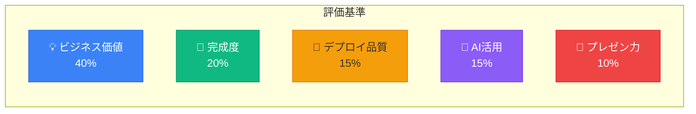

### **評価基準の詳細**

| 観点 | 評価ポイント | Cursorへの指示でカバーする方法 |
|------|------------|--------------------------|
| **ビジネス価値** | 誰のどんな課題を解決？ | 「このアプリのペルソナと解決する課題を明確にしてください」 |
| **完成度** | 安定動作・UX | 「エラーハンドリングとローディング表示を実装してください」 |
| **デプロイ品質** | 本番環境の適切な管理 | 「環境変数の設定とセキュリティチェックリストを作成してください」 |
| **AI活用** | 効率的な開発プロセス | 「この機能の実装手順を段階的に説明してください」 |
| **プレゼン力** | ストーリーと熱意 | 「プレゼン用のストーリーボードを作成してください」 |

---

## 💡 この章のまとめ

- ✅ 最終課題は「技術統合」「再現性獲得」「運用準備」の3つの目的を持つ
- ✅ 必須要件は5つ（フロント・バック・DB・認証・デプロイ）
- ✅ 理想・標準・最低限の3段階からゴールを選択
- ✅ 評価は技術力より「価値」「完成度」「説明力」を重視
- ✅ 時間配分を事前に計画し、無理のない開発を心がける

## 🚀 次の章への橋渡し

最終課題の全体像と要件を理解しました。次の第3章では、AI駆動開発で効率的に課題をクリアするための具体的な開発プロセスを学びます。

---

# 第3章：AI駆動開発プロセスの実践

## 🎯 この章で学ぶこと

- **5ステップ開発プロセス**の詳細と、各ステップでのAI活用方法
- **効果的なプロンプトテンプレート**を使った品質向上の技術
- **段階的開発アプローチ**により、確実に動くアプリを構築
- **トラブルシューティング**の実践的な手法とAIへの相談方法

## 📌 この章の位置づけ

第2章で最終課題の要件を理解しました。この章では、その要件を効率的にクリアするための具体的な開発手法を学びます。第4章のビルド・デプロイへスムーズに移行できる基盤を作ります。

---

## 🔄 5ステップ開発プロセス

### **AI駆動開発のワークフロー**

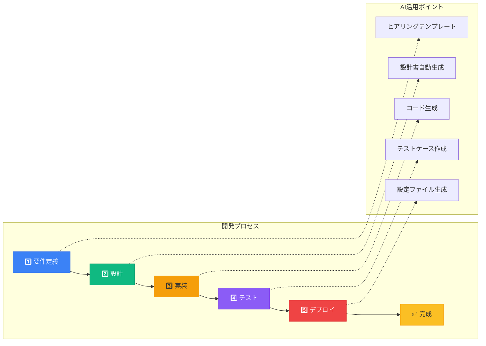

---

## 1️⃣ ステップ1: 要件定義

### **Cursorへの指示テンプレート**

```markdown
# 要件定義の作成依頼

## アプリケーション概要
[アプリの名前と目的を1-2文で説明]

## ターゲットユーザー
- 主要ペルソナ: [誰が使うか]
- 利用シーン: [いつ、どこで使うか]
- 解決したい課題: [どんな問題を解決するか]

## 主要機能（MVP）
1. [機能1: 最も重要な機能]
2. [機能2: 次に重要な機能]
3. [機能3: あると良い機能]

## 制約条件
- 開発期間: [○日間]
- 技術スタック: Next.js, Supabase, Clerk, Vercel
- 予算: 無料枠内で実装

上記の情報を基に、詳細な要件定義書をMarkdown形式で作成してください。
ユーザーストーリー、画面一覧、機能一覧を含めてください。
```

### **要件定義で明確にすべき項目**

| 項目 | 内容 | なぜ重要か |
|------|------|-----------|
| **価値提案** | 誰の何を解決するか | 開発の軸がブレない |
| **MVP機能** | 最小限必要な機能 | スコープクリープを防ぐ |
| **非機能要件** | パフォーマンス、セキュリティ | 運用時の問題を防ぐ |
| **制約事項** | 時間、予算、技術 | 現実的な計画を立てる |

---

## 2️⃣ ステップ2: 設計

### **設計書生成のプロンプト**

```markdown
# 設計書の作成依頼

要件定義書を基に、以下の設計書を作成してください：

## 1. データベース設計
- ER図をMermaid形式で作成
- 各テーブルのスキーマ定義
- リレーションシップの説明
- Supabaseでの実装方法

## 2. API設計
- エンドポイント一覧（REST形式）
- リクエスト/レスポンスの例
- エラーハンドリング方針
- Next.js API Routesでの実装方法

## 3. UI設計
- 画面遷移図をMermaid形式で作成
- 各画面のワイヤーフレーム（テキストで説明）
- コンポーネント構成
- Tailwind CSSを使用したスタイリング方針

## 4. 認証フロー
- Clerkを使用した認証フロー図
- ユーザー権限の設計
- セッション管理方法
```

### **設計の可視化例**

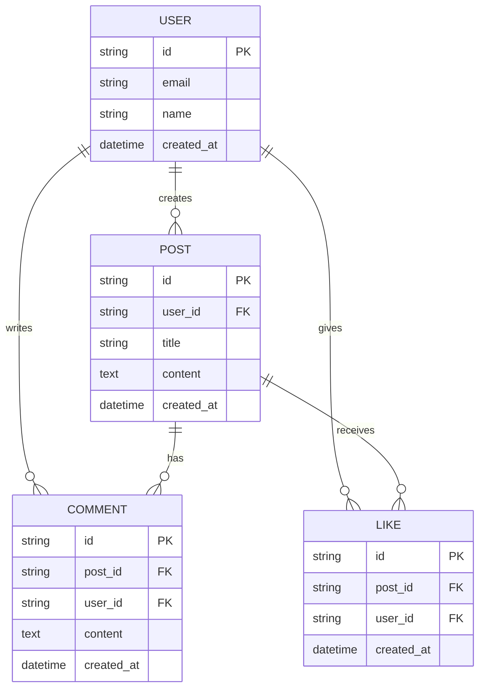

---

## 3️⃣ ステップ3: 実装

### **段階的実装アプローチ**

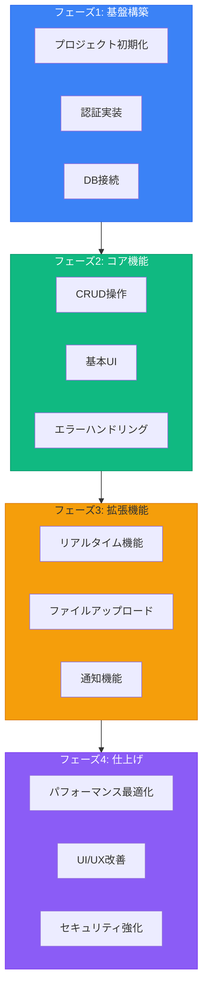

### **実装時のCursorへの指示パターン**

| 実装内容 | 効果的な指示例 |
|---------|--------------|
| **コンポーネント作成** | 「ユーザープロフィールカードコンポーネントを作成してください。propsでユーザー情報を受け取り、アバター、名前、自己紹介を表示します」 |
| **API実装** | 「投稿を作成するAPI Routeを実装してください。認証チェック、バリデーション、エラーハンドリングを含めてください」 |
| **DB操作** | 「Supabaseクライアントを使用して、投稿の一覧を取得する関数を作成してください。ページネーションとソート機能を含めてください」 |
| **状態管理** | 「React ContextAPIを使用して、ユーザー情報をグローバルに管理する仕組みを実装してください」 |

---

## 4️⃣ ステップ4: テスト・デバッグ

### **テストチェックリスト**

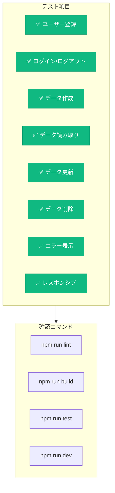

### **デバッグ時のAI活用**

```markdown
# エラー解決の依頼テンプレート

## エラー情報
```
[エラーメッセージ全文をペースト]
```

## 発生状況
- 実行したコマンド: [npm run build など]
- 発生タイミング: [どの操作をした時か]
- 環境: [ローカル/本番]

## 試したこと
1. [既に試した解決策1]
2. [既に試した解決策2]

## 関連コード
```typescript
[エラーが発生している箇所のコード]
```

上記のエラーの原因と解決策を教えてください。
また、同様のエラーを防ぐベストプラクティスも教えてください。
```

---

## 5️⃣ ステップ5: デプロイ準備

### **デプロイ前チェックリスト**

| カテゴリ | チェック項目 | Cursorへの確認指示 |
|---------|------------|------------------|
| **ビルド** | `npm run build`成功 | 「ビルドエラーを解決してください」 |
| **環境変数** | 本番用キー設定 | 「.env.exampleファイルを作成してください」 |
| **セキュリティ** | APIキー隠蔽 | 「環境変数の安全な管理方法を実装してください」 |
| **データベース** | マイグレーション完了 | 「Supabaseのテーブル作成SQLを生成してください」 |
| **認証** | リダイレクトURL設定 | 「Clerkの本番用設定手順を説明してください」 |

---

## 🔧 トラブルシューティングガイド

### **よくある問題と解決策**

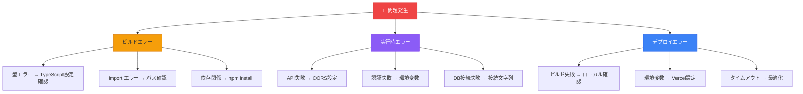

### **エラー解決のベストプラクティス**

1. **エラーメッセージを全文コピー**
   - Cursorに完全な情報を提供

2. **スタックトレースを追跡**
   - エラーの発生源を特定

3. **最小再現コードを作成**
   - 問題を切り分けて解決

4. **公式ドキュメントを参照**
   - 最新の解決方法を確認

---

## 💡 この章のまとめ

- ✅ 5ステップ開発プロセスで体系的に開発を進める
- ✅ 各ステップで効果的なプロンプトテンプレートを活用
- ✅ 段階的実装により、確実に動作するアプリを構築
- ✅ テストチェックリストで品質を担保
- ✅ トラブルシューティングはAIと協力して素早く解決

## 🚀 次の章への橋渡し

AI駆動開発プロセスを理解しました。次の第4章では、作成したアプリケーションを実際にビルドし、Vercelへデプロイする具体的な手順を学びます。

---

# 第4章：ビルドとデプロイの実践

## 🎯 この章で学ぶこと

- **ビルドプロセスの理解**と、エラーを防ぐための事前準備
- **Vercelへのデプロイ手順**を段階的に実行する方法
- **環境変数の管理**と、セキュアな本番設定の実装
- **CI/CDの基礎**と、自動デプロイの設定方法
- **本番運用のベストプラクティス**と監視・ログの活用

## 📌 この章の位置づけ

第3章で開発プロセスを学びました。この章では、完成したアプリケーションを実際に本番環境へデプロイし、世界中からアクセス可能な状態にする方法を学びます。第5章のプレゼンテーション準備へつながります。

---

## 🏗️ ビルドプロセスの理解

### **ビルドとは何か**

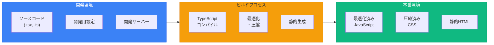

### **ビルド前チェックリスト**

```markdown
# Cursorへの指示：ビルド準備

以下の項目をチェックして、ビルドの準備を整えてください：

1. TypeScriptのエラーがないことを確認
   - `npm run type-check`を実行

2. ESLintのエラーを修正
   - `npm run lint`を実行して修正

3. 不要なconsole.logを削除
   - 本番環境用のログ設定に変更

4. 環境変数の確認
   - .env.localと.env.exampleの整合性チェック

5. 依存関係の最適化
   - 未使用のパッケージを削除
   - `npm audit fix`でセキュリティ修正

すべてのチェックが完了したら、`npm run build`を実行してください。
```

### **ビルドコマンドと出力**

| コマンド | 目的 | 成功時の出力 |
|---------|------|------------|
| `npm run build` | 本番用ビルド | "✓ Compiled successfully" |
| `npm run lint` | コード品質チェック | "No ESLint warnings or errors" |
| `npm run type-check` | 型チェック | "No errors found" |
| `npm run test` | テスト実行 | "All tests passed" |

---

## 🚀 Vercelへのデプロイ

### **デプロイの3ステップ**

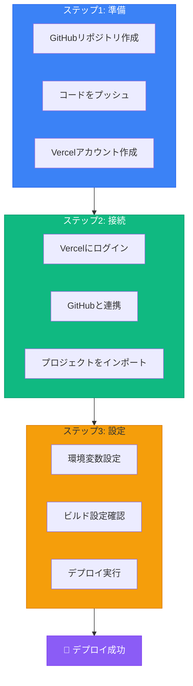

### **環境変数の設定**

```markdown
# Cursorへの指示：環境変数設定ガイド

Vercelで設定すべき環境変数のリストと説明を作成してください：

## データベース（Supabase）
- NEXT_PUBLIC_SUPABASE_URL: プロジェクトのURL
- NEXT_PUBLIC_SUPABASE_ANON_KEY: 公開用APIキー
- SUPABASE_SERVICE_ROLE_KEY: サーバー側専用キー（秘密）

## 認証（Clerk）
- NEXT_PUBLIC_CLERK_PUBLISHABLE_KEY: 公開用キー
- CLERK_SECRET_KEY: 秘密キー
- NEXT_PUBLIC_CLERK_SIGN_IN_URL: サインインページのパス
- NEXT_PUBLIC_CLERK_SIGN_UP_URL: サインアップページのパス

## その他
- NODE_ENV: "production"に設定

各環境変数の取得方法と、Vercelダッシュボードでの設定手順も説明してください。
```

### **環境変数設定の注意点**

| 種類 | プレフィックス | 公開範囲 | 例 |
|------|-------------|---------|-----|
| **公開変数** | NEXT_PUBLIC_ | クライアント側でも利用可 | NEXT_PUBLIC_SUPABASE_URL |
| **秘密変数** | なし | サーバー側のみ | CLERK_SECRET_KEY |
| **システム変数** | なし | Vercelが自動設定 | VERCEL_URL |

---

## 🔄 CI/CDパイプラインの設定

### **自動デプロイの仕組み**

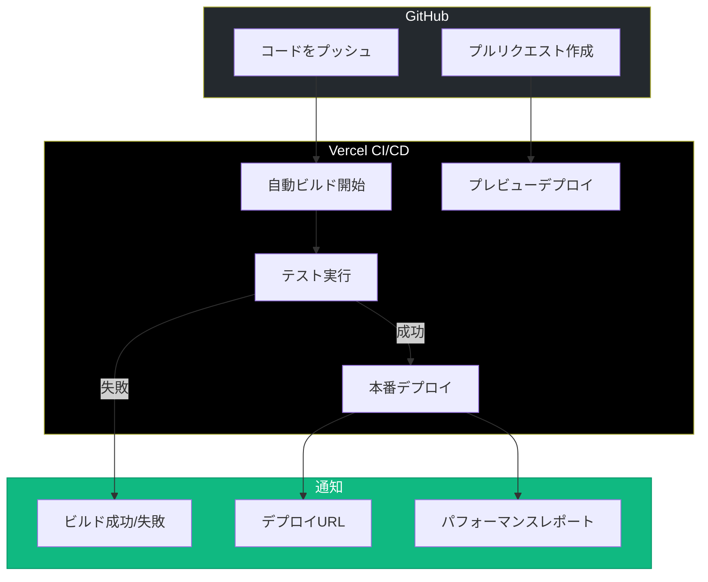

### **ブランチ戦略とデプロイ**

| ブランチ | デプロイ先 | 用途 | URL例 |
|---------|----------|------|-------|
| **main** | 本番環境 | 公開版 | app.vercel.app |
| **develop** | ステージング | テスト版 | app-git-develop.vercel.app |
| **feature/** | プレビュー | 機能確認 | app-git-feature-xxx.vercel.app |

---

## 📊 本番運用のベストプラクティス

### **運用チェックリスト**

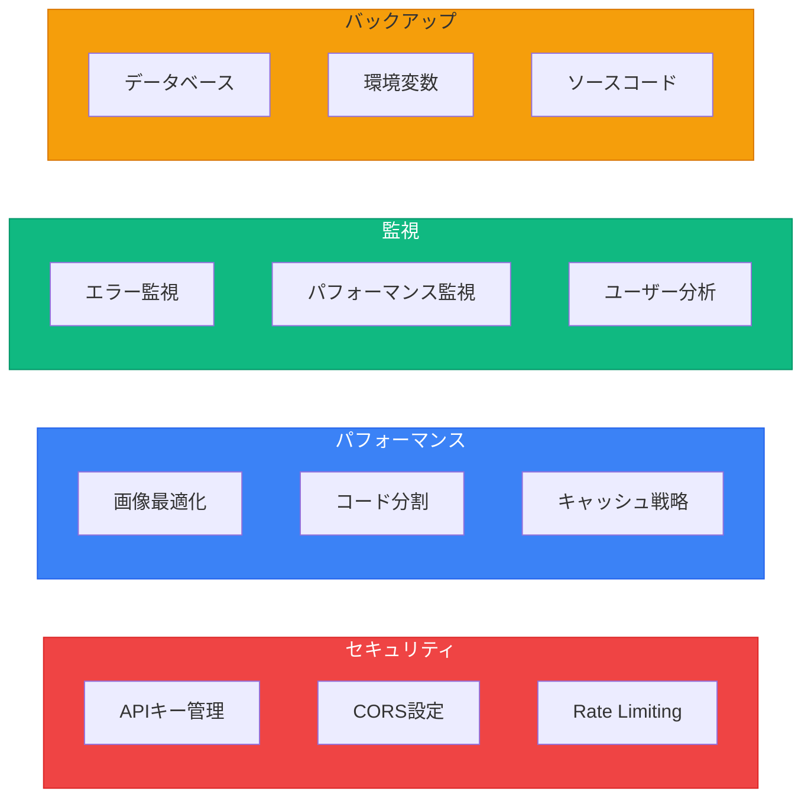

### **Vercel Analytics の活用**

```markdown
# Cursorへの指示：Analytics設定

Vercel Analyticsを有効化し、以下の監視設定を行ってください：

1. Web Vitalsの監視
   - LCP（Largest Contentful Paint）
   - FID（First Input Delay）
   - CLS（Cumulative Layout Shift）

2. エラー監視
   - クライアントサイドエラー
   - サーバーサイドエラー
   - API エラー率

3. パフォーマンス最適化の提案
   - 遅いページの特定
   - 改善ポイントの抽出

設定方法と、ダッシュボードの見方も説明してください。
```

### **ロールバック手順**

| 状況 | 対処法 | Cursorへの指示 |
|------|--------|--------------|
| **デプロイ失敗** | 前のバージョンに戻す | 「Vercelで前回成功したデプロイに戻す方法を教えてください」 |
| **本番エラー** | 緊急修正をデプロイ | 「ホットフィックスブランチを作成してデプロイする手順を教えてください」 |
| **データ不整合** | DBをロールバック | 「Supabaseでデータベースをバックアップから復元する方法を教えてください」 |

---

## 💡 この章のまとめ

- ✅ ビルド前にlint、型チェック、環境変数を必ず確認
- ✅ Vercelへのデプロイは3ステップ（準備・接続・設定）
- ✅ 環境変数は公開/秘密を明確に区別して管理
- ✅ CI/CDで自動デプロイを設定し、開発効率を向上
- ✅ 本番運用ではセキュリティ・パフォーマンス・監視を重視

## 🚀 次の章への橋渡し

ビルドとデプロイが完了しました。次の第5章では、デモデイでのプレゼンテーション準備と、効果的な発表方法を学びます。

---

# 第5章：プレゼンテーションの極意

## 🎯 この章で学ぶこと

- **ストーリーテリングの技術**で、聴衆の心を掴む方法
- **デモの効果的な見せ方**と、失敗を防ぐ準備
- **AI生成スライドの作成方法**で、Vibe Coderらしい発表を実現
- **質疑応答の対策**と、自信を持って答える技術
- **フィードバックの活用法**で、次の成長へつなげる

## 📌 この章の位置づけ

第4章でデプロイが完了しました。この章では、作成したアプリケーションを最も魅力的に見せるプレゼンテーション技術を学びます。第6章の学びの横展開へつながる重要なスキルです。

---

## 📖 ストーリーテリングの威力

### **プレゼンの黄金構成**

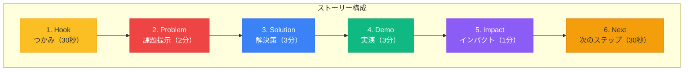

### **効果的なオープニング例**

| パターン | 例文 | 効果 |
|---------|------|------|
| **質問型** | 「毎日のタスク管理に何分使っていますか？」 | 共感を生む |
| **統計型** | 「日本人の73%が情報整理に悩んでいます」 | 説得力を持つ |
| **体験型** | 「先週、私は重要な会議を忘れそうになりました」 | 親近感を生む |
| **ビジョン型** | 「3ヶ月後、あなたの生産性は2倍になります」 | 期待感を生む |

### **ストーリーボード作成指示**

```markdown
# Cursorへの指示：プレゼンストーリーボード作成

以下の情報を基に、10分間のプレゼンテーションのストーリーボードを作成してください：

## アプリ情報
- 名前: [アプリ名]
- 解決する課題: [具体的な課題]
- ターゲットユーザー: [誰向けか]
- 主要機能: [3つの主要機能]

## プレゼン構成
1. Hook（30秒）: インパクトのあるオープニング
2. Problem（2分）: 課題の深堀りと共感
3. Solution（3分）: アプリの価値提案
4. Demo（3分）: 実演のシナリオ
5. Impact（1分）: 使用後の変化
6. Next（30秒）: 今後の展開

各セクションで話す内容と、スライドに表示する要素を具体的に記載してください。
```

---

## 🎬 デモの見せ方

### **デモの3原則**

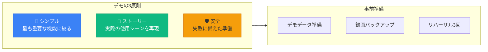

### **デモシナリオ例**

```markdown
## 効果的なデモの流れ（タスク管理アプリの例）

### 1. 現状の課題を見せる（30秒）
「まず、従来の方法での問題を見てみましょう」
- 散らばったメモ、複数のツール

### 2. ログインから開始（30秒）
「では、実際にアプリを使ってみます」
- スムーズなGoogle認証でログイン

### 3. メイン機能の実演（90秒）
「タスクを追加してみましょう」
- 音声入力でタスク作成
- 自動的にカテゴリ分類
- 期限の自動提案

### 4. 価値を体感させる（60秒）
「1週間使った結果がこちらです」
- ダッシュボードで成果を可視化
- 生産性が30%向上したグラフ

### 5. 共有機能で締める（30秒）
「チームでも使えます」
- ワンクリックでチーム共有
```

### **デモ失敗時の対策**

| トラブル | 事前準備 | 当日の対処 |
|---------|---------|-----------|
| **ネットワークエラー** | 録画を用意 | 「念のため録画もご覧ください」 |
| **ログイン失敗** | デモアカウント複数用意 | 別アカウントに切り替え |
| **機能が動かない** | スクリーンショット準備 | 「通常はこのように動作します」 |
| **データが表示されない** | サンプルデータ事前投入 | リロードして再試行 |

---

## 🎨 AI生成スライドの作成

### **Vibe Coderらしいスライド作成**

```markdown
# Cursorへの指示：プレゼンスライド生成

Markdownベースのプレゼンテーションを作成してください。
reveal.jsを使用して、ブラウザで表示できる形式にします。

## スライド構成
1. タイトルスライド
   - アプリ名
   - キャッチコピー
   - 発表者名

2. 課題提示（3スライド）
   - 現状の問題点
   - ユーザーの声
   - 解決の必要性

3. ソリューション（4スライド）
   - アプリの概要
   - 主要機能1
   - 主要機能2
   - 主要機能3

4. デモ（1スライド）
   - 「実際にお見せします」

5. 成果（2スライド）
   - 使用前後の比較
   - ユーザーフィードバック

6. 技術スタック（1スライド）
   - 使用技術の一覧
   - AI活用のポイント

7. 今後の展開（1スライド）
   - ロードマップ
   - ビジョン

8. Thank you（1スライド）
   - 連絡先
   - QRコード

各スライドにアニメーションと適切な画像プレースホルダーを含めてください。
```

### **スライドデザインの原則**

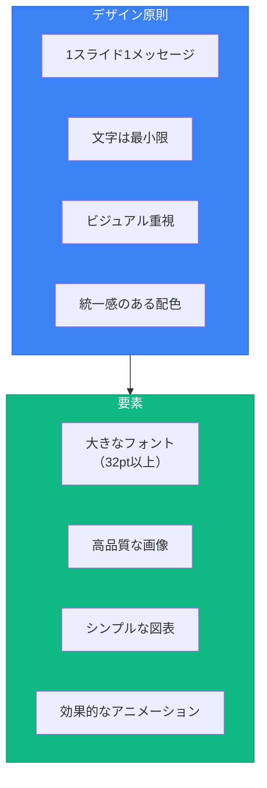

---

## 💬 質疑応答の準備

### **想定質問と回答準備**

| 質問カテゴリ | 想定質問 | 回答のポイント |
|------------|---------|------------|
| **技術面** | 「なぜこの技術スタックを選んだのですか？」 | 学習曲線、コスト、将来性を説明 |
| **ビジネス面** | 「収益モデルはどう考えていますか？」 | 現時点では価値検証、将来の可能性を示す |
| **課題面** | 「最も苦労した点は何ですか？」 | 具体的な問題と解決プロセスを共有 |
| **AI活用** | 「AIをどのように活用しましたか？」 | 具体的なプロンプトと効果を説明 |
| **今後** | 「次に追加したい機能は？」 | ユーザーフィードバックを基にした計画を説明 |

### **答えにくい質問への対処法**

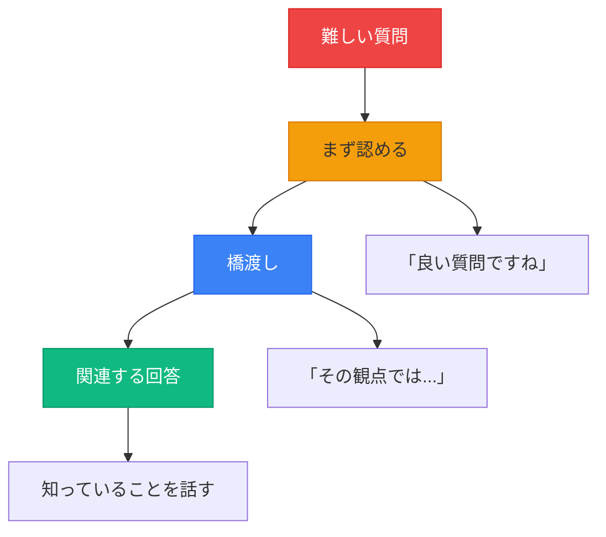

---

## 📈 フィードバックの活用

### **フィードバック収集シート**

```markdown
# デモデイ フィードバック記録

## 肯定的フィードバック
- [ ] UI/UXについて
- [ ] 機能について
- [ ] プレゼンについて

## 改善提案
- [ ] 追加してほしい機能
- [ ] 使いにくかった点
- [ ] 不明確だった説明

## 新しいアイデア
- [ ] 連携可能性
- [ ] 別の活用方法
- [ ] 横展開の可能性

## アクションアイテム
1. 優先度高: [1週間以内に対応]
2. 優先度中: [1ヶ月以内に検討]
3. 優先度低: [将来的に検討]
```

---

## 💡 この章のまとめ

- ✅ ストーリーテリングで聴衆の心を掴む（Hook → Problem → Solution）
- ✅ デモは「シンプル・ストーリー・安全」の3原則を守る
- ✅ スライドはMarkdown + reveal.jsでVibe Coderらしく作成
- ✅ 想定質問への準備と、答えにくい質問への対処法を用意
- ✅ フィードバックを次の成長の糧として活用

## 🚀 次の章への橋渡し

プレゼンテーションの準備が整いました。次の第6章では、デモデイで得た学びを業務全体へ横展開し、組織の生産性向上につなげる方法を探ります。

---

# 第6章：学びの横展開

## 🎯 この章で学ぶこと

- **AI駆動開発の他業務への応用**で、組織全体の生産性を向上
- **チームへの知識共有方法**と、Vibe Coder文化の醸成
- **継続的な学習とスキルアップ**のためのロードマップ
- **次のプロジェクトへの展開**と、より大きな価値創造
- **コミュニティへの貢献**で、エコシステムの発展に寄与

## 📌 この章の位置づけ

第5章でプレゼンテーションを完了しました。この章では、VibeCoder育成プログラムで得た知識とスキルを、個人の成長から組織の変革へとスケールアップする方法を学びます。最終章へ向けた総まとめの準備です。

---

## 🔄 AI駆動開発の他業務への応用

### **応用可能な5つの領域**

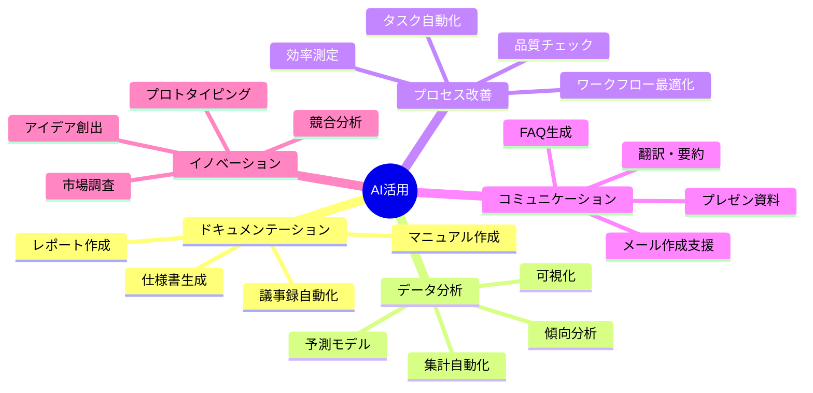

### **具体的な活用例と効果**

| 業務カテゴリ | 従来の方法 | AI活用後 | 効果 |
|------------|-----------|---------|------|
| **議事録作成** | 手動で1時間 | 音声→テキスト→構造化で15分 | **75%削減** |
| **データ分析** | Excel手作業で半日 | AIで自動集計・可視化で1時間 | **87%削減** |
| **メール返信** | 1通10分 | テンプレート生成で2分 | **80%削減** |
| **企画書作成** | 2日かけて作成 | AIと対話しながら半日 | **75%削減** |
| **コードレビュー** | 人力で2時間 | AI支援で30分 | **75%削減** |

### **業務別Cursorプロンプト集**

```markdown
# 業務効率化プロンプトテンプレート集

## 1. 議事録作成
```
以下の会議メモから、構造化された議事録を作成してください：
- 日時、参加者、議題を明記
- 決定事項、アクションアイテム、次回予定を整理
- 担当者と期限を明確化
[会議メモをペースト]
```

## 2. データ分析レポート
```
以下のデータから分析レポートを作成してください：
- 主要な傾向とインサイトを3つ
- グラフ作成用のコードも生成
- 改善提案を3つ含める
[データをペースト]
```

## 3. プロセス改善提案
```
以下の業務プロセスの改善案を提案してください：
- 現状の問題点を整理
- 改善後のフローをMermaid図で作成
- 期待される効果を数値で示す
[現在のプロセスを説明]
```
```

---

## 👥 チームへの知識共有

### **知識共有の4ステップ**

```mermaid
flowchart TB
    subgraph Step1["1. 小さな成功体験"]
        S1A["簡単なタスクから開始"]
        S1B["即効性のある改善"]
        S1C["目に見える成果"]
    end

    subgraph Step2["2. ハンズオン勉強会"]
        S2A["実際に手を動かす"]
        S2B["ペアプログラミング"]
        S2C["質問しやすい環境"]
    end

    subgraph Step3["3. 社内事例の蓄積"]
        S3A["成功事例の文書化"]
        S3B["ナレッジベース構築"]
        S3C["ベストプラクティス共有"]
    end

    subgraph Step4["4. 文化として定着"]
        S4A["評価制度への組み込み"]
        S4B["ツール標準化"]
        S4C["継続的改善"]
    end

    Step1 --> Step2
    Step2 --> Step3
    Step3 --> Step4

    style Step1 fill:#3b82f6,stroke:#2563eb,color:#fff
    style Step2 fill:#10b981,stroke:#059669,color:#fff
    style Step3 fill:#f59e0b,stroke:#d97706
    style Step4 fill:#8b5cf6,stroke:#7c3aed,color:#fff
```

### **社内勉強会の企画案**

| 回 | テーマ | 内容 | 成果物 |
|----|--------|------|--------|
| **第1回** | AI基礎理解 | ChatGPT/Claude体験 | 簡単なテキスト生成 |
| **第2回** | Cursor入門 | 環境構築とHello World | 初めてのWebページ |
| **第3回** | 要件定義 | AIと対話で仕様作成 | 企画書1本 |
| **第4回** | 実装体験 | 簡単なアプリ作成 | 動くプロトタイプ |
| **第5回** | デプロイ | Vercelへの公開 | 公開URL |

---

## 📈 継続的な学習ロードマップ

### **スキルアップの道筋**

```mermaid
graph TB
    subgraph Level1["🌱 初級（1-3ヶ月）"]
        L1A["基本的なプロンプト作成"]
        L1B["既存コードの修正"]
        L1C["簡単なUI作成"]
    end

    subgraph Level2["🌿 中級（3-6ヶ月）"]
        L2A["フルスタック開発"]
        L2B["API連携"]
        L2C["データベース設計"]
    end

    subgraph Level3["🌳 上級（6-12ヶ月）"]
        L3A["アーキテクチャ設計"]
        L3B["パフォーマンス最適化"]
        L3C["セキュリティ実装"]
    end

    subgraph Level4["🏆 エキスパート（1年以上）"]
        L4A["AI活用の最適化"]
        L4B["チーム開発リード"]
        L4C["新技術の評価・導入"]
    end

    Level1 --> Level2
    Level2 --> Level3
    Level3 --> Level4

    style Level1 fill:#10b981,stroke:#059669,color:#fff
    style Level2 fill:#3b82f6,stroke:#2563eb,color:#fff
    style Level3 fill:#8b5cf6,stroke:#7c3aed,color:#fff
    style Level4 fill:#fbbf24,stroke:#f59e0b
```

### **学習リソースと活用方法**

| リソース | 内容 | 活用方法 |
|---------|------|---------|
| **公式ドキュメント** | 最新情報・ベストプラクティス | 週1回は確認、変更点を把握 |
| **YouTubeチュートリアル** | 実装方法の動画解説 | 新機能を試す際に参照 |
| **GitHub** | オープンソースプロジェクト | コードリーディングで学習 |
| **技術ブログ** | 実践的なTips | 週末にまとめて読む |
| **コミュニティ** | Q&A、最新トレンド | 積極的に質問・回答 |

---

## 🚀 次のプロジェクトへの展開

### **プロジェクト規模の拡大戦略**

```mermaid
flowchart LR
    subgraph Phase1["フェーズ1: 個人"]
        P1["個人の業務効率化<br/>小さなツール作成"]
    end

    subgraph Phase2["フェーズ2: チーム"]
        P2["チーム用ツール<br/>部門システム"]
    end

    subgraph Phase3["フェーズ3: 部門"]
        P3["部門横断システム<br/>業務プロセス改革"]
    end

    subgraph Phase4["フェーズ4: 全社"]
        P4["全社システム<br/>DXプロジェクト"]
    end

    Phase1 -->|3ヶ月| Phase2
    Phase2 -->|6ヶ月| Phase3
    Phase3 -->|1年| Phase4

    style Phase1 fill:#10b981,stroke:#059669,color:#fff
    style Phase2 fill:#3b82f6,stroke:#2563eb,color:#fff
    style Phase3 fill:#f59e0b,stroke:#d97706
    style Phase4 fill:#8b5cf6,stroke:#7c3aed,color:#fff
```

### **次のプロジェクトアイデア**

| カテゴリ | プロジェクト例 | 期待効果 |
|---------|-------------|---------|
| **業務自動化** | 経費精算システム | 処理時間80%削減 |
| **情報共有** | 社内ナレッジベース | 問い合わせ50%削減 |
| **顧客対応** | AIチャットボット | 対応速度90%向上 |
| **分析ツール** | 売上予測ダッシュボード | 意思決定速度2倍 |
| **教育システム** | オンボーディングツール | 教育期間50%短縮 |

---

## 🌍 コミュニティへの貢献

### **貢献の方法と価値**

```mermaid
graph TB
    subgraph Contribution["貢献方法"]
        C1["ブログ記事執筆"]
        C2["オープンソース貢献"]
        C3["勉強会での発表"]
        C4["SNSでの情報発信"]
        C5["初心者のサポート"]
    end

    subgraph Value["得られる価値"]
        V1["知識の定着"]
        V2["ネットワーク拡大"]
        V3["スキルの向上"]
        V4["キャリアの発展"]
        V5["社会への貢献"]
    end

    Contribution --> Value

    style Contribution fill:#3b82f6,stroke:#2563eb,color:#fff
    style Value fill:#10b981,stroke:#059669,color:#fff
```

---

## 💡 この章のまとめ

- ✅ AI駆動開発は、コーディング以外の全業務に応用可能
- ✅ チームへの知識共有は、小さな成功体験から始める
- ✅ 継続的な学習で、初級から エキスパートへ成長
- ✅ プロジェクト規模を段階的に拡大し、組織全体のDXへ
- ✅ コミュニティへの貢献が、自己成長を加速させる

## 🚀 次の章への橋渡し

学びの横展開方法を理解しました。最終章では、VibeCoder育成プログラム全体を振り返り、あなたが今後進むべき道筋と、Vibe Coderとしての未来展望を描きます。

---

# 第7章：未来への期待と総まとめ

## 🎯 この章で学ぶこと

- **VibeCoder育成プログラムの振り返り**と、獲得したスキルの棚卸し
- **AI技術の未来展望**と、さらなる可能性の理解
- **キャリアパスの選択肢**と、Vibe Coderとしての成長戦略
- **最終チェックリスト**で、デモデイへの準備完了を確認
- **講師からのメッセージ**と、新しい旅立ちへのエール

## 📌 この章の位置づけ

これまでの6章で、デモデイに向けたすべての準備を整えました。この最終章では、プログラム全体を振り返り、あなたが歩み始めたVibe Coderとしての道のりを確認し、輝かしい未来への第一歩を踏み出します。

---

## 🎓 プログラムの振り返り

### **4回の講義で得たもの**

```mermaid
graph TB
    subgraph Lecture1["第1回: マインドセット"]
        L1A["AI駆動開発の可能性"]
        L1B["Vibe Coderの定義"]
        L1C["成長思考の獲得"]
    end

    subgraph Lecture2["第2回: 基礎技術"]
        L2A["Web開発の仕組み"]
        L2B["技術スタック理解"]
        L2C["要件定義スキル"]
    end

    subgraph Lecture3["第3回: 実装技術"]
        L3A["データベース設計"]
        L3B["認証システム実装"]
        L3C["フルスタック開発"]
    end

    subgraph Lecture4["第4回: 本番運用"]
        L4A["ビルド・デプロイ"]
        L4B["プレゼンテーション"]
        L4C["価値の証明"]
    end

    Lecture1 --> Lecture2
    Lecture2 --> Lecture3
    Lecture3 --> Lecture4
    Lecture4 --> You["🏆 Vibe Coder"]

    style Lecture1 fill:#3b82f6,stroke:#2563eb,color:#fff
    style Lecture2 fill:#10b981,stroke:#059669,color:#fff
    style Lecture3 fill:#f59e0b,stroke:#d97706
    style Lecture4 fill:#8b5cf6,stroke:#7c3aed,color:#fff
    style You fill:#fbbf24,stroke:#f59e0b
```

### **スキルマトリクス - Before & After**

| スキル領域 | **Before（受講前）** | **After（受講後）** | 成長度 |
|-----------|-------------------|------------------|--------|
| **プログラミング** | 全くできない | 基本的な実装が可能 | ★★★★☆ |
| **AI活用** | ChatGPT少し | 高度なプロンプティング | ★★★★★ |
| **要件定義** | 曖昧な要望 | 構造化された仕様書 | ★★★★☆ |
| **データベース** | 概念も不明 | 設計・実装可能 | ★★★★☆ |
| **デプロイ** | 経験なし | Vercelで公開可能 | ★★★★★ |
| **プレゼン** | 従来型 | ストーリーテリング | ★★★★☆ |

---

## 🔮 AI技術の未来展望

### **2025-2027年の技術トレンド**

```mermaid
mindmap
  root((AI未来))
    2025年
      マルチモーダルAI
      コード自動生成95%
      リアルタイムコラボ
      音声プログラミング
    2026年
      完全自律型開発
      AI間の協調作業
      量子コンピューティング
      脳波インターフェース
    2027年
      AGI（汎用人工知能）
      創造的問題解決
      完全自動化システム
      新たな職業の創出
```

### **Vibe Coderの進化予測**

| 時期 | 進化段階 | 必要スキル | 価値創造 |
|------|---------|-----------|---------|
| **現在** | AI協働 | プロンプティング | 10倍の生産性 |
| **1年後** | AI統合 | システム設計 | 100倍の生産性 |
| **3年後** | AI指揮 | ビジョン創造 | 1000倍の価値 |
| **5年後** | AI共創 | 哲学的思考 | 新産業の創出 |

---

## 🛤️ キャリアパスの選択肢

### **Vibe Coderの4つの道**

```mermaid
graph TB
    VibeCoder["Vibe Coder"]

    VibeCoder --> Path1["🚀 起業家"]
    VibeCoder --> Path2["💼 社内イノベーター"]
    VibeCoder --> Path3["🎓 教育者・伝道師"]
    VibeCoder --> Path4["🔬 研究開発者"]

    Path1 --> P1["AIスタートアップ創業<br/>新サービス開発"]
    Path2 --> P2["DX推進リーダー<br/>業務改革推進"]
    Path3 --> P3["AI教育プログラム<br/>次世代育成"]
    Path4 --> P4["最先端技術開発<br/>イノベーション創出"]

    style VibeCoder fill:#fbbf24,stroke:#f59e0b
    style Path1 fill:#3b82f6,stroke:#2563eb,color:#fff
    style Path2 fill:#10b981,stroke:#059669,color:#fff
    style Path3 fill:#8b5cf6,stroke:#7c3aed,color:#fff
    style Path4 fill:#ef4444,stroke:#dc2626,color:#fff
```

### **年収とキャリアの可能性**

| キャリアパス | 1年後 | 3年後 | 5年後 |
|------------|-------|-------|-------|
| **起業家** | 500-1000万円 | 1000-5000万円 | 1億円以上可能 |
| **社内イノベーター** | 600-800万円 | 800-1200万円 | 1500-2000万円 |
| **教育者** | 500-700万円 | 700-1000万円 | 1000-1500万円 |
| **研究開発者** | 600-900万円 | 900-1500万円 | 1500-3000万円 |

---

## ✅ 最終チェックリスト

### **デモデイ前日チェック**

```mermaid
flowchart TB
    subgraph Technical["技術面"]
        T1["☐ アプリが本番で動作"]
        T2["☐ デモデータ準備完了"]
        T3["☐ バックアップ録画準備"]
        T4["☐ 環境変数設定確認"]
    end

    subgraph Presentation["プレゼン面"]
        P1["☐ スライド完成"]
        P2["☐ デモシナリオ確定"]
        P3["☐ 時間配分確認"]
        P4["☐ 質問対策準備"]
    end

    subgraph Mental["メンタル面"]
        M1["☐ 十分な睡眠"]
        M2["☐ リハーサル完了"]
        M3["☐ 自信を持つ"]
        M4["☐ 楽しむ準備"]
    end

    Technical --> Ready["🎯 準備完了！"]
    Presentation --> Ready
    Mental --> Ready

    style Technical fill:#3b82f6,stroke:#2563eb,color:#fff
    style Presentation fill:#10b981,stroke:#059669,color:#fff
    style Mental fill:#f59e0b,stroke:#d97706
    style Ready fill:#8b5cf6,stroke:#7c3aed,color:#fff
```

### **提出物最終確認**

| 提出物 | チェック項目 | 提出先 |
|--------|------------|--------|
| **GitHubリポジトリ** | README完備、コミット履歴 | 指定URL |
| **デプロイURL** | 動作確認済み、HTTPS | Vercel |
| **プレゼン資料** | Markdown/HTML形式 | 指定フォルダ |
| **運用チェックリスト** | 環境変数、手順書 | Notion/Markdown |

---

## 💬 講師からのメッセージ

### **泉水亮介より**

> **「2022年12月、私もあなたと同じスタートラインに立っていました」**

プログラミング経験ゼロ、コードが1行も書けなかった私が、今では80本以上のアプリを開発し、このプログラムを通じて多くの方々の人生を変えるお手伝いをしています。

**あなたも必ずできます。**

なぜなら、あなたはすでに最も重要な一歩を踏み出したからです。
「始める」という決断をし、ここまで学び続けてきました。

### **3つの約束**

1. **🌟 あなたには無限の可能性がある**
   - 年齢も、経験も、背景も関係ありません
   - 必要なのは好奇心と継続する意志だけ

2. **🤝 あなたは一人ではない**
   - Vibe Coderコミュニティが支えます
   - 困ったときは必ず助けが得られます

3. **🚀 これはゴールではなくスタート**
   - デモデイは新しい旅の第一歩
   - ここから本当の冒険が始まります

---

## 🎯 行動への呼びかけ

### **今すぐ実行すべき3つのこと**

```mermaid
graph LR
    Now["今この瞬間"]

    Now --> Action1["1. デモの最終確認<br/>（30分）"]
    Now --> Action2["2. 明日の準備<br/>（30分）"]
    Now --> Action3["3. 深呼吸して休む<br/>（しっかり睡眠）"]

    Action1 --> Tomorrow["明日のデモデイ"]
    Action2 --> Tomorrow
    Action3 --> Tomorrow

    Tomorrow --> Future["輝かしい未来"]

    style Now fill:#fbbf24,stroke:#f59e0b
    style Action1 fill:#3b82f6,stroke:#2563eb,color:#fff
    style Action2 fill:#10b981,stroke:#059669,color:#fff
    style Action3 fill:#8b5cf6,stroke:#7c3aed,color:#fff
    style Tomorrow fill:#ef4444,stroke:#dc2626,color:#fff
    style Future fill:#fbbf24,stroke:#f59e0b
```

---

## 💡 この章のまとめ

- ✅ 4回の講義で、非エンジニアからVibe Coderへ変貌を遂げた
- ✅ AI技術の進化と共に、さらなる可能性が広がっている
- ✅ 起業家、イノベーター、教育者、研究者など多様なキャリアパスがある
- ✅ デモデイは終わりではなく、新しい始まり
- ✅ あなたには世界を変える力がある

## 🚀 エピローグ

**おめでとうございます！**

あなたは VibeCoder育成プログラムを完走しました。

明日のデモデイで、あなたの作品と情熱を世界に示してください。
そして、その先にある無限の可能性に向かって、勇敢に進んでください。

**Welcome to the Vibe Coder Community!**

あなたの成功を心から祈っています。

---

*TEKION Group / VibeCoder育成プログラム*
*2025年11月版*