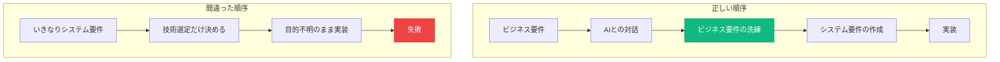
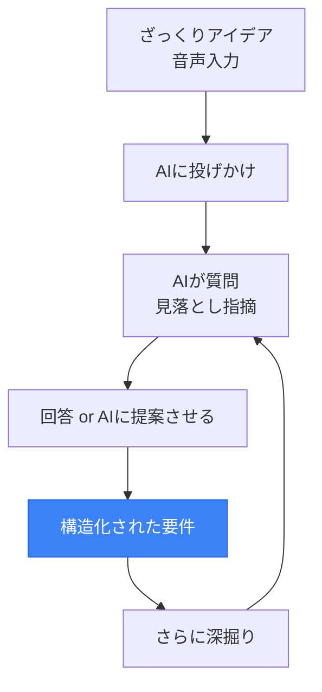
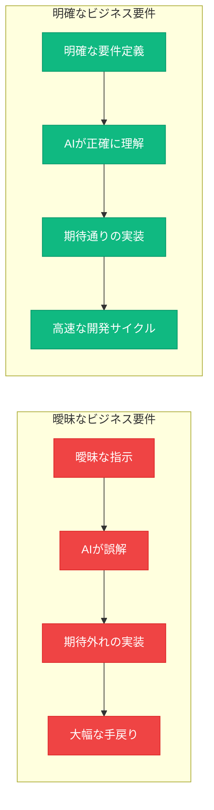
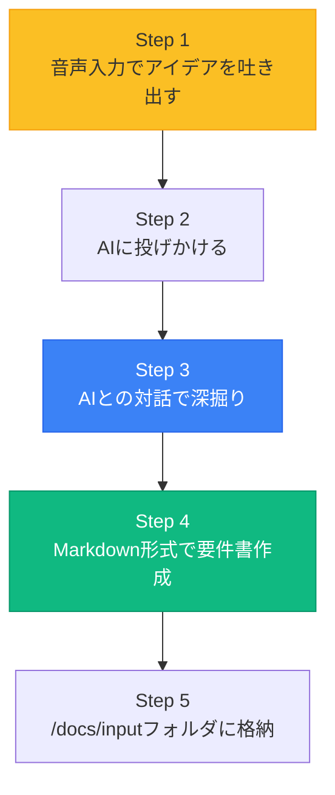

# 第一回講義 Part 3: ビジネス要件定義の実践

> **Part 2からの継続**：LLMの仕組みとプロンプトエンジニアリングを理解したあなたは、今度はその知識を活かして「AIが理解できるビジネス要件」を作り上げます。

---

## 🎯 Part 3の学習目標

このPartを終えると、以下ができるようになります：

✅ ビジネス要件とシステム要件の違いを理解する
✅ 音声入力でアイデアを効率的にテキスト化する
✅ AIとの対話でビジネス要件を洗練させる
✅ Markdown形式で構造化されたビジネス要件書を作成する
✅ `/docs/input`フォルダに要件を格納し、プロジェクトを開始できる

**重要な理解**：
> 💡 **ビジネス要件定義は「AIへの最高の指示書」を作る作業**
>
> あなたの頭の中の「やりたいこと」を、AIが100%理解できる形に変換する。
> これができれば、AI駆動開発の9割は成功したも同然。

---

## 📚 本パートのアジェンダ

### **1. ビジネス要件定義とは何か** (10分)
- ビジネス要件 vs システム要件
- AI駆動開発における要件定義の特徴
- なぜビジネス要件が最重要なのか

### **2. 音声入力からAI対話へ：実践フロー** (20分)
- 音声入力でアイデアを吐き出す
- AIとの対話でビジネス要件を深掘り
- ビジネス要件チェックリスト

### **3. Markdown形式での要件書作成** (15分)
- ビジネス要件書の構造
- `/docs/input`への格納ルール
- 実例：SNSアプリのビジネス要件書

### **4. 実践演習** (10分)
- あなたのアイデアでビジネス要件書を作成

---

## 第1章　ビジネス要件定義とは何か

### ビジネス要件 vs システム要件：決定的な違い

#### **ビジネス要件（Business Requirements）**

**定義**：
> 「なぜ作るのか」「誰のために作るのか」「何を解決するのか」を明確にする

```
【ビジネス要件の例：タスク管理アプリ】

■ プロジェクト目的
個人の生産性を向上させるため、シンプルで使いやすいタスク管理ツールを提供する

■ ターゲットユーザー
- 20-40代の個人（フリーランス、会社員、学生）
- タスク管理に苦手意識がある人
- 複雑なツールに挫折した経験がある人

■ 解決する課題
- 既存ツールは機能が多すぎて使いこなせない
- タスクを書き出すこと自体がストレス
- 完了したタスクが見えず、達成感が得られない

■ 成功指標（KPI）
- ユーザーがアプリを3日以上継続使用する率: 60%以上
- 1日あたりのタスク登録数: 平均3個以上
- タスク完了率: 70%以上

■ ビジネス制約
- 開発期間: 1ヶ月以内
- 運用コスト: 月額0円（無料枠内）
- 開発メンバー: 1名（あなた）

■ 非目標（やらないこと）
- チーム向け機能（コラボレーション）
- 複雑なガントチャート
- 有料課金機能
```

---

#### **システム要件（System Requirements）**

**定義**：
> 「どう作るのか」「どんな技術を使うのか」「どう実装するのか」を明確にする

```
【システム要件の例：タスク管理アプリ】

■ 技術スタック
- フロントエンド: Next.js 15 (App Router), TypeScript, Tailwind CSS
- バックエンド: Supabase (PostgreSQL, Auth, Storage)
- 認証: Supabase Auth (Google OAuth)
- ホスティング: Vercel

■ データベース設計
- users テーブル（id, email, name, created_at）
- tasks テーブル（id, user_id, title, description, completed, due_date）
- categories テーブル（id, user_id, name, color）

■ API設計
- GET /api/tasks - タスク一覧取得
- POST /api/tasks - タスク作成
- PUT /api/tasks/:id - タスク更新
- DELETE /api/tasks/:id - タスク削除

■ UI/UX設計
- ダッシュボード画面（タスク一覧表示）
- タスク作成モーダル
- タスク詳細画面

■ 非機能要件
- ページ読み込み時間: 2秒以内
- 同時接続数: 100ユーザー
- 可用性: 99.9%
```

---

### 重要な原則：ビジネス要件が先、システム要件は後



**なぜビジネス要件が先なのか？**

> 🎯 **「何を作るか」が明確でなければ、「どう作るか」は意味がない**
>
> - ビジネス要件 = プロジェクトの羅針盤
> - システム要件 = 羅針盤に従って進むための手段
> - 羅針盤がなければ、どこに向かっているかわからない

---

### AI駆動開発における要件定義の特徴

#### **従来の要件定義との違い**

| 観点 | 従来の要件定義 | AI駆動要件定義 |
|------|--------------|--------------|
| **作成者** | ビジネスアナリスト、PM | あなた + AI |
| **所要時間** | 2週間〜2ヶ月 | 数時間〜数日 |
| **形式** | Word、Excel、専用ツール | Markdown（テキスト） |
| **粒度** | 最初から詳細まで記述 | 段階的に深掘り |
| **更新頻度** | 低（変更管理が大変） | 高（Git管理で容易） |
| **AIとの親和性** | 低（構造が複雑） | 高（テキストベース） |

---

#### **AI駆動要件定義の3つの強み**

##### **1️⃣ 対話型アプローチ**



- AIとの対話を通じた要件の深掘り
- 見落としを防ぐAIからの質問
- 多角的な視点での分析

---

##### **2️⃣ Markdown形式の利点**

Part 2で学んだ「Text is KING」の原則を思い出してください：

```
✅ AIが理解しやすい
   → Attention機構が適切に機能

✅ バージョン管理が容易
   → Gitで変更履歴を完全管理

✅ 可搬性が高い
   → どのエディタでも編集可能

✅ 自動化との親和性
   → PDFやHTML生成が簡単
```

---

##### **3️⃣ 継続的改善**

```
従来：要件定義 → 完了 → 実装開始 → 変更は大変

AI駆動：要件定義 → 実装 → フィードバック → 要件更新 → 実装
        ↑_______________________________________________|
```

開発と並行して要件を洗練できる

---

### なぜビジネス要件が最重要なのか

#### **ビジネス要件の品質 = 最終成果物の品質**



---

#### **実例：曖昧 vs 明確な要件の違い**

**❌ 曖昧なビジネス要件**

```markdown
# プロジェクト概要
SNSアプリを作りたい

# 目的
みんなが使えるSNS

# 機能
- 投稿できる
- いいねできる
- フォローできる
```

**これでは何が問題か？**
- 「みんな」とは誰？
- どんな課題を解決する？
- なぜ既存のSNSではダメなのか？
- どんな価値を提供する？

**AIの心の声**：
> 「みんな」って誰...？Twitterみたいなもの？Instagramみたいなもの？
> 何に注目すればいいの...？

---

**✅ 明確なビジネス要件**

```markdown
# プロジェクト概要
**プロジェクト名**: StudyCircle
**一言説明**: 学習仲間と繋がり、学習記録を共有するSNS

# 目的
学習者の孤独感を解消し、継続的な学習を支援する

# ターゲットユーザー
- 20-30代の社会人（特にIT学習者）
- 独学で挫折しやすい人
- 学習仲間を求めている人

# 解決する課題
- 独学は孤独で継続が難しい
- 学習記録を残す場所がない
- 同じ目標を持つ仲間が見つからない

# 提供する価値
- 学習記録を投稿し、可視化できる
- 同じ分野の学習者と繋がれる
- 達成感とモチベーションを維持できる

# 成功指標（KPI）
- ユーザー登録後7日間の継続率: 50%以上
- 1週間あたりの投稿数: 平均3投稿
- ユーザー同士のエンゲージメント率: 30%以上

# ビジネス制約
- 開発期間: 2ヶ月以内
- 運用コスト: 月額0円（無料枠内）
- 開発メンバー: 1名

# 非目標（やらないこと）
- 動画共有機能
- リアルタイムチャット
- 有料課金機能（MVP段階では）
```

**AIの心の声**：
> 完璧に理解しました！学習記録SNSですね。
> ターゲットは20-30代IT学習者、孤独感解消が目的。
> これなら適切な設計ができます！

---

## 第2章　音声入力からAI対話へ：実践フロー

### AI駆動ビジネス要件定義の5ステップ



---

### Step 1: 音声入力でアイデアを吐き出す

Part 2で学んだ音声入力を活用します。

#### **音声入力の実践Tips（再掲）**

```
✅ 完璧を求めない
   → 80%の精度で十分、あとはAIが整理

✅ 思考の流れのまま話す
   → 「えーと」「あの」も気にしない

✅ 専門用語は区切る
   「React（ポーズ）TypeScript（ポーズ）」

✅ 修正はAIに任せる
   → 構造化はAIの得意分野
```

---

#### **実例：音声入力でアイデアを吐き出す**

**あなた（音声）**：
```
えーと、作りたいのは、学習記録を共有できるSNSです。
理由は、自分が独学でプログラミング学習してるんですけど、
すごく孤独で挫折しそうになるんですよね。
同じように勉強してる人と繋がりたいし、
自分がどれだけ勉強したか記録も残したい。

ターゲットは20代から30代の社会人で、特にIT系の勉強してる人。
機能としては、学習記録を投稿できて、他の人の投稿にいいねできて、
フォローもできるようにしたい。

期間は2ヶ月くらいで、自分一人で作れるくらいシンプルにしたいです。
予算はほぼゼロで、無料のサービスを使って。

ただ、動画とかリアルタイムチャットとか、複雑な機能はいらないです。
まずはシンプルに、学習記録を投稿して、繋がれるだけでいい。
```

**↓ 音声入力がテキスト化 ↓**

```
えーと、作りたいのは、学習記録を共有できるSNSです。理由は、自分が独学で
プログラミング学習してるんですけど、すごく孤独で挫折しそうになるんですよね。
同じように勉強してる人と繋がりたいし、自分がどれだけ勉強したか記録も
残したい。ターゲットは20代から30代の社会人で、特にIT系の勉強してる人。
機能としては、学習記録を投稿できて、他の人の投稿にいいねできて、フォロー
もできるようにしたい。期間は2ヶ月くらいで、自分一人で作れるくらいシンプル
にしたいです。予算はほぼゼロで、無料のサービスを使って。ただ、動画とか
リアルタイムチャットとか、複雑な機能はいらないです。まずはシンプルに、
学習記録を投稿して、繋がれるだけでいい。
```

**完璧でなくてOK！**これをAIに投げます。

---

### Step 2: AIに投げかける

音声入力でテキスト化したアイデアを、AIに投げかけます。

#### **初期プロンプト（テンプレート）**

```
あなたは最高のビジネスアナリストです。
私のアイデアを、AIが理解できる「ビジネス要件」として整理してください。

以下は音声入力で吐き出した、私のラフなアイデアです：

---
[ここに音声入力したテキストをペースト]
---

このアイデアを基に、以下の観点から質問してください：
1. プロジェクトの目的と解決する課題
2. ターゲットユーザーの詳細
3. 提供する価値
4. 成功指標（KPI）
5. ビジネス制約
6. 非目標（やらないこと）

まず、私のアイデアを理解した上で、
不足している情報や曖昧な点について質問してください。
```

---

### Step 3: AIとの対話で深掘り

AIからの質問に答えていくことで、要件を洗練させます。

#### **AIとの対話例**

**AI**：
```
アイデアを理解しました。学習記録共有SNS、素晴らしいですね。
いくつか質問させてください：

■ ターゲットユーザーについて
1. 「IT系の勉強してる人」とありますが、具体的にどんな学習内容ですか？
   - プログラミング全般？
   - 特定の言語（Python, JavaScript等）？
   - 資格試験（AWS, 情報処理等）？

2. 学習レベルはどのあたりを想定していますか？
   - 完全初心者？
   - 既に仕事でコード書いてる人がスキルアップ？
   - 転職目的で学習してる人？

■ 解決する課題について
3. 「孤独で挫折しそう」とのことですが、既存のSNS（Twitter、Discordなど）
   では解決できない理由は何でしょうか？

4. 学習記録を残す場所がないとのことですが、ブログやNotionでは
   なぜダメなのでしょうか？

■ 成功指標について
5. どうなったら「成功」と言えますか？
   - 何人のユーザーに使ってほしい？
   - どれくらいの頻度で使ってほしい？
   - 何をもって「継続」と判断しますか？

まずはこれらの質問に答えていただけますか？
```

---

**あなた（音声 or テキスト）**：
```
1. プログラミング全般ですね。特に初心者から中級者向け。
   PythonやJavaScript、Web開発とかAI学習とか。

2. 学習レベルは初心者から中級者。転職目的で勉強してる人や、
   副業したくて勉強してる人も含めたいです。

3. Twitterは情報量が多すぎて、自分の学習記録が埋もれる。
   Discordはリアルタイム性が高すぎて、自分のペースで続けられない。
   学習記録に特化したSNSが欲しいんです。

4. ブログやNotionは、他の学習者と繋がれない。
   「一人でやってる感」が強くて、孤独感が解消されない。

5. 成功の指標は：
   - 登録後1週間継続して使ってくれる人が50%以上
   - 週に3回くらい投稿してくれる
   - 他の人の投稿にいいねやコメントして、繋がりを感じられる
```

---

**AI**：
```
明確になりました！ありがとうございます。
それでは、以下の形で要件を整理してみます：

# プロジェクト概要
**プロジェクト名**: StudyCircle
**一言説明**: プログラミング学習者が学習記録を共有し、仲間と繋がるSNS

# プロジェクト目的
プログラミング学習者の孤独感を解消し、継続的な学習を支援する

# ターゲットユーザー
- 20-30代の社会人
- プログラミング初心者〜中級者
- 独学で学習している人（転職・副業目的を含む）
- 既存SNSでの学習記録に課題を感じている人

# 解決する課題
1. **孤独感**：独学は孤独で挫折しやすい
2. **記録の埋没**：Twitterでは学習記録が流れてしまう
3. **繋がりの不足**：ブログ/Notionでは他の学習者と繋がれない
4. **ペースの不一致**：Discordはリアルタイム性が高すぎる

# 提供する価値
1. **学習記録の可視化**：自分の成長を振り返れる
2. **同じ目標の仲間**：似た学習をしている人と繋がれる
3. **モチベーション維持**：いいねやコメントで励まされる
4. **マイペース**：非リアルタイムで負担なく続けられる

...（続く）

この方向性でよろしいですか？修正点があれば教えてください。
```

---

このように、AIとの対話を通じて要件を洗練させていきます。

---

### ビジネス要件チェックリスト

AIとの対話で、以下の項目を必ず埋めましょう。

#### **必須項目**

```yaml
□ プロジェクト概要
  □ プロジェクト名（英語名と日本語名）
  □ 一言説明（30文字以内）
  □ 詳細説明（3-5文程度）

□ プロジェクト目的
  □ なぜこのプロジェクトを行うのか
  □ 最終的に何を達成したいのか

□ ターゲットユーザー
  □ 年齢層、職業
  □ スキルレベル
  □ 利用シーン
  □ 既存ソリューションで満足できていない理由

□ 解決する課題
  □ ユーザーが抱える具体的な問題（3-5個）
  □ その問題がもたらす悪影響
  □ 既存ソリューションでは解決できない理由

□ 提供する価値
  □ このプロジェクトで得られるメリット（3-5個）
  □ 既存ソリューションとの差別化ポイント
  □ ユーザーがどう変わるか

□ 成功指標（KPI）
  □ 定量的な指標（数値目標）
  □ 定性的な指標（ユーザーの声）
  □ 測定方法

□ ビジネス制約
  □ 開発期間
  □ 予算（運用コスト含む）
  □ 開発メンバー数
  □ 使える時間（副業なら週何時間か）

□ 非目標（やらないこと）
  □ MVP段階で実装しない機能
  □ 対象外のユーザー層
  □ 避けるべき複雑さ
```

---

#### **推奨項目（あると良い）**

```yaml
□ 競合分析
  □ 既存の類似サービス
  □ それぞれの強み・弱み
  □ 自分のプロジェクトとの違い

□ リスク分析
  □ 想定されるリスク
  □ リスクへの対策

□ 将来の拡張性
  □ MVP後に追加したい機能
  □ 将来的なビジョン
```

---

### Step 4: Markdown形式で要件書作成

AIとの対話で要件が固まったら、Markdown形式で要件書を作成します。

#### **ビジネス要件書のテンプレート**

```markdown
---
title: "ビジネス要件定義書"
project: "[プロジェクト名]"
version: "1.0.0"
last_updated: "YYYY-MM-DD"
author: "[あなたの名前]"
status: "draft"
---

# [プロジェクト名] - ビジネス要件定義書

## 📋 プロジェクト概要

### プロジェクト名
- **英語名**: [英語名]
- **日本語名**: [日本語名]

### 一言説明
[30文字以内の簡潔な説明]

### 詳細説明
[3-5文程度の詳細な説明]

---

## 🎯 プロジェクト目的

### なぜこのプロジェクトを行うのか
[目的を明確に記述]

### 最終的に何を達成したいのか
[達成したい状態を記述]

---

## 👥 ターゲットユーザー

### ユーザー像
- **年齢層**: [年齢範囲]
- **職業**: [職業・属性]
- **スキルレベル**: [初心者/中級者/上級者]
- **利用シーン**: [どんな時に使うか]

### ユーザーの課題
[既存ソリューションで満足できていない理由]

---

## 🚨 解決する課題

### 課題1: [課題名]
**問題**: [具体的な問題]
**影響**: [その問題がもたらす悪影響]
**既存ソリューションの限界**: [なぜ既存のツールでは解決できないか]

### 課題2: [課題名]
（同様に記述）

### 課題3: [課題名]
（同様に記述）

---

## 💎 提供する価値

### 価値1: [価値の名前]
[どんなメリットを提供するか]

### 価値2: [価値の名前]
（同様に記述）

### 価値3: [価値の名前]
（同様に記述）

### 差別化ポイント
[既存ソリューションとの違い]

---

## 📊 成功指標（KPI）

### 定量指標
| 指標 | 目標値 | 測定方法 |
|------|--------|----------|
| [指標名] | [数値] | [どうやって測定するか] |
| [指標名] | [数値] | [どうやって測定するか] |
| [指標名] | [数値] | [どうやって測定するか] |

### 定性指標
- [ユーザーからのフィードバック内容]
- [期待する反応]

---

## ⚙️ ビジネス制約

### 開発制約
- **開発期間**: [期間]
- **開発メンバー**: [人数と役割]
- **利用可能な時間**: [週何時間か]

### コスト制約
- **開発コスト**: [予算]
- **運用コスト**: [月額予算]

### その他の制約
- [その他の制約があれば記述]

---

## 🚫 非目標（やらないこと）

### MVP段階で実装しない機能
- [機能名]: [理由]
- [機能名]: [理由]

### 対象外のユーザー層
- [ユーザー層]: [理由]

### 避けるべき複雑さ
- [項目]: [理由]

---

## 📈 競合分析（オプション）

### 競合サービス1: [サービス名]
- **強み**: [強み]
- **弱み**: [弱み]
- **自プロジェクトとの違い**: [違い]

### 競合サービス2: [サービス名]
（同様に記述）

---

## ⚠️ リスク分析（オプション）

### リスク1: [リスク名]
- **内容**: [リスクの内容]
- **影響度**: [高/中/低]
- **対策**: [対策内容]

### リスク2: [リスク名]
（同様に記述）

---

## 🔮 将来の拡張性（オプション）

### MVP後に追加したい機能
1. [機能名]: [説明]
2. [機能名]: [説明]

### 将来的なビジョン
[長期的に目指す姿]

---

## 📝 変更履歴

| バージョン | 日付 | 変更者 | 変更内容 |
|-----------|------|--------|----------|
| 1.0.0 | YYYY-MM-DD | [名前] | 初版作成 |

---

## ✅ 承認

| 役割 | 名前 | 承認日 | 署名 |
|------|------|--------|------|
| 作成者 | [名前] | YYYY-MM-DD | ✓ |
```

---

### Step 5: `/docs/input`フォルダに格納

ビジネス要件書が完成したら、プロジェクトの決まった場所に格納します。

#### **推奨フォルダ構造**

```
your-project/
├── docs/
│   ├── input/                           # ★ ここに要件書を格納
│   │   ├── business-requirements.md    # ビジネス要件書
│   │   ├── user-personas.md            # ユーザーペルソナ（オプション）
│   │   └── competitive-analysis.md     # 競合分析（オプション）
│   ├── output/                          # システム要件や設計書（後で作成）
│   └── README.md                        # docsフォルダの説明
├── src/                                 # 実装コード（後で作成）
├── README.md                            # プロジェクト説明
└── .gitignore
```

---

#### **`/docs/input`とは？**

```
/docs/input = 「AIへの入力」を格納する場所

■ 含まれるもの
- ビジネス要件書
- ユーザーストーリー
- ユーザーペルソナ
- 競合分析
- アイデアメモ

■ 含まれないもの
- システム要件（/docs/outputに格納）
- データベース設計（/docs/outputに格納）
- API仕様（/docs/outputに格納）
- 実装コード（/srcに格納）
```

**重要な原則**：
> 🎯 **`/docs/input`には「人間が考えたこと」だけを入れる**
>
> AIが生成したシステム要件や設計書は`/docs/output`に入れる。
> これにより、「何をAIに指示したか」と「AIが生成したもの」を明確に分離できる。

---

## 第3章　実例：SNSアプリのビジネス要件書

### 完成したビジネス要件書の全体像

実際にAIとの対話を通じて作成したビジネス要件書の例を見てみましょう。

#### **StudyCircle - ビジネス要件定義書**

```markdown
---
title: "StudyCircle - ビジネス要件定義書"
project: "StudyCircle"
version: "1.0.0"
last_updated: "2025-11-07"
author: "Vibe Coder"
status: "approved"
---

# StudyCircle - ビジネス要件定義書

## 📋 プロジェクト概要

### プロジェクト名
- **英語名**: StudyCircle
- **日本語名**: スタディサークル

### 一言説明
プログラミング学習者が学習記録を共有し、仲間と繋がるSNS

### 詳細説明
StudyCircleは、独学でプログラミングを学習する人々の孤独感を解消し、
継続的な学習を支援するSNSプラットフォームです。
学習記録の投稿、いいね、フォロー機能を通じて、
同じ目標を持つ学習者同士が自然に繋がり、
互いに励まし合いながら成長できる環境を提供します。

---

## 🎯 プロジェクト目的

### なぜこのプロジェクトを行うのか
プログラミング学習者の約70%が独学で挫折すると言われています。
その主な原因は「孤独感」と「継続の難しさ」です。
既存のSNSでは学習記録が埋もれてしまい、
ブログでは他の学習者と繋がれません。
この問題を解決するため、学習記録に特化したSNSを作ります。

### 最終的に何を達成したいのか
- 学習者が孤独を感じず、楽しく継続できる環境を作る
- 学習記録の可視化により、自己肯定感と達成感を高める
- 学習者同士の繋がりにより、新たな学習機会を創出する

---

## 👥 ターゲットユーザー

### ユーザー像
- **年齢層**: 20-35歳
- **職業**: 会社員、フリーランス、学生
- **スキルレベル**: プログラミング初心者〜中級者
- **利用シーン**:
  - 毎日の学習後に記録を投稿
  - 休憩時間に他の人の投稿を閲覧
  - モチベーション低下時に励まされる

### ユーザーの課題
1. **Twitterの問題**: 情報量が多すぎて学習記録が流れる
2. **ブログの問題**: 他の学習者と繋がれず、孤独
3. **Discordの問題**: リアルタイム性が高すぎて負担
4. **学習管理ツールの問題**: 記録だけで、コミュニティがない

---

## 🚨 解決する課題

### 課題1: 独学の孤独感
**問題**: 一人で勉強していると、モチベーションが維持できず挫折する
**影響**: 学習継続率が30%以下、スキル習得に失敗
**既存ソリューションの限界**:
- TwitterやInstagramは学習記録が埋もれる
- Discordはリアルタイム参加が求められて負担

### 課題2: 学習記録の可視化不足
**問題**: 自分がどれだけ成長したか振り返れない
**影響**: 達成感を感じられず、自己肯定感が低下
**既存ソリューションの限界**:
- ブログは更新が大変で続かない
- NotionやObsidianは他人と共有しにくい

### 課題3: 同じ目標の仲間が見つからない
**問題**: 似た学習をしている人と出会えない
**影響**: 情報交換の機会損失、学習の質が低下
**既存ソリューションの限界**:
- 既存SNSは学習者以外も混在して見つけにくい
- オンラインコミュニティは入りにくい

---

## 💎 提供する価値

### 価値1: 学習記録の簡単な可視化
- 投稿フォームで数秒で学習記録を投稿
- タイムラインで自分の成長が一目で分かる
- 学習時間や投稿数が自動集計される

### 価値2: 同じ目標の仲間と自然に繋がる
- 学習分野（Python、Web開発等）でユーザーを発見
- いいねやコメントで気軽にコミュニケーション
- フォロー機能で継続的な交流

### 価値3: マイペースで続けられる
- 非リアルタイムなので負担なし
- 毎日投稿しなくてもOK
- 自分のペースで学習・投稿できる

### 差別化ポイント
| 既存サービス | StudyCircle |
|-------------|-------------|
| Twitter | 学習記録が流れる | 学習記録に特化、タイムラインが整理される |
| ブログ | 孤独、繋がりなし | コミュニティ機能、いいね・コメント |
| Discord | リアルタイム性が高い | 非リアルタイム、マイペース |
| 学習管理ツール | 記録だけ | 記録 + コミュニティ |

---

## 📊 成功指標（KPI）

### 定量指標
| 指標 | 目標値 | 測定方法 |
|------|--------|----------|
| 登録後7日間継続率 | 50%以上 | ユーザーログイン履歴 |
| 週平均投稿数/ユーザー | 3投稿以上 | 投稿データ集計 |
| エンゲージメント率 | 30%以上 | いいね・コメント数 / 投稿数 |
| 月間アクティブユーザー | 100人以上（3ヶ月後） | ログイン履歴 |

### 定性指標
- 「孤独を感じなくなった」というフィードバック
- 「継続して学習できるようになった」という声
- 「学習仲間ができた」という報告

---

## ⚙️ ビジネス制約

### 開発制約
- **開発期間**: 2ヶ月以内（MVP完成まで）
- **開発メンバー**: 1名（自分）
- **利用可能な時間**: 週15時間（平日夜・週末）

### コスト制約
- **開発コスト**: 0円（オープンソースツールのみ）
- **運用コスト**: 月額0円（無料枠内で運用）

### その他の制約
- モバイル対応必須（スマホファースト）
- SEO対策は後回し（MVPでは不要）
- 画像アップロードは軽量化必須（ストレージコスト削減）

---

## 🚫 非目標（やらないこと）

### MVP段階で実装しない機能
- **動画アップロード**: ストレージコストが高い、複雑
- **リアルタイムチャット**: 技術的に複雑、負担が大きい
- **有料課金機能**: MVP段階では不要
- **チーム・グループ機能**: 個人向けに絞る
- **詳細なアナリティクス**: 手動集計で十分

### 対象外のユーザー層
- **企業研修**: 企業向けは別プロダクトで対応
- **プログラミング以外の学習者**: 最初はプログラミングに絞る
- **上級エンジニア**: 初心者〜中級者に焦点

### 避けるべき複雑さ
- **複雑な権限管理**: シンプルなロール（管理者/一般ユーザー）のみ
- **高度な検索機能**: 基本的なキーワード検索で十分
- **多言語対応**: 日本語のみ（将来対応可能性あり）

---

## 📈 競合分析

### 競合サービス1: Twitter/X
- **強み**: ユーザー数が多い、リアルタイム性
- **弱み**: 学習記録が埋もれる、ノイズが多い
- **自プロジェクトとの違い**: 学習記録に特化、タイムラインが整理される

### 競合サービス2: Qiita
- **強み**: 技術記事として残せる、SEOに強い
- **弱み**: 記事形式なので気軽に投稿しにくい、コミュニティ感が薄い
- **自プロジェクトとの違い**: 短文投稿OK、SNS的な繋がり

### 競合サービス3: Discord学習コミュニティ
- **強み**: リアルタイムで質問できる、深い交流
- **弱み**: 参加ハードルが高い、リアルタイム参加が求められる
- **自プロジェクトとの違い**: 非リアルタイム、マイペースで投稿

---

## ⚠️ リスク分析

### リスク1: ユーザー獲得の困難さ
- **内容**: SNSは最初のユーザー獲得が最難関
- **影響度**: 高
- **対策**:
  - 自分自身がヘビーユーザーになる
  - TwitterやQiitaで宣伝
  - オープンソース化してGitHubで拡散

### リスク2: スパム・荒らし対策
- **内容**: ユーザー数が増えるとスパムが発生
- **影響度**: 中
- **対策**:
  - MVP段階では手動削除で対応
  - 将来的に通報機能を実装

### リスク3: サーバー負荷
- **内容**: 想定以上にユーザーが増えた場合
- **影響度**: 中
- **対策**:
  - Supabase無料枠から有料枠への移行
  - Vercelの自動スケーリング活用

---

## 🔮 将来の拡張性

### MVP後に追加したい機能
1. **学習目標設定機能**: 目標を設定して進捗を可視化
2. **学習ストリーク機能**: 連続学習日数を表示してモチベーション向上
3. **学習リソース共有**: 参考書籍やUdemy講座を共有
4. **メンター機能**: 先輩学習者がアドバイスできる仕組み
5. **バッジ・実績システム**: ゲーミフィケーション要素

### 将来的なビジョン
- 学習者同士が自然に繋がり、切磋琢磨できるコミュニティ
- 学習記録を残すことが当たり前の文化を作る
- 日本のプログラミング学習者の継続率を50%→80%に引き上げる

---

## 📝 変更履歴

| バージョン | 日付 | 変更者 | 変更内容 |
|-----------|------|--------|----------|
| 1.0.0 | 2025-11-07 | Vibe Coder | 初版作成 |

---

## ✅ 承認

| 役割 | 名前 | 承認日 | 署名 |
|------|------|--------|------|
| 作成者 | Vibe Coder | 2025-11-07 | ✓ |
```

---

## 第4章　実践演習

### あなたのアイデアでビジネス要件書を作成しよう

> **📌 重要**: これは**講義中の演習**です。
> 次回までの**宿題**については、Part 4（ツール紹介と宿題説明）で詳しく説明します。

ここまで学んだ内容を使って、実際にあなた自身のアイデアでビジネス要件書を作成してみましょう。

#### **演習の流れ**

```
1. アイデアを考える（5分）
   → 自分が欲しいツール、解決したい課題

2. 音声入力でアイデアを吐き出す（5分）
   → AquaVoiceやOS標準機能を使用

3. AIに投げかける（5分）
   → 初期プロンプトを使用

4. AIとの対話で深掘り（20分）
   → AIからの質問に答える

5. Markdown形式で要件書作成（20分）
   → テンプレートを活用

6. /docs/inputフォルダに格納（5分）
   → Gitにコミット

合計: 約60分
```

---

#### **演習用チェックリスト**

```
□ Step 1: アイデアを考える
  □ 自分が欲しいツールは何か？
  □ 解決したい課題は何か？
  □ 誰のために作るのか？

□ Step 2: 音声入力でアイデアを吐き出す
  □ 音声入力ツールを準備
  □ 思考の流れのまま話す
  □ テキスト化を確認

□ Step 3: AIに投げかける
  □ 初期プロンプトを使用
  □ 音声入力テキストをペースト
  □ AIからの質問を待つ

□ Step 4: AIとの対話で深掘り
  □ プロジェクト概要を明確化
  □ ターゲットユーザーを特定
  □ 解決する課題を洗い出し
  □ 提供する価値を定義
  □ 成功指標を設定
  □ ビジネス制約を確認
  □ 非目標を明確化

□ Step 5: Markdown形式で要件書作成
  □ テンプレートを活用
  □ すべての必須項目を埋める
  □ 推奨項目も検討

□ Step 6: /docs/inputフォルダに格納
  □ プロジェクトフォルダを作成
  □ /docs/inputディレクトリを作成
  □ business-requirements.mdとして保存
  □ Gitにコミット
```

---

## 🎯 Part 3のまとめ

### 本パートで学んだこと

#### **1. ビジネス要件定義とは何か**
```
✅ ビジネス要件 = 「なぜ」「誰のために」「何を解決するか」
✅ システム要件 = 「どう作るか」「どんな技術を使うか」
✅ ビジネス要件が先、システム要件は後
```

#### **2. 音声入力からAI対話へ**
```
✅ 音声入力でアイデアを効率的にテキスト化
✅ AIとの対話で要件を深掘り・洗練
✅ ビジネス要件チェックリストで漏れを防ぐ
```

#### **3. Markdown形式での要件書作成**
```
✅ テンプレートを活用して構造化
✅ /docs/inputフォルダに格納
✅ Gitでバージョン管理
```

#### **4. 実践演習**
```
✅ 自分のアイデアでビジネス要件書を作成
✅ AI駆動開発のスタート地点を固める
```

---

### 重要ポイント

```mermaid
graph TB
    subgraph "ビジネス要件定義の核心"
        A[音声入力] --> B[AIへの投げかけ]
        B --> C[AI対話で深掘り]
        C --> D[Markdown要件書]
        D --> E[/docs/input格納]
    end

    subgraph "次のステップ"
        E --> F[Part 4:<br/>システム要件定義]
    end

    style C fill:#3b82f6,stroke:#2563eb,color:#fff
    style D fill:#10b981,stroke:#059669,color:#fff
```

- **音声入力**: 思考速度でアイデアをテキスト化
- **AI対話**: 要件の深掘りと洗練
- **Markdown**: 構造化された要件書
- **/docs/input**: AIへの入力を一元管理

---

### 今すぐ実践すること

#### 1. 自分のアイデアを準備する

```
□ 自分が欲しいツールを考える
□ 解決したい課題をリストアップ
□ ターゲットユーザーをイメージ
```

#### 2. 音声入力でアイデアを吐き出す

```
□ AquaVoiceまたはOS標準機能を起動
□ 思考の流れのまま話す
□ テキスト化を確認
```

#### 3. AIとの対話で要件を洗練

```
□ 初期プロンプトを使用
□ AIからの質問に答える
□ ビジネス要件チェックリストを埋める
```

#### 4. Markdown形式で要件書を作成

```
□ テンプレートを活用
□ /docs/inputフォルダに格納
□ Gitにコミット
```

---

## 🚀 次のステップ：Part 4へ

**Part 3完了、おめでとうございます！**

ビジネス要件定義を完了したあなたは、次に進む準備ができました。

### **Part 4: まとめと次回予告**

```
学ぶ内容：
✅ 第一回講義の総まとめ
✅ 次回（第二回）講義の予告
✅ 宿題の説明
```

**休憩を取って、Part 4の準備をしてください！**

---

**Part 4でお会いしましょう！**

---

© 2025 TEKION Group | **Take it "温" - テクノロジーを、心地いい温度で届ける。**
