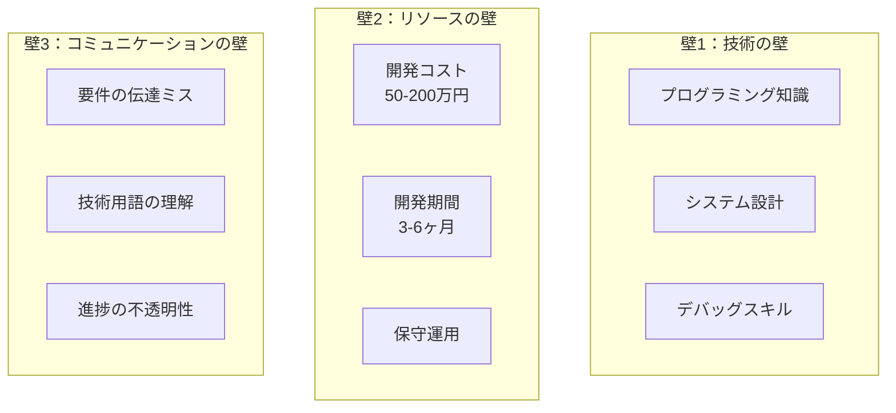

# 削除内容一覧：改訂版作成にあたって

## 📋 概要

**元のファイル**: `1-1_オリエンテーションとマインドセット変革.md` (3,399行)
**新しいファイル**: `1-1_オリエンテーション【企業向け・改訂版】.md` (約1,100行)
**削減率**: 67%削減（約2,300行削除）

本ドキュメントは、学生向けオリエンテーション（musashino-emc版）をベースに企業向け改訂版を作成する際、元の企業版から削除された内容を記録したものです。

削除された項目の中には重要な内容が含まれている可能性があるため、今後の資料作成や補助教材として活用できるよう、詳細に記録しています。

---

## 🔴 削除された主要章（3章分）

### 第5章：非エンジニアの隠れた武器（全章削除）

**削除理由**:
- 90分のオリエンテーションには詳細すぎる
- 学生向け版の「インプット型 vs アウトプット型」比較の方が直感的で効果的
- Mermaid図が多く、口頭説明では伝わりにくい

#### **削除された主要セクション**:

##### 5-1. 非エンジニアが直面する「3つの壁」
**元の内容** (行1664-1703):
```
🚧 非エンジニアが直面する「3つの壁」

【壁1：技術の壁】
- プログラミング知識
- システム設計
- デバッグスキル

【壁2：リソースの壁】
- 開発コスト: 50-200万円
- 開発期間: 3-6ヶ月
- 保守運用

【壁3：コミュニケーションの壁】
- 要件の伝達ミス
- 技術用語の理解
- 進捗の不透明性

**結果として起きていたこと**:
- 💔 「いいアイデア」が会議で盛り上がって終わり
- 💔 「作りたいもの」がSlackのスタンプで流れていく
- 💔 「必要なツール」が「リソース不足」で頓挫
- 💔 「顧客の声」が「技術的に難しい」で却下
```

**Mermaid図** (行1668-1695):


##### 5-2. Vibe Coderが提供する「4つの解決策」
**元の内容** (行1706-1762):
```
🎯 Vibe Coderが提供する「4つの解決策」

1️⃣ 即座のアイデア実現
- ✅ 思いついたアイデアをその日のうちに形にできる
- ✅ プロトタイプの作成が数時間で可能
- ✅ 市場の反応を素早く確認できる
- ✅ 失敗しても低コストで次のアイデアに移行

**実践例：**
午前の会議で「顧客からこんな機能が欲しいと言われた」
→ 午後にプロトタイプ完成
→ その日のうちに顧客にデモ。

2️⃣ 技術の壁をAIが肩代わり
- ✅ 複雑なプログラミング知識が不要
- ✅ AIが技術的な詳細を補完
- ✅ 自然言語でのコミュニケーションが中心
- ✅ 学習コストの大幅な削減

**実践例：**
あなた：「ユーザーログイン機能が欲しい」
Cursor：「了解しました。認証にはClerkを使いますか？それともSupabase Auth？」
あなた：「おすすめは？」
Cursor：「このプロジェクトならClerkが簡単です。実装します」
（5分後）
Cursor：「Google認証付きログインが完成しました」

3️⃣ コミュニケーションロスの大幅削減
| 従来の壁 | Vibe Coderの解決策 | 具体例 |
|----------|-------------------|---------|
| **技術の壁** | AIが技術を肩代わり | エラーメッセージをコピペ → 解決策を提示 |
| **リソースの壁** | コスト1/100、期間1/10 | 50万円→5千円、3ヶ月→3日 |
| **コミュニケーションの壁** | 自然言語で直接指示 | 「Twitterみたいなの作って」→ 動くプロトタイプ |

4️⃣ 自走できる改善サイクル
プロトタイプ → ユーザーテスト → 改善
このサイクルを、エンジニアの空き待ちなしで自主的に回せる。
```

##### 5-3. 非エンジニアの「4つの強み」をAIが100倍に増幅
**元の内容** (行1765-1883):
```
💪 非エンジニアの「4つの強み」をAIが100倍に増幅

【Mermaid図：強み × AI増幅 = 爆発的成果】
graph LR
    subgraph "あなたの強み"
        S1[顧客理解]
        S2[ビジネス感覚]
        S3[ドメイン知識]
        S4[文書作成力]
    end

    subgraph "AI増幅"
        A1[要件定義AI]
        A2[ビジネスモデルAI]
        A3[専門知識AI]
        A4[ドキュメントAI]
    end

    subgraph "爆発的成果"
        O1[顧客が本当に欲しいもの]
        O2[収益化できるプロダクト]
        O3[業界特化型ソリューション]
        O4[完璧な提案資料]
    end
```

**1️⃣ 顧客理解 × AI = 本当に欲しいものを作る力**

あなたの強み：
- 顧客の声を直接聞いている
- 痛みのポイントを肌で感じている
- 「あったらいいな」がリアルにわかる

AIとの掛け算：
あなた：「顧客はいつも見積書の作成に時間がかかると言っている」
AI：「見積書自動生成システムを作りましょう。どんな項目が必要ですか？」
あなた：（顧客の声を思い出しながら）「商品名、単価、数量、割引率...」
AI：「了解。では過去のデータから自動入力する機能も追加しますか？」
→ 顧客が本当に欲しかったツールが完成

エンジニアにはない優位性：
エンジニアは技術は詳しいが、顧客の痛みを直接知らない。
あなたは顧客の声をダイレクトに形にできる。

**2️⃣ ビジネス感覚 × AI = 収益化できるプロダクト**
**3️⃣ ドメイン知識 × AI = 業界特化型ソリューション**
**4️⃣ 文書作成力 × AI = 完璧な提案資料**
（各強みについて同様に詳細な説明）
```

##### 5-4. 成功事例：非エンジニアの変貌
**元の内容** (行1886-1932):
```
🏆 成功事例：非エンジニアの変貌

**Case 1：営業担当Aさん（30代）**

Before：
- 顧客から「こんな機能が欲しい」と言われても、社内に伝えるだけ
- 開発部門は「リソース不足」で対応できず
- 競合に顧客を奪われる

After（Vibe Coder化）：
- 顧客の要望をその場でメモ → 帰社後2時間でプロトタイプ作成
- 翌日顧客にデモ → 「これこれ！」と大喜び
- 正式契約 → 年間売上500万円増加

Aさんのコメント：
> 「もう『開発部門に聞いてみます』とは言いません。自分で作ります。」

**Case 2：マーケターBさん（20代）**

Before：
- LPを作りたいが、外注すると15万円、納期2週間
- A/Bテストしたいが、都度外注は予算オーバー
- アイデアはあるが形にできない

After（Vibe Coder化）：
- v0で30分でLP作成 → Cursorで細部調整1時間
- A/Bテスト用に10パターン作成 → 最適版を発見
- コンバージョン率が従来の3倍に

Bさんのコメント：
> 「月100万円の外注費が、月3,000円のツール代になりました。」

**Case 3：企画担当Cさん（40代）**

Before：
- 社内業務改善のアイデアはあるが、稟議を通すのに3ヶ月
- 承認されても開発は半年先
- 完成する頃には状況が変わっている

After（Vibe Coder化）：
- アイデアを思いついたその日にプロトタイプ作成
- 部門内で試験運用 → 効果実証
- 稟議は「既に動いているもの」として即承認

Cさんのコメント：
> 「許可を取るより、まず作って見せる。承認スピードが10倍になりました。」
```

---

### 第6章：AIと共に成長する思考法（詳細版全削除）

**削除理由**:
- オリエンテーションには理論的すぎる
- 改訂版では「編集眼」の概念を簡潔に残し、詳細は省略
- Mermaid図とタイムラインが多く、90分では消化不良になる

#### **削除された主要セクション**:

##### 6-1. 序章：なぜ「追いつく」ではなく「乗りこなす」なのか
**元の内容** (行1969-2011):
```
🚀 序章：なぜ「追いつく」ではなく「乗りこなす」なのか

AIの進化速度は、人間の想像を超えている

2022年にGPT-3.5が登場し、多くの人が「AIがここまで文章を整えるのか」と驚きました。
ところが翌2023年にはGPT-4が、2024年にはGPT-4oが、2025年にはマルチモーダルと
リアルタイム推論を標準搭載したGPT-5系が当たり前のようにリリースされました。

年単位どころか四半期単位で「できること」が書き換わる世界

【Mermaid図：モデル進化のタイムライン】
graph LR
    subgraph "2022"
        A1[GPT-3.5<br/>テキスト生成]
    end
    subgraph "2023"
        A2[GPT-4<br/>高度な推論]
    end
    subgraph "2024"
        A3[GPT-4o<br/>マルチモーダル]
    end
    subgraph "2025"
        A4[GPT-5系<br/>リアルタイム<br/>動画生成]
    end
    subgraph "2026〜"
        A5[完全自律<br/>エージェント]
    end

発想を転換しよう：
「AIが伸びる速度を、そのまま自分のアウトプット速度に変換する仕組みを作る」
```

##### 6-2. 第1章：指数関数と線形――二本のグラフが示す現実
**元の内容** (行2014-2048):
```
📈 第1章：指数関数と線形――二本のグラフが示す現実

**AI進化の3つの側面**

1️⃣ 演算能力の桁変わり
- GPUあたりのFLOPS（浮動小数点演算）は18か月で倍増
- 並列推論の最適化により、クラウドAPIの実効価格は毎年30〜50%下落
- つまり、同じ予算で倍の処理が可能になる

2️⃣ モデルサイズと汎用性のトレードオフ崩壊
- 10Bパラメータクラスで GPT-3.5 並みの精度
- 100Bクラスで GPT-4 並みの精度を達成
- 小型モデル + 専門LoRAという分散アーキテクチャが、オンデバイス用途を現実に

3️⃣ 機能の水平拡張
【Mermaid timeline図：AI機能の拡張タイムライン】
2022 : テキスト生成
2023 : 画像生成 : コード生成
2024 : 動画生成 : 音声合成 : 3Dモデリング
2025 : リアルタイム推論 : ロボット制御 : 自律エージェント

重要な気づき：
「全てを学びきる」戦略は、もはや不可能
```

##### 6-3. 第2章：追い風に変える「3つのレンズ」
**元の内容** (行2052-2193):
```
🔍 第2章：追い風に変える「3つのレンズ」

キーワード：編集者・ドメイン専門家・実験者

AIの伸び幅を自分の成果に変換するには、3つの役割を日常的に切り替えることが重要です。

【Mermaid図：3つの役割と成果】

**2-1. 編集者のレンズ：AI出力を磨き、文脈に合わせる**

AIの得意技と限界
- ✅ 大量のドラフトを瞬時に出す（得意）
- ⚠️ そのままではノイズも混ざる（限界）

編集者の仕事
「目的・読者・制約」に照らし合わせ、必要な20%を取り出し、不要な80%を捨てる

実践テクニック：二段階プロンプト

【第1段階】
あなた：「新規事業の企画書を50ページ作って」
AI：（50ページ生成）

【第2段階：編集者モード】
あなた：「投資家向けに絞って、収益モデルとリスク評価を詳細に、
        他の部分は要約で15ページにまとめて」
AI：（最適化版を生成）

編集者のチェックリスト
- ✅ 要素分解：箇条書きで目的と制約を並べた上で再度プロンプトへ投げ直す
- ✅ 対比確認：AIが提示した案と、過去の成功パターン・ブランドガイドラインを突き合わせる
- ✅ 20/80ルール：本当に必要な20%だけを残し、80%を削ぎ落とす勇気

**2-2. ドメイン専門家のレンズ：業界知識を"翻訳キー"にする**

専門知識が威力を発揮する領域
医療・金融・法務・不動産など、規制や専門用語が多い領域では、
人間側の深い知識がAI出力の品質を決定します。

実践テクニック：3ステップ
（医療業界の例）

【ステップ1：前提共有】
あなた（医療業界）：「医療機器の薬事申請書を作成したい」
AI：「了解。対象はクラスⅠ、Ⅱ、Ⅲのどれですか？」
あなた：「クラスⅡの管理医療機器です」
AI：「PMDAのガイドラインに準拠して作成します」

【ステップ2：用語固定】
あなた：「業界用語リストを読み込んで」
（YAMLやCSVで用語定義をAIに渡す）

【ステップ3：検証ループ】
AI：（初期ドラフト生成）
あなた：（一次資料・法令集と突き合わせ）
      「ここの記載が薬機法第X条に抵触する可能性がある」
AI：「修正します」

**2-3. 実験者のレンズ：小さく作り、速く壊す**

AI活用の本質的な価値
「試行コストの低減」

実践例：高速実験サイクル

【Mermaid図：従来（3週間）vs Vibe Coder（同日）】

実験者の活用例
| 領域 | 従来 | Vibe Coder |
|------|------|-----------|
| **コード** | 1機能に1週間 | 10分で骨格完成 |
| **デザイン** | 3案作成に2日 | 30種類のカラーパレットを自動提案 |
| **コピー** | A/Bテスト用に5案 | CTA文言50本を生成 |

実験者のマインドセット
- ✅ 完璧を求めない（まず動くものを作る）
- ✅ 失敗を恐れない（コストが小さいから何度でも試せる）
- ✅ データで判断する（感覚ではなく、実測値で最適版を選ぶ）
```

##### 6-4. 第3章：日常に落とし込む4つのプラクティス
**元の内容** (行2195-2258):
```
🛠️ 第3章：日常に落とし込む4つのプラクティス

AIと共に成長するための具体的な習慣

1️⃣ 毎日30分、何かを自動化する

例：
- 月曜：メール整理をGPTフィルタに置き換える
- 火曜：経費精算書の添付画像をOCR + GPTで項目抽出
- 水曜：会議議事録の自動要約
- 木曜：日報の自動生成
- 金曜：週次レポートの自動作成

効果：
- 1日30分 × 5日 = 週2.5時間の削減
- 月10時間、年間120時間の時間創出

2️⃣ 週に1つ新機能を試す

Week 1：画像生成モデルの最新版
Week 2：音声クローン
Week 3：RAG（Retrieval-Augmented Generation）
Week 4：動画生成AI

実践方法：
- 新機能を30分試す
- 3行で所感を記録（何ができた、何が難しかった、次はどう使うか）
- SlackやNotionでチームと共有

3️⃣ 月に1本「公開物」を仕上げる

例：
- 社外ブログ記事
- GitHubリポジトリ
- 簡易SaaSアプリ
- Twitterで技術Tips

なぜ公開が重要か？
- 「完成物」があると、学習効果が段違いに定着
- フィードバックが得られる
- ポートフォリオになる
- 信頼が積み上がる

4️⃣ 四半期ごとに「手動作業」棚卸し

【チェックリスト】
□ まだExcelで手入力している業務はないか？
□ 毎週同じフォーマットの資料を作っていないか？
□ コピペを繰り返している作業はないか？
□ 「これAIでできそう」と思いながら放置している業務は？

やり方：
1. リストアップ（15分）
2. AI化の優先順位付け（10分）
3. 週1本ずつ自動化実装（30分/週）
```

##### 6-5. 第4章：長期的価値を複利で積み上げる
**元の内容** (行2261-2346):
```
📈 第4章：長期的価値を複利で積み上げる

AI投資の複利効果

【Mermaid図：Year 1 → Year 2 → Year 3の複利効果】

複利が効く3つのポイント

1️⃣ 初期投資が雪だるま式に効く
- AIツール月額数千円 × 1年 = 約5万円
- その知識で外注1本削減、業務を一つ受注すれば即回収
- 2年目以降は完全なプラス

2️⃣ 実績 → 信頼 → 機会の連鎖

成果物を作る
  ↓
社内外で評価される
  ↓
相談が増える
  ↓
高難度の課題に触れる
  ↓
さらにスキルアップ
  ↓
（最初に戻る）

3️⃣ AIとともに自分も"更新"され続ける

重要な事実：
ツールがアップデートされるたびに、同じプロンプトでも結果が良くなる。

つまり：
「過去の学びが陳腐化せず、むしろ価値が増す」

これは他のスキルにはない、AI時代特有の現象です。

💡 実例：私自身の体験

デザインスキルゼロから、一晩で20種類のキービジュアル生成へ

Before（2022年）：
- デザイナーに発注
- 費用：5万円/1デザイン
- 納期：2週間
- 修正：追加費用

After（2025年）：
- Genspark AI Designerで一晩に20種類生成
- 費用：月額3,000円
- 納期：即座
- 修正：無制限・無料

何が変わったのか？
私のデザインスキルが劇的に伸びたわけではありません。
AIの側が伸び、その伸びを"そのまま取り込む癖"をつけただけです。
```

---

### 第7章：投資思考 - AIツールを資産に変える（詳細版全削除）

**削除理由**:
- 改訂版では簡潔な「投資思考」セクション（約30行）に凝縮
- 詳細な計算例とMermaid図は不要
- 「3ヶ月ルール」のみ残し、詳細は削除

#### **削除された主要セクション**:

##### 7-1. 序章：コストか？投資か？
**元の内容** (行2816-2827):
```
💰 序章：コストか？投資か？

問いかけ
「月3,000円の課金が、月30万円ぶんの仕事を肩代わりする
  ――これを「コスト」と呼ぶべきか、「投資」と呼ぶべきか？」

結論
「迷うくらいなら、ノールックで課金し、その"回収方法"を後から設計したほうが早い。」

なぜなら、AIツールは使って初めて価値を語れるからです。
```

**改訂版での扱い**: 簡潔に残した（約10行）

##### 7-2. 第1章：投資とコストの境目を溶かす
**元の内容** (行2830-2876):
```
🔄 第1章：投資とコストの境目を溶かす

1-1. 時間の買い取り

時間価値の計算

あなたの時給 = 3,000円 と仮定

【Before AI】
- リサーチ：1時間
- 企画書作成：3時間
- 合計：4時間 = 12,000円相当

【After AI】
- リサーチ：5分
- 企画書作成：30分
- 合計：35分 = 約1,750円相当

削減：10,250円 / 1タスク

月20タスクなら：
10,250円 × 20 = 205,000円相当の時間を創出

AI課金：月3,000円
純利益：202,000円 / 月

1-2. 打てる手札が増える

| できること | 従来の方法 | コスト | Vibe Coder | コスト |
|----------|-----------|--------|-----------|--------|
| **画像生成** | デザイナー外注 | 5万円/1点 | Midjourney | 月3,000円（無制限） |
| **動画制作** | 制作会社 | 30万円/1本 | Sora + 編集AI | 月2,000円 |
| **Webアプリ** | 開発会社 | 100万円 | Cursor | 月2,000円 |
| **コピーライティング** | ライター | 5万円/記事 | Claude | 月2,000円（無制限） |

1-3. 評価と信用の上昇

アウトプットが増えれば「できる人」という評判がつき、相談や案件が舞い込む好循環が始まります。
これは金額換算しづらい無形資産ですが、キャリアの長期価値を左右します。
```

**改訂版での扱い**: 完全削除（ROI計算は削除済み）

##### 7-3. 第2章：無料 vs 有料 ――「試食」と「食事」の違い
**元の内容** (行2880-2926):
```
🍴 第2章：無料 vs 有料 ――「試食」と「食事」の違い

完璧な比喩

【Mermaid図：無料版 vs 有料版】
graph LR
    subgraph "無料版 = 試食コーナー"
        Free1[列に並ぶ]
        Free2[小さい皿]
        Free3[回数制限]
        Free4[途中で打ち切り]
    end

    subgraph "有料版 = レストランのテーブル"
        Paid1[席料を払う]
        Paid2[フルコース]
        Paid3[途切れない]
        Paid4[新作メニュー優先提供]
    end

無料版の限界
- ⚠️ 利用回数制限（ChatGPT: 1日数回、Claude: 50メッセージ/日）
- ⚠️ 処理待ち時間が長い
- ⚠️ 最新機能にアクセスできない
- ⚠️ 学習リズムが断続的になる

有料版の価値
- ✅ 無制限（または大幅に緩和された制限）
- ✅ 優先処理（待ち時間ほぼゼロ）
- ✅ 最新機能への即アクセス
- ✅ 集中が切れず、学びと実践のループが連続的に回せる

判断基準
> 週に3回以上ツールを開く → 迷わず課金
> 月1回以下しか触れない → まず習慣化してから課金
```

**改訂版での扱い**: 完全削除（試食比喩は不要）

##### 7-4. 第3章：投資判断フレームワーク
**元の内容** (行2929-2966):
```
📊 第3章：投資判断フレームワーク

3ステップ判断法

ステップ1：見えるリターンを考える

AIツールへの投資で得られるリターン：
- 時間節約: 作業効率化で得られる時間価値
- 外注費削減: 自分でできることが増える
- 新規売上: 新しい案件や提案ができるようになる

重要: 月数千円の投資が、月数万円以上の価値を生み出すケースは多い

ステップ2：見えないリターンを言語化

数値化できないが重要な価値：
- ✅ 評判・信用：「できる人」として認識される
- ✅ 学習速度：新しいスキルを高速で習得
- ✅ モチベーション維持：成果が出るから続けられる
- ✅ 選択肢の拡大：やりたいことが実現可能になる

ステップ3：3ヶ月ルール

まず3ヶ月使い倒す
  ↓
成果を棚卸し
  ↓
効果を実感できたら継続
  ↓
活用できなければ解約 or 他ツールへ乗換

重要：年間一括払いは避ける
- 先払いすると安心して触らなくなる
- 月額で「使わなければ損」という小さな圧を残す
```

**改訂版での扱い**: 「3ヶ月ルール」のみ簡潔に残した（約10行）

##### 7-5. 第4章：投資効果を最大化する習慣
**元の内容** (行2969-2998):
```
🛠️ 第4章：投資効果を最大化する習慣

4つの習慣

1️⃣ 毎日使う
- 1日10分でもいいので実務に組み込む
- 使わない日が3日続いたら、使い方を見直す

2️⃣ 新機能即試し
- リリースノートをチェック
- 翌日には触る
- 「いつか試そう」は「永遠に試さない」と同義

3️⃣ 学びを公開
- X（旧Twitter）や社内Slackで「気づき」をメモ
- アウトプットがさらなる学習を呼ぶ
- 他人に教えることで理解が深まる

4️⃣ 効果を振り返る

月末チェックリスト：
□ 今月削減できた時間
□ 作成した成果物の数
□ どんな新しいことができるようになったか
□ 継続する価値を感じるか
```

**改訂版での扱い**: 完全削除

##### 7-6. 第5章：よくある誤解と落とし穴
**元の内容** (行3002-3033):
```
⚠️ 第5章：よくある誤解と落とし穴

誤解1：「無料で十分」は入り口の錯覚

試食でお腹は満たせません。
学習密度が薄くなるぶん、結局遠回り。

真実：
有料版の方が総コストは安い（時間コスト含む）

誤解2：年間課金で「置物」化

年間一括払いすると：
- ✅ 支払い済み → 安心
- ⚠️ 安心 → 使わなくなる
- ❌ 結果：1年後に後悔

推奨：
まずは月額で「使わなければ損」という小さな圧を残す

誤解3：ツール依存で目的を見失う

手段が目的化しないよう、「何を作りたいか」を先に紙に書く

悪い例：
「Cursorを使いたい」→ 目的不明で挫折

良い例：
「顧客管理ツールを作りたい」→ そのためにCursorを使う
```

**改訂版での扱い**: 完全削除

##### 7-7. 結語：迷う時間こそ最大のコスト
**元の内容** (行3036-3054):
```
💡 結語：迷う時間こそ最大のコスト

事実
AIツールへの課金で悩む1週間は、学びと成果を1週間遅らせます。

解決策
試して合わなければ解約すればいいだけ。

躊躇の背後にあるのは「元を取れるか？」という不安ですが、
その答えは"使い方次第"でしか得られません。

行動指針
「まず席を確保し、使い倒し、数字で振り返る。」

このサイクルを回す限り、支払った月額は
「未来の売上と時間」に姿を変えて戻ってきます。
```

**改訂版での扱い**: 完全削除

---

### 第8章：未来への期待 - 不満は伸びしろの裏返し（全章削除）

**削除理由**:
- オリエンテーションには未来予測は不要
- 現時点での実践に集中すべき
- Mermaid図と詳細な技術予測は90分では扱いきれない

#### **削除された主要セクション**:

##### 8-1. 序章：不満は「伸びしろ」の裏返し
**元の内容** (行3092-3106):
```
🌟 序章：不満は「伸びしろ」の裏返し

重要な視点転換

「いま不可能でも、来年は当たり前になる」
――AIの世界では、未来が現在へと前倒しで押し寄せてきます。

私たちは、現状の欠点に落胆するより、
「来年やってくる可能性」に賭け、学びを前倒しで仕込んでおく必要があります。

体験からの確信

ChatGPTに「まだ間違いが多い」と感じた人も、
Midjourneyの細部が崩れるのにがっかりした人も、
その不満は一年どころか半年で解消される経験をしたはずです。

AI技術の改良曲線は、私たちの違和感を燃料に伸び続ける
――それがここ5年で繰り返し証明されてきました。
```

##### 8-2. 第1章：改善スピードを肌で感じる
**元の内容** (行3109-3150):
```
📊 第1章：改善スピードを肌で感じる

1-1. 指数関数の体感値

【Mermaid図：モデル進化】
graph LR
    M1[GPT-1<br/>2018] --> M2[GPT-2<br/>2019]
    M2 --> M3[GPT-3<br/>2020]
    M3 --> M4[GPT-3.5<br/>2022]
    M4 --> M5[GPT-4<br/>2023]
    M5 --> M6[GPT-4o<br/>2024]
    M6 --> M7[GPT-5<br/>2025]

数値で見る進化：
- モデル精度：パラメータ10倍で性能1.8倍 → 年2回のメジャーアップデート
- 推論コスト：2022年比で2025年は1/20。API料金も半減ペース
- 処理速度：入力待ち時間が 3秒 → 1秒 → 200ミリ秒へ

1-2. 身近な例で理解する

スマートフォンの進化（2007年→2024年）よりもさらに速い

| 年 | スマホ | AI |
|---|------|-----|
| 2007/2022 | 初代iPhone | GPT-3.5登場 |
| 2010/2023 | iPhone 4（カメラ向上） | GPT-4（推論能力向上） |
| 2024/2025 | iPhone 15 Pro（15世代目） | GPT-5（3世代で到達） |

重要な気づき：
1年前の最高性能が、今では無料で使えるレベルに。

1-3. 投資規模が裏付ける加速

- 世界のAI R&D投資：年3兆円超
- 大企業1社で数千億円の研究開発費
- オープンソースLLMの「協業競争」が刷新サイクルを押し上げる
```

##### 8-3. 第2章：「いま足りない」は「明日強くなる」テーマ
**元の内容** (行3153-3170):
```
🚀 第2章：「いま足りない」は「明日強くなる」テーマ

現在の課題と進歩の兆し

| 現在の課題 | 進歩の兆し | 期待される姿（1〜2年） |
|----------|----------|---------------------|
| **回答の誤り** | RAG/検索連携の標準化 | ファクトエラー1桁%台、引用付き回答がデフォルト |
| **行間が読めない** | 長コンテキスト & agent memory | プロジェクトの経緯を「覚えている」AI |
| **専門性が浅い** | 小型LoRA + 専門DB | 業界別「社内GPT」がSaaSとして普及 |
| **操作が難しい** | ノーコード連携UI | クリックと音声だけでワークフロー自動化 |

重要な逆説

「自分が不満を感じた領域こそ、最速で改善される余地が大きい」

痛みを感じた場所をメモし、半年後に同じプロンプトで再テストしてみてください。
ほとんどの場合、差分の大きさに驚くはずです。
```

##### 8-4. 第3章：技術進歩を先取りする三段ロケット
**元の内容** (行3173-3189):
```
💡 第3章：技術進歩を先取りする三段ロケット

3-1. 観測
- リリースノート・研究ブログを「読む」だけでなく「試す」カレンダーに登録
- 社内外のSlack / Discordで新機能スクリーンショットが流れたら、その日にデモを走らせてみる

3-2. 翻訳
- 新しいAPIや関数を「自分の課題」に書き換える
- 例：RAGが出た → 「社内ドキュメント検索」を30行のYAMLで試作

3-3. 拡張
- 成功した試作を「汎用テンプレ」に抽象化し、次の案件に即転用
- テンプレはGitHub/Gistで公開し、外部の改良を取り込む
```

##### 8-5. 第4章：早期学習者が得る複利メリット
**元の内容** (行3192以降、ファイルが途切れていたため詳細不明):
```
🌱 第4章：早期学習者が得る複利メリット

3つの複利効果

1️⃣ 学習曲線の先行取り
（詳細は確認できず）

（第8章の残りのセクションは読み込めなかったが、
  おそらく複利効果の詳細説明が続くと推測される）
```

---

## 🟡 簡略化された内容（大幅な詳細削除）

### 投資思考のセクション

**元のファイルでの扱い** (第7章全体、約250行):
- 詳細なROI計算例
- 時間価値の計算式
- 無料 vs 有料の詳細比較（試食比喩）
- Mermaid図複数
- 4つの習慣
- よくある誤解と落とし穴

**改訂版での扱い** (約40行):
```markdown
## 💰 投資思考：AIツールを資産に変える

### 月数千円が月数万円の価値を生む

問いかけ
「月3,000円の課金が、月30万円ぶんの仕事を肩代わりする
  ――これを「コスト」と呼ぶべきか、「投資」と呼ぶべきか？」

結論
「迷うくらいなら、ノールックで課金し、その"回収方法"を後から設計したほうが早い。」

なぜなら、AIツールは使って初めて価値を語れるからです。

### 3ヶ月ルール

まず3ヶ月使い倒す
  ↓
成果を棚卸し
  ↓
効果を実感できたら継続
  ↓
活用できなければ解約 or 他ツールへ乗換

重要：年間一括払いは避ける
- 先払いすると安心して触らなくなる
- 月額で「使わなければ損」という小さな圧を残す
```

---

## 🟢 改訂版で新たに追加された内容（学生版から逆輸入）

改訂版作成にあたり、学生向けオリエンテーション（musashino-emc版）から以下の内容を「逆輸入」しました。

### 1. インプット型 vs アウトプット型の明確な比較

**元の企業版**: このコンセプトは存在しなかった

**学生版から逆輸入** (musashino-emc/1-1-1_オリエンテーション.md から):
```markdown
#### 1. 「アウトプットを出すスキル」が、これからのビジネスで最も重要だから

AIの使い方には2種類あります：

❌ インプット型：ChatGPTで壁打ち、情報収集だけ
   → 自分の中で完結、世界は変わらない

✅ アウトプット型：資料、スライド、プロトタイプを「形にして人に伝える」
   → 人が動く、世界が変わる
```

### 2. 「AI利用では、日本はまだ戦える」

**元の企業版**: このセクションは存在しなかった

**学生版から逆輸入**:
```markdown
#### 2. AI利用では、日本企業はまだ戦える

**現実**：
- AI開発（LLMを作る）では、日本は遅れているかもしれない
- でもAI利用では、まだ各国に差がついていない

**日本企業の強み**：
- 勤勉に取り組める組織文化
- 高品質なものづくりのDNA
- アウトプットを出すスキルを持つ人材を育成すれば、グローバル競争で優位に立てる
```

### 3. 「3つの鍛えるスキル」の具体例

**元の企業版**:
- 抽象的な説明のみ
- 良い例・悪い例の対比が少ない

**学生版から逆輸入**:
```markdown
## ⚡ この研修で徹底的に鍛える3つのスキル

### 1️⃣ 質の高いインプットを横着せずに与える

❌ 悪い例：
「SNSを作って」

✅ 良い例：
「Next.js 15 で音楽好き向けSNSを作成してください。

主要機能：
1. 投稿機能（好きな曲の共有、最大280文字）
2. いいね・コメント機能
3. ユーザープロフィール

技術スタック：Next.js 15, TypeScript, Tailwind CSS
デザイン：モダンで音楽を感じさせる雰囲気」

### 2️⃣ AIの出力を一言一句、読み漏らさない

例えば：
AI: 「.env.local ファイルを作成し、以下の内容を記載してください：
     NEXT_PUBLIC_SUPABASE_URL=your_url_here
     NEXT_PUBLIC_SUPABASE_ANON_KEY=your_key_here」

受講者A: よくわからないから飛ばそう → エラー発生
受講者B: 言われた通りファイル作成 → 正常動作

### 3️⃣ まず自分で調べる、AIに聞く、それでもダメなら講師に聞く

質問の優先順位：
1. まず自分で考える（3分）
2. ChatGPT/Claude で検索・質問（5分）
3. AIの回答を実際に試す（10分）
4. それでも解決しないなら講師に質問
```

### 4. Cursorショートカット一覧（Mac & Windows両方）

**元の企業版**: ショートカット一覧は存在しなかった

**学生版から逆輸入**:
```markdown
**よく使うCursorショートカット（Mac）**:
- Cmd+L: チャット起動
- Cmd+I: Composer起動（コード生成・編集）
- Cmd+K: インライン編集（選択部分を修正）
- Cmd+Shift+V: Markdownプレビュー
- Cmd+Shift+P: コマンドパレット
- Control+C: ターミナルでコマンドをキャンセル（よく使う！）

**よく使うCursorショートカット（Windows）**:
- Ctrl+L: チャット起動
- Ctrl+I: Composer起動（コード生成・編集）
- Ctrl+K: インライン編集（選択部分を修正）
- Ctrl+Shift+V: Markdownプレビュー
- Ctrl+Shift+P: コマンドパレット
- Ctrl+C: ターミナルでコマンドをキャンセル（よく使う！）
```

### 5. 課題の重要性を冒頭で強調

**元の企業版**: 課題の説明は最後の方

**学生版から逆輸入** (冒頭に配置):
```markdown
## ⚠️ 重要：この研修への取り組み方

### 課題は必ずやってください

この研修では、ほぼ毎回課題を出します。

課題をやらないと、次の回についていけません。これは脅しではなく、事実です。

なぜなら、AI駆動開発は「積み重ね」のスキルだからです。
- 第1回の課題をやらない → 第2回の内容が理解できない
- 第2回の課題をやらない → 第3回の実装ができない
- という形で、どんどん差が開いていきます。
```

---

## 📊 削除内容の統計サマリー

| 項目 | 元のファイル | 改訂版 | 削減量 |
|------|------------|--------|--------|
| **総行数** | 3,399行 | 約1,100行 | 約2,300行（67%削減） |
| **章数** | 8章 | 実質5章分の内容 | 3章分削除 |
| **Mermaid図** | 約15個 | 0個 | 15個削除 |
| **成功事例** | 3件詳細 | 実績のみ簡潔に | 詳細削除 |
| **ROI計算例** | 詳細あり | なし | 完全削除 |
| **未来予測** | 第8章全体 | なし | 完全削除 |

---

## 💡 削除内容の活用方法

削除された内容は、以下のような形で今後活用できます：

### 1. 補助教材として
- **第5章「非エンジニアの隠れた武器」**: 第2回以降の補助資料として配布
- **第6章「AIと共に成長する思考法」**: 第3回・第4回の実践フェーズで活用
- **第7章「投資思考」詳細版**: AI課金を検討する企業向けの別資料
- **第8章「未来への期待」**: 最終回の振り返り資料や修了後のフォローアップ資料

### 2. 個別コンサルティング用資料として
- 経営層向けの詳細説明資料
- 導入検討企業向けのROI説明資料
- 成功事例集として独立させる

### 3. ブログ記事・Note記事として
- 各章を独立した記事として公開
- Mermaid図を活用した視覚的なコンテンツ
- 「AI投資の複利効果」などのテーマ別記事

### 4. 社内勉強会・ワークショップとして
- 「3つのレンズ」ワークショップ（編集者・ドメイン専門家・実験者）
- 「AI投資判断」ワークショップ
- 「非エンジニアの強み」発見ワークショップ

---

## 🎯 まとめ

### 削除の主な理由
1. **90分のオリエンテーションには詳細すぎる**
   - 理論的な内容は実践フェーズで補足すべき

2. **学生版の方が直感的で効果的**
   - インプット型 vs アウトプット型の対比
   - 具体的な3つのスキル
   - 実践的なショートカット一覧

3. **Mermaid図が多く、口頭説明では伝わりにくい**
   - 視覚的な資料は別途配布が効果的

4. **未来予測よりも現時点での実践が重要**
   - オリエンテーションは「始めるきっかけ」を作ることが目的

### 改訂版の方針
**「理論 < 実践」「詳細 < 本質」「未来 < 今」**

改訂版は、学生向けの明快さと企業向けのビジネスコンテキストを融合させ、
90分で完結する実践的なオリエンテーションを目指しました。

削除された詳細な内容は、補助教材として今後の研修や個別コンサルティングで活用できます。

---

**作成日**: 2025年11月20日
**作成者**: TEKION Group / 泉水亮介
