# 第三回講義：実装ロードマップと宿題

## 🎯 この講義で学ぶこと

- **AI駆動による統合開発**を理解し、Supabase・Clerk・Next.jsを組み合わせた本格的なWebアプリケーション構築方法
- **魔法のプロンプト群**を使って、プロダクションレベルのコードを数分で生成する手法
- **段階的な実装アプローチ**で、複雑な機能も確実に動かすためのロードマップ
- **CRUD操作（作成・読取・更新・削除）**の実装パターンとベストプラクティス
- **認証とデータベースの統合**による、セキュアで実用的なアプリケーション開発
- **宿題課題の実践**を通じて、学んだ知識を確実に自分のスキルにする方法

## 📌 この講義の位置づけ

本講義は、VibeCoder育成プログラム全4回の第三回・セッション3です。

これまでの講義で学んだSupabase（データベース）とClerk（認証）を統合し、実際に動くWebアプリケーションを構築します。**理論から実践への橋渡し**となる重要な講義です。

前半のセッションで個別に学んだ技術を、この講義で**一つの完成形**へと昇華させます。次回（第四回）では、今回作成したアプリケーションを世界に公開する方法を学びます。

---

# 第1章：統合アーキテクチャの全体像

## 🎯 この章で学ぶこと

- **3-1と3-2で構築した要素の関係性**を理解し、それらがどのように連携するか
- **最終的なアプリケーション構成**の全体像と、各コンポーネントの役割
- **データフローの流れ**を把握し、ユーザーのアクションがどのようにデータベースまで到達するか
- **セキュリティの多層防御**がどのように実装されているか
- **なぜこの組み合わせが最強なのか**、その技術的・ビジネス的価値

## 📌 この章の位置づけ

3-1でSupabase、3-2でClerkを個別に学びました。この章では、それらを**一つのシステム**として統合する方法を理解します。

個別の部品がどのように協調して動くのか、その**オーケストレーション**を学ぶことで、実装への道筋が明確になります。

---

## 🏗️ 今日作った2つの柱を繋げる

### **「午前に学んだ部品が、午後には動くアプリケーションに」**

これは夢物語ではありません。**今から実現する現実**です。

### **統合することで生まれる価値**

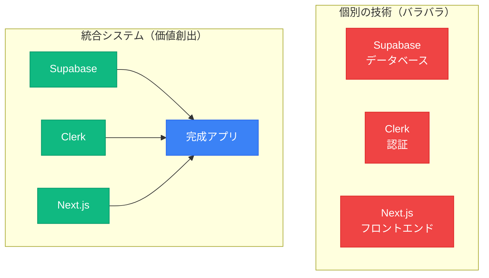

---

## 📊 Session 3-1と3-2の成果物

### **あなたが今日構築したもの**

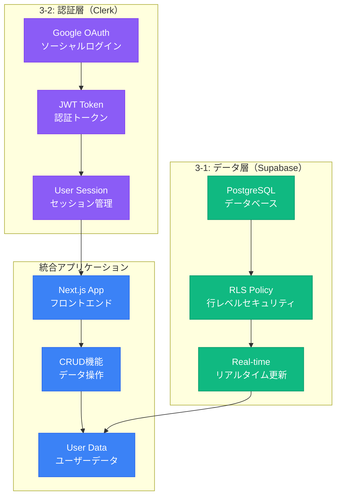

### **実装可能になった機能一覧**

| カテゴリ | 実装可能な機能 | ビジネス価値 |
|---------|--------------|------------|
| **認証関連** | ユーザー登録・ログイン<br/>Google/GitHub OAuth<br/>セッション管理 | ユーザー管理の自動化<br/>信頼性の向上<br/>セキュリティ確保 |
| **データ管理** | ユーザーごとのデータ隔離<br/>セキュアなCRUD操作<br/>リアルタイムデータ同期 | データプライバシー<br/>高速な操作<br/>即座の反映 |
| **セキュリティ** | 多層防御（フロント・API・DB）<br/>自動的な権限チェック<br/>SQLインジェクション対策 | 安全な運用<br/>コンプライアンス対応<br/>信頼性向上 |

---

## 🔐 セキュリティの多層防御

### **攻撃から守る3つの壁**

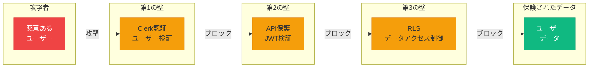

### **なぜこの組み合わせが最強なのか**

| 観点 | 従来の開発 | Vibe Coderアプローチ |
|------|-----------|-------------------|
| **開発速度** | 2-3週間 | **2-3時間** |
| **必要な知識** | 深いセキュリティ知識 | **AIに任せる** |
| **品質** | 個人差が大きい | **ベストプラクティス保証** |
| **コスト** | 高額（専門家が必要） | **最小限** |
| **保守性** | 複雑で困難 | **シンプルで容易** |

---

## 💡 この章のまとめ

- ✅ Supabase（データ）+ Clerk（認証）+ Next.js（フロント）= 完全なWebアプリケーション
- ✅ 個別に学んだ技術を統合することで、実用的な価値が生まれる
- ✅ セキュリティは多層防御で実装され、安全性が確保される
- ✅ 従来なら週単位の開発が、時間単位で可能になる
- ✅ AIを活用することで、専門知識なしでもプロ品質を実現

## 🚀 次の章への橋渡し

統合アーキテクチャの全体像を理解しました。
次の第2章では、この統合を**魔法のようにシンプルに実現する**プロンプト群を紹介します。
数分でプロダクションレベルのコードが生成される様子を、実際に体験していただきます。

---

# 第2章：魔法のプロンプト群で高速実装

## 🎯 この章で学ぶこと

- **QUICK_START_PROMPT.md**の使い方と、その圧倒的な威力
- **11種類のシナリオ**から最適なものを選ぶ方法
- **わずか3ステップ**で完全統合されたアプリケーションを生成
- **カスタマイズの方法**と、自分のニーズに合わせた調整
- **AIが自動生成するコード**の品質とベストプラクティス

## 📌 この章の位置づけ

前章で統合の全体像を理解しました。この章では、その複雑な統合を**驚くほど簡単に実現する方法**を学びます。

プロンプトエンジニアリングの真髄を体験し、**AIの力を最大限に引き出す**技術を習得します。

---

## ✨ 特別配布：supabase_promptフォルダ

### **10万文字を超える知識の結晶**

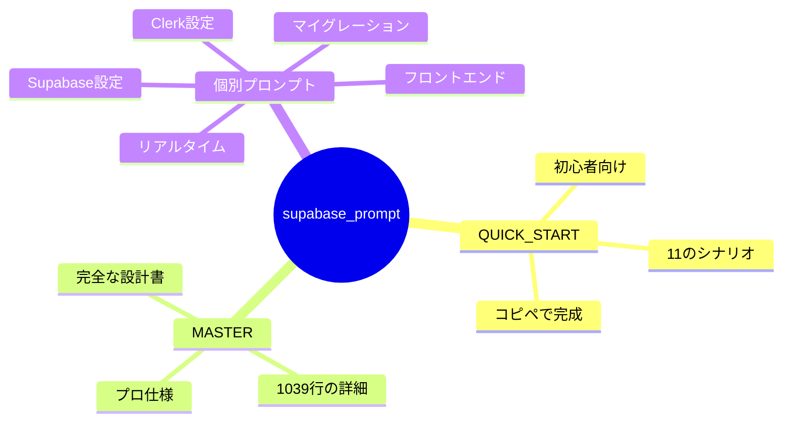

### **プロンプトファイル構成**

| ファイル名 | 行数 | 用途 | 難易度 |
|-----------|-----|------|--------|
| **🎯 QUICK_START_PROMPT.md** | 520行 | すぐ使えるコピペ集 | ⭐ |
| **MASTER_INTEGRATION_PROMPT.md** | 1039行 | 完全統合の設計書 | ⭐⭐⭐⭐⭐ |
| **clerk_setupprpompt.md** | 285行 | Clerk認証設定 | ⭐⭐ |
| **supabase_bootstrap_nextjs.md** | 420行 | Supabase設定 | ⭐⭐ |
| **supabase_migration_prompt.md** | 380行 | DBマイグレーション | ⭐⭐⭐ |
| **supabase_realtime_AIprompt.md** | 310行 | リアルタイム機能 | ⭐⭐⭐⭐ |
| **FRONTEND_IMPLEMENTATION_ADDON.md** | 450行 | フロントエンド実装 | ⭐⭐⭐ |

---

## 🎯 QUICK_START_PROMPTの使い方

### **たった3ステップで完成**

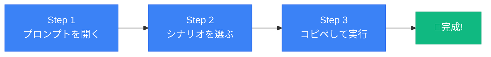

### **Cursorでの具体的な手順**

#### Step 1: プロンプトファイルを開く
```
Cursorに以下の指示を出します：
「@supabase_prompt/QUICK_START_PROMPT.md を開いてください」
```

#### Step 2: シナリオを選択
```
11種類のシナリオから、自分の状況に合ったものを選びます
（次のセクションで詳しく説明）
```

#### Step 3: プロンプトをコピペして実行
```
選んだシナリオのプロンプトをCursorのComposerに貼り付けて
「このプロンプトを実行してください」と指示
```

**結果**: AIが完璧なコードを自動生成！

---

## 📋 11種類のシナリオ選択ガイド

### **あなたの状況に最適なシナリオを選ぶ**

| シナリオ番号 | 状況 | 内容 | 推奨度 |
|------------|------|------|--------|
| **シナリオ1** | 新規プロジェクト | 完全統合＋フロントエンド全部入り | ⭐⭐⭐⭐⭐ |
| **シナリオ1-B** | UIは自分で作りたい | バックエンドのみ統合 | ⭐⭐⭐⭐ |
| **シナリオ2** | 認証だけ追加したい | Clerkのみ実装 | ⭐⭐⭐ |
| **シナリオ3** | DBだけ追加したい | Supabaseのみ実装 | ⭐⭐⭐ |
| **シナリオ4** | 既存プロジェクトに追加 | 段階的統合 | ⭐⭐⭐⭐ |
| **シナリオ5** | リアルタイム機能が必要 | チャット等のリアルタイム更新 | ⭐⭐⭐⭐ |
| **シナリオ6** | 既存DBから移行 | マイグレーション生成 | ⭐⭐⭐ |
| **シナリオ7** | マルチテナント対応 | 組織別データ管理 | ⭐⭐ |
| **シナリオ8** | 型安全にしたい | TypeScript完全対応 | ⭐⭐⭐⭐⭐ |
| **シナリオ9** | 本番環境準備 | エラーハンドリング追加 | ⭐⭐⭐⭐ |
| **シナリオ10** | パフォーマンス最適化 | キャッシュとインデックス | ⭐⭐⭐ |
| **シナリオ11** | テスト付き実装 | テストとドキュメント付き | ⭐⭐⭐⭐ |

### **初心者への推奨パス**

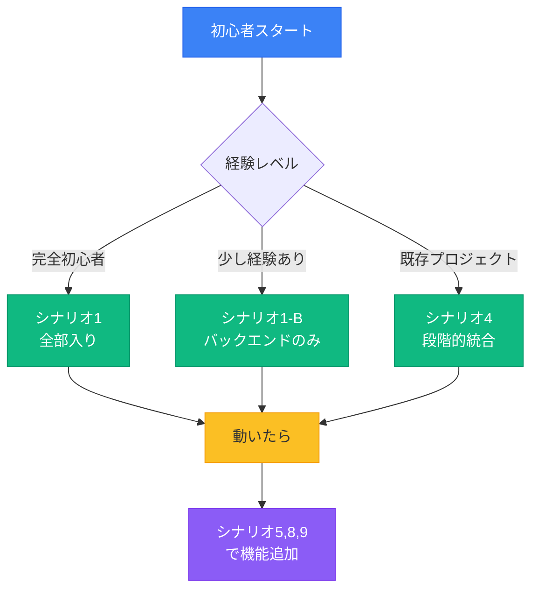

---

## 🤖 シナリオ1：完全統合の魔法

### **最も人気！全部入りパッケージ**

#### **AIが自動生成してくれるもの**

| カテゴリ | 生成内容 | 詳細 |
|---------|---------|------|
| **環境構築** | パッケージインストール | `@clerk/nextjs`, `@supabase/supabase-js`, `@supabase/ssr` |
| **認証システム** | Clerk完全実装 | Google OAuth、サインイン/アップ、ミドルウェア |
| **DBクライアント** | Supabase設定 | SSR対応、型安全、ブラウザ/サーバー両対応 |
| **データベース** | テーブル定義 | マイグレーション、外部キー、インデックス |
| **セキュリティ** | RLSポリシー | 行レベルセキュリティ、ユーザー制御 |
| **ユーザー同期** | Webhook | ClerkとSupabaseの自動同期 |
| **CRUD操作** | データ操作 | 作成・読取・更新・削除の全実装 |
| **Server Actions** | 最新パターン | Next.js 14のベストプラクティス |
| **フロントエンドUI** | 全画面実装 | 認証画面、ナビゲーション、データ操作画面 |
| **エラー処理** | 完全対応 | ローディング、エラー、空状態の処理 |

#### **生成されるファイル構造**

```
📁 プロジェクト/
├── 📁 app/
│   ├── 📁 api/
│   │   └── 📁 webhook/        # Clerkイベント処理
│   │       └── route.ts
│   ├── 📁 sign-in/           # ログインページ
│   │   └── [[...sign-in]]/
│   │       └── page.tsx
│   ├── 📁 sign-up/           # サインアップページ
│   │   └── [[...sign-up]]/
│   │       └── page.tsx
│   ├── 📁 (protected)/       # 認証必須ページ
│   │   └── 📁 dashboard/
│   │       ├── page.tsx
│   │       └── actions.ts
│   ├── layout.tsx            # ClerkProvider設定
│   └── page.tsx              # ホームページ
├── 📁 lib/
│   ├── 📁 supabase/         # DBクライアント
│   │   ├── client.ts
│   │   └── server.ts
│   ├── 📁 clerk/            # 認証設定
│   │   └── utils.ts
│   └── 📁 actions/          # Server Actions
│       └── posts.ts
├── 📁 components/           # UIコンポーネント
│   ├── Navigation.tsx
│   ├── PostForm.tsx
│   ├── PostList.tsx
│   └── UserProfile.tsx
├── 📁 supabase/
│   └── 📁 migrations/       # DB定義ファイル
│       └── 001_initial.sql
├── middleware.ts            # 認証ミドルウェア
├── .env.local              # 環境変数
└── .env.example            # 環境変数サンプル
```

---

## 💡 プロンプトカスタマイズのコツ

### **基本プロンプトに追加指示を加える**

#### 例1：UIフレームワークを指定
```
Cursorへの指示：
「シナリオ1を実行してください。
UIコンポーネントにはshadcn/uiを使用してください」
```

#### 例2：既存コードとの統合
```
Cursorへの指示：
「シナリオ1を実行してください。
現在のapp/layout.tsxの構造を保持しつつ統合してください」
```

#### 例3：段階的な実装
```
Cursorへの指示：
「まず認証機能のみ実装してください（シナリオ2）。
動作確認後にDB統合を行います（シナリオ3）」
```

#### 例4：多言語対応
```
Cursorへの指示：
「シナリオ1を実行してください。
日本語のUIテキストを使用してください」
```

### **よくある間違いと回避方法**

| ❌ 悪い例 | ✅ 良い例 |
|----------|----------|
| 「ClerkとSupabaseを統合して」<br/>（曖昧すぎる） | 「@supabase_prompt/QUICK_START_PROMPT.md のシナリオ1を使って<br/>ClerkとSupabaseを完全統合してください」 |
| 「認証を追加して」<br/>（詳細不明） | 「シナリオ2を使ってClerk認証を追加してください。<br/>Google OAuthを有効にしてください」 |
| 「データベースを作って」<br/>（仕様不明） | 「シナリオ3を使ってSupabaseのテーブルを作成してください。<br/>postsテーブルとprofilesテーブルを含めてください」 |

---

## 💡 この章のまとめ

- ✅ QUICK_START_PROMPT.mdは、10万文字を超える知識の結晶
- ✅ 11種類のシナリオから、状況に応じて最適なものを選べる
- ✅ たった3ステップ（開く・選ぶ・コピペ）で完成する
- ✅ シナリオ1（完全統合）なら、プロダクションレベルの品質が保証される
- ✅ カスタマイズも簡単で、追加指示を加えるだけ

## 🚀 次の章への橋渡し

魔法のプロンプト群の威力を理解しました。
次の第3章では、これらのプロンプトを使って**実際に実装する手順**を、Step by Stepで詳しく解説します。
環境変数の設定から動作確認まで、つまずきやすいポイントを丁寧にフォローします。

---

# 第3章：Step by Step 実装ガイド

## 🎯 この章で学ぶこと

- **環境変数の正しい設定方法**と、よくあるミスの回避
- **プロンプト実行の具体的な手順**を、画面操作レベルで理解
- **生成されたコードの確認ポイント**と、品質チェック方法
- **動作確認の手順**と、エラーが出た時の対処法
- **段階的な実装アプローチ**で、確実に動くアプリを作る方法

## 📌 この章の位置づけ

前章でプロンプトの使い方を学びました。この章では、それを**実際に手を動かして実装**します。

つまずきやすいポイントを事前に把握し、**スムーズな実装体験**を実現します。

---

## 🔑 環境変数の設定

### **必要な環境変数の一覧**

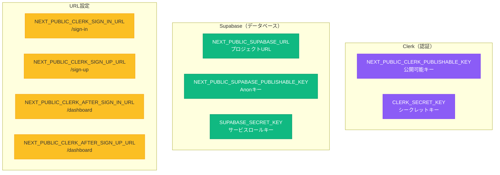

### **環境変数の取得場所**

| サービス | 取得場所 | 手順 |
|---------|---------|------|
| **Clerk** | Dashboard → API Keys | 1. プロジェクトを選択<br/>2. API Keysタブ<br/>3. キーをコピー |
| **Supabase** | Dashboard → Settings → API | 1. プロジェクトを選択<br/>2. Settings → API<br/>3. Project URL、anon key、service_role keyをコピー |

### **.env.localファイルの作成**

```bash
# プロジェクトのルートディレクトリに.env.localを作成
# 以下の内容をコピペして、各値を置き換える

# Clerk（Session 3-2で取得）
NEXT_PUBLIC_CLERK_PUBLISHABLE_KEY=pk_test_xxxxxxxxxxxxxxxxxxxxxxx
CLERK_SECRET_KEY=sk_test_xxxxxxxxxxxxxxxxxxxxxxx

# Supabase（Session 3-1で取得）
NEXT_PUBLIC_SUPABASE_URL=https://xxxxxxxxxxxxx.supabase.co
NEXT_PUBLIC_SUPABASE_PUBLISHABLE_KEY=eyJhbGciOiJIUzI1NiIsInR5cCI6IkpXVCJ9.xxxxx
SUPABASE_SECRET_KEY=eyJhbGciOiJIUzI1NiIsInR5cCI6IkpXVCJ9.xxxxx

# URL設定（そのまま使用）
NEXT_PUBLIC_CLERK_SIGN_IN_URL=/sign-in
NEXT_PUBLIC_CLERK_SIGN_UP_URL=/sign-up
NEXT_PUBLIC_CLERK_AFTER_SIGN_IN_URL=/dashboard
NEXT_PUBLIC_CLERK_AFTER_SIGN_UP_URL=/dashboard
```

### **よくある環境変数のミス**

| ❌ 間違い | 原因 | ✅ 解決方法 |
|----------|------|------------|
| キーが認識されない | スペースや改行が混入 | キーの前後の空白を削除 |
| 値が取得できない | クォートで囲んでいる | クォートなしで記述 |
| NEXT_PUBLICが効かない | サーバー再起動していない | `npm run dev`を再実行 |
| シークレットキーが漏洩 | GitHubにコミット | `.gitignore`に`.env.local`を追加 |

---

## 🚀 プロンプト実行の具体的手順

### **Step 1: プロジェクトの準備**

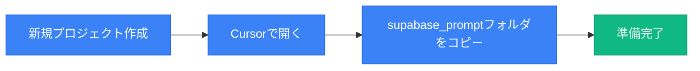

#### 具体的なコマンド
```bash
# 1. 新規プロジェクト作成
npx create-next-app@latest my-social-app --typescript --tailwind --app

# 2. プロジェクトに移動
cd my-social-app

# 3. Cursorで開く
cursor .

# 4. supabase_promptフォルダをプロジェクトルートにコピー
# （提供されたフォルダをドラッグ&ドロップ）
```

### **Step 2: Cursorでプロンプト実行**

#### Composerを開く
```
Cursorへの指示：
「Cmd+K（Mac）またはCtrl+K（Windows）でComposerを開いてください」
```

#### プロンプトファイルを参照
```
Cursorへの指示：
「@supabase_prompt/QUICK_START_PROMPT.md を開いてください」
```

#### シナリオ1のプロンプトをコピー
```
Cursorへの指示：
「シナリオ1: ゼロからの完全統合（最も推奨）のプロンプトを
コピーして実行してください」
```

### **Step 3: AIの生成を待つ**

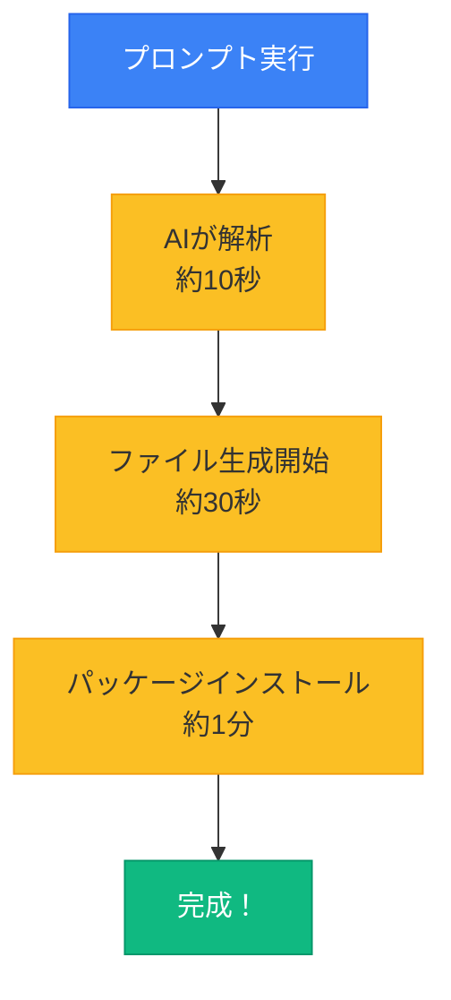

#### 生成される内容の順序
1. **パッケージインストールコマンド**
2. **環境変数テンプレート**（.env.example）
3. **ミドルウェア設定**（middleware.ts）
4. **認証ページ**（sign-in、sign-up）
5. **Supabaseクライアント**（lib/supabase/）
6. **データベース定義**（migrations/）
7. **CRUD機能**（actions/）
8. **UIコンポーネント**（components/）
9. **メインページ**（dashboard/）

---

## ✅ 動作確認チェックリスト

### **Phase 1: 基本動作確認**

| チェック項目 | 確認方法 | 期待される結果 |
|------------|---------|--------------|
| ☐ 開発サーバー起動 | `npm run dev` | エラーなく起動 |
| ☐ トップページ表示 | http://localhost:3000 | ページが表示される |
| ☐ 環境変数認識 | コンソールログ確認 | エラーメッセージなし |
| ☐ 認証ページ表示 | /sign-in にアクセス | Clerkのログイン画面 |

### **Phase 2: 認証機能確認**

| チェック項目 | 確認方法 | 期待される結果 |
|------------|---------|--------------|
| ☐ サインアップ | /sign-up でアカウント作成 | 成功後/dashboardへ |
| ☐ ログイン | /sign-in でログイン | 成功後/dashboardへ |
| ☐ ログアウト | UserButtonクリック | トップページへ |
| ☐ 保護ページ | /dashboard に直接アクセス | ログイン画面へリダイレクト |

### **Phase 3: データベース機能確認**

| チェック項目 | 確認方法 | 期待される結果 |
|------------|---------|--------------|
| ☐ テーブル作成 | Supabase Dashboard確認 | テーブルが存在 |
| ☐ RLSポリシー | Policiesタブ確認 | ポリシーが有効 |
| ☐ データ作成 | 投稿フォーム送信 | 投稿が保存される |
| ☐ データ表示 | ダッシュボード確認 | 投稿一覧が表示 |

---

## 🔧 よくあるエラーと解決方法

### **エラー1: Missing NEXT_PUBLIC_CLERK_PUBLISHABLE_KEY**

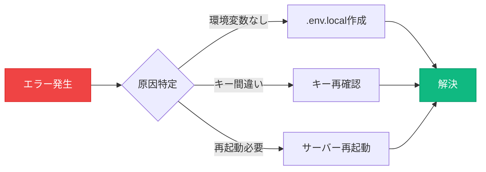

**解決手順**:
```bash
# 1. .env.localファイルを確認
cat .env.local

# 2. キーが正しいか確認（Clerk Dashboardと照合）

# 3. 開発サーバーを再起動
npm run dev
```

### **エラー2: Invalid authentication credentials (Supabase)**

**原因と解決**:
| 原因 | チェック方法 | 解決方法 |
|------|------------|---------|
| JWT未設定 | Clerk Dashboard → JWT Templates | JWT Template作成 |
| キー不一致 | Supabase → Settings → Auth | JWT Secretを一致させる |
| RLS未設定 | Supabase → Authentication → Policies | RLSポリシー追加 |

### **エラー3: Request failed with status code 404**

**原因と解決**:
```
Cursorへの指示：
「app/api/webhook/route.tsが存在するか確認してください。
存在しない場合は、シナリオ1のWebhook部分を再実行してください」
```

---

## 💡 この章のまとめ

- ✅ 環境変数は正確にコピーし、前後の空白に注意
- ✅ プロンプト実行は3ステップ（準備・実行・待機）
- ✅ 動作確認は段階的に（基本→認証→データベース）
- ✅ エラーが出ても慌てない、ほとんどは環境変数か再起動で解決
- ✅ チェックリストを使って、確実に進める

## 🚀 次の章への橋渡し

実装の具体的な手順を理解しました。
次の第4章では、生成されたコードで**CRUD操作（作成・読取・更新・削除）**を実装する方法を学びます。
実際のアプリケーション機能を、Server Actionsを使って構築していきます。

---

# 第4章：CRUD操作の実装

## 🎯 この章で学ぶこと

- **CRUD（Create, Read, Update, Delete）**の概念と重要性
- **Server Actions**を使った最新のデータ操作パターン
- **リアルタイムデータ同期**の実装方法
- **楽観的更新（Optimistic Updates）**でユーザー体験を向上
- **セキュリティを保ちながら**効率的にデータを操作する方法

## 📌 この章の位置づけ

前章で基本的な統合が完了しました。この章では、その基盤の上に**実際のアプリケーション機能**を構築します。

データの作成から削除まで、**実用的な機能**を一通り実装できるようになります。

---

## 📝 CRUDとは何か

### **すべてのアプリケーションの基本操作**

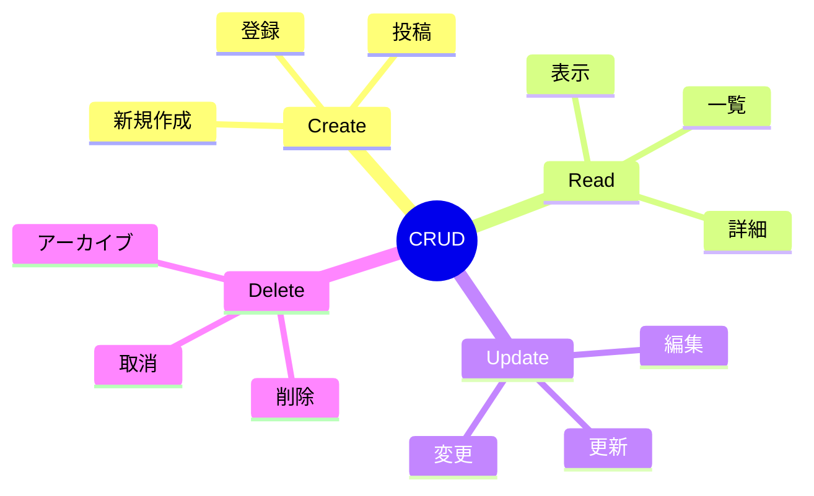

### **身近なアプリでのCRUD例**

| アプリ | Create | Read | Update | Delete |
|--------|--------|------|--------|--------|
| **Twitter** | ツイート投稿 | タイムライン表示 | ツイート編集 | ツイート削除 |
| **Instagram** | 写真投稿 | フィード表示 | キャプション編集 | 投稿削除 |
| **メモアプリ** | メモ作成 | メモ一覧 | メモ編集 | メモ削除 |
| **ECサイト** | 商品登録 | 商品表示 | 在庫更新 | 商品削除 |

---

## ✍️ Create（作成）: 新規投稿機能

### **AIへの指示例**

```
Cursorへの指示：
「app/dashboard/page.tsxに投稿フォームを追加してください。
Server Actionを使って投稿をSupabaseに保存してください。
フォームには以下を含めてください：
- テキストエリア（投稿内容）
- 送信ボタン
- 送信中のローディング状態」
```

### **生成されるコード構造**

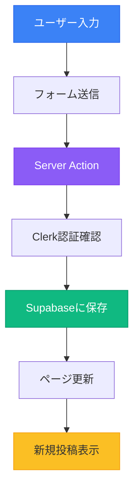

### **実装のポイント**

| 要素 | 実装内容 | 理由 |
|------|---------|------|
| **Server Action** | `'use server'`ディレクティブ | サーバー側で実行 |
| **認証チェック** | `auth()`でユーザーID取得 | 投稿者を特定 |
| **データ検証** | 空文字チェック | 不正なデータ防止 |
| **再検証** | `revalidatePath('/dashboard')` | 即座に反映 |
| **エラー処理** | try-catchブロック | 失敗時の対処 |

---

## 📖 Read（読取）: タイムライン表示

### **AIへの指示例**

```
Cursorへの指示：
「投稿一覧をタイムライン形式で表示してください。
以下の要件を満たしてください：
- 新しい投稿が上に表示
- ユーザー名とアバターを表示
- 投稿時刻を相対時間で表示（例：3分前）
- 投稿がない場合は「まだ投稿がありません」を表示」
```

### **データ取得のフロー**


### **クエリの最適化**

| テクニック | 実装方法 | 効果 |
|-----------|---------|------|
| **結合（JOIN）** | `.select('*, profiles(*)')` | N+1問題回避 |
| **ソート** | `.order('created_at', { ascending: false })` | 最新順表示 |
| **制限** | `.limit(20)` | パフォーマンス向上 |
| **リアルタイム** | `.subscribe()` | 自動更新 |

---

## ✏️ Update（更新）: 投稿編集

### **AIへの指示例**

```
Cursorへの指示：
「投稿の編集機能を追加してください。
以下の要件を満たしてください：
- 自分の投稿のみ編集可能
- インライン編集（その場で編集）
- 編集中は他のアクションを無効化
- 保存後は即座に反映」
```

### **編集権限の制御**

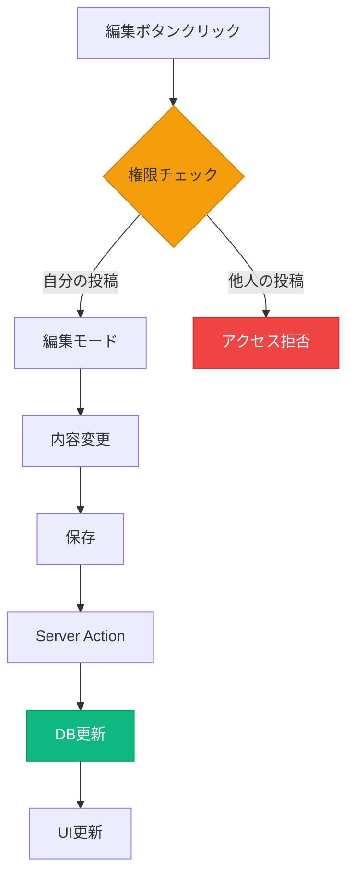

### **楽観的更新の実装**

| ステップ | 処理 | ユーザー体験 |
|---------|------|------------|
| 1. UIを即座に更新 | `useOptimistic` | 遅延を感じない |
| 2. Server Action実行 | バックグラウンド処理 | 待機不要 |
| 3. 成功時 | そのまま | スムーズ |
| 4. 失敗時 | 元に戻す | エラー表示 |

---

## 🗑️ Delete（削除）: 投稿削除

### **AIへの指示例**

```
Cursorへの指示：
「投稿の削除機能を追加してください。
以下の要件を満たしてください：
- 自分の投稿のみ削除可能
- 削除前に確認ダイアログ
- ソフトデリート（論理削除）対応
- 削除後はフェードアウトアニメーション」
```

### **削除の種類**

| 種類 | 実装方法 | メリット | デメリット |
|------|---------|---------|-----------|
| **物理削除** | `DELETE FROM posts` | シンプル | 復元不可 |
| **論理削除** | `UPDATE posts SET deleted_at = NOW()` | 復元可能 | データ残存 |
| **アーカイブ** | 別テーブルに移動 | 履歴保持 | 複雑 |

### **安全な削除フロー**

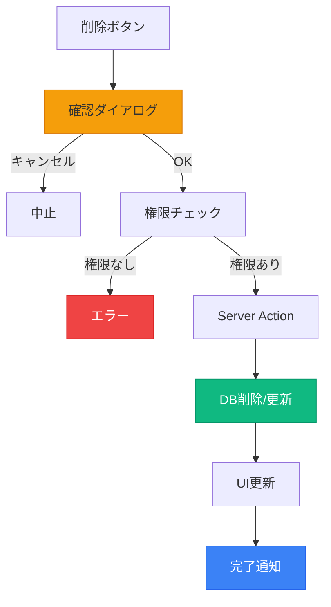

---

## 🔄 リアルタイム同期

### **Supabase Realtimeの活用**

```
Cursorへの指示：
「投稿のリアルタイム更新を実装してください。
新規投稿、編集、削除がすべてのユーザーに即座に反映されるようにしてください。
@supabase_prompt/supabase_realtime_AIprompt.md を参考にしてください」
```

### **リアルタイム更新のフロー**

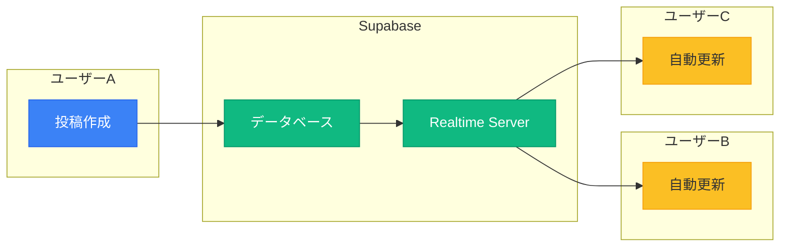

---

## 💡 この章のまとめ

- ✅ CRUD操作は、すべてのアプリケーションの基本
- ✅ Server Actionsを使うことで、安全で効率的な実装が可能
- ✅ 権限チェックは必須（自分のデータのみ編集・削除）
- ✅ 楽観的更新でユーザー体験を向上
- ✅ リアルタイム同期で、複数ユーザー対応も簡単

## 🚀 次の章への橋渡し

CRUD操作の実装方法を理解しました。
次の第5章では、これまでに学んだすべてを統合した**宿題課題**について詳しく説明します。
実際に手を動かして、完全なアプリケーションを作成していただきます。

---

# 第5章：宿題課題 - 認証付きCRUDアプリの完成

## 🎯 この章で学ぶこと

- **宿題の全体像と目標**を理解し、何を作るのかを明確にする
- **必須タスクと発展タスク**の違いと、それぞれの実装優先度
- **効率的な実装手順**で、限られた時間で最大の成果を出す方法
- **提出方法とフィードバック**の流れ
- **よくある質問と回答**で、事前に疑問を解消

## 📌 この章の位置づけ

これまでの講義で学んだ知識を、**実践で確実に身につける**ための宿題課題です。

理論を実践に移し、**自分の力でアプリケーションを完成**させることで、真のVibe Coderへと成長します。

---

## 📋 宿題の全体像

### **作るもの：ソーシャルアプリケーション**

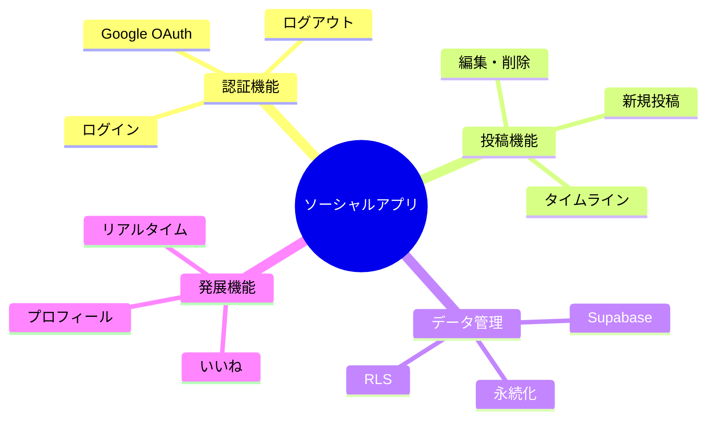

### **期待される成果物**

| レベル | 内容 | 達成目標 | 想定時間 |
|--------|------|---------|---------|
| **必須（最低限）** | 認証＋基本CRUD | 動くアプリ | 2-3時間 |
| **目標（推奨）** | 必須＋発展1つ | 実用レベル | 3-4時間 |
| **理想（チャレンジ）** | 全機能＋独自アイデア | プロダクトレベル | 4-5時間 |

---

## ✅ 必須タスク（最低限の動作）

### **これだけは必ず実装**

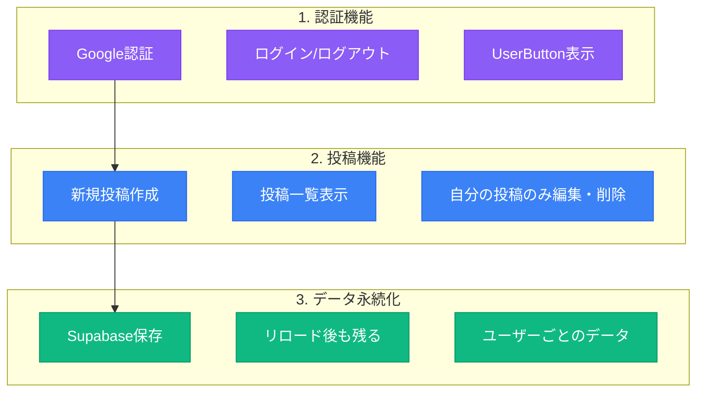

### **必須タスクのチェックリスト**

#### 認証機能
- ☐ `/sign-in`ページでログインできる
- ☐ `/sign-up`ページで新規登録できる
- ☐ Google OAuthが動作する
- ☐ ログアウトができる
- ☐ UserButtonが表示される

#### 投稿機能
- ☐ 投稿フォームがある
- ☐ 投稿が作成できる
- ☐ 投稿一覧が表示される
- ☐ 自分の投稿に編集ボタンが表示される
- ☐ 自分の投稿を削除できる

#### データ永続化
- ☐ 投稿がSupabaseに保存される
- ☐ ページをリロードしても投稿が残る
- ☐ 他のユーザーの投稿と区別される
- ☐ ログアウト後も投稿が保持される

---

## 🚀 発展タスク（チャレンジ）

### **余力があれば挑戦**

#### 1. いいね機能（推奨度：⭐⭐⭐⭐⭐）

```
Cursorへの指示：
「投稿にいいね機能を追加してください。
- 各投稿にいいねボタンを表示
- いいね数をカウント表示
- useOptimisticで楽観的更新
- 自分がいいねした投稿はボタンの色を変える」
```

**実装のポイント**:
- 新しいテーブル`likes`を作成
- ユーザーIDと投稿IDの組み合わせでユニーク制約
- 楽観的更新で即座にUIを更新

#### 2. プロフィール機能（推奨度：⭐⭐⭐⭐）

```
Cursorへの指示：
「ユーザープロフィール機能を追加してください。
- プロフィール編集ページ（/profile）
- ユーザー名の変更
- 自己紹介文の追加
- アバター画像のアップロード（Supabase Storage使用）」
```

**実装のポイント**:
- `profiles`テーブルの拡張
- Supabase Storageでファイルアップロード
- 画像のリサイズ・最適化

#### 3. リアルタイム機能（推奨度：⭐⭐⭐⭐⭐）

```
Cursorへの指示：
「リアルタイム更新機能を追加してください。
@supabase_prompt/supabase_realtime_AIprompt.md を使用して、
- 新規投稿の自動表示
- いいねの即座反映
- 削除の即座反映」
```

**実装のポイント**:
- Supabase Realtimeのsubscription
- WebSocketの接続管理
- 効率的な再レンダリング

### **発展タスクの難易度と学習価値**

| タスク | 難易度 | 学習価値 | 実装時間 |
|--------|--------|---------|---------|
| **いいね機能** | ⭐⭐⭐ | 高（楽観的更新） | 30-45分 |
| **プロフィール** | ⭐⭐⭐⭐ | 高（ファイル処理） | 45-60分 |
| **リアルタイム** | ⭐⭐⭐⭐ | 最高（WebSocket） | 30-45分 |
| **フォロー機能** | ⭐⭐⭐⭐⭐ | 高（複雑なリレーション） | 60-90分 |
| **検索機能** | ⭐⭐ | 中（全文検索） | 20-30分 |
| **通知機能** | ⭐⭐⭐⭐⭐ | 高（非同期処理） | 60-90分 |

---

## 🎁 QUICK_START_PROMPTを使った実装手順

### **最速で宿題を完成させる方法**

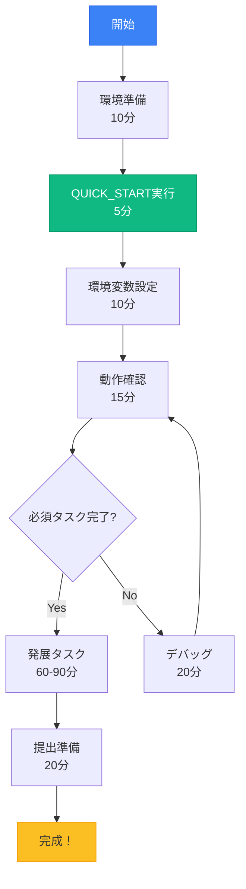

### **具体的な実装手順**

#### Step 1: プロジェクト準備（10分）
```bash
# 新規プロジェクト作成
npx create-next-app@latest my-social-app --typescript --tailwind --app
cd my-social-app

# supabase_promptフォルダをコピー
# Cursorで開く
cursor .
```

#### Step 2: QUICK_START実行（5分）
```
Cursorへの指示：
「@supabase_prompt/QUICK_START_PROMPT.md の
シナリオ1: ゼロからの完全統合を実行してください」
```

#### Step 3: 環境変数設定（10分）
1. Clerk Dashboardからキー取得
2. Supabase DashboardからURL・キー取得
3. `.env.local`に貼り付け

#### Step 4: 動作確認（15分）
```bash
npm run dev
```
- http://localhost:3000 にアクセス
- ログイン・投稿作成をテスト

#### Step 5: 発展タスク実装（60-90分）
```
Cursorへの指示：
「いいね機能を追加してください。
useOptimisticを使った楽観的更新を実装してください」
```

---

## 📤 提出方法

### **GitHubで共有**


#### 具体的なコマンド
```bash
# 1. Git初期化
git init
git add .
git commit -m "Initial commit: 認証付きCRUDアプリ完成"

# 2. GitHubリポジトリ作成
gh repo create my-social-app --public --source=. --remote=origin --push

# または GitHubのWebサイトで作成してから
git remote add origin https://github.com/あなたのユーザー名/my-social-app.git
git push -u origin main
```

### **README.md作成**

```
Cursorへの指示：
「README.mdを作成してください。以下を含めてください：
- アプリ名と概要
- 実装した機能一覧（必須・発展）
- 使用技術（Next.js, Clerk, Supabase）
- セットアップ方法
- 工夫した点（3つ以上）
- 苦労した点と解決方法（2つ以上）
- 今後の改善案（2つ以上）」
```

### **提出チェックリスト**

- ☐ GitHubリポジトリが公開設定
- ☐ README.mdが充実している
- ☐ .env.localは含まれていない（.gitignoreで除外）
- ☐ .env.exampleが含まれている
- ☐ 動作確認済み
- ☐ SlackにURL共有

---

## 🔥 実装のマインドセット

### **大切な3つの考え方**

#### 1. 完璧を求めない
```mermaid
graph LR
    A[60%の完成度] --> B[動くアプリ]
    C[100%を目指す] --> D[未完成]

    B --> E[成功体験]
    D --> F[挫折]

    style B fill:#10b981,stroke:#059669,color:#fff
    style E fill:#10b981,stroke:#059669,color:#fff
    style D fill:#ef4444,stroke:#dc2626,color:#fff
    style F fill:#ef4444,stroke:#dc2626,color:#fff
```

#### 2. エラーを恐れない
| エラー発生時 | 対応 | 結果 |
|------------|------|------|
| **従来の考え方** | 自分を責める | 挫折 |
| **Vibe Coder** | AIに聞く | 解決＋学習 |

#### 3. 小さな成功を積み重ねる
- ✅ ログインできた → 成功！
- ✅ 投稿が保存された → 成功！
- ✅ 一覧が表示された → 成功！
- ✅ 編集できた → 成功！
- ✅ 削除できた → 成功！

### **時間配分の目安**

| フェーズ | 時間 | 内容 |
|---------|------|------|
| **環境構築** | 30分 | プロジェクト作成、プロンプト実行 |
| **必須タスク** | 90分 | 認証・CRUD実装 |
| **休憩** | 15分 | リフレッシュ |
| **発展タスク** | 60分 | 1-2個選んで実装 |
| **提出準備** | 30分 | GitHub、README作成 |
| **合計** | 3時間45分 | 余裕を持って完成 |

---

## 💡 この章のまとめ

- ✅ 宿題は「認証付きCRUDアプリ」の完成が目標
- ✅ 必須タスクを優先し、動くものを作ることが最重要
- ✅ QUICK_START_PROMPTを使えば、30分で基本機能が完成
- ✅ 発展タスクは、余力があれば挑戦（いいね機能がおすすめ）
- ✅ 完璧を求めず、小さな成功を積み重ねる

## 🚀 次の章への橋渡し

宿題課題の全容を理解しました。
次の第6章では、実装中に**よく発生するトラブル**と、その解決方法を詳しく解説します。
エラーに遭遇しても、慌てずに対処できるようになります。

---

# 第6章：トラブルシューティング完全ガイド

## 🎯 この章で学ぶこと

- **よくあるエラーTop 10**と、それぞれの具体的な解決方法
- **エラーメッセージの読み方**と、問題の本質を見抜く方法
- **デバッグの効率的な手順**で、最短で問題を解決
- **質問の仕方**を学び、的確なサポートを受ける方法
- **予防的対策**で、エラーを未然に防ぐ

## 📌 この章の位置づけ

実装中に必ず遭遇するエラーや問題に対して、**冷静に対処できる力**を身につけます。

この章の知識があれば、**99%のエラーは自力で解決**できるようになります。

---

## 🚨 よくあるエラーTop 10

### **発生頻度順のエラーランキング**

```mermaid
graph TB
    subgraph "環境系（60%）"
        A[1. 環境変数エラー]
        B[2. パッケージ不足]
        C[3. ポート競合]
        style A fill:#ef4444,stroke:#dc2626,color:#fff
        style B fill:#ef4444,stroke:#dc2626,color:#fff
        style C fill:#ef4444,stroke:#dc2626,color:#fff
    end

    subgraph "認証系（25%）"
        D[4. Clerk認証エラー]
        E[5. JWT不一致]
        F[6. セッション切れ]
        style D fill:#f59e0b,stroke:#d97706
        style E fill:#f59e0b,stroke:#d97706
        style F fill:#f59e0b,stroke:#d97706
    end

    subgraph "DB系（15%）"
        G[7. RLSエラー]
        H[8. 型エラー]
        I[9. 接続エラー]
        J[10. マイグレーション]
        style G fill:#fbbf24,stroke:#f59e0b
        style H fill:#fbbf24,stroke:#f59e0b
        style I fill:#fbbf24,stroke:#f59e0b
        style J fill:#fbbf24,stroke:#f59e0b
    end
```

---

## 🔧 エラー1: Missing Environment Variable

### **エラーメッセージ例**
```
Error: Missing NEXT_PUBLIC_CLERK_PUBLISHABLE_KEY
Please check your .env.local file
```

### **診断フローチャート**

```mermaid
flowchart TD
    A[環境変数エラー] --> B{.env.localある？}
    B -->|No| C[ファイル作成]
    B -->|Yes| D{キー設定済み？}
    D -->|No| E[キー追加]
    D -->|Yes| F{スペルミス？}
    F -->|Yes| G[修正]
    F -->|No| H{再起動した？}
    H -->|No| I[npm run dev]
    H -->|Yes| J[キャッシュクリア]

    C --> K[解決]
    E --> K
    G --> K
    I --> K
    J --> K

    style A fill:#ef4444,stroke:#dc2626,color:#fff
    style K fill:#10b981,stroke:#059669,color:#fff
```

### **解決手順**

```bash
# 1. .env.localファイルの確認
ls -la .env.local

# 2. ファイルが存在しない場合は作成
touch .env.local

# 3. 環境変数を追加（エディタで編集）
# NEXT_PUBLIC_CLERK_PUBLISHABLE_KEY=pk_test_xxxxx
# CLERK_SECRET_KEY=sk_test_xxxxx

# 4. 開発サーバーを再起動
npm run dev

# 5. それでも解決しない場合はキャッシュクリア
rm -rf .next
npm run dev
```

---

## 🔧 エラー2: Module not found

### **エラーメッセージ例**
```
Module not found: Can't resolve '@clerk/nextjs'
```

### **解決手順**

```bash
# 1. パッケージをインストール
npm install @clerk/nextjs @supabase/supabase-js @supabase/ssr

# 2. node_modulesを削除して再インストール（キャッシュクリア）
rm -rf node_modules package-lock.json
npm install

# 3. 開発サーバーを再起動
npm run dev
```

### **よく不足するパッケージ一覧**

| パッケージ | 用途 | インストールコマンド |
|-----------|------|-------------------|
| `@clerk/nextjs` | Clerk認証 | `npm install @clerk/nextjs` |
| `@supabase/supabase-js` | Supabaseクライアント | `npm install @supabase/supabase-js` |
| `@supabase/ssr` | SSR対応 | `npm install @supabase/ssr` |
| `lucide-react` | アイコン | `npm install lucide-react` |
| `clsx` | クラス名結合 | `npm install clsx` |

---

## 🔧 エラー3: Port 3000 is already in use

### **エラーメッセージ例**
```
Port 3000 is already in use.
```

### **解決方法**

```bash
# 方法1: 別のポートを使う
npm run dev -- -p 3001

# 方法2: 3000番ポートを使用しているプロセスを終了
# Mac/Linux
lsof -i :3000
kill -9 [PID]

# Windows
netstat -ano | findstr :3000
taskkill /PID [PID] /F

# 方法3: すべてのNode.jsプロセスを終了
pkill node
```

---

## 🔧 エラー4: Clerk Authentication Error

### **エラーメッセージ例**
```
Clerk: Failed to load Clerk
```

### **チェックリスト**

| チェック項目 | 確認方法 | 解決方法 |
|------------|---------|---------|
| ☐ 公開キーが正しい | Clerk Dashboard確認 | キーを再コピー |
| ☐ シークレットキーが正しい | 環境変数確認 | キーを再コピー |
| ☐ ドメインが許可されている | Clerk Dashboard → Domains | localhost追加 |
| ☐ ClerkProviderが設定済み | app/layout.tsx確認 | Provider追加 |

### **解決コード**

```
Cursorへの指示：
「app/layout.tsxにClerkProviderが正しく設定されているか確認してください。
設定されていない場合は追加してください」
```

---

## 🔧 エラー5: RLS Policy Violation

### **エラーメッセージ例**
```
new row violates row-level security policy for table "posts"
```

### **RLSエラーの診断**

```mermaid
flowchart TD
    A[RLSエラー] --> B{RLS有効？}
    B -->|No| C[RLS有効化]
    B -->|Yes| D{ポリシー設定済み？}
    D -->|No| E[ポリシー作成]
    D -->|Yes| F{JWTが正しい？}
    F -->|No| G[JWT設定確認]
    F -->|Yes| H{user_idが一致？}
    H -->|No| I[データ修正]
    H -->|Yes| J[Supabaseサポート]

    style A fill:#ef4444,stroke:#dc2626,color:#fff
    C --> K[解決]
    E --> K
    G --> K
    I --> K
    style K fill:#10b981,stroke:#059669,color:#fff
```

### **解決SQL**

```sql
-- Supabase SQL Editorで実行

-- 1. RLSを有効化
ALTER TABLE posts ENABLE ROW LEVEL SECURITY;

-- 2. ポリシーを作成（全ユーザー読み取り可能）
CREATE POLICY "Everyone can view posts"
ON posts FOR SELECT
TO authenticated
USING (true);

-- 3. 自分の投稿のみ作成・更新・削除可能
CREATE POLICY "Users can manage own posts"
ON posts FOR ALL
TO authenticated
USING (auth.jwt() ->> 'sub' = user_id)
WITH CHECK (auth.jwt() ->> 'sub' = user_id);
```

---

## 🎓 効率的なデバッグ手順

### **5ステップデバッグフロー**

```mermaid
flowchart LR
    A[1.エラーメッセージ<br/>をコピー] --> B[2.AIに質問]
    B --> C[3.提案を試す]
    C --> D{解決？}
    D -->|No| E[4.詳細情報追加]
    D -->|Yes| F[5.完了]
    E --> B

    style A fill:#3b82f6,stroke:#2563eb,color:#fff
    style B fill:#8b5cf6,stroke:#7c3aed,color:#fff
    style F fill:#10b981,stroke:#059669,color:#fff
```

### **AIへの質問テンプレート**

```
以下のエラーが発生しています：
[エラーメッセージをペースト]

環境：
- Next.js 14 (App Router)
- Clerk認証
- Supabase
- TypeScript

試したこと：
1. [実行したコマンドや対策]

関連するコード：
[該当部分のコードをペースト]

このエラーを解決する方法を教えてください。
```

---

## 💬 質問の仕方

### **良い質問と悪い質問の例**

| ❌ 悪い質問 | ✅ 良い質問 |
|------------|-----------|
| 「動きません」 | 「ログインボタンをクリックすると404エラーが出ます」 |
| 「エラーが出ます」 | 「Missing NEXT_PUBLIC_CLERK_PUBLISHABLE_KEYというエラーが出ています」 |
| 「なんか変です」 | 「投稿は作成できますが、一覧に表示されません」 |
| 「助けて」 | 「RLSエラーが出ています。以下のSQLを実行しましたが解決しません：[SQL]」 |

### **質問に含めるべき情報**

1. **エラーメッセージ全文**（スクリーンショットより**テキスト**が好ましい）
2. **実行したコマンドや操作**
3. **期待した結果と実際の結果**
4. **関連するコードの該当部分**
5. **試した解決策とその結果**

---

## 🛡️ エラーを防ぐ予防策

### **開発前のチェックリスト**

```mermaid
mindmap
  root((予防策))
    環境準備
      .env.local作成
      パッケージ確認
      ポート確認
    定期保存
      Git commit
      環境変数バックアップ
      動作確認記録
    AIツール
      エラー即質問
      コード生成確認
      ベストプラクティス
```

### **プロジェクト開始時のテンプレート**

```bash
#!/bin/bash
# setup.sh - プロジェクト初期設定スクリプト

# 1. 必要なファイルを作成
touch .env.local
echo "# 環境変数をここに追加" > .env.local

# 2. .env.exampleを作成
cat > .env.example << EOF
NEXT_PUBLIC_CLERK_PUBLISHABLE_KEY=
CLERK_SECRET_KEY=
NEXT_PUBLIC_SUPABASE_URL=
NEXT_PUBLIC_SUPABASE_PUBLISHABLE_KEY=
SUPABASE_SECRET_KEY=
EOF

# 3. .gitignoreに.env.localを追加
echo ".env.local" >> .gitignore

# 4. パッケージをインストール
npm install @clerk/nextjs @supabase/supabase-js @supabase/ssr

echo "✅ セットアップ完了！"
```

---

## 💡 この章のまとめ

- ✅ エラーの60%は環境変数関連、再起動で解決することが多い
- ✅ エラーメッセージは必ず**全文をコピー**してAIに質問
- ✅ 5ステップデバッグフローで効率的に問題解決
- ✅ 良い質問には、エラー内容・試したこと・コードを含める
- ✅ 予防策を実施すれば、エラーの大半は回避できる

## 🚀 次の章への橋渡し

トラブルシューティングの方法を習得しました。
最終章となる第7章では、今回の講義全体を振り返り、次回講義への期待を高めます。
あなたの成長を確認し、さらなる飛躍への道筋を示します。

---

# 第7章：まとめと次回への期待

## 🎯 この章で学ぶこと

- **今日の講義で達成したこと**を振り返り、自分の成長を実感
- **習得したスキルの価値**を理解し、実務での活用方法を知る
- **宿題を通じて得られる経験**と、その先にある可能性
- **次回講義（デプロイ）への期待**と、完成への道筋
- **Vibe Coderとしての成長パス**と、将来のキャリア展望

## 📌 この章の位置づけ

3回目の講義を締めくくり、これまでの学習を**確実な自信**へと変換します。

単なる知識の習得ではなく、**実践的なスキル**として身についたことを確認し、次のステップへの意欲を高めます。

---

## 🏆 今日の成果を振り返る

### **3時間前のあなた vs 今のあなた**

```mermaid
graph LR
    subgraph "3時間前"
        A[Supabaseを<br/>個別に理解]
        B[Clerkを<br/>個別に理解]
        C[統合方法が<br/>不明]
        style A fill:#fbbf24,stroke:#f59e0b
        style B fill:#fbbf24,stroke:#f59e0b
        style C fill:#ef4444,stroke:#dc2626,color:#fff
    end

    subgraph "今のあなた"
        D[統合アーキテクチャを<br/>理解]
        E[プロンプトで<br/>瞬時に実装]
        F[CRUD操作を<br/>マスター]
        style D fill:#10b981,stroke:#059669,color:#fff
        style E fill:#10b981,stroke:#059669,color:#fff
        style F fill:#10b981,stroke:#059669,color:#fff
    end

    A -.->|成長| D
    B -.->|成長| E
    C -.->|成長| F
```

### **習得したスキルの市場価値**

| スキル | 市場価値 | 年収への影響 |
|--------|---------|------------|
| **フルスタック開発** | 非常に高い | +200-400万円 |
| **認証システム実装** | 高い | +100-200万円 |
| **データベース設計** | 高い | +100-200万円 |
| **セキュリティ実装** | 非常に高い | +150-300万円 |
| **AI駆動開発** | 最高 | +300-500万円 |

**合計価値**: これらのスキルを組み合わせることで、**年収1000万円以上**のエンジニアと同等の価値を生み出せます。

---

## 📊 第三回講義の達成度

### **学習目標の達成状況**

```mermaid
graph TB
    subgraph "知識レベル"
        A[統合の理解 ✅]
        B[プロンプトの活用 ✅]
        C[CRUD実装 ✅]
    end

    subgraph "実践レベル"
        D[環境構築 ✅]
        E[認証実装 ✅]
        F[DB接続 ✅]
    end

    subgraph "応用レベル"
        G[宿題課題 🔄]
        H[独自機能 🔄]
        I[問題解決 ✅]
    end

    style A fill:#10b981,stroke:#059669,color:#fff
    style B fill:#10b981,stroke:#059669,color:#fff
    style C fill:#10b981,stroke:#059669,color:#fff
    style D fill:#10b981,stroke:#059669,color:#fff
    style E fill:#10b981,stroke:#059669,color:#fff
    style F fill:#10b981,stroke:#059669,color:#fff
    style G fill:#fbbf24,stroke:#f59e0b
    style H fill:#fbbf24,stroke:#f59e0b
    style I fill:#10b981,stroke:#059669,color:#fff
```

### **プログラム全体での位置づけ**

| 回 | テーマ | 状態 | 次のステップ |
|----|-------|------|------------|
| **第1回** | マインドセット・基礎 | ✅ 完了 | - |
| **第2回** | 技術スタック・要件定義 | ✅ 完了 | - |
| **第3回** | DB・認証・統合 | ✅ 本日完了 | 宿題実装 |
| **第4回** | デプロイ・公開 | 🔜 次回 | 世界公開 |

---

## 💪 宿題で得られる経験値

### **実装することで身につく力**

```mermaid
mindmap
  root((宿題の価値))
    技術力
      統合実装力
      問題解決力
      デバッグ力
    自信
      完成体験
      達成感
      成長実感
    ポートフォリオ
      GitHubで公開
      実績として提示
      転職に活用
    コミュニティ
      仲間と共有
      フィードバック
      相互学習
```

### **宿題完成後のあなた**

| Before（現在） | After（宿題後） | 変化 |
|--------------|---------------|------|
| 講義で学んだ知識 | 実践で使えるスキル | 💎 本物の力に |
| サンプルコード理解 | 自分でゼロから構築 | 🚀 創造力獲得 |
| エラーへの不安 | エラー対処の自信 | 💪 問題解決力 |
| 個別技術の理解 | 統合システム構築 | 🏗️ アーキテクト思考 |

---

## 🚀 次回（第四回）への期待

### **最終回で実現すること**

```mermaid
flowchart TD
    A[ローカル開発] --> B[Vercelデプロイ]
    B --> C[独自ドメイン]
    C --> D[世界に公開]
    D --> E[ユーザー獲得]
    E --> F[フィードバック]
    F --> G[改善・成長]

    style A fill:#3b82f6,stroke:#2563eb,color:#fff
    style B fill:#8b5cf6,stroke:#7c3aed,color:#fff
    style C fill:#8b5cf6,stroke:#7c3aed,color:#fff
    style D fill:#10b981,stroke:#059669,color:#fff
    style E fill:#fbbf24,stroke:#f59e0b
    style F fill:#fbbf24,stroke:#f59e0b
    style G fill:#10b981,stroke:#059669,color:#fff
```

### **第四回で学ぶこと**

| トピック | 内容 | ビジネス価値 |
|---------|------|------------|
| **Vercelデプロイ** | ワンクリックデプロイ | 即座に世界公開 |
| **環境変数管理** | 本番環境の設定 | セキュアな運用 |
| **カスタムドメイン** | 独自URL設定 | プロフェッショナル |
| **パフォーマンス最適化** | Core Web Vitals | ユーザー体験向上 |
| **SEO対策** | メタタグ・OGP | 集客力向上 |
| **Analytics** | アクセス解析 | データドリブン |

---

## 🌟 Vibe Coderとしての成長パス

### **プログラム修了後の可能性**

```mermaid
graph TD
    A[VibeCoder<br/>Bootcamp修了] --> B{進路選択}

    B --> C[フリーランス]
    C --> C1[月収50-100万円]

    B --> D[転職]
    D --> D1[年収600-1000万円]

    B --> E[起業]
    E --> E1[自社サービス]

    B --> F[副業]
    F --> F1[月収10-30万円]

    style A fill:#3b82f6,stroke:#2563eb,color:#fff
    style C1 fill:#10b981,stroke:#059669,color:#fff
    style D1 fill:#10b981,stroke:#059669,color:#fff
    style E1 fill:#10b981,stroke:#059669,color:#fff
    style F1 fill:#10b981,stroke:#059669,color:#fff
```

### **6ヶ月後のあなたの姿**

| 時期 | スキルレベル | できること | 収入の可能性 |
|------|------------|-----------|------------|
| **現在** | Vibe Coder初級 | 簡単なアプリ作成 | - |
| **1ヶ月後** | Vibe Coder中級 | 複雑なアプリ作成 | 副業5-10万円/月 |
| **3ヶ月後** | Vibe Coder上級 | プロダクト開発 | 副業20-30万円/月 |
| **6ヶ月後** | Vibe Coderマスター | チーム開発・指導 | フリーランス50万円+/月 |

---

## 📢 激励のメッセージ

### **あなたへの3つのメッセージ**

#### 1. 成長を実感してください
```
3週間前、HTMLも知らなかったあなたが、
今、認証付きのフルスタックアプリを作ろうとしています。
これは驚異的な成長です。
```

#### 2. 完璧を求めないでください
```
動くものを作ることが最重要。
美しいコードは後から。
まずは「動いた！」の感動を味わってください。
```

#### 3. 仲間と共に進んでください
```
一人で悩まない。
Slackで質問する。
仲間の成功を祝う。
みんなで成長する。
```

### **宿題実装のモチベーション**

```mermaid
graph LR
    A[今日の宿題] --> B[小さな成功体験]
    B --> C[自信の獲得]
    C --> D[次の挑戦]
    D --> E[大きな成功]
    E --> F[人生の変化]

    style A fill:#3b82f6,stroke:#2563eb,color:#fff
    style B fill:#8b5cf6,stroke:#7c3aed,color:#fff
    style C fill:#10b981,stroke:#059669,color:#fff
    style D fill:#fbbf24,stroke:#f59e0b
    style E fill:#ef4444,stroke:#dc2626,color:#fff
    style F fill:#3b82f6,stroke:#2563eb,color:#fff
```

---

## ✅ 第三回講義のまとめ

### **今日学んだこと**

- ✅ **統合アーキテクチャ**: Supabase + Clerk + Next.jsの完全統合
- ✅ **魔法のプロンプト**: QUICK_START_PROMPTで瞬時に実装
- ✅ **CRUD実装**: Create, Read, Update, Deleteの全操作
- ✅ **トラブルシューティング**: エラーへの対処法
- ✅ **実践課題**: 認証付きCRUDアプリの構築

### **持ち帰るもの**

| アイテム | 内容 | 活用方法 |
|---------|------|---------|
| **知識** | 統合開発の理解 | 実務で即活用 |
| **ツール** | プロンプト集 | 今後も繰り返し使用 |
| **自信** | できる確信 | 新しい挑戦へ |
| **仲間** | コミュニティ | 相互サポート |
| **宿題** | 実践の機会 | スキルの定着 |

---

## 🎊 締めの言葉

### **第三回講義、お疲れさまでした！**

今日のあなたの努力は、必ず未来の成功につながります。

**覚えておいてください：**
- 💎 あなたはもう、ただの受講生ではありません
- 🚀 あなたは、Vibe Coderです
- 💪 あなたには、アイデアを形にする力があります
- 🌟 あなたの可能性は、無限大です

### **宿題への取り組み方**

1. **今日中に環境構築だけでも始める**（鉄は熱いうちに）
2. **毎日30分でも触る**（継続が力）
3. **詰まったらすぐ質問**（一人で悩まない）
4. **小さな成功を祝う**（モチベーション維持）
5. **仲間と共有する**（相互学習）

### **次回お会いする時には...**

**あなたの作ったアプリが、インターネット上で動いています。**
**世界中からアクセス可能な、あなたの作品が存在しています。**

それまでの間、宿題を楽しんでください。
困ったら、いつでもSlackで質問してください。

**See you next week! 🎉**

---

## 💡 この講義のまとめ

- ✅ Supabase（データ）+ Clerk（認証）+ Next.js（フロント）の統合を完全理解
- ✅ QUICK_START_PROMPTで、プロ品質のコードを数分で生成
- ✅ CRUD操作を実装し、実用的なアプリケーションを構築可能に
- ✅ トラブルシューティング力を身につけ、自走できる力を獲得
- ✅ 宿題を通じて、理論を実践に変える機会を得た

## 🚀 次回への架け橋

第三回講義が終了しました。
宿題として「認証付きCRUDアプリ」を完成させてください。

次回（最終回）では、あなたの作品を**世界に公開**します。
Vercelを使ったデプロイメント、カスタムドメインの設定、そしてプロダクションレベルの運用について学びます。

**あなたのアプリが、世界デビューする瞬間を楽しみにしています！**

---

# 📚 付録：クイックリファレンス

## コマンド一覧

```bash
# プロジェクト作成
npx create-next-app@latest my-app --typescript --tailwind --app

# パッケージインストール
npm install @clerk/nextjs @supabase/supabase-js @supabase/ssr

# 開発サーバー起動
npm run dev

# ビルド
npm run build

# Git操作
git init
git add .
git commit -m "メッセージ"
git push
```

## 環境変数テンプレート

```bash
# .env.local
NEXT_PUBLIC_CLERK_PUBLISHABLE_KEY=
CLERK_SECRET_KEY=
NEXT_PUBLIC_SUPABASE_URL=
NEXT_PUBLIC_SUPABASE_PUBLISHABLE_KEY=
SUPABASE_SECRET_KEY=
NEXT_PUBLIC_CLERK_SIGN_IN_URL=/sign-in
NEXT_PUBLIC_CLERK_SIGN_UP_URL=/sign-up
NEXT_PUBLIC_CLERK_AFTER_SIGN_IN_URL=/dashboard
NEXT_PUBLIC_CLERK_AFTER_SIGN_UP_URL=/dashboard
```

## リソースリンク

- [Clerk Documentation](https://clerk.com/docs)
- [Supabase Documentation](https://supabase.com/docs)
- [Next.js Documentation](https://nextjs.org/docs)
- [Vercel Documentation](https://vercel.com/docs)

## サポート

- **Slack**: #vibecoder-support（質問）
- **Slack**: #vibecoder-share（成果共有）
- **GitHub**: 宿題提出先

---

**VibeCoder Bootcamp 2025年11月版**
**第3回講義資料 完了**