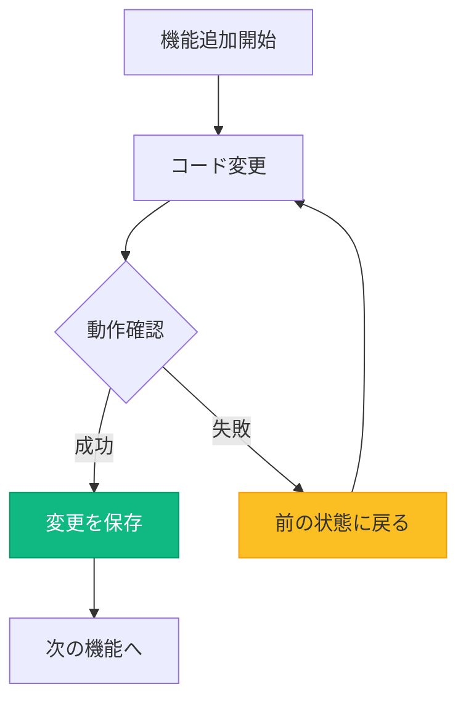
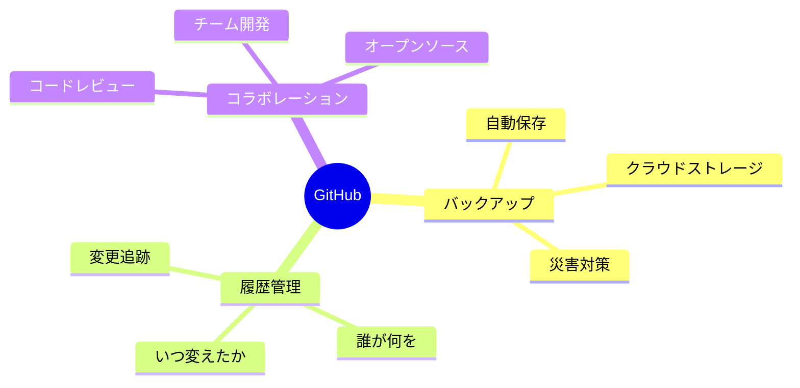
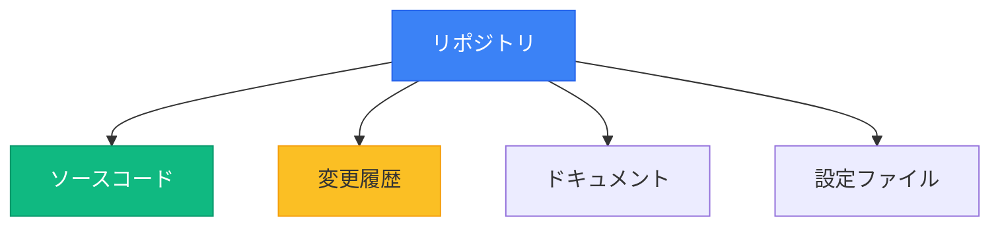
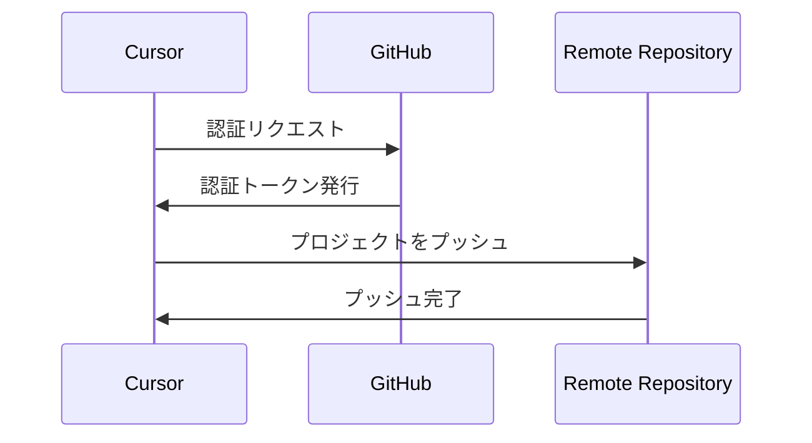
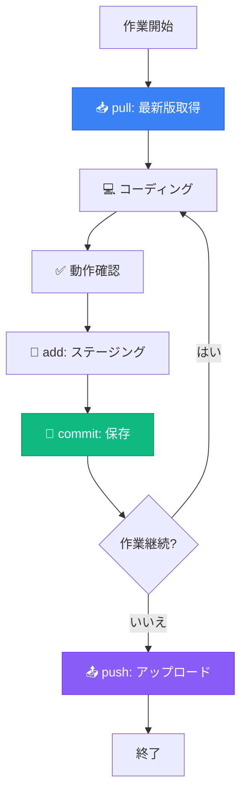
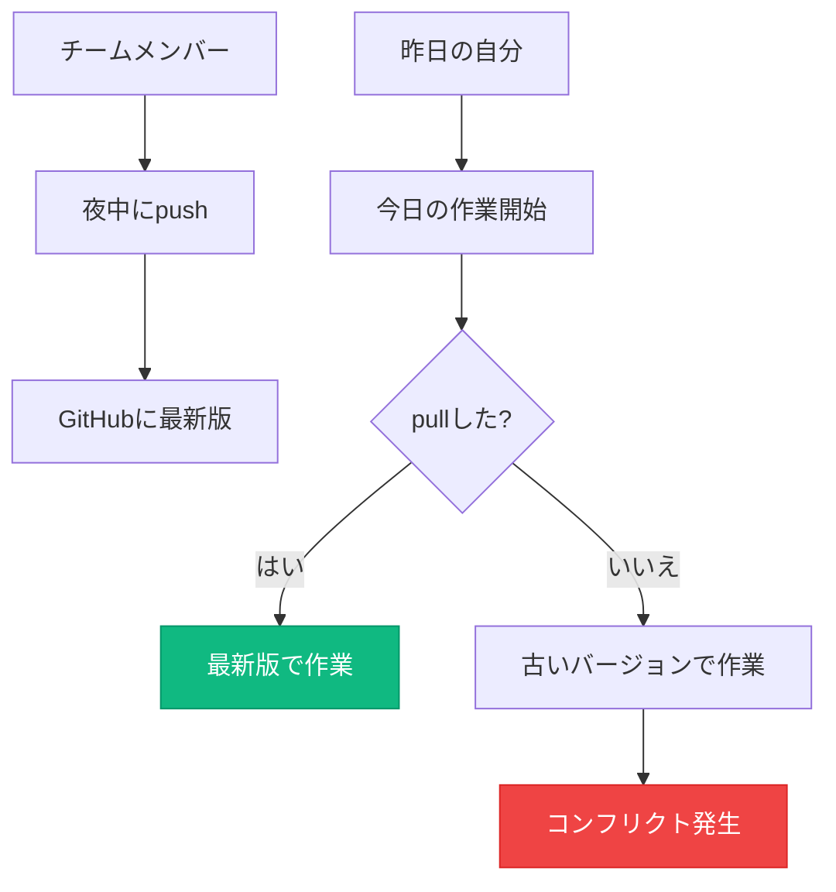
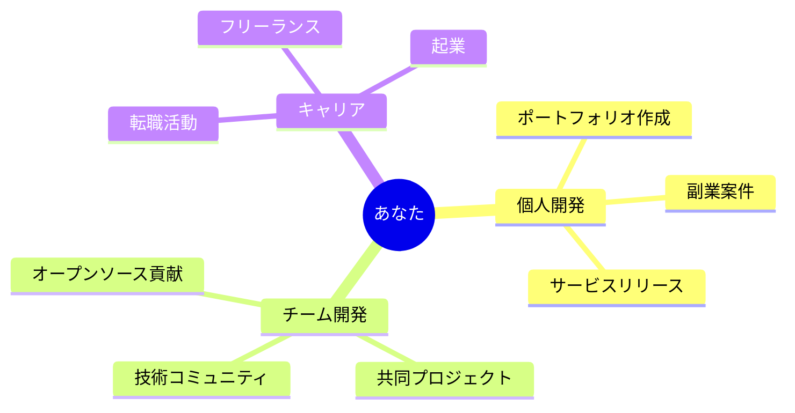

# 2-4 GitHubとの連携とバージョン管理

**所要時間**: 30分
**前提**: Cursor環境構築完了、npm run devでプロジェクト起動済み
**ゴール**: CursorとGitHubを接続し、プロジェクトをGitHubにプッシュできる状態

---

## 📚 この講義の全体像


### **30分で達成すること**

| 時間 | 内容 | 目標 |
|------|------|------|
| 0-5分 | GitHubの価値理解 | なぜGitHubが必要か理解 |
| 5-10分 | アカウント作成 | GitHubアカウント取得 |
| 10-20分 | Cursor接続 | プロジェクトをGitHubにプッシュ |
| 20-30分 | 日常フロー習得 | commit/push/pullの実践 |

---

# 第1章：なぜGitHubが必要なのか？

## 🎯 この章で学ぶこと

- **バージョン管理**の本質的価値
- **GitHub**がもたらす3つの安心感
- **チーム開発**への第一歩

## 💾 バージョン管理とは「タイムマシン」

### **開発における究極の安心感**



### **GitHubが解決する3つの問題**

| 問題 | GitHubなし | GitHubあり |
|------|-----------|-----------|
| **コード紛失** | PC故障で全て消える | クラウドに自動バックアップ |
| **変更履歴** | いつ何を変えたか不明 | 全ての変更が記録される |
| **チーム開発** | ファイル共有で混乱 | 並行作業が可能 |

## 🎮 ゲームのセーブポイントで理解する

### **Gitの概念をゲームで例えると**

```
ゲーム開発の流れ:
1. ボス戦前にセーブ（commit）
2. ボスに挑戦（新機能実装）
3. 負けた（バグ発生）
4. セーブポイントに戻る（git reset）
5. 装備を整えて再挑戦（修正して再実装）
6. 勝利！次のセーブポイント作成（commit）
```

### **開発での実例**

| ゲーム | 開発作業 | Git操作 |
|--------|---------|---------|
| セーブポイント作成 | 動く状態を保存 | `commit` |
| セーブデータ | 変更履歴 | `log` |
| 前のセーブに戻る | 過去の状態に復元 | `reset` |
| クラウドセーブ | リモートバックアップ | `push` |
| セーブダウンロード | 最新版を取得 | `pull` |

## 📊 GitHubの3つの役割



## 💡 この章のまとめ

- ✅ Git/GitHubは**タイムマシン**のようなもの
- ✅ **いつでも過去に戻れる安心感**が創造性を高める
- ✅ 個人開発でも**バックアップとして必須**
- ✅ チーム開発の**共通基盤**として業界標準

---

# 第2章：GitHubアカウント作成とリポジトリ準備

## 🎯 この章で学ぶこと

- **GitHubアカウント**の作成手順
- **リポジトリ**とは何か
- **初めてのリポジトリ**作成

## 🌍 GitHubアカウント作成

### **Step 1: GitHubにアクセス**

1. ブラウザで https://github.com を開く
2. 「Sign up」ボタンをクリック

### **Step 2: アカウント情報入力**

```
必要な情報:
- Username（ユーザー名）
  例: taro-yamada
  ポイント: シンプルで覚えやすい名前

- Email（メールアドレス）
  例: your-email@example.com
  ポイント: よく使うメールアドレス

- Password（パスワード）
  ポイント: 英数字記号を含む15文字以上推奨
```

### **Step 3: プラン選択**

| プラン | 料金 | 特徴 | おすすめ度 |
|--------|------|------|----------|
| **Free** | 無料 | 公開リポジトリ無制限<br>プライベートリポジトリ無制限 | ★★★★★ |
| **Pro** | $4/月 | 高度な分析機能<br>優先サポート | ★★★ |

**推奨**: まずはFreeプランで十分です！

### **Step 4: メール認証**

```
1. 登録したメールアドレスに確認メールが届く
2. メール内の「Verify email address」をクリック
3. GitHubにログイン完了
```

## 📦 リポジトリとは？

### **リポジトリ = プロジェクトの保管庫**



### **リポジトリの種類**

| 種類 | 公開範囲 | 用途 |
|------|---------|------|
| **Public** | 誰でも閲覧可能 | オープンソース、ポートフォリオ |
| **Private** | 自分とメンバーのみ | 個人プロジェクト、仕事 |

## 🆕 初めてのリポジトリ作成

### **GitHub上での操作**

```
1. GitHubにログイン
2. 右上の「+」マーク → 「New repository」
3. リポジトリ情報を入力
```

### **リポジトリ設定項目**

| 項目 | 入力例 | 説明 |
|------|--------|------|
| **Repository name** | my-todo-app | プロジェクト名（英数字とハイフン） |
| **Description** | AIで作ったTodoアプリ | 簡単な説明（任意） |
| **Public/Private** | Private | まずはPrivate推奨 |
| **Initialize with README** | ✅ チェック | READMEファイルを自動生成 |
| **Add .gitignore** | Node | 不要ファイルを除外 |

### **リポジトリURL**

```
作成後のURL例:
https://github.com/your-username/my-todo-app
```

このURLは後で使うので、メモしておきましょう。

## 💡 この章のまとめ

- ✅ GitHubアカウントは**無料プラン**で十分
- ✅ リポジトリは**プロジェクトの保管庫**
- ✅ まずは**Private**で作成し、後で公開も可能
- ✅ リポジトリURLをコピーしておく

---

# 第3章：CursorとGitHubを接続する

## 🎯 この章で学ぶこと

- **CursorからGitHub**への認証方法
- **Source Control**パネルの使い方
- **初回プッシュ**の実行

## 🔗 Cursor - GitHub接続の全体像



## 🖥️ Source Controlパネルの基本

### **パネルを開く方法**

```
方法1: ショートカット
- Mac: Cmd + Shift + G
- Windows: Ctrl + Shift + G

方法2: サイドバーから
1. 左サイドバーの「分岐マーク」アイコンをクリック
```

### **Source Controlパネルの見方**

```
┌─ Source Control ─────────────────────┐
│ 📝 Changes (3)                       │ ← 変更されたファイル数
│   ├─ src/app/page.tsx         M     │ ← Mは修正(Modified)
│   ├─ src/components/Button.tsx  M   │
│   └─ package.json             M     │
│                                      │
│ 💬 Message                           │
│ ┌────────────────────────────────┐  │
│ │ feat: ボタンコンポーネント追加  │  │ ← コミットメッセージ
│ └────────────────────────────────┘  │
│                                      │
│ [✓ Commit] [↻ Sync Changes]        │ ← アクションボタン
└──────────────────────────────────────┘
```

### **ファイルステータスの記号**

| 記号 | 意味 | 説明 |
|------|------|------|
| **M** | Modified | 既存ファイルを変更 |
| **A** | Added | 新しいファイルを追加 |
| **D** | Deleted | ファイルを削除 |
| **U** | Untracked | Gitに追跡されていない |

## 🔐 GitHubとの認証

### **初回認証フロー**

```
1. Cursorで初めてcommitしようとする
2. 「GitHubでサインイン」ダイアログが表示
3. ブラウザが開き、GitHubのログイン画面へ
4. 「Authorize Cursor」ボタンをクリック
5. Cursorに自動で戻り、認証完了
```

### **認証が成功したか確認**

```
Cursor下部のステータスバーに表示:
✓ GitHub: your-username
```

## 📤 プロジェクトの初回プッシュ

### **AIにお願いする方法（推奨）**

```
Cursorに指示:
「このプロジェクトを新しいGitHubリポジトリにプッシュしてください。
リポジトリ名は'my-todo-app'で、プライベートリポジトリにしてください」
```

**AIが自動で実行すること**:
1. ローカルリポジトリの初期化（`git init`）
2. 全ファイルをステージング（`git add .`）
3. 初回コミット（`git commit -m "Initial commit"`）
4. GitHubにリポジトリ作成
5. リモートリポジトリ接続（`git remote add origin`）
6. プッシュ実行（`git push -u origin main`）

### **手動でプッシュする方法**

#### **Step 1: ローカルリポジトリ初期化**

```
1. Cmd/Ctrl + Shift + P（コマンドパレット）
2. 「Git: Initialize Repository」を検索
3. プロジェクトフォルダを選択
```

#### **Step 2: 初回コミット**

```
1. Source Controlパネルを開く
2. 「+」ボタン（すべての変更をステージング）
3. メッセージ欄に入力:
   「Initial commit: プロジェクト初期セットアップ」
4. 「✓ Commit」ボタンをクリック
```

#### **Step 3: リモートリポジトリ接続**

```
1. Source Controlパネルの「...」メニュー
2. 「Remote」→「Add Remote」
3. GitHubのリポジトリURLを入力:
   https://github.com/your-username/my-todo-app.git
4. リモート名を入力（通常は「origin」）
```

#### **Step 4: プッシュ**

```
1. Source Controlパネルの「...」メニュー
2. 「Push」をクリック
3. ブランチ選択（通常は「main」）
4. GitHubでプロジェクトが確認できる
```

## ✅ 接続確認

### **GitHub上で確認**

```
1. https://github.com/your-username/my-todo-app にアクセス
2. ファイル一覧が表示されていればOK
3. コミット履歴を確認
```

### **確認すべきポイント**

| 項目 | 確認内容 |
|------|---------|
| ✅ ファイル | src/, public/, package.jsonなど |
| ✅ README | プロジェクト説明が表示される |
| ✅ .gitignore | node_modules/が除外されている |
| ✅ コミット履歴 | 「Initial commit」が記録されている |

## 💡 この章のまとめ

- ✅ CursorとGitHubの認証は**ブラウザ経由**で簡単
- ✅ Source Controlパネルで**すべての操作が可能**
- ✅ 初回プッシュは**AIに任せるのが最速**
- ✅ GitHubで**プロジェクトが確認できれば成功**

---

# 第4章：実際の開発フロー - npm run devプロジェクトをGitHubへ

## 🎯 この章で学ぶこと

- **日常的なGitワークフロー**の実践
- **commit → push → pull**の基本サイクル
- **変更履歴の確認**方法

## 🔄 開発の基本サイクル

### **毎日の開発フロー**



## 📝 実践例：ボタンコンポーネント追加

### **シナリオ**

```
タスク: ホームページに「お問い合わせ」ボタンを追加
```

### **Step 1: 最新版を取得（Pull）**

```
作業開始前に必ず実行:

方法1: AIに依頼
「GitHubから最新版をpullしてください」

方法2: Source Controlパネル
「↻ Sync Changes」ボタンをクリック
```

**なぜ必要？**
- チームメンバーの変更を取得
- コンフリクト（競合）を防ぐ
- 最新のコードベースで作業

### **Step 2: コーディング**

```jsx
// src/components/ContactButton.tsx
export default function ContactButton() {
  return (
    <button className="bg-blue-500 text-white px-6 py-3 rounded-lg">
      お問い合わせ
    </button>
  );
}
```

```jsx
// src/app/page.tsx
import ContactButton from '@/components/ContactButton';

export default function Home() {
  return (
    <main>
      <h1>Welcome!</h1>
      <ContactButton />
    </main>
  );
}
```

### **Step 3: 動作確認**

```bash
# ターミナルでサーバー起動（起動していない場合）
npm run dev

# ブラウザで確認
http://localhost:3000
```

**確認ポイント**:
- ✅ ボタンが表示されている
- ✅ デザインが意図通り
- ✅ エラーが出ていない

### **Step 4: 変更をステージング（Add）**

```
Source Controlパネルで:

1. 変更一覧を確認
   ├─ src/components/ContactButton.tsx  [A] 新規
   └─ src/app/page.tsx                  [M] 変更

2. すべての変更を選択
   「+」ボタン（すべてステージング）
   または個別に「+」をクリック
```

### **Step 5: コミット（Commit）**

#### **良いコミットメッセージの書き方**

```
形式:
<種類>: <簡潔な説明>

種類の例:
- feat: 新機能追加
- fix: バグ修正
- style: デザイン変更
- refactor: リファクタリング
- docs: ドキュメント更新
```

#### **コミット実行**

```
1. メッセージ欄に入力:
   「feat: お問い合わせボタンを追加」

2. 「✓ Commit」ボタンをクリック

3. コミット完了
   → 変更が履歴に記録される
```

### **Step 6: GitHubにプッシュ（Push）**

```
方法1: 自動同期
「↻ Sync Changes」ボタンをクリック

方法2: AIに依頼
「最新のコミットをGitHubにpushしてください」

方法3: メニューから
「...」→「Push」
```

### **Step 7: GitHub上で確認**

```
1. GitHubのリポジトリページを開く
2. 最新コミットを確認
   └─ "feat: お問い合わせボタンを追加"
3. ファイルを確認
   ├─ src/components/ContactButton.tsx ← 新規追加
   └─ src/app/page.tsx ← 更新されている
```

## 🔍 変更履歴の確認

### **Source Controlでの確認**

```
1. Source Controlパネル
2. 「COMMITS」セクション
3. 過去のコミット一覧が表示
```

### **GitHub上での確認**

```
1. リポジトリページ
2. 「X commits」をクリック
3. すべてのコミット履歴表示
   ├─ いつ
   ├─ 誰が
   ├─ 何を変更したか
   └─ コミットメッセージ
```

### **差分（Diff）の確認**

```
Source Controlパネル:
1. 変更ファイルをクリック
2. 左右比較表示
   ├─ 左: 変更前（赤）
   └─ 右: 変更後（緑）
```

## ⏰ コミットのタイミング

### **ベストプラクティス**

| タイミング | 理由 | 粒度 |
|-----------|------|------|
| **機能完成時** | 動作する単位で保存 | ✅ 適切 |
| **休憩前** | 作業内容を保護 | ✅ 適切 |
| **1日の終わり** | バックアップとして | ✅ 適切 |
| **1行ごと** | 細かすぎる | ❌ 不適切 |
| **1週間分まとめて** | 粗すぎる | ❌ 不適切 |

### **良いコミット粒度の例**

```
✅ 良い例:
1. feat: ユーザー登録フォームを追加
2. feat: フォームバリデーションを実装
3. fix: メールアドレス形式チェックのバグ修正

❌ 悪い例:
1. 更新
2. 修正
3. WIP（作業中）
```

## 🔄 Pull（最新版取得）の重要性

### **なぜPullが必要？**



### **Pullのタイミング**

```
必須:
✅ 作業開始時（朝一番）
✅ 休憩後の作業再開時
✅ 他の人がpushしたと聞いた時

推奨:
✅ 1時間ごと（チーム開発の場合）
```

## 💡 この章のまとめ

- ✅ 基本サイクルは**pull → 作業 → commit → push**
- ✅ **作業開始前に必ずpull**でコンフリクト回避
- ✅ コミットは**動作する単位**で実行
- ✅ コミットメッセージは**何をしたか明確に**
- ✅ 1日の終わりに**必ずpush**でバックアップ

---

# 第5章：まとめと次のステップ

## 🎯 この講義で達成したこと

### **✅ 完了チェックリスト**

```
✓ GitHubアカウントの作成
✓ リポジトリの作成
✓ CursorとGitHubの接続
✓ プロジェクトの初回プッシュ
✓ commit/push/pullの実践
✓ 変更履歴の確認方法
```

## 🔑 重要ポイント振り返り

### **Git/GitHubの本質**

| 概念 | 例え | 実際の操作 |
|------|------|----------|
| **Git** | タイムマシン | ローカルでの履歴管理 |
| **GitHub** | クラウドストレージ | リモートバックアップ |
| **commit** | セーブ | 変更を記録 |
| **push** | アップロード | クラウドに送信 |
| **pull** | ダウンロード | 最新版を取得 |

### **日常ワークフローの復習**

```
朝:
1. Cursorを開く
2. Source Controlで「↻ Sync」→ pull
3. 作業開始

開発中:
4. コーディング
5. 動作確認
6. Source Controlで変更確認
7. コミットメッセージ入力
8. 「✓ Commit」
9. 「↻ Sync」→ push

終業時:
10. 最後にもう一度push
11. GitHubで確認
```

## 🚫 よくある失敗と対策

### **初心者が陥りやすい罠**

| 失敗 | 問題 | 対策 |
|------|------|------|
| **pullを忘れる** | コンフリクト発生 | 作業開始時に必ずpull |
| **pushを忘れる** | 作業が失われる | 1日の終わりに必ずpush |
| **曖昧なコミットメッセージ** | 履歴が読めない | 「何を」したか明確に |
| **.env をcommit** | APIキー漏洩 | .gitignoreで除外 |

### **トラブルシューティング**

#### **「push rejected」エラー**

```
原因:
リモートに新しいコミットがある

解決方法:
1. まずpull
2. コンフリクトがあれば解決
3. 改めてpush
```

#### **「Authentication failed」エラー**

```
原因:
GitHub認証が切れている

解決方法:
1. Cursor設定 → Accounts
2. GitHubを再認証
3. ブラウザで承認
```

## 🎓 次のステップ

### **このセッション以降の学習パス**


### **習得すべきスキルロードマップ**

| フェーズ | スキル | タイミング |
|---------|-------|----------|
| **✅ 完了** | Cursor環境構築 | 今回 |
| **✅ 完了** | Git/GitHub基本 | 今回 |
| **次回** | Supabase（データベース） | 第3回 |
| **次回** | Clerk（認証） | 第3回 |
| **その後** | Vercel（デプロイ） | 第4回 |

### **自主学習の推奨**

```
今日から始められること:

1. 個人プロジェクトを作る
   - ToDoアプリ
   - 読書記録
   - 家計簿

2. 毎日commit習慣
   - 1日1commit目標
   - GitHubのContributionグラフを緑に

3. 他の人のコードを読む
   - GitHubで興味あるプロジェクトを検索
   - 「React Todo App」で検索
   - コードを読んで学ぶ
```

## 📚 参考リソース

### **公式ドキュメント**

| サービス | URL | おすすめ度 |
|---------|-----|----------|
| **GitHub Docs** | https://docs.github.com | ★★★★★ |
| **Git Book** | https://git-scm.com/book/ja/v2 | ★★★★☆ |
| **Cursor Docs** | https://docs.cursor.sh | ★★★★★ |

### **学習コンテンツ**

```
推奨:
- GitHub Learning Lab（無料）
- Pro Git Book（無料）
- Cursor公式チュートリアル

非推奨:
- 古い動画教材（Git 1.x系）
- コマンドライン中心の教材（Cursor使うなら不要）
```

## 🎉 お疲れ様でした！

### **今日達成したこと**

```
✅ CursorとGitHubが接続された
✅ プロジェクトがGitHubに保存された
✅ commit/push/pullができるようになった
✅ チーム開発の準備が整った
```

### **これからの可能性**



### **次回（第3回）予告**

```
テーマ: データベースと認証

学ぶこと:
1. Supabase（データベース）
   - PostgreSQLの基礎
   - リアルタイムデータベース
   - データの保存と取得

2. Clerk（認証）
   - Google OAuth実装
   - ユーザー管理
   - セキュリティ基礎

成果物:
✅ ユーザー登録機能
✅ ログイン/ログアウト
✅ データベース連携
✅ 完全なフルスタックアプリ
```

## 💪 最後に

```
Git/GitHubは最初は難しく感じるかもしれません。
でも、毎日少しずつ使っていれば、
1週間後には自然に使えるようになります。

重要なのは:
✅ 完璧を目指さない
✅ 失敗を恐れない（いつでも戻せる！）
✅ 毎日触れる

そして覚えておいてください:
世界中のプロフェッショナル開発者も、
みんな最初はあなたと同じ初心者でした。

Let's keep coding! 🚀
```

---

## 📝 クイックリファレンス

### **頻繁に使う操作一覧**

| やりたいこと | 操作 |
|------------|------|
| **最新版を取得** | Source Control → ↻ Sync |
| **変更を保存** | メッセージ入力 → ✓ Commit |
| **GitHubに送信** | Source Control → ↻ Sync |
| **変更を確認** | 変更ファイルをクリック |
| **履歴を見る** | Source Control → COMMITS |

### **ショートカット集**

| 操作 | Mac | Windows |
|------|-----|---------|
| **Source Control** | Cmd+Shift+G | Ctrl+Shift+G |
| **コミット** | Cmd+Enter | Ctrl+Enter |
| **コマンドパレット** | Cmd+Shift+P | Ctrl+Shift+P |

### **緊急時の対処法**

```
問題: 間違えてcommitした
解決:
1. Source Control → ...メニュー
2. 「Undo Last Commit」

問題: 変更を全部破棄したい
解決:
1. Source Control → 変更ファイル
2. 右クリック → 「Discard Changes」

問題: pushできない
解決:
1. まずpull
2. コンフリクトを解決
3. 再度push
```

---

**第2回講義 完了**
次回: 第3回「データベースと認証の実装」でお会いしましょう！
