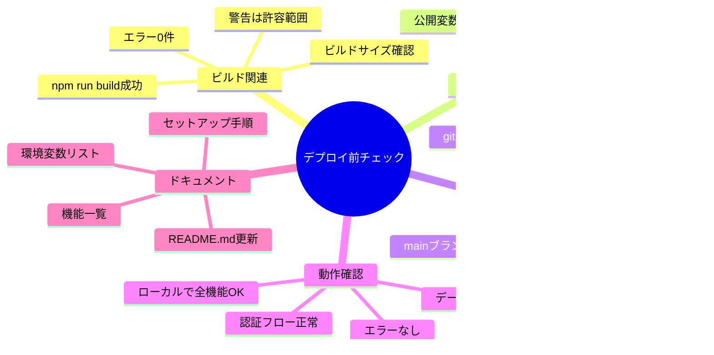

# 第四回講義：実装レビューとデプロイ準備

## 🎯 この講義で学ぶこと

- **「デプロイ」の本質を理解**し、あなたのアプリを世界に公開する準備を整える
- **ローカル環境と本番環境の決定的な違い**を知り、なぜ「ビルド」が必要なのかを理解する
- **デプロイ前の必須チェックポイント**を習得し、失敗を未然に防ぐ方法を学ぶ
- **環境変数の安全な管理方法**を身につけ、セキュリティを確保する
- **エラーが発生した時の対処法**を理解し、自信を持ってトラブルシューティングできるようになる
- **CI/CDの基本概念**を学び、自動化されたデプロイの流れを理解する

## 📌 この講義の位置づけ

本講義は、VibeCoder育成プログラム全4回の最終回（前半）です。

第三回までに、あなたはSupabaseとClerkを使ってCRUD機能を実装し、本格的なWebアプリケーションを作り上げました。今回は、そのアプリケーションを**インターネット上に公開するための準備**を行います。

明日（4-2）の講義で実際にVercelへデプロイを行いますが、その前に「なぜこの準備が必要なのか」を深く理解することが成功の鍵となります。

---

# 第1章：デプロイの本質を理解する

## 🎯 この章で学ぶこと

- **デプロイとは何か**、その本質的な意味を理解する
- **ローカル開発環境と本番環境の違い**を明確に把握する
- **なぜデプロイが必要なのか**、ビジネス価値の観点から理解する
- **デプロイの全体像**を俯瞰し、何が起きているのかを理解する
- **成功するデプロイの条件**を知り、失敗を避ける方法を学ぶ

## 📌 この章の位置づけ

これまでの3回の講義で、あなたは素晴らしいアプリケーションを作り上げました。しかし、それはまだ**あなたのPCの中だけ**で動いている状態です。この章では、そのアプリを**世界中の誰もがアクセスできる状態**にするための基本概念を理解します。

---

## 🌍 デプロイとは：あなたのアプリが世界に羽ばたく瞬間

### **一言で言うとデプロイとは**

## **「あなたのPC（ローカル）で動いているアプリを、インターネット上のサーバー（本番環境）に配置すること」**

現在のあなたのアプリは、こんな状態です：


デプロイ後は、こうなります：


### **なぜデプロイが必要なのか？**

| 観点 | **ローカル環境** | **本番環境（デプロイ後）** |
|------|-----------------|-------------------------|
| **アクセス可能性** | あなたのPCからのみ | 世界中どこからでも |
| **稼働時間** | PCを起動している間だけ | 24時間365日稼働 |
| **同時アクセス** | あなた1人だけ | 数千～数万人可能 |
| **URL** | `localhost:3000` | `https://your-app.vercel.app` |
| **セキュリティ** | ファイアウォール内 | SSL証明書で保護 |
| **データ保存** | あなたのPCに保存 | クラウドに安全保存 |

---

## 🎯 最重要原則：デプロイ成功の黄金律

### **覚えておくべき、たった1つの原則**

> ## **「ローカルでビルドできなければ、本番でもビルドできない」**

この原則を理解すれば、デプロイの成功率は**95%以上**になります。

### **ビルドとは何か？**


### **なぜビルドが必要なのか？**

| 理由 | **開発時のコード** | **ビルド後のコード** | メリット |
|------|------------------|-------------------|---------|
| **言語の変換** | TypeScript（人間向け） | JavaScript（ブラウザ向け） | ブラウザで実行可能 |
| **ファイルサイズ** | 10MB～50MB | 1MB～5MB | **90%削減** |
| **読み込み速度** | 3～5秒 | 0.5～1秒 | **5倍高速** |
| **セキュリティ** | デバッグ情報あり | デバッグ情報削除 | 安全性向上 |

---

## 🚀 デプロイの全体フロー：何が起きているのか

### **GitHubからVercelまでの自動化された流れ**


### **各ステップで何が起きているか**

| ステップ | 実行者 | 内容 | 所要時間 |
|---------|-------|------|---------|
| **1-3** | あなた | コード作成・テスト・プッシュ | 手動 |
| **4** | GitHub | コード保管・バージョン管理 | 即座 |
| **5** | Vercel | 変更を自動検知 | 数秒 |
| **6-7** | Vercel | 環境準備・依存関係インストール | 30秒～1分 |
| **8** | Vercel | ビルド実行（最適化処理） | 1～3分 |
| **9** | Vercel | 世界中のサーバーに配布 | 30秒 |

**合計時間**: プッシュから公開まで**約3～5分**！

---

## 🎯 デプロイ前チェックリスト：成功への5つの鍵

### **必ずチェックすべき5項目**


### **チェックリスト実践版**

| ✅ | 項目 | 確認方法 | なぜ重要？ |
|----|------|---------|-----------|
| □ | **ビルド成功** | `npm run build` → "Compiled successfully" | これが失敗したら100%デプロイも失敗 |
| □ | **環境変数メモ** | `.env.local`の内容をコピー | APIキーがないとアプリが動かない |
| □ | **GitHub最新化** | `git status` → "nothing to commit" | 古いコードがデプロイされる |
| □ | **ローカル動作** | `npm run dev`で全機能確認 | 動かないものはデプロイしても動かない |
| □ | **エラーなし** | ブラウザのコンソール確認 | エラーがあるとユーザー離脱 |

---

## 💡 この章のまとめ

- ✅ デプロイとは「あなたのPCから世界へ」アプリを公開すること
- ✅ **「ローカルでビルドできなければ、本番でもビルドできない」**が最重要原則
- ✅ ビルドは開発用コードを本番用に最適化する必須プロセス
- ✅ GitHubにプッシュすると、Vercelが自動でビルド・デプロイしてくれる
- ✅ デプロイ前の5つのチェック項目を確認すれば成功率95%以上

## 🚀 次の章への橋渡し

デプロイの本質と全体像を理解しました。次の第2章では、実際に皆さんが第三回で作成したCRUD機能付きアプリケーションのレビューを行い、よくあるエラーとその解決方法を学んでいきます。

---

# 第2章：宿題レビューとよくあるエラー

## 🎯 この章で学ぶこと

- 第三回で作成した**CRUD機能の実装パターン**を振り返る
- **よくあるエラーTop5**とその解決方法を理解する
- **AIとの効果的な対話方法**を実例で学ぶ
- **エラーメッセージの読み方**を習得する
- **トラブルシューティングの思考法**を身につける

## 📌 この章の位置づけ

第三回の宿題では、SupabaseとClerkを使ってCRUD機能を実装しました。多くの方が初めてのデータベース連携で苦労されたと思います。この章では、皆さんの実装を振り返りながら、**エラーとの向き合い方**を学びます。

---

## 🎉 第三回宿題の成果：素晴らしい達成

### **皆さんが成し遂げたこと**

第三回の講義後、皆さんは以下の機能を実装しました：


### **実装パターンの振り返り**

| 機能 | 使用技術 | 実装の難易度 | よくある課題 |
|------|---------|------------|------------|
| **認証** | Clerk | ⭐⭐ | 環境変数の設定ミス |
| **データ作成** | Supabase + Server Actions | ⭐⭐⭐ | 型定義エラー |
| **データ表示** | Server Components | ⭐⭐ | 非同期処理の理解 |
| **データ更新** | Server Actions | ⭐⭐⭐⭐ | 状態管理の複雑さ |
| **データ削除** | Server Actions | ⭐⭐ | 確認ダイアログの実装 |

---

## 🚨 よくあるエラーTop5と解決方法

### **エラー1：Clerk環境変数の設定ミス**

#### エラーメッセージ
```
ClerkProvider: Missing publishableKey
```

#### 原因と解決方法


#### Cursorへの指示文
```
Clerkの環境変数設定でエラーが出ています。
以下のエラーを解決してください：

ClerkProvider: Missing publishableKey

プロジェクトは Next.js 14 App Router を使用しています。
.env.local ファイルの作成と、必要な環境変数の設定方法を
ステップバイステップで教えてください。
```

---

### **エラー2：Supabase接続エラー**

#### エラーメッセージ
```
FetchError: Invalid URL
```

#### 原因と解決方法

| 確認項目 | チェック方法 | 正しい例 |
|---------|------------|---------|
| **URL形式** | `https://`で始まるか | `https://xxxxx.supabase.co` |
| **プロジェクトID** | ダッシュボードと一致 | 完全一致が必要 |
| **環境変数名** | `NEXT_PUBLIC_`プレフィックス | `NEXT_PUBLIC_SUPABASE_URL` |
| **引用符** | 値に引用符を含まない | ❌ `"https://..."` → ⭕ `https://...` |

#### Cursorへの指示文
```
Supabaseの接続でエラーが発生しています：
FetchError: Invalid URL

環境変数は以下のように設定しています：
NEXT_PUBLIC_SUPABASE_URL=xxxxx
NEXT_PUBLIC_SUPABASE_ANON_KEY=xxxxx

正しい設定方法と、接続テストの方法を教えてください。
```

---

### **エラー3：型エラー（TypeScript）**

#### エラーメッセージ
```
Property 'email' does not exist on type 'User'
```

#### 根本的な解決方法


#### Cursorへの指示文
```
TypeScriptの型エラーが大量に出ています：
Property 'email' does not exist on type 'User'

Supabaseを使用したNext.js 14プロジェクトです。
型定義を自動生成する方法と、それを適用する方法を
詳しく教えてください。実行するコマンドも含めてお願いします。
```

---

### **エラー4：ビルドエラー**

#### エラーメッセージ
```
Error: Command "npm run build" exited with 1
```

#### デバッグの流れ

| ステップ | コマンド/アクション | 確認事項 |
|---------|-------------------|---------|
| **1. ローカル確認** | `npm run build` | 同じエラーが出るか |
| **2. エラー特定** | エラーメッセージ全文を読む | ファイル名と行番号 |
| **3. 依存関係確認** | `npm install` | パッケージ不足 |
| **4. キャッシュクリア** | `rm -rf .next` | ビルドキャッシュ削除 |
| **5. 再ビルド** | `npm run build` | 成功確認 |

#### Cursorへの指示文
```
npm run buildでエラーが発生します：

[ここにエラーメッセージ全文を貼り付け]

環境：
- Next.js 14 App Router
- Supabase
- Clerk
- TypeScript

このエラーを解決する方法を、
初心者にもわかるように説明してください。
```

---

### **エラー5：認証状態の取得失敗**

#### エラーメッセージ
```
Cannot read property 'id' of null
```

#### 原因と解決パターン


#### Cursorへの指示文
```
ユーザーIDを取得しようとするとエラーが出ます：
Cannot read property 'id' of null

Clerkのauth()を使用していますが、
nullチェックの正しい実装方法を教えてください。
リダイレクト処理も含めてお願いします。
```

---

## 🎯 AIとの効果的な対話：良い例と悪い例

### **悪い例 ❌**

```
ログイン機能を作って
```

**問題点**:
- 技術スタックが不明
- 要件が曖昧
- コンテキストがない
- 期待する結果が不明確

### **良い例 ✅**

```
Next.js 14 App Router、Clerk、Supabaseを使ったプロジェクトで、
ログイン後にユーザーのプロフィール情報をSupabaseから取得して
表示するコンポーネントを作成してください。

要件：
- Server Componentで実装
- Clerkのauth()でuserIdを取得
- SupabaseのRLSでセキュリティを確保
- エラーハンドリングを含める
- ローディング状態も表示

現在のファイル構造：
app/profile/page.tsx ← ここに実装

使用しているテーブル：
profiles (id, user_id, name, bio, avatar_url)
```

### **プロンプト改善のポイント**

| 要素 | なぜ重要か | 例 |
|------|-----------|-----|
| **技術スタック明記** | 適切なコードを生成 | "Next.js 14, Clerk, Supabase" |
| **具体的な要件** | 期待通りの結果 | "Server Componentで実装" |
| **ファイル構造** | 正しい場所に配置 | "app/profile/page.tsx" |
| **データ構造** | 正確な実装 | "profiles テーブルの構造" |
| **エラー処理** | 本番品質のコード | "エラーハンドリングを含める" |

---

## 💡 この章のまとめ

- ✅ 第三回の宿題でCRUD機能を完成させた（素晴らしい成果！）
- ✅ よくあるエラーは**環境変数**と**型定義**に関連するものが多い
- ✅ エラーメッセージは**全文をAIに伝える**ことが解決の近道
- ✅ AIへの指示は**具体的に、技術スタックを明記**することが重要
- ✅ エラーは学習のチャンス、**恐れずにAIと対話**しながら解決する

## 🚀 次の章への橋渡し

宿題のレビューとエラー対処法を学びました。次の第3章では、いよいよ「ビルド」という重要なプロセスについて深く理解していきます。なぜビルドが必要なのか、何が起きているのかを詳しく見ていきましょう。

---

# 第3章：ビルドプロセスの理解

## 🎯 この章で学ぶこと

- **ビルドとは何か**、その本質的な役割を理解する
- **開発モードと本番モードの違い**を明確に把握する
- **ビルドプロセスで行われる4つの処理**を詳しく学ぶ
- **ビルド結果の読み方**を習得し、問題を発見できるようになる
- **ビルドエラーの対処法**を実践的に身につける

## 📌 この章の位置づけ

第1章でデプロイの全体像を、第2章でエラー対処法を学びました。この章では、デプロイの要となる「ビルド」プロセスを深掘りします。ビルドを理解することで、デプロイの成功率が飛躍的に向上します。

---

## 🏗️ ビルドとは：開発から本番への変身プロセス

### **ビルドの本質**

## **「開発しやすいコード」を「実行効率の良いコード」に変換する最適化プロセス**


---

## 🔄 開発モードと本番モード：2つの世界

### **なぜ2つのモードが必要なのか**

| 観点 | **開発モード** (`npm run dev`) | **本番モード** (`npm run build`) |
|------|-------------------------------|--------------------------------|
| **目的** | 開発効率の最大化 | 実行性能の最大化 |
| **コード状態** | 読みやすい、デバッグ可能 | 圧縮済み、最適化済み |
| **エラー表示** | 詳細なエラー画面 | ユーザー向けエラーページ |
| **更新反映** | 自動リロード（Hot Reload） | 再ビルドが必要 |
| **ファイルサイズ** | 大きい（10-50MB） | 小さい（1-5MB） |
| **起動時間** | 遅い（開発者は待てる） | 速い（ユーザーは待てない） |
| **対象者** | 開発者（あなた） | エンドユーザー |

### **具体例で理解する**


---

## 🔧 ビルドプロセスの4つの魔法

### **処理1：トランスパイル（翻訳）**

#### TypeScriptからJavaScriptへの変換


**なぜ必要？**: ブラウザはTypeScriptを理解できないため

---

### **処理2：ミニファイ（圧縮）**

#### コードサイズを最小化

| 変換内容 | Before | After | 削減率 |
|---------|--------|-------|--------|
| **空白削除** | 改行・スペース多数 | 1行に圧縮 | 30% |
| **変数名短縮** | `userName` | `u` | 20% |
| **コメント削除** | `// ユーザー名を設定` | （削除） | 15% |
| **不要コード削除** | 未使用の関数 | （削除） | 35% |

**総削減率**: 約**60-70%**のサイズ削減！

---

### **処理3：バンドリング（結合）**

#### 複数ファイルを1つにまとめる


**メリット**:
- HTTPリクエスト数: 100回 → 1回
- 読み込み時間: 5秒 → 0.5秒

---

### **処理4：最適化**

#### 画像とコードの最適化


---

## 📊 ビルド結果の読み方：成功の指標

### **ビルド完了時の出力を理解する**

```
Route (app)                Size     First Load JS
┌ ○ /                      1.2 kB    87.3 kB
├ ○ /login                 890 B     88.1 kB
├ ○ /dashboard             2.1 kB    92.4 kB
└ ○ /posts                 1.5 kB    89.8 kB

○  (Static)  自動的に静的HTMLとして生成
λ  (Dynamic) リクエスト時に生成

First Load JS shared by all: 86.1 kB
  ├ chunks/main.js         28.4 kB
  ├ chunks/framework.js    45.2 kB
  └ chunks/pages/_app.js   12.5 kB
```

### **重要指標の意味**

| 指標 | 意味 | 良好な値 | 警告値 | 対策 |
|------|-----|---------|--------|------|
| **First Load JS** | 初回読み込みサイズ | < 100KB | > 200KB | コード分割を検討 |
| **Size** | ページ固有のサイズ | < 5KB | > 10KB | 不要なコード削除 |
| **○ (Static)** | 事前生成 | 多いほど良い | - | 高速表示 |
| **λ (Dynamic)** | 動的生成 | 必要最小限 | - | サーバー負荷 |

---

## 🛠️ ビルドを実行してみよう

### **実践：ビルドコマンドの実行**

#### Cursorへの指示文（ビルド実行）
```
プロジェクトのビルドを実行したいです。
以下の手順を教えてください：

1. ビルド前の準備（必要な確認事項）
2. ビルドコマンドの実行方法
3. ビルド結果の確認方法
4. ビルドが成功したかの判断基準

Next.js 14のプロジェクトです。
```

### **ビルド成功のサイン**


---

## 🚨 ビルドエラーへの対処法

### **よくあるビルドエラーと解決策**

| エラー種別 | エラーメッセージ例 | 原因 | 解決方法 |
|-----------|------------------|------|---------|
| **型エラー** | `Type 'string' is not assignable` | TypeScriptの型不一致 | 型定義を修正 |
| **import エラー** | `Module not found` | ファイルパスの誤り | パスを確認・修正 |
| **変数未定義** | `'useState' is not defined` | importし忘れ | 必要なimport追加 |
| **構文エラー** | `Unexpected token` | 括弧の不一致など | 構文を修正 |

### **エラー解決のワークフロー**

#### Cursorへの指示文（エラー解決）
```
ビルドでエラーが発生しました：

[エラーメッセージ全文をここに貼り付け]

環境：
- Next.js 14 App Router
- TypeScript
- Supabase, Clerk使用

このエラーの原因と解決方法を、
ステップバイステップで教えてください。
修正後のコードも提示してください。
```

---

## 💡 この章のまとめ

- ✅ ビルドは「開発用コード」を「本番用コード」に最適化する処理
- ✅ 開発モードは**開発効率重視**、本番モードは**実行性能重視**
- ✅ ビルドの4つの処理：**トランスパイル、圧縮、バンドル、最適化**
- ✅ First Load JSは**100KB以下**が理想的
- ✅ `npm run build`で**"Compiled successfully"**が表示されれば成功

## 🚀 次の章への橋渡し

ビルドプロセスの詳細を理解しました。次の第4章では、デプロイ前の最終準備として、環境変数の管理やGitHubへのプッシュなど、具体的なチェックリストを確認していきます。

---

# 第4章：デプロイ前の最終準備

## 🎯 この章で学ぶこと

- **環境変数の安全な管理方法**を習得する
- **GitHubへの正しいプッシュ方法**を理解する
- **デプロイ前の最終チェックリスト**を実践する
- **README.mdの整備**でプロジェクトを完成させる
- **セキュリティのベストプラクティス**を身につける

## 📌 この章の位置づけ

ビルドプロセスを理解した今、いよいよデプロイの最終準備に入ります。この章では、明日のVercelデプロイを成功させるための具体的な準備作業を行います。特に**環境変数の管理**は、セキュリティ上最も重要な部分です。

---

## 🔐 環境変数：アプリの秘密を守る

### **環境変数とは何か**

## **アプリケーションが動作するために必要な「秘密の設定値」**


### **環境変数の種類と用途**

| 種類 | プレフィックス | 公開範囲 | 用途例 | セキュリティ |
|------|---------------|---------|--------|-------------|
| **公開変数** | `NEXT_PUBLIC_` | クライアント側でも使用 | APIのURL、公開設定 | 🟢 公開OK |
| **秘密変数** | なし | サーバー側のみ | APIキー、秘密鍵 | 🔴 絶対秘密 |

---

## 📝 環境変数の準備：3ステップ

### **ステップ1：.env.localの確認**

#### Cursorへの指示文
```
.env.localファイルの環境変数を確認したいです。
以下の内容を整理してください：

1. 現在設定されている環境変数のリスト
2. 各変数の用途説明
3. 公開可能/秘密の分類
4. Vercelに設定する際の注意点

セキュリティ的に問題がないか確認もお願いします。
```

### **ステップ2：環境変数のバックアップ**


### **ステップ3：.env.exampleの作成**

#### なぜ.env.exampleが必要か

| 目的 | 説明 | メリット |
|------|------|--------|
| **チーム共有** | 必要な環境変数のテンプレート | 設定漏れ防止 |
| **ドキュメント** | 各変数の説明を記載 | 理解しやすい |
| **セキュリティ** | 実際の値は含まない | 安全にGit管理 |

#### Cursorへの指示文
```
.env.localを元に.env.exampleファイルを作成してください。
以下の要件で作成：

1. すべての環境変数名を含める
2. 値はダミー値またはプレースホルダー
3. 各変数にコメントで説明を追加
4. 取得方法も記載

例：
# Clerk認証の公開キー（Clerkダッシュボードから取得）
NEXT_PUBLIC_CLERK_PUBLISHABLE_KEY=pk_test_xxxxx
```

---

## 🚀 GitHubへのプッシュ：コードを世界へ

### **Git操作の基本フロー**

```mermaid
graph TB
    subgraph "ローカル作業"
        A[コード編集] --> B[git add .]
        B --> C[git commit -m "メッセージ"]
    end

    subgraph "確認"
        C --> D[git status]
        D --> E{変更あり？}
        E -->|Yes| B
        E -->|No| F[git push]
    end

    subgraph "GitHub"
        F --> G[リモートリポジトリ更新]
        G --> H[Vercelが検知]
    end

    style G fill:#10b981,stroke:#059669,color:#fff
    style H fill:#3b82f6,stroke:#2563eb,color:#fff
```

### **プッシュ前のチェックリスト**

#### Cursorへの指示文
```
GitHubにプッシュする前の確認をしたいです。
以下のコマンドを実行して結果を教えてください：

1. git status（変更ファイルの確認）
2. git diff（変更内容の確認）
3. .gitignoreの確認（.env.localが含まれているか）
4. git logで最新のコミット確認

問題がなければ、プッシュの手順も教えてください。
```

### **よくあるGitの問題と解決**

| 問題 | エラーメッセージ | 解決方法 |
|------|---------------|---------|
| **未コミットの変更** | `Your branch is ahead of 'origin/main'` | `git push`を実行 |
| **マージ競合** | `CONFLICT` | 手動で解決後、再コミット |
| **大きなファイル** | `File too large` | .gitignoreに追加 |
| **認証エラー** | `Authentication failed` | GitHubトークンを再設定 |

---

## ✅ デプロイ前の最終チェックリスト

### **必須チェック項目（詳細版）**



### **チェックリスト実行コマンド**

#### Cursorへの指示文
```
デプロイ前の最終チェックを行います。
以下のコマンドを順番に実行して、結果を報告してください：

1. npm run build（ビルド成功確認）
2. npm run dev（ローカル動作確認）
3. git status（未コミット確認）
4. git log -1（最新コミット確認）
5. cat .gitignore | grep env（環境変数除外確認）

すべてOKならデプロイ準備完了です。
```

---

## 📚 README.mdの整備：プロジェクトの顔

### **良いREADMEの構成要素**


### **READMEテンプレート**

#### Cursorへの指示文
```
プロジェクトのREADME.mdを作成してください。
以下の構成で：

# プロジェクト名

## 概要
このアプリの説明（2-3行）

## 機能
- [ ] ユーザー認証（Clerk）
- [ ] データ保存（Supabase）
- [ ] CRUD操作
- [ ] その他の機能

## 技術スタック
- Next.js 14
- TypeScript
- Supabase
- Clerk
- Tailwind CSS

## セットアップ
1. リポジトリのクローン
2. 依存関係のインストール
3. 環境変数の設定
4. 開発サーバーの起動

## 環境変数
`.env.example`を`.env.local`にコピーして、以下の値を設定：
（詳細説明）

## デプロイ
Vercelでのデプロイ方法

プロジェクトの具体的な内容に合わせて調整してください。
```

---

## 🔒 セキュリティのベストプラクティス

### **絶対にやってはいけないこと**

```mermaid
graph LR
    subgraph "❌ 絶対NG"
        A[秘密鍵をGitHubにプッシュ]
        B[環境変数をコードに直書き]
        C[APIキーを公開リポジトリに]
        D[パスワードをREADMEに記載]
    end

    subgraph "✅ 正しい方法"
        E[.env.localで管理]
        F[.gitignoreで除外]
        G[Vercel環境変数で設定]
        H[.env.exampleで説明]
    end

    A --> E
    B --> E
    C --> G
    D --> H

    style A fill:#ef4444,stroke:#dc2626,color:#fff
    style B fill:#ef4444,stroke:#dc2626,color:#fff
    style C fill:#ef4444,stroke:#dc2626,color:#fff
    style D fill:#ef4444,stroke:#dc2626,color:#fff
    style E fill:#10b981,stroke:#059669,color:#fff
    style F fill:#10b981,stroke:#059669,color:#fff
    style G fill:#10b981,stroke:#059669,color:#fff
    style H fill:#10b981,stroke:#059669,color:#fff
```

### **もし秘密情報を公開してしまったら**

| 優先度 | アクション | 所要時間 |
|--------|-----------|---------|
| **1** | 該当のAPIキーを即座に無効化 | 即座 |
| **2** | 新しいAPIキーを発行 | 5分 |
| **3** | .env.localを更新 | 2分 |
| **4** | GitHubから履歴も含めて削除 | 10分 |
| **5** | チームに通知 | 即座 |

---

## 💡 この章のまとめ

- ✅ 環境変数は`.env.local`で管理し、**絶対にGitHubにプッシュしない**
- ✅ `NEXT_PUBLIC_`付きは公開OK、なしは**絶対秘密**
- ✅ `.env.example`でチーム共有とドキュメント化
- ✅ GitHubプッシュ前に`git status`で必ず確認
- ✅ README.mdはプロジェクトの顔、**丁寧に書く**

## 🚀 次の章への橋渡し

デプロイ前の準備がすべて整いました。次の第5章では、CI/CDという自動化の仕組みを理解し、より効率的なデプロイ方法を学びます。

---

# 第5章：CI/CDの基本概念

## 🎯 この章で学ぶこと

- **CI/CDとは何か**、その価値を理解する
- **GitHubとVercelの連携**による自動化の仕組みを学ぶ
- **プレビューデプロイ**の活用方法を習得する
- **ブランチ戦略**の基本を理解する
- **自動テストとデプロイ**の流れを把握する

## 📌 この章の位置づけ

手動でのデプロイ準備を理解した今、より効率的で安全なデプロイ方法を学びます。CI/CDは現代の開発において必須の知識です。この仕組みを理解することで、プロ レベルのデプロイワークフローが実現できます。

---

## 🔄 CI/CDとは：開発を加速する自動化

### **CI/CD = 継続的インテグレーション/継続的デリバリー**

```mermaid
graph TB
    subgraph "CI: 継続的インテグレーション"
        A[コード変更] --> B[自動ビルド]
        B --> C[自動テスト]
        C --> D{成功？}
    end

    subgraph "CD: 継続的デリバリー"
        D -->|Yes| E[自動デプロイ]
        E --> F[本番環境]
        D -->|No| G[エラー通知]
    end

    style F fill:#10b981,stroke:#059669,color:#fff
    style G fill:#ef4444,stroke:#dc2626,color:#fff
```

### **従来の方法 vs CI/CD**

| 工程 | **従来の方法** | **CI/CD** | 改善効果 |
|------|--------------|-----------|---------|
| **コード統合** | 手動でマージ | 自動マージ | ミス削減 |
| **ビルド** | 各自のPCで実行 | サーバーで自動実行 | 環境統一 |
| **テスト** | 忘れがち | 必ず実行 | 品質向上 |
| **デプロイ** | 手動でアップロード | 自動デプロイ | 時間短縮 |
| **所要時間** | 30分～1時間 | 3～5分 | **90%削減** |

---

## 🔗 GitHubとVercelの完璧な連携

### **自動デプロイの仕組み**

```mermaid
sequenceDiagram
    participant You as あなた
    participant Git as GitHub
    participant Ver as Vercel
    participant Web as Webサイト

    You->>Git: 1. git push
    Git->>Ver: 2. Webhook通知
    Ver->>Git: 3. コードを取得
    Ver->>Ver: 4. npm install
    Ver->>Ver: 5. npm run build
    Ver->>Ver: 6. ビルド成功確認
    Ver->>Web: 7. デプロイ実行
    Ver->>You: 8. 完了通知

    Note over Web: 世界中からアクセス可能に！
```

### **連携設定で得られるメリット**

```mermaid
mindmap
  root((GitHub + Vercel))
    自動化
      プッシュ即デプロイ
      手作業ゼロ
      ミス防止
      時間短縮
    履歴管理
      全デプロイ履歴
      即座にロールバック
      変更追跡
      誰が何を変更
    チーム開発
      複数人で開発
      コンフリクト防止
      レビュー機能
      権限管理
    品質保証
      自動テスト
      ビルドチェック
      プレビュー確認
      本番前検証
```

---

## 🔍 プレビューデプロイ：本番前の安全確認

### **プレビューデプロイとは**

## **プルリクエストごとに自動生成される「お試し環境」**

```mermaid
graph LR
    subgraph "ブランチ構成"
        A[main branch<br/>本番環境]
        B[feature branch<br/>新機能開発]
    end

    subgraph "自動生成URL"
        C[your-app.vercel.app<br/>本番URL]
        D[your-app-pr-1.vercel.app<br/>プレビューURL]
    end

    A --> C
    B --> D

    style A fill:#10b981,stroke:#059669,color:#fff
    style B fill:#3b82f6,stroke:#2563eb,color:#fff
    style C fill:#10b981,stroke:#059669,color:#fff
    style D fill:#fbbf24,stroke:#f59e0b
```

### **プレビューデプロイの活用場面**

| 場面 | 使い方 | メリット |
|------|--------|--------|
| **新機能テスト** | 本番影響なしでテスト | 安全な検証 |
| **デザイン確認** | 実際の環境で確認 | 実機確認可能 |
| **クライアント確認** | URLを共有 | 即座にフィードバック |
| **バグ修正確認** | 修正結果を確認 | 本番前に検証 |

---

## 🌳 ブランチ戦略：安全な開発フロー

### **基本的なブランチ構成**

```mermaid
gitGraph
    commit id: "初期設定"
    branch develop
    checkout develop
    commit id: "機能A開発"
    commit id: "機能B開発"
    checkout main
    merge develop id: "v1.0リリース"
    checkout develop
    commit id: "機能C開発"
    branch feature/login
    checkout feature/login
    commit id: "ログイン機能"
    commit id: "バグ修正"
    checkout develop
    merge feature/login
    checkout main
    merge develop id: "v1.1リリース"
```

### **ブランチの役割と命名規則**

| ブランチ種類 | 命名例 | 用途 | デプロイ先 |
|------------|--------|------|-----------|
| **main** | `main` | 本番環境 | your-app.vercel.app |
| **develop** | `develop` | 開発環境 | your-app-dev.vercel.app |
| **feature** | `feature/user-auth` | 機能開発 | プレビューURL |
| **fix** | `fix/login-bug` | バグ修正 | プレビューURL |

### **安全なマージフロー**

#### Cursorへの指示文
```
新機能を安全に本番環境にデプロイしたいです。
以下のGitフローを教えてください：

1. featureブランチの作成方法
2. 開発とコミット
3. プルリクエストの作成
4. プレビュー環境での確認
5. mainブランチへのマージ

各ステップのコマンドも含めてください。
```

---

## 🤖 自動テストの基本

### **なぜテストが重要か**

```mermaid
graph TB
    subgraph "テストなし"
        A[コード変更] --> B[手動確認]
        B --> C[見逃し多発]
        C --> D[本番でバグ]
        D --> E[ユーザー離脱]
    end

    subgraph "テストあり"
        F[コード変更] --> G[自動テスト]
        G --> H{全テスト合格？}
        H -->|Yes| I[安全にデプロイ]
        H -->|No| J[修正]
        J --> G
    end

    style D fill:#ef4444,stroke:#dc2626,color:#fff
    style I fill:#10b981,stroke:#059669,color:#fff
```

### **基本的なテストの種類**

| テスト種類 | 確認内容 | 実行タイミング | 重要度 |
|-----------|---------|--------------|--------|
| **ビルドテスト** | コンパイル成功 | 毎回 | ⭐⭐⭐⭐⭐ |
| **ユニットテスト** | 個別機能 | 毎回 | ⭐⭐⭐⭐ |
| **統合テスト** | 機能連携 | デプロイ前 | ⭐⭐⭐ |
| **E2Eテスト** | ユーザー操作 | リリース前 | ⭐⭐⭐ |

---

## 📊 デプロイパイプラインの全体像

### **プッシュからデプロイまでの完全自動化**

```mermaid
graph TB
    subgraph "開発者の作業"
        A[コーディング] --> B[ローカルテスト]
        B --> C[git commit]
        C --> D[git push]
    end

    subgraph "CI: 自動チェック"
        D --> E[ビルド]
        E --> F[テスト実行]
        F --> G[コード品質チェック]
        G --> H{すべて合格？}
    end

    subgraph "CD: 自動デプロイ"
        H -->|Yes| I[ステージング環境]
        I --> J[最終確認]
        J --> K[本番デプロイ]
        H -->|No| L[エラー通知]
        L --> M[修正]
        M --> C
    end

    style K fill:#10b981,stroke:#059669,color:#fff
    style L fill:#ef4444,stroke:#dc2626,color:#fff
```

### **各ステージの所要時間**

| ステージ | 処理内容 | 所要時間 | 自動/手動 |
|---------|---------|---------|----------|
| **コミット** | コード変更の記録 | 10秒 | 手動 |
| **プッシュ** | GitHubへアップロード | 30秒 | 手動 |
| **ビルド** | コード最適化 | 1-3分 | 自動 |
| **テスト** | 自動テスト実行 | 1-2分 | 自動 |
| **デプロイ** | サーバー配布 | 1分 | 自動 |
| **合計** | - | **5-7分** | ほぼ自動 |

---

## 💡 この章のまとめ

- ✅ CI/CDは**開発からデプロイまでを自動化**する仕組み
- ✅ GitHubにプッシュすると**Vercelが自動でデプロイ**
- ✅ プレビューデプロイで**本番前に安全確認**
- ✅ ブランチ戦略で**複数人でも安全に開発**
- ✅ 自動テストで**品質を保証**

## 🚀 次の章への橋渡し

CI/CDの概念を理解しました。次の第6章では、実際のデプロイで起こりうるトラブルとその対処法を学び、明日のデプロイに向けた最終確認を行います。

---

# 第6章：トラブルシューティングと最終確認

## 🎯 この章で学ぶこと

- **デプロイ時の典型的なトラブル**とその解決方法
- **エラーログの読み方**と問題の特定方法
- **ロールバック（巻き戻し）**の方法
- **パフォーマンス問題**の発見と対処
- **明日のデプロイに向けた最終準備**

## 📌 この章の位置づけ

これまでの章で、デプロイの理論と準備を学びました。この最終章では、実際のデプロイで遭遇する可能性のあるトラブルと、その対処法を学びます。これで、明日のデプロイに完全に備えることができます。

---

## 🚨 デプロイ時の典型的なトラブル

### **トラブルの分類と頻度**

```mermaid
pie title デプロイトラブルの内訳
    "環境変数の設定ミス" : 35
    "ビルドエラー" : 25
    "型エラー" : 20
    "依存関係の問題" : 10
    "その他" : 10
```

### **トラブル対応フローチャート**

```mermaid
graph TB
    A[デプロイ失敗] --> B{エラー種別は？}

    B -->|ビルドエラー| C[ローカルで再現確認]
    B -->|環境変数| D[Vercel設定確認]
    B -->|型エラー| E[TypeScript確認]
    B -->|不明| F[ログ詳細確認]

    C --> G[修正してプッシュ]
    D --> H[環境変数追加]
    E --> I[型定義修正]
    F --> J[AIに相談]

    G --> K[自動で再デプロイ]
    H --> L[手動で再デプロイ]
    I --> K
    J --> G

    K --> M[成功！]
    L --> M

    style A fill:#ef4444,stroke:#dc2626,color:#fff
    style M fill:#10b981,stroke:#059669,color:#fff
```

---

## 📋 エラーログの読み方

### **Vercelのビルドログ解析**

#### 典型的なエラーメッセージの構造
```
08:23:45.123  Cloning github.com/username/repo (Branch: main, Commit: abc123)
08:23:46.456  Installing dependencies...
08:23:58.789  npm install completed
08:24:01.234  Building application...
08:24:15.678  > next build

08:24:20.123  ▲ Next.js 14.0.0
08:24:20.456  Creating optimized production build...

08:24:35.789  Failed to compile.
08:24:35.890
08:24:35.891  ./app/dashboard/page.tsx:15:25
08:24:35.892  Type error: Property 'user' does not exist on type 'Props'.
08:24:35.893    13 | export default function Dashboard({ user }: Props) {
08:24:35.894    14 |   return (
08:24:35.895  > 15 |     <div>Welcome, {user.name}!</div>
08:24:35.896       |                         ^
08:24:35.897    16 |   );
08:24:35.898    17 | }

08:24:36.123  Error: Command "npm run build" exited with 1
```

### **エラーログの重要ポイント**

| ポイント | 見るべき箇所 | 意味 | 対処法 |
|---------|-------------|------|--------|
| **タイムスタンプ** | `08:24:35.789` | エラー発生時刻 | 順序を確認 |
| **ファイル名** | `./app/dashboard/page.tsx` | 問題のファイル | 該当ファイルを開く |
| **行番号** | `:15:25` | 15行目25文字目 | 正確な位置特定 |
| **エラー種別** | `Type error` | TypeScriptエラー | 型定義を修正 |
| **エラー内容** | `Property 'user' does not exist` | userプロパティなし | 型定義追加 |

### **ログからのトラブルシューティング**

#### Cursorへの指示文
```
Vercelのビルドログでエラーが出ています。
以下のエラーを解決してください：

[エラーログ全文を貼り付け]

プロジェクト情報：
- Next.js 14 App Router
- TypeScript
- Supabase, Clerk使用

このエラーの：
1. 原因の説明
2. 修正方法（コード例付き）
3. 再発防止策

を教えてください。
```

---

## ⏮️ ロールバック：問題が起きたら即座に戻す

### **ロールバックとは**

## **デプロイした内容に問題があった場合、前のバージョンに即座に戻す機能**

```mermaid
graph LR
    subgraph "デプロイ履歴"
        A[v1.0<br/>正常] --> B[v1.1<br/>正常]
        B --> C[v1.2<br/>バグあり]
    end

    subgraph "ロールバック"
        C -->|即座に戻す| D[v1.1<br/>復活]
    end

    style C fill:#ef4444,stroke:#dc2626,color:#fff
    style D fill:#10b981,stroke:#059669,color:#fff
```

### **ロールバックが必要な場面**

| 状況 | 症状 | 緊急度 | 対応 |
|------|------|--------|------|
| **致命的バグ** | ログインできない | 🔴 最高 | 即ロールバック |
| **表示崩れ** | レイアウト破綻 | 🟡 高 | 状況により判断 |
| **軽微な不具合** | 文言ミス | 🟢 低 | 修正版をデプロイ |
| **パフォーマンス劣化** | 読み込みが遅い | 🟡 高 | 原因調査後判断 |

### **Vercelでのロールバック手順**

```mermaid
flowchart LR
    A[Vercelダッシュボード] --> B[Deployments]
    B --> C[デプロイ履歴]
    C --> D[正常だったバージョンを選択]
    D --> E[...メニュー]
    E --> F[Promote to Production]
    F --> G[確認]
    G --> H[即座に切り替え完了！]

    style H fill:#10b981,stroke:#059669,color:#fff
```

---

## 🚄 パフォーマンス問題の発見と対処

### **デプロイ後のパフォーマンスチェック**

```mermaid
graph TB
    subgraph "チェック項目"
        A[ページ読み込み時間]
        B[First Load JS サイズ]
        C[画像の最適化]
        D[APIレスポンス時間]
    end

    subgraph "目標値"
        E[3秒以内]
        F[100KB以下]
        G[WebP形式]
        H[500ms以内]
    end

    subgraph "測定ツール"
        I[Chrome DevTools]
        J[Lighthouse]
        K[Vercel Analytics]
    end

    A --> E --> I
    B --> F --> J
    C --> G --> J
    D --> H --> K
```

### **パフォーマンス指標と改善方法**

| 指標 | 良好 | 要改善 | 改善方法 |
|------|------|--------|---------|
| **ページ表示時間** | < 2秒 | > 3秒 | 画像最適化、コード分割 |
| **First Load JS** | < 100KB | > 200KB | 不要なライブラリ削除 |
| **画像サイズ** | < 100KB/枚 | > 500KB/枚 | WebP変換、リサイズ |
| **API応答** | < 200ms | > 1秒 | クエリ最適化、キャッシュ |

### **パフォーマンス測定コマンド**

#### Cursorへの指示文
```
デプロイ後のパフォーマンスを測定したいです。
以下の方法を教えてください：

1. Lighthouseでの測定方法
2. 重要な指標の見方
3. 改善が必要な場合の対処法

特に以下の点を確認したい：
- ページ読み込み速度
- Core Web Vitals
- バンドルサイズ
```

---

## ✅ 明日のデプロイに向けた最終チェック

### **今日やるべきこと：完全チェックリスト**

```mermaid
mindmap
  root((最終準備))
    技術面
      npm run build成功
      エラー0件確認
      環境変数メモ
      GitHubプッシュ済み
    動作確認
      全機能テスト
      認証フロー確認
      データ保存確認
      表示崩れなし
    ドキュメント
      README.md完成
      環境変数リスト
      トラブル対処メモ
    心構え
      エラーは恐れない
      AIを活用する
      ロールバック可能
      成功を信じる
```

### **最終確認コマンド集**

```bash
# 1. ビルド確認
npm run build

# 2. ローカル動作確認
npm run dev
# → ブラウザで全機能を確認

# 3. Git状態確認
git status
git log -1

# 4. 環境変数確認
cat .env.local

# 5. パッケージ確認
npm list --depth=0
```

### **明日の流れ：スムーズなデプロイのために**

| 時間 | やること | 準備物 | 注意点 |
|------|---------|--------|--------|
| **開始前** | 環境変数メモ確認 | .env.localの内容 | コピー済みか |
| **Step 1** | Vercelアカウント作成 | メールアドレス | GitHub連携用 |
| **Step 2** | GitHubリポジトリ連携 | GitHubアカウント | 権限確認 |
| **Step 3** | プロジェクトインポート | リポジトリ選択 | 正しいリポジトリ |
| **Step 4** | 環境変数設定 | メモした値 | 1つずつ確認 |
| **Step 5** | デプロイ実行 | - | ログを見守る |
| **完了** | 動作確認 | 公開URL | 全機能テスト |

---

## 🎊 デプロイ成功のイメージ

### **成功時の画面**

```mermaid
graph TB
    subgraph "Vercelダッシュボード"
        A[Production<br/>✅ Ready]
        B[Domains<br/>your-app.vercel.app]
        C[Functions<br/>✅ All operational]
        D[Analytics<br/>📊 Tracking]
    end

    subgraph "あなたのアプリ"
        E[🌍 世界中からアクセス可能]
        F[🔒 HTTPS で保護]
        G[⚡ 高速表示]
        H[📱 スマホ対応]
    end

    A --> E
    B --> F
    C --> G
    D --> H

    style A fill:#10b981,stroke:#059669,color:#fff
    style E fill:#10b981,stroke:#059669,color:#fff
```

---

## 💡 この章のまとめ

- ✅ デプロイトラブルの**35%は環境変数**が原因
- ✅ エラーログは**ファイル名と行番号**を最初に確認
- ✅ 問題があれば**即座にロールバック**できる
- ✅ パフォーマンスは**Lighthouse**で測定
- ✅ 明日は**準備したメモ**を見ながら落ち着いて作業

## 🚀 次の章への橋渡し

トラブルシューティングの知識を身につけ、明日のデプロイに向けた準備が整いました。最後の第7章では、デプロイ後の運用と、さらなる成長への道筋を示します。

---

# 第7章：デプロイ後の世界と未来への展望

## 🎯 この章で学ぶこと

- **デプロイ後の運用**で大切なこと
- **ユーザーフィードバック**の収集と対応
- **継続的な改善**のサイクル
- **スケーリング**への道筋
- **Vibe Coderとしての成長**への次のステップ

## 📌 この章の位置づけ

明日、あなたのアプリケーションは世界に公開されます。この最終章では、デプロイ後の運用方法と、Vibe Coderとしてさらに成長するための道筋を示します。

---

## 🌍 デプロイ後の新しい世界

### **あなたのアプリが生きている証**

```mermaid
graph TB
    subgraph "公開直後"
        A[友人に共有] --> B[最初のユーザー]
        B --> C[フィードバック]
    end

    subgraph "成長期"
        C --> D[改善]
        D --> E[新機能追加]
        E --> F[ユーザー増加]
    end

    subgraph "成熟期"
        F --> G[コミュニティ形成]
        G --> H[ビジネス展開]
        H --> I[収益化]
    end

    style B fill:#fbbf24,stroke:#f59e0b
    style F fill:#3b82f6,stroke:#2563eb,color:#fff
    style I fill:#10b981,stroke:#059669,color:#fff
```

### **運用の基本サイクル**

| フェーズ | 期間 | やること | ゴール |
|---------|------|---------|--------|
| **公開初期** | 1週間 | バグ修正、安定化 | 正常動作 |
| **改善期** | 1ヶ月 | UI/UX改善 | 使いやすさ向上 |
| **成長期** | 3ヶ月 | 新機能追加 | 価値向上 |
| **拡大期** | 6ヶ月～ | スケーリング | ビジネス化 |

---

## 📊 モニタリングと分析

### **Vercel Analyticsで見るべき指標**

```mermaid
graph LR
    subgraph "ユーザー指標"
        A[訪問者数]
        B[ページビュー]
        C[滞在時間]
    end

    subgraph "パフォーマンス指標"
        D[表示速度]
        E[エラー率]
        F[Core Web Vitals]
    end

    subgraph "ビジネス指標"
        G[コンバージョン]
        H[リテンション]
        I[成長率]
    end

    A --> J[改善アクション]
    D --> J
    G --> J

    style J fill:#10b981,stroke:#059669,color:#fff
```

### **週次チェックリスト**

| 確認項目 | 目標値 | アクション |
|---------|--------|-----------|
| **エラー発生率** | < 1% | エラーログ確認、修正 |
| **ページ速度** | < 3秒 | 遅いページを最適化 |
| **ユーザー増加率** | +10%/週 | マーケティング強化 |
| **フィードバック対応** | 48時間以内 | 優先度付けて対応 |

---

## 🔄 継続的な改善

### **ユーザーフィードバックの活用**

```mermaid
flowchart LR
    A[ユーザーフィードバック] --> B{種類}

    B -->|バグ報告| C[即座に修正]
    B -->|機能要望| D[優先度評価]
    B -->|感想| E[モチベーション]

    C --> F[hotfix デプロイ]
    D --> G[ロードマップ追加]
    E --> H[改善の原動力]

    F --> I[ユーザー満足度UP]
    G --> I
    H --> I

    style I fill:#10b981,stroke:#059669,color:#fff
```

### **改善の優先順位付け**

| 優先度 | 種類 | 例 | 対応時期 |
|--------|------|-----|---------|
| **🔴 最高** | 致命的バグ | ログイン不可 | 即日 |
| **🟠 高** | 重要な機能不具合 | データ保存失敗 | 3日以内 |
| **🟡 中** | UX改善 | 使いにくい箇所 | 1週間以内 |
| **🟢 低** | 新機能要望 | nice to have | 次回アップデート |

---

## 📈 スケーリングへの道

### **アプリケーション成長の段階**

```mermaid
graph TB
    subgraph "Phase 1: MVP"
        A[基本機能のみ<br/>10-100ユーザー]
    end

    subgraph "Phase 2: 成長"
        B[機能拡充<br/>100-1,000ユーザー]
    end

    subgraph "Phase 3: スケール"
        C[最適化<br/>1,000-10,000ユーザー]
    end

    subgraph "Phase 4: ビジネス"
        D[収益化<br/>10,000+ユーザー]
    end

    A -->|3ヶ月| B
    B -->|6ヶ月| C
    C -->|1年| D

    style A fill:#fbbf24,stroke:#f59e0b
    style B fill:#3b82f6,stroke:#2563eb,color:#fff
    style C fill:#8b5cf6,stroke:#7c3aed,color:#fff
    style D fill:#10b981,stroke:#059669,color:#fff
```

### **各フェーズでの技術的対応**

| フェーズ | 課題 | 対策 | 使用技術 |
|---------|------|------|---------|
| **MVP** | 機能不足 | 素早い実装 | Cursor + AI |
| **成長** | パフォーマンス | 最適化 | キャッシュ、CDN |
| **スケール** | 負荷増大 | インフラ強化 | Edge Functions |
| **ビジネス** | 収益化 | 課金機能 | Stripe連携 |

---

## 🚀 Vibe Coderとしての次のステップ

### **スキルアップロードマップ**

```mermaid
mindmap
  root((次のステップ))
    技術スキル
      データベース設計深化
      認証システム理解
      パフォーマンス最適化
      セキュリティ強化
    ビジネススキル
      プロダクト設計
      ユーザー分析
      マーケティング
      収益モデル設計
    AIスキル
      プロンプト上級編
      AI最新動向
      複数AI連携
      自動化拡大
    チーム開発
      Git協働
      コードレビュー
      ドキュメント作成
      プロジェクト管理
```

### **推奨学習パス**

| 期間 | 学ぶこと | 目標 |
|------|---------|------|
| **1-3ヶ月** | 現在のアプリ改善 | ユーザー100人 |
| **3-6ヶ月** | 新技術習得（Redis, WebSocket） | リアルタイム機能 |
| **6-12ヶ月** | チーム開発 | 共同プロジェクト |
| **1年後** | 独自サービス立ち上げ | ビジネス化 |

---

## 💭 最後のメッセージ

### **あなたが達成したこと**

この4日間で、あなたは：

- ✅ **マインドセット**を変革した
- ✅ **要件定義**を言語化できるようになった
- ✅ **データベース**を設計・実装した
- ✅ **認証システム**を統合した
- ✅ **本番環境**へのデプロイを理解した

### **これは始まりに過ぎない**

```mermaid
graph LR
    A[今日のあなた] --> B[明日のデプロイ]
    B --> C[1ヶ月後<br/>改善されたアプリ]
    C --> D[3ヶ月後<br/>新サービス]
    D --> E[1年後<br/>ビジネス展開]
    E --> F[未来<br/>無限の可能性]

    style A fill:#fbbf24,stroke:#f59e0b
    style B fill:#3b82f6,stroke:#2563eb,color:#fff
    style F fill:#10b981,stroke:#059669,color:#fff
```

### **Vibe Coderとしての心得**

> **「完璧を求めず、まず公開する」**
>
> **「エラーは学習のチャンス」**
>
> **「AIと共に成長する」**
>
> **「ユーザーの声に耳を傾ける」**
>
> **「小さな改善を積み重ねる」**

---

## 💡 この章のまとめ

- ✅ デプロイは**ゴールではなくスタート**
- ✅ ユーザーフィードバックを**改善の原動力**にする
- ✅ 週次でモニタリングし、**継続的に改善**
- ✅ フェーズに応じて**適切にスケーリング**
- ✅ Vibe Coderとして**永続的に成長**し続ける

## 🎉 講義のまとめ

4日間の講義を通じて、あなたは**非エンジニアからVibe Coder**へと変貌を遂げました。

明日のデプロイは、その第一歩です。

エラーを恐れず、AIを味方につけ、世界にあなたの価値を届けてください。

**あなたのアプリケーションが、誰かの課題を解決し、世界をより良くすることを信じています。**

---

## 🙏 お疲れさまでした！

明日のVercelデプロイ、必ず成功させましょう！

何か困ったことがあれば、いつでもAIに相談してください。

**Welcome to the world of Vibe Coders! 🚀**