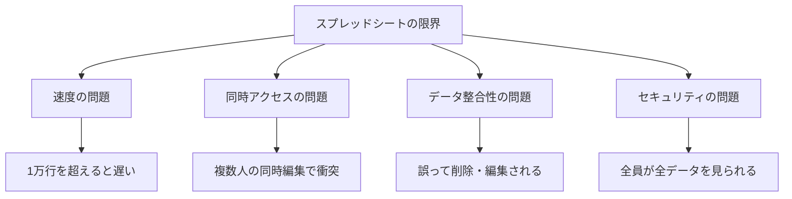
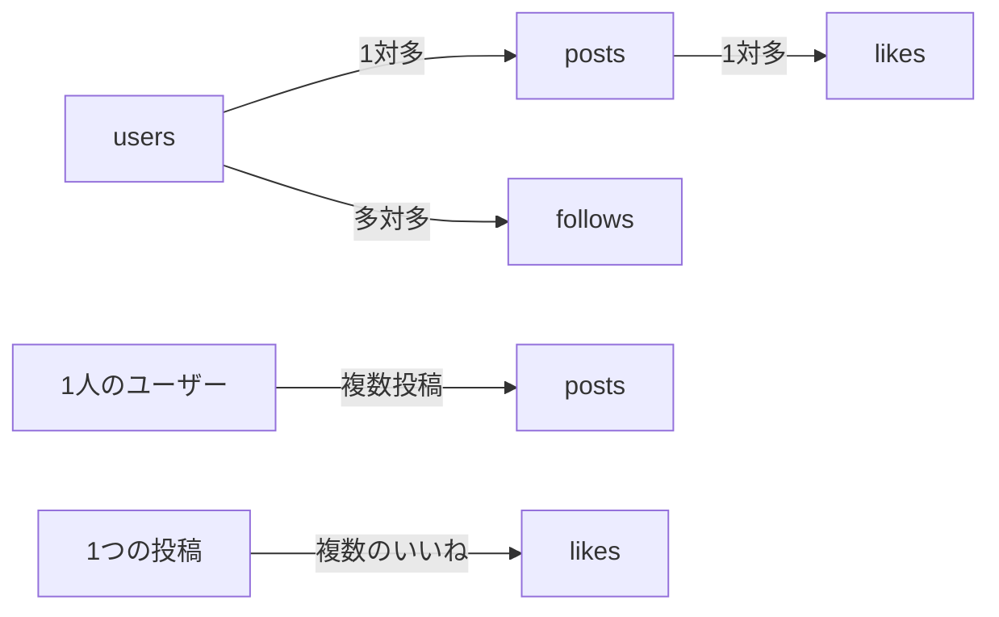

# データベース基礎

## 概要
Webアプリケーション開発において、データの保存と管理は最重要要素の一つです。本講義では、完全初心者の方でも理解できるよう、身近なスプレッドシートから始めて、データベースの基本概念、実際の使い方、そして適切な選択方法までを体系的に学習します。

## 学習目標
- データベースとは何か、なぜ必要なのかを理解する
- スプレッドシートを使ってデータベースの基本概念を体験する
- テーブル、レコード、フィールド、リレーションなどの基本用語を理解する
- SQL/NoSQLの違いと使い分けを理解する
- Supabase、Firebase、PostgreSQLなどの特徴を把握する
- 自分のプロジェクトに適したデータベースを選択できるようになる

## 内容

### 1. そもそもデータベースとは何か？

#### 日常生活の中のデータベース

データベースは、私たちの身の回りにあふれています。

**身近なデータベースの例：**
- **電話帳**: 名前、電話番号、住所を整理して保存
- **カレンダー**: 日付、予定、場所、参加者を管理
- **家計簿**: 日付、項目、金額、カテゴリを記録
- **蔵書リスト**: 本のタイトル、著者、出版社、読了状態

これらすべてが「データベース」の一種です。つまり、**データベースとは「情報を整理して保存し、必要な時に取り出せるようにした仕組み」**のことです。

#### なぜデータベースが必要なのか

**データベースがない場合の問題：**

```
❌ メモ帳にベタ書き
- 「山田太郎さんの電話番号は090-1234-5678」
- 「田中花子さんの電話番号は080-9876-5432」
- 「山田太郎さんの住所は東京都...」

問題点：
- 検索が大変（全部読まないと見つからない）
- 重複しやすい（山田太郎さんの情報が散らばる）
- 更新が漏れる（電話番号を変更し忘れる）
- データの関連性が分からない
```

**データベースを使った場合：**

```
✅ 構造化されたデータ
[ユーザーテーブル]
ID | 名前      | 電話番号        | 住所
1  | 山田太郎  | 090-1234-5678  | 東京都...
2  | 田中花子  | 080-9876-5432  | 神奈川県...

利点：
- 検索が簡単（名前で即座に検索）
- 重複がない（1人1レコード）
- 更新が確実（1箇所変えれば全体に反映）
- データの関連付けが可能
```

### 2. スプレッドシートで理解するデータベース

#### 実践：SNSアプリのデータベースを作ってみよう

GoogleスプレッドシートやExcelを使って、簡単なSNSアプリのデータベースを作成してみましょう。

**必要なデータ：**
1. ユーザー情報（名前、メールアドレス、プロフィール）
2. 投稿（投稿者、内容、投稿日時）
3. いいね（誰が、どの投稿に、いつ）
4. フォロー関係（誰が誰をフォローしているか）

#### ステップ1：ユーザー情報シートの作成

**シート名：users**

| user_id | name | email | profile | created_at |
|---------|------|-------|---------|------------|
| 1 | 山田太郎 | yamada@example.com | こんにちは！山田です | 2025-01-01 |
| 2 | 田中花子 | tanaka@example.com | 花が好きです🌸 | 2025-01-02 |
| 3 | 佐藤次郎 | sato@example.com | プログラミング勉強中 | 2025-01-03 |

**ポイント：**
- `user_id`は各ユーザーを一意に識別する番号（重複しない）
- 各列（フィールド）には明確な意味がある
- 各行（レコード）は1人のユーザーを表す

#### ステップ2：投稿シートの作成

**シート名：posts**

| post_id | user_id | content | created_at |
|---------|---------|---------|------------|
| 1 | 1 | 今日は良い天気ですね！ | 2025-01-10 09:00 |
| 2 | 2 | 桜が咲き始めました🌸 | 2025-01-10 10:30 |
| 3 | 1 | プログラミング楽しい！ | 2025-01-10 14:00 |
| 4 | 3 | はじめまして！ | 2025-01-10 15:00 |

**ポイント：**
- `user_id`でユーザーシートと関連付け（誰が投稿したか分かる）
- VLOOKUPを使えば投稿者の名前を表示できる

```
=VLOOKUP(B2, users!A:B, 2, FALSE)
// B2のuser_idを使って、usersシートから名前を取得
```

#### ステップ3：いいねシートの作成

**シート名：likes**

| like_id | user_id | post_id | created_at |
|---------|---------|---------|------------|
| 1 | 2 | 1 | 2025-01-10 09:30 |
| 2 | 3 | 1 | 2025-01-10 09:45 |
| 3 | 1 | 2 | 2025-01-10 11:00 |
| 4 | 3 | 2 | 2025-01-10 11:30 |

**ポイント：**
- 誰が（user_id）どの投稿に（post_id）いいねしたかを記録
- 同じ組み合わせは1回だけ（同じ人が同じ投稿に2回いいねはできない）

#### ステップ4：フォロー関係シートの作成

**シート名：follows**

| follow_id | follower_id | following_id | created_at |
|-----------|-------------|--------------|------------|
| 1 | 1 | 2 | 2025-01-05 |
| 2 | 1 | 3 | 2025-01-06 |
| 3 | 2 | 1 | 2025-01-07 |
| 4 | 3 | 2 | 2025-01-08 |

**ポイント：**
- follower_id: フォローする人
- following_id: フォローされる人
- 「1が2をフォロー」は「山田太郎が田中花子をフォロー」という意味

### 3. スプレッドシートの限界

#### なぜ専門的なデータベースが必要になるのか

スプレッドシートでもデータベースの役割は果たせますが、アプリケーションが成長すると限界が見えてきます。

**スプレッドシートの限界：**



**具体的な問題例：**

1. **速度の問題**
   ```
   投稿が10万件になったら？
   → スプレッドシートを開くだけで数分かかる
   → 検索に時間がかかる
   → アプリが使い物にならない
   ```

2. **同時アクセスの問題**
   ```
   100人が同時に投稿したら？
   → データが上書きされる
   → エラーが発生する
   → 一部の投稿が消える
   ```

3. **データ整合性の問題**
   ```
   user_id: 1を誤って"一"に変更したら？
   → 関連するデータが全て壊れる
   → 山田太郎さんの投稿が表示されない
   → アプリ全体が正常に動作しない
   ```

4. **セキュリティの問題**
   ```
   APIキーをどこに保存する？
   → スプレッドシートは誰でも見られる
   → パスワードを保存できない
   → 個人情報が漏洩する危険
   ```

### 4. データベースの基本概念

#### データベース用語をスプレッドシートで理解する

| データベース用語 | スプレッドシートでの対応 | 説明 |
|---------------|---------------------|------|
| **データベース** | ファイル全体 | SNSアプリ.xlsx |
| **テーブル** | シート | users, posts, likes, follows |
| **レコード（行）** | 行 | 1人のユーザー、1つの投稿 |
| **フィールド（列）** | 列 | name, email, content等 |
| **主キー** | ID列 | user_id, post_id等（重複しない識別子） |
| **外部キー** | 他シート参照 | postsのuser_id → usersのuser_id |

#### リレーション（関連）の理解

**リレーションとは：**
データ同士の関係性のことです。



**関係性の種類：**

1. **1対1の関係**
   ```
   ユーザー ←→ プロフィール詳細
   1人のユーザーは1つの詳細プロフィールを持つ
   ```

2. **1対多の関係**
   ```
   ユーザー → 投稿
   1人のユーザーは複数の投稿ができる
   ```

3. **多対多の関係**
   ```
   ユーザー ←→ ユーザー（フォロー関係）
   複数のユーザーが複数のユーザーをフォローできる
   ```

### 5. SQLデータベースの基礎

#### SQLとは何か

SQL（Structured Query Language）は、データベースと対話するための言語です。英語のような文法でデータを操作できます。

**基本的なSQL文：**

```sql
-- データを取得する（SELECT）
SELECT name, email FROM users;
// 「usersテーブルからnameとemailを取得して」

-- 条件付きで取得
SELECT * FROM posts WHERE user_id = 1;
// 「postsテーブルからuser_idが1の投稿を全て取得して」

-- データを追加する（INSERT）
INSERT INTO users (name, email, profile) 
VALUES ('鈴木四郎', 'suzuki@example.com', 'よろしく！');
// 「usersテーブルに新しいユーザーを追加して」

-- データを更新する（UPDATE）
UPDATE users SET profile = '更新しました！' WHERE user_id = 1;
// 「user_idが1のユーザーのprofileを更新して」

-- データを削除する（DELETE）
DELETE FROM posts WHERE post_id = 3;
// 「post_idが3の投稿を削除して」
```

#### PostgreSQLとは

PostgreSQLは、最も人気のあるオープンソースのSQLデータベースの一つです。

**特徴：**
- 無料で使える
- 高機能（複雑なクエリも可能）
- 信頼性が高い（大企業でも使用）
- Supabase、Neonなどのベース

**PostgreSQLの利点：**
```yaml
信頼性:
  - データの一貫性を保証
  - トランザクション機能
  - 障害時の自動復旧

拡張性:
  - JSON型のサポート
  - 全文検索機能
  - 地理情報の扱い

パフォーマンス:
  - インデックスによる高速検索
  - 並列処理のサポート
  - 大量データの効率的な処理
```

### 6. NoSQLデータベースの基礎

#### NoSQLとは何か

NoSQL（Not Only SQL）は、表形式以外の方法でデータを保存するデータベースです。

**SQLとNoSQLの違い：**

```
SQL（表形式）:
┌─────┬────────┬─────────────┐
│ ID  │ Name   │ Email       │
├─────┼────────┼─────────────┤
│ 1   │ 山田   │ yamada@...  │
│ 2   │ 田中   │ tanaka@...  │
└─────┴────────┴─────────────┘

NoSQL（JSON形式）:
{
  "users": {
    "user1": {
      "name": "山田",
      "email": "yamada@...",
      "profile": {
        "bio": "こんにちは",
        "interests": ["読書", "映画"]
      }
    }
  }
}
```

#### Firebaseの特徴

Firebaseは、Googleが提供するNoSQLデータベースサービスです。

**Firebaseのデータ構造：**
```javascript
// Firebaseのデータ例
{
  "users": {
    "user_abc123": {
      "name": "山田太郎",
      "email": "yamada@example.com",
      "posts": {
        "post_xyz789": true,
        "post_def456": true
      }
    }
  },
  "posts": {
    "post_xyz789": {
      "content": "今日は良い天気！",
      "author": "user_abc123",
      "timestamp": 1704067200000,
      "likes": {
        "user_ghi789": true
      }
    }
  }
}
```

**Firebaseの利点：**
- リアルタイム同期（変更が即座に反映）
- オフライン対応（ネットなしでも動作）
- 柔軟なデータ構造（後から項目追加が簡単）
- スケーラビリティ（自動的に拡張）

### 7. 推奨データベースサービスの比較

#### 主要サービスの特徴と使い分け

| サービス | 種類 | 料金 | 特徴 | 向いている用途 |
|---------|------|------|------|--------------|
| **Supabase** | SQL (PostgreSQL) | 無料枠充実 | オールインワン、認証機能付き | 一般的なWebアプリ |
| **Firebase** | NoSQL | 無料枠あり | リアルタイム同期、Google製 | チャット、ゲーム |
| **Neon** | SQL (PostgreSQL) | 無料枠あり | 高速、開発者向け | パフォーマンス重視 |
| **PlanetScale** | SQL (MySQL) | 無料枠あり | スケーラブル、ブランチ機能 | 大規模アプリ |
| **Google Sheets** | 表計算 | 無料 | 簡単、誰でも編集可能 | プロトタイプ |

#### Supabase（推奨）の詳細

**なぜSupabaseを推奨するか：**

1. **無料枠が充実**
   ```yaml
   無料で使える範囲:
     データベース: 500MB
     ストレージ: 1GB
     転送量: 2GB/月
     認証ユーザー: 50,000人
     
   個人開発には十分すぎる容量！
   ```

2. **初心者にやさしい**
   - 管理画面でデータを直接確認・編集
   - SQLを書かなくてもテーブル作成可能
   - 豊富な日本語ドキュメント
   - エラーメッセージが分かりやすい

3. **必要な機能が揃っている**
   ```typescript
   // 認証
   const { user } = await supabase.auth.signUp({
     email: 'user@example.com',
     password: 'password123'
   })
   
   // データ取得
   const { data: posts } = await supabase
     .from('posts')
     .select('*')
     .order('created_at', { ascending: false })
   
   // リアルタイム購読
   supabase
     .from('posts')
     .on('INSERT', payload => {
       console.log('新しい投稿:', payload.new)
     })
     .subscribe()
   ```

#### Firebase vs Supabase の選択基準

**Firebaseを選ぶ場合：**
- リアルタイム性が最重要（チャットアプリ等）
- オフライン対応が必須
- Googleサービスとの連携が必要
- NoSQLの柔軟性を活かしたい

**Supabaseを選ぶ場合：**
- SQLに慣れている、または学びたい
- 複雑なデータの関連性がある
- 管理画面でデータを確認したい
- PostgreSQLの高機能を使いたい

### 8. データベース設計の基本

#### 良いデータベース設計とは

**設計の原則：**

1. **正規化（重複を避ける）**
   ```
   ❌ 悪い例：
   posts テーブル
   | post_id | content | user_name | user_email |
   
   問題：ユーザー情報が投稿ごとに重複
   
   ✅ 良い例：
   posts テーブル
   | post_id | content | user_id |
   
   users テーブル
   | user_id | name | email |
   ```

2. **適切な型の選択**
   ```sql
   CREATE TABLE users (
     id SERIAL PRIMARY KEY,        -- 自動採番のID
     email VARCHAR(255) UNIQUE,     -- 重複しないメール
     name VARCHAR(100) NOT NULL,    -- 必須の名前
     created_at TIMESTAMP DEFAULT NOW() -- 作成日時
   );
   ```

3. **インデックスの活用**
   ```sql
   -- よく検索する列にインデックスを作成
   CREATE INDEX idx_posts_user_id ON posts(user_id);
   CREATE INDEX idx_posts_created_at ON posts(created_at);
   ```

#### セキュリティの考慮

**基本的なセキュリティ対策：**

1. **認証と認可**
   ```typescript
   // Supabaseの行レベルセキュリティ
   -- ユーザーは自分の投稿のみ編集可能
   CREATE POLICY "Users can update own posts" ON posts
   FOR UPDATE USING (auth.uid() = user_id);
   ```

2. **データの暗号化**
   - パスワードは必ずハッシュ化
   - 個人情報は暗号化して保存
   - HTTPSで通信を暗号化

3. **SQLインジェクション対策**
   ```typescript
   // ❌ 危険：文字列結合
   const query = `SELECT * FROM users WHERE email = '${email}'`
   
   // ✅ 安全：パラメータ化クエリ
   const { data } = await supabase
     .from('users')
     .select('*')
     .eq('email', email)
   ```

### 9. 実践：プロジェクトに合わせた選択

#### ケーススタディ1：個人用タスク管理アプリ

**要件：**
- ユーザー数：1〜5人
- データ量：少ない
- リアルタイム性：不要
- 予算：無料

**推奨：Google Sheets API + Next.js**
```javascript
// Google Sheets をデータベースとして使用
const sheets = google.sheets({ version: 'v4', auth });
const response = await sheets.spreadsheets.values.get({
  spreadsheetId: SHEET_ID,
  range: 'Tasks!A:E',
});
```

**理由：**
- 完全無料
- 管理画面不要（スプレッドシートで直接編集）
- 小規模なら十分な性能

#### ケーススタディ2：SNSアプリ

**要件：**
- ユーザー数：100〜1000人
- データ量：中程度
- リアルタイム性：いいね、コメントは即反映したい
- 予算：月1000円まで

**推奨：Supabase**
```typescript
// Supabaseでリアルタイム機能を実装
const channel = supabase
  .channel('posts')
  .on('postgres_changes', 
    { event: 'INSERT', schema: 'public', table: 'likes' },
    (payload) => {
      // いいねが追加されたら即座に反映
      updateLikeCount(payload.new.post_id)
    }
  )
  .subscribe()
```

**理由：**
- 無料枠で十分対応可能
- リアルタイム機能が標準装備
- SQLで複雑なクエリも可能

#### ケーススタディ3：リアルタイムチャット

**要件：**
- ユーザー数：1000人以上
- データ量：大量（メッセージ）
- リアルタイム性：必須
- オフライン対応：必要

**推奨：Firebase**
```javascript
// Firebaseでリアルタイムチャット
firebase.database().ref('messages').on('child_added', (snapshot) => {
  const message = snapshot.val();
  displayMessage(message);
});

// オフラインでも動作
firebase.database().goOffline();
```

**理由：**
- リアルタイム同期が最速
- オフライン対応が標準
- スケーラビリティが高い

### 10. よくある質問と解決策

#### Q1: データベースの勉強はどこから始めればいい？

**A: スプレッドシートから始めましょう**
1. まずGoogleスプレッドシートでデータ設計
2. 基本的なSQL文を覚える（SELECT, INSERT, UPDATE, DELETE）
3. Supabaseの無料アカウントで実践
4. 必要に応じて高度な機能を学ぶ

#### Q2: SQLとNoSQL、どちらを選ぶべき？

**A: プロジェクトの性質で決めます**

```yaml
SQLを選ぶ場合:
  - データの関連性が複雑
  - 厳密なデータ整合性が必要
  - 集計やレポート機能が必要
  - トランザクションが重要

NoSQLを選ぶ場合:
  - データ構造が頻繁に変わる
  - リアルタイム性が最重要
  - 大量のデータを扱う
  - 開発速度を優先
```

#### Q3: 無料でどこまでできる？

**A: 個人開発なら十分です**

| サービス | 無料枠 | 目安 |
|---------|--------|------|
| Supabase | 500MB, 50000ユーザー | 中規模アプリまでOK |
| Firebase | 1GB, 読み書き5万回/日 | 小規模アプリ向け |
| Neon | 3GB | 開発・テスト向け |
| Google Sheets | 1000万セル | プロトタイプ向け |

#### Q4: データが消えたらどうする？

**A: バックアップが重要です**

```bash
# Supabaseの場合
1. 管理画面から定期バックアップ設定
2. pg_dumpコマンドでローカルバックアップ
3. 重要なデータは複数箇所に保存

# スプレッドシートの場合
1. 定期的にダウンロード
2. Google Driveの履歴機能を活用
3. 重要なシートは複製を作成
```

### 11. 実践演習

#### 演習1：スプレッドシートでECサイトのDB設計

**課題：**
簡単なECサイトのデータベースをスプレッドシートで設計してください。

**必要なデータ：**
- 商品情報（商品名、価格、在庫数、カテゴリ）
- ユーザー情報（名前、メール、住所）
- 注文情報（誰が、何を、いつ、いくつ）
- カート情報（誰が、何を、いくつカートに入れているか）

**ヒント：**
- 各データをシートに分ける
- IDで関連付ける
- VLOOKUPで参照できるようにする

#### 演習2：SQLの基本を練習

**オンラインSQLプレイグラウンドで練習：**
https://www.db-fiddle.com/

```sql
-- テーブル作成
CREATE TABLE products (
  id SERIAL PRIMARY KEY,
  name VARCHAR(100),
  price INTEGER,
  stock INTEGER
);

-- データ挿入
INSERT INTO products (name, price, stock) VALUES
  ('ノートPC', 80000, 10),
  ('マウス', 3000, 50),
  ('キーボード', 5000, 30);

-- データ取得の練習
-- 1. 全商品を表示
-- 2. 価格が10000円以下の商品
-- 3. 在庫が20個以上の商品
-- 4. 商品名に「ー」が含まれる商品
```

#### 演習3：Supabaseでプロジェクト作成

**手順：**
1. Supabaseアカウント作成（無料）
2. 新規プロジェクト作成
3. Table Editorでテーブル作成
4. データを手動で追加
5. API DocsでJavaScriptコードを確認

**作成するテーブル：**
```sql
-- todoテーブル
CREATE TABLE todos (
  id SERIAL PRIMARY KEY,
  title TEXT NOT NULL,
  completed BOOLEAN DEFAULT false,
  created_at TIMESTAMP DEFAULT NOW()
);
```

### 12. データベース選択のチェックリスト

プロジェクトに最適なデータベースを選ぶためのチェックリストです。

```yaml
プロジェクト要件チェック:
  規模:
    □ ユーザー数は？（10人 / 100人 / 1000人以上）
    □ データ量は？（MB / GB / TB）
    □ 同時アクセス数は？
  
  機能:
    □ リアルタイム更新は必要？
    □ オフライン対応は必要？
    □ 複雑な検索・集計は必要？
    □ ファイル保存は必要？
  
  技術:
    □ SQLの知識はある？
    □ 使用するフレームワークは？
    □ 認証機能は必要？
  
  予算:
    □ 月額予算は？
    □ 初期費用は？
    □ 将来的な拡張予定は？

推奨データベース診断:
  全て「小規模・不要・なし」
    → Google Sheets API
  
  「中規模・一部必要・月1000円まで」
    → Supabase
  
  「リアルタイム必須・オフライン必要」
    → Firebase
  
  「大規模・高パフォーマンス必要」
    → Neon または PlanetScale
```

## 重要ポイント
- **データベースは「整理された情報の保管庫」** - 難しく考えずにスプレッドシートから理解する
- **最初はシンプルに** - スプレッドシートやSupabaseの無料枠から始める
- **適材適所** - プロジェクトの要件に合わせて選択
- **セキュリティは最初から** - 個人情報の扱いには細心の注意を
- **バックアップは必須** - データ消失に備えた対策を

## まとめ

データベースは最初は難しく感じるかもしれませんが、本質的には「データを整理して保存する仕組み」に過ぎません。スプレッドシートから始めて、徐々に専門的なデータベースへステップアップしていけば、必ず理解できます。

個人開発であれば、多くの場合は無料枠で十分です。まずはSupabaseやFirebaseの無料アカウントを作成して、実際に触ってみることをお勧めします。

データベース設計は、アプリケーションの土台となる重要な部分です。しかし、完璧を求める必要はありません。まずは動くものを作り、必要に応じて改善していけば良いのです。

---

### 補足資料

#### 用語集
- **データベース（DB）**: データを整理して保存する仕組み
- **テーブル**: データを表形式で管理する単位（スプレッドシートのシート）
- **レコード**: テーブルの1行分のデータ
- **フィールド**: テーブルの列（データの項目）
- **主キー（Primary Key）**: レコードを一意に識別するID
- **外部キー（Foreign Key）**: 他のテーブルとの関連を示すID
- **SQL**: データベースを操作する言語
- **NoSQL**: 表形式以外でデータを管理する方式
- **CRUD**: Create（作成）、Read（読取）、Update（更新）、Delete（削除）の頭文字

#### 参考リンク
- [Supabase公式ドキュメント](https://supabase.com/docs)
- [Firebase公式ドキュメント](https://firebase.google.com/docs)
- [PostgreSQLチュートリアル](https://www.postgresqltutorial.com/)
- [SQL入門](https://www.w3schools.com/sql/)
- [DB設計入門](https://qiita.com/tags/db設計)

#### 次のステップ
データベースの基礎を理解したら、実際のプロジェクトで使ってみましょう。データベース設計は経験を積むことで上達します。失敗を恐れず、どんどん作ってみてください！