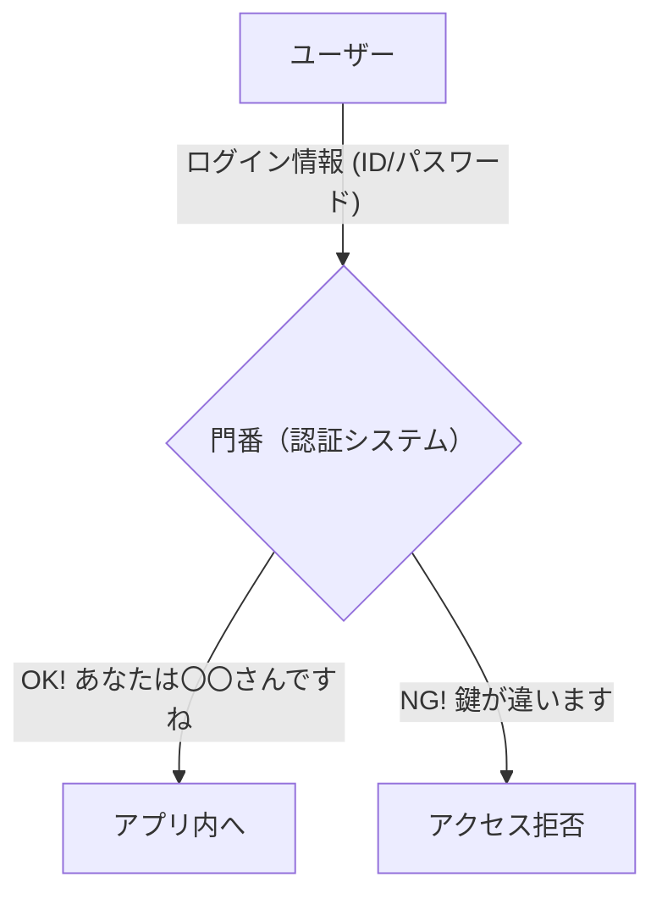
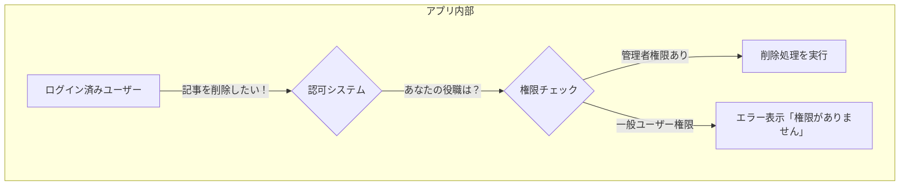
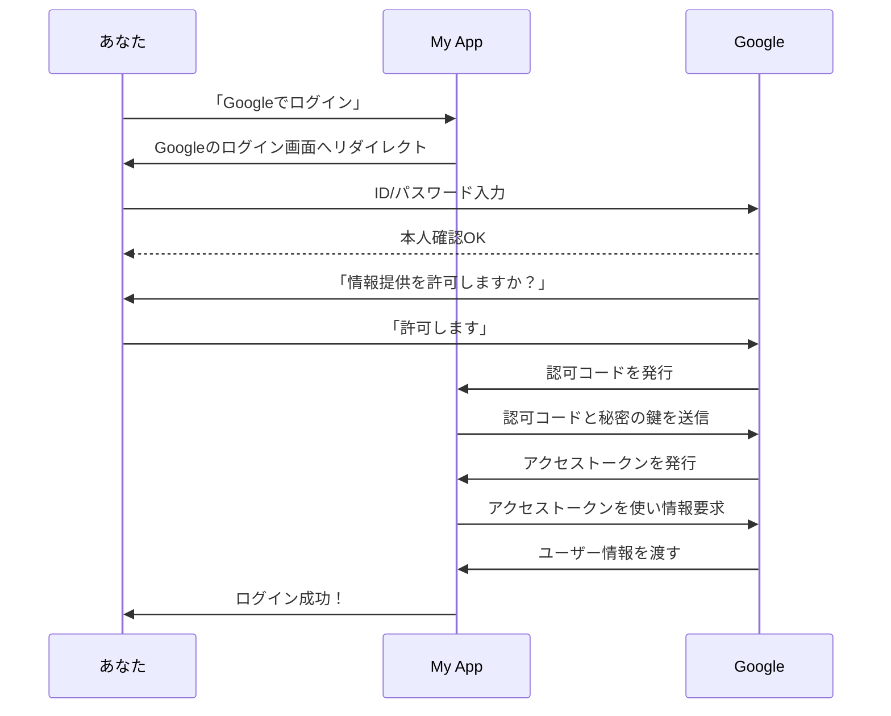

# 認証の仕組みを完全理解する

## 概要
Webアプリケーション開発において、「今アクセスしているのは誰か？」を管理する「認証」は、データベースと並んで最も重要な機能の一つです。このユニットでは、認証の基本概念から、複雑に見える「ソーシャルログイン」の裏側まで、非エンジニアの方でも直感的に理解できるよう、図や例えを多用して徹底的に解説します。

## この章で解消される疑問
- 「ログイン」の裏側では、一体何が起きているの？
- 「認証」と「認可」って、よく聞くけど何が違うの？
- なぜ「Googleでログイン」は、自分のパスワードをサービスに教えなくても安全なの？
- 認証機能って、自分で作っちゃダメなの？
- たくさんある認証サービス、どれを選べばいいの？

## 学習目標
- 「認証」と「認可」の違いを、身近なサービスの例を挙げて説明できる。
- なぜ認証機能を自作するべきではないのか、そのセキュリティリスクを理解する。
- OAuth 2.0（ソーシャルログイン）の仕組みを、登場人物の心の声やデータの流れを含めて物語として説明できる。
- `アクセストークン`と`リフレッシュトークン`の役割と違いを説明できる。
- 主要な認証サービス（Clerk, Supabase Auth, Firebase Auth）の長所・短所を理解し、プロジェクトに応じて選択できる。

---

## 1. 認証と認可 - アプリの「門番」と「通行許可証」

この章では、セキュリティの基本である「認証」と「認可」の違いを、具体例を交えて深掘りします。この区別を理解することが、安全なシステム設計の第一歩です。

### 「認証 (Authentication)」とは？ - あなたは誰？
**一言でいうと：「あなたは誰？」を確認するプロセス。** アプリの「**門番**」のような役割です。

**身近な例:**
- **SNSサイト:** ユーザー名とパスワードを入力してログインする。
- **銀行ATM:** キャッシュカードを挿入し、暗証番号を入力する。
- **スマートフォン:** Face IDや指紋でロックを解除する。

これらはすべて、「正当な利用者本人である」ことをシステムに証明する行為、つまり**認証**です。

### 「認可 (Authorization)」とは？ - あなたは何ができる？
**一言でいうと：「あなたに何をする権限があるか？」を制御するプロセス。** アプリ内の「**通行許可証**」や「**役職**」のような役割です。

**身近な例:**
- **ECサイト:**
    - **認証:** ログインする。
    - **認可:** ログイン後、自分の購入履歴は閲覧できるが、他人の購入履歴は見られない。
- **SNS (X/Twitter):**
    - **認証:** ログインする。
    - **認可:** 自分のツイートは削除できるが、他人のツイートは削除できない。
- **Google Drive:**
    - **認証:** Googleアカウントにログインする。
    - **認可:** ファイルのオーナーは共有設定を変更できるが、「閲覧者」権限のユーザーはコメントしかできない。

### なぜ「認証」と「認可」の分離が重要なのか？
この二つを明確に分けることは、セキュアで柔軟なシステムを作る上で極めて重要です。

1.  **責任の分離 (Separation of Concerns):**
    - 「本人確認」という非常に重要な責務を認証システムに集中させることができます。
    - 一方で、アプリケーションの各機能は「このユーザーに許可されている操作か？」という認可のチェックに専念できます。
    - これにより、コードがシンプルになり、バグやセキュリティホールが生まれにくくなります。

2.  **柔軟な権限管理:**
    - 新しい役職（例：「編集者」「モデレーター」）が追加された場合、認可のルールを変更するだけで対応できます。認証の仕組みに手を入れる必要はありません。

3.  **最小権限の原則 (Principle of Least Privilege):**
    - ユーザーには、その役割に必要な最小限の権限（認可）のみを与える、というセキュリティの基本原則を実装しやすくなります。万が一アカウントが乗っ取られても、被害を最小限に抑えることができます。

> **☕️ コラム：よくある誤解**
> 「認証」と「認可」は英語でも似ているため（Authentication / Authorization）、ベテランのエンジニアでも時々混同することがあります。この二つを明確に区別して話せるだけで、「お、この人は分かっているな」と思わせることができます。

---

## 2. なぜ認証は自作してはいけないのか？

「ログイン機能くらいなら自分で作れるのでは？」と思うかもしれません。しかし、現代のWeb開発において、**認証機能の自作は絶対に避けるべき**です。これは、腕利きの料理人が「ビルの耐震設計も自分でやろう」と言うようなものです。専門領域が全く異なります。

- **パスワード管理の地獄:**
    - パスワードをそのままデータベースに保存するのは論外です（**絶対NG**）。
    - 「ハッシュ化」という不可逆な暗号化が必須ですが、その方式（`bcrypt`, `scrypt`, `Argon2`など）は常に進化しています。古い`MD5`や`SHA-1`といった方法は、現代の計算能力の前では簡単に破られてしまいます。
    - 安全なハッシュ化には、「ソルト」や「ペッパー」といった追加の工夫も必要で、管理が非常に複雑になります。

- **セッション管理の落とし穴:**
    - ログイン状態を維持する「セッション」の仕組みは、乗っ取り（ハイジャック）の標的になりやすい核心部分です。
    - 安全なセッショントークンの生成、有効期限の管理、盗まれた際の無効化など、考慮すべき点が山のようにあります。

- **終わりなき攻撃手法との戦い:**
    - ブルートフォース攻撃、辞書攻撃、SQLインジェクション、クロスサイトスクリプティング(XSS)、クロスサイトリクエストフォージェリ(CSRF)...。
    - 世界中のハッカーが、常に新しい攻撃方法を考案しています。個人や小規模なチームで、その全てに自前で対応し続けるのは事実上不可能です。

**結論：認証は「餅は餅屋」。GoogleやMicrosoftのような巨大企業が巨額の投資をして開発・維持している、信頼できる専門サービスに任せるのが、最も安全で、賢く、効率的な選択です。**

---

## 3. OAuth 2.0 - 「Googleでログイン」の裏側劇場

「Googleでログイン」や「GitHubでログイン」といった機能は、**OAuth 2.0** という業界標準の「認可」の仕組みで動いています。これを、登場人物たちの心の声や具体的なやり取りを交えた物語仕立てで見ていきましょう。

**登場人物:**
- **あなた (ユーザー):** 物語の主人公。色々なアプリを使いたい。
- **あなたのアプリ (例: My App):** あなたが作った、これから人気者になりたいアプリ。
- **Google (IDプロバイダー):** 世界的に信頼されている身分証明のプロ。セキュリティの番人。

---

### **【第1幕】出会いとお願い**

1.  **あなた:** 新しいタスク管理アプリ「My App」を見つける。「あ、これ便利そう！でもまた会員登録か…面倒だな。お、『Googleでログイン』がある！これを使おう！」
    *(あなたは「Googleでログイン」ボタンをクリックします)*
    > **あなた → My App:** 「My Appさん、僕のことはGoogleさんに聞いてください！」

2.  **My App:** (心の声: よし、新規ユーザーだ！でもパスワードを預かるのは怖いし責任重大だ…。そうだ、Googleさんにお願いしよう！)
    *(My Appは、あなたをGoogleのログイン画面へ送り出します。この時、こっそりGoogleに「この人が認証を終えたら、私の指定した場所に戻してね」という情報(リダイレクトURI)を伝えています)*
    > **My App → Google:** 「セキュリティの番人Google様、この方がログインを希望されています。認証が終わりましたら、`https://My App.com/callback` へお戻しください。」

---

### **【第2幕】本人確認と許可の問いかけ**

3.  **Google:** あなたにIDとパスワードの入力を求めます。これは**あなたとGoogleだけの秘密のやり取り**です。My Appは一切関与できません。
    > **Google → あなた:** 「こんにちは！本当にあなたご本人ですか？IDとパスワードを教えてください。」

4.  **あなた:** IDとパスワードを入力。Googleは本人確認を完了します。
    > **あなた → Google:** 「はい、これです。」

5.  **Google:** 本人確認ができた上で、あなたに最終確認をします。
    *(画面には「My Appが以下の情報をリクエストしています」という同意画面が表示されます)*
    > **Google → あなた:** 「ご本人様確認ができました。ところで、新人のMy App君が、あなたの『名前』と『メールアドレス』を知りたがっていますが、許可してもよろしいでしょうか？ **あなたのパスワードは絶対に教えません**のでご安心を。」

6.  **あなた:** 内容を確認し、「はい、許可します」と同意ボタンを押します。
    > **あなた → Google:** 「名前とメアドだけならOKです。許可します！」

---

### **【第3幕】信頼の証、トークンの発行**

7.  **Google:** あなたの許可を得て、My Appに**一時的な**「**認可コード**」を発行します。これは、次のステップで使う使い捨ての引換券のようなものです。
    > **Google → My App:** 「ご本人から許可が出ました。この引換券（認可コード）を持って、裏口から私のところへ来てください。」

8.  **My App:** (心の声: よっしゃ、引換券ゲット！でもこれだけじゃまだユーザー情報はもらえない。裏口に行って、本物の許可証をもらわないと！)
    *(My Appは、受け取った認可コードと、自分自身の秘密の鍵(Client Secret)を持って、ユーザーには見えない裏側(バックエンド)でGoogleに再度アクセスします)*
    > **My App → Google (裏口):** 「Google様、先ほどの引換券です。そしてこれが私の身分を証明する秘密の鍵です。本物の許可証（アクセストークン）をください！」

9.  **Google:** 認可コードと秘密の鍵を検証し、問題がなければ、ついに「**アクセストークン**」を発行します。
    > **Google → My App:** 「よろしい。これが許可の証、**アクセストークン**です。有効期限は1時間です。これを使えば、先ほど許可された情報を引き出せますよ。」

---

### **【第4幕】情報の取得とログイン成功**

10. **My App:** (心の声: これがアクセストークンか！これさえあれば…！)
    *(My Appは、受け取ったアクセストークンを提示して、Googleの保護されたリソース(API)にアクセスします)*
    > **My App → Google API:** 「このアクセストークンは本物ですか？本物なら、許可された情報（名前とメールアドレス）をください！」

11. **Google:** アクセストークンが正しく、有効期限内であることを確認し、あなたの名前とメールアドレスをMy Appに渡します。
    > **Google API → My App:** 「正真正銘のトークンです。どうぞ、これが〇〇様の情報です: `{ "name": "ユーザー名", "email": "user@example.com" }`」

12. **My App:** ついにあなたの情報を受け取り、自身のデータベースにユーザーを登録し、ログイン状態にします。
    > **My App → あなた:** 「ようこそ、〇〇さん！ログインが完了しました！」

---

### **物語のポイントとトークンの役割**

- **パスワードの安全性:** あなたのパスワードは、**決してMy Appには渡りません**。やり取りは常にあなたとGoogleの間だけで完結します。これが最も重要なポイントです。
- **アクセストークン (Access Token):**
    - **役割:** 短時間だけ有効な「**通行許可証**」。これを持っていることで、アプリは保護された情報（ユーザーの名前など）にアクセスできます。
    - **例え:** イベント会場の「1日入場パス」。これがあれば指定されたエリアに入れますが、有効期限が切れるとただの紙切れです。
- **リフレッシュトークン (Refresh Token):**
    - **役割:** アクセストークンを再発行するための「**交換券**」。アクセストークンは頻繁に失効しますが、ユーザーに毎回ログインを強いるのは不便です。そこで、このリフレッシュトークンを使って、裏側で新しいアクセストークンを自動的に取得します。
    - **例え:** 「**ホテルの合鍵**」と「**フロントで本鍵と交換できるカード**」
        - **アクセストークン（合鍵）:** 各部屋（API）に入るために使う。セキュリティのため、数時間で無効になる。
        - **リフレッシュトークン（交換カード）:** 合鍵が使えなくなったら、これをフロント（認証サーバー）に持っていくと、本人確認なしで新しい合鍵（アクセストークン）を発行してもらえる。こちらは長期間有効だが、使えるのはフロントでの交換のみ。万が一このカードを落としても、部屋に直接入れるわけではないので、合鍵よりは安全。

---

## 4. 主要認証サービス徹底比較

では、この面倒で重要な認証を任せられるサービスには、どんな選択肢があるのでしょうか？ここでは、現代的なWeb開発で人気の3つのサービスを、より多角的に比較します。

| 観点 | Clerk | Supabase Auth | Firebase Auth |
| :--- | :--- | :--- | :--- |
| **コンセプト** | **フロントエンド特化の認証UIキット** | **データベースと統合された認証バックエンド** | **Google製、モバイル・Web向けBaas** |
| **UIコンポーネント** | **◎ 非常に豊富で美しい** | **△ 基本的なもののみ（自作推奨）** | **△ 基本的なもののみ（自作推奨）** |
| **導入速度** | **◎ 最速（数行のコードで実装可）** | **〇 やや手間がかかる** | **〇 やや手間がかかる** |
| **データベース連携** | **△ 外部（一手間必要）** | **◎ 完全統合（RLSが強力）** | **〇 Firestore/RealtimeDBとは強力連携** |
| **価格体系(無料枠)** | 500 MAU (月間アクティブユーザー) | 50,000 MAU | 50,000 MAU |
| **学習コスト** | **◎ 低い（ドキュメントが優秀）** | **〇 中程度（DB/RLSの知識も必要）** | **〇 中程度（Googleエコシステムの知識）** |
| **エコシステム** | Next.js/Reactに強い | Supabase製品群（DB, Storage等）と連携 | Google Cloud Platform(GCP)と連携 |
| **こんな人/チームにおすすめ** | **開発スピード最優先**のスタートアップ。素早くMVPを作りたい個人開発者。フロントエンドが主体のチーム。 | **データセキュリティ最優先**のプロジェクト。複雑な権限管理が必要なBtoBサービス。バックエンド主体のチーム。 | **リアルタイムアプリ**（チャット等）を開発したいチーム。Googleの他サービスを多用するプロジェクト。 |

### なぜこのブートキャンプではClerkを選ぶのか？

Vibe Coder Bootcampでは、数ある選択肢の中から**Clerk**を推奨しています。その理由は、単に「簡単だから」だけではありません。「教育的観点」から見て、最も効果的だと考えているからです。

1.  **圧倒的な成功体験:**
    - 非エンジニアにとって、最初の大きな壁は「動くものが作れない」という挫折感です。Clerkを使えば、驚くほど短時間で、プロが作ったような高機能な認証UIを実装できます。この**「できた！」という成功体験**が、学習を継続する上で何よりの燃料になります。

2.  **「関心の分離」の体感:**
    - 「認証UIはClerkに任せる」「データベースはSupabaseに任せる」というように、専門的な機能を外部サービスに切り出す考え方は、現代的な開発手法の基本です。Clerkを使うことで、この**「餅は餅屋」という重要な設計思想**を自然に体感できます。

3.  **本質的な部分への集中:**
    - AI駆動開発の核心は、人間が「何をしたいか」というビジネスロジックやユーザー体験を設計し、AIに指示を出すことです。認証画面の見た目を整えるような作業はAIも得意ですが、Clerkに任せることで、私たちは**「このアプリならではの価値は何か？」という、より創造的で本質的な部分のプロンプトエンジニアリングに集中**できます。

4.  **最新技術への追随:**
    - Clerkは、Next.jsのApp Routerなど、最新のフロントエンド技術への対応が非常に迅速です。Clerkを学ぶことは、結果的に**モダンなWeb開発のベストプラクティスを学ぶ**ことに繋がります。

まずはClerkで「認証を実装する感覚」と「外部サービスを組み合わせる感覚」を掴むこと。それが、遠回りのようで、実はアプリケーション開発の全体像を理解する一番の近道なのです。

次のユニットでは、いよいよClerkを使って、あなたのアプリにGoogle認証を実装していきましょう！