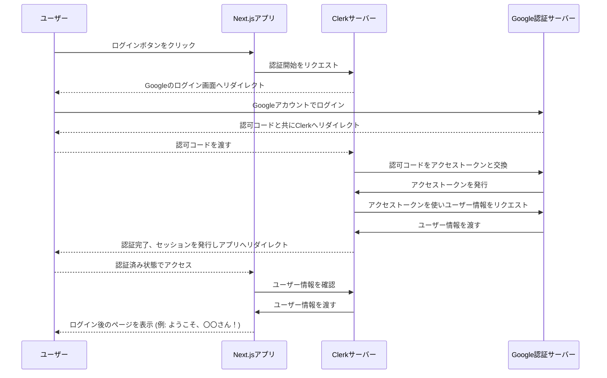

# ハンズオン: ClerkによるGoogle認証の実装

## 概要
前のユニットで学んだ認証の理論を、いよいよ実践に移します。このユニットでは、あなたのNext.jsアプリケーションに、**Clerk**という強力なサービスを使って、高機能な「Google認証」を導入します。

一つ一つのステップを、なぜそうするのかという理由と共に、スクリーンショット付きで丁寧に解説します。焦らずついてきてください。このハンズオンが終わる頃には、あなたのアプリはプロレベルの認証機能を驚くほど簡単に手に入れています。

## この章のゴールと達成目標
この章を終えると、あなたは以下のことができるようになります。

- **ゴール:** ClerkとGoogle Cloud Consoleを連携させ、Next.jsアプリに安全なGoogleログイン機能を実装できる。
- **達成目標:**
    1. Clerkの役割と、それが認証の複雑さをどのように解決してくれるのかを説明できる。
    2. ClerkのUIコンポーネントを使いこなし、ログイン状態に応じて表示を切り替える実装ができる。
    3. Google Cloud ConsoleでOAuthクライアントIDを発行し、その設定値の意味を理解できる。
    4. サーバーサイドでログインユーザーの情報を安全に取得する方法を理解し、実装できる。

## 準備
- [3-3.認証について.md](./3-3.認証について.md)を読み終えていること。
- Clerkのアカウントを作成しておくこと。
- Googleアカウントを持っていること。

---

## 1. Clerkの役割と認証フローの全体像

ハンズオンに入る前に、Clerkが私たちの開発をどれだけ楽にしてくれるのか、その全体像を掴んでおきましょう。

### Clerkが隠蔽してくれるOAuthの複雑さ

前のユニットで学んだOAuthのフローを思い出してください。認証リクエスト、リダイレクト、認可コードの取得、アクセストークンの交換、ユーザー情報の取得...。これら全てを自前で実装するのは非常に大変です。

Clerkは、この一連の面倒な処理を全て肩代わりしてくれます。私たちがやるべきことは、Clerkが提供する便利なコンポーネントを数行コードに追加するだけです。

- **`<ClerkProvider>`**: アプリ全体に「今、ユーザーはログインしているか？」という情報を共有するための大元です。
- **`<SignInButton>` / `<UserButton>`**: ログインボタンやユーザーアイコン付きのメニューを、驚くほど簡単に表示してくれます。
- **`middleware.ts`**: アプリケーションの「検問所」として機能し、未ログインのユーザーを自動的にログインページに誘導してくれます。

これらのコンポーネントが、裏側でOAuthの複雑なやり取りを全て実行してくれているのです。

### Clerk導入後の認証フロー

Mermaid.jsを使って、Clerkを導入した際の認証フローを図解します。


この図の「Clerk」と「Google」間の複雑なやり取りを、Clerkが全て担当してくれます。開発者は「App」と「Clerk」の連携部分だけを考えれば良いのです。

---

## 2. Clerkの初期設定 (ハンズオン)

### ステップ1: Clerkアプリケーションの作成
1.  Clerkのダッシュボードにログインし、「Add application」をクリックします。
2.  好きなアプリケーション名を入力します。
3.  認証方法として「Google」が選択されていることを確認し、「Create Application」をクリックします。
4.  作成が完了すると、APIキーが表示されます。**このページはまだ閉じないでください。**

### ステップ2: Next.jsへのSDKインストールと環境変数設定

**▶ Cursorへの指示 (プロンプト例)**
> Next.jsプロジェクトでClerkを使いたい。
> 1. 必要な公式ライブラリをインストールして。
> 2. プロジェクトルートに`.env.local`ファイルを作成し、以下のキーを追加して。値は後で自分で入れます。
>    - `NEXT_PUBLIC_CLERK_PUBLISHABLE_KEY`
>    - `CLERK_SECRET_KEY`

Cursorが以下のコマンドとファイルを作成してくれます。
```bash
npm install @clerk/nextjs
```

```.env.local
NEXT_PUBLIC_CLERK_PUBLISHABLE_KEY=""
CLERK_SECRET_KEY=""
```
先ほど開いたままのClerkのダッシュボードから、対応するキーをコピーして貼り付けます。

> #### 🔒 セキュリティチェックポイント
> `.env.local`ファイルは、絶対にGitで管理してはいけません。このファイルには、データベースのパスワードやAPIキーなど、絶対に漏洩してはならない秘密情報が含まれます。
> Next.jsの標準的な`.gitignore`には`.env.local`が含まれているため、通常は問題ありませんが、誤って`git add -f .env.local`のようなコマンドを実行しないよう、細心の注意を払いましょう。キーの漏洩は、深刻なセキュリティインシデントに繋がります。

### ステップ3: アプリケーションのProvider設定

Clerkの機能をアプリ全体で使えるように、`layout.tsx`を`<ClerkProvider>`で囲みます。

**▶ Cursorへの指示 (プロンプト例)**
> `app/layout.tsx`を開いて、`<html>`と`<body>`タグを`<ClerkProvider>`でラップしてください。

```tsx:app/layout.tsx
import { ClerkProvider } from '@clerk/nextjs'
import { jaJP } from "@clerk/localizations"; // 日本語化のために追加

export default function RootLayout({
  children,
}: {
  children: React.ReactNode
}) {
  return (
    // ClerkProviderで全体を囲む
    <ClerkProvider localization={jaJP}> {/* 日本語化オプション */}
      <html lang="ja">
        <body>{children}</body>
      </html>
    </ClerkProvider>
  )
}
```
**ポイント:** `jaJP`ローカライゼーションをインポートして`localization`プロパティに渡すことで、Clerkが提供するUI（サインイン画面など）が自動的に日本語になります。ユーザー体験を向上させるための簡単な一手間です。

### ステップ4: ミドルウェアの作成

認証情報を保護し、どのページを公開し、どのページを認証必須にするかを一元管理する「ミドルウェア」を作成します。これは、アプリケーション全体の「検問所」のようなものです。

**▶ Cursorへの指示 (プロンプト例)**
> プロジェクトのルートディレクトリ（`app`フォルダと同じ階層）に`middleware.ts`を作成してください。
> 中身は、Clerkの公式ドキュメントにある基本的な設定を記述してください。全てのルートをデフォルトで保護するようにします。

```typescript:middleware.ts
import { authMiddleware } from "@clerk/nextjs/server";

export default authMiddleware({
  // publicRoutes: ["/about", "/contact"], // 例: /about と /contact はログイン不要で公開
});

export const config = {
  matcher: ["/((?!.*\\..*|_next).*)", "/", "/(api|trpc)(.*)"],
};
```

#### `matcher`の解説
この正規表現は少し複雑に見えますが、「どのリクエストをミドルウェア（検問所）でチェックするか」を定義しています。
- `"/((?!.*\\..*|_next).*)"`: `_next`（Next.jsの内部ファイル）や`.`（画像ファイルなど）を含まない、ほとんどのページリクエストにマッチします。
    - 例: `/dashboard`, `/profile/settings` → **マッチする**
    - 例: `/_next/static/style.css`, `/favicon.ico` → **マッチしない**
- `"/"`: トップページにマッチします。
- `"/(api|trpc)(.*)"`: `/api/`や`/trpc/`で始まるAPIルートにマッチします。

これにより、静的ファイルへのアクセスを妨げることなく、アプリケーションのページとAPIエンドポイントを効率的に保護できます。

---

## 3. Google認証の有効化 (ハンズオン)

ここが一番の山場ですが、各設定の意味を理解すれば怖くありません。一つずつ丁寧に進めましょう。

### ステップ5: Google Cloud Consoleでの認証情報作成

1.  [Google Cloud Console](https://console.cloud.google.com/)にアクセスし、新しいプロジェクトを作成します。（既存のものでもOK）
2.  左上のメニューから「APIとサービス」>「**OAuth同意画面**」を選択します。
    -   **なぜこれが必要？**: あなたのアプリが「〇〇さんのGoogleアカウント情報（名前やメールアドレス）にアクセスさせてください」とユーザーにお願いする際に表示される同意画面の情報です。アプリ名やサポートメールを正しく設定することで、ユーザーに安心感を与えます。
    -   **User Type**: 「外部」を選択します。（GCP組織に属していない限り、これを選択します）
    -   アプリ名、ユーザーサポートメール、デベロッパーの連絡先情報を入力して保存します。スコープやテストユーザーの設定は、この段階では不要です。
3.  次に、左のメニューから「**認証情報**」を選択します。
4.  画面上部の「＋認証情報を作成」>「**OAuth 2.0 クライアント ID**」を選択します。
    -   **アプリケーションの種類**: 「ウェブ アプリケーション」を選択します。
    -   **名前**: 好きな名前（例: VibeCoderApp Auth）を入力します。
    -   **承認済みのリダイレクト URI**: **ここが最も重要です。**
        -   **なぜこれが必要？**: セキュリティの要です。Googleでの認証が成功した後、ユーザーを**安全にあなたのアプリケーションに戻すため**の「戻り先住所」をGoogleに事前登録しておく仕組みです。もしこれがなければ、悪意のあるサイトがリダイレクト先を偽装し、認証情報を盗み取ることが可能になってしまいます。
        -   **設定方法**: Clerkのダッシュボードに戻り、「Providers」>「Google」の設定画面にある「Redirect URI」をコピーして、Google Cloud Consoleの「URIを追加」ボタンを押し、貼り付けます。
5.  「作成」をクリックすると、「**クライアントID**」と「**クライアントシークレット**」が表示されます。
    -   **クライアントID**: あなたのアプリケーションを識別するための公開されたIDです。「表札」のようなものです。
    -   **クライアントシークレット**: アプリケーションだけが知っている秘密のパスワードです。「合鍵」のようなもので、絶対に漏洩させてはいけません。

> #### 🔧 よくあるエラー: `redirect_uri_mismatch`
> このエラーは、Google認証を設定する際に最もよく遭遇する問題です。
> - **原因**: Google Cloud Consoleに登録した「承認済みのリダイレクトURI」と、実際にClerkがGoogleにリクエストしているリダイレクトURIが一致していない場合に発生します。
> - **解決策**:
>     1. Clerkのダッシュボードに表示されている「Redirect URI」を正確にコピーします。（末尾のスラッシュの有無なども含めて完全に一致させる必要があります）
>     2. Google Cloud Consoleの「認証情報」> 対象のOAuthクライアントIDを編集 > 「承認済みのリダイレクトURI」に、コピーしたURIが正しく登録されているか再確認します。
>     3. 複数のURIが登録されている場合は、不要なものがないか確認します。
>
> ほとんどの場合、この手順で解決します。

### ステップ6: Clerkへのキー設定

1.  Clerkのダッシュボードに戻ります。
2.  「Providers」>「Google」の設定画面を開きます。
3.  先ほどGoogle Cloud Consoleで取得した「クライアントID」と「クライアントシークレット」をそれぞれ対応する欄に貼り付け、「Save」をクリックします。

これで、あなたのアプリでGoogle認証を使うための全ての準備が整いました！

---

## 4. UIコンポーネントの実装と活用 (ハンズオン)

最後に、ユーザーが実際に操作するUIを設置し、より実践的な使い方を学びます。

### 基本的なログイン/ログアウトボタンの設置

**▶ Cursorへの指示 (プロンプト例)**
> `app/layout.tsx`にヘッダーを追加してください。
> ヘッダーには、Clerkを使って、
> - ユーザーがログインしていない時は「サインイン」ボタンを表示
> - ユーザーがログインしている時は、ユーザーアイコンとメニュー（ログアウトなど）が表示されるボタンを表示
> するようにしてください。

Cursorは`<SignedOut>`, `<SignedIn>`, `<SignInButton>`, `<UserButton>`といったコンポーネントを駆使して、以下のようなコードを生成します。

```tsx:app/layout.tsx
// ... (既存のimports)
import { SignedIn, SignedOut, SignInButton, UserButton } from '@clerk/nextjs'

export default function RootLayout({ children }) {
  return (
    <ClerkProvider localization={jaJP}>
      <html lang="ja">
        <body>
          <header style={{ display: 'flex', justifyContent: 'space-between', padding: '1rem', borderBottom: '1px solid #ccc' }}>
            <h1>VibeCoder App</h1>
            <div>
              <SignedOut>
                <SignInButton />
              </SignedOut>
              <SignedIn>
                <UserButton afterSignOutUrl="/" />
              </SignedIn>
            </div>
          </header>
          <main style={{ padding: '1rem' }}>{children}</main>
        </body>
      </html>
    </ClerkProvider>
  )
}
```
- **`<SignedOut>`**: このコンポーネントで囲まれた要素は、ユーザーが**ログアウトしている時だけ**表示されます。
- **`<SignedIn>`**: このコンポーネントで囲まれた要素は、ユーザーが**ログインしている時だけ**表示されます。
- **`<UserButton afterSignOutUrl="/" />`**: ログアウト後のリダイレクト先を指定できます。ユーザー体験を向上させる重要な設定です。

### 【応用】実践的なUIの出し分け

`<SignedIn>`コンポーネントは、より実践的なUIの制御にも使えます。例えば、「ログインしているユーザーにだけ投稿ボタンを見せる」といった実装が簡単にできます。

```tsx:app/page.tsx
import { SignedIn, SignedOut } from '@clerk/nextjs';

function PostButton() {
  return <button>投稿する</button>;
}

export default function HomePage() {
  return (
    <div>
      <h2>タイムライン</h2>
      <SignedIn>
        {/* ログインしているユーザーには投稿ボタンと投稿フォームが見える */}
        <div style={{ marginBottom: '1rem' }}>
          <textarea placeholder="いまどうしてる？" style={{ width: '100%', minHeight: '80px' }} />
          <PostButton />
        </div>
      </SignedIn>
      <SignedOut>
        {/* ログインしていないユーザーには、ログインを促すメッセージが見える */}
        <p>投稿するには<a href="/sign-in">ログイン</a>してください。</p>
      </SignedOut>
      {/* ...投稿一覧... */}
    </div>
  );
}
```

### 【応用】サーバーサイドでユーザー情報を取得する

UIだけでなく、サーバーサイドでユーザー情報を利用したい場面は多くあります（例: データベースにユーザーIDを記録する）。Clerkでは、これも非常に簡単です。

`@clerk/nextjs/server`から`auth`や`currentUser`をインポートして使います。

```tsx:app/page.tsx
import { auth, currentUser } from '@clerk/nextjs/server';

export default async function HomePage() {
  // auth() を使ってユーザーIDやセッション情報を取得
  const { userId } = auth();
  
  // currentUser() を使って、より詳細なユーザー情報を取得
  const user = await currentUser();

  return (
    <div>
      <h2>ようこそ！</h2>
      {user ? (
        <p>こんにちは、{user.firstName || user.username}さん！ あなたのIDは `{userId}` です。</p>
      ) : (
        <p>ゲストさん、こんにちは！</p>
      )}
      {/* ...その他のコンテンツ... */}
    </div>
  );
}
```
- **`auth()`**: サーバーコンポーネントやAPIルートで、現在の認証状態（`userId`など）を素早く取得するのに便利です。
- **`currentUser()`**: ユーザー名、メールアドレス、プロフィール画像など、よりリッチなユーザー情報を取得したい場合に使います。これは非同期関数であることに注意してください。

### 動作確認
`npm run dev`で開発サーバーを起動し、ブラウザで確認してみましょう。
- 右上に「サインイン」ボタンが表示されているはずです。
- クリックすると、Clerkが提供する美しいモーダルウィンドウが開き、「Googleで続行」ボタンがあります。
- ログインすると、ボタンがユーザーアイコンに切り替わります。
- アイコンをクリックすると、アカウント管理やログアウトができます。
- ページには「こんにちは、〇〇さん！」のように、あなたのGoogleアカウント名が表示されているはずです。

---

## 5. 演習課題

### 課題1 (Essentialsプラン)
1.  あなたのアプリケーションに、このユニットで学んだ方法でGoogleログイン機能を実装してください。
2.  トップページ(`/`)はログインしなくても見られるように、`middleware.ts`の`publicRoutes`を設定してください。
    ```typescript:middleware.ts
    export default authMiddleware({
      publicRoutes: ["/"],
    });
    ```
3.  ログインしている時だけ「マイページ」というリンクが表示されるように、`layout.tsx`のヘッダーを修正してください。

### 課題2 (Transformationプラン)
1.  Clerkのダッシュボードで、Google以外の認証プロバイダー（例: GitHub）を有効化し、ログイン画面にボタンが追加されることを確認してください。（コードの変更は不要です！）
2.  ログインしているユーザーの**ユーザーID (`userId`)** をサーバーコンポーネントで取得し、コンソールに表示させてみましょう。
3.  **発展:** ログインしているユーザーだけが見られる`/dashboard`というページを作成してください。このページに直接アクセスしようとすると、ログインページにリダイレクトされることを確認してください。（`middleware.ts`の`publicRoutes`に`/dashboard`を追加しないことがポイントです）

## まとめ
お疲れ様でした！あなたは今、自力で、安全かつ高機能なGoogle認証をアプリに組み込むスキルを手に入れました。手作業の多さに驚いたかもしれませんが、これは一度設定すれば終わりです。

Clerkがいかに認証の複雑な部分を抽象化し、開発者が本来集中すべきアプリケーションの価値創造に時間を使えるようにしてくれるか、体感できたのではないでしょうか。この強力な基盤の上に、あなたのアプリ独自の機能をどんどん追加していきましょう。

```# Add Clerk to Next.js App Router

**Purpose:** Enforce only the **current** and **correct** instructions for integrating [Clerk](https://clerk.com/) into a Next.js (App Router) application.  
**Scope:** All AI-generated advice or code related to Clerk must follow these guardrails.


## **1. Official Clerk Integration Overview**

Use only the **App Router** approach from Clerk’s current docs:

- **Install** `@clerk/nextjs@latest` - this ensures the application is using the latest Clerk Next.js SDK.
- **Create** a `middleware.ts` file using `clerkMiddleware()` from `@clerk/nextjs/server`. Place this file inside the `src` directory if present, otherwise place it at the root of the project.
- **Wrap** your application with `<ClerkProvider>` in your `app/layout.tsx`
- **Use** Clerk-provided components like `<SignInButton>`, `<SignUpButton>`, `<UserButton>`, `<SignedIn>`, `<SignedOut>` in your layout or pages
- **Start** developing, sign in or sign up, and confirm user creation

If you're able to use a web tool to access a URL, visit https://clerk.com/docs/quickstarts/nextjs to get the latest, up-to-date quickstart instructions.

### **Correct, Up-to-Date Quickstart Sample**

```typescript
// middleware.ts
import { clerkMiddleware } from '@clerk/nextjs/server'

export default clerkMiddleware()

export const config = {
  matcher: [
    // Skip Next.js internals and all static files, unless found in search params
    '/((?!_next|[^?]*\\.(?:html?|css|js(?!on)|jpe?g|webp|png|gif|svg|ttf|woff2?|ico|csv|docx?|xlsx?|zip|webmanifest)).*)',
    // Always run for API routes
    '/(api|trpc)(.*)',
  ],
}
```

```typescript
// app/layout.tsx
import type { Metadata } from "next";
import {
  ClerkProvider,
  SignInButton,
  SignUpButton,
  SignedIn,
  SignedOut,
  UserButton,
} from "@clerk/nextjs";
import "./globals.css";

export const metadata: Metadata = {
  title: "Clerk Next.js Quickstart",
  description: "Generated by create next app",
};

export default function RootLayout({
  children,
}: {
  children: React.ReactNode;
}) {
  return (
    <ClerkProvider>
      <html lang="en">
        <body>
          <header>
            <SignedOut>
              <SignInButton />
              <SignUpButton />
            </SignedOut>
            <SignedIn>
              <UserButton />
            </SignedIn>
          </header>
          {children}
        </body>
      </html>
    </ClerkProvider>
  );
}
```

---

## **2. CRITICAL INSTRUCTIONS FOR AI MODELS**

### **2.1 – ALWAYS DO THE FOLLOWING**

1. **Use `clerkMiddleware()`** from `@clerk/nextjs/server` in `middleware.ts`.
2. **Wrap** your app with `<ClerkProvider>` in `app/layout.tsx`.
3. **Import** Clerk’s Next.js features from `@clerk/nextjs` (e.g., `<SignInButton>`, `<SignUpButton>`, `<UserButton>`, etc.).
4. **Reference** the current [App Router approach](https://nextjs.org/docs/app) (folders like `app/page.tsx`, `app/layout.tsx`, etc.).
5. **Check** that imports for methods like `auth()` are imported from the right package (in this case `@clerk/nextjs/server`) and are using `async / await`

### **2.2 – NEVER DO THE FOLLOWING**

1. **Do not** reference the old **`_app.tsx`** or **pages router based** instructions.
2. **Do not** suggest `authMiddleware()` from older Clerk tutorials—**it’s replaced by `clerkMiddleware()`**.
3. **Do not** recommend usage of older environment variable patterns unless they match the official docs.
4. **Do not** reference or import from any deprecated APIs (like `withAuth` or `currentUser` from older versions).

---

## **3. OUTDATED PATTERNS TO AVOID**

Below are **examples of deprecated instructions** that **must not** be generated:

```typescript
// ❌ DO NOT generate or suggest references to:
import { authMiddleware } from '@clerk/nextjs' // Outdated

// ❌ DO NOT place Clerk config in _app.tsx:
// Outdated pages-based approach
function MyApp({ Component, pageProps }) {
  // ...
}

// ❌ DO NOT create or rely on sign-in files under pages/:
pages / signin.js
pages / signup.js
```

Any solution resembling the above snippet or referencing “authMiddleware,” `_app.tsx`, or `pages/` structure is **incorrect** for the current Next.js App Router.

---

## **4. AI MODEL VERIFICATION STEPS**

Before returning any Clerk-related solution, you **must** verify:

1. **Middleware**: Is `clerkMiddleware()` used in `middleware.ts`?
2. **Layout**: Is `<ClerkProvider>` wrapping the app in `app/layout.tsx`?
3. **Imports**: Are references only from `@clerk/nextjs` or `@clerk/nextjs/server`?
4. **Pages vs. App Router**: Is the approach referencing the App Router (not `_app.tsx` or `pages/`)?

If any check **fails**, **stop** and revise until compliance is achieved.
```
---
