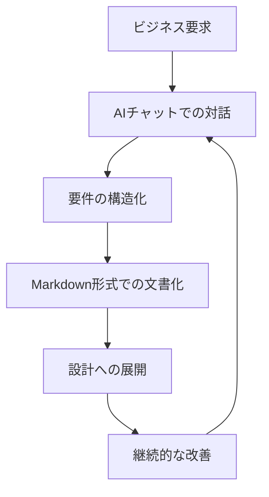
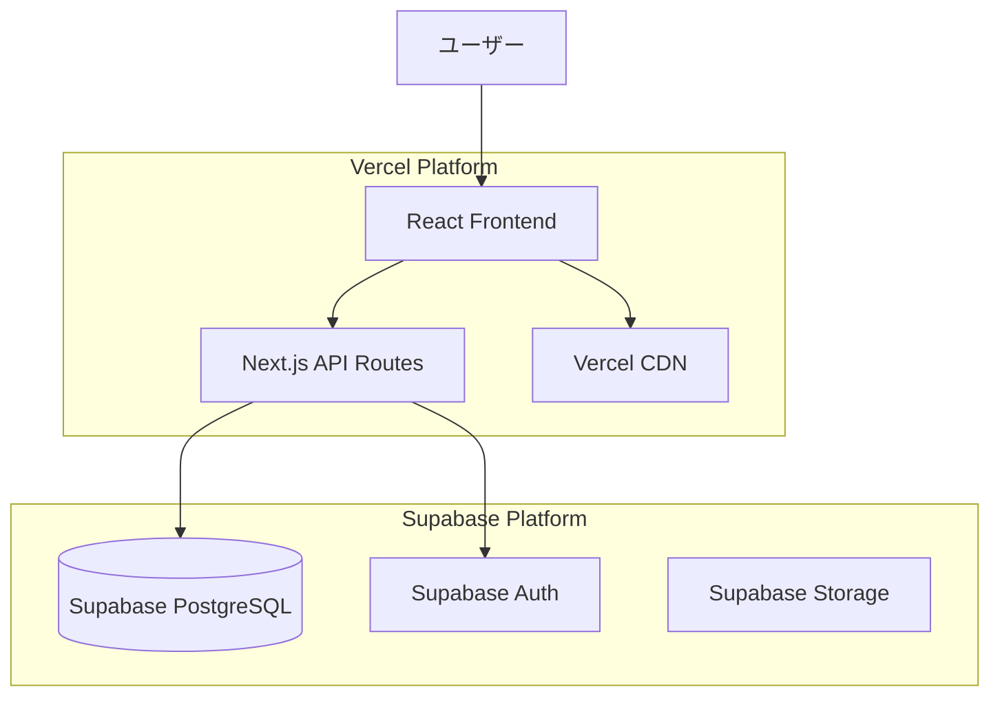
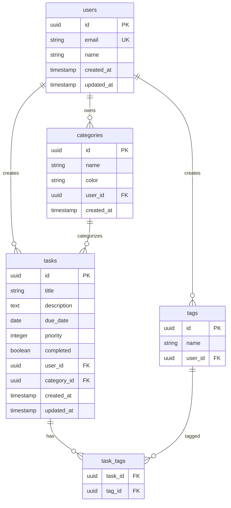

# AI駆動要件定義

## 概要
AI駆動開発の核となる要件定義と設計手法を学習します。「Text is KING」の原則に基づき、AIが読み込みやすく人間にも可読性の高いMarkdown形式での文書化手法を中心に、効率的な要件定義プロセスを習得します。

## 学習目標
- 要件定義で決めるべき項目を完全に理解する
- AIへの効果的な情報提供方法を習得する
- `requirements.yaml`の作成方法を学ぶ
- Cursorエージェントを使った詳細設計と開発フローを確立する
- プロジェクトの初期設定から公開まで一貫して実行できる知識を身につける

## 内容

### 1. 要件定義の基礎

#### 要件定義の重要性
要件定義は、プロジェクト成功の鍵を握る最重要工程です。

**従来の要件定義の課題：**
- 曖昧な表現による認識齟齬
- 膨大な文書作成コスト
- 変更管理の困難さ
- ステークホルダー間の情報共有の難しさ

**AI駆動要件定義の優位性：**
- AIとの対話による要件の明確化
- 構造化された文書の自動生成
- 継続的な改善とバージョン管理
- 多角的な視点からの要件検証

#### AI駆動開発における要件定義の特徴



**特徴：**
1. **対話型アプローチ**: AIとの対話を通じた要件の深掘り
2. **構造化文書**: 人間とAIの両方が読みやすい形式での要件管理
3. **自動化**: 設計書やコードの自動生成
4. **継続的改善**: フィードバックループによる品質向上

### 2. Markdownとは何か？

#### Markdownの基本概念
Markdownは、プレーンテキストで書かれた文書を構造化された文書に変換するための軽量マークアップ言語です。

**Markdownの特徴：**
- **シンプルな記法**: 覚えやすく、書きやすい
- **可読性**: プレーンテキストでも読みやすい
- **汎用性**: 多くのプラットフォームでサポート
- **変換性**: HTML、PDF等への変換が容易
- **バージョン管理**: Gitとの相性が良い

#### Markdownの基本記法

**見出し：**
```markdown
# 見出し1（最大）
## 見出し2
### 見出し3
#### 見出し4
##### 見出し5
###### 見出し6（最小）
```

**テキスト装飾：**
```markdown
**太字**
*斜体*
~~取り消し線~~
`インラインコード`
```

**リスト：**
```markdown
# 順序なしリスト
- 項目1
- 項目2
  - サブ項目1
  - サブ項目2

# 順序ありリスト
1. 項目1
2. 項目2
   1. サブ項目1
   2. サブ項目2
```

**リンクと画像：**
```markdown
[リンクテキスト](URL)

```

**表：**
```markdown
| 項目1 | 項目2 | 項目3 |
|-------|-------|-------|
| 値1   | 値2   | 値3   |
| 値4   | 値5   | 値6   |
```

**コードブロック：**
````markdown
```javascript
function hello() {
    console.log("Hello, World!");
}
```
````

**引用：**
```markdown
> これは引用文です。
> 複数行にわたって
> 引用することができます。
```

#### ファイル形式（.md）について

**Markdownファイルの特徴：**
- **拡張子**: `.md` または `.markdown`
- **エンコーディング**: UTF-8推奨
- **改行**: LF（Unix形式）推奨
- **ファイルサイズ**: 軽量（プレーンテキスト）

**ファイル命名規則の例：**
```
requirements.md
user-stories.md
api-specification.md
database-design.md
project-overview.md
```

### 3. NotionとMarkdownの違い

#### Notionの特徴
**メリット：**
- リアルタイム共同編集
- 豊富なブロック要素（データベース、カレンダー等）
- 視覚的な編集インターフェース
- テンプレート機能

**デメリット：**
- プラットフォーム依存
- エクスポート時の制限
- バージョン管理の困難さ
- オフライン作業の制限

#### Markdownの特徴
**メリット：**
- プラットフォーム非依存
- Gitによるバージョン管理
- AIとの高い親和性
- 軽量で高速
- 長期保存性

**デメリット：**
- 学習コストが必要
- 視覚的編集機能の制限
- リアルタイム共同編集の制限

#### 使い分けの指針

**Notionを使う場面：**
- チーム内での情報共有
- プロジェクト管理
- ブレインストーミング
- 非技術者との協働

**Markdownを使う場面：**
- 技術文書の作成
- 要件定義書
- API仕様書
- コードドキュメント
- AIとの協働作業

### 4. なぜMarkdownが推奨されるのか

#### "Text is KING" の原則
テキストを制する者はLLMを制する。この原則に基づき、Markdownが推奨される理由を説明します。

**1. AIとの親和性**
```markdown
# 機能要件

## ユーザー管理
- ユーザー登録
- ログイン/ログアウト
- プロフィール編集

## タスク管理
- タスク作成
- タスク編集
- タスク削除
- タスク完了マーク
```

このような構造化されたテキストは、AIが理解しやすく、処理しやすい形式です。

**2. バージョン管理との親和性**
```bash
git add requirements.md
git commit -m "Add user authentication requirements"
git push origin feature/requirements
```

Markdownファイルは、Gitによるバージョン管理が容易で、変更履歴の追跡が可能です。

**3. 可搬性と持続性**
- どのエディタでも編集可能
- 特定のプラットフォームに依存しない
- 10年後でも読める形式
- 軽量で高速

**4. 自動化との親和性**
```bash
# Markdownから他の形式への変換
pandoc requirements.md -o requirements.pdf
pandoc requirements.md -o requirements.html
```

---

## 第2部：実践的要件定義プロセス

理論を学んだところで、いよいよ実践です。この章では、AIとの対話を通じて、アイデアを具体的な要件定義書に落とし込み、開発の準備を整えるまでの一連のプロセスをハンズオン形式で学びます。

### 5. 要件定義チェックリスト（完全版）

まず、何を決めなければならないのかを網羅したチェックリストを使って、思考を整理します。AIに指示を出す前に、これらの項目を自分なりに埋めてみることが、プロジェクト成功の第一歩です。

#### 5.1 プロジェクト基本情報
```yaml
プロジェクト基本情報:
  プロジェクト名:
    - [ ] 英語名（例: twitter-clone）
    - [ ] 日本語名（例: SNSアプリ）
  プロジェクト概要:
    - [ ] 一言説明（例: Twitter/X風のSNSアプリケーション）
    - [ ] 詳細説明（3-5文程度）
  プロジェクトタイプ:
    - [ ] Webアプリケーション
    - [ ] モバイル対応の有無
  想定ユーザー:
    - [ ] メインターゲット（例: 20-30代の個人）
```

#### 5.2 機能要件
```yaml
必須機能:
  認証機能:
    - [ ] ログイン方法（メール/パスワード、ソーシャルログイン等）
    - [ ] 新規登録フロー
  コア機能（例：SNSの場合）:
    - [ ] 投稿機能（作成、編集、削除）
    - [ ] タイムライン表示
  データ管理（CRUD操作）:
    - [ ] Create - 何を作成できるか
    - [ ] Read - 何を表示するか
    - [ ] Update - 何を編集できるか
    - [ ] Delete - 何を削除できるか

オプション機能:
  - [ ] 検索機能
  - [ ] 多言語対応
  - [ ] ダークモード
```

#### 5.3 非機能要件
```yaml
パフォーマンス要件:
  - [ ] ページ読み込み時間（例: 3秒以内）
セキュリティ要件:
  - [ ] 個人情報の扱い（暗号化など）
デザイン要件:
  - [ ] デザインの方向性（モダン、ミニマルなど）
  - [ ] 参考にしたいサービス（URL付き）
```

#### 5.4 技術要件
```yaml
技術スタック:
  フロントエンド:
    - [ ] フレームワーク: Next.js 14（App Router）
    - [ ] 言語: TypeScript
    - [ ] スタイリング: Tailwind CSS
  バックエンド/データベース:
    - [ ] Supabase（PostgreSQL）
  認証:
    - [ ] Clerk または Supabase Auth
  ホスティング:
    - [ ] Vercel
```

### 6. AIとの対話による要件定義

チェックリストが埋まったら、次はいよいよAIとの対話です。以下のテンプレートを使って、AIにあなたのプロジェクトの概要を伝え、要件を整理してもらいましょう。

#### 6.1 AIへの初期プロンプト

**プロンプトテンプレート:**
```
あなたは最高の開発エンジニアです。
以下の要件でWebアプリケーションを開発したいと考えています。
この要件を基に、より詳細な仕様を定義するための質問をしてください。
また、不足している情報や、考慮すべき点があれば指摘してください。

## プロジェクト概要
- 名前: [プロジェクト名]
- 説明: [詳細説明]
- 目的: [何を解決したいか]
- ターゲットユーザー: [誰が使うか]

## 主要機能
1. [機能1の説明]
2. [機能2の説明]
3. ...

## 技術的な希望
- できるだけシンプルに作りたい
- 無料または低コストで運用したい
- AIでコード生成しやすい構成にしたい
```

#### 6.2 対話による詳細化

この対話を通じて、AIはあなたが見落としていた点（例：「パスワードリセット機能は必要ですか？」「画像アップロードの容量制限はどうしますか？」など）を指摘し、要件定義の解像度を飛躍的に高めてくれます。

### 7. `requirements.yaml`の生成

AIとの対話で要件が固まったら、最終的な成果物として `requirements.yaml` ファイルを作成します。これは、プロジェクトの「憲法」とも言えるファイルで、以降の設計・開発フェーズにおける全ての判断基準となります。

**プロンプト:**
```
これまでの対話を基に、`requirements.yaml`ファイルを作成してください。
Cursor Agentが読み込んで、そのまま開発を開始できるレベルの詳細度で、
以下の項目をすべて含めてください。

- プロジェクト基本情報
- 機能要件（詳細）
- 非機能要件
- 技術スタック
- データベース設計（概要）
- API設計（概要）
```

このステップを丁寧に行うことで、後の工程での手戻りを劇的に減らし、開発の成功確率を最大化することができます。

#### プロジェクト基本情報の記述

```markdown
# プロジェクト名: タスク管理アプリ

## 概要
個人の生産性向上を支援するWebベースのタスク管理アプリケーション

## プロジェクト情報
- **バージョン**: 1.0.0
- **開始日**: 2025年1月1日
- **完了予定日**: 2025年3月31日
- **開発者**: 1-2名

## ステークホルダー
| 役割 | 名前 | 連絡先 | 責任範囲 |
|------|------|--------|----------|
| プロダクトオーナー | 山田花子 | yamada@company.com | 要件定義・受入テスト |
| 開発者 | 佐藤次郎 | sato@company.com | 設計・開発・テスト |
```

#### 機能要件の記述

```markdown
## 機能要件

### 1. ユーザー管理

#### 1.1 ユーザー登録
**概要**: 新規ユーザーがアカウントを作成する機能

**受入条件**:
- [ ] メールアドレスとパスワードで登録できる
- [ ] メールアドレスの形式検証が行われる
- [ ] パスワードは8文字以上、英数字を含む
- [ ] 重複メールアドレスの場合はエラーメッセージを表示
- [ ] 登録完了後、確認メールが送信される

**画面遷移**:
```
登録画面 → 確認画面 → 完了画面 → ログイン画面
```

#### 1.2 ログイン
**概要**: 登録済みユーザーがシステムにアクセスする機能

**受入条件**:
- [ ] メールアドレスとパスワードで認証
- [ ] ログイン状態を7日間保持
- [ ] 認証失敗時は適切なエラーメッセージを表示
- [ ] パスワードリセット機能を提供

### 2. タスク管理

#### 2.1 タスク作成
**概要**: 新しいタスクを作成する機能

**入力項目**:
- **タスク名** (必須, 100文字以内)
- **説明** (任意, 500文字以内)
- **期限** (任意)
- **優先度** (高/中/低, デフォルト: 中)
- **カテゴリ** (任意)

**受入条件**:
- [ ] 必須項目が未入力の場合はエラーメッセージを表示
- [ ] 作成後、タスク一覧に表示される
- [ ] 作成日時が自動で記録される
```

#### 非機能要件の記述

```markdown
## 非機能要件

### パフォーマンス
- **応答時間**: 2秒以内
- **同時接続数**: 100人
- **可用性**: 99.9%

### セキュリティ
- **認証方式**: JWT認証
- **通信暗号化**: HTTPS必須
- **パスワードポリシー**: 8文字以上、英数字含む
- **セッション管理**: 7日間の自動ログアウト

### 互換性
- **対応ブラウザ**:
  - Chrome 最新版
  - Firefox 最新版
  - Safari 最新版
  - Edge 最新版
- **レスポンシブ対応**: 必須
- **アクセシビリティ**: WCAG 2.1 AA準拠

### 技術要件
- **フロントエンド**: React 18 + TypeScript
- **バックエンド**: Next.js API Routes
- **データベース**: PostgreSQL (Supabase)
- **ホスティング**: Vercel
- **認証**: Supabase Auth
```

### 6. フォルダ構成とファイル管理

#### 推奨フォルダ構成

```
project-name/
├── docs/
│   ├── requirements/
│   │   ├── README.md                 # 要件定義の概要
│   │   ├── business-requirements.md  # ビジネス要件
│   │   ├── functional-requirements.md # 機能要件
│   │   ├── non-functional-requirements.md # 非機能要件
│   │   └── user-stories.md          # ユーザーストーリー
│   ├── design/
│   │   ├── system-architecture.md   # システム構成
│   │   ├── database-design.md       # データベース設計
│   │   ├── api-specification.md     # API仕様
│   │   └── ui-design.md            # UI設計
│   ├── project/
│   │   ├── project-plan.md          # プロジェクト計画
│   │   ├── risk-management.md       # リスク管理
│   │   └── quality-assurance.md     # 品質保証
│   └── meeting-notes/
│       ├── 2025-01-15-kickoff.md
│       └── 2025-01-22-review.md
├── src/
└── README.md
```

#### ファイル管理のベストプラクティス

**1. ファイルヘッダーの統一**
```markdown
---
title: "機能要件定義書"
version: "1.2.0"
last_updated: "2025-01-15"
author: "佐藤次郎"
reviewers: ["山田花子", "田中三郎"]
status: "approved"
---

# 機能要件定義書

## 変更履歴
| バージョン | 日付 | 変更者 | 変更内容 |
|------------|------|--------|----------|
| 1.2.0 | 2025-01-15 | 佐藤次郎 | タスク優先度機能を追加 |
| 1.1.0 | 2025-01-10 | 佐藤次郎 | 非機能要件を詳細化 |
| 1.0.0 | 2025-01-05 | 佐藤次郎 | 初版作成 |
```

**2. 相互参照の活用**
```markdown
詳細は[データベース設計書](../design/database-design.md)を参照してください。

関連する[ユーザーストーリー](./user-stories.md#ユーザー登録)も確認してください。
```

### 7. AIチャットを活用した要件定義

#### 効果的なAIチャット活用手法

**段階的アプローチ：**

**ステップ1: 基本要件の洗い出し**
```
プロンプト例:
「個人向けタスク管理Webアプリケーションを開発します。
以下の観点から必要な機能要件をMarkdown形式で洗い出してください：
- ユーザー管理
- タスク管理
- データ管理
- ユーザーインターフェース

各機能について、概要と受入条件を含めてください。」
```

**ステップ2: 詳細機能の深掘り**
```
プロンプト例:
「タスク管理機能について、以下の詳細をMarkdown形式で検討してください：
- タスクの属性（名前、説明、期限、優先度等）
- タスクの操作（作成、編集、削除、完了等）
- タスクの表示方法（一覧、検索、フィルタ等）
- ユーザビリティの考慮点

表形式や箇条書きを使って整理してください。」
```

**ステップ3: 非機能要件の検討**
```
プロンプト例:
「上記機能要件に対して、以下の非機能要件をMarkdown形式で検討してください：
- パフォーマンス要件
- セキュリティ要件
- 可用性要件
- 拡張性要件

個人向けアプリケーションという特性を考慮し、
表形式で整理してください。」
```

#### 機能要件の洗い出し

**AIとの対話例：**

**ユーザー：**
「ECサイトの要件定義をMarkdown形式で作成したいです。書籍を扱う中小規模のサイトです。」

**AI回答例：**
```markdown
# 書籍ECサイト要件定義

## ビジネス要件
- **ドメイン**: 書籍販売
- **規模**: 中小規模（月間1万PV想定）
- **対象ユーザー**: 一般消費者、書籍愛好家、学生・研究者

## 主要機能

### 1. 商品管理
#### 1.1 書籍カタログ
- [ ] 書籍情報の表示（タイトル、著者、価格、在庫等）
- [ ] カテゴリ別分類（文学、技術書、ビジネス等）
- [ ] 検索・絞り込み機能
- [ ] 書籍詳細ページ

#### 1.2 在庫管理
- [ ] リアルタイム在庫表示
- [ ] 在庫切れ通知
- [ ] 入荷予定表示

### 2. ユーザー体験
#### 2.1 検索・発見
- [ ] キーワード検索
- [ ] カテゴリ別ブラウジング
- [ ] おすすめ機能
- [ ] レビュー・評価システム

### 3. 取引機能
#### 3.1 購入プロセス
- [ ] ショッピングカート
- [ ] 決済処理（クレジットカード、代引き等）
- [ ] 注文確認・履歴
- [ ] 配送状況追跡
```

### 8. 技術スタックの選定

#### AIを活用した技術選定

**技術選定のプロンプト例：**
```
「以下の要件に最適な技術スタックをMarkdown形式で提案してください：

## プロジェクト要件
- タスク管理Webアプリケーション
- 個人向け（同時接続数: 〜100人）
- 開発期間: 3ヶ月
- 開発者: 1-2名（フロントエンド経験あり）
- 予算: 低コスト重視

## 考慮事項
- 学習コストの低さ
- 開発速度
- 運用コスト
- 将来の拡張性

表形式で比較検討し、推奨理由も含めてください。」
```

**AI推奨技術スタック例：**
```markdown
# 技術スタック選定

## 推奨構成

| 分野 | 技術 | 理由 |
|------|------|------|
| フロントエンド | React 18 + TypeScript | 学習リソース豊富、型安全性 |
| スタイリング | Tailwind CSS | 高速開発、一貫性 |
| 状態管理 | Zustand | 軽量、学習コスト低 |
| バックエンド | Next.js API Routes | フルスタック開発、Vercel最適化 |
| データベース | Supabase (PostgreSQL) | 無料枠、認証機能内蔵 |
| 認証 | Supabase Auth | 設定簡単、セキュア |
| ホスティング | Vercel | 無料枠、自動デプロイ |
| 開発環境 | Cursor | AI支援、高速開発 |

## コスト分析
- **開発コスト**: 無料（オープンソース）
- **運用コスト**: 月額0円〜（無料枠内）
- **学習コスト**: 低（既存React経験活用）

## 拡張性
- ユーザー数増加時: Vercel Pro、Supabase Proへアップグレード
- 機能追加時: Next.jsエコシステム活用
- チーム拡大時: TypeScriptによる型安全性でコラボレーション向上
```

### 9. システム構成図とディレクトリ設計

#### システム構成図の作成

**AIプロンプト例：**
```
「上記技術スタックを使用したタスク管理アプリの
システム構成図をMermaid記法で作成してください。
以下の要素を含めてください：
- ユーザー
- フロントエンド
- バックエンド
- データベース
- 外部サービス

Markdown形式で説明も含めてください。」
```

**生成される構成図：**
```markdown
# システム構成

## 構成図


## 構成要素の説明

### フロントエンド
- **React 18**: ユーザーインターフェース
- **TypeScript**: 型安全性の確保
- **Tailwind CSS**: スタイリング

### バックエンド
- **Next.js API Routes**: サーバーサイドロジック
- **Supabase Client**: データベース接続

### データベース
- **PostgreSQL**: メインデータストア
- **Supabase Auth**: ユーザー認証
- **Supabase Storage**: ファイルストレージ

### インフラ
- **Vercel**: ホスティング・CDN
- **GitHub**: ソースコード管理
```

#### ディレクトリ設計

**AIによるディレクトリ構成提案：**
```markdown
# ディレクトリ構成

## プロジェクト構造
```
task-manager/
├── docs/                    # ドキュメント
│   ├── requirements/        # 要件定義
│   ├── design/             # 設計書
│   └── api/                # API仕様
├── public/                 # 静的ファイル
│   ├── favicon.ico
│   └── images/
├── src/                    # ソースコード
│   ├── components/         # Reactコンポーネント
│   │   ├── ui/            # 再利用可能なUIコンポーネント
│   │   ├── forms/         # フォーム関連コンポーネント
│   │   └── layout/        # レイアウトコンポーネント
│   ├── pages/             # Next.jsページ
│   │   ├── api/           # API Routes
│   │   ├── auth/          # 認証関連ページ
│   │   └── dashboard/     # ダッシュボード
│   ├── hooks/             # カスタムフック
│   ├── lib/               # ユーティリティ関数
│   ├── store/             # 状態管理
│   ├── types/             # TypeScript型定義
│   └── styles/            # スタイル定義
├── tests/                 # テストファイル
├── .env.local            # 環境変数
├── package.json          # 依存関係
└── README.md             # プロジェクト説明
```

## ディレクトリ設計の原則

### 1. 関心の分離
- **components/**: UI関連のみ
- **lib/**: ビジネスロジック
- **types/**: 型定義

### 2. 再利用性
- **ui/**: 汎用UIコンポーネント
- **hooks/**: カスタムフック

### 3. 保守性
- **明確な命名規則**
- **適切な階層構造**
- **README.mdによる説明**
```

### 10. データベース設計

#### AIを活用したDB設計

**データベース設計プロンプト：**
```
「タスク管理アプリのデータベース設計をMarkdown形式で行ってください。
以下のエンティティを考慮してください：
- ユーザー
- タスク
- カテゴリ
- タグ

PostgreSQLを使用し、適切なリレーションシップを設定してください。
テーブル定義とER図をMermaid記法で含めてください。」
```

**生成されるDB設計：**
```markdown
# データベース設計

## ER図


## テーブル定義

### users（ユーザー）
| カラム名 | 型 | 制約 | 説明 |
|----------|----|----- |------|
| id | UUID | PRIMARY KEY | ユーザーID |
| email | VARCHAR(255) | UNIQUE NOT NULL | メールアドレス |
| name | VARCHAR(100) | NOT NULL | ユーザー名 |
| created_at | TIMESTAMP | DEFAULT NOW() | 作成日時 |
| updated_at | TIMESTAMP | DEFAULT NOW() | 更新日時 |

### tasks（タスク）
| カラム名 | 型 | 制約 | 説明 |
|----------|----|----- |------|
| id | UUID | PRIMARY KEY | タスクID |
| title | VARCHAR(200) | NOT NULL | タスク名 |
| description | TEXT | | 説明 |
| due_date | DATE | | 期限 |
| priority | INTEGER | DEFAULT 1 | 優先度（1:低, 2:中, 3:高） |
| completed | BOOLEAN | DEFAULT FALSE | 完了フラグ |
| user_id | UUID | REFERENCES users(id) | ユーザーID |
| category_id | UUID | REFERENCES categories(id) | カテゴリID |
| created_at | TIMESTAMP | DEFAULT NOW() | 作成日時 |
| updated_at | TIMESTAMP | DEFAULT NOW() | 更新日時 |

### categories（カテゴリ）
| カラム名 | 型 | 制約 | 説明 |
|----------|----|----- |------|
| id | UUID | PRIMARY KEY | カテゴリID |
| name | VARCHAR(50) | NOT NULL | カテゴリ名 |
| color | VARCHAR(7) | | 表示色（HEX） |
| user_id | UUID | REFERENCES users(id) | ユーザーID |
| created_at | TIMESTAMP | DEFAULT NOW() | 作成日時 |

### tags（タグ）
| カラム名 | 型 | 制約 | 説明 |
|----------|----|----- |------|
| id | UUID | PRIMARY KEY | タグID |
| name | VARCHAR(30) | NOT NULL | タグ名 |
| user_id | UUID | REFERENCES users(id) | ユーザーID |

### task_tags（タスク-タグ関連）
| カラム名 | 型 | 制約 | 説明 |
|----------|----|----- |------|
| task_id | UUID | REFERENCES tasks(id) | タスクID |
| tag_id | UUID | REFERENCES tags(id) | タグID |
| | | PRIMARY KEY (task_id, tag_id) | 複合主キー |
```

### 11. 実践演習

#### 演習1: Markdown要件定義書作成
1. 自分のプロジェクトアイデアを選択
2. AIチャットで要件を洗い出し
3. Markdown形式で要件定義書を作成
理

**成果物**:
- `requirements/business-requirements.md`
- `requirements/functional-requirements.md`
- `requirements/non-functional-requirements.md`

#### 演習2: 技術スタック選定
1. プロジェクト要件を整理
2. AIに技術スタック選定を依頼
3. 提案内容を評価・調整
4. 選定理由をMarkdown形式で文書化

**成果物**:
- `design/technology-stack.md`

#### 演習3: システム設計
1. 構成図をAIで作成（Mermaid記法）
2. ディレクトリ構成を設計
3. データベース設計を実施
4. 設計書として統合

**成果物**:
- `design/system-architecture.md`
- `design/database-design.md`

### 12. Markdownエコシステム

#### 推奨ツール

**エディタ**:
- **Cursor**: AI支援付きMarkdown編集
- **Typora**: WYSIWYG Markdownエディタ
- **Obsidian**: ナレッジベース管理
- **VS Code**: 拡張機能豊富

**変換ツール**:
- **Pandoc**: 多形式変換
- **GitBook**: Web公開
- **MkDocs**: ドキュメントサイト生成

**バージョン管理**:
- **Git**: 変更履歴管理
- **GitHub**: 共同編集・公開
- **GitLab**: プライベートリポジトリ

#### Markdownの活用例

**1. API仕様書**
```markdown
# API仕様書

## エンドポイント一覧

### POST /api/tasks
タスクを作成する

**リクエスト**:
```json
{
  "title": "新しいタスク",
  "description": "タスクの説明",
  "due_date": "2025-01-31",
  "priority": 2
}
```

**レスポンス**:
```json
{
  "id": "uuid",
  "title": "新しいタスク",
  "created_at": "2025-01-15T10:00:00Z"
}
```
```

**2. 議事録**
```markdown
# プロジェクト会議 - 2025年1月15日

## 参加者
- 山田花子（PO）
- 佐藤次郎（Dev）
- 田中三郎（QA）

## 議題
### 1. 要件定義の進捗確認
- [x] ユーザー管理機能の要件確定
- [ ] タスク管理機能の詳細検討
- [ ] 非機能要件の洗い出し

### 2. 次回までのアクション
| 担当者 | アクション | 期限 |
|--------|------------|------|
| 佐藤 | データベース設計書作成 | 1/20 |
| 山田 | UI/UXレビュー | 1/22 |
```

**3. 学習ノート**
```markdown
# React学習ノート

## Hooks
### useState
状態管理のためのHook

```javascript
const [count, setCount] = useState(0);
```

**使用例**:
- カウンター
- フォーム入力値
- 表示/非表示の切り替え

### useEffect
副作用処理のためのHook

```javascript
useEffect(() => {
  // 副作用処理
}, [dependencies]);
```

**使用例**:
- API呼び出し
- イベントリスナー登録
- タイマー処理


## 重要ポイント
- **"Text is KING"**: テキストを制する者はLLMを制する
- **Markdownの優位性**: 人間とAIの両方が読みやすい形式
- **バージョン管理**: Gitとの親和性による変更履歴管理
- **可搬性**: プラットフォーム非依存の持続可能な形式
- **AIとの協働**: 構造化されたテキストによる効率的な対話
- **実践的アプローチ**: 理論だけでなく実際の作業を通じた習得

## 次のステップ
AI駆動要件定義の手法を習得したら、次は「Cursor開発環境構築」に進みます。実際の開発作業を効率的に行うための環境構築と、Cursorの高度な機能活用方法を学習します。

---

### 補足
- Markdown記法は慣れが必要ですが、一度覚えると非常に効率的
- AIとの対話は試行錯誤を重ねることで上達
- 要件定義は後の工程に大きく影響するため、時間をかけて丁寧に行うことが重要
- NotionとMarkdownを適切に使い分けることで、効率的な文書管理が可能
- 体系化された情報はAIとの協働において強力な武器となる

---

## 付録：実践のための詳細手順とリファレンス

### A-1. プロジェクト初期設定の詳細手順

#### GitHub First アプローチ（推奨）

1.  **GitHubでリポジトリを作成**:
    - ブラウザでGitHubにアクセスし、新しいリポジトリを作成します。
    - このとき、「Add a README file」や「.gitignore」は**追加しない**でください。

2.  **ローカルでプロジェクトフォルダを作成し、Cursorで開く**:
    ```bash
    mkdir my-awesome-project
    cd my-awesome-project
    cursor .
    ```

3.  **ローカルリポジトリを初期化し、リモートと接続**:
    ```bash
    git init -b main
    git remote add origin https://github.com/[あなたのユーザー名]/[リポジトリ名].git
    ```

4.  **`docs`フォルダと`requirements.yaml`を作成・配置**:
    - `docs`フォルダを作成し、本講義で作成した`requirements.yaml`をその中に配置します。

5.  **最初のコミットとプッシュ**:
    ```bash
    git add .
    git commit -m "Initial commit: Add requirements documentation"
    git push -u origin main
    ```

### A-2. Cursorエージェントへの詳細設計指示

`requirements.yaml`が完成したら、以下のプロンプトを使ってAIに詳細設計を依頼します。

**プロンプトテンプレート:**
```markdown
あなたは最高の開発エンジニアです。@docs/requirements.yaml をベースとしたアプリケーションを開発してください。

私はエンジニアではないので、技術的なことはあなたに基本的な設計や実装も含めて任せます。
このプロジェクトを成功させるために、以下の手順で進めてください。

## 1. プロジェクト構造の作成
まず、以下のディレクトリ構造を作成してください：
/
├── docs/                      # ドキュメント
│   ├── requirements.yaml      # (既存)
│   ├── system_architecture.md # システム設計
│   ├── database_design.md     # DB設計
│   ├── api_specification.md   # API仕様
│   ├── ui_ux_design.md       # UI/UX設計
│   └── ... (その他13の設計書)
├── src/
...

## 2. 詳細設計ドキュメントの作成
/docs ディレクトリに、実装可能なレベルまで詳細なMarkdownファイルを作成してください。

### 2.1 system_architecture.md
- システム全体の構成図（Mermaid形式）
- 各コンポーネントの役割と責任
- ...

### 2.2 database_design.md
- ER図（Mermaid形式）
- 各テーブルの詳細定義
- ...

### 2.3 api_specification.md
- RESTful API設計原則
- 全エンドポイントの一覧と詳細
- 認証・認可の仕組み

### 2.4 ui_ux_design.md
- 画面遷移図（Mermaid形式）
- 各画面のワイヤーフレームとインタラクション
- デザインシステム（カラー、タイポグラフィ等）

### 2.5 component_design.md
- コンポーネント一覧と階層図
- 各コンポーネントのProps定義と状態管理

### 2.6 state_management.md
- グローバル状態とローカル状態の設計
- 状態管理ライブラリの選定理由と使用方針

### 2.7 routing_design.md
- ルート構造の設計
- 認証保護ルートとリダイレクト戦略

### 2.8 security_design.md
- 認証フロー詳細
- XSS, CSRF等の脆弱性対策
- 環境変数管理

### 2.9 error_handling.md
- エラーバウンダリー設計
- ユーザーフレンドリーなエラーメッセージ
- エラーログ設計

### 2.10 performance_plan.md
- パフォーマンス目標値（Core Web Vitals等）
- 画像最適化、キャッシュ戦略

### 2.11 test_plan.md
- テスト戦略（単体、統合、E2E）
- テストカバレッジ目標

### 2.12 deployment_plan.md
- Vercelデプロイ設定
- ビルド・デプロイフロー
- ロールバック手順

### 2.13 development_plan.md
- 開発フェーズ（MVP → v1.0）
- タスク分解（WBS）
- Gitブランチ戦略とコードレビュー方針
```

### A-3. トラブルシューティングガイド

| 問題カテゴリ | 具体的な問題 | 主な解決策 |
|:---|:---|:---|
| **環境構築** | `npm install`失敗 | `node_modules`と`package-lock.json`を削除して再試行。Node.jsのバージョン確認。 |
| **開発** | TypeScriptエラー | 型定義の確認、`tsconfig.json`の設定見直し。 |
| **実行時** | Hydrationエラー | サーバーとクライアントで描画されるHTMLの不一致を確認。`useEffect`を活用。 |
| **デプロイ** | Vercelビルド失敗 | Vercelのビルドログを確認。ローカルでのビルド成功を再確認。環境変数の設定ミスを疑う。 |

### A-4. 頻繁に使うコマンド集

```bash
# 開発関連
npm run dev              # 開発サーバーを起動
npm run build            # プロダクション用にビルド

# Git関連
git add .                # 全ての変更をステージング
git commit -m "メッセージ" # 変更を記録（コミット）
git push                 # リモートに変更をアップロード
git pull                 # リモートから最新の変更を取得
git status               # 現在の変更状況を確認
```