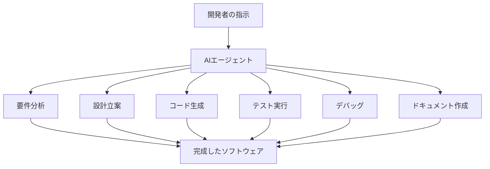

# Cursor開発環境構築

## 概要
AI駆動開発の中核となるCursor開発環境の構築方法を学習します。IDE（統合開発環境）の基本概念から、Cursorの初期設定、効率的なショートカットキー、.cursorrulesによるカスタマイズまでを包括的に習得します。

## 学習目標
- IDE（統合開発環境）の概念と重要性を理解する
- Cursorの初期設定と基本操作を習得する
- 効率的なショートカットキーを覚える
- .cursorrulesによるプロジェクト固有の設定方法を学ぶ
- AIエージェントの可能性を理解する

## 内容

### 1. IDE（統合開発環境）の基礎

#### IDEとは
IDE（Integrated Development Environment）は、ソフトウェア開発に必要な機能を統合した開発環境です。

**IDEの主要機能：**
- **コードエディタ**: シンタックスハイライト、自動補完
- **デバッガ**: ブレークポイント、変数監視
- **ビルドツール**: コンパイル、パッケージング
- **バージョン管理**: Git統合
- **プロジェクト管理**: ファイル管理、検索機能

#### 従来のIDEとAI統合IDEの違い

**従来のIDE（VS Code、IntelliJ等）：**


**AI統合IDE（Cursor等）：**


**比較表：**

| 項目 | 従来のIDE | AI統合IDE（Cursor） |
|------|-----------|---------------------|
| **コード生成** | 手動入力 | AI自動生成 |
| **エラー解決** | 手動調査 | AI支援診断 |
| **リファクタリング** | 手動実施 | AI提案・実行 |
| **ドキュメント** | 手動作成 | AI自動生成 |
| **学習コスト** | 高い | 低い |
| **開発速度** | 標準 | 3-5倍高速 |

#### Cursorの特徴と優位性

**Cursorの主要特徴：**
- **AI First設計**: AIとの協働を前提とした設計
- **自然言語インターフェース**: 日本語での指示が可能
- **コンテキスト理解**: プロジェクト全体を理解した提案
- **リアルタイム支援**: タイピング中のリアルタイム補完
- **VS Code互換**: 既存の拡張機能やショートカットが利用可能

### 2. AIエージェントの可能性

#### AIエージェントとは
AIエージェントは、人間の代わりに複雑なタスクを自律的に実行するAIシステムです。

**開発におけるAIエージェントの役割：**



**AIエージェントの驚きの能力：**

1. **自律的問題解決**
   - エラーの自動検出と修正
   - 最適化の自動提案
   - セキュリティ脆弱性の自動検出

2. **学習と適応**
   - プロジェクトの特性を学習
   - 開発者の好みを記憶
   - チームの開発パターンを理解

3. **創造的提案**
   - 新しいアーキテクチャの提案
   - 効率的なアルゴリズムの生成
   - ユーザビリティの改善案

**実例：AIエージェントによる自動開発**
```
指示: "ECサイトを作って"

AIエージェントの実行内容:
1. 要件定義の自動生成
2. データベース設計
3. API設計
4. フロントエンド実装
5. バックエンド実装
6. テストコード生成
7. デプロイ設定
8. ドキュメント作成

結果: 完全に動作するECサイトが数時間で完成
```

### 3. Cursorの初期設定

#### インストールと基本設定

**1. Cursorのダウンロードとインストール**
```bash
# macOS
brew install --cask cursor

# Windows
# 公式サイトからインストーラーをダウンロード
# https://cursor.sh/
```

**2. アカウント設定とライセンス**
- GitHub/Googleアカウントでサインイン
- Pro プラン（$20/月）への加入推奨
- API使用量の確認

**3. 基本設定の調整**

**設定ファイル（settings.json）の例：**
```json
{
  "editor.fontSize": 14,
  "editor.fontFamily": "'Fira Code', 'Consolas', monospace",
  "editor.fontLigatures": true,
  "editor.tabSize": 2,
  "editor.insertSpaces": true,
  "editor.wordWrap": "on",
  "editor.minimap.enabled": false,
  "editor.lineNumbers": "on",
  "editor.rulers": [80, 120],
  
  "cursor.ai.enabled": true,
  "cursor.ai.model": "gpt-4",
  "cursor.ai.temperature": 0.3,
  "cursor.ai.maxTokens": 2048,
  
  "files.autoSave": "afterDelay",
  "files.autoSaveDelay": 1000,
  "files.trimTrailingWhitespace": true,
  "files.insertFinalNewline": true,
  
  "workbench.colorTheme": "Dark+ (default dark)",
  "workbench.iconTheme": "material-icon-theme",
  "workbench.startupEditor": "newUntitledFile"
}
```

#### 推奨拡張機能

**必須拡張機能：**
```json
{
  "recommendations": [
    "ms-vscode.vscode-typescript-next",
    "bradlc.vscode-tailwindcss",
    "esbenp.prettier-vscode",
    "ms-vscode.vscode-eslint",
    "formulahendry.auto-rename-tag",
    "christian-kohler.path-intellisense",
    "ms-vscode.vscode-json",
    "redhat.vscode-yaml"
  ]
}
```

**各拡張機能の説明：**
- **TypeScript**: TypeScript言語サポート
- **Tailwind CSS**: CSSフレームワークサポート
- **Prettier**: コード自動フォーマット
- **ESLint**: JavaScript/TypeScriptリンター
- **Auto Rename Tag**: HTMLタグの自動リネーム
- **Path Intellisense**: ファイルパスの自動補完

### 4. 効率的なショートカットキー

#### 必須ショートカットキー一覧

**基本操作：**

| 機能 | macOS | Windows/Linux | 説明 |
|------|-------|---------------|------|
| **ファイル操作** |
| 新規ファイル | `Cmd + N` | `Ctrl + N` | 新しいファイルを作成 |
| ファイルを開く | `Cmd + O` | `Ctrl + O` | ファイルを開く |
| 保存 | `Cmd + S` | `Ctrl + S` | ファイルを保存 |
| 全て保存 | `Cmd + Alt + S` | `Ctrl + K S` | 全ファイルを保存 |
| **編集操作** |
| 元に戻す | `Cmd + Z` | `Ctrl + Z` | 操作を元に戻す |
| やり直し | `Cmd + Shift + Z` | `Ctrl + Y` | 操作をやり直す |
| 行をコピー | `Cmd + C` | `Ctrl + C` | 選択行をコピー |
| 行を削除 | `Cmd + Shift + K` | `Ctrl + Shift + K` | 行を削除 |
| 行を移動 | `Alt + ↑/↓` | `Alt + ↑/↓` | 行を上下に移動 |

**AI機能のショートカット：**

| 機能 | macOS | Windows/Linux | 説明 |
|------|-------|---------------|------|
| **AI支援** |
| AI Chat | `Cmd + L` | `Ctrl + L` | AIチャットを開く |
| AI Composer | `Cmd + I` | `Ctrl + I` | AI作曲機能 |
| AI Edit | `Cmd + K` | `Ctrl + K` | 選択範囲をAI編集 |
| AI Generate | `Cmd + Shift + L` | `Ctrl + Shift + L` | AIコード生成 |
| AI Explain | `Cmd + Shift + E` | `Ctrl + Shift + E` | コードの説明を生成 |

**ナビゲーション：**

| 機能 | macOS | Windows/Linux | 説明 |
|------|-------|---------------|------|
| **移動** |
| ファイル検索 | `Cmd + P` | `Ctrl + P` | ファイルをクイック検索 |
| シンボル検索 | `Cmd + Shift + O` | `Ctrl + Shift + O` | 関数・クラス検索 |
| 行に移動 | `Cmd + G` | `Ctrl + G` | 指定行に移動 |
| 定義に移動 | `F12` | `F12` | 定義元に移動 |
| 戻る | `Cmd + -` | `Ctrl + -` | 前の位置に戻る |

#### カスタムショートカットの設定

**keybindings.json の例：**
```json
[
  {
    "key": "cmd+shift+d",
    "command": "editor.action.duplicateSelection",
    "when": "editorTextFocus"
  },
  {
    "key": "cmd+shift+/",
    "command": "editor.action.blockComment",
    "when": "editorTextFocus"
  },
  {
    "key": "cmd+alt+l",
    "command": "cursor.ai.chat",
    "when": "editorTextFocus"
  }
]
```

### 5. .cursorrulesの活用

#### .cursorrulesファイルの概念

`.cursorrulesファイル`は、プロジェクト固有のAI動作ルールを定義するファイルです。

**主な用途：**
- コーディングスタイルの統一
- プロジェクト固有の制約事項
- 使用技術スタックの指定
- 命名規則の定義

#### 基本的な.cursorrulesの作成

**プロジェクトルートに.cursorrulesファイルを作成：**
フロントエンドエンジニア向け

```
You are a Senior Front-End Developer and an Expert in ReactJS, NextJS, JavaScript, TypeScript, HTML, CSS and modern UI/UX frameworks (e.g., TailwindCSS, Shadcn, Radix). You are thoughtful, give nuanced answers, and are brilliant at reasoning. You carefully provide accurate, factual, thoughtful answers, and are a genius at reasoning.


- Follow the user’s requirements carefully & to the letter.
- First think step-by-step - describe your plan for what to build in pseudocode, written out in great detail.
- Confirm, then write code!
- Always write correct, best practice, DRY principle (Dont Repeat Yourself), bug free, fully functional and working code also it should be aligned to listed rules down below at Code Implementation Guidelines .
- Focus on easy and readability code, over being performant.
- Fully implement all requested functionality.
- Leave NO todo’s, placeholders or missing pieces.
- Ensure code is complete! Verify thoroughly finalised.
- Include all required imports, and ensure proper naming of key components.
- Be concise Minimize any other prose.
- If you think there might not be a correct answer, you say so.
- If you do not know the answer, say so, instead of guessing.

### Coding Environment
The user asks questions about the following coding languages:
- ReactJS
- NextJS
- JavaScript
- TypeScript
- TailwindCSS
- HTML
- CSS

### Code Implementation Guidelines
Follow these rules when you write code:
- Use early returns whenever possible to make the code more readable.
- Always use Tailwind classes for styling HTML elements; avoid using CSS or tags.
- Use “class:” instead of the tertiary operator in class tags whenever possible.
- Use descriptive variable and function/const names. Also, event functions should be named with a “handle” prefix, like “handleClick” for onClick and “handleKeyDown” for onKeyDown.
- Implement accessibility features on elements. For example, a tag should have a tabindex=“0”, aria-label, on:click, and on:keydown, and similar attributes.
- Use consts instead of functions, for example, “const toggle = () =>”. Also, define a type if possible.
```

# 泉水の.cursorrulesの例


```markdown
あなたは高度な問題解決能力を持つAIアシスタントです。以下の指示に従って、効率的かつ正確にタスクを遂行してください。

まず、ユーザーから受け取った指示を確認します：
<指示>
{{instructions}}
</指示>

この指示を元に、以下のプロセスに従って作業を進めてください：

---

1. 指示の分析と計画
   <タスク分析>
   - 主要なタスクを簡潔に要約してください。
   - 記載された技術スタックを確認し、その制約内での実装方法を検討してください。  
     **※ 技術スタックに記載のバージョンは変更せず、必要があれば必ず承認を得てください。**
   - 重要な要件と制約を特定してください。
   - 潜在的な課題をリストアップしてください。
   - タスク実行のための具体的なステップを詳細に列挙してください。
   - それらのステップの最適な実行順序を決定してください。
   
   ### 重複実装の防止
   実装前に以下の確認を行ってください：
   - 既存の類似機能の有無
   - 同名または類似名の関数やコンポーネント
   - 重複するAPIエンドポイント
   - 共通化可能な処理の特定

   このセクションは、後続のプロセス全体を導くものなので、時間をかけてでも、十分に詳細かつ包括的な分析を行ってください。
   </タスク分析>

---

2. タスクの実行
   - 特定したステップを一つずつ実行してください。
   - 各ステップの完了後、簡潔に進捗を報告してください。
   - 実装時は以下の点に注意してください：
     - 適切なディレクトリ構造の遵守
     - 命名規則の一貫性維持
     - 共通処理の適切な配置

---

3. 品質管理と問題対応
   - 各タスクの実行結果を迅速に検証してください。
   - エラーや不整合が発生した場合は、以下のプロセスで対応してください：
     a. 問題の切り分けと原因特定（ログ分析、デバッグ情報の確認）
     b. 対策案の作成と実施
     c. 修正後の動作検証
     d. デバッグログの確認と分析
   
   - 検証結果は以下の形式で記録してください：
     a. 検証項目と期待される結果
     b. 実際の結果と差異
     c. 必要な対応策（該当する場合）

  - プロジェクト固有の問題が発生した際には docs/project_notes.mdに再発防止を目的とし対処方法を記録してください。
---

4. 最終確認
   - すべてのタスクが完了したら、成果物全体を評価してください。
   - 当初の指示内容との整合性を確認し、必要に応じて調整を行ってください。
   - 実装した機能に重複がないことを最終確認してください。

---

5. 結果報告
   以下のフォーマットで最終的な結果を報告してください：
   ```markdown
   # 実行結果報告

   ## 概要
   [全体の要約を簡潔に記述]

   ## 実行ステップ
   6. [ステップ1の説明と結果]
   7. [ステップ2の説明と結果]
   ...

   ## 最終成果物
   [成果物の詳細や、該当する場合はリンクなど]

   ## 課題対応（該当する場合）
   - 発生した問題と対応内容
   - 今後の注意点

   ## 注意点・改善提案・再発防止・問題解消方法
   - [気づいた点や改善提案があればdocs/project_notes.mdに追記していきましょう]
   - ## 重要な注意事項

- 不明点がある場合は、作業開始前に必ず確認を取ってください。
- 重要な判断が必要な場合は、その都度報告し、承認を得てください。
- 予期せぬ問題が発生した場合は、即座に報告し、対応策を提案してください。
- **明示的に指示されていない変更は行わないでください。** 必要と思われる変更がある場合は、まず提案として報告し、承認を得てから実施してください。
- **UIの実装にあたってはtailwind.config.ts、global.cssを参照し実装を進めます。
- 参照すべきカラーデザインテーマは ColorThemeDemo.tsx です。
- **特に UI/UXデザインの変更（レイアウト、色、フォント、間隔など）は禁止**とし、変更が必要な場合は必ず事前に理由を示し、承認を得てから行ってください。
- **技術スタックに記載のバージョン（APIやフレームワーク、ライブラリ等）を勝手に変更しないでください。** 変更が必要な場合は、その理由を明確にして承認を得るまでは変更を行わないでください。


## Shortcut Aliases
/ask: ユーザーがポリシー決定の相談を求めています。包括的な分析を行う積極的な回答を提供してください。明確な指示がない場合、相談中には何も実行しないでください。
/plan: 明確かつ徹底的に作業計画を策定し、すべての不一致を確認してください。同意に達するまで実行しないでください。
/debug: バグの根本原因を特定してください。5-7の可能な原因をリストアップし、1-2に絞り込んでください。フィクスを適用する前にログを利用して仮説を検証してください。
/cmt: 与えられたコードの意図を明確にするための適切なコメントとドキュメントを追加してください。既存のコードのフォーマットに従ってください。
/log: 適切なログレベルを考慮し、必要な情報のみを記録してください。ログは簡潔にし、冗長性を避けてください。既存のコードのフォーマットに従ってください。
/session: 本セッションの内容を次のセッションに引き継ごうと思います。これまでのやり取りを詳細に指定したmdファイルに出力してください。現在の課題をmdとしてまとめていきましょう。本mdさえあれば修正、開発に着手出来るようアーキテクチャ設計、モジュール構成、コンポーネント構成、被疑箇所や考察を出力してください。
/output-components:利用しているpage、API、サーバーアクション、コンポーネントを詳細に出力します。
/status: 現在のタスクの状態を出力します。status.mdに出力します。その際に既存のタスクは削除せずにタスクステータスの更新、追加のみ行ってください。
/docs: overview.mdを更新します。既存のoverview.mdのエントリーは削除せずに更新を行ってください。
/test: テストケースの作成と実行計画を提案します。単体テスト、統合テスト、E2Eテストの適切な組み合わせを提案し、テストカバレッジの目標を設定します。
/perf: パフォーマンス最適化の提案を行います。Web Vitalsの改善点、バンドルサイズの最適化、レンダリング効率化などの具体的な施策を提示します。
/security: セキュリティ観点からのコードレビューを実施します。潜在的な脆弱性の特定、認証・認可の確認、データ検証の妥当性などを確認します。
/refactor: コードのリファクタリング提案を行います。DRY原則違反、不適切な依存関係、複雑性の高い部分などを特定し、改善案を提示します。
/type: TypeScriptの型定義の改善提案を行います。より厳密な型付け、ユーティリティ型の活用、型の共通化などを提案します。
/api: APIエンドポイントの設計レビューと改善提案を行います。RESTful設計原則、エラーハンドリング、レスポンス形式の一貫性などを確認します。
/lint: コードスタイルとリンターのルール確認を行います。プロジェクトの規約に沿っているか、一貫性が保たれているかを確認します。
/state: 状態管理の設計レビューと改善提案を行います。Reactのステート管理、グローバルステート、キャッシュ戦略などを確認します。
/a11y: アクセシビリティの観点からのレビューと改善提案を行います。WAI-ARIAの適用、キーボード操作、スクリーンリーダー対応などを確認します。
   ```
   
---


#### チーム開発での.cursorrulesの活用

**チーム共有のベストプラクティス：**

1. **バージョン管理**
   ```bash
   # .cursorrulesをGitで管理
   git add .cursorrules
   git commit -m "Add project coding rules"
   ```

2. **ルールの継承**
   ```yaml
   # 基本ルールを継承
   extends: "../shared/.cursorrules"
   
   # プロジェクト固有のルールを追加
   project_specific:
     api_base_url: "https://api.example.com"
     feature_flags:
       - "dark_mode"
       - "analytics"
   ```

3. **ルールの検証**
   ```yaml
   # ルール違反の検出
   validation:
     on_save: true
     on_commit: true
     auto_fix: true
   ```

### 6. 実践演習

#### 演習1: Cursor環境構築
1. Cursorのインストールと初期設定
2. 推奨拡張機能のインストール
3. 基本設定のカスタマイズ
4. ショートカットキーの練習

#### 演習2: .cursorrulesの作成
1. 新しいプロジェクトの作成
2. プロジェクト用.cursorrulesの作成
3. AI動作の確認とテスト
4. ルールの調整と最適化

#### 演習3: AI機能の活用
1. AI Chatでの質問と回答
2. AI Editでのコード修正
3. AI Generateでのコード生成
4. 効率的な開発フローの確立

## 重要ポイント
- **環境構築の重要性**: 効率的な開発のための基盤
- **ショートカットの習得**: 開発速度の大幅向上
- **.cursorrulesの活用**: プロジェクト品質の統一
- **継続的な最適化**: 使用しながら設定を改善

## 次のステップ
Cursor開発環境の構築が完了したら、次は「AI駆動開発実践」に進みます。実際にv0で作成したUIをCursorに取り込み、AI駆動開発の実践的な手法を学習します。

---

### 補足
- Cursorの機能は頻繁にアップデートされるため、最新情報をチェック
- .cursorrulesは試行錯誤を重ねて最適化することが重要
- チーム開発では事前にルールを合意することが大切