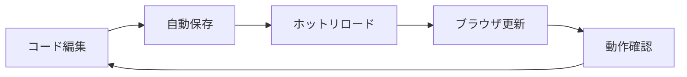

# AI駆動開発実践

## 概要
実際のAI駆動開発プロセスを体験します。第1回の宿題で作成したSNS（Twitter/X風）のUIをCursorに取り込み、AI支援による機能実装、ローカル環境での動作確認まで、実践的な開発ワークフローを習得します。

## 学習目標
- v0で作成したSNSのUIをCursorに取り込む方法を習得する
- Cursor Agentを活用してSNS機能を実装する
- ローカル開発環境でSNSアプリを動作させる
- Twitter/X風SNSの基本機能を段階的に実装する

## 内容

### 1. v0からCursorへの連携

#### v0で作成したSNS UIの確認

**第1回宿題で作成したUIコンポーネント：**
v0で生成されたTwitter/X風のUIコンポーネントを確認します。

```jsx
// v0で生成されたSNSコンポーネント例
import { Button } from "@/components/ui/button"
import { Card, CardContent, CardHeader } from "@/components/ui/card"
import { Avatar, AvatarFallback, AvatarImage } from "@/components/ui/avatar"
import { Textarea } from "@/components/ui/textarea"
import { Heart, MessageCircle, Repeat2, Share } from "lucide-react"

export default function TwitterClone() {
  return (
    <div className="max-w-2xl mx-auto p-4">
      {/* 投稿作成エリア */}
      <Card className="mb-4">
        <CardContent className="pt-6">
          <div className="flex gap-3">
            <Avatar>
              <AvatarImage src="/placeholder.svg" />
              <AvatarFallback>YT</AvatarFallback>
            </Avatar>
            <div className="flex-1">
              <Textarea 
                placeholder="いまどうしてる？" 
                className="resize-none border-none p-0 focus:ring-0"
              />
              <div className="flex justify-between items-center mt-3">
                <div className="flex gap-2">
                  {/* メディアアップロードボタンなど */}
                </div>
                <Button className="rounded-full">ポスト</Button>
              </div>
            </div>
          </div>
        </CardContent>
      </Card>

      {/* タイムライン */}
      <div className="space-y-4">
        <Card>
          <CardContent className="pt-6">
            <div className="flex gap-3">
              <Avatar>
                <AvatarImage src="/placeholder.svg" />
                <AvatarFallback>TH</AvatarFallback>
              </Avatar>
              <div className="flex-1">
                <div className="flex items-center gap-2">
                  <h3 className="font-semibold">田中花子</h3>
                  <span className="text-gray-500">@hanako · 5分前</span>
                </div>
                <p className="mt-2">
                  今日は天気が良いですね！公園でのんびり過ごしています 🌸
                </p>
                {/* アクションボタン */}
                <div className="flex items-center gap-6 mt-3 text-gray-500">
                  <Button variant="ghost" size="sm" className="gap-2 hover:text-blue-500">
                    <MessageCircle className="w-4 h-4" />
                    <span>12</span>
                  </Button>
                  <Button variant="ghost" size="sm" className="gap-2 hover:text-green-500">
                    <Repeat2 className="w-4 h-4" />
                    <span>5</span>
                  </Button>
                  <Button variant="ghost" size="sm" className="gap-2 hover:text-red-500">
                    <Heart className="w-4 h-4" />
                    <span>28</span>
                  </Button>
                  <Button variant="ghost" size="sm">
                    <Share className="w-4 h-4" />
                  </Button>
                </div>
              </div>
            </div>
          </CardContent>
        </Card>
      </div>
    </div>
  )
}
```

#### CursorへのSNSコード取り込み

**ステップ1: プロジェクトの初期化**
```bash
# Next.jsプロジェクトの作成（SNS用）
npx create-next-app@latest twitter-clone --typescript --tailwind --eslint --app

# プロジェクトディレクトリに移動
cd twitter-clone

# Cursorでプロジェクトを開く
cursor .
```

**ステップ2: v0のSNSコードを取り込み**

1. **プロジェクト構造の作成**
   ```bash
   # SNSアプリ用のディレクトリ構造
   mkdir -p src/components/ui
   mkdir -p src/components/tweet
   mkdir -p src/components/layout
   mkdir -p src/types
   mkdir -p src/lib
   ```

2. **v0コードの統合と機能追加**
   ```typescript
   // src/types/tweet.ts
   export interface User {
     id: string
     username: string
     displayName: string
     avatarUrl?: string
   }

   export interface Tweet {
     id: string
     content: string
     author: User
     createdAt: Date
     likes: number
     retweets: number
     replies: number
     isLiked?: boolean
     isRetweeted?: boolean
   }

   // src/components/tweet/TweetComposer.tsx
   'use client'

   import { useState } from 'react'
   import { Button } from "@/components/ui/button"
   import { Card, CardContent } from "@/components/ui/card"
   import { Avatar, AvatarFallback, AvatarImage } from "@/components/ui/avatar"
   import { Textarea } from "@/components/ui/textarea"

   interface TweetComposerProps {
     onSubmit: (content: string) => void
   }

   export function TweetComposer({ onSubmit }: TweetComposerProps) {
     const [content, setContent] = useState('')
     const maxLength = 280

     const handleSubmit = () => {
       if (content.trim() && content.length <= maxLength) {
         onSubmit(content)
         setContent('')
       }
     }

     return (
       <Card className="mb-4">
         <CardContent className="pt-6">
           <div className="flex gap-3">
             <Avatar>
               <AvatarImage src="/placeholder.svg" />
               <AvatarFallback>YO</AvatarFallback>
             </Avatar>
             <div className="flex-1">
               <Textarea 
                 value={content}
                 onChange={(e) => setContent(e.target.value)}
                 placeholder="いまどうしてる？" 
                 className="resize-none border-none p-0 focus:ring-0 text-lg"
                 rows={3}
               />
               <div className="flex justify-between items-center mt-3">
                 <span className={`text-sm ${content.length > maxLength ? 'text-red-500' : 'text-gray-500'}`}>
                   {content.length} / {maxLength}
                 </span>
                 <Button 
                   onClick={handleSubmit}
                   disabled={!content.trim() || content.length > maxLength}
                   className="rounded-full"
                 >
                   ポスト
                 </Button>
               </div>
             </div>
           </div>
         </CardContent>
       </Card>
     )
   }
   ```

**ステップ3: 必要なUIコンポーネントの追加**

Cursorで以下のプロンプトを使用：
```
shadcn/uiのButton、Card、Avatar、Textarea、Separator、
Dialog、DropdownMenuコンポーネントをこのプロジェクトに追加してください。
lucide-reactのアイコンも使用します。
```

### 2. AI駆動でSNS機能を実装

#### Cursor Agentでの段階的実装

**段階1: 基本的なツイート表示**

```
プロンプト例:
「TweetItemコンポーネントを作成してください。
以下の機能を含めてください：

1. ツイートの表示（ユーザー名、@ハンドル、投稿時間、本文）
2. いいね、リツイート、返信、共有ボタン
3. いいねとリツイートのカウント表示
4. クリック時のアニメーション
5. TypeScriptで型安全に実装

Twitter/Xのデザインを参考にしてください。」
```

**Cursor Agentが生成するコード例：**
```typescript
// src/components/tweet/TweetItem.tsx
'use client'

import { useState } from 'react'
import { Card, CardContent } from "@/components/ui/card"
import { Avatar, AvatarFallback, AvatarImage } from "@/components/ui/avatar"
import { Button } from "@/components/ui/button"
import { Heart, MessageCircle, Repeat2, Share, MoreHorizontal } from "lucide-react"
import { Tweet } from '@/types/tweet'
import { formatDistanceToNow } from 'date-fns'
import { ja } from 'date-fns/locale'

interface TweetItemProps {
  tweet: Tweet
  onLike: (tweetId: string) => void
  onRetweet: (tweetId: string) => void
  onReply: (tweetId: string) => void
}

export function TweetItem({ tweet, onLike, onRetweet, onReply }: TweetItemProps) {
  const [isLiked, setIsLiked] = useState(tweet.isLiked || false)
  const [isRetweeted, setIsRetweeted] = useState(tweet.isRetweeted || false)
  const [likes, setLikes] = useState(tweet.likes)
  const [retweets, setRetweets] = useState(tweet.retweets)

  const handleLike = () => {
    if (isLiked) {
      setLikes(likes - 1)
    } else {
      setLikes(likes + 1)
    }
    setIsLiked(!isLiked)
    onLike(tweet.id)
  }

  const handleRetweet = () => {
    if (isRetweeted) {
      setRetweets(retweets - 1)
    } else {
      setRetweets(retweets + 1)
    }
    setIsRetweeted(!isRetweeted)
    onRetweet(tweet.id)
  }

  return (
    <Card className="border-x-0 border-t-0 rounded-none hover:bg-gray-50 transition-colors cursor-pointer">
      <CardContent className="pt-3 pb-2">
        <div className="flex gap-3">
          <Avatar>
            <AvatarImage src={tweet.author.avatarUrl} />
            <AvatarFallback>
              {tweet.author.displayName.slice(0, 2).toUpperCase()}
            </AvatarFallback>
          </Avatar>
          
          <div className="flex-1 min-w-0">
            <div className="flex items-start justify-between">
              <div className="flex items-center gap-1 flex-wrap">
                <span className="font-semibold">{tweet.author.displayName}</span>
                <span className="text-gray-500">@{tweet.author.username}</span>
                <span className="text-gray-500">·</span>
                <span className="text-gray-500">
                  {formatDistanceToNow(tweet.createdAt, { 
                    addSuffix: true, 
                    locale: ja 
                  })}
                </span>
              </div>
              <Button variant="ghost" size="icon" className="h-8 w-8">
                <MoreHorizontal className="h-4 w-4" />
              </Button>
            </div>
            
            <p className="mt-2 text-[15px] leading-normal break-words">
              {tweet.content}
            </p>
            
            <div className="flex items-center gap-4 mt-3 -ml-2">
              <Button 
                variant="ghost" 
                size="sm" 
                className="gap-2 text-gray-500 hover:text-blue-500 hover:bg-blue-50"
                onClick={() => onReply(tweet.id)}
              >
                <MessageCircle className="w-4 h-4" />
                {tweet.replies > 0 && <span className="text-xs">{tweet.replies}</span>}
              </Button>
              
              <Button 
                variant="ghost" 
                size="sm" 
                className={`gap-2 hover:bg-green-50 ${
                  isRetweeted ? 'text-green-500' : 'text-gray-500 hover:text-green-500'
                }`}
                onClick={handleRetweet}
              >
                <Repeat2 className="w-4 h-4" />
                {retweets > 0 && <span className="text-xs">{retweets}</span>}
              </Button>
              
              <Button 
                variant="ghost" 
                size="sm" 
                className={`gap-2 hover:bg-red-50 ${
                  isLiked ? 'text-red-500' : 'text-gray-500 hover:text-red-500'
                }`}
                onClick={handleLike}
              >
                <Heart className={`w-4 h-4 ${isLiked ? 'fill-current' : ''}`} />
                {likes > 0 && <span className="text-xs">{likes}</span>}
              </Button>
              
              <Button 
                variant="ghost" 
                size="sm" 
                className="text-gray-500 hover:text-blue-500 hover:bg-blue-50"
              >
                <Share className="w-4 h-4" />
              </Button>
            </div>
          </div>
        </div>
      </CardContent>
    </Card>
  )
}
```

**段階2: タイムラインの実装**

```
プロンプト例:
「Timelineコンポーネントを作成してください。
以下の要件を満たしてください：

1. TweetComposerとTweetItemを組み合わせる
2. ツイートの配列を管理（useState）
3. 新規投稿の追加機能
4. いいね、リツイート機能の実装
5. 投稿は新しい順に表示
6. ローディング状態の表示

モックデータも含めて実装してください。」
```

#### エラー解決とデバッグ支援

**よくあるエラーとAI支援による解決：**

**エラー例1: 日付フォーマットエラー**
```
Error: date-fns not found
```

**Cursor Agentへの指示：**
```
「date-fnsのインストールと、日本語での相対時間表示
（○分前、○時間前など）を実装してください。」
```

**エラー例2: 状態管理の問題**
```
Error: Too many re-renders
```

**Cursor Agentへの指示：**
```
「無限レンダリングを防ぐため、useCallbackとuseMemoを
適切に使用してパフォーマンスを最適化してください。」
```

### 3. ローカル環境でのSNS動作確認

#### 開発サーバーでのSNSアプリ起動

**起動手順：**
```bash
# 依存関係のインストール
npm install

# 開発サーバーの起動
npm run dev
```

**確認すべき機能：**
1. ツイートの投稿
2. いいね機能の動作
3. リツイート機能の動作
4. 文字数カウント
5. UIのレスポンシブ対応

#### ホットリロードを活用した開発

**リアルタイム開発の流れ：**


### 4. SNS機能の段階的拡張

#### AIを活用した機能追加

**段階3: ユーザープロフィール機能**

```
プロンプト例:
「ユーザープロフィールページを作成してください：

1. プロフィール情報の表示（アバター、名前、自己紹介）
2. フォロー/フォロワー数の表示
3. フォローボタン
4. ユーザーのツイート一覧
5. タブ切り替え（ツイート/返信/いいね）

app/profile/[username]/page.tsxとして実装してください。」
```

**段階4: 検索機能の実装**

```
プロンプト例:
「Twitter/X風の検索機能を実装してください：

1. 検索バーコンポーネント
2. リアルタイム検索（入力中の検索）
3. ユーザー検索とツイート検索
4. 検索結果の表示
5. 検索履歴の保存（localStorage使用）」
```

**段階5: フォロー機能とタイムラインフィルター**

```
プロンプト例:
「フォロー機能とタイムラインの切り替えを実装してください：

1. フォロー/アンフォロー機能
2. 「おすすめ」と「フォロー中」のタブ切り替え
3. フォローしているユーザーのツイートのみ表示
4. フォロー推奨ユーザーの表示」
```

### 5. データ永続化の準備

#### ローカルストレージでの仮実装

```
プロンプト例:
「現在のSNSアプリのデータをlocalStorageで永続化してください：

1. ツイートの保存と読み込み
2. ユーザー情報の保存
3. いいね・リツイート状態の保存
4. カスタムフックの作成（useLocalStorage）

注意：これは開発中の仮実装で、本番ではSupabaseを使用します。」
```

**生成されるカスタムフック：**
```typescript
// src/hooks/useLocalStorage.ts
import { useState, useEffect } from 'react'

export function useLocalStorage<T>(key: string, initialValue: T) {
  const [storedValue, setStoredValue] = useState<T>(() => {
    if (typeof window === "undefined") {
      return initialValue
    }
    
    try {
      const item = window.localStorage.getItem(key)
      return item ? JSON.parse(item) : initialValue
    } catch (error) {
      console.error(`Error loading ${key} from localStorage:`, error)
      return initialValue
    }
  })

  const setValue = (value: T | ((val: T) => T)) => {
    try {
      const valueToStore = value instanceof Function ? value(storedValue) : value
      setStoredValue(valueToStore)
      
      if (typeof window !== "undefined") {
        window.localStorage.setItem(key, JSON.stringify(valueToStore))
      }
    } catch (error) {
      console.error(`Error saving ${key} to localStorage:`, error)
    }
  }

  return [storedValue, setValue] as const
}
```

### 6. パフォーマンス最適化

#### AIによる最適化提案

```
プロンプト例:
「現在のSNSアプリのパフォーマンスを最適化してください：

1. 仮想スクロール（大量のツイート表示対応）
2. 画像の遅延読み込み
3. React.memoによる再レンダリング防止
4. useMemoとuseCallbackの適切な使用
5. コンポーネントの分割」
```

### 7. 実践演習

#### 演習1: 基本的なSNS機能の実装
1. v0で作成したUIをCursorに取り込む
2. ツイート投稿機能を実装
3. いいね・リツイート機能を追加
4. ローカル環境で動作確認

#### 演習2: SNS機能の拡張
1. 返信機能の実装
2. ユーザープロフィールの追加
3. フォロー機能の実装
4. 検索機能の追加

#### 演習3: UI/UXの改善
1. アニメーションの追加
2. レスポンシブデザインの調整
3. ダークモード対応
4. アクセシビリティの向上

#### 演習4: エラーハンドリング
1. 文字数制限の実装
2. 空投稿の防止
3. ネットワークエラーの想定
4. ユーザーへのフィードバック

## 重要ポイント
- **段階的実装**: SNSは機能が多いため、一つずつ確実に実装
- **UI/UXの重要性**: Twitter/Xを参考に使いやすいインターフェース
- **パフォーマンス**: 大量のツイート表示に耐えられる設計
- **拡張性**: 将来的な機能追加を見据えた設計

## 次のステップ
SNSの基本機能が動作したら、次は「技術スタック理解」でデータベース（Supabase）との連携方法を学び、実際のデータ永続化を実装します。その後、認証機能を追加して本格的なSNSアプリケーションを完成させます。

---

### 補足
- SNSは複雑なアプリケーションなので、焦らず一つずつ機能を実装
- Twitter/Xの実際の動作を観察して、細かい動きを再現
- モバイルファーストで設計し、レスポンシブ対応を忘れずに
- 実際のユーザーが使うことを想定したエラーハンドリング
```