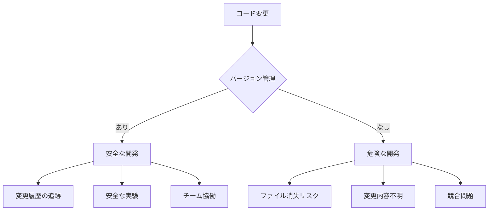
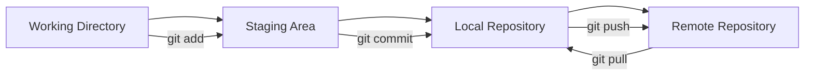
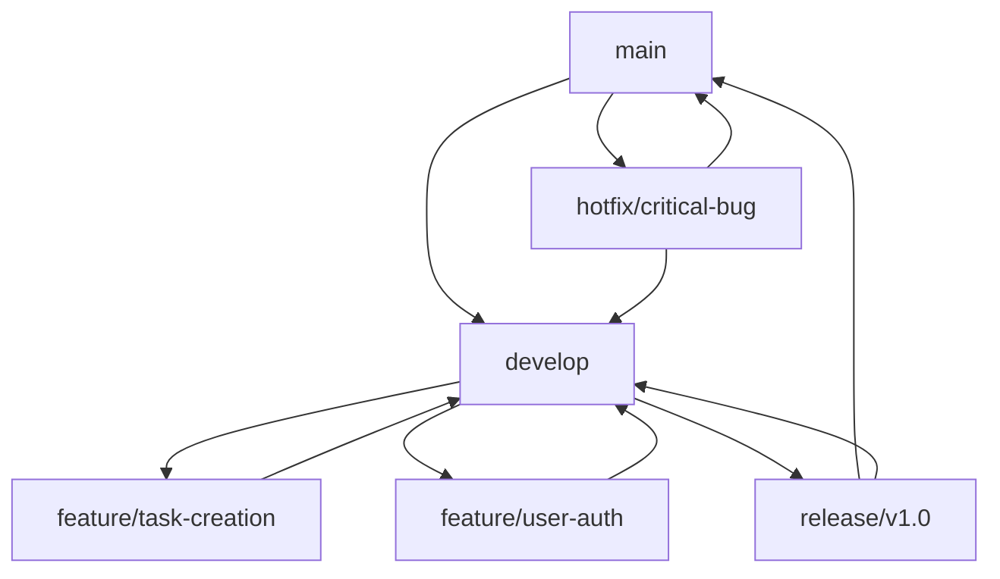
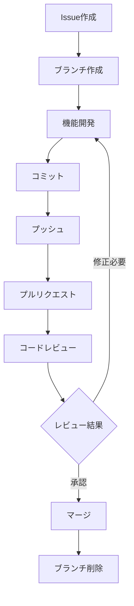
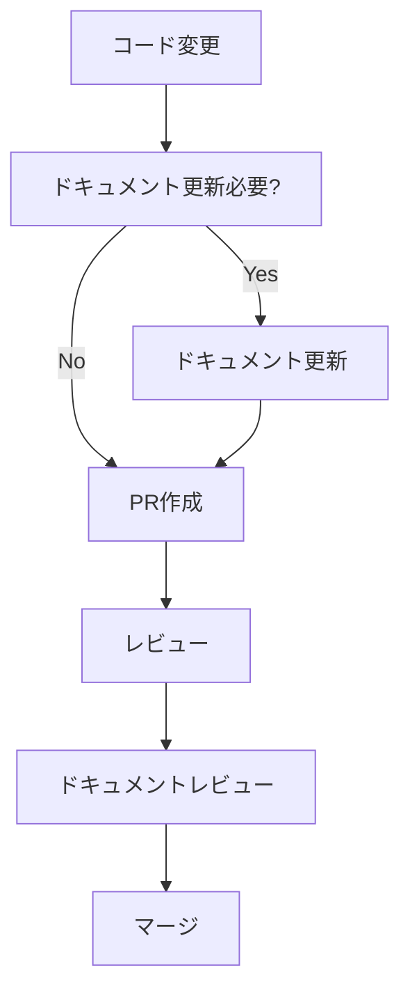

# バージョン管理とドキュメント作成

## 概要
開発プロジェクトの管理に不可欠なバージョン管理システム（Git/GitHub）と、AI駆動による効率的なドキュメント作成手法を学習します。プロジェクトの品質向上と継続的な改善のための実践的な手法を習得します。

## 学習目標
- Git/GitHubによるバージョン管理の基本概念と操作方法を習得する
- チーム開発でのGitHub活用方法を理解する
- RooCodeを活用した高速ドキュメント作成手法を学ぶ
- プロジェクト管理のベストプラクティスを理解する

## 内容

### 1. Gitとバージョン管理

#### バージョン管理の重要性

**バージョン管理とは：**
ファイルの変更履歴を記録し、過去の状態に戻したり、変更内容を追跡したりするシステムです。

**バージョン管理の必要性：**


**バージョン管理のメリット：**
- **変更履歴の保存**: いつ、誰が、何を変更したかを記録
- **安全な実験**: 新機能を安全に試せる
- **チーム協働**: 複数人での同時開発が可能
- **バックアップ**: 分散型でデータ消失リスクを軽減

#### Gitの基本概念

**Gitの仕組み：**


**主要な概念：**
- **Repository（リポジトリ）**: プロジェクトの保存場所
- **Commit（コミット）**: 変更の記録単位
- **Branch（ブランチ）**: 並行開発のための分岐
- **Merge（マージ）**: ブランチの統合

#### ローカルリポジトリとリモートリポジトリ

**ローカルリポジトリ：**
```bash
# 新しいリポジトリの初期化
git init

# 既存リポジトリのクローン
git clone https://github.com/username/repository.git

# 現在の状態確認
git status

# 変更内容の確認
git diff
```

**基本的なGitワークフロー：**
```bash
# 1. ファイルの変更
echo "Hello World" > README.md

# 2. ステージングエリアに追加
git add README.md
# または全ファイル
git add .

# 3. コミット（変更を記録）
git commit -m "Add README file"

# 4. リモートリポジトリにプッシュ
git push origin main
```

**コミットメッセージのベストプラクティス：**
```bash
# 良いコミットメッセージの例
git commit -m "feat: Add task creation functionality"
git commit -m "fix: Resolve login authentication issue"
git commit -m "docs: Update API documentation"
git commit -m "refactor: Improve code structure in TaskManager"

# 悪いコミットメッセージの例
git commit -m "update"
git commit -m "fix bug"
git commit -m "changes"
```

### 2. GitHubの活用

#### GitHubアカウントの作成と基本設定

**GitHubとは：**
Gitリポジトリのホスティングサービスで、コラボレーション機能を提供します。

**基本設定手順：**
```bash
# Git設定（初回のみ）
git config --global user.name "Your Name"
git config --global user.email "your.email@example.com"

# SSH鍵の生成（推奨）
ssh-keygen -t ed25519 -C "your.email@example.com"

# SSH鍵をGitHubに登録
cat ~/.ssh/id_ed25519.pub
# 出力された内容をGitHubのSSH Keysに登録
```

#### リポジトリの作成と管理

**新しいリポジトリの作成：**
```bash
# GitHubでリポジトリ作成後
git remote add origin git@github.com:username/repository.git
git branch -M main
git push -u origin main
```

**リポジトリ構造の例：**
```
task-manager/
├── .github/
│   ├── workflows/          # GitHub Actions
│   └── ISSUE_TEMPLATE/     # Issue テンプレート
├── docs/
│   ├── README.md
│   ├── API.md
│   └── CONTRIBUTING.md
├── src/
├── tests/
├── .gitignore
├── package.json
└── README.md
```

**効果的な.gitignoreファイル：**
```gitignore
# Node.js
node_modules/
npm-debug.log*
yarn-debug.log*
yarn-error.log*

# Next.js
.next/
out/

# 環境変数
.env
.env.local
.env.development.local
.env.test.local
.env.production.local

# IDE
.vscode/
.idea/

# OS
.DS_Store
Thumbs.db

# ログファイル
*.log

# 一時ファイル
*.tmp
*.temp
```

#### ブランチ戦略

**Git Flow戦略：**


**ブランチの基本操作：**
```bash
# 新しいブランチの作成と切り替え
git checkout -b feature/task-creation

# ブランチの一覧表示
git branch

# ブランチの切り替え
git checkout main

# ブランチのマージ
git checkout main
git merge feature/task-creation

# ブランチの削除
git branch -d feature/task-creation
```

#### プルリクエストとコードレビュー

**プルリクエスト（PR）の作成：**
```markdown
## 概要
タスク作成機能を追加しました。

## 変更内容
- [ ] TaskForm コンポーネントの実装
- [ ] バリデーション機能の追加
- [ ] API連携の実装
- [ ] テストケースの追加

## テスト方法
1. ローカル環境で `npm run dev` を実行
2. `/tasks/new` にアクセス
3. タスク作成フォームの動作を確認

## スクリーンショット


## チェックリスト
- [ ] コードレビューを受けた
- [ ] テストが通ることを確認
- [ ] ドキュメントを更新
```

**コードレビューのポイント：**
```yaml
review_checklist:
  functionality:
    - "要件通りに動作するか"
    - "エラーハンドリングは適切か"
    - "パフォーマンスに問題はないか"
  
  code_quality:
    - "コードは読みやすいか"
    - "命名規則に従っているか"
    - "重複コードはないか"
  
  security:
    - "セキュリティ脆弱性はないか"
    - "入力値の検証は適切か"
    - "機密情報の漏洩はないか"
  
  testing:
    - "テストケースは十分か"
    - "テストが通るか"
    - "カバレッジは適切か"
```

### 3. チーム開発での活用

#### 複数人での開発フロー

**チーム開発のワークフロー：**


**効果的なチーム開発ルール：**
```yaml
team_rules:
  branching:
    - "機能ごとにブランチを作成"
    - "ブランチ名は機能を表す名前にする"
    - "mainブランチへの直接コミット禁止"
  
  commits:
    - "小さな単位でコミット"
    - "わかりやすいコミットメッセージ"
    - "関連のない変更は別コミットにする"
  
  pull_requests:
    - "必ずレビューを受ける"
    - "テストが通ることを確認"
    - "説明文を詳しく書く"
```

#### コンフリクトの解決

**マージコンフリクトとは：**
複数の人が同じファイルの同じ箇所を変更した際に発生する競合です。

**コンフリクト解決の手順：**
```bash
# 1. 最新のmainブランチを取得
git checkout main
git pull origin main

# 2. 作業ブランチにmainをマージ
git checkout feature/my-feature
git merge main

# 3. コンフリクトが発生した場合
# ファイルを編集してコンフリクトを解決

# 4. 解決後にコミット
git add .
git commit -m "Resolve merge conflict"
```

**コンフリクトファイルの例：**
```javascript
function calculateTotal(items) {
<<<<<<< HEAD
  // 自分の変更
  return items.reduce((sum, item) => sum + item.price * 1.1, 0);
=======
  // 他の人の変更
  return items.reduce((total, item) => total + item.cost, 0);
>>>>>>> main
}
```

**解決後：**
```javascript
function calculateTotal(items) {
  // 税込み価格で計算
  return items.reduce((sum, item) => sum + item.price * 1.1, 0);
}
```

#### Issue管理とプロジェクト管理

**GitHub Issuesの活用：**
```markdown
# Issue テンプレート例

## バグ報告
**概要**
バグの簡潔な説明

**再現手順**
1. '...' に移動
2. '....' をクリック
3. '....' まで下にスクロール
4. エラーを確認

**期待される動作**
何が起こるべきかの明確で簡潔な説明

**実際の動作**
実際に何が起こったかの明確で簡潔な説明

**スクリーンショット**
該当する場合、問題を説明するのに役立つスクリーンショットを追加

**環境**
- OS: [例: iOS]
- ブラウザ [例: chrome, safari]
- バージョン [例: 22]
```

**プロジェクトボードの活用：**
```yaml
project_board_columns:
  backlog: "実装予定の機能"
  todo: "次に取り組む作業"
  in_progress: "現在作業中"
  review: "レビュー待ち"
  done: "完了した作業"
```

### 4. RooCodeを活用したドキュメント作成

#### RooCodeの概要と特徴

**RooCodeとは：**
AI駆動による高速ドキュメント作成ツールです。

**主な特徴：**
- **AI支援**: 自然言語からドキュメント生成
- **多様な形式**: Markdown、HTML、PDF対応
- **テンプレート**: 豊富なドキュメントテンプレート
- **自動化**: コードからドキュメント自動生成

#### AIを活用した高速ドキュメント作成

**ドキュメント生成のプロンプト例：**
```
「以下のReactコンポーネントのAPIドキュメントを作成してください：

コンポーネント名: TaskItem
Props:
- id: string
- title: string
- completed: boolean
- onToggle: (id: string) => void
- onDelete: (id: string) => void

機能: タスクの表示、完了切り替え、削除」
```

**生成されるドキュメント例：**
```markdown
# TaskItem コンポーネント

## 概要
個別のタスクを表示し、完了状態の切り替えと削除機能を提供するコンポーネントです。

## Props

| プロパティ | 型 | 必須 | 説明 |
|-----------|---|------|------|
| id | string | ✓ | タスクの一意識別子 |
| title | string | ✓ | タスクのタイトル |
| completed | boolean | ✓ | タスクの完了状態 |
| onToggle | (id: string) => void | ✓ | 完了状態切り替え時のコールバック |
| onDelete | (id: string) => void | ✓ | 削除時のコールバック |

## 使用例

```jsx
<TaskItem
  id="task-1"
  title="プロジェクト資料作成"
  completed={false}
  onToggle={(id) => console.log(`Toggle task: ${id}`)}
  onDelete={(id) => console.log(`Delete task: ${id}`)}
/>
```

## 動作

- タスクタイトルをクリックすると完了状態が切り替わります
- 削除ボタンをクリックするとタスクが削除されます
- 完了したタスクは取り消し線で表示されます
```

#### 技術文書の自動生成

**API仕様書の自動生成：**
```
プロンプト:
「以下のAPIエンドポイントの仕様書を作成してください：

エンドポイント: POST /api/tasks
機能: 新しいタスクを作成
リクエストボディ: { title: string, description?: string, priority: 'high' | 'medium' | 'low' }
レスポンス: { id: string, title: string, description: string, priority: string, createdAt: string }」
```

**生成される仕様書：**
```markdown
# API仕様書

## POST /api/tasks

### 概要
新しいタスクを作成します。

### リクエスト

**URL:** `POST /api/tasks`

**Headers:**
```
Content-Type: application/json
```

**Body:**
```json
{
  "title": "string (必須)",
  "description": "string (任意)",
  "priority": "high | medium | low (必須)"
}
```

### レスポンス

**成功時 (200 OK):**
```json
{
  "id": "string",
  "title": "string",
  "description": "string",
  "priority": "string",
  "createdAt": "string (ISO 8601)"
}
```

**エラー時 (400 Bad Request):**
```json
{
  "error": "string",
  "message": "string"
}
```

### 使用例

```bash
curl -X POST http://localhost:3000/api/tasks \
  -H "Content-Type: application/json" \
  -d '{
    "title": "プロジェクト資料作成",
    "description": "来週のプレゼン用資料を作成する",
    "priority": "high"
  }'
```
```

#### README作成の自動化

**プロジェクトREADME生成プロンプト：**
```
「以下の情報を基にプロジェクトのREADMEを作成してください：

プロジェクト名: Task Manager
説明: React + TypeScript で作成されたタスク管理アプリ
技術スタック: Next.js, TypeScript, Tailwind CSS, Supabase
機能: タスクの作成、編集、削除、完了管理
セットアップ: npm install, npm run dev
デプロイ: Vercel」
```

**生成されるREADME：**
```markdown
# Task Manager

シンプルで使いやすいタスク管理アプリケーションです。React + TypeScriptで構築され、モダンなWebアプリケーションの機能を提供します。

## 🚀 特徴

- ✅ タスクの作成、編集、削除
- 🔄 完了状態の管理
- 📱 レスポンシブデザイン
- ⚡ 高速なパフォーマンス
- 🎨 モダンなUI/UX

## 🛠️ 技術スタック

- **Frontend:** Next.js, React, TypeScript
- **Styling:** Tailwind CSS
- **Database:** Supabase
- **Deployment:** Vercel

## 📦 セットアップ

### 前提条件

- Node.js 18.0.0 以上
- npm または yarn

### インストール

```bash
# リポジトリをクローン
git clone https://github.com/username/task-manager.git

# ディレクトリに移動
cd task-manager

# 依存関係をインストール
npm install

# 開発サーバーを起動
npm run dev
```

アプリケーションは http://localhost:3000 で利用できます。

## 🚀 デプロイ

このプロジェクトはVercelでデプロイできます：

[](https://vercel.com/new/clone?repository-url=https://github.com/username/task-manager)

## 📝 ライセンス

MIT License
```

### 5. ドキュメント管理のベストプラクティス

#### 効果的なドキュメント構成

**推奨ドキュメント構造：**
```
docs/
├── README.md                 # プロジェクト概要
├── CONTRIBUTING.md           # 貢献ガイドライン
├── CHANGELOG.md              # 変更履歴
├── api/
│   ├── README.md            # API概要
│   ├── authentication.md    # 認証
│   └── endpoints/
│       ├── tasks.md         # タスクAPI
│       └── users.md         # ユーザーAPI
├── guides/
│   ├── getting-started.md   # 開始ガイド
│   ├── deployment.md        # デプロイガイド
│   └── troubleshooting.md   # トラブルシューティング
└── architecture/
    ├── overview.md          # アーキテクチャ概要
    ├── database.md          # データベース設計
    └── security.md          # セキュリティ
```

#### 継続的なドキュメント更新

**ドキュメント更新のワークフロー：**


**自動化の活用：**
```yaml
# .github/workflows/docs.yml
name: Update Documentation

on:
  push:
    branches: [main]
    paths: ['src/**/*.ts', 'src/**/*.tsx']

jobs:
  update-docs:
    runs-on: ubuntu-latest
    steps:
      - uses: actions/checkout@v2
      - name: Generate API docs
        run: npm run docs:generate
      - name: Commit docs
        run: |
          git config --local user.email "action@github.com"
          git config --local user.name "GitHub Action"
          git add docs/
          git commit -m "Auto-update documentation" || exit 0
          git push
```

#### チーム内での情報共有

**効果的な情報共有方法：**
```yaml
communication_channels:
  documentation:
    - "GitHub Wiki"
    - "Notion"
    - "Confluence"
  
  real_time:
    - "Slack"
    - "Discord"
    - "Microsoft Teams"
  
  async:
    - "GitHub Issues"
    - "GitHub Discussions"
    - "Email"
```

### 6. 実践演習

#### 演習1: Git/GitHub基本操作
1. 新しいリポジトリを作成
2. ローカルでファイルを編集
3. コミット・プッシュの実行
4. ブランチ作成と切り替え

#### 演習2: チーム開発シミュレーション
1. フォークとクローン
2. 機能ブランチでの開発
3. プルリクエストの作成
4. コードレビューの実施

#### 演習3: ドキュメント作成
1. プロジェクトのREADME作成
2. API仕様書の作成
3. RooCodeを使った自動生成
4. ドキュメントの継続的更新

## 重要ポイント
- **バージョン管理の習慣化**: 小さな変更でもコミットする習慣
- **チーム協働**: コミュニケーションとレビューの重要性
- **ドキュメントの価値**: 将来の自分とチームメンバーのために
- **自動化の活用**: 手作業を減らし品質を向上

## まとめ
第二回講義では、AI駆動開発の実践的な手法を包括的に学習しました。LLMの基礎理解から始まり、要件定義、開発環境構築、実際の開発作業、技術スタックの理解、そしてプロジェクト管理まで、AI駆動開発に必要な全ての要素を習得しました。

これらの知識とスキルを活用して、効率的で高品質なソフトウェア開発を実践してください。

---

### 補足
- Gitは最初は複雑に感じるかもしれませんが、基本操作を繰り返すことで慣れます
- ドキュメント作成は開発と同じくらい重要な作業です
- AIツールを活用することで、ドキュメント作成の負担を大幅に軽減できます