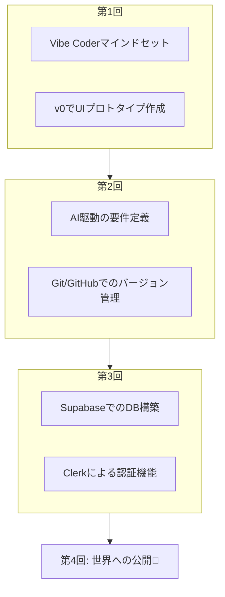

# 4-0 第3回までの振り返り

## 概要
第4回講義へようこそ！今回はデモデイ前の最終回です。これまでの学習がどのように繋がり、最終的なアプリケーション完成に至るのかを振り返ることで、デプロイという最後のステップへの理解を深めます。

## 学習目標
- 第1回から第3回までの学習内容の繋がりを理解する。
- 自分の現在地と最終ゴールまでの道のりを再確認する。
- 「デプロイ」がアプリケーション開発における最終工程としてなぜ重要なのかを認識する。

## これまでの道のり：アイデアから動くアプリの基盤まで

私たちは3回の講義を通じて、アイデアの種を具体的なアプリケーションの形に育ててきました。そのステップを振り返ってみましょう。

### 第1回：アイデアの具"現化"
- **学んだこと**: Vibe Coderとしての心構えと、AIを使ってアイデアを即座に視覚的な形（UI）にする方法。
- **成果物**: v0で作成したSNSアプリのUIプロトタイプ。
- **位置づけ**: プロジェクトの「見た目」の設計図が完成しました。

### 第2回：設計と"計画"
- **学んだこと**: 「Text is KING」の原則に基づき、AIと対話しながら曖昧なアイデアを構造化された詳細な設計書に落とし込む方法。
- **成果物**: GitHubで管理された要件定義書、DB設計書、API設計書など。
- **位置づけ**: プロジェクトの「骨格と神経」の設計図が完成しました。

### 第3回：動的機能の"実装"
- **学んだこと**: UIと設計書を基に、Supabase（データベース）とClerk（認証）を連携させ、アプリケーションに「記憶」と「本人確認」の機能を与える方法。
- **成果物**: ログインができ、投稿データを保存する準備が整ったアプリケーションの基盤。
- **位置づけ**: プロジェクトに「心臓と脳」が組み込まれました。

## 現在地と次のステップ
現在、皆さんの手元には「見た目」と「設計図」があり、「心臓と脳」が動き出す準備が整った状態です。

しかし、このアプリケーションはまだあなたのPCの中でしか動作しません。これを友人や家族、そして世界中の人々に使ってもらうためには、インターネット上に公開する「**デプロイ**」という最後のステップが必要です。

次の章では、このデプロイとは何か、なぜ必要なのかを詳しく学んでいきましょう。