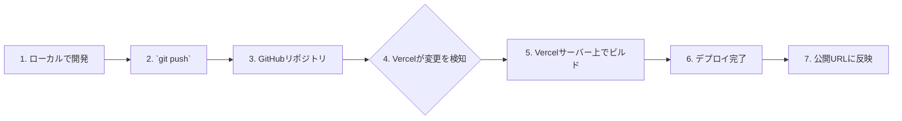

# 4-2 Vercelを使ったワンクリックデプロイ（ハンズオン）

## 概要
この章では、いよいよあなたのアプリケーションを世界に公開します。Next.jsの開発元であるVercelが提供するホスティングサービスを使い、GitHubと連携した驚くほど簡単なデプロイプロセスを体験します。

## 学習目標
- Vercelのアカウントを作成し、GitHubと連携できる。
- VercelのダッシュボードからNext.jsプロジェクトをインポートできる。
- `git push` をトリガーに、アプリケーションが自動でデプロイされる流れを理解する。
- デプロイされたアプリケーションに公開URLでアクセスできることを確認する。

## なぜVercelを選ぶのか？
世の中にはGCP Cloud RunやAWS App Runnerなど多くのデプロイ先がありますが、この研修ではVercelを推奨します。

- **Next.jsとの最高の相性**: Next.jsの開発元が作っているため、最適化や新機能への対応が最も早いです。
- **簡単なセットアップ**: GitHubアカウントでログインし、数クリックでデプロイが完了します。複雑なインフラ設定は不要です。
- **寛大な無料枠**: 個人の学習や小規模なプロジェクトであれば、無料で十分に運用可能です。
- **自動デプロイ**: `git push` するだけで、Vercelが自動でビルドとデプロイを行ってくれます。

## デプロイフローの全体像

Vercelを使ったデプロイは、以下の流れで自動的に行われます。

## ハンズオン：アプリケーションをデプロイしよう

### ステップ1：GitHubリポジトリの準備
- デプロイしたいNext.jsプロジェクトが、GitHubのリポジトリにプッシュされていることを確認してください。
- `main` ブランチが最新の状態になっていることを確認します。

### ステップ2：Vercelアカウントの作成と連携
1.  [Vercelの公式サイト](https://vercel.com/)にアクセスします。
2.  「Sign Up」をクリックし、「Continue with GitHub」を選択します。
3.  GitHubの認証画面が表示されたら、承認してVercelとGitHubアカウントを連携させます。

### ステップ3：プロジェクトのインポート
1.  Vercelのダッシュボードで、「Add New...」>「Project」を選択します。
2.  「Import Git Repository」の画面で、先ほど準備したGitHubリポジトリの横にある「Import」ボタンをクリックします。
3.  必要に応じて、VercelにGitHubリポジトリへのアクセス権限を許可します。

### ステップ4：デプロイ設定の確認
プロジェクトをインポートすると、設定画面が表示されます。

- **Framework Preset**: Vercelが自動で「Next.js」を検出してくれるはずです。
- **Build and Output Settings**: 基本的に自動で設定されるため、変更は不要です。
- **Environment Variables**: 次の章で設定しますが、今は空のままでOKです。

### ステップ5：デプロイの実行
- 「Deploy」ボタンをクリックします。
- これでデプロイプロセスが開始されます。ビルドとデプロイのログがリアルタイムで表示されます。

### ステップ6：デプロイ完了と動作確認
- 数分後、ビルドとデプロイが完了すると、お祝いの画面が表示されます。
- 画面に表示されている公開URL（例: `https://your-project-name.vercel.app`）にアクセスし、あなたのアプリケーションがインターネット上で表示されることを確認しましょう！

## まとめ
おめでとうございます！あなたは今、自分の手で開発したアプリケーションを世界に公開しました。Vercelを使えば、このように驚くほど簡単にデプロイが可能です。

しかし、現状ではデータベースや認証のAPIキーが設定されていないため、一部の機能は正しく動作しないはずです。次の章では、本番環境でこれらの秘密情報を安全に設定する方法を学びます。